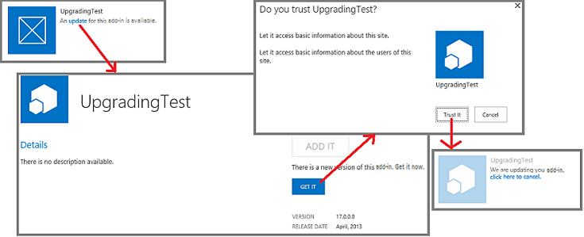

# Aktualisierungsverfahren für SharePoint-Add-InsSharePoint Add-ins update process
Informieren Sie sich über das Verfahren zum Aktualisieren von SharePoint-Add-Ins.Learn about the process for updating SharePoint Add-ins.
 

 **Hinweis** Der Name „Apps für SharePoint“ wird in „SharePoint-Add-Ins“ geändert. Während des Übergangszeitraums wird in der Dokumentation und der Benutzeroberfläche einiger SharePoint-Produkte und Visual Studio-Tools möglicherweise weiterhin der Begriff „Apps für SharePoint“ verwendet. Weitere Informationen finden Sie unter [Neuer Name für Office- und SharePoint-Apps](new-name-for-apps-for-sharepoint#bk_newname).The name "apps for SharePoint" is changing to "SharePoint Add-ins". During the transition, the documentation and the UI of some SharePoint products and Visual Studio tools might still use the term "apps for SharePoint". For details, see [New name for apps for Office and SharePoint](new-name-for-apps-for-sharepoint#bk_newname).
 

Sie müssen ein SharePoint-Add-In aktualisieren, wenn Sie Funktionen hinzufügen, einen Fehler korrigieren oder ein Sicherheitsupdate durchführen. Ein Update für ein Add-In wird auf die gleiche Weise in einem SharePoint-Add-In-Paket bereitgestellt wie das ursprüngliche Add-In. Mit dem Aktualisierungsverfahren für SharePoint-Add-Ins wird sichergestellt, dass die Daten des Add-Ins erhalten bleiben, wenn die Aktualisierung aus irgendeinem Grund fehlschlägt.You have to update a SharePoint Add-in if you add functionality, fix a bug, or make a security update. An update to an add-in is deployed in a spappsing package in the same way that the first version of the add-in is deployed. The SharePoint Add-in update process ensures that the add-in's data is preserved if the update fails for any reason.
 

 **Wichtig** Sie können den *Add-In-Typ* nicht über ein Update des Systems ändern. Sie können beispielsweise nicht ein in SharePoint gehostetes Add-In durch ein Update in ein vom Anbieter gehostetes Add-In ändern. Um den Add-In-Typ zu ändern, müssen Sie [von einem alten Add-In zu einem neuen Add-In migrieren](#Major). Insbesondere da [das Vorabprogramm für automatisch gehostete Add-Ins beendet wurde](http://blogs.office.com/2014/05/16/update-on-autohosted-apps-preview-program/), sollten Sie beachten, dass ein automatisch gehostetes Add-In nicht durch ein Update in ein vom Anbieter gehostetes Add-In geändert werden kann. Sie müssen das Add-In wie in [Konvertieren eines automatisch gehosteten SharePoint-Add-Ins in ein vom Anbieter gehostetes Add-In](convert-an-autohosted-sharepoint-add-in-to-a-provider-hosted-add-in) erklärt konvertieren.**Important** You cannot change the  *add-in type*  using the update system. For example, you cannot change an add-in from SharePoint-hosted to provider-hosted with an update. To make a change of type, you need to [migrate from an old add-in to a new one](#Major). In particular, since  [the preview program for autohosted add-ins has been closed](http://blogs.office.com/2014/05/16/update-on-autohosted-apps-preview-program/), you should be aware that you cannot update an autohosted add-in to a provider-hosted add-in. You have to convert the add-in as explained in  [Convert an autohosted SharePoint Add-in to a provider-hosted add-in](convert-an-autohosted-sharepoint-add-in-to-a-provider-hosted-add-in).
 

## Aktualisierungsverfahren für ein SharePoint-Add-InUpdate process for a SharePoint Add-in

Sie verwenden für Aktualisierungen dieselbe Produkt-ID im Add-In-Manifest, die Sie für die ursprüngliche Version verwendet haben. Die Versionsnummer im Add-In-Manifest sollte größer als die Versionsnummer des Original-Add-Ins oder der letzten Aktualisierung sein.For an update, you use the same product ID in the add-in manifest that you used for the original version. The version number in the add-in manifest should be greater than the version number of the original add-in or the most recent update.
 

 
Innerhalb von 24 Stunden, nachdem Sie das Update im Add-In-Katalog eines Unternehmens bereitgestellt haben, und innerhalb einer Woche, nachdem Sie es in den Office Store hochgeladen haben, wird auf der Seite **Websiteinhalte** jeder Website, auf der das Add-In installiert ist, neben dem Add-In-Eintrag angezeigt, dass ein Update verfügbar ist. Die Benutzer können auf einen Hyperlink klicken, um das Add-In zu aktualisieren (siehe Abbildung 1). Verfügbare Updates werden auch in der Mandantenverwaltungsoberfläche angezeigt.Within 24 hours after you upload your update to an organization's add-in catalog, and within a week of uploading it to the Office Store, an indication that an update is available appears next to the add-in's listing on the **Site Contents** page of every website where it is installed. Users can click a link to update the add-in as shown in Figure 1. Available updates are also exposed in the tenant management UI.
 

 

**Abbildung 1: Updateprozess für SharePoint-Add-Ins****Figure 1 Add-in for SharePoint upgrade process**

 

 

 

    
 **Tipp** Wenn Sie ein Update entwickeln, möchten Sie nicht jedes Mal 24 Stunden warten, wenn Sie eine neue Version in Ihren SharePoint-Add-In-Testkatalog hochladen. Informationen dazu, wie Sie ein Add-In sofort aktualisieren, finden Sie unter [Aktualisieren eines Add-Ins, ohne 24 Stunden zu warten](update-sharepoint-add-ins#ImmediateUpdateNotice). SharePoint prüft standardmäßig alle 24 Stunden auf Updates für installierte Add-Ins. Ein Farmadministrator kann hierfür einen anderen Wert festlegen, indem er den folgenden SharePoint-Verwaltungsshell-Befehl verwendet, wobei n für die Anzahl der Stunden zwischen Prüfungen liegt. `Set-SPInternalAppStateUpdateInterval -AppStateSyncHours n` Wird der Wert auf 0 festgelegt, wird die Prüfung jedes Mal durchgeführt, wenn der integrierte Timer-Job **Interne Add-In-Statusaktualisierung** ausgeführt wird, was standardmäßig jede Stunde ist. Farmadministratoren können die Häufigkeit des Timer-Jobs über die zentrale Verwaltung ändern oder diesen sofort ausführen.**Tip**   When you are developing an update, you don't want to wait 24 hours every time you upload a new version to your test SharePoint add-in catalog. See [Update an add-in without waiting 24 hours ](update-sharepoint-add-ins#ImmediateUpdateNotice) for information about how to immediately update an add-in. By default, SharePoint checks every 24 hours for updates to installed add-ins. A farm administrator can set this to another value by using the following SharePoint Management Shell command, wheren is the number of hours between checks. `Set-SPInternalAppStateUpdateInterval -AppStateSyncHours n` If the value is set to 0, then the check is made every time the built-in timer job **Internal Add-in State Update** executes, which by default is every hour. Farm administrators can use Central Admin to change the frequency of the timer job or run it immediately.
 

SharePoint führt die folgenden Aktionen aus, wenn ein Benutzer ein Update für eine SharePoint-Add-In installiert. Diese Ereignisse erfolgen nicht unbedingt in der unten angegebenen Reihenfolge. Einige Aktionen können auch gleichzeitig erfolgen. Wenn das Update fehlschlägt, wird außerdem ein vollständiges Rollback ausgeführt.SharePoint will do the following when a user installs an update to a SharePoint Add-in. These events do not necessarily occur in exactly this order, and some of them may occur in parallel. Also, if update fails, there is a complete rollback.
 

 

 

- SharePoint fordert den Benutzer auf, von dem Add-In angeforderte Berechtigungen zu genehmigen.SharePoint prompts the user to approve permissions requested by the add-in.
    
 
- SharePoint sperrt das Add-In zeitweilig für Benutzerzugriffe.SharePoint makes the add-in unavailable to users temporarily.
    
 
- Wenn das Add-In ein SharePoint-Lösungspaket (.WSP) enthält und sich der Inhalt dieses Lösungspakets verändert hat, dann führt SharePoint Folgendes aus:If the add-in contains a SharePoint solution package (.wsp), and the contents of the solution package have changed in any way, SharePoint does the following:
    
      - Erstellt eine Sicherungskopie des Add-In-Webs. (Die tatsächlich in SharePoint-Listen enthaltenen Daten werden in SharePoint Online und in lokalen SharePoint 2016-Bereitstellungen und höher nur gesichert, wenn durch das Update eine Änderung im Schema der Liste vorgenommen wird).Makes a backup of the add-in web. (But, in SharePoint Online and in on-premises SharePoint 2016 and later, the actual data in SharePoint lists is backed up only if the update is making a change in the list's schema.)
    
 
  - Das Update wird an der Sicherungskopie getestet.Tests the update of the backup.
    
 
  - Wenn der Test erfolgreich verläuft, wird das Original-Add-In-Web aktualisiert. Beachten Sie, dass die neue im Add-In-Paket enthaltene WSP-Datei zur Aktualisierung der Features und anderen Elemente des Add-In-Webs verwendet wird. (Die Updatekomponenten des Featureschemas wurden in SharePoint erweitert.)If the test succeeds, updates the original add-in web. Note that the new .wsp file in the add-in package is used to update the Features and other elements in the add-in web. (The update parts of the Feature schema have been expanded in SharePoint.)
    
 
- SharePoint führt den **UpgradedEventEndpoint**-Webdienst aus, wenn im Add-In-Manifest einer registriert ist.SharePoint executes the **UpgradedEventEndpoint** web service, if any is registered in the add-in manifest.
    
     **Hinweis** Handelt es sich um ein von einem Anbieter gehostetes Add-In, dann stellen Sie die Updatelogik für alle Komponenten des Add-Ins bereit, die keine SharePoint-Komponenten sind. Sie aktualisieren diese Logik größtenteils separat vom Update des SharePoint-Add-Ins selbst, genauso wie Sie diese Komponenten separat von der Installation des Add-Ins installiert haben. Es kann aber einige Änderungen geben, die nur durchgeführt werden sollten, wenn ein Benutzer das SharePoint-Add-In aktualisiert. Diese Logik kann in einen **UpgradedEventEndpoint**-Webdienst oder in die Logik für die „erste Ausführung nach dem Update“ eingefügt werden.**Note** If the add-in is provider-hosted, you provide the update logic for all the non-SharePoint components of the add-in. For the most part, you update these components separately from the update of the SharePoint Add-in itself, just as you installed these components separately from the installation of the add-in. But there may be some changes that should only happen when a user is updating the SharePoint Add-in. This logic can go in an **UpgradedEventEndpoint** web service or in "first run after update" logic of the add-in itself.
- SharePoint macht das Add-In und die zugehörigen Komponenten wieder verfügbar.SharePoint makes the add-in and its components available again.
    
 

    
 **Hinweis** Wenn das Schema einer Liste im Add-In-Web geändert wird, wird die Liste zusammen mit dem restlichen Add-In-Web gesichert. Dieser Vorgang kann einige Zeit in Anspruch nehmen, wenn die Liste viele Daten enthält. Wenn der Updateprozess nach einer Stunde nicht abgeschlossen ist, wird er angehalten und das Update zurückgesetzt.**Note** If the schema of any list in the add-in web is being changed, then the list is backed up along with the rest of the add-in web. This can take some time if there is a lot of data in the list. If the update process cannot complete in 1 hour, it stops and the update is rolled back.
 

## Migrieren von einem alten Add-In zu einen neuenMigrating from an old add-in to a new one

In einigen Szenarien ist es sinnvoll, eine völlig neues Add-In zu erstellen, das ein altes Add-In ersetzt, statt das ursprüngliche Add-In zu aktualisieren. Das neue Add-In kann den gleichen Anzeigenamen haben wie das alte Add-In, muss jedoch im Add-In-Manifest eine neue Produkt-ID erhalten. Sie wird im öffentlichen Office Store sowie auf SharePoint-Websites auf der Seite **Add-In hinzufügen** als (von der Originalversion unabhängiges) separates Element angezeigt.In some scenarios you may want to produce an entirely new add-in to replace an old one, rather than update the original one. The new add-in can have the same friendly name as the old, but it must be given a new product ID in the add-in manifest, and it will appear in the public Office Store and in the **Add an Add-in** page of SharePoint websites as a distinct item from the original version.
 

 

 **Hinweis** Elemente im Add-In-Katalog einer Organisation werden durch den *Dateinamen* des Add-In-Pakets unterschieden, nicht durch die Produkt-ID oder den Namen des Add-Ins. Wenn das neue Add-In den gleichen Paketdateinamen hat wie das alte Add-In, wird das alte Add-In im Add-In-Katalog ersetzt, und das alte Add-In wird nicht mehr auf der Seite **Add-In hinzufügen** angezeigt. Wenn Sie Versionsverwaltung für das Add-In-Paket aktivieren, wenn Sie es zum Katalog hochladen, bleibt die alte Version der Datei (das alte Add-In) im Verlauf des Elements verfügbar. Sie können das alte Add-In-Paket herunterladen oder es wiederherstellen. Sowohl die alten als auch die neuen Add-Ins können aber nur dann als separate Elemente im Katalog oder auf der Seite **Add-In hinzufügen** platziert werden, wenn sie unterschiedliche Dateinamen haben.**Note** Items in an organization's add-in catalog are distinguished by the  *file name*  of the add-in package, not the product ID or the name of the add-in. If the new add-in has the same package file name as the old, it will replace the old one in the add-in catalog, and the old add-in will no longer appear on the **Add an Add-in** page. If you enable versioning on the add-in package when you upload it to the catalog, the old version of the file (which is the old app) is still available in the item's history. You can download the old add-in package or revert to it, but there is no way to have both the old and new add-ins as separate items in the catalog or on the **Add an Add-in** page, unless they have distinct file names.
 

In manchen Fällen kann es erforderlich sein, Daten zu migrieren. Das neue Add-In kann beispielsweise eine Microsoft Azure SQL-Datenbank-Datenbank verwenden, die ein anderes Schema als bei dem alten Add-In hat. Oder das neue Add-In verwendet einen anderen Datenspeicherungsmechanismus, z. B. eine externe Datenbank statt SharePoint-Listen. Sie müssen den Code für die Datenmigration bereitstellen.In some cases, you might need to migrate data. For example, the new add-in might use a Microsoft Azure SQL Database that has a different schema from the old add-in. Or the new add-in might use a different data storage mechanism; for example, an external database instead of SharePoint lists. You must provide the code for data migration.
 

 
Wenn sich die alten Daten an einem Speicherort befinden, auf den ein Remoteereignishandler zugreifen kann, dann können Sie die Migrationslogik in einen **InstalledEventEndpoint**-Webdienst des neuen Add-Ins implementieren. Wenn das neue Add-In Zugriff auf die alten Daten hat, können Sie stattdessen die Migrationslogik in Code einfügen, der beim ersten Start des neuen Add-Ins ausgeführt wird. Sind die alten Daten weder für Remoteereignishandler noch für das neue Add-In zugänglich, dann können Sie ein Update des alten Add-Ins erstellen, um eine Datenexportfunktion und eine Benutzeroberfläche für die Funktion hinzuzufügen. Benutzer würden zuerst das alte Add-In aktualisieren und es dann verwenden, um die Daten an einen Speicherort zu exportieren, auf den das neue Add-In zugreifen kann. Die Funktion und die Benutzeroberfläche zum Importieren von Daten fügen Sie in das neue Add-In ein.If your old data is somewhere that can be accessed by a remote event handler, you can implement migration logic in an **InstalledEventEndpoint** web service of the new add-in. Alternatively, if the new add-in has access to the old data, you can put the migration logic in code that runs the first time that a user starts the new add-in. If the old data cannot be accessed by either the remote handlers or the new add-in, you can create an update of the old add-in that adds a data export capability and a UI for the capability. Users would first update the old add-in, and then use it to export the data to a location where the new add-in can access it. You include the capability and UI to import data in the new add-in.
 

 
Im Prinzip können Sie eine externe Datenquelle, Rechenkomponente oder eine andere externe Komponente in dem neuen Add-In wiederverwenden, die in dem alten Add-In verwendet wurde. Beachten Sie aber, dass bei der Deinstallation einer SharePoint-Add-In die SharePoint-Infrastruktur alle installierten Komponenten deinstalliert. Daher sollte eine SharePoint-Add-In nur von ihr installierte Komponenten oder externe Komponenten verwenden, die nicht von der SharePoint-Infrastruktur installiert wurden.In principle, you can reuse an external data source, compute component, or other external component in the new add-in that was used in the old add-in. Consider, however, that when a SharePoint Add-in is uninstalled, the SharePoint infrastructure will uninstall everything that it installed. Accordingly, it is generally a good practice for a SharePoint Add-in to depend on only components that it installed or external components that were not installed by the SharePoint infrastructure.
 

 

 **Hinweis** Wenn Sie einen **InstalledEventEndpoint** oder einen **UpgradedEventEndpoint** implementieren, der Komponenten installiert, empfehlen wir, auch einen **UninstallingEventEndpoint** zu implementieren, der diese Komponenten deinstalliert. Dadurch werden die Designgrundsätze erfüllt, dass Add-Ins eigenständig sein und sauber deinstalliert werden sollten. Daten, die für die Benutzer auch nach der Deinstallation des Add-Ins nützlich wären, sollten aber nicht entfernt werden. Websites, die durch ein Add-In erstellt wurden - mit Ausnahme des Add-In-Webs - sollten als Daten betrachtet werden.**Note** We recommend that if you implement an **InstalledEventEndpoint** or an **UpgradedEventEndpoint** that installs components, you should also implement an **UninstallingEventEndpoint** that uninstalls those same components. Doing so conforms to the design principles that add-ins should be self-contained and uninstall cleanly. However, data that would still be useful to users after the add-in is uninstalled should not be deleted. Websites created by an add-in, other than the add-in web, should usually be considered data.
 

Wenn sowohl das alte als auch das neue Add-In jeweils ein Add-In-Web enthalten, müssen Sie berücksichtigen, dass das neue Add-In-Web während der Installation des neuen Add-Ins erstellt wird. Verwenden Sie daher nicht das zum Update gehörige XML-Markup im SharePoint-Featureschema. Dieses Markup funktioniert nicht, weil Sie keine vorhandenen SharePoint-Komponenten aktualisieren, sondern ein altes Add-In durch ein neues Add-In ersetzen.If the old and new add-ins each contain an add-in web, consider that a new add-in web is created when your new add-in is installed. For this reason, you should not use the update-related XML markup in the SharePoint Feature schema. Such markup does not work because you are not updating existing SharePoint components; you are replacing an old add-in with a new one.
 

 

## Zusätzliche RessourcenAdditional resources

-  [Aktualisieren von SharePoint-Add-InsUpdate SharePoint Add-ins](update-sharepoint-add-ins)
    
 
-  [Aktualisieren von Add-In-Webkomponenten in SharePointUpdate add-in web components in SharePoint](update-add-in-web-components-in-sharepoint-2013)
    
 
-  [Aktualisieren von Hostwebkomponenten in SharePointUpdate host web components in SharePoint](update-host-web-components-in-sharepoint-2013)
    
 
-  [Erstellen eines Handlers für das Updateereignis in SharePoint-Add-InsCreate a handler for the update event in SharePoint Add-ins](create-a-handler-for-the-update-event-in-sharepoint-add-ins)
    
 
-  [Aktualisieren von Remotekomponenten in SharePoint-Add-InsUpdate remote components in SharePoint Add-ins](update-remote-components-in-sharepoint-add-ins)
    
 
-  [Veröffentlichen von SharePoint-Add-InsPublish SharePoint Add-ins](publish-sharepoint-add-ins)
    
 
-  [Kritische Aspekte der Architektur und der Entwicklungslandschaft für SharePoint-Add-InsImportant aspects of the SharePoint Add-in architecture and development landscape](important-aspects-of-the-sharepoint-add-in-architecture-and-development-landscape)
    
 
-  [Bereitstellen und Installieren von SharePoint-Add-Ins: Methoden und OptionenDeploying and installing SharePoint Add-ins: methods and options](deploying-and-installing-sharepoint-add-ins-methods-and-options)
    
 

