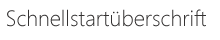
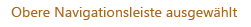
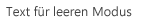
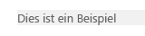
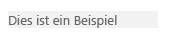
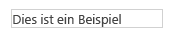
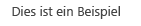

# <a name="sharepoint-add-ins-ux-design-guidelines"></a>Designrichtlinien für die Benutzerfreundlichkeit von Add-Ins für SharePoint

Add-Ins sind ein neues Konzept für SharePoint und ermöglichen Endbenutzern, ihren Websites neue Funktionen hinzuzufügen und dabei die Zuverlässigkeit der SharePoint-Site weiterhin zu gewährleisten. Zum Erstellen eines guten Add-Ins gehört nicht nur, interessante Funktionen bereitzustellen (obwohl dies ebenfalls wichtig ist), sondern auch sicherzustellen, dass das Add-In gut aussieht und sich nahtlos in die Website, auf der es installiert wird, einfügt.

<a name="UXGuide_AppChrome"> </a>
## <a name="choosing-the-chrome-for-your-add-in"></a>Wahl des Chrom für Ihr Add-In

Beim Erstellen eines Add-Ins müssen Sie als erstes entscheiden, wie ausgeprägt das Branding Ihrer Seiten sein soll und wo diese gehostet werden sollen. Auf der Grundlage dieser Optionen liegt es dann auf der Hand, welche Technologie Sie für den Betrieb Ihres Chrom verwenden:

- **In SharePoint gehostete ASPX-Seiten:** Verwenden Sie die Add-In-Vorlage.
- **In SharePoint gehostete HTML-Seiten oder beliebige Seiten außerhalb von SharePoint:** Verwenden Sie das Chromsteuerelement.
- **Seiten mit benutzerdefiniertem Branding:** Verwenden Sie ein eigenes Chrom.

<a name="UXGuide_AppTemplate"> </a>
### <a name="using-the-add-in-template-for-sharepoint-hosted-pages"></a>Verwenden der Add-In-Vorlage für in SharePoint gehostete Seiten

Die Add-In-Vorlage kann nur für in SharePoint gehostete ASPX-Seiten verwendet werden. Die Vorlage enthält die **app.master**-Masterseite (die für ein Add-In geeignetes Chrom enthält und auf das Design der Hostwebsite abgestimmt ist), und verbirgt SharePoint-Funktionen, die entweder nicht funktionieren würden oder innerhalb einer Add-In-Web nicht sinnvoll sind. Abbildung 1 zeigt eine in SharePoint gehostete Seite, die die Add-In-Vorlage verwendet. 

*Abbildung 1. In SharePoint gehostete Seite, die die Add-In-Vorlage verwendet*


 
Die Add-In-Vorlage ist die Standardvorlage in Visual Studio, wenn Sie eine Add-In-Website und Seiten innerhalb dieser Website erstellen.

<a name="UXGuide_ChromeControl"> </a>
### <a name="using-the-chrome-control-in-sharepoint-add-ins"></a>Verwenden des Client-Chromsteuerelements in SharePoint-Add-Ins

Wenn Sie keine in SharePoint gehosteten ASPX-Seiten erstellen, Ihr Add-In sich jedoch trotzdem problemlos in die Hostwebsite, von der aus es verwendet wird, einbinden lassen soll, ist das Chromsteuerelement die richtige Wahl. Abbildung 2 zeigt das Chromsteuerelement.

*Abbildung 2. Chromsteuerelement auf einer Webseite*


### <a name="to-use-the-chrome-control"></a>So verwenden Sie das Chromsteuerelement

1. Fügen Sie der Steuerelementbibliothek einen Verweis hinzu. Hierzu stehen Ihnen zwei Möglichkeiten zur Verfügung:
    
   - Verweisen Sie im Stamm des Layouts-Ordners auf die Bibliothek, wie im folgenden Beispiel dargestellt.
    
      ```
        <script 
          type="text/javascript" 
          src="http://{server URL}/_layouts/15/sp.ui.controls.js">
      </script>
      ```

   - Kopieren Sie die Bibliothek auf Ihre eigene Website und verweisen Sie dort auf sie.
    
   > [!CAUTION]
   > Wenn Sie sich für diese Alternative entscheiden, kann Ihr Add-In keine Aktualisierungen des Steuerelements nutzen

2. Fügen Sie das DOM-Platzhalterelement an der Position ein, an der das Steuerelement gerendert werden soll, wie in diesem Beispiel dargestellt.
    
    ```
      <div id='chromeControlContainer'></div>
    ```

3. Instanziieren Sie das Steuerelement.
    
    ```
      function addchromecontrol(){
        var options = {};
        options.siteTitle ="{host site title}";
        options.siteUrl = "{host URL}";
        options.appHelpPageUrl = "{help page URL}";
        options.appIconUrl = "{app icon URL}";
        options.appTitle = "add-in Title";
        nav = new SP.UI.Controls.Navigation("chromeControlContainer", options);
        nav.setVisible(true);
    }
    ```

4. (Optional) Wenn Sie keinen Titelbereich auf Ihrer Seite möchten, können Sie ihn entfernen, indem Sie den folgenden JavaScript-Code ausführen.
    
    ```
      nav.setBottomHeaderVisible(false);
    ```

Das Chromsteuerelement bietet zwei optionale Add-In-Symbole: eines in der oberen Navigationsleiste und eines im Titelbereich. Das Add-In-Symbol in der oberen Navigationsleiste umfasst 24 x 24 Pixel (px), das Symbol im Titelbereich hat die gleiche Größe wie SharePoint-Website-Symbole - max. 64 px auf 180 px. Es wird empfohlen, ein auf einem weißen, schwarzen, grauen, hellen und gedeckten Hintergrund getestetes PNG-Bild zu verwenden, da Benutzer und Administratoren das Websitedesign ändern können. Weitere Informationen über die Verwendung des Chromsteuerelements finden Sie unter [Verwenden des Client-Chromsteuerelements in Add-Ins für SharePoint](use-the-client-chrome-control-in-sharepoint-add-ins.md).

<a name="UXGuide_CustomUI"> </a>
### <a name="creating-a-custom-branded-ui-in-sharepoint-add-ins"></a>Erstellen einer benutzerdefinierten Branding-Benutzeroberfläche in SharePoint-Add-Ins

Wenn Sie Ihr eigenes Branding im Add-In verwenden möchten, anstatt sie am Design der Hostwebsite auszurichten und in die SharePoint-Site einzupassen, in der Ihr Add-In installiert ist, müssen Sie das Chromsteuerelement vollständig neu erstellen. Sie sollten jedoch noch einen Link „Zurück zur Website" in der linken oberen Ecke der Seite (oben rechts bei Sprachen, die von rechts nach links gelesen werden) vorsehen, über den der Benutzer zurück zu der Website gelangen kann, auf der das Add-In installiert ist.

<a name="UXGuide_CSS"> </a>
## <a name="using-the-host-web-css-in-sharepoint-add-ins"></a>Verwenden des Hostweb-CSS in SharePoint-Add-Ins

Indem Sie die gleichen Formate wie für die Hostwebsite verwenden, können Sie sicherstellen, dass Ihre Add-Ins mit der SharePoint-Website konsistent bleiben, aus der sie stammen. Die tatsächlichen Formate können sich basierend auf dem Design der Website ändern. Indem Sie jedoch auf die CSS-Datei der Hostwebsite verweisen, können Sie sicher sein, dass Ihr Add-In sich unabhängig von seinem Installationsort einfügt.

Um die CSS-Formatvorlagen von der Hostwebsite abzurufen, müssen Sie auf ihre CSS-Datei verweisen. Dazu gibt es verschiedene Möglichkeiten.

### <a name="to-reference-the-host-webs-css-file"></a>So verweisen Sie auf die CSS-Datei der Hostwebsite

1. Wenn Sie die Add-In-Vorlage oder das Add-In-Chromsteuerelement verwenden, wird dies automatisch für Sie erledigt.

2. Wenn Sie sich innerhalb der Add-In-Website befinden, können Sie die Steuerelemente **CssRegistration** und **CssLink** verwenden, um auf die CSS-Datei zu verweisen, indem Sie den folgenden Code entweder auf der Masterseite oder der ASPX-Seite einfügen:
    
    ```HTML
      <SharePoint:CssRegistration runat="server" name="default" />
    <SharePoint:CssLink runat="server />

    ```

3. Sie können ein <link>-Element verwenden, um auf die CSS-Datei zu verweisen, indem Sie eine URL aus der URL der Hostwebsite erstellen, wie in diesem Beispiel dargestellt.

    ```HTML
      <link rel="stylesheet" href="{host web URL}/_layouts/15/defaultcss.ashx" />
    ```

   Wenn Sie diesen Ansatz verwenden, müssen Sie JavaScript auf der Seite ausführen, um die Web-URL des Hosts aus der Abfragezeichenfolge abzurufen. Sie können dann die Host-Web-URL in das **Link**-Element einfügen, bevor Sie das Element in das DOM der Seite schreiben.
    
 
Zunächst sollten Sie beim Formatieren des Add-Ins so viel semantischen HTML-Code wie möglich verwenden. Das bedeutet, dass Sie **H1**, **H2**, **H3** usw. für die verschiedenen Überschriften und Eingabe-Tags für Schaltflächen verwenden. Sie sollten auch versuchen, so weit wie möglich SharePoint-Core-Formatvorlagen zu verwenden, sodass Ihr Add-In, wenn sich das Design der Hostseite ändert, diese Änderungen nahtlos und automatisch übernimmt. In den folgenden Tabellen wird gezeigt, wie Formatvorlagen im Standarddesign verwendet werden.

**Tabelle 1. Textkörperformatvorlagen**

|**Beispiel**|**Verwendet für**|**Format**|
|:-----|:-----|:-----|
||Besonders großer Textkörper|.ms-textXLarge|
||Großer Textkörper|.ms-textLarge|
||Normaler Textkörper|Wird automatisch geerbt|
||Kleiner Textkörper|.ms-textSmall|
||Metadatentext|.ms-metadata|

<br/>

**Tabelle 2. Titel- und Überschriftenformatvorlagen**

|**Beispiel**|**Verwendet für**|**Format**|
|:-----|:-----|:-----|
||Haupttitel auf der Seite|.ms-core-pageTitle|
||Titel für Dialogfelder, Formulare, Blogs und Diskussionsbeiträge Ein alternativer „primärer“ Titel für spezielle Inhaltstypen oder Add-Ins, die die ganze Seite einnehmen und sich von einer regulären Wiki- oder Webparts-Seite unterscheiden sollen.|H1|
||Sekundäre Überschrift im Verhältnis zu H1. Zum Beispiel verwendet Communitys H1 Accent für den Titel eines Beitrags und H2 Accent für die beste "Antwort" auf den Beitrag.|H2|
||In der Regel eine Unterüberschrift unter H2.|H3|
||Unterüberschriften unter H3.|H4|
||Titel des Haupt- bzw. primären Webparts auf einer Seite oder für Hauptabschnittsüberschriften.|.ms-webpart-titleText|
||Titel für Überschriften in Dialogfeldern oder Legenden.|.ms-dlg-heading|

<br/>

**Tabelle 3. Formatvorlagen für die Navigation**

|**Beispiel**|**Verwendet für**|**Format**|
|:-----|:-----|:-----|
||Überschrift der linken Navigationsleiste.|.ms-core-listMenu-verticalBox > .ms-core-listMenu-root > li > .ms-core-listMenu-item|
||Link in der linken Navigationsleiste.|.ms-core-listMenu-verticalBox|
||Ausgewähltes Element in der linken Navigationsleiste.|.ms-core-listMenu-verticalBox + .ms-accentText|
||Element in der oberen Navigationsleiste.||
||Ausgewähltes Element in der oberen Navigationsleiste.||

<br/>

**Tabelle 4. Formatvorlagen für Befehle**

|**Beispiel**|**Verwendet für**|**Format**|
|:-----|:-----|:-----|
||Primäre Aktionslinks, die Benutzer wahrscheinlich innerhalb eines bestimmten Containers oder einer Seite ausführen. Dies wird z. B. verwendet, um die Befehle unter einem Popup zu formatierten. Die Farbe für besuchte und nicht besuchte Befehle ist immer gleich.|.ms-commandLink|
||Wird auch zum Formatieren von Aktions-Links verwendet, jedoch für Aktionen, die für den Inhalt sekundär sind. Diese Formatvorlage wird für sekundäre Aktionen verwendet, damit sie nicht die Aufmerksamkeit vom Inhalt ablenken.|.ms-secondaryCommandLink|
||Links in der Legende.|.ms-calloutLink|

<br/>

**Tabelle 5. Formatvorlagen für Modifzierer**

|**Beispiel**|**Verwendet für**|**Format**|
|:-----|:-----|:-----|
||Hilfsklasse, die die Akzentfarbe aus dem aktuellen Design für Text bereitstellt.|.ms-accentText|
||Links im Inhalt sollten vom Hyperlinkformat und -verhalten erben. Das Hyperlinkformat wendet eine Farbe und einen Hover-Effekt an, um anzugeben, dass es sich um einen Link und nicht um normalen Text handelt.|Durch Verwenden von <a> geerbt.|
||Fehlermeldungen in Formularen.|.ms-error|
||Hilfsklasse, die ein schattiertes Grau für Text bereitstellt, der weniger hervorgehoben sein soll wie der normale Textkörper.|.ms-soften|
||Hilfsklasse, welche die "deaktivierte" Farbe auf Text anwendet, der zur Kennzeichnung von deaktivierten Stati verwendet wird.|.ms-disabled|
||Hilfsklasse, die den Text vollständig in Großbuchstaben umwandelt.|.ms-uppercase|
||Hilfsklasse zum Formatieren von Text wie Formulare.|.ms-helper|
||Gestrichelte Trennlinie, die verwendet wird, um Abschnitte im Schnellstartbereich und in Menüs zu trennen.|HR|

<br/>

**Tabelle 6. Formatvorlagen für Part-Benutzeroberflächen**

|**Beispiel**|**Verwendet für**|**Format**|
|:-----|:-----|:-----|
||Inline-Haupttext am Anfang eines Parts.|.ms-textXLarge + .ms-soften|
||Befehle in der obersten Zeile eines Parts; pro Part sollten maximal ein oder zwei enthalten sein.|.ms-heroCommandLink|
||Text, der angezeigt wird, um dem Benutzer einen Anreiz zur Interaktion mit dem Part zu geben, wenn dieser keine Daten enthält.|.ms-attractMode|
||Text, der für den Benutzer angezeigt wird, wenn keine Daten verfügbar sind.|.ms-emptyMode|
||Ansicht-Steuerelemente, wie z. B. ein Pivot-Element.|.ms-pivot-link|
||Listenelemente, die auch Links sind.|.ms-listLink|

<br/>

**Tabelle 7. Hintergrund- und Rahmenformatvorlagen**

|**Beispiel**|**Verwendet für**|**Format**|
|:-----|:-----|:-----|
||Zum Formatieren eines Rechtecks, das auf der Seite stark hervorgehoben werden soll.|.ms-emphasis|
||Rahmen zum Hervorheben eines Elements.|.ms-emphasisBorder|
||Eine schwächere Hervorhebung eines Elements.|.ms-subtleEmphasis|
||Befehle in einem Element, mit ms-subtleEmphasis formatiert.|.ms-subtleEmphasisCommand|
||Deaktivierter Befehl in einem Element, mit ms-subtleEmphasis formatiert.|.ms-subtleEmphasisCommand-disabled|
||Seitliche Navigationselemente.|.ms-sideNav|
||Zum Formatieren des ausgewählten seitlichen Navigationselements.|.ms-sideNav-selected|
||Zum Hervorheben eines Elements durch einen Rahmen.|.ms-lines|
||Zum Hervorheben eines Elements durch einen feinen Rahmen.|.ms-subtleLines|
||Zum Hervorheben eines Elements durch einen starken oder farbigen Rahmen.|.ms-strongLines|
||Zum Hervorheben eines deaktivierten Elements durch einen Rahmen.|.ms-disabledLines|
||Zum Hervorheben eines Elements durch einen Akzentuierungsrahmen.|.ms-accentLines|
||Zum Begrenzen eines Popupfensters.|.ms-popupBorder|
||Zum Anwenden einer Überlagerung auf das Hintergrundelement.|.ms-bgOverlay|
||Um den Hintergrund eines Elements deaktiviert erscheinen zu lassen.|.ms-bgDisabled|
||Zum Anwenden der Kopfzeilen-Hintergrundfarbe.|.ms-bgHeader|
||Zum Anwenden der Fußzeilen-Hintergrundfarbe.|.ms-bgFooter|
||Elemente, die farblich hervorgehoben werden sollen, wenn mit dem Mauszeiger darauf gezeigt wird. Das Beispiel zeigt das Element, wenn nicht mit dem Mauszeiger darauf gezeigt wird.|.ms-bgHoverable|
||Elemente, die farblich hervorgehoben werden sollen, wenn mit dem Mauszeiger darauf gezeigt wird. Das Beispiel zeigt das Element, wenn mit dem Mauszeiger darauf gezeigt wird.|.ms-bgHoverable|
||Zum Anzeigen der Auswahl eines Elements.|.ms-bgSelected|
||Elemente in der obersten Leiste der Seite.|.ms-topBar|
Weitere Informationen finden Sie unter [Verwenden einer SharePoint-Formatvorlage in SharePoint Add-Ins](use-a-sharepoint-website-s-style-sheet-in-sharepoint-add-ins.md).

<a name="UXGuide_Styling"> </a>
## <a name="styling-common-items-consistently-in-sharepoint-add-ins"></a>Einheitliches Formatieren häufiger Elemente in SharePoint-Add-Ins

Damit Benutzer sich Fertigkeiten aneignen können, die sowohl in SharePoint als auch in Add-Ins anwendbar sind, sollten Sie gemeinsame Elemente konsistent formatieren.

### <a name="internal-navigation"></a>Interne Navigation

Zur Bereitstellung der Navigation innerhalb des Add-Ins gibt es zwei wichtige Muster: **linker Navigationsbereich** und **oberer Navigationsbereich**. Welche Option Sie verwenden, hängt davon ab, über welche Inhalte Ihr Add-In weiterhin verfügt. Im Allgemeinen ist der linke Navigationsbereich die richtige Wahl, insbesondere dann, wenn Sie zwischen verschiedenen Listen wechseln möchten oder der Fokus Ihres Add-Ins auf einer Master/Detail-Anwendung liegt. Wenn Ihre Navigation in erster Linie zwischen unterschiedlichen Ansichten derselben Liste wechselt, können Sie stattdessen den oberen Navigationsbereich wählen.

Sowohl die Linksnavigation als auch die Topnavigation verfügen über Objektmodelldarstellungen, die korrekt formatiert werden, wenn sie in SharePoint festgelegt werden. Außerhalb von SharePoint-Seiten ist etwas mehr Aufwand erforderlich, um das Markup für die Top- oder die Linksnavigation selbst zu erstellen und dann die entsprechenden CSS-Klasses für die korrekte Formatierung hinzuzufügen.

### <a name="toolbars"></a>Symbolleisten

In vielen Fällen verfügen Sie über eine geringe Anzahl von Befehlen, die Sie dem Benutzer schnell wiedergeben möchten. Wenn Sie bereits das **Menüband** auf Ihrer Seite verwenden, ist es am besten, diese Befehle an logischen Speicherorten im vorhandenen Menüband hinzuzufügen. Wenn Ihre Seite noch nicht über ein Menüband verfügt, macht es möglicherweise keinen Sinn, ein Menüband für einige wenige Befehle hinzuzufügen. In diesem Fall empfehlen wir, dass Sie eine auf das Element konextbezogene **Symbolleiste** an der Stelle hinzufügen, wo die Befehle ausgeführt werden. Sie können Glyphe, formatierten Text mit ms-commandLink oder beides verwenden, um Ihre Befehle auf der Symbolleiste darzustellen, wobei dieselbe Hintergrundfarbe wie für den Rest der Seite verwendet werden sollte.

### <a name="lists"></a>Listen

Listen sind eine gängige Möglichkeit zur Darstellung von Daten für Benutzer. Wenn Ihr Add-In SharePoint-Seiten verwendet, können Sie das Listenansicht-Webpart verwenden, um Daten für Benutzer darzustellen und über die damit verbundenen Formatierungs- und Interaktionsmöglichkeiten zu verfügen. Wenn sich Ihre Seiten jedoch an anderer Stelle befinden oder Sie die Interaktion von Benutzern mit Ihrer Liste stärker steuern möchten, sollten Sie die Listenformatierung in SharePoint imitieren, während Sie Ihre eigenen Rendering- und Interaktionsmöglichkeiten bereitstellen. Nachfolgend sind einige Formatierungsprobleme aufgeführt, die Sie bei der Verwendung von Listen in Ihrem Add-In berücksichtigen sollten:

- **Ansichten:** Wenn Sie mehrere Ansichten in einer einzelnen Liste darstellen, sollten Sie am Anfang der Liste ein Pivot-Element verwenden, wie dies bei regulären SharePoint-Listen der Fall ist. Verwenden Sie jedoch niemals Pivot-Elemente für die Darstellung von Master-Detail-Daten.

- **Filter:** Wenn Sie einen Filter für eine bestehende Liste oder eine Master-Detail-Anordnung bereitstellen, verwenden Sie eine Randleiste, die bündig mit der linken Seite des Inhaltsbereichs abschließt und eine Breite von mindestens 300 Pixel hat. Kopieren Sie außerdem die SharePoint-Auswahlformatierung, um für den Benutzer anzugeben, welche Filter oder Elemente ausgewählt wurden.
 
- **Formulare:** Wenn ein Benutzer ein einzelnes Element anzeigt oder bearbeitet, sollten Sie entweder die integrierten SharePoint-Formulare verwenden oder ihre Formatierung imitieren, um eine konsistente Nutzungserfahrung zu vermitteln.

### <a name="forms-dialog-boxes-and-callouts"></a>Formulare, Dialogfelder und Legenden

Es gibt drei verschiedene Möglichkeiten, um für Benutzer Informationen über ein Objekt bereitzustellen oder um eine Benutzeroberfläche (UI) für die Benutzereingabe zu bieten: Ganzseitige Formulare, Dialogfelder und Legenden. Welche Option Sie wählen, hängt von der Benutzerintention sowie davon ab, wie viele Informationen angezeigt oder abgefragt werden sollen.

- **Ganzseitige Formulare:** Dies ist die beste Option, wenn Benutzer mehrere unterschiedliche Informationen eingeben sollen, oder wenn viele strukturierte Informationen gleichzeitig für sie angezeigt werden sollen. Ganzseitige Formulare sind auch in Szenarien am sinnvollsten, in denen komplexere Interaktionsmodelle erforderlich sind , wie z. B. das Menüband. In diesem Fall verweisen Sie den Benutzer bei Bedarf auf die Formularseite. Stellen Sie sicher, dass Benutzer über eine einfache Möglichkeit zum Speichern oder Verwerfen ihrer Änderungen verfügen, entweder mithilfe von Schaltflächen oder mit dem Menüband. In sehr langen Formularen, in denen Bildläufe durchgeführt werden müssen, empfiehlt es sich, die Optionen **Speichern** und **Abbrechen** sowohl am oberen als auch am unteren Rand des Formulars zu positionieren.

- **Dialogfelder:** Dies sind modale Benutzeroberflächen-Container, die in der Regel verwendet werden, um weitere Informationen oder Aktionen auf kontextbezogene Weise anzuzeigen. Sie werden auch für kürzere Formulare oder Benutzereingaben verwendet. In der Regel sollte die in einem Dialogfeld gehostete Benutzeroberfläche einfach und für eine kleinere Rendering-Oberfläche gut geeignet sein. Für längere Formulare oder komplexere Interaktionsmodelle, wie z. B. das Menüband, empfiehlt sich dagegen die Verwendung ganzseitiger Formulare.

- **Legenden:** Diese geben wichtige kontextbezogene Informationen und Aktionen zu einem bestimmten Element an. Legenden werden in der Regel verwendet, um dem Benutzer in einer kleinen Benutzeroberfläche weitere Informationen oder Aktionen zu einem Element anzugeben. Wenn Bildlaufleisten oder Benutzereingaben erforderlich sind, ist die Legende möglicherweise keine gute Wahl.

### <a name="animation"></a>Animation

Animation kann zwar zu einer lebendigeren und interessanteren Benutzeroberfläche führen, Sie sollten jedoch eine übermäßige Verwendung in Ihrer Benutzeroberfläche vermeiden. Gut gemachte Animation wird vom Benutzer kaum bewusst wahrgenommen, sondern vermittelt ihm den Eindruck einer schnelleren, leistungsfähigeren Benutzeroberfläche. Sie sollten bei der Anwendung von Animation unbedingt Konzepte wie Bewegung und Trägheit berücksichtigen und eine Benutzeroberfläche bereitstellen, die natürlich und ansprechend wirkt. Es wird nachdrücklich davon abgeraten, übertriebenen Animationen zu verwenden, wie z. B. übermäßiges Prellen oder Federn oder das Umherfliegen von Objekten auf dem Bildschirm bei der kleinsten Benutzeraktion. Objekte sollten generell auf dem direkten Weg zu ihrem Ziel gelangen und beanspruchen häufig nur die ersten oder letzten zehn Prozent der tatsächlichen Änderung durch die Animation, mit der dem Benutzer der Eindruck einer Bewegung vermittelt werden soll.

### <a name="tabs-and-pivots"></a>Registerkarten und Pivot-Elemente

Das Menüband ist der einzige Ort in SharePoint, an dem Sie Registerkarten verwenden sollten. An jedem anderen Ort in SharePoint sollten Sie mithilfe von Pivot-Elementen das Konzept der Änderung des Inhaltsbereichs ausdrücken.

<a name="Fabric"> </a>
## <a name="office-ui-fabric-with-sharepoint-add-ins-faq"></a>Häufig gestellte Fragen zu Office UI Fabric mit SharePoint-Add-Ins

Verwenden Sie diese häufig gestellten Fragen, um zu verstehen, wie Sie Office UI Fabric verwenden und Ihre SharePoint-Add-In wie das restliche Office 365 aussehen und sich verhalten lassen.

**1. Was ist Office UI Fabric?**

Bei UI Fabric handelt es sich um ein dynamisches und für Mobilgeräte optimiertes Front-End-Framework zum Erstellen von Weberlebnissen mithilfe der Office-Entwurfssprache. Sie wird mit einer Gruppe von Schriftarten und CSS-Klassen implementiert, die UI-Komponenten, Symbole, Animationen und die offizielle Office Farbpalette bereitstellt. Einzelheiten hierzu finden Sie unter [Office UI Fabric](https://github.com/OfficeDev/Office-UI-Fabric).

**2. Kann ich Office UI Fabric in meinen SharePoint-Add-Ins verwenden?**

Ja. Ihre Add-In-Seiten können auf dieselbe Weise auf Office UI Fabric-Dateien verweisen, wie auf andere CSS-Frameworks wie Bootstrap verwiesen wird.

**3. Wann sollte ich Office UI Fabric mit SharePoint-Add-Ins verwenden?**

Verwenden Sie das Tool, wenn Sie Ihrem Add-In das Aussehen und Verhalten von Office 365 geben möchten. Es ist eine Alternative zur Verwendung der CSS-Datei des SharePoint-Hostwebs.

**4. Wie kann Office UI Fabric in SharePoint-Add-Ins verwendet werden?**

Fügen Sie einfach die Office UI Fabric-Dateien zu Ihrem Entwicklungsprojekt hinzu, und schließen Sie einen Verweis zur fabric.css-Bibliothek in Ihre HTML- oder ASPX-Seite ein. Ausführliche Informationen finden Sie unter [Erste Schritte](https://github.com/OfficeDev/Office-UI-Fabric#get-started).

**5. Wie können Office UI Fabric-Komponenten in SharePoint-Add-Ins verwendet werden?**

Fügen Sie einfach einen Verweis auf die fabric.components.css-Bibliothek zu Ihrer HTML- oder ASPX-Seite hinzu. Ausführliche Informationen finden Sie unter [Erste Schritte](https://github.com/OfficeDev/Office-UI-Fabric/blob/master/ghdocs/GETTINGSTARTED).

**6. Kann ich Office UI Fabric zusammen mit einer Hostweb-CSS-Datei eines SharePoint-Add-Ins verwenden?**

Derzeit raten wir davon ab, Office UI Fabric mit Hostweb-CSS zu mischen. Damit sollen Konflikte bei Klassennamen und Formatvorlagen vermieden werden.

**7. Unterstützt Office UI Fabric SharePoint-Designs?**

Nein, Office UI Fabric unterstützt keine SharePoint-Designs. Bei der Anwendung von Office UI Fabric-Designs in SharePoint-Designs treten jedoch keine Konflikte auf.

<a name="UXGuide_Extending"> </a>
## <a name="extending-sharepoint-ui-in-add-ins"></a>Erweitern der SharePoint-Benutzeroberfläche in Add-Ins

In SharePoint kann die bestehende Benutzeroberfläche durch Add-Ins erweitert werden. Dadurch können Sie Ihr Add-In dort bereitstellen, wo Benutzer es benötigen. Sie können die Benutzeroberfläche der Hostwebsite mit den folgenden Methoden erweitern:

- **Add-In-Parts**: Ermöglichen Ihnen, ein **iframe**-Element bereitzustellen, das Inhalt Ihres Add-Ins enthält.

- **Benutzerdefinierte Aktionen:** Sie können das Menüband oder das Kontextmenü durch benutzerdefinierte Aktionen erweitern. Benutzerdefinierte Aktionen machen Ihr Add-In in Listenelementen oder Dokumenten verfügbar, oder überall dort, wo das Menüband angezeigt wird.

### <a name="adding-add-in-parts-to-the-host-web"></a>Hinzufügen von Add-In-Parts zur Hostwebsite

Parts bieten für Ihr Add-In eine Möglichkeit, Informationen oder einen kleinen Interaktionspunkt in der Hostwebsite, auf der das Add-In installiert ist, anzuzeigen. Endbenutzer können diese Parts in ihre Seiten integrieren, indem Sie das Webpartframework in SharePoint verwenden. Abbildung 3 zeigt das Part Tag-Cloud als Beispiel für ein Part.

*Abbildung 3. Das Part Tag-Cloud*


 
Der Titel des Parts in Abbildung 3 ist **Tag-Cloud aus Add-In UX Design**. Die Tag-Cloud selbst wird vom Add-In-Inhalt bereitgestellt. Sie ist in einem **iframe**-Element gehostet und von der Hostingseite vollständig isoliert. Da der Add-In-Inhalt die CSS-Datei der Hostwebsite verwendet, fügt sie sich nahtlos in die Hostseite ein.

Einige Benutzeroberflächenarten eignen sich gut für die Bereitstellung durch Part-Benutzeroberflächen. Zum Beispiel möchten Sie vielleicht eine Gruppe von Tastenkombinationen in verschiedenen Bereichen Ihres Add-Ins bereitstellen, oder sogar einen einzelnen Startpunkt, den Benutzer in andere Seiten integrieren können. Eine weitere Möglichkeit wäre, einen kleinen Teilsatz der Daten im Add-In oder die neuesten Änderungen beliebiger Elemente anzuzeigen. Vielleicht möchten Sie eine kleine interaktive Zone bereitstellen, die die Durchführung von schnellen Aktionen mit dem Add-In ermöglicht, ohne dass es dazu geöffnet werden muss. Welchen Part-Typ Sie wählen, wird von den Szenarien bestimmt, die Ihr Add-In unterstützt. Bedenken Sie immer, dass nicht für alle Add-Ins Parts erforderlich sind. Stellen Sie Parts nur bereit, wenn sie für die Gesamtwirkung sinnvoll sind.

Die Seite, die Sie innerhalb des Webparts anzeigen, wird in einem **iframe** gehostet, sodass Sie sicherstellen sollten, dass der von Ihnen geschriebene JavaScript-Code darauf abgestimmt ist und auf Elemente wie das Window-Objekt zugreifen kann. Auch wenn der restliche Teil des Add-Ins stark firmenspezifisch ist, sollten Sie in Betracht ziehen, das Design des Hostwebs für Ihr Webpart zu übernehmen, da es in die Seiten des Hostwebs eingebettet wird und ansonsten seltsam oder unschön aussehen kann. Wenn Sie das Design des Hostwebs übernehmen möchten, müssen Sie den Link zur standardmäßigen CSS-Datei manuell erstellen. Weitere Informationen finden Sie unter [Vorgehensweise: Verweisen auf die CSS-Datei der Hostweb](#UXGuide_CSS) in diesem Artikel. Auf der Seite sollte zudem kein Chrome vorhanden sein, da sie in eine Seite eingebettet wird, die bereits über Chrome verfügt.

Da die Seite in einem **iframe**-Element über verschiedene Domänen hinweg einwandfrei funktionieren soll, müssen Sie sicherstellen, dass Sie nicht "Same-Origin-Only" für X-Frame-Optionen dieser Seite angeben. SharePoint-Seiten geben standardmäßig an, dass sie sich in einem **iframe**-Element innerhalb einer Domäne befinden müssen. Für Seiten, die in SharePoint gehostet werden, müssen Sie daher für die Seiten, die Sie in Parts anzeigen möchten, dieses Verhalten deaktivieren. Dazu fügen Sie an einer beliebigen Stelle auf der Seite das Webpart **AllowFraming** hinzu, wie im folgenden Beispiel dargestellt.

   ```
   <WebPartPages:AllowFraming ID="AllowFraming1" runat="server" />
   ```

Da Sie nicht erzwingen können, in welche Domänen Ihre Seiten per iFrame gelangen, sind die von Ihnen in Add-In-Parts gehosteten Seiten anfällig für Sicherheitsangriffe durch Clickjacking, Seiten können sich in einem iFrame auf einer schädlichen Seite befinden, und Benutzer könnten dazu verleitet werden, auf Schaltflächen zu klicken und Aktionen durchzuführen, derer sie sich nicht bewusst sind. Wenn Sie Ihre Seite planen, sollten Sie dies berücksichtigen und sicherstellen, dass Sie auf der Seite für das Part keine Funktion exponieren, die gefährlich wäre, wenn sie auf einer schädlichen Seite angezeigt wird.

Obwohl Benutzer manuell eine andere Größe für Ihr Part einstellen können, können Sie in der Part-Definition eine bestimmte Größe für das Part festlegen. Außerdem können Sie über **postmessages** anfordern, dass die Größe Ihres Parts dynamisch angepasst wird. Als Standard wird empfohlen, für das Part eine Größe in Schritten von 30 px (z. B. 150 px oder 210 px zu wählen. Wenn dann Parts verschiedener Add-Ins gemischt auf einer Seite vorhanden sind, kann der Benutzer trotzdem den Eindruck vermittelt bekommen, dass jedes dieser Parts speziell für diesen Ort erstellt wurde. Wenn Ihr Part eine Kachel der Erste Schritte-Funktion imitieren soll, muss es eine Höhe und Breite von 150 px haben. Wenn das Part in einer Spalte angezeigt werden soll, um Details zu zeigen, sollte es eine Breite von 300 px haben.

Wenn Ihr Part dynamischen Inhalt anzeigt, empfiehlt es sich, eine Größenanpassung anzufordern, um das Einbetten von Bildlaufleisten auf einer Seite zu reduzieren. Das folgende Beispiel zeigt, wie Sie **postmessages** verwenden, um die Größe des Parts anzupassen:


   ```
   window.parent.postMessage('<message senderId={your ID}>resize(120, 300)</message>', {hostweburl});
   ```

Im obigen Beispiel wird der **senderId**-Wert in der Abfragezeichenfolge der Seite automatisch durch den Add-In-Webpart-Code festgelegt, wenn die Seite gerendert wird. Ihre Seite liest dann einfach den **SenderId**-Wert aus der Abfragezeichenfolge und verwendet ihn beim Anfordern einer Größenanpassung. Sie können die Hostweb-URL aus der Abfragezeichenfolge abrufen, indem Sie in der Definition des Add-In-Webparts die Token **StandardTokens** oder **HostUrl** an das **Src** -Attribut anfügen.

Um ein Part für die Hostwebsite anzugeben, müssen Sie ein Client-Webpart in der Feature-Datei im Add-In-Paket angeben (nicht die Feature-Datei im WSP-Paket). Sie können ein Part erstellen, das vom Endbenutzer konfigurierbar ist, z. B. durch Angabe einer Postleitzahl. Das folgende Markup spezifiziert ein Add-In-Part, und das Element **Properties** ist optional:
 
   ```XML
   <ClientWebPart 
       Name="Sample Add-in Part" 
       DefaultWidth="600" 
       DefaultHeight="300" 
       Title="Sample Add-in Part" 
       Description="This is a sample part with properties.">
       <Content Type="html" Src="~appWebUrl/Pages/Part.aspx?Property1=_prop1_&amp;amp;Property2=_prop2_&amp;amp;Property3=_prop3_&amp;amp;Property4=_prop4_" />
       <Properties>
           <Property 
               Name="prop1" 
               Type="string" 
               WebBrowsable="true" 
               WebDisplayName="First Property" 
               WebDescription="Description 1" 
               WebCategory="Custom Properties" 
               DefaultValue="String Property" 
               RequiresDesignerPermission="true" />
           <Property 
               Name="prop2" 
               Type="boolean" 
               WebBrowsable="true" 
               WebDisplayName="Second Property" 
               WebDescription="Description 2" 
               WebCategory="Custom Properties" 
               DefaultValue="TRUE" 
               RequiresDesignerPermission="true" />
           <Property 
               Name="prop3" 
               Type="int" 
               WebBrowsable="true" 
               WebDisplayName="Third Property" 
               WebDescription="Description 3" 
               WebCategory="Custom Properties" 
               DefaultValue="1" 
               RequiresDesignerPermission="true" />
           <Property 
               Name="prop4" 
               Type="enum" 
               WebBrowsable="true" 
               WebDisplayName="Fourth Property" 
               WebDescription="Description 4" 
               WebCategory="Custom Properties" 
               DefaultValue="one" 
               RequiresDesignerPermission="true" >
               <EnumItems>
                   <EnumItem Value="one" WebDisplayName="One" />
                   <EnumItem Value="two" WebDisplayName="Two" />
                   <EnumItem Value="three" WebDisplayName="Three" />
               </EnumItems>
           </Property>
       </Properties>
   </ClientWebPart>
   ```

In Ihrem **ClientWebPart**-Element können Sie Folgendes angeben:

- **Name:** Ein interner Name, der zum Identifizieren des Add-Ins verwendet wird. Der Name muss eindeutig sein.
- **DefaultWidth/DefaultHeight:** Die Standardgröße des Webparts. Bei Bedarf können Sie die Größe der Seite innerhalb des Parts anpassen.
- **Title:** Der Name, der für Endbenutzer angezeigt wird, wenn diese Ihr Part mit dem Feature zum Hinzufügen von Webparts zu einer Seite hinzufügen.
- **Description:** Die Beschreibung, die für Endbenutzer angezeigt wird, wenn diese Ihr Part mit dem Feature zum Hinzufügen von Webparts zu einer Seite hinzufügen.

Sie können Part-Eigenschaften vom Typ **string**, **enum**, **int** und **Boolean** angeben. Sie können die **toolpart**-Kategorie angeben, in der Ihre Eigenschaften angezeigt werden sollen, indem Sie das Attribut **WebCategory** verwenden. Die Attribute für das **Property**-Element, die Sie angeben müssen, lauten wie folgt:

-  **Name:** Der Name, der verwendet wird, um diese Eigenschaft an einen Token in der Abfragezeichenfolge anzupassen, der ersetzt werden soll.
-  **WebDisplayName:** Der Name, der im Toolpart verwendet wird.
-  **WebCategory:** Das Toolpart in dem Toolbereich, dem diese Eigenschaft hinzugefügt werden soll.
-  **Type:** Der Eingabedatentyp, der vom Benutzer erwartet wird. Der Typ kann **string**, **enum**, **int** oder **Boolean** sein.
-  **DefaultValue:** Der Standardwert für Ihre Eigenschaft.

Wenn das Part der Seite hinzugefügt wird, werden alle Zeichenfolgen in der Abfragezeichenfolge, die mit dem Muster _propertyName_ übereinstimmen, automatisch durch den Wert der Eigenschaft mit diesem Namen in der Webpartinstanz ersetzt, oder dem Standardnamen, wenn der Benutzer ihn nicht festgelegt hat. Anschließend führen Sie Code innerhalb der Seite aus, um die Abfragezeichenfolge zu parsen und die Eigenschaften zu extrahieren, um sie beim Rendering und bei Interaktionen auf Ihrer Seite zu verwenden.

Sie können auch festlegen, dass die Webpart-ID in der Abfragezeichenfolge gesendet wird, indem Sie mit der _wpid_-Zeichenfolge angeben, wo sie in der Abfragezeichenfolge ersetzt werden soll. Dies kann hilfreich sein, um verschiedene Webpartinstanzen zu unterscheiden, wenn Sie Informationen über die Benutzerauswahl oder -interaktionen auf instanzbezogener Basis speichern möchten. Weitere Informationen finden Sie unter [Erstellen von Add-In-Webparts zur Installation mit Ihrem SharePoint-Add-In](create-add-in-parts-to-install-with-your-sharepoint-add-in.md).

### <a name="adding-custom-actions-to-the-host-web"></a>Hinzufügen von benutzerdefinierten Aktionen zur Hostwebsite

Wenn Sie über Funktionen verfügen, die sinnvoll im Kontext von Listenelementen oder Dokumenten oder auf bestimmten Menübandregisterkarten in der Hostwebsite angezeigt werden könnten, können Sie sie dem Kontextmenü oder dem Menüband mithilfe von benutzerdefinierten Aktionen hinzufügen. Um benutzerdefinierte Aktionen auf der Hostwebsite anzuzeigen, müssen Sie sie in der gleichen Art von loser Feature-Datei im Add-In-Paket definieren, wie die Datei, die **ClientWebPart**-Definitionen enthält.

*Abbildung 4. Eine benutzerdefinierte Aktion im Kontextmenü*


 
Der Code für benutzerdefinierte Aktionen, die in der Hostwebsite angezeigt werden, ist gleich wie in früheren Versionen von SharePoint, jedoch mit folgenden Einschränkungen:

- Das **Location**-Attribut muss entweder **CommandUI.Ribbon** oder **EditControlBlock** sein.
- **CustomAction** darf kein JavaScript enthalten:
   - Alle **UrlActions** oder **CommandActions** müssen eine URL sein, zu der navigiert werden kann. Die URL kann zusätzlich zu den App-spezifischen Token mit normalen Token für benutzerdefinierten Aktionen parametrisiert werden.
   - **EnabledScript** ist bei Menübandanpassungen nicht zulässig.
    
Normalerweise wird ein Benutzer bei Auswahl einer benutzerdefinierten Aktion zu der URL navigiert, die Sie mit den Token angegeben haben, die basierend auf der Benutzerauswahl aufgelöst wurden. In einigen Fällen soll der Benutzer jedoch auf der Seite bleiben, z. B. für schnelle Aktionen an einem bestimmten Dokument. Wenn Ihre benutzerdefinierte Aktion ein Dialogfeld öffnen soll anstatt Navigation zu ermöglichen, fügen Sie dem **CustomAction**-Element die folgenden Attribute hinzu.

   ```
   HostWebDialog="TRUE"
   HostWebDialogHeight="500" 
   HostWebDialogWidth="500"
   ```

Das Attribut **HostWebDialogHeight** und das Attribut **HostWebDialogWidth** sind optional. Wenn die Attribute nicht angegeben werden, wird die Standardgröße für ein Dialogfeld in SharePoint verwendet. Sie sollten jedoch generell die Größe Ihres Dialogfelds angeben, damit es passend aussieht und nicht mit Bildlaufleisten für den Benutzerangezeigt wird.

Das Dialogfeld enthält immer eine Schaltfläche **Schließen** im Dialogfeld-Chrom. Sie können auf Ihrer Seite auch Schaltflächen hinzufügen, die das Dialogfeld schließen und der Ursprungsseite mitteilen, ob sie aktualisiert werden muss. Wenn Sie einen Schritt durchgeführt haben, der sich auf die Ansicht auswirken könnte, die der Benutzer anzeigt (z. B. das Aktualisieren von Eigenschaften in einem Dokument), sollten Sie die Seite aktualisieren. Wenn Sie dagegen keine Aktualisierung vorgenommen haben, sondern nur eine "Abbrechen"-Aktion durchgeführt oder eine Datei an ein Archiv gesendet haben, ohne Eigenschaften zu aktualisieren, können Sie der Seite mitteilen, dass keine Aktualisierung erforderlich ist. Die folgenden Beispiele zeigen, wie Sie POST-Meldungen senden können, um das Dialogfeld zu schließen.

   ```
   window.parent.postMessage('CloseCustomActionDialogRefresh', '*');
   window.parent.postMessage('CloseCustomActionDialogNoRefresh', '*');
   ```

Je nachdem, ob Sie **CloseCustomActionDialogRefresh** oder **CloseCustomActionDialogNoRefresh** verwenden, wird das Dialogfeld geschlossen und aktualisiert die zugehörige Seite oder nicht.

Sie können dem Menüband der Hostwebsite von Ihrem Add-In aus keine benutzerdefinierte Registerkarte hinzufügen. Sie können nur benutzerdefinierte Gruppen oder einzelne Steuerelemente hinzufügen. Überschreiben Sie keines der standardmäßigen Steuerelemente im SharePoint-Menüband. Ihre Steuerelemente und die SharePoint-Steuerelemente sollten sich nebeneinander befinden.

Wenn Sie miteinander verwandte Steuerelemente besitzen oder Steuerelemente, die Benutzer wahrscheinlich mit der Verwendung Ihres Add-Ins in Zusammenhang bringen, sollten Sie diese in einer eigenen benutzerdefinierten Gruppe anordnen, damit Benutzer sie leichter finden können. Wenn die von Ihnen hinzugefügte Funktionalität von Benutzern jedoch eher als Teil des Kernerlebnisses der Seite angesehen wird, sollten Sie versuchen, dieses Steuerelement an einer logischen Stelle der auf dem Menüband vorhandenen Speicherorte einzufügen. Weitere Informationen finden Sie unter [Erstellen benutzerdefinierter Aktionen zur Bereitstellung mit SharePoint-Add-Ins](create-custom-actions-to-deploy-with-sharepoint-add-ins.md).

<a name="UXGuide_Settings"> </a>
## <a name="providing-a-settings-page-for-add-in-configuration"></a>Bereitstellen einer Einstellungsseite für die Add-In-Konfiguration

In vielen Fällen ist sinnvoll, Ihr Add-In über Konfigurationsinformationen verfügen zu lassen, die der Benutzer ändern kann, und diese Informationen über eine Einstellungsseite bereitzustellen. Idealerweise wählen Sie vernünftige Standardwerte für diese Einstellungen, und Benutzer können dann zur Einstellungsbenutzeroberfläche wechseln, wenn sie diese Standardwerte ändern müssen. In einigen Fällen erfordert das Add-In die Angabe bestimmter Informationen oder die Auswahl von Optionen, ehe es funktioniert. Wenn für Ihr Add-In Informationen erforderlich sind, bevor es funktionieren kann, sollten Sie eine benutzerfreundliche Möglichkeit vorsehen, mit der der Benutzer zur Einstellungsseite geleitet wird, um die Konfiguration zu aktualisieren.

Falls eine Einstellungsseite vorhanden sein sollte, sollten Sie die dazugehörige URL im Menü oben rechts in der App hinzufügen, damit Benutzer Sie schnell finden können. Wenn Ihr Add-In über eine Anleitung zu den ersten Schritten oder andere Einstellungen verfügt, können Sie diese ebenfalls hinzufügen. Weitere Informationen finden Sie unter [Verwenden des Client-Chromsteuerelements in SharePoint-Add-Ins](use-the-client-chrome-control-in-sharepoint-add-ins.md).

Sie sollten auch berücksichtigen, dass der Benutzer, der Ihr Add-In besucht, möglicherweise nicht in der Lage ist, es zu konfigurieren. Auch Ihre Benutzeroberfläche sollte nicht voraussetzen, dass der aktuelle Benutzer die Konfiguration durchführen kann. Ihr Add-In sollte den Benutzer führen und ihm ermöglichen, die richtige Person zu finden, wenn er die Konfiguration nicht selbst vornehmen kann.

<a name="UXGuide_License"> </a>
## <a name="managing-user-licenses-in-add-ins"></a>Verwalten von Benutzerlizenzen in Add-Ins

Wenn Ihr Add-In nicht kostenlos ist, sollten Sie ein gutes Gleichgewicht finden zwischen den Features, die im Testmodus bzw. im unlizenzierten Modus verfügbar oder eingeschränkt sind, und der kostenpflichtigen Version.

Wenn Sie eine zeitlich begrenzte Testversion bereitstellen, sollte sie im Testzeitraum gleich wie die kostenpflichtige Version funktionieren. Ermöglichen Sie Benutzern einen realistischen Eindruck davon, was sie bekommen, wenn sie für das Add-In bezahlen. Wenn Sie im Testzeitraum Einschränkungen vorsehen, geben Sie klare Informationen, wie der Benutzer diese aufheben kann, wenn er bezahlt. Bei zeitlich unbegrenzten Testversionen sollten Sie so viele Funktionen freigeben, wie Ihrer Meinung nach erforderlich sind, damit der Benutzer den Wert Ihres Add-Ins gut einschätzen kann. Stellen Sie klar heraus, welche zusätzlichen Vorteile es bringen würde, für das Add-In zu bezahlen.

Wenn Benutzer Ihr Add-In zum ersten Mal sehen, besitzen sie möglicherweise keine Lizenz dafür. Zum Beispiel könnte ein Benutzer Ihr Add-In einer Team-Website hinzufügen, jedoch vergessen, die anderen Benutzer zu lizenzieren. Andere Benutzer der Team-Website würden dann Ihr Add-In ohne Lizenz nutzen, bis der Lizenzmanager die Situation behebt. Stellen Sie sicher, dass Benutzer einen guten Eindruck erhalten, denn dann steigt die Wahrscheinlichkeit, dass eine Lizenz verlangt oder gekauft wird. Es empfiehlt sich, Benutzern grundsätzlich die Anzeige und Navigation der Daten in Ihrem Add-In zu ermöglichen. Stellen Sie heraus, dass eine Lizenz mehr Features bedeutet, weisen Sie jedoch nicht mehr als einmal pro Sitzung darauf hin.

Wenn der Hauptnutzen Ihres Add-Ins im Anzeigen von Daten besteht (und sie diese nicht kostenlos weitergeben möchten), sollten Sie ein begrenztes Subset der Daten verfügbar machen oder die Daten ohne Interaktivität anzeigen. Hindern Sie Benutzer ohne Lizenz nicht daran, Ihr Add-In anzuzeigen. Unlizensierte Benutzer sollten einen Eindruck davon erhalten, welchen Nutzen Ihr Add-In ihnen bringen kann. Dadurch wird die Wahrscheinlichkeit größer, dass sie es kaufen.

### <a name="encouraging-users-to-get-a-license"></a>Förderung des Erwerbs von Lizenzen

Wenn unlizenzierte Benutzer bzw. Benutzer der Testversion Ihr Add-In verwenden, sollten Sie sie zum Erwerb einer Volllizenz ermutigen:

- Durch eine Statusleiste oben auf der Seite, die den Lizenzstatus angibt.
- Im Kontext, wenn ein Benutzer versucht, auf Inhalte oder Funktionen zuzugreifen, für die eine Lizenz erforderlich ist.

Achten Sie sorgfältig darauf, zweite Lizenzwarnungen nicht übermäßig einzusetzen. Es ist für den Benutzer eine bessere Erfahrung, wenn Sie die Statusmeldung der obersten Ebene verwenden und alle unlizenzierten Funktionen deaktivieren, und den Benutzer nicht unangenehm überraschen, weil er einen Schritt nicht durchführen kann. In beiden Fällen sollte Ihre Meldung verbindlich und ermutigend sein und nicht unfreundlich. Sehen Sie einen Link zur Storefront-Add-In-Detailseite vor, auf der der Benutzer eine Lizenz erwerben kann.

### <a name="licensing-status-bar"></a>Statusleiste für die Lizenzierung

SharePoint verfügt über eine integrierte Statusleiste, die Sie auf SharePoint-Seiten verwenden können, indem Sie die JavaScript-API aufrufen. Sie können auch die Formatierung der integrierten Statusleiste kopieren. Sie sollten die gelbe Warnfarbe mit einer an die Situation des Benutzers angepassten Benachrichtigung verwenden, wie zum Beispiel:

- Für Benutzer einer **unbegrenzten Testversion**: 

   „Dies ist eine Testversion von _\<Anwendungsname\>_. Hier können Sie die Vollversion erwerben und die _\<kostenpflichtige Funktionalität\>_ freischalten.“

- Für Benutzer einer **nicht abgelaufenen zeitlich begrenzten Testversion**: 

   „Es [ist|sind] _\<Zeitraum, in einer lesbaren Metrik, z. B. “3 Tage“, nicht als „73:42:12“ausgedrückt\>_ für die Testversion von _\<Anwendungsname\>_ übrig. Hier können Sie die Vollversion erwerben, um vom gesamten Funktionsumfang profitieren zu können.“

- Für Benutzer einer **abgelaufenen zeitlich begrenzten Testversion**: 

   „Leider ist die Zeit der Testversion von _\<Anwendungsname\>_ abgelaufen. Hier können Sie die Vollversion erwerben und die komplette Funktionalität freischalten.“

- Für Benutzer **ohne Lizenz**: 

   „Leider besitzen Sie keine Lizenz für _\<Anwendungsname\>_. Hier können Sie die Vollversion erwerben und die _\<kostenpflichtige Funktionalität\>_ freischalten.

<a name="UXGuide_Other"> </a>
## <a name="other-design-considerations-for-sharepoint-add-ins"></a>Sonstige Überlegungen zum Design von SharePoint-Add-Ins

Zusätzlich zu den bereits behandelten Informationen sollten Sie noch folgende Punkte berücksichtigen, wenn Sie Ihr Add-In für SharePoint erstellen.

### <a name="persisting-necessary-information-in-cookies"></a>Speichern von notwendigen Informationen in Cookies

Ihr Add-In benötigt sehr viele Informationen für die Interaktion mit SharePoint, z. B. die URL der Hostwebsite oder die POST-Meldung mit SharePoint-Anmeldeinformationen. Wenn Informationen in einem Client-Cookie gespeichert werden, muss Ihr Add-In nicht immer wieder diese Informationen erneut von SharePoint anfordern, sodass sich für den Endbenutzer eine angenehmere effizientere Nutzungserfahrung ergibt.

### <a name="requesting-a-new-oauth-token"></a>Anfordern eines neuen OAuth-Tokens

Wenn Ihr Add-In über keine Anmeldeinformationen verfügt, können Sie ein neues Token anfordern. Leiten Sie dazu den Benutzer mit Ihrer Add-In-ID und der URL, die er aufrufen möchte, zur Umleitungsseite. Die URL muss sich unter der Domäne der Umleitungs-URL befinden, die für die von Ihnen verwendete OAuth-App-ID registriert ist. Die folgende URL bietet ein Beispiel für die Vorgehensweise zum Umleiten Ihrer Add-In-Benutzer. (Platzhalter stehen in Klammern.)

   `{hostWebURL}/_layouts/15/appredirect.aspx?client_id={OAuth_app_ID}&amp;redirect_uri={redirectUrl}`
 
### <a name="checking-for-read-only-mode-on-sharepoint-sites"></a>Überprüfen des schreibgeschützten Modus auf SharePoint-Websites

Aufgrund von Aktualisierungen oder Wartungsarbeiten an der Website kann sich SharePoint manchmal im schreibgeschützten Modus befinden, wenn der Benutzer auf Ihr Add-In zugreift. Wenn Sie die Bearbeitung von SharePoint-Daten durch den Benutzer zulassen möchten, müssen Sie sicherstellen, dass Sie dem Benutzer keine Änderungen erlauben, die nicht auf den Server zurückgespeichert werden können. Deaktivieren Sie die Bearbeitungsbenutzeroberfläche im schreibgeschützten Modus. Um zu überprüfen, ob sich die Website im schreibgeschützten Modus befindet, können Sie diese API aufrufen:

   `{hostWebUrl}/_api/site/ReadOnly`

## <a name="see-also"></a>Siehe auch
<a name="bk_addresources"> </a>

-  [UX-Design für SharePoint-Add-Ins](ux-design-for-sharepoint-add-ins.md)
-  [Erstellen von UX-Komponenten in SharePoint](create-ux-components-in-sharepoint.md)
-  [Verwenden des Stylesheets einer SharePoint-Website in SharePoint-Add-Ins](use-a-sharepoint-website-s-style-sheet-in-sharepoint-add-ins.md)
-  [Verwenden des Client-Chromsteuerelements in SharePoint-Add-Ins](use-the-client-chrome-control-in-sharepoint-add-ins.md)
-  [Erstellen von Add-In-Webparts zur Installation mit Ihrem SharePoint-Add-In](create-add-in-parts-to-install-with-your-sharepoint-add-in.md)
-  [Erstellen benutzerdefinierter Aktionen zur Bereitstellung mit SharePoint-Add-Ins](create-custom-actions-to-deploy-with-sharepoint-add-ins.md)
-  [Anpassen einer Listenansicht in SharePoint-Add-Ins durch clientseitiges Rendering](customize-a-list-view-in-sharepoint-add-ins-using-client-side-rendering.md)
    
 
