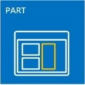

# SharePoint-Add-InsSharePoint Add-ins
SharePoint-Add-Ins sind eigenständige, von Ihnen erstellte Erweiterungen von SharePoint-Websites, die ohne benutzerdefinierten Code auf dem SharePoint-Server ausgeführt werden.SharePoint Add-ins are self-contained extensions of SharePoint websites that you create, and that run without custom code on the SharePoint server.
 

 **Hinweis** Der Name „Apps für SharePoint“ wird in „SharePoint-Add-Ins“ geändert. Während des Übergangszeitraums wird in der Dokumentation und der Benutzeroberfläche einiger SharePoint-Produkte und Visual Studio-Tools möglicherweise weiterhin der Begriff „Apps für SharePoint“ verwendet. Weitere Informationen finden Sie unter [Neuer Name für Office- und SharePoint-Apps](new-name-for-apps-for-sharepoint#bk_newname).The name "apps for SharePoint" is changing to "SharePoint Add-ins". During the transition, the documentation and the UI of some SharePoint products and Visual Studio tools might still use the term "apps for SharePoint". For details, see [New name for apps for Office and SharePoint](new-name-for-apps-for-sharepoint#bk_newname).
 

## Übersicht über SharePoint-Add-InsSharePoint Add-ins overview

Es gibt zwei grundlegende Arten von SharePoint-Add-Ins: in SharePoint gehostet und vom Anbieter gehostet. Um die richtige Entscheidung darüber treffen zu können, welche Art Sie für Ihr Szenario entwickeln sollten, machen Sie sich zunächst einmal damit vertraut, was beide Arten von SharePoint-Add-Ins gemeinsam haben.There are two basic kinds of SharePoint Add-ins — SharePoint-hosted and provider-hosted. To make the best decision about the right kind to develop for your scenario, start by learning what both types of SharePoint Add-ins have in common.
 

 

 **Hinweis** Eine Geräte-App, wie zum Beispiel eine mobile App, ist keine „SharePoint-Add-In“ im eigentlichen Sinne, auch wenn sie auf SharePoint zugreift. Das gleiche gilt für eine Webanwendung, die außerhalb von SharePoint gestartet wird. Wenn Sie diese Art von Apps entwickeln möchten, finden Sie weitere Informationen unter [Zugreifen auf SharePoint von mobilen und systemeigenen Gerät-Apps](http://msdn.microsoft.com/library/42014171-5ee5-421d-9cde-413efc3aecef%28Office.15%29.aspx).**Note** A device app, such as mobile app, isn't really a "SharePoint Add-in" even when it accesses SharePoint. The same is true of a web application that is launched from outside of SharePoint. If you want to develop any of these kinds of apps, see  [Access SharePoint from mobile and native device apps](http://msdn.microsoft.com/library/42014171-5ee5-421d-9cde-413efc3aecef%28Office.15%29.aspx).
 

-  **Ein SharePoint-Add-In ist eine eigenständige Funktion**, die die Funktionen von SharePoint-Websites erweitert, um ein klar definiertes Geschäftsproblem zu lösen.**A SharePoint Add-in is a self-contained pieces of functionality** that extends the capabilities of SharePoint websites to solve a well-defined business problem.
    
 
-  **Add-Ins haben keinen benutzerdefinierten Code, der auf SharePoint-Servern ausgeführt wird.** Stattdessen wird die gesamte benutzerdefinierte Logik nach „oben" in die Cloud verschoben bzw. nach „unten" auf Clientcomputer oder „hinüber" auf einen lokalen Server, der sich nicht in der SharePoint-Farm oder in einem SharePoint Online-Abonnement befindet. Da der benutzerdefinierte Code nicht auf den SharePoint-Servern gespeichert wird, können SharePoint-Administrators sicher sein, dass das Add-In den Servern keinen Schaden zufügt oder die Leistung der SharePoint Online-Websites beeinträchtigt.**Add-ins don't have custom code that runs on the SharePoint servers**. Instead, all custom logic moves "up" to the cloud, or "down" to client computers, or "over" to an on-premise server that is outside the SharePoint farm or SharePoint Online subscription. Keeping custom code off SharePoint servers provides reassurance to SharePoint administrators that the add-in can't harm their servers or reduce the performance of their SharePoint Online websites.
    
 
-  **Die Geschäftslogik in einer SharePoint-Add-In greift über mehrere Client-APIs, die in SharePoint** enthalten sind, auf SharePoint-Daten zu. Welche API Sie für ein Add-In verwenden, hängt von bestimmten Entscheidungen ab, die Sie hinsichtlich des Designs treffen.**Business logic in a SharePoint Add-in can access SharePoint data through one of the several client APIs included in SharePoint**. Which API you use for your add-in depends on certain other design decisions you make.
    
 
-  **Fast alle Haupttypen von SharePoint-Komponenten kann Teil einer SharePoint-Add-In** sein, einschließlich Seiten, Listen, Workflows, benutzerdefinierte Inhaltstypen, Listenvorlagen, Webparts und vieles mehr.**Almost all major types of SharePoint components can be part of a SharePoint Add-in**, including pages, lists, workflows, custom content types, list templates, Web Parts, and more.
    
 
-  **Die SharePoint-Websites, für die SharePoint-Add-Ins installiert sind und von denen aus Benutzer sie starten, heißen Hostweb.** Die SharePoint-Komponenten befinden sich jedoch in der Regel in einem speziellen untergeordneten Web des Hostwebs, das alsAdd-In-Webpart bezeichnet wird.**The SharePoint websites where SharePoint Add-ins are installed, and from which users launch them, are called host webs.** The SharePoint components, however, are generally in a special child web of the host web called theadd-in web.
    
 
-  **SharePoint-Add-Ins können auf verschiedene Weise in eine SharePoint-Website integriert werden**:**SharePoint Add-ins can fit into a SharePoint website in several ways**:
    
|||
|:-----|:-----|
||**Als umfassende ganzseitige Erfahrung**, die das Aussehen und Verhalten einer SharePoint-Seite haben kann.**As an immersive full-page experience** that can have the look and feel of a SharePoint page.|
||**Als Teil einer Webseite, die ein spezielles Steuerelement verwendet, das als Add-In-Part** bezeichnet wird und mit dem ein iFrame-Element mit dem Add-In verfügbar gemacht wird.**As part of a webpage, using a special kind of control, called an add-in part**, to surface an iframe element that contains the add-in.|
||**Als Benutzeroberflächenbefehle, die Menübänder und Menüs erweitern** - für Listen, Dokumente und vieles mehr.**As UI commands that extend ribbons and menus** for lists, documents, and more.|
-  **Alle von Benutzern installierten SharePoint-Add-Ins haben eine Kachel auf der Seite **Websiteinhalte** der SharePoint-Website.** Beim Klicken auf die Kachel wird das Add-In ausgeführt.**All SharePoint Add-ins that users install get a tile on the **Site Contents** page of the SharePoint website.** Clicking the tile runs the add-in.
    
 
-  **Eine SharePoint-Add-In wird durch ein  *Add-In-Manifest*** konfiguriert. Dies ist eine XML-Datei, in der deklariert wird, welche grundlegenden Eigenschaften das Add-In hat, wo es ausgeführt wird und welche Aktion SharePoint beim Starten des Add-Ins ausführen soll. Das Manifest kann unter anderem festlegen, welche Sprachen das Add-In unterstützt, von welchen SharePoint-Diensten und -Funktionen es abhängt und welche Berechtigungen für dasHostweb erforderlich sind, das vom Add-In benötigt wird. (SharePoint-Add-Ins haben Vollzugriff auf ihr eigenesAdd-In-Web.)**A SharePoint Add-in is configured using an  *add-in manifest*** —an XML file that declares the add-in's basic properties, where it runs, and what SharePoint should do when the add-in starts. Among other things, the manifest can specify what languages the add-in supports, what SharePoint services and functionality it depends on, and the permissions to thehost web that the add-in needs. (SharePoint Add-ins have full control of their ownadd-in web.)
    
 
-  **Sie verteilen SharePoint-Add-Ins in Add-In-Paketen**, die immer mindestens das Add-In-Manifest enthalten. (Wenn keine SharePoint-Komponenten vorhanden sind, enthält das Add-In-Paket möglicherweise nur das Add-In-Manifest.) Wenn das Add-In SharePoint-Komponenten in einem Add-In-Web hat, sind diese im Paket als ein Satz von XML-Dateien enthalten. Remotekomponenten, die außerhalb von SharePoint gehostet werden, z. B. eine Remotewebanwendung oder eine Datenbank, sind dagegen nicht im Paket enthalten und werden separat vom Add-In-Paket bereitgestellt. (Das Add-In-Manifest gibt jedoch die URLs der Remotekomponenten an.)**You distribute SharePoint Add-ins in add-in packages** that always include at least the add-in manifest. (If there are no SharePoint components, the add-in manifest may be the only thing in the add-in package. ) If the add-in has SharePoint components in an add-in web, these are included in the package as a set of XML files. Remote components that are hosted outside of SharePoint, such as a remote web application or database, are not included in the package and are deployed separately from the add-in package. (However, the add-in manifest does specify the URLs of the remote components.)
    
 
-  **Add-In-Pakete können auch Office-Add-Ins enthalten.** Wenn die SharePoint-Add-In installiert wird, wird die Office-Add-In einem Office-Add-Ins-Katalog in SharePoint hinzugefügt. Benutzer können sie aus dem Katalog in Office-Anwendungen wie Word oder Excel installieren.**Add-in packages can also include Office Add-ins.** When the SharePoint Add-in is installed, the Office Add-in is added to an Office Add-ins catalog in SharePoint. Users can install it from the catalog into the Office applications like Word or Excel.
    
 

 **Tipp** **Sehen Sie sich ein paar SharePoint-Add-Ins im** [Office Store](https://store.office.com/appshome.aspx?productgroup=SharePoint) an, um einen Eindruck zu erhalten, welche Möglichkeiten Sie bei der Entwicklung haben. Sie können auch eine SharePoint-Website öffnen und einige der kostenlosen SharePoint-Add-Ins installieren. Navigieren Sie einfach zu **Websiteinhalte \| Add-In hinzufügen \| SharePoint Store**.TIP  Take a look at a few SharePoint Add-ins in the Office Store to get a sense of what you can develop. Or open a SharePoint website and install some of the free SharePoint Add-ins. Just navigate to Site Contents | add an add-in | SharePoint Store.
 

### Einige Hinweise für erfahrene SharePoint-EntwicklerA couple of points for veteran SharePoint developers

Sandkastenlösungen, die benutzerdefinierten serverseitigen Code enthalten, werden nicht mehr unterstützt. Sandkastenlösungen „ohne Code“ und Sandkastenlösungen, die nur JavaScript enthalten, werden weiterhin unterstützt.We've deprecated sandboxed solutions that contain custom server-side code. We still support "No code" sandboxed solutions and sandboxed solutions that contain only JavaScript.
 

 
SharePoint-Add-Ins verwenden das serverseitige SharePoint-Objektmodell nicht. Die clientseitigen Objektmodelle wurden in SharePoint erheblich erweitert. Auch wenn einige APIs im SharePoint-Serverobjektmodell in den Clientobjektmodellen nicht verfügbar sind, handelt es sich nahezu vollständig um verwaltungs- und sicherheitsbezogene Klassen. Benutzerdefinierte SharePoint-Logik, die diese Bereiche berücksichtigt, ist für ein Windows PowerShell-Skript oder eine klassische SharePoint Farmlösung besser geeignet. Weitere Informationen darüber, wie Sie zwischen SharePoint-Add-Ins, klassischen SharePoint Farmlösungen und Sandkastenlösungen eine Auswahl treffen, finden Sie unter  [SharePoint-Add-Ins im Vergleich zu SharePoint-Lösungen](http://msdn.microsoft.com/library/0e9efadb-aaf2-4c0d-afd5-d6cf25c4e7a8%28Office.15%29.aspx).SharePoint Add-ins don't use the server-side SharePoint object model. The client-side object models are greatly expanded in SharePoint. Although some APIs in the SharePoint server object model aren't available in the client object models, these are almost entirely administrative and security-related classes. Custom SharePoint logic that addresses these areas is more appropriate for a Windows PowerShell script or classic SharePoint farm solution. To learn how to choose among SharePoint Add-ins, classic SharePoint farm solutions, and sandboxed solutions, see  [SharePoint Add-ins compared with SharePoint solutions](http://msdn.microsoft.com/library/0e9efadb-aaf2-4c0d-afd5-d6cf25c4e7a8%28Office.15%29.aspx).
 

 

## Zwei Möglichkeiten zum Verteilen oder Verkaufen eines Add-In-PaketsTwo ways to distribute or sell an add-in package

Sie haben zwei Möglichkeiten zum Verteilen eines Add-In-Pakets:You can distribute an add-in package in two ways:
 

 

-  **An einen Add-In-Katalog einer Organsation**, bei dem es sich um eine dedizierte SharePoint-Websitesammlung im SharePoint Online-Abonnement oder eine lokale Farm handelt. Diese Methode wird verwendet, wenn das Add-In speziell für eine bestimmte Organisation erstellt wurde.**To an organization's add-in catalog**, which is a dedicated SharePoint site collection in the SharePoint Online subscription or on-premise farm. This method is used when the add-in is custom-made for a particular organization.
    
 
-  **An den  [Office Store](https://store.office.com/appshome.aspx?productgroup=SharePoint)**. Der Store übernimmt den Marketingprozess für Sie, von der Erkennung über den Erwerb bis hin zu Updates. Microsoft bietet ein **Verkäufer-Dashboard**, das Sie beim Verkaufen von Add-Ins über den Office Store unterstützt.**To the  [Office Store](https://store.office.com/appshome.aspx?productgroup=SharePoint)**. The store handles the marketing process for you, from discovery to purchase to updates. Microsoft has a **Seller Dashboard** to help you sell add-ins through the Office Store.
    
 
Nachdem Sie das Add-In mit einer der beiden Möglichkeiten bereitgestellt haben, steht es auf der Seite zum **Add-In hinzufügen** auf SharePoint-Websites zur Verfügung. Wenn das Add-In Berechtigungen für das Hostweb oder das übergeordnete Abonnement benötigt, fordert SharePoint den Benutzer, der das Add-In installiert, zum Gewähren dieser Berechtigungen auf.After you deploy the add-in in either way, it's available for installation on the **add an add-in** page of SharePoint websites. If the add-in needs permissions to the host web or its parent subscription, SharePoint prompts the user who installs the add-in to grant those permissions.
 

 
Wenn Sie ein Add-In aktualisieren müssen, um einen Fehler zu beheben oder Funktionen hinzuzufügen, nehmen Sie die Änderungen vor, und erhöhen Sie die Versionsnummer des Add-Ins im Manifest. Stellen Sie das Add-In-Paket dann neu im Store oder Add-In-Katalog bereit. Benutzer erhalten innerhalb von 24 Stunden eine Benachrichtigung in der SharePoint-UI, dass ein Update verfügbar ist. Sie können das Update mit nur einem Klick installieren.When you need to update an add-in to fix a bug or to add functionality, make the changes and raise the add-in's version number in the add-in manifest. Then redeploy the add-in package to the store or add-in catalog. Within 24 hours, users get a notice in the SharePoint UI that an update is available. They can install the update with a single click. 
 

 

## Zwei Arten von SharePoint-Add-Ins: von SharePoint-gehostet und vom Anbieter gehostetTwo types of SharePoint Add-ins: SharePoint-hosted and provider-hosted

 

 

### SharePoint-hosted SharePoint-Add-InsSharePoint-hosted SharePoint Add-ins

Von SharePoint gehostete Add-Ins bestehen fast nur aus SharePoint-Komponenten in einem Add-In-Web. Daher wird auch gesagt, dass sie ihren „Schwerpunkt“ in SharePoint haben.SharePoint-hosted add-ins consist almost entirely of SharePoint components in an add-in web. They are sometimes said to have their center in SharePoint.
 

 
Wie bei allen SharePoint-Add-Ins kann ein Benutzer ein von SharePoint gehostetes Add-In von einer Kachel auf der Seite **Websiteinhalte** der SharePoint-Websites ausführen, in denen es installiert ist. Optional können auch zwei andere Arten von Benutzeroberflächen-Komponenten im Hostweb vorhanden sein: Add-In-Webparts und benutzerdefinierte Aktionen (d. h. benutzerdefinierte Menübandschaltflächen oder Menübefehle). **Alles andere in einem von SharePoint gehosteten Add-In wird dem Add-In-Web bereitgestellt.** Diese Komponenten werden deklarativ mithilfe von XML-Dateien definiert und können unter anderem Folgendes enthalten:Like all SharePoint Add-ins, a user can run a SharePoint-hosted add-in from a tile on the **Site Contents** page of the SharePoint websites to which it's installed. Optionally, it can also have two other kinds of UI components in the host web; add-in parts and custom actions (that is, custom ribbon buttons or menu items). **Everything else in a SharePoint-hosted add-in is deployed to the add-in web.** These components are defined declaratively using XML files, and they can include, among others:
 

 

||||
|:-----|:-----|:-----|
|Benutzerdefinierte SeitenCustom pages| WorkflowsWorkflows|Module (Dateigruppen)Modules (sets of files)|
|ListenvorlagenList templates|Listen- und BibliotheksinstanzenList and library instances|Benutzerdefinierte Listenformulare und AnsichtenCustom list forms and views|
|Angepasste InhaltstypenCustom content types|WebvorlagenWeb templates|Integrierte Spalten (keine benutzerdefinierten Spalten)Built-in columns (not custom columns)|
|Integrierte Webparts (keine benutzerdefinierten Webparts)Built-in Web Parts (not custom Web Parts)|JavaScript-DateienJavaScript files|Benutzerdefinierte Schaltflächen und Menüelemente für das Add-In-WebCustom buttons and menu items for the add-in web|

 

 
Die gesamte Geschäftslogik in einem von SharePoint gehosteten Add-In verwendet JavaScript, entweder direkt auf einer benutzerdefinierten Seite oder in einer JavaScript-Datei, auf die von einer benutzerdefinierten Seite verwiesen wird. Eine JavaScript-Version des SharePoint-Objektmodells (JSOM) ist verfügbar, damit das Add-In auf einfache Weise CRUD-Vorgänge (Erstellen, Lesen, Aktualisieren und Löschen) für SharePoint-Daten durchführen kann.All business logic in a SharePoint-hosted add-in uses JavaScript either directly on a custom page or in a JavaScript file that is referenced from a custom page. A JavaScript version of the SharePoint object model (JSOM) is available to make it simple for the add-in to perform create, read, update, and delete (CRUD) operations on SharePoint data.
 

 
Benutzerdefinierte Seiten in einem von SharePoint gehosteten Add-In sind in der Regel ASP.NET-Seiten (ASPX), die deklarativ ASP.NET- und enthaltene SharePoint-Steuerelemente referenzieren können, wobei kein Code-Behind vorhanden sein kann. Sie können die SharePoint-Steuerelemente jedoch über eine clientseitige Renderingoption und ein benutzerdefiniertes JavaScript anpassen.Custom pages in a SharePoint-hosted add-in are generally ASP.NET pages (ASPX) and they can declaratively reference ASP.NET and in-the-box SharePoint controls, but there can be no code behind. However, you can customize the SharePoint controls using a client-side rendering option and custom JavaScript.
 

 
Das JavaScript in von SharePoint gehosteten Add-Ins kann auf Daten und Ressourcen, die sich außerhalb des Add-In-Webparts befinden, mithilfe einer von zwei Techniken für das sichere Umgehen der Richtlinie des Browsers zum selben Ursprung zugreifen: eine spezielle domänenübergreifende JavaScript-Bibliothek oder eine bestimmte JavaScript-WebProxy-Klasse. Mithilfe dieser Techniken kann ein von SharePoint gehostetes Add-In mit Daten im Hostweb, dem übergeordneten Abonnement oder einem beliebigen Standort im Internet arbeiten.The JavaScript in SharePoint-hosted add-ins can access data and resources that are outside of the add-in web by using either of two techniques for safely working around the browser's same origin policy: a special JavaScript cross-domain library or a specific JavaScript WebProxy class. Using these techniques a SharePoint-hosted add-in can work with data on the host web, its parent subscription, or anywhere on the Internet.
 

 

### Vom Anbieter gehostete SharePoint-Add-InsProvider-hosted SharePoint Add-ins

Alle SharePoint-Komponenten, die in einem von SharePoint gehosteten Add-In sein können, können auch in einem von einem Anbieter gehosteten Add-In vorhanden sein. Von einem Anbieter gehostete Add-Ins unterscheiden sich jedoch von in SharePoint gehosteten Add-Ins, da sie mindestens eine Remotekomponente enthalten, z. B. eine Webanwendung, einen Dienst oder eine Datenbank, die außerhalb der SharePoint-Farm oder einem SharePoint Online-Abonnement gehostet werden. Dabei kann es sich um einen Server im selben Unternehmensnetzwerk wie eine SharePoint-Farm oder einen Clouddienst handeln. Die externen Komponenten können in einem beliebigen Webhostingstapel, einschließlich des Linux-, Apache, MySQL- und PHP (LAMP)-Stapels gehostet werden.Any SharePoint component that can be in a SharePoint-hosted add-in can also be in a provider-hosted add-in. But provider-hosted add-ins are distinguished from SharePoint-hosted add-ins because they include at least one remote component; such as a web application, service, or database that is hosted externally from the SharePoint farm or SharePoint Online subscription. This could be a server in the same corporate network as a SharePoint farm or a cloud service. The external components can be hosted on any web hosting stack, including the Linux, Apache, MySQL, PHP (LAMP) stack. 
 

 

 **HINWEIS**   **„Anbieter" ist, wer den Server oder das Cloud-Konto besitzt.** Das kann dasselbe Unternehmen oder dieselbe Organisation sein, das bzw. die die SharePoint-Farm oder den SharePoint Online-Mandanten besitzt, in der bzw. dem das Add-In installiert werden soll. Es kann jedoch auch der Entwickler des Add-Ins der Anbieter sein. Wenn ein Add-In für eine Organisation erstellt wird, übernimmt in der Regel diese Organisation das Hosting. Wenn ein Add-In jedoch für mehrere Organisationen erstellt wird, ist es wahrscheinlicher, dass der Entwickler die Remotekomponenten hostet. Das Entwicklerhosting ist verpflichtend, wenn das die SharePoint-Add-In über den Office Store vermarktet wird, da der Entwickler in der Regel keine Kontaktinformationen der Add-In-Käufer hat. In diesem Szenario kennen die verschiedenen Instanzen des Add-Ins den URI der Remotekomponente, da dieser im Add-In-Manifest angegeben ist.**Note**   **The "provider" is whoever owns the server or cloud account.** It can be the same company or organization that owns the SharePoint farm or SharePoint Online tenancy where the add-in is to be installed. But the developer of the add-in can also be the provider. Typically, when an add-in is created for an organization, the organization provides the hosting. However, when an add-in is created for multiple organizations, it's more likely that the developer hosts the remote components. Developer-hosting is mandatory if the SharePoint Add-in is being marketed through the Office Store, because the developer doesn't have any contact information for the add-in purchasers. In this scenario, the various instances of the add-in know the URI of the remote component because it is specified in the add-in manifest.
 

Was das Hosting-Framework betrifft, das Sie für die Remotekomponenten verwenden, haben Sie volle Flexibilität. Sie müssen keinen Microsoft-Stapel verwenden. Es kann jedes Webhosting-Framework verwendet werden, einschließlich LAMP (Linux, Apache-Server, MySQL, PHP), MEAN (MongoDB, ExpressJS, AngularJS, Nodejs), Java, Python und anderen. Sie können außerdem Entwicklungstools verwenden, die nicht von Microsoft stammen. Darüber hinaus können die Remotekomponenten in Cloud-Diensten von anderen Anbietern als Microsoft gehostet werden.You have complete flexibility for the hosting framework that you use for the remote components. You don't have to use a Microsoft stack. Any web hosting framework can be used, including LAMP (Linux, Apache server, MySQL, PHP), MEAN (MongoDB, ExpressJS, AngularJS, Nodejs), Java, Python, and others; and you are welcome to use non-Microsoft development tools. In addition, the remote components can be hosted in non-Microsoft cloud services.
 

 
 **Remoteseiten im Add-In können mithilfe eines speziellen Chromsteuerelements das Erscheinungsbild und Verhalten von SharePoint-Seiten erhalten.****You can give remote pages in the add-in the look and feel of SharePoint pages** by using a special chrome control.
 

 
 **Remotedaten können unter anderem Blobs, Caches, Nachrichtenwarteschlangen, Netzwerke für die Inhaltsübermittlung (CDN) und Datenbanken sein.** Datenbanken können einen beliebigen Typ haben, einschließliche relational und objektorientiert. Auf die Remotedaten kann auf verschiedene Weise zugegriffen werden. Sie können beispielsweise Business Connectivity Services (BCS) verwenden, um die Daten in einer SharePoint-Liste bereitzustellen. Eine weitere Option besteht darin, Daten in einem Raster auf einer Seite einer Remotewebanwendung darzustellen.**Remote data can be blobs, caches, message queues, content delivery networks (CDN), and databases**, among others. And databases can be any type including relational and object-oriented. The remote data can be accessed in a variety of ways. For example, you can use Business Connectivity Services (BCS) to surface the data in a SharePoint list. Another option is to expose data in a grid on a page of a remote web application.
 

 
 **SharePoint-Add-Ins verwenden SharePoint-APIs für die Verbindung und Integration mit SharePoint** -Funktionen wie Suche, Workflow, soziale Netzwerke, Taxonomie, Benutzerprofile, BCS und mehr. Damit können sie Dokumente lesen, Suchen durchführen, Benutzer verbinden und CRUD-Vorgänge ausführen. Es gibt verschiedene Sätze von APIs:**SharePoint Add-ins use SharePoint APIs to connect and integrate with SharePoint** features—search, workflow, social networking, taxonomy, user profiles, BCS, and more. This lets them read documents, do searches, connect people, and perform CRUD operations. There is more than one set of the APIs:
 

 

- Wenn die Remotekomponenten mit .NET implementiert werden, ist die Bibliothek des **clientseitigen SharePoint-Objektmodells (CSOM)** mit verwaltetem Code verfügbar.When the remote components are implemented with .NET, the managed code **SharePoint Client-Side Object Model (CSOM)** library is available.
    
 
- Für Remotekomponenten, die nicht auf .NET basieren, gibt es eine Reihe von **REST-/OData-APIs**, die zum Zugreifen auf SharePoint-Daten verwendet werden können. Diese können auch von einem .NET-Client verwendet werden, wenn Sie das Arbeiten mit einer OData-Schnittstelle bevorzugen.For remote components that are not based on .NET, there is a set of **REST/OData APIs** that can be used to access SharePoint data. These can also be used from a .NET client if you prefer working with an OData interface.
    
 
- Die **JSOM-Bibliothek**, die weiter oben erwähnt wurde, kann nicht auf einer Remoteseite verwendet werden. Von einem Anbieter gehostete Add-Ins können jedoch benutzerdefinierte SharePoint-Seiten in einem Add-In-Web haben, und JavaScript auf diesen Seiten kann die JSOM-Bibliothek verwenden.The **JSOM library**, mentioned earlier, cannot be used on a remote page, but provider-hosted add-ins can have custom SharePoint pages in an add-in web and JavaScript on these pages can use the JSOM library.
    
 
 **Von einem Anbieter gehostete Add-Ins, die auf SharePoint zugreifen, sind Sicherheitsprinzipale, ebenso wie Benutzer und Gruppen es sind**. Der Add-In-Prinzipal muss ebenso wie der Benutzer authentifiziert und autorisiert werden. Das Add-In benötigt Berechtigungen, um Vorgänge an SharePoint-Daten im Hostweb durchzuführen. In den meisten Szenarien sind die effektiven Berechtigungen eines Benutzers, der mit SharePoint über eine SharePoint-Add-In arbeitet, die Schnittstelle der Berechtigungen des Benutzers und des Add-Ins, obwohl es einige Szenarien gibt, in denen ein Benutzer Aktionen mit einem Add-In ausführen kann, für das er andernfalls keine Berechtigung hätte.**Provider-hosted add-ins that access SharePoint are security principals just as users and groups are**. The add-in principal has to be authenticated and authorized, just as the user does. The add-in needs permissions to perform operations on SharePoint data in the host web. In most scenarios, the effective permissions of a user working with SharePoint through a SharePoint Add-in are the intersection of the user's and the add-in's permissions, although there are some scenarios in which a user can do things with an add-in that she wouldn't otherwise have permission to do.
 

 
 **Von einem Anbieter gehostete Add-Ins können eine Verbindung zu einem beliebigen internen oder öffentlichen Webdienst herstellen**, und im Gegensatz zu von SharePoint gehosteten Add-Ins können sie **SharePoint-Listen- und -Listenelementereignisse verarbeiten**, z. B. das Hinzufügen eines Elements zu einer Dokumentbibliothek.**Provider-hosted add-ins can connect to any internal or public web service**; and, unlike SharePoint-hosted add-ins, they can **handle SharePoint list and list item events**, such as adding an item to a document library.
 

 

## Auswählen des richtigen Weges für die SharePoint-EntwicklungChoose your SharePoint development path

Sind Sie bereit zu beginnen?Ready to get started?
 

 

-  **Wenn Sie ein erfahrener SharePoint-Entwickler sind, empfehlen wir, mit von SharePoint gehosteten Add-Ins zu beginnen.** Sie sind den Arten von SharePoint-Erweiterungen, die Sie in der Vergangenheit entwickelt haben, am ähnlichsten.**If you are an experienced SharePoint developer, we recommend that you start with SharePoint-hosted add-ins.** They're the most similar to the kinds of SharePoint extensions that you have made in the past.
    
     [Erste Schritte beim Erstellen von von SharePoint gehosteten SharePoint-Add-InsGet started creating SharePoint-hosted SharePoint Add-ins](get-started-creating-sharepoint-hosted-sharepoint-add-ins)
    
 
-  **Wenn Sie ein erfahrener ASP.NET-Webanwendungsentwickler sind, empfehlen wir, mit von einem Anbieter gehosteten Add-Ins zu beginnen.** Diese werden um Webanwendungen erstellt. **If you are an experienced ASP.NET web application developer, we recommend that you start with provider-hosted add-ins.** They're built around web applications.
    
     [Erste Schritte beim Erstellen von von einem Anbieter gehosteten SharePoint-Add-InsGet started creating provider-hosted SharePoint Add-ins](get-started-creating-provider-hosted-sharepoint-add-ins)
    
 
-  **Wenn Sie ein von einem Anbieter gehostetes Add-In auf einem Stapel eines anderen Anbieters als Microsoft entwickeln möchten, finden Sie im Folgenden Informationen zu den ersten Schritten:****If you want to develop a provider-hosted add-in on a non-Microsoft stack, here's how to get started:**
    
      -  Wenn Sie noch keine passenden Tools für Ihren Stapel haben, installieren Sie die Tools, die für Ihren Stapel geeignet sind.Install tools that are appropriate for your stack, if you don't already have them.
    
 
  - Richten Sie ein Entwicklerkonto bei Office 365 für Test- und Debuggingzwecke ein. Weitere Informationen finden Sie unter  [Einrichten einer Entwicklungsumgebung für SharePoint-Add-Ins in Office 365](set-up-a-development-environment-for-sharepoint-add-ins-on-office-365), oder  [erstellen Sie einfach eine Entwicklerwebsite](create-a-developer-site-on-an-existing-office-365-subscription), wenn Sie bereits über ein Office 365-Abonnement verfügen.Get a developer account on Office 365 for testing and debugging purposes. For details, go to  [Set up a development environment for SharePoint Add-ins on Office 365](set-up-a-development-environment-for-sharepoint-add-ins-on-office-365), or if you already have an Office 365 subscription, you just need to  [create a Developer Site on it.](create-a-developer-site-on-an-existing-office-365-subscription).
    
 
  - Ihr Add-In verwendet SharePoint-REST-/OData-APIs, um CRUD-Vorgänge für SharePoint-Daten auszuführen:Your add-in will use SharePoint's REST/OData APIs to perform CRUD operations on SharePoint data:
    
      - Die erläuternde Dokumentation finden Sie im Artikel [Einführung in den SharePoint-REST-Dienst](get-to-know-the-sharepoint-2013-rest-service) und unter den darin enthaltenen Links zu anderen Artikeln.Find our explanatory documentation in the article  [Get to know the SharePoint REST service](get-to-know-the-sharepoint-2013-rest-service) and other articles to which it links.
    
 
  - Die Referenzdokumentation finden Sie unter [REST-API-Referenz für SharePoint](http://msdn.microsoft.com/library/3514e753-19f9-4b41-a1ae-f35c5ffc17d2%28Office.15%29.aspx).Find reference documentation at  [REST API reference for SharePoint](http://msdn.microsoft.com/library/3514e753-19f9-4b41-a1ae-f35c5ffc17d2%28Office.15%29.aspx).
    
 
  - Wenn Sie Visual Studio nicht verwenden, müssen Sie die Add-In-Manifestdatei und das Add-In-Paket erstellen. Informationen dazu finden Sie unter  [Hinweise zur App-Manifeststruktur und zum Paket eines SharePoint-Add-Ins](explore-the-app-manifest-structure-and-the-package-of-a-sharepoint-add-in). Die Verwendung von Visual Studio und Microsoft Office-Entwicklertools für Visual Studio zum Erstellen der Manifestdatei und des Pakets bietet viele zeitsparende Vorteile. Wir empfehlen, diese in Betracht zu ziehen, selbst wenn Sie für die Erstellung der Remotewebanwendung selbst ein anderes Tool verwenden. Die  [Community-Eedition von Visual Studio](https://www.visualstudio.com/news/vs2013-community-vs.aspx) ist kostenlos.If you are not using Visual Studio, you have to create the add-in manifest file and the add-in package. For information, see  [Explore the app manifest structure and the package of a SharePoint Add-in](explore-the-app-manifest-structure-and-the-package-of-a-sharepoint-add-in). There are a lot of time-saving advantages to using Visual Studio and Microsoft Office Developer Tools for Visual Studio to make your manifest and package. We recommend that you consider them, even if you use another tool to create the remote web application itself. The  [Community edition of Visual Studio](https://www.visualstudio.com/news/vs2013-community-vs.aspx) is free.
    
 
  - Es gibt Beispiele für von einem Anbieter gehostete Add-Ins für einige nicht von Microsoft stammende Sprachen und Plattformen im [OfficeDev-Abschnitt auf GitHub](https://github.com/OfficeDev), z. B. [PHP-App-for-SharePoint](https://github.com/OfficeDev/PHP-App-for-SharePoint).There are sample provider-hosted add-ins for some non-Microsoft languages and platforms in the  [OfficeDev section of GitHub](https://github.com/OfficeDev); for example,  [PHP-App-for-SharePoint](https://github.com/OfficeDev/PHP-App-for-SharePoint).
    
 

 **Hinweis** Wenn Sie Anfänger in der SharePoint- und Webentwicklung sind, profitieren Sie am meisten, wenn Sie mit dem kostenlosen Kurs der Microsoft Virtual Academy oder einem Buch zur SharePoint-Entwicklung beginnen.**Note** If you're a beginner at both SharePoint and web development, you'd benefit most by starting with the free course at Microsoft's Virtual Academy, or working through a book about SharePoint development.
 

## Siehe auchSee also

#### Sonstige RessourcenOther resources

 
 [Entwickeln von Microsoft SharePoint Server 2013-Kernlösungen - SchnellstartDeveloping Microsoft SharePoint Server 2013 Core Solutions Jump Start](http://www.microsoftvirtualacademy.com/training-courses/developing-microsoft-sharepoint-server-2013-core-solutions-jump-start)
