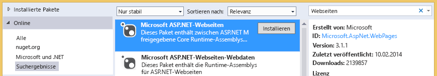

# Problembehandlung bei DokumentbibliothekenTroubleshooting document libraries
In diesem Thema erfahren Sie von Problemen, die auftreten können, wenn Sie von einem Cloud-Geschäfts-Add-In auf eine SharePoint-Dokumentbibliothek zugreifen, und mit welchen Techniken Sie diese Probleme beheben können.In this topic, you can learn about problems that may occur when you access a SharePoint document library from a cloud business add-in and the techniques that you can use to resolve those problems.
 

 **Hinweis** Der Name „Apps für SharePoint“ wird in „SharePoint-Add-Ins“ geändert. Während des Übergangszeitraums wird in der Dokumentation und der Benutzeroberfläche einiger SharePoint-Produkte und Visual Studio-Tools möglicherweise weiterhin der Begriff „Apps für SharePoint“ verwendet. Weitere Informationen finden Sie unter [Neuer Name für Office- und SharePoint-Apps](new-name-for-apps-for-sharepoint.md#bk_newname).**Note**  The name "apps for SharePoint" is changing to "SharePoint Add-ins". During the transition, the documentation and the UI of some SharePoint products and Visual Studio tools might still use the term "apps for SharePoint". For details, see  [New name for apps for Office and SharePoint](new-name-for-apps-for-sharepoint.md#bk_newname).
 

 

## Fehler: Dieses Add-Un unterstützt das Hochladen von Dokumenten in diesem Browser nicht.Error: This add-in does not support uploading documents from your current browser

Wenn Sie ein Dokument in eine verbundene Dokumentbibliothek in einem Cloud-Geschäfts-Add-In hochladen wollen, scheitert der Versuch mit folgender Fehlermeldung: "Dieses Add-In unterstützt nicht das Hochladen von Dokumenten aus dem aktuellen Browser. Verwenden Sie die neueste Version." Dieses Problem tritt nur bei einigen älteren Browsern auf, die die HTML5 FileReader-API nicht unterstützen. Fügen Sie das NuGet-Paket zu Ihrem Projekt hinzu, und stellen Sie das Add-In erneut bereit, um das Problem zu beheben.When attempting to upload a document to an associated document library in a cloud business add-in, the upload fails with the error message "This add-in does not support uploading documents from your current browser. Please use the latest version". This issue only occurs on certain older browsers that don't support the HTML5 FileReader API. It can be fixed by adding a NuGet package to your project and redeploying the add-in.
 

 

### So verhindern Sie den FehlerTo prevent the error

1. Öffnen Sie im **Projektmappen-Explorer** das Kontextmenü für das Projekt **Server**, und wählen Sie **NuGet-Pakete verwalten**.In  **Solution Explorer**, open the shortcut menu for the  **Server** project and choose **Manage NuGet Packages**.
    
 
2. Erweitern Sie im Dialogfeld **NuGet-Pakete verwalten** den Knoten **Online**, und geben Sie dann im Feld **Online suchen** Webseiten ein, wie in Abbildung 1 gezeigt.In the  **Manage NuGet Packages** dialog box, expand the **Online** node, and then in the **Search Online** box enter web pages, as shown in Figure 1.
    
    **Abbildung 1. Auswahloptionen im Dialogfeld „NuGet-Pakete verwalten“****Figure 1. Selections in the Manage NuGet Packages dialog box**

 

  
 

 

 
3. Wählen Sie in der Ergebnisliste den Eintrag **Microsoft ASP.NET-Webseiten**, und klicken Sie dann auf **Installieren**.In the list of results, choose  **Microsoft ASP.NET Web Pages**, and then choose the  **Install** button.
    
    Das Dialogfeld **Zustimmung zur Lizenz** wird geöffnet.The  **License Acceptance** dialog box opens.
    
 
4. Lesen Sie im Dialogfeld **Zustimmung zur Lizenz** die Lizenzbedingungen. Klicken Sie auf **Annehmen**, wenn Sie den Bedingungen zustimmen.In the  **License Acceptance** dialog box, review the license terms, and if you agree to the terms choose the **I Accept** button.
    
 
5. Wenn das Paket fertig installiert ist, klicken Sie auf **Schließen**.When the package finishes installing, choose the  **Close** button.
    
 
6. Veröffentlichen Sie das aktualisierte Add-In auf Ihrer SharePoint-Website.Publish the updated add-in to your SharePoint site.
    
 

## Zusätzliche RessourcenAdditional resources

-  [Zuordnen einer Dokumentbibliothek zu einer EntitätAssociate a document library with an entity](associate-a-document-library-with-an-entity.md)
    
 

