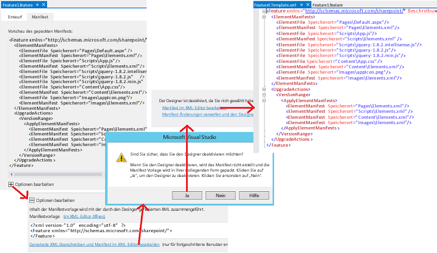

# <a name="update-add-in-web-components-in-sharepoint"></a>Aktualisieren von SharePoint-Add-In-Webkomponenten
Aktualisieren von Seiten, Listen, Inhaltstypen und anderen Add-In-Webkomponenten in einem SharePoint-Add-In.
 

 **Hinweis** Der Name „Apps für SharePoint“ wird in „SharePoint-Add-Ins“ geändert. Während des Übergangszeitraums wird in der Dokumentation und der Benutzeroberfläche einiger SharePoint-Produkte und Visual Studio-Tools möglicherweise weiterhin der Begriff „Apps für SharePoint“ verwendet. Weitere Informationen finden Sie unter [Neuer Name für Office- und SharePoint-Apps](new-name-for-apps-for-sharepoint.md#bk_newname).
 


## <a name="prerequisites-for-updating-the-add-in-web-components"></a>Voraussetzungen für die Aktualisierung der Add-In-Webkomponenten
<a name="Prerequisites"> </a>

Kenntnisse des Themas [Aktualisieren von SharePoint-Add-Ins](update-sharepoint-add-ins.md) und der darin aufgeführten erforderlichen Komponenten und Kernkonzepte.
 

 
In diesem Thema wird davon ausgegangen, dass Sie die neueste Version des Add-Ins entwickelt und getestet haben, wie unter  [Erstellen und Debuggen Sie die neue Version, als ob es ein ganz neues Add-In wäre](update-sharepoint-add-ins.md#DebugFirst) beschrieben.
 

 

## <a name="update-sharepoint-components-in-the-add-in-web"></a>Aktualisieren von SharePoint-Komponenten im Add-In-Web
<a name="UpdatingAppWeb"> </a>

Alle SharePoint-Komponenten, die im Add-In-Web bereitgestellt werden, sind in Features im **Web**-Bereich des Add-In-Pakets enthalten. Aus diesem Grund muss zur Aktualisierung dieser Komponenten mindestens eines der Features aktualisiert werden. Dieser Vorgang hat sich seit SharePoint 2010 nicht verändert und ist im Artikel [Vorgehensweise: Hinzufügen von Elementen zu einem vorhandenen Feature](http://msdn.microsoft.com/library/b007f419-e0d6-4e3a-a3ae-b8e448656d02%28Office.15%29.aspx) im SharePoint 2010 SDK dokumentiert. Andere Artikel unter dem Knoten [Aktualisieren von Features](http://msdn.microsoft.com/library/e917f709-6491-4d50-adbe-2ab8f35da990%28Office.15%29.aspx) können ebenfalls hilfreich sein. Beachten Sie jedoch, dass Add-Ins auf dem SharePoint-Server keinen benutzerdefinierten Code enthalten dürfen; manche Aspekte des Featureupgrades in SharePoint 2010 gelten daher nicht für das Aktualisieren von Add-Ins. Sie können beispielsweise nicht das Element [CustomUpgradeAction](http://msdn.microsoft.com/library/16a2182e-80aa-4184-8071-8f717ee5c572%28Office.15%29.aspx) verwenden, wenn Sie das Feature eines SharePoint-Add-Ins aktualisieren.
 

 

### <a name="what-can-and-cannot-be-done-declaratively"></a>Welche Aufgaben deklarativ ausgeführt werden können und welche nicht

Bei einem SharePoint-gehosteten Add-In können Sie nur XML-Markup zum Aktualisieren eines Add-Ins verwenden, und es gelten einige Einschränkungen, wie Sie ein Add-In in einem Update deklarativ ändern können. In einem vom Anbieter gehosteten Add-In können Sie einen  [UpdatedEventEndpoint Handler](create-a-handler-for-the-update-event-in-sharepoint-add-ins.md) implementieren, um Aktionen auszuführen, die nicht deklarativ ausgeführt werden können.
 

 
Das Hinzufügen von Komponenten zu einem Add-In ist einfach. Alle Komponenten, die zum Einfügen in ein Add-In berechtigt sind, können auch in einem Update hinzugefügt werden. (Informationen zu den Komponenten, die in einem Add-In enthalten sein können, finden Sie unter  [Typen von SharePoint-Komponenten, die in einem SharePoint-Add-In enthalten sein können](host-webs-add-in-webs-and-sharepoint-components-in-sharepoint.md#TypesOfSPComponentsInApps).) Wenn Sie eine vorhandene Komponente deklarativ ändern möchten, sollten Sie die folgenden Punkte in Betracht ziehen. 
 

 

- Der Datentyp einer Liste oder eines Inhaltstypfelds (einer Spalte) kann nach der anfänglichen Bereitstellung in keinem Fall geändert werden. Ändern Sie vor allem nicht den Datentyp eines Felds im Rahmen eines Add-In-Updates ( *auch nicht programmgesteuert*  ). Alternativ können Sie ein neues Feld hinzufügen und das alte Feld ausblenden. Wenn das Add-In benutzerdefinierte Formulare zum Erstellen, Bearbeiten oder Anzeigen von Elementen enthält, müssen Sie in diesen Formularen entsprechende Änderungen vornehmen. Fügen Sie beispielsweise Benutzeroberflächenelemente für das neue Feld hinzu, und entfernen Sie Benutzeroberflächenelemente für das alte Feld. (In einem vom Anbieter gehosteten Add-In können Sie Daten programmgesteuert vom alten zum neuen Feld verschieben und dann das alte Feld löschen.)
    
 
- Listen, Listeninstanzen, Inhaltstypen oder Felder können im Updatemarkup nicht gelöscht werden.
    
 
- Dateien können nicht aus dem Add-In-Web im Updatemarkup gelöscht werden. Allerdings können Sie den Inhalt einer Datei ändern.
    
 
- Die Elemente **CustomUpgradeAction** und **MapFile** können beim Aktualisieren eines SharePoint-Add-Ins nicht verwendet werden, auch wenn sie in Visual Studio-IntelliSense verfügbar zu sein scheinen.
    
 

### <a name="update-the-add-in-web-for-the-first-time"></a>Erstmaliges Aktualisieren des Add-In-Webs

Die Verfahren in diesem Abschnitt zeigen, wie Sie Inhaltstypen, Listen, Dateien und andere SharePoint-Komponenten im Add-In-Web hinzufügen oder aktualisieren. Der Einfachheit halber wird davon ausgegangen, dass alle Komponenten Teil eines einzigen Features im Add-In-Web sind, Add-In-Webs können jedoch mehrere Funktionen aufweisen, und Sie können mehrere Features im selben Update aktualisieren.
 

 
Die Microsoft Office-Entwicklertools für Visual Studio sind darauf ausgelegt, neue Add-Ins zu erstellen, und das Standardverhalten der Tools ist manchmal nicht optimal, wenn Sie ein Add-In aktualisieren. Für mehr Kontrolle über den Prozess sollten Sie damit beginnen, den Feature-Designer mithilfe des folgenden Verfahrens zu deaktivieren, damit Sie die rohe XML-Datei für das Feature direkt bearbeiten können. 
 

 

### <a name="to-edit-the-feature-xml"></a>So bearbeiten Sie den Feature-XML-Code


1. Öffnen Sie im **Projektmappen-Explorer** die Datei „_{FeatureName}_.features“. Sie wird im Feature-Designer geöffnet.
    
 
2. Öffnen Sie die Registerkarte **Manifest**, und erweitern Sie **Bearbeitungsoptionen**.
    
 
3. Wählen Sie **Generierten XML-Code überschreiben und Manifest im XML-Editor bearbeiten**.
    
 
4. Wählen Sie **Ja**, wenn Sie gefragt werden, ob Sie den Designer deaktivieren möchten.
    
 
5. Wählen Sie in der daraufhin geöffneten Ansicht **Bearbeiten Sie das Manifest im XML-Editor**. Die Datei „_{FeatureName}_.Template.xml“ wird geöffnet. 
    
    **Öffnen des Feature-XML-Editors**

 

  
 

 

 

 **Vorsicht** Fügen Sie keine „<!-- -->“-Kommentare zur Datei „_{FeatureName}_.features“ hinzu. Kommentare werden von der Upgradeinfrastruktur nicht unterstützt, und beim Upgrade tritt ein Fehler auf, wenn sich Kommentare in der Datei befinden. Sie werden in den Markupbeispielen in diesem Artikel nur verwendet, um Ihnen zu zeigen, wo Sie das Markup einfügen sollten.
 

Verwenden Sie die folgenden Schritte zum Aktualisieren des Add-In-Web-Features.
 

 

### <a name="to-update-the-add-in-web-feature-the-first-time"></a>So aktualisieren Sie das Add-In-Web-Feature zum ersten Mal


1. Erhöhen Sie das Attribut **Version** des [Feature](http://msdn.microsoft.com/library/265cd648-1a7e-410f-a1d7-0da8c64b4006%28Office.15%29.aspx)-Elements, wenn dies noch nicht über die Office Developer Tools für Visual Studio ausgeführt wurde, als Sie die Versionsnummer im Add-In-Manifest erhöht haben. (Die Tools führen die Erhöhung nicht in jedem Szenario durch, deshalb müssen Sie dies überprüfen.) Sie sollten dieselbe Versionsnummer wie für das Add-In verwenden. Sie sollten eine Erhöhung der Featureversion auch dann in Betracht ziehen, wenn andere Komponenten des Add-Ins aktualisiert werden, aber nicht das Add-In-Web-Feature selbst. Die Logik des [VersionRange](http://msdn.microsoft.com/library/cd715e38-6ec3-43b2-8007-6d0ed8865d91%28Office.15%29.aspx)-Elements (das im Abschnitt [Anschließende Aktualisierungen des Add-In-Webs](#SubsequentUpgrades) erläutert wird) ist einfacher zu verwalten, wenn die Add-In-Version und die Featureversion immer gleich sind. 
    
 
2. Löschen Sie nichts im [ElementManifests](http://msdn.microsoft.com/library/d8d4db7e-2bc2-40c6-958b-d5683bdee87a%28Office.15%29.aspx)-Abschnitt der Datei. Aus diesem Abschnitt wird niemals etwas gelöscht.
    
 
3. Wenn sie nicht bereits vorhanden sind, fügen Sie der Datei die folgenden Elemente hinzu: 
    
      - Ein untergeordnetes  [UpgradeActions](http://msdn.microsoft.com/library/5af24ac1-a290-454d-b32b-bc7f7a4634f0%28Office.15%29.aspx)-Element im Element **Feature**. Fügen Sie dem Element  *kein* **ReceiverAssembly**- oder **ReceiverClass**-Attribut hinzu. Diese haben bei der Aktualisierung eines SharePoint-Add-In s keine Funktion. (Die Attribute beziehen sich auf eine benutzerdefinierte Assembly, die in SharePoint-Add-Ins nicht unterstützt wird. Wenn Sie einem Add-In eine benutzerdefinierte Assembly hinzufügen, installiert SharePoint dieses Add-In nicht.)
    
 
  - Ein untergeordnetes **VersionRange**-Element im **UpgradedActions**-Element. Fügen Sie dem Element kein **BeginVersion**- oder **EndVersion**-Attribut hinzu. Diese haben bei der ersten Aktualisierung eines Add-Ins keine Funktion. Ihre Verwendung wird im Abschnitt [Anschließende Aktualisierungen des Add-In-Webs](#SubsequentUpgrades) erläutert.
    
 
  - Ein untergeordnetes [ApplyElementManifests](http://msdn.microsoft.com/library/c087a0c3-1e27-4034-b4da-e025991454d6%28Office.15%29.aspx)-Element im **VersionRange**-Element.
    
 

    An diesem Punkt sollte die Datei ähnlich wie das folgende Beispiel aussehen:
    
     **Wichtig** Die Office Developer Tools für Visual Studio haben möglicherweise bereits das obige Markup hinzugefügt und einige Elemente als Abbildung aus dem Abschnitt **ElementManifests** in den Abschnitt **ApplyElementManifests** kopiert. *Löschen Sie diese Elemente.* Auch wenn Sie einige dieser Elemente möglicherweise im Laufe der nächsten Schritte wieder einfügen müssen, ist es leichter und sicherer, mit einem leeren **ApplyElementManifests**-Abschnitt zu beginnen. Redundante Einträge für nicht geänderte Komponenten können negative Auswirkungen haben, z. B. kann der Updateprozess dadurch so viel Zeit in Anspruch nehmen, dass er eine Zeitüberschreitung verursacht und abgebrochen wird.


```XML
  <Feature <!-- Some attributes omitted --> 
               Version="2.0.0.0">
  <ElementManifests>
    <!-- ElementManifest elements omitted -->
  </ElementManifests>
  <UpgradeActions>
   <VersionRange>
     <ApplyElementManifests>
       
     </ApplyElementManifests>
   </VersionRange>
  </UpgradeActions>
</Feature>
```


### <a name="to-add-components-to-the-add-in"></a>So fügen Sie dem Add-In Komponenten hinzu


1. Gehen Sie beim Hinzufügen von neuen Komponenten zum Feature genauso vor wie beim Erstellen eines neuen SharePoint-Add-In-Projekts.
    
 
2. Wenn Sie eine Komponente eines Typs hinzufügen, der in der vorherigen Version des Add-Ins nicht enthalten war, beispielsweise wenn Sie eine Liste zu einem Add-In hinzufügen, das zuvor keine Liste hatte, fügen die Office Developer Tools für Visual Studio dem Projekt eine Datei „elements.xml“ hinzu, die das Elementmanifest für die Komponente ist. Sie sollten die neue Versionsnummer des Add-Ins zu dieser Datei hinzufügen (z. B. „elements.2.0.0.0.xml“). Dies kann hilfreich bei der Problembehandlung sein. Achten Sie darauf, diese Änderung im **Projektmappen-Explorer** durchzuführen, um sicherzustellen, dass Verweise auf die Datei, beispielsweise in der CSPROJ-Datei und im Feature-XML-Code, entsprechend geändert werden.
    
 
3. Fügen Sie für jedes neue Elemente ein  [ElementManifest](http://msdn.microsoft.com/library/5a6a2865-5d31-45a2-a402-6da6e0f5567a%28Office.15%29.aspx)-Element als untergeordnetes Element der Elemente **ElementManifests** und **ApplyElementManifests** der Feature-XML-Datei hinzu (exakt dasselbe **ElementManifest**-Element an beiden Stellen). Das **Location**-Attribut des Elements sollte auf den relativen Pfad der elements.2.0.0.0.xml-Datei verweisen. Wenn Sie beispielsweise eine Liste namens MyCustomList hinzugefügt haben, würde das **ElementManifest**-Element wie folgt aussehen.
    
```XML
  <ElementManifest Location="MyCustomList\elements.2.0.0.0.xml" />
```

4. Einige Arten von Komponenten fügen Dateien zu dem Projekt hinzu. Beispielsweise wird eine schema.xml-Datei erstellt, wenn Sie eine Liste hinzufügen, oder eine page-Datei, wenn Sie eine Seite hinzufügen. Fügen Sie für jede dieser Dateien ein  [ElementFile](http://msdn.microsoft.com/library/bd43638e-8f18-4a0d-b122-1c055f97aa71%28Office.15%29.aspx)-Element als untergeordnetes Element für das **ElementManifests**-Element hinzu. (Fügen Sie es nicht zum **ApplyElementManifests**-Element hinzu.) Das **Location**-Attribut sollte auf den relativen Pfad der Datei verweisen. Wenn Sie beispielsweise eine Liste hinzugefügt haben, würde das **ElementFile**-Element für die schema.xml-Datei wie folgt aussehen.
    
```XML
  <ElementFile Location="MyCustomList\Schema.xml" />
```

5. Wenn Sie ein weiteres Element eines Typs hinzufügen, der bereits in der vorherigen Version des Add-Ins vorhanden war, fügen die Office Developer Tools für Visual Studio möglicherweise einen Verweis zu dem neuen Element zu einem vorhandenen Elementmanifest hinzu, statt ein neues zu erstellen. Die Standardmethode zum Hinzufügen einer Seite zu einem Add-In-Web besteht beispielsweise darin, im **Projektmappen-Explorer** mit der rechten Maustaste auf den Knoten **Seiten** zu klicken und dann zu **Hinzufügen | Neues Element | Seite | Hinzufügen** zu navigieren. Die Office Developer Tools für Visual Studio fügen ein neues **File**-Element zum **Pages**-Modul in der vorhandenen Elementmanifestdatei hinzu (die normalerweise den Namen „elements.xml“ hat), statt ein neues Elementmanifest zu erstellen.
    
    Dies ist nicht wünschenswert. Die bewährte Methode besteht darin, das Bearbeiten vorhandener Elementmanifestdateien beim Aktualisieren eines Add-Ins möglichst zu vermeiden (d. h. von Elementmanifesten aus früheren Versionen des Add-Ins). Im Allgemeinen sollten neue Elemente in neuen Elementmanifestdateien platziert werden (auf die im **ApplyElementManifests**-Element des Feature-XML-Codes verwiesen wird). (Einige Ausnahmen zu dieser Vorgehensweise werden später beschrieben.) Gehen Sie beispielsweise wie folgt vor, um eine neue Seite hinzuzufügen:
    
      1. Erstellen Sie ein neues Modul mit dem Namen „Pages.2.0.0.0“.
    
 
  2. Entfernen Sie die Datei „sample.txt", die automatisch von den Office-Entwicklertools für Visual Studio hinzugefügt wurde.
    
 
  3. Benennen Sie das Elementmanifest im neuen Modul in „elements.2.0.0.0.xml“ um.
    
 
  4. Klicken Sie mit der rechten Maustaste auf das Modul **Pages.2.0.0.0**, und navigieren Sie dann zu **Hinzufügen | Neues Element | Seite | Hinzufügen**. Die neue Seite wird erstellt und im Elementmanifest für **Pages.2.0.0.0** anstelle von **Seiten** referenziert.
    
 
  5. Stellen Sie sicher, dass ein **ElementsFile**-Element für die neue Seite im **ElementManifests**-Element des Feature-XML-Codes vorhanden ist. Stellen Sie ebenso sicher, dass ein **ElementManifest**-Element für die elements.2.0.0.0.xml-Datei in den Abschnitten **ElementManifests** und **ApplyElementManifests** vorhanden ist.
    
 

    Eine weitere Option in jeder Situation, in der die Office Developer Tools für Visual Studio ein vorhandenes Elementmanifest geändert haben, besteht darin, manuell eine neue elements.2.0.0.0.xml-Datei zu erstellen und das Markup, das dem alten Manifest hinzugefügt war, dem neuen hinzuzufügen. (Sie können das neue im selben Knoten im **Projektmappen-Explorer** ablegen wie das alte.)
    
 
6. Wenn Sie ein Feld zu einem Inhaltstyp im Feature hinzufügen, fügen Sie ein  [AddContentTypeField](http://msdn.microsoft.com/library/cb04a3ac-f41a-4ffe-aaa1-d4bf3fb6347d%28Office.15%29.aspx)-Element zum Abschnitt **VersionRange** hinzu. Achten Sie darauf, den Attributen **ContentTypeId** und **FieldId** die richtigen Werte zuzuweisen. Optional können Sie das Attribut **PushDown** verwenden, um festzulegen, ob ein neues Feld zu abgeleiteten Inhaltstypen hinzugefügt werden soll. Im Folgenden finden Sie ein Beispiel dafür.
    
```XML
  <VersionRange>
  <AddContentTypeField 
    ContentTypeId="0x0101000728167cd9c94899925ba69c4af6743e"
    FieldId="{CCDD361F-A3FB-40D8-A272-3A3C858F4116}"
    PushDown="TRUE" />
  <!-- Other child elements of VersionRange -->
</VersionRange>
```


### <a name="to-modify-existing-components-of-the-add-in"></a>So ändern Sie vorhandene Komponenten des Add-Ins


1. Wenn Sie eine Datei geändert haben, auf die in einer Elementmanifestdatei verwiesen wird, z. B. eine Datei „Default.aspx“, müssen Sie das **ElementFile**-Element für die Datei nicht ändern. Aber Sie müssen der Updateinfrastruktur anweisen, die alte Version der Datei durch die neue zu ersetzen. Dafür fügen Sie ein **ElementManifest**-Element für das Modul zum Abschnitt **ApplyElementManifests** hinzu. Da bereits ein solches Element im Abschnitt **ElementManifests** vorhanden ist, ist das einfache Kopieren (nicht Verschieben) in **ApplyElementManifests** manchmal eine Option, aber das ist nur empfehlenswert, wenn alle Dateien geändert wurden, auf die im Manifest verwiesen wird. Als allgemeine Vorgehensweise sollten Sie eine unveränderte Datei nicht durch eine Kopie der Datei ersetzen. In einigen Szenarios kann dies negative Auswirkungen haben. Wenn die Seite beispielsweise so konfiguriert wurde, dass sie von Benutzern angepasst werden kann, kann das Ersetzen dazu führen, dass die Anpassungen entfernt werden. (Wenn Sie die Seite geändert haben, müssten Sie diese Konsequenz akzeptieren, aber Sie sollten Ihren Benutzern diese Unannehmlichkeit nicht unnötigerweise auferlegen.)
    
    Um sicherzustellen, dass nur die geänderten Dateien im Modul ersetzt werden, erstellen Sie ein zweites Elementmanifest für das Modul, in dem nur auf die geänderten Dateien verwiesen wird, und wenden Sie das zweite Manifest in **ApplyElementManifests** an, indem Sie wie folgt vorgehen.
    
      1. Klicken Sie im **Projektmappen-Explorer** mit der rechten Maustaste auf den Knoten des Moduls, und fügen Sie eine XML-Datei (keine Seite) namens „elements.2.0.0.0.xml“ hinzu.
    
 
  2.  Wählen Sie die neue Datei im **Projektmappen-Explorer** aus, um ihren Eigenschaftsbereich anzuzeigen, und ändern Sie die Eigenschaft **Deployment Type** in **ElementManifest**. Das ist wichtig, um sicherzustellen, dass die Office-Entwicklertools für Visual Studio die Datei ordnungsgemäß verarbeiten.
    
 
  3. Kopieren Sie die Inhalte des ursprünglichen Manifests in das neue Manifest, und löschen Sie dann im neuen Manifest alle  [File](http://msdn.microsoft.com/library/c270e4ce-8110-4da7-b0e7-c223604bfce7%28Office.15%29.aspx)-Elemente, die **nicht** geänderten Dateien entsprechen.
    
 
  4. Fügen Sie ein **ElementManifest**-Element zum Abschnitt **ApplyElementManifests** hinzu, in dem wie in diesem Beispiel auf die neue Manifestdatei verwiesen wird.
    
```XML
  <ElementManifest Location="Pages\elements.2.0.0.0.xml" />
```


     **Note**   Do not delete the original manifest. The Feature XML is using both of the old and new ones. Do not copy any **ElementFile** elements from the **ElementManifests** section to the **ApplyElementManifests** section even if the file that is referenced in the **ElementFile** has been changed.
2. Öffnen Sie jede Elementmanifestdatei, auf die im Abschnitt **ApplyElementManifests** verwiesen wird, und stellen Sie sicher, dass alle [File](http://msdn.microsoft.com/library/c270e4ce-8110-4da7-b0e7-c223604bfce7%28Office.15%29.aspx)-Elemente über ein **ReplaceContents**-Attribut verfügen und dies auf **TRUE** festgelegt ist. Nachfolgend sehen Sie ein Beispiel. Die Office Developer Tools für Visual Studio haben dies möglicherweise bereits durchgeführt, aber Sie sollten es überprüfen, auch für die Elementemanifeste aus früheren Versionen des Add-Ins. Dies ist eine der Situationen, in denen es eine bewährte Vorgehensweise ist, eine vorhandene Elementmanifestdatei zu bearbeiten.
    
```XML
  <Module Name="Pages">
  <File Path="Pages\Default.aspx" Url="Pages/Default.aspx" ReplaceContent="TRUE" />
</Module>
```

3. In Seiten können Webparts eingebettet werden, wie in [Einschließen eines Webparts auf einer Webseite im Add-In-Web](include-a-web-part-in-a-webpage-on-the-add-in-web.md) erläutert. Wenn Sie eine Seite mit einem Webpart ändern (oder die Eigenschaften des Webparts ändern), ist ein zusätzlicher Schritt erforderlich: Sie müssen das folgende Markup zur Seite hinzufügen, um zu verhindern, dass SharePoint eine zweite Kopie des Webparts auf der Seite hinzufügt. Das Markup sollte zum **asp:Content**-Element mit der ID `PlaceHolderAdditionalPageHead` hinzugefügt werden. (Die Office Developer Tools für Visual Studio haben es möglicherweise beim ersten Erstellen der Seite bereits hinzugefügt, aber Sie sollten überprüfen, ob es vorhanden ist.)
    
```XML
  <meta name="WebPartPageExpansion" content="full" />
```


     **Note**   If the page was configured to allow users to customize it, then this markup has the side effect of removing those customizations. Users will have to repeat them. If the Web Part was added to the page following the guidance in [Include a Web Part in a webpage on the add-in web](include-a-web-part-in-a-webpage-on-the-add-in-web.md), then the Web Part markup is in the elements manifest, so changing the Web Part's properties is an exception to the general rule that you should not edit an element manifest file as part of an add-in update. 
4. Anstatt eine Seite zu ändern, können Sie alternativ auch eine Umleitung zu einer neuen Seite vornehmen; führen Sie hierfür die folgenden Schritte aus. 
    
      1. Erstellen Sie die neue Seite, und konfigurieren Sie das Updatemarkup wie weiter oben im Verfahren **So fügen Sie dem Add-In Komponenten hinzu** beschrieben.
    
 
  2. Öffnen Sie die alte Seite, und entfernen Sie alle Markups aus dem **asp:Content**-Element mit der ID `PlaceHolderAdditionalPageHead`. 
    
 
  3. Fügen Sie das folgende Markup zum **asp:Content**-Element hinzu, und ersetzen Sie dann _{RelativePathToNewPageFile}_ durch den neuen Pfad und Dateinamen. Dieses Skript leitet den Browser zur neuen Seite um und enthält die Abfrageparameter. Es sorgt außerdem dafür, dass die alte Seite nicht im Browserverlauf angezeigt wird.
    
```
  <script type="text/javascript">
        var queryString = window.location.search.substring(1);
        window.location.replace("{RelativePathToNewPageFile}" + "?" + queryString);
</script>
```

  4. Löschen Sie alle anderen **asp:Content**-Elemente auf der Seite.
    
 
  5. Wenn die Seite, die Sie ersetzen, die Startseite für das Add-In ist, ändern Sie das **StartPage**-Element im Add-In-Manifest so, dass es auf die neue Seite verweist.
    
 
5. Wenn das Add-In-Web des Add-Ins ein **CustomAction**- oder ein **ClientWebPart**-Element enthält und Sie es im Rahmen eines Updates ändern, müssen Sie das Elementmanifest ändern, da diese Komponenten dort definiert sind. (Dies ist eine Ausnahme zur allgemeinen Vorgehensweise, dass ein Elementmanifest aus einer früheren Version des Add-Ins beim Aktualisieren des Add-Ins nicht geändert werden sollte.) Sie müssen außerdem das Element **ElementManifest** aus dem Abschnitt **ElementManifests** in den Abschnitt **ApplyElementManifests** kopieren (nicht verschieben).
    
 

#### <a name="example-of-feature-xml-for-upgrading-an-add-in-the-first-time"></a>Feature-XML-Beispielcode für das erstmalige Upgrade eines Add-Ins

Im Folgenden sehen Sie ein Beispiel für eine vollständige „_{FeatureName}_.Template.xml“-Datei beim erstmaligen Update eines Add-Ins. Das aktualisierte Add-In in diesem Beispiel beinhaltet eine geänderte „Default.aspx“-Datei, auf die in der Datei `Pages\Elements.xml` verwiesen wird, und sie stellt drei neue jQuery-Dateien bereit, auf die jeweils in der Datei `Scripts\Elements.xml` verwiesen wird. Beachten Sie, dass alle **ElementFile**s in den Abschnitt **ElementManifests** eingefügt werden und dass `<ElementManifest Location="Pages\Elements.xml" />` vom Abschnitt **ElementManifests** in den Abschnitt **ApplyElementManifests** kopiert (nicht verschoben) wurde.
 

 

```XML
<Feature xmlns="http://schemas.microsoft.com/sharepoint/" Title="MyApp Feature1" 
      Description="SharePoint Add-in Feature" Id="85d309a8-107e-4a7d-b3a2-51341d3b11ff" 
      Scope="Web" Version="2.0.0.0">
  <ElementManifests>
    <ElementFile Location="Pages\Default.aspx" />
    <ElementManifest Location="Pages\Elements.xml" />
    <ElementFile Location="Content\App.css" />
    <ElementManifest Location="Content\Elements.xml" />
    <ElementFile Location="Images\AppIcon.png" />
    <ElementManifest Location="Images\Elements.xml" />
    <ElementFile Location="Scripts\jquery-3.0.0.intellisense.js" />
    <ElementFile Location="Scripts\jquery-3.0.0.js" />
    <ElementFile Location="Scripts\jquery-3.0.0.min.js" />
  </ElementManifests> 
  <UpgradeActions>
      <VersionRange>      
        <ApplyElementManifests>
          <ElementManifest Location="Pages\Elements.xml" />
          <ElementManifest Location="Scripts\elements.2.0.0.0.xml" />
        </ApplyElementManifests>
      </VersionRange>
  </UpgradeActions>
</Feature>

```


### <a name="subsequent-updates-of-the-add-in-web"></a>Anschließende Aktualisierungen des Add-In-Webs
<a name="SubsequentUpgrades"> </a>

Wenn Sie ein SharePoint-Add-In zum zweiten (oder dritten usw.) Mal aktualisieren, müssen Sie berücksichtigen, dass einige Ihrer Kunden die vorherigen Aktualisierungen eventuell nicht vorgenommen haben. Wenn also ein Benutzer auf die Eingabeaufforderung „Aktualisierung ist verfügbar“ reagiert, nachdem Ihre letzte Aktualisierung im Add-In-Katalog der Organisation oder dem Office Store bereitgestellt wurde, wird seine Instanz des Add-Ins gegebenenfalls über mehrere Versionen des Add-Ins hinweg aktualisiert. Im Grunde ist dies genau das, was geschehen sollte: Jede frühere Version des Add-Ins soll auf die neueste Version aktualisiert werden. Allerdings soll nicht immer jede Aktualisierungsaktion für das Add-In-Web-Feature für jede Instanz des Add-Ins erneut durchgeführt werden. Manche Aktualisierungsaktionen sollten nicht mehrfach für eine Add-In-Instanz erfolgen. Wenn Sie beispielsweise bei einer Aktualisierung ein Feld zu einem Inhaltstyp hinzufügen, soll das Feld bei der nächsten Aktualisierung nicht erneut hinzugefügt werden. Das folgende Verfahren zeigt, wie Sie das **VersionRange**-Element verwenden, um ausgehend von der Version des zu aktualisierenden Features zu bestimmen, welche Aktualisierungsaktionen durchgeführt werden.
 

 

### <a name="to-change-the-add-in-web-feature-on-later-updates"></a>So ändern Sie das Add-In-Web-Feature bei späteren Updates


1. Öffnen Sie die Datei „_FeatureName_.Template.xml“ zur Bearbeitung, wie im Verfahren **So bearbeiten Sie den Feature-XML-Code** weiter oben in diesem Artikel beschrieben, und erhöhen Sie das Attribut **Version** des Elements [Feature](http://msdn.microsoft.com/library/265cd648-1a7e-410f-a1d7-0da8c64b4006%28Office.15%29.aspx). Sie sollten für das Feature dieselbe Versionsnummer verwenden wie für das Add-In.
    
    Um unser Beispiel weiterzuführen, nehmen wir an, dass Sie das Add-In zuvor von Version 1.0.0.0 auf Version 2.0.0.0 aktualisiert haben und nun auf Version 3.0.0.0 aktualisieren. Legen Sie das Attribut **Version** also auf „3.0.0.0“ fest.
    
 
2. Fügen Sie ein neues **VersionRange**-Element unter allen vorhandenen **VersionRange**-Elementen hinzu. Fügen Sie diesem Element *kein***BeginVersion**- oder **EndVersion**-Attribut hinzu.
    
 
3. Füllen Sie das **VersionRange**-Element wie im Verfahren unter **So aktualisieren Sie das Add-In-Web-Feature zum ersten Mal** weiter oben in diesem Artikel beschrieben aus, um die Änderungen an dieser aktualisierten Version des Features zu berücksichtigen. Wann immer in diesem Verfahren auf den Abschnitt **ApplyElementManifests** verwiesen wird, behandeln Sie dies als Verweis auf das **ApplyElementManifests**-Element, das ein untergeordnetes Element des **VersionRange**-Elements ist, das Sie soeben hinzugefügt haben, d. h. das *niedrigste* im Feature-XML-Code.
    
 
4. Wechseln Sie zum vorherigen **VersionRange**-Element – demjenigen, das Sie bei der letzten Aktualisierung des Add-Ins (von 1.0.0.0 auf 2.0.0.0 in unserem fortgesetzten Beispiel) hinzugefügt haben – und fügen Sie ihm ein **EndVersion**-Attribut hinzu. Aktualisierungsaktionen im Bereich dieses **VersionRange**-Elements sollten auf alle Versionen des Add-Ins angewendet werden, auf die sie nicht schon angewendet wurden (Version 1.0.0.0), jedoch nicht auf Versionen, die bereits damit aktualisiert wurden (Version 2.0.0.0). Der **EndVersion**-Wert ist ein *ausschließender* Wert, daher legen Sie ihn auf die niedrigste Version fest, auf die die Aktualisierungsaktionen *nicht* angewendet werden sollen. In dem weitergeführten Beispiel setzen Sie ihn auf 2.0.0.0. Ihre Datei sollte nun wie folgt aussehen.
    
```XML
  <Feature <!-- Some attributes omitted --> 
               Version="3.0.0.0">
  <ElementManifests>
    <!-- ElementManifest elements omitted -->
  </ElementManifests>
  <UpgradeActions>
    <VersionRange EndVersion="2.0.0.0">
      <!--  Child elements for upgrade from 1.0.0.0 to 2.0.0.0 go here. -->
    </VersionRange>
   <VersionRange>
      <!--  Child elements for upgrade from 2.0.0.0 to 3.0.0.0 go here. -->
   </VersionRange>
  </UpgradeActions>
</Feature>
```


    Each time that you upgrade the Feature, follow the same pattern. Add a new  **VersionRange** for the latest update actions. Then add an **EndVersion** element to the *previous*  **VersionRange** element and set it to the previous version number. In the continuing example, the file would resemble the following for the update from 3.0.0.0 to 4.0.0.0.
    


```XML
  <Feature <!-- Some attributes omitted --> 
               Version="4.0.0.0">
  <ElementManifests>
    <!-- Child elements omitted -->
  </ElementManifests>
  <UpgradeActions>
    <VersionRange EndVersion="2.0.0.0">
       <!-- Child elements for upgrade from 1.0.0.0 to 2.0.0.0 go here. -->
    </VersionRange>
    <VersionRange EndVersion="3.0.0.0">
       <!-- Child elements for upgrade from 2.0.0.0 to 3.0.0.0 go here. -->
    </VersionRange>
    <VersionRange>
       <!-- Child elements for upgrade from 3.0.0.0 to 4.0.0.0 go here. -->
    </VersionRange>
  </UpgradeActions>
</Feature>
```


    Notice that the most recent  **VersionRange** element has no **BeginVersion** or **EndVersion** attributes. This ensures that the upgrade actions that go into this **VersionRange** element are applied to all previous versions of the Feature, which is what you want because all the latest changes are referenced in this **VersionRange**, and none of them have already occurred for any instance of the Feature.
    
    Notice also that the  **BeginVersion** attribute is not used in any of the **VersionRange**s. This is because the default value for the  **BeginVersion** attribute is 0.0.0.0, and that is the value that you want because you want all upgrade actions applied to every instance of the add-in that is earlier than the version that is specified in the **EndVersion** attribute.
    
     **Important**   The **VersionRange** element determines only which versions of the Feature the upgrades are applied to. It does not determine which versions of the add-in get a notification that an update is available???the notification is triggered only by the add-in version number. Within 24 hours of a new version of the add-in being available in the organization's add-in catalog or the Office Store, every installed instance of the add-in, regardless of version, has the notification that an update is available appear on its tile in the **Site Contents** page. The **VersionRange** does not affect the new version number of the newly upgraded Feature or the newly updated add-in. Those two numbers are always changed to the latest version number, regardless of what version range the Feature was in before the upgrade. This provides another good reason to avoid using a **BeginVersion** attribute. The **BeginVersion** attribute can be used to block some upgrade actions from ever occurring on some add-in instances. But it cannot block the Feature or add-in versions from being raised to the latest version. So the use of a **BeginVersion** attribute could create a situation in which two instances of your add-in could have the same add-in version number and the same add-in web Feature version number, but have different components in their add-in webs.

## <a name="verify-deployment-of-add-in-web-components"></a>Überprüfen der Bereitstellung von Add-In-Webkomponenten
<a name="VerifyDeployAppWebComp"> </a>

Führen Sie die folgenden Schritte aus, um die Bereitstellung des Add-In-Web-Features und seiner Komponenten zu überprüfen.
 

 

### <a name="to-verify-the-provisioning-of-the-add-in-web"></a>So überprüfen Sie die Bereitstellung des Add-In-Webs


1. Öffnen Sie die Seite **Websiteeinstellungen** des Hostwebs. Klicken Sie im Abschnitt **Websitesammlungsverwaltung** auf den Link **Websitehierarchie**.
    
 
2. Auf der Seite **Websitehierarchie** wird das Add-In-Web nach URL aufgeführt. Starten Sie es nicht. Kopieren Sie stattdessen die URL, und verwenden Sie diese in den übrigen Schritten.
    
 
3. Navigieren Sie zu „_URL_des_Add-In-Webs_/_layouts/15/ManageFeatures.aspx“, und überprüfen Sie auf der daraufhin geöffneten Seite **Websitefeatures**, ob das Feature ein Mitglied der alphabetischen Liste von Features und der Status **Aktiv** ist. 
    
 
4. Wenn Ihr Add-In-Web-Feature benutzerdefinierte Websitespalten enthält, öffnen Sie „_URL_des_Add-In-Webs_/_layouts/15/mngfield.aspx“, und prüfen Sie auf der sich öffnenden Seite **Websitespalten**, ob Ihre neuen benutzerdefinierten Websitespalten aufgeführt sind.
    
 
5. Wenn Ihr Add-In-Web-Feature benutzerdefinierte Inhaltstypen enthält, öffnen Sie „_URL_des_Add-In-Webs_/_layouts/15/mngctype.aspx“, und prüfen Sie auf der sich öffnenden Seite **Websiteinhaltstypen**, ob Ihre neuen Inhaltstypen aufgeführt sind.
    
 
6. Wählen Sie für jeden benutzerdefinierten Inhaltstyp und jeden Inhaltstyp, zu dem Sie eine Spalte hinzugefügt haben, den Link zu dem Inhaltstyp. Überprüfen Sie auf der sich öffnenden Seite **Websiteinhaltstyp**, ob der Inhaltstyp über die richtigen Websitespalten verfügt.
    
 
7. Wenn Ihr Add-In-Web-Feature Listeninstanzen enthält, öffnen Sie „_URL_des_Add-In-Webs_/_layouts/15/mcontent.aspx“, und überprüfen Sie auf der sich öffnenden Seite **Websitebibliotheken und -listen**, ob für jede benutzerdefinierte Listeninstanz ein Link zu **„Name_der_Liste“ anpassen** vorhanden ist.
    
 
8. Klicken Sie bei jeder dieser benutzerdefinierten Listeninstanzen auf den Link **„Name_der_Liste“ anpassen**, und überprüfen Sie auf der Seite „Listeneinstellungen“, ob die Liste über die richtigen Inhaltstypen und -spalten verfügt.
    
     **Hinweis** Wenn es auf der Seite keinen Abschnitt **Inhaltstypen** gibt, müssen Sie die Verwaltung der Inhaltstypen aktivieren. Klicken Sie auf den Link **Erweiterte Einstellungen**, aktivieren Sie auf der Seite „Erweiterte Einstellungen“ die Verwaltung der Inhaltstypen, und klicken Sie anschließend auf **OK**. Sie werden dann wieder auf die vorherige Seite weitergeleitet, die jetzt einen Abschnitt mit einer Liste von **Inhaltstypen** enthält.
9. Am oberen Rand der Seite befindet sich die **Webadresse** der Liste. Wenn Sie Beispielelemente zu Ihrer Listeninstanzdefinition hinzugefügt haben, kopieren Sie die Adresse, fügen Sie diese in die Adressleiste Ihres Browsers ein, und navigieren Sie dann zu der Liste. Überprüfen Sie, ob in der Liste die von Ihnen erstellten Beispielelemente enthalten sind.
    
 

## <a name="next-steps"></a>Nächste Schritte
<a name="Next"> </a>

Kehren Sie zu  [Wichtige Schritte beim Aktualisieren eines Add-Ins](update-sharepoint-add-ins.md#MajorAppUpgradeSteps) zurück, oder rufen Sie direkt einen der folgenden Artikel auf, um zu erfahren, wie Sie die nächste Hauptkomponente Ihres SharePoint-Add-Ins aktualisieren.
 

 

-  [Aktualisieren von Hostwebkomponenten in SharePoint](update-host-web-components-in-sharepoint.md)
    
 
-  [Erstellen eines Handlers für das Updateereignis in SharePoint-Add-Ins](create-a-handler-for-the-update-event-in-sharepoint-add-ins.md)
    
 
-  [Aktualisieren von Remotekomponenten in SharePoint-Add-Ins](update-remote-components-in-sharepoint-add-ins.md)
    
 

## <a name="additional-resources"></a>Zusätzliche Ressourcen
<a name="bk_addresources"> </a>


-  [Aktualisieren von SharePoint-Add-Ins](update-sharepoint-add-ins.md)
    
 
-  [Vorgehensweise: Hinzufügen von Elementen zu einem vorhandenen Feature](http://msdn.microsoft.com/library/b007f419-e0d6-4e3a-a3ae-b8e448656d02%28Office.15%29.aspx) im Microsoft SharePoint 2010-Software Development Kit (SDK).
    
 
-  [Aktualisieren von Features](http://msdn.microsoft.com/library/e917f709-6491-4d50-adbe-2ab8f35da990%28Office.15%29.aspx) im Microsoft SharePoint 2010-Software Development Kit (SDK).
    
 

