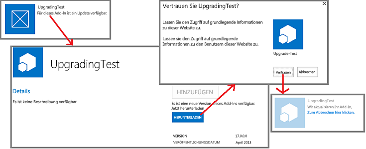
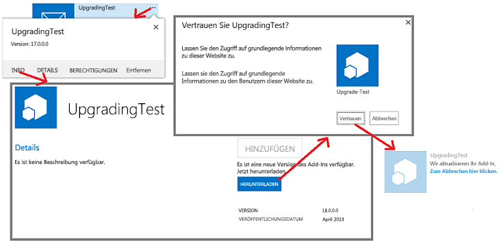

# Aktualisieren von Add-Ins für SharePointUpdate SharePoint Add-ins

Sie können Ihr SharePoint-Add-In aktualisieren, indem Sie die in SharePoint integrierte Updateunterstützung verwenden.You can update your SharePoint Add-in by using the updating support built into SharePoint. Innerhalb von 24 Stunden, nachdem Sie eine aktualisierte Version des Add-Ins in den Add-In-Katalog einer Organisation hochgeladen haben oder das Add-In im Office Store angenommen wurde, wird auf der Seite **Websiteinhalte** jeder Website, auf der das Add-In installiert ist, neben dem Add-In angezeigt, dass ein Update verfügbar ist.You can update your SharePoint Add-in by using the updating support built into SharePoint. Within 24 hours after you upload an updated version of the add-in to the organization's add-in catalog or the add-in is accepted at the Office Store, a notification that an update is available appears next to the add-in on  **Site Contents** page of every website where it is installed. As you can see in Figure 1, a link is provided for users to immediately install the update. Wie Sie in Abbildung 1 sehen können, wird Benutzern ein Link angezeigt, um das Update sofort zu installieren.As you can see in Figure 1, a link is provided for users to immediately install the update.
 
*Abbildung 1: Updateprozess für SharePoint-Add-Ins**Figure 1. Add-in for SharePoint update process*

 
Ein Benutzer kann das Update installieren, ohne vorher die frühere Version zu deinstallieren. Die Updateinfrastruktur testet die Updateinstallation und setzt sie zurück, falls Fehler auftreten.A user can install the update without first uninstalling the earlier version. The update infrastructure tests the update installation and rolls it back if there are any errors.
 
> [!IMPORTANT]
> Der *Add-In-Typ* kann nicht mithilfe des Updatesystems geändert werden.You cannot change the *add-in type* by using the update system. Sie können beispielsweise nicht ein von SharePoint gehostetes Add-In durch ein Update in ein vom Anbieter gehostetes Add-In ändern.For example, you cannot change an add-in from SharePoint-hosted to provider-hosted with an update. Um den Add-In-Typ zu ändern, müssen Sie [von einem alten Add-In zu einem neuen migrieren](sharepoint-add-ins-update-process.md#Major).To make a change of type, you need to [migrate from an old add-in to a new one](sharepoint-add-ins-update-process.md#Major). Insbesondere weil [das Vorschauprogramm für automatisch gehostete Add-Ins beendet wurde](http://blogs.office.com/2014/05/16/update-on-autohosted-apps-preview-program/.md), sollten Sie beachten, dass ein automatisch gehostetes Add-In nicht durch ein Update in ein vom Anbieter gehostetes Add-In geändert werden kann.In particular, because [the preview program for autohosted add-ins has been closed](http://blogs.office.com/2014/05/16/update-on-autohosted-apps-preview-program/.md), you should be aware that you cannot update an autohosted add-in to a provider-hosted add-in. Sie müssen das Add-In wie in [Konvertieren eines automatisch gehosteten Add-Ins für SharePoint in ein vom Anbieter gehostetes Add-In](convert-an-autohosted-sharepoint-add-in-to-a-provider-hosted-add-in.md) erklärt konvertieren.You have to convert the add-in as explained in [Convert an autohosted SharePoint Add-in to a provider-hosted add-in](convert-an-autohosted-sharepoint-add-in-to-a-provider-hosted-add-in.md).

## Voraussetzungen für das Aktualisieren eines SharePoint-Add-InsPrerequisites for updating a SharePoint Add-in

Bevor Sie ein SharePoint-Add-In aktualisieren, benötigen Sie Folgendes:Before you update a SharePoint Add-in, you need:

- Eine für die Add-In-Isolation konfigurierte SharePoint-Testinstallation.A test SharePoint installation that is configured for add-in isolation. Anweisungen zum Einrichten einer Office 365-Entwicklerwebsite finden Sie unter [Einrichten einer Entwicklungsumgebung für SharePoint-Add-Ins in Office 365](set-up-a-development-environment-for-sharepoint-add-ins-on-office-365.md).For instructions about how to set up an Office 365 Developer Site, see [Set up a development environment for SharePoint Add-ins on Office 365](set-up-a-development-environment-for-sharepoint-add-ins-on-office-365.md).

- Die zum Erstellen eines SharePoint-Add-Ins verwendeten Tools werden normalerweise auch zum Aktualisieren des Add-Ins verwendet.Tools that are used in creating a SharePoint Add-in are usually also used in updating it. For example, most developers use Visual Studio and Microsoft Office Developer Tools for Visual Studio to create SharePoint Add-ins. Die meisten Entwickler verwenden zum Beispiel Visual Studio und Microsoft Office Developer Tools für Visual Studio zum Erstellen von SharePoint-Add-Ins.Tools that are used in creating a SharePoint Add-in are usually also used in updating it. For example, most developers use Visual Studio and Microsoft Office Developer Tools for Visual Studio to create SharePoint Add-ins.

### Kernkonzepte für das Aktualisieren eines SharePoint-Add-InsCore concepts to know to update a SharePoint Add-in

Lesen Sie die Konzepte in der folgenden Tabelle, bevor Sie das Add-In aktualisieren.Review the concepts in the following table before updating your add-in.

**Tabelle 1. Kernkonzepte für das Aktualisieren eines SharePoint-Add-Ins****Table 1. Core concepts for updating a SharePoint Add-in**

|**Titel des Artikels****Article title**|**Beschreibung****Description**|
|:-----|:-----|
| [Auswählen von Mustern für die Entwicklung und das Hosting Ihres Add-Ins für SharePointChoose patterns for developing and hosting your SharePoint Add-in](choose-patterns-for-developing-and-hosting-your-sharepoint-add-in.md)|Informieren Sie sich über die verschiedenen Typen von SharePoint-Add-Ins. Der Updateprozess variiert je nach Typ.Learn about the different types of SharePoint Add-ins. The updating process varies depending on the type.|
| [Aktualisierungsverfahren für SharePoint-Add-InsSharePoint Add-ins update process](sharepoint-add-ins-update-process.md)|Informieren Sie sich über das Verfahren zum Aktualisieren von SharePoint-Add-Ins.Learn about the process for updating SharePoint Add-ins.|
| [Aktualisieren von FeaturesUpgrading Features](http://msdn.microsoft.com/library/e917f709-6491-4d50-adbe-2ab8f35da990%28Office.15%29.aspx)|Informieren Sie sich über das Aktualisieren von Features (SharePoint 2010 SDK).Learn how to update Features (SharePoint 2010 SDK).|
| [Bereitstellen und Installieren von SharePoint-Add-Ins: Methoden und OptionenDeploying and installing SharePoint Add-ins: methods and options](deploying-and-installing-sharepoint-add-ins-methods-and-options.md)|Informieren Sie sich über die Methoden zum Veröffentlichen, Installieren und Deinstallieren eines SharePoint-Add-Ins.Learn about the methods for publishing, installing, and uninstalling a SharePoint Add-in.|
| [Behandeln von Ereignissen in SharePoint-Add-InsHandle events in SharePoint Add-ins](handle-events-in-sharepoint-add-ins.md)|Informieren Sie sich über Remoteereignisempfänger in SharePoint.Learn about remote event receivers in SharePoint.|

## Wichtige Schritte beim Aktualisieren eines Add-InsMajor steps in updating an add-in

Im folgenden werden die wichtigsten Schritte erläutert, die beim Erstellen einer Aktualisierung für ein SharePoint-Add-In durchgeführt werden müssen.The following are the major steps that may be needed when you create an update for a SharePoint Add-in. Jeder Schritt wird in den zugehörigen Abschnitten oder Artikeln ausführlich erläutert.Each step is discussed in detail in linked sections or articles. Nicht alle Schritte sind in jedem Updateprojekt erforderlich.Not all the steps are required in every update project. Welche Schritte Sie durchführen müssen, hängt von den Komponenten in Ihrem Add-In und den Komponenten ab, die Sie hinzufügen.What you must do depends on what components are already in your add-in and what components you are adding. Nur die mit `**` gekennzeichneten Elemente sind immer erforderlich.Only the items marked with `**` are always required.

- Aktualisieren Sie das Add-In-Manifest.Update the add-in manifest.

   - `**` Erhöhen Sie die **Versions**nummer im [App](http://msdn.microsoft.com/library/d5f30dfe-7500-5f85-0f08-f4f220c0c692%28Office.15%29.aspx)-Element der Datei „appmanifest.xml“. (Add-Ins wurden bei der ersten Veröffentlichung des Schemas noch „Apps“ genannt).***** Raise the **Version** number in the App element of the appmanifest.xml file. (Add-ins were called "apps" when the schema was first released.) Do [not](http://msdn.microsoft.com/library/d5f30dfe-7500-5f85-0f08-f4f220c0c692%28Office.15%29.aspx)  change the ProductID number. Ändern Sie *nicht* die **ProductID**-Nummer.Do *not* change the **ProductID** number.
   
   - Ändern Sie den [AppPermissionRequests](http://msdn.microsoft.com/library/4e617622-78d3-3d23-677d-9957eb1fb107%28Office.15%29.aspx)-Abschnitt der Datei „appmanifest.xml“.Change the  [AppPermissionRequests](http://msdn.microsoft.com/library/4e617622-78d3-3d23-677d-9957eb1fb107%28Office.15%29.aspx) section of the appmanifest.xml file.
   
   - Ändern Sie den [AppPrerequisites](http://msdn.microsoft.com/library/7622b55f-01a1-2c39-9daa-7cfb1a3c890f%28Office.15%29.aspx)-Abschnitt der Datei „appmanifest.xml“.Change the  [AppPrerequisites](http://msdn.microsoft.com/library/7622b55f-01a1-2c39-9daa-7cfb1a3c890f%28Office.15%29.aspx) section of the appmanifest.xml file.
    
   Weitere Informationen finden Sie unter [Aktualisieren von Add-In-Version, Berechtigungsanforderungen und Voraussetzungen](#UpdateManifest).For more information, see  [Update the add-in version, permission requests, and prerequisites](#UpdateManifest).

- Fügen Sie das Markup für die Add-In-Webkomponenten hinzu, oder aktualisieren Sie dieses.Add or update the markup for add-in web components. For more information, see  Update add-in web components in SharePoint. Weitere Informationen finden Sie unter [Aktualisieren von Add-In-Webkomponenten in SharePoint](update-add-in-web-components-in-sharepoint.md).Add or update the markup for add-in web components. For more information, see  [Update add-in web components in SharePoint](update-add-in-web-components-in-sharepoint.md).

- Fügen Sie das Markup für die Hostwebkomponenten hinzu, oder aktualisieren Sie dieses.Add or update the markup for host web components. For more information, see  Update host web components in SharePoint. Weitere Informationen finden Sie unter [Aktualisieren von Hostwebkomponenten in SharePoint](update-host-web-components-in-sharepoint.md).Add or update the markup for host web components. For more information, see  [Update host web components in SharePoint](update-host-web-components-in-sharepoint.md).

- Fügen Sie benutzerdefinierte Logik zu [UpgradedEventEndpoint](http://msdn.microsoft.com/library/09a93d44-d295-47bb-f91c-d243178b0f53%28Office.15%29.aspx) hinzu, und registrieren Sie sie in der Datei „appmanifest.xml“.Add custom logic to an [UpgradedEventEndpoint](http://msdn.microsoft.com/library/09a93d44-d295-47bb-f91c-d243178b0f53%28Office.15%29.aspx) and register it in the appmanifest.xml file. For more information, see How to: Create an UpgradedEventEndpoint handler for SharePoint 2013. Weitere Informationen finden Sie unter [Erstellen eines Handlers für das Updateereignis in SharePoint-Add-Ins](create-a-handler-for-the-update-event-in-sharepoint-add-ins.md).Add custom logic to an  UpgradedEventEndpoint and register it in the appmanifest.xml file. For more information, see [Create a handler for the update event in SharePoint Add-ins](create-a-handler-for-the-update-event-in-sharepoint-add-ins.md).
    
- Aktualisieren Sie die Remotekomponenten:Update the remote components:
    
   - Aktualisieren Sie bei einem vom Anbieter gehosteten Add-In die Remotekomponenten mithilfe der Techniken, die für den Hostingplattformstapel geeignet sind.For a provider-hosted add-in, update the remote components using the techniques appropriate for the hosting platform stack. 
   
   Weitere Informationen finden Sie unter [Aktualisieren von Remotekomponenten in SharePoint-Add-Ins](update-remote-components-in-sharepoint-add-ins.md).For more information, see  [Update remote components in SharePoint Add-ins](update-remote-components-in-sharepoint-add-ins.md).
    
- `**` Laden Sie das Add-In-Paket in den Office Store oder den Add-In-Katalog der Organisation hoch.`**`***** Upload the add-in package to the Office Store or the organization's add-in catalog.

## Bewährte Vorgehensweisen für Add-In-UpdatesBest practices for add-in updates

In den folgenden Abschnitten werden Praktiken, die Sie befolgen sollten, und wichtige Punkte erläutert, die Sie bei der Planung eines Updates berücksichtigen sollten.The following sections discuss practices you should follow and important points to consider as you are planning an update.

### Entscheiden Sie, ob ein Update wirklich erforderlich istDecide whether you really have to update

Für ein vom Anbieter gehostetes SharePoint-Add-In ist es für Verbesserungen des Add-Ins nicht unbedingt erforderlich, das Add-In zu aktualisieren.For a provider-hosted SharePoint Add-in, improvements to the add-in do not necessarily require updating the add-in. Wenn alle Änderungen an Remotekomponenten vorgenommen werden und diese Änderungen nicht in SharePoint-Komponenten angezeigt werden sollen, können Sie die Remotekomponenten ändern, ohne das Add-In zu aktualisieren.If all the changes are to remote components, and those changes don't have to be reflected in SharePoint components, you can change the remote components without updating the add-in. Solange keine Änderungen an den URLs und Verbindungszeichenfolgen erfolgen, die die SharePoint-Komponenten für den Zugriff auf Remotekomponenten verwenden, funktioniert das SharePoint-Add-In weiterhin.As long as the URLs and connection strings that the SharePoint components use to access the remote components do not change, the SharePoint Add-in continues to work. 

Beispiel: Sie fügen eine Schaltfläche in einer webbasierten Remoteanwendung hinzu, mit der eine Spalte aus einer SharePoint-Liste gelesen wird, die die Webanwendung zuvor nicht gelesen hat.For example, suppose that you add a button to a remote web application that reads a column from a SharePoint list that the web application did not previously read. Wenn die Spalte bereits in der Liste vorhanden ist, müssen Sie keine Änderungen in SharePoint vornehmen.If the column already exists on the list, you do not have to change anything in SharePoint. Sie können die überarbeitete Webseite und die überarbeitete CodeBehind-Datei oder JavaScript-Code in der Remote-Webanwendung hochladen.You can upload the revised webpage, and the revised code-behind or JavaScript, to the remote web application. Die neue Funktionalität ist sofort für Benutzer verfügbar, wenn sie das SharePoint-Add-In starten.The new functionality is immediately available to users when they start the SharePoint Add-in.

### Bedenken Sie, dass Aktualisieren für Benutzer optional istRemember that updating is optional for users

Wenn eine neue Version Ihres SharePoint-Add-Ins in dem Office Store oder dem Add-In-Katalog der Organisation verfügbar ist, wird auf der Add-In-Kachel auf der Seite **Websiteinhalte** eine Meldung angezeigt, in der Benutzer darauf hingewiesen werden, dass ein Update verfügbar ist.When a new version of your SharePoint Add-in becomes available in the Office Store or the organization's add-in catalog, a message appears on the add-in's tile on the **Site Contents** page informing users that an update is available. Es dauert nicht länger als 24 Stunden, bis diese Meldung angezeigt wird.It takes no more than 24 hours for this message to appear. In der SharePoint-Infrastruktur gibt es jedoch keine Möglichkeit, den Benutzer zum Aktualisieren zu zwingen.But nothing in the SharePoint infrastructure forces users to update. Änderungen, die Sie an Remotekomponenten vornehmen, dürfen somit nicht die älteren Versionen des Add-Ins zerstören.So changes that you make to remote components must not break the older versions of the add-in. Sie sollten in der Regel Elemente zu Remotekomponenten *hinzufügen* und es jedoch vermeiden, Elemente zu löschen, umzubenennen, zu verschieben, Änderungen am Schema, der Verbindungszeichenfolge oder der URL vorhandener Komponenten vorzunehmen.A general, but not quite universal, rule is that you should *add* things to remote components, but avoid deleting, renaming, moving, or changing the schema, connection string, or URL of any existing component.

Wenn eine Remotekomponente die Version der aufzurufenden Add-In-Instanz kennen muss, können Sie diese Information aus SharePoint übergeben.If a remote component needs to know the version of the add-in instance that is calling it, you can pass this information from SharePoint. For example, you can add the add-in version as a query parameter on the  StartPage URL of the add-in. Sie können z. B. die Add-In-Version als Abfrageparameter hinzufügen zu der [StartPage](http://msdn.microsoft.com/library/3092674c-a6c3-9021-3d7e-e716562a4a4f%28Office.15%29.aspx)-URL des Add-Ins hinzufügen.If a remote component needs to know the version of the add-in instance that is calling it, you can pass this information from SharePoint. For example, you can add the add-in version as a query parameter on the  [StartPage](http://msdn.microsoft.com/library/3092674c-a6c3-9021-3d7e-e716562a4a4f%28Office.15%29.aspx) URL of the add-in.

### Erstellen und Debuggen Sie die neue Version, als ob es ein ganz neues Add-In wäreCreate and debug the new version as if it were a brand new add-in

Sie sollten die Entwicklung und das Debuggen der neuen Version eines Add-Ins vom Debuggen des Update-Markups und der Updatelogik trennen. Deinstallieren Sie dazu die frühere Version des Add-Ins auf Ihrer SharePoint-Entwicklungstestwebsite. Speichern Sie eine Kopie der Add-In-Paketdatei für die frühere Version. Fügen Sie nach Bedarf Komponenten des Add-In hinzu, und ändern Sie diese, und testen und debuggen Sie diese dann mithilfe der Testwebsite, als ob es sich um ein ganz neues Add-In handeln würde, die Sie von Grund auf neu erstellen.You should separate the development and debugging of the new version of the add-in from the debugging of the update markup and logic. To do this, uninstall the earlier version of the add-in from your development test SharePoint site. Save a backup copy of the add-in package file for the earlier version. Add and change components of the add-in as needed, and then test and debug them against the test site as if it is a brand new add-in you are creating from scratch.

### Testen Sie das Update mit jeder früheren Version des Add-InsTest the update with each earlier version of the add-in

Wenn die neue Version des Add-Ins als neues Add-In ordnungsgemäß funktioniert, strukturieren Sie den Code und das Markup so neu, dass das Projekt ein Update des alten Add-Ins darstellt.When the new version of the add-in is functioning correctly as a "new" add-in, restructure the code and markup so that the project is an update of the old add-in. For example, increment the add-in version number as indicated in Major steps in updating an add-in. For more information about turning the project into an update, see the child topics of this topic. Erhöhen Sie zum Beispiel die Add-In-Versionsnummer wie in [Wichtige Schritte beim Aktualisieren eines Add-Ins](#MajorAppUpgradeSteps) angegeben.For example, increment the add-in version number as indicated in [Major steps in updating an add-in](#MajorAppUpgradeSteps). Weitere Informationen zum Umwandeln des Projekts in ein Update finden Sie in den untergeordneten Themen dieses Themas.For more information about turning the project into an update, see the child topics of this topic.

Wenn Sie das Update testen möchten, ziehen Sie die neue Version von der Testwebsite zurück und stellen Sie die frühere Version erneut bereit, damit Sie die Logik des Updates testen können.When you are ready to test your update, retract the new version from the test site and redeploy the earlier version so you can test update logic. Wenn Sie über mehrere Vorgängerversionen des Add-Ins verfügen, installieren Sie jede Vorgängerversion auf einer anderen Unterwebsite Ihrer Testwebsite.If you have shipped multiple previous versions of the add-in, install each earlier version on a different subweb of your test site. Laden Sie anschließend die neueste Version des Add-Ins in den Add-In-Katalog der Testwebsite hoch und aktualisieren Sie jede Instanz des Add-Ins.Then upload the latest version of the add-in to your test site's add-in catalog and update every instance of the add-in. Stellen Sie sicher, dass jede Instanz über die neueste Add-In-Versionsnummer und die neueste Version aller Komponenten verfügt.Verify that each has the latest add-in version number and the latest version of all components. Wenn das Add-In über ein Add-In-Web verfügt, stellen Sie sicher, dass die Add-In-Webkomponenten mithilfe des Verfahrens unter [Überprüfen der Bereitstellung von-Add-In-Webkomponenten](update-add-in-web-components-in-sharepoint.md#VerifyDeployAppWebComp) bereitgestellt wurden.If there is an add-in web in the add-in, verify that the add-in web components have been deployed by using the procedure in [Verify deployment of add-in web components](update-add-in-web-components-in-sharepoint.md#VerifyDeployAppWebComp).

### Aktualisieren eines Add-Ins, ohne 24 Stunden zu wartenUpdate an add-in without waiting 24 hours

Wenn Sie ein Update für ein Add-In auf Ihrer SharePoint-Testwebsite entwickeln, ist es unpraktisch, 24 Stunden zwischen Updates warten zu müssen.When developing an update for an add-in on your SharePoint test site, it is impractical to wait 24 hours between updates. You (and users on a production SharePoint site) can update an add-in immediately after it is uploaded to the spstore or the organization's add-in catalog with these steps: Sie (und Benutzer auf einer SharePoint-Produktionswebsite) können ein Add-In unmittelbar aktualisieren, nachdem es in den Office Store oder den Add-In-Katalog der Organisation mit diesen Schritten hochgeladen wurde.When developing an update for an add-in on your SharePoint test site, it is impractical to wait 24 hours between updates. You (and users on a production SharePoint site) can update an add-in immediately after it is uploaded to the Office Store or the organization's add-in catalog with these steps:

#### So aktualisieren Sie ein Add-In sofortTo immediately update an add-in

1. Nachdem das aktuelle Update zum Add-In-Katalog hochgeladen wurde, öffnen Sie auf der Website, auf der das Add-In installiert wird, die Seite **Websiteinhalte**, und wählen Sie auf der Kachel des Add-Ins die Schaltfläche **...** aus.After the latest update is uploaded to the add-in catalog, open the  **Site Contents** page on the website where the add-in is installed and choose the **...** button on the add-in's tile.

2. Wählen Sie im daraufhin angezeigten Popup die Registerkarte **Info** aus. Die angezeigte **Info**-Seite enthält einen Hinweis darauf, dass eine neue Version verfügbar ist.On the callout that opens, choose the  **About** tab. On the **About** page that opens, there is a notice that a new version is available.

3. Wählen Sie die Schaltfläche **Herunterladen** aus.Select the **Get It** button. Die Seite **Websiteinhalte** wird erneut geöffnet, und auf der Kachel des Add-Ins wird ein Hinweis angezeigt, dass das Add-In aktualisiert wird.Choose the  Get It button. The **Site Contents** page reopens, and there is a notice on the add-in's tile that the add-in is being updated.

Abbildung 2 illustriert diese Schritte.Figure 2 illustrates these steps.

*Abbildung 2. Vorgehensweise, um ein SharePoint-Add-In sofort zu aktualisieren**Figure 2. Process of immediately updating a SharePoint Add-in*

> [!NOTE]
> Wenn Sie den Hinweis auf der Kachel des Add-Ins, dass ein Update verfügbar ist, häufiger als alle 24 Stunden anzeigen müssen, können Sie die unter [Aktualisierungsverfahren für ein Add-In für SharePoint](sharepoint-add-ins-update-process.md#Minor) beschriebene Methode verwenden, um den Hinweis sofort anzuzeigen.If you need to see the "update available" notice on the add-in's tile more frequently than every 24 hours, you can use the method described in [Update process for a SharePoint Add-in](sharepoint-add-ins-update-process.md#Minor) to make the notice appear immediately.

## Aktualisieren von Add-In-Version, Berechtigungsanforderungen und VoraussetzungenUpdate the add-in version, permission requests, and prerequisites

Öffnen Sie nach dem Erstellen einer Sicherungskopie des Visual Studio-Projektordners das Add-In-Projekt.After making a backup copy of the Visual Studio project folder, open the add-in project. Open add-in manifest and raise the version number on the  General tab of the manifest designer. Öffnen Sie das Add-In-Manifest und erhöhen Sie im Manifest-Designer die Versionsnummer auf der Registerkarte **Allgemein**.After making a backup copy of the vsnv project folder, open the add-in project. Open add-in manifest and raise the version number on the **General** tab of the manifest designer.

Wenn die aktualisierte Version des Add-Ins mehr (oder weniger) Berechtigungen für Komponenten des Hostwebs benötigt, nehmen Sie nach Bedarf Änderungen am Abschnitt [AppPermissionRequests](http://msdn.microsoft.com/library/4e617622-78d3-3d23-677d-9957eb1fb107%28Office.15%29.aspx) des Add-ins vor.If the updated version of the app needs more (or fewer) permissions to components of the host web, make changes as needed to the [AppPermissionRequests](http://msdn.microsoft.com/library/4e617622-78d3-3d23-677d-9957eb1fb107%28Office.15%29.aspx) section of the app. In vsdev11short, use the Permissions tab of the manifest designer. Verwenden Sie in Visual Studio die Registerkarte **Berechtigungen** des Manifest-Designers.In Visual Studio, use the **Permissions** tab of the manifest designer. 

Wenn ein Add-In aktualisiert wird, wird der Benutzer immer aufgefordert, Berechtigungen zu gewähren, unabhängig davon, ob sich die Berechtigungen seit der vorherigen Version geändert haben.When an add-in is updated, the user is always prompted to grant permissions, whether the permissions have changed or not since the previous version. Wenn die neue Version *weniger* Berechtigungen als die vorherige Version benötigt, werden die zusätzlichen Berechtigungen der vorherigen Version *nicht widerrufen*.If the new version requests *fewer* permissions than the preceding version, the additional permissions of the preceding version *are not revoked*. Die einzige Möglichkeit, die Berechtigungen für das Add-In einzugrenzen, die die neue Version benötigt, besteht für Benutzer darin, die Seite *{SharePointDomain}* `/_layouts/15/appinv.aspx` nach der Aktualisierung des Add-Ins zu öffnen und das Berechtigungsmarkup manuell einzugeben, das dem [AppPermissionRequests](http://msdn.microsoft.com/library/4e617622-78d3-3d23-677d-9957eb1fb107%28Office.15%29.aspx)-Schema entspricht.The only way to restrict the add-in to the permissions that the latest version needs is for a user to open the page *{SharePointDomain}* `/_layouts/15/appinv.aspx` after the add-in has been updated, and then manually enter permission markup that conforms to the [AppPermissionRequests](http://msdn.microsoft.com/library/4e617622-78d3-3d23-677d-9957eb1fb107%28Office.15%29.aspx) schema.

Wenn die aktualisierte Version des Add-Ins Anforderungen hat, die frühere Versionen nicht hatten (oder keine Anforderungen mehr hat, die frühere Versionen hatten), nehmen Sie nach Bedarf Änderungen am Abschnitt [AppPrerequisites](http://msdn.microsoft.com/library/7622b55f-01a1-2c39-9daa-7cfb1a3c890f%28Office.15%29.aspx) des Add-Ins vor.If the updated version of the add-in has prerequisites that the earlier versions did not have (or no longer has some prerequisites that earlier versions had), make changes as needed to the  [AppPrerequisites](http://msdn.microsoft.com/library/7622b55f-01a1-2c39-9daa-7cfb1a3c890f%28Office.15%29.aspx) section of the add-in. In Visual Studio, use the Prerequisites tab of the manifest designer. Verwenden Sie in Visual Studio die Registerkarte **Erforderliche Komponenten** des Manifest-Designers.In Visual Studio, use the **Prerequisites** tab of the manifest designer.

## Nächste SchritteNext steps

Fahren Sie mit dem nächsten Aufzählungspunkt im Abschnitt [Wichtige Schritte beim Aktualisieren eines Add-Ins](#MajorAppUpgradeSteps) fort, oder wechseln Sie direkt zu einem der folgenden Artikel:Continue with the next bullet in the section  [Major steps in updating an add-in](#MajorAppUpgradeSteps) or go directly to one of the following articles:

-  [Aktualisieren von Add-In-Webkomponenten in SharePointUpdate add-in web components in SharePoint](update-add-in-web-components-in-sharepoint.md)
-  [Aktualisieren von Hostwebkomponenten in SharePointUpdate host web components in SharePoint](update-host-web-components-in-sharepoint.md)
-  [Erstellen eines Handlers für das Updateereignis in SharePoint-Add-InsCreate a handler for the update event in SharePoint Add-ins](create-a-handler-for-the-update-event-in-sharepoint-add-ins.md)
-  [Aktualisieren von Remotekomponenten in SharePoint-Add-InsUpdate remote components in SharePoint Add-ins](update-remote-components-in-sharepoint-add-ins.md)
    
## Zusätzliche RessourcenAdditional resources

-  [Entwickeln von SharePoint-Add-insDevelop SharePoint Add-ins](develop-sharepoint-add-ins.md)
-  [Aktualisierungsverfahren für SharePoint-Add-InsSharePoint Add-ins update process](sharepoint-add-ins-update-process.md) 
    
 

