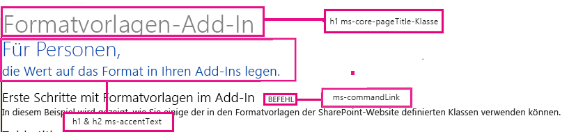
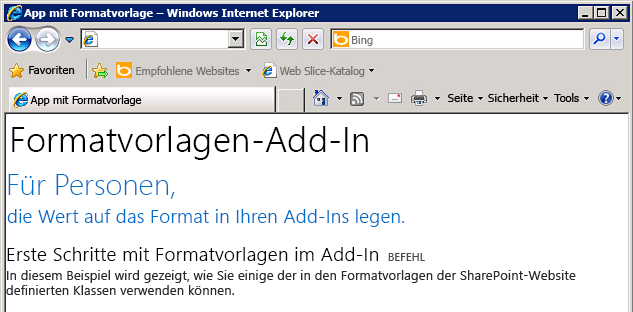

# <a name="use-a-sharepoint-websites-style-sheet-in-sharepoint-add-ins"></a>Verwenden des Stylesheets einer SharePoint-Website in SharePoint-Add-Ins
In diesem Artikel erhalten Sie Informationen zur Verwendung des Stylesheets einer SharePoint-Website in einem SharePoint-Add-In.
 

 **Hinweis** Der Name „Apps für SharePoint“ wird in „SharePoint-Add-Ins“ geändert. Während des Übergangszeitraums wird in der Dokumentation und der Benutzeroberfläche einiger SharePoint-Produkte und Visual Studio-Tools möglicherweise weiterhin der Begriff „Apps für SharePoint“ verwendet. Weitere Informationen finden Sie unter [Neuer Name für Office- und SharePoint-Apps](new-name-for-apps-for-sharepoint.md#bk_newname).
 

Sie können in Ihrem SharePoint-Add-In auf das Stylesheet einer SharePoint-Website verweisen und es zum Formatieren Ihrer Webseiten nutzen, indem Sie das Stylesheet in SharePoint verwenden. Wenn ein Benutzer das Stylesheet oder Design der SharePoint-Website ändert, können Sie außerdem die neue Gruppe von Formatvorlagen in Ihr Add-In übernehmen, ohne den Stylesheet-Verweis im Add-In ändern zu müssen.
 

 **Wichtig** Wenn Sie für Ihre Webseiten das Chromsteuerelement oder die Add-In-Masterseite verwenden, sind die Stylesheets für Sie bereits verfügbar. Sie müssen dann nicht manuell auf das Stylesheet verweisen, indem Sie das in diesem Artikel beschriebene Verfahren nutzen. 
 


## <a name="prerequisites-for-using-the-examples-in-this-article"></a>Voraussetzungen für die Verwendung der Beispiele in diesem Artikel
<a name="SP15Usestylesheetcontrol_Prereq"> </a>

Sie benötigen eine Entwicklungsumgebung, wie unter [Erste Schritte beim Erstellen von von einem Anbieter gehosteten SharePoint-Add-Ins](get-started-creating-provider-hosted-sharepoint-add-ins.md) erläutert.
 

 

### <a name="core-concepts-to-know-before-using-the-sharepoint-style-sheet-in-a-sharepoint-add-in"></a>Kernkonzepte, die Ihnen vor der Verwendung des SharePoint-Stylesheets in einem SharePoint-Add-In bekannt sein sollten

In der folgenden Tabelle sind Artikel aufgeführt, die Ihnen das Verständnis der relevanten Konzepte in einem Szenario mit Verwendung des SharePoint-Stylesheets erleichtern.
 

 

**Tabelle 1. Kernkonzepte vor der Verwendung des Stylesheets**


|**Titel des Artikels**|**Beschreibung**|
|:-----|:-----|
| [SharePoint-Add-Ins](sharepoint-add-ins.md)|Hier finden Sie Informationen über das neue Add-In-Modell in SharePoint, das es Ihnen ermöglicht, Add-Ins als kompakte, einfach zu verwendende Lösungen für Endbenutzer zu erstellen.|
| [UX-Design für SharePoint-Add-Ins](ux-design-for-sharepoint-add-ins.md)|Hier erfahren Sie mehr über die UX-Optionen (User eXperience, Benutzerumgebung) und Alternativen beim Erstellen von SharePoint-Add-Ins.|
| [Hostwebs, Add-In-Webs und SharePoint-Komponenten in SharePoint](host-webs-add-in-webs-and-sharepoint-components-in-sharepoint.md)|Lernen Sie den Unterschied zwischen Hostwebs und App-Webs kennen. Erfahren Sie, welche SharePoint-Komponenten in eine SharePoint-Add-In eingeschlossen werden können, welche Komponenten im Hostweb und welche im App-Web bereitgestellt werden und wie das App-Web in einer isolierten Domäne bereitgestellt wird.|

## <a name="code-example-use-a-sharepoint-websites-style-sheet-in-a-sharepoint-add-in"></a>Codebeispiel: Verwenden des Stylesheets einer SharePoint-Website in einem SharePoint-Add-In
<a name="SP15Usestylesheetcontrol_Example"> </a>

This code example shows you how to use the SharePoint website's stylesheet. This enables your remote web application pages to match the look-and-feel of the pages in the SharePoint host web.
 

 
Führen Sie die folgenden Schritte aus, um das Stylesheet in einer SharePoint-Add-In zu verwenden:
 

 

1. Erstellen Sie die vom Anbieter gehostete SharePoint-Add-In. 
    
 
2. Erzwingen Sie die App-Webbereitstellung, indem Sie eine leere Seite erstellen.
    
 
3. Fügen Sie dem Webprojekt eine Webseite hinzu, und verweisen Sie auf das Stylesheet.
    
 
4. Bearbeiten Sie das Element im App-Manifest.
    
 
In Abbildung 1 ist eine SharePoint-Webseite dargestellt, die das Stylesheet verwendet.
 

 

**Abbildung 1. Webseite, die das Stylesheet verwendet**

 

 

 

### <a name="to-create-the-sharepoint-add-in-and-remote-web-projects"></a>So erstellen Sie die SharePoint-Add-In- und Remoteweb-Projekte


1. Öffnen Sie Visual Studio als Administrator. (Klicken Sie dazu im Menü **Start** mit der rechten Maustaste auf das Visual Studio-Symbol, und wählen Sie **Als Administrator ausführen** aus.)
    
 
2. Erstellen Sie das von einem Anbieter gehostete SharePoint-Add-In wie unter [Erste Schritte beim Erstellen von von einem Anbieter gehosteten SharePoint-Add-Ins](get-started-creating-provider-hosted-sharepoint-add-ins.md) erläutert, und nennen Sie es „StylesheetAdd-In“. 
    
 

### <a name="to-force-the-add-in-web-provisioning-by-creating-a-blank-page"></a>So erzwingen Sie die Add-In-Webbereitstellung, indem Sie eine leere Seite erstellen


1. Klicken Sie mit der rechten Maustaste auf das SharePoint-Add-In-Projekt, und fügen Sie ein neues Modul hinzu.
    
 
2. Klicken Sie mit der rechten Maustaste auf das neue Modul, und fügen Sie ein neues Element hinzu.
    
 
3. Wählen Sie unter **Visual C#-Elemente**, **Web** die Option **HTML-Seite**. Benennen Sie die Seite in **blank.html** um.
    
 
4. Löschen Sie den Inhalt der Datei „blank.html“.
    
 

### <a name="to-add-a-webpage-that-references-the-style-sheet-in-the-web-project"></a>So fügen Sie im Webprojekt eine Webseite hinzu, die auf das Stylesheet verweist


1. Klicken Sie mit der rechten Maustaste auf das Webprojekt, und fügen Sie ein neues Web Form hinzu. Benennen Sie das Web Form in **StyleConsumer.aspx** um.
    
 
2. Ersetzen Sie den Inhalt der Web Form-ASPX-Datei durch den folgenden Code. Mit dem Code werden die folgenden Aufgaben durchgeführt:
    
      - Laden der Seite "blank.html" aus dem App-Web in ein unsichtbares IFrame-Element.
    
 
  - Laden der Datei "defaultcss.ashx" aus dem App-Web.
    
 
  - Verwenden der verfügbaren StyleSheets.
    
 

```
  <%@ Page Language="C#" AutoEventWireup="true" CodeBehind="StyleConsumer.aspx.cs" Inherits="StylesheetAppWeb.StyleConsumer" %>

<!DOCTYPE html>
<html>
<head>
    <title>Add-in using stylesheet</title>
</head>
<body>

    <!-- The main page title -->
    <h1 class="ms-core-pageTitle">Stylesheet add-in</h1>

    <!-- Some subtitle -->
    <h1 class="ms-accentText">For people</h1>

    <!-- Subtitle comments -->
    <h2 class="ms-accentText">who care about the style in their add-ins</h2>
    <p></p>
    <div>
        <h2 class="ms-webpart-titleText">Get started with style in your add-in... </h2>
        <a class="ms-commandLink" href="#">some command</a>
        <br />
        This sample shows you how to use some of the classes defined in the SharePoint website's style sheet.
    </div>

    <!-- Script to load SharePoint resources
        and load the blank.html page in
        the invisible iframe
        -->
    <script type="text/javascript">
        "use strict";
        var appweburl;

        (function () {
            var ctag;

            // Get the URI decoded add-in web URL.
            appweburl =
                decodeURIComponent(
                    getQueryStringParameter("SPAppWebUrl")
            );
            // Get the ctag from the SPClientTag token.
            ctag =
                decodeURIComponent(
                    getQueryStringParameter("SPClientTag")
            );

            // The resource files are in a URL in the form:
            // web_url/_layouts/15/Resource.ashx
            var scriptbase = appweburl + "/_layouts/15/";

            // Dynamically create the invisible iframe.
            var blankiframe;
            var blankurl;
            var body;
            blankurl = appweburl + "/Pages/blank.html";
            blankiframe = document.createElement("iframe");
            blankiframe.setAttribute("src", blankurl);
            blankiframe.setAttribute("style", "display: none");
            body = document.getElementsByTagName("body");
            body[0].appendChild(blankiframe);

            // Dynamically create the link element.
            var dclink;
            var head;
            dclink = document.createElement("link");
            dclink.setAttribute("rel", "stylesheet");
            dclink.setAttribute("href", scriptbase + "defaultcss.ashx?ctag=" + ctag);
            head = document.getElementsByTagName("head");
            head[0].appendChild(dclink);
        })();

        // Function to retrieve a query string value.
        // For production purposes you may want to use
        //  a library to handle the query string.
        function getQueryStringParameter(paramToRetrieve) {
            var params;
            var strParams;

            params = document.URL.split("?")[1].split("&amp;");
            strParams = "";
            for (var i = 0; i < params.length; i = i + 1) {
                var singleParam = params[i].split("=");
                if (singleParam[0] == paramToRetrieve)
                    return singleParam[1];
            }
        }
    </script>
</body>
</html>

```


    In some cases, the user has to be authenticated to SharePoint before your page will be able to download the CSS and images for styling. Link tags do not automatically authenticate a user who is not already signed in. Consider loading a page resource from the add-in web in your webpage to force the user's authentication before linking to the CSS file. In this example, the blank.html page is loaded in an invisible IFrame.
    
 

### <a name="to-edit-the-startpage-element-in-the-add-in-manifest"></a>So bearbeiten Sie das StartPage-Element im Add-In-Manifest


1. Doppelklicken Sie im **Projektmappen-Explorer** auf die Datei **AppManifest.xml**.
    
 
2. Wählen Sie im Dropdownmenü **Startseite** die Webseite aus, auf der das Stylesheet verwendet wird.
    
 

### <a name="to-build-and-run-the-solution"></a>So erstellen Sie die Lösung und führen sie aus


1. Stellen Sie sicher, dass das "SharePoint-Add-In"-Projekt als Startprojekt festgelegt ist.
    
 
2. Drücken Sie F5.
    
     **Hinweis** Wenn Sie F5 drücken, erstellt Visual Studio die Lösung, stellt das Add-In bereit und öffnet die Berechtigungsseite für das Add-In.
3. Klicken Sie auf die Schaltfläche **Vertrauen**.
    
 
4. Klicken Sie auf das Add-In-Symbol **StylesheetBasic**.
    
 
5. Abbildung 2 zeigt die resultierende Webseite mit dem SharePoint-Stylesheet.
    
    **Abbildung 2: Auf der Seite verwendetes Stylesheet**

 

  
 

 

 
6. Sie können auch zum Hostweb wechseln und das Design ändern. Laden Sie anschließend die Webseite des Add-Ins neu, damit die neuen Stylesheets verwendet werden.
    
 

**Tabelle 2: Problembehandlung für die Lösung**


|**Problem**|**Lösung**|
|:-----|:-----|
|Der Browser wird nicht geöffnet, nachdem Sie F5 gedrückt haben.|Legen Sie das SharePoint-Add-In-Projekt als Startprojekt fest.|
|Zertifikatfehler|Legen Sie die Eigenschaft **SSL-aktiviert** des Webprojekts auf „false“ fest. Legen Sie im SharePoint-Add-In-Projekt die Eigenschaft **Webprojekt** auf „Kein“ fest, und setzen Sie die Eigenschaft dann wieder auf den Namen des Webprojekts zurück. |

## <a name="next-steps"></a>Nächste Schritte
<a name="SP15Usestylesheetcontrol_Nextsteps"> </a>

In diesem Artikel wurde die Verwendung des Stylesheets in einer SharePoint-Add-In erläutert. Als Nächstes können Sie andere verfügbare UX-Komponenten für SharePoint-Add-Ins kennen lernen. Weitere Informationen finden Sie in den folgenden Ressourcen:
 

 

-  [Codebeispiel: Verwenden des SharePoint-Stylesheets in einem Add-In](http://code.msdn.microsoft.com/SharePoint-Use-the-7a8684e2)
    
 
-  [Verwenden des Client-Chromsteuerelements in SharePoint-Add-Ins](use-the-client-chrome-control-in-sharepoint-add-ins.md)
    
 
-  [Erstellen benutzerdefinierter Aktionen zur Bereitstellung mit SharePoint-Add-Ins](create-custom-actions-to-deploy-with-sharepoint-add-ins.md)
    
 
-  [Erstellen von Add-In-Webparts zur Installation mit Ihrem SharePoint-Add-In](create-add-in-parts-to-install-with-your-sharepoint-add-in.md)
    
 

## <a name="additional-resources"></a>Zusätzliche Ressourcen
<a name="SP15Usestylesheetcontrol_Addresources"> </a>


-  [UX-Design für SharePoint-Add-Ins](ux-design-for-sharepoint-add-ins.md)
    
 
-  [Designrichtlinien für die Benutzerfreundlichkeit von Add-Ins für SharePoint](sharepoint-add-ins-ux-design-guidelines.md)
    
 
-  [Erstellen von UX-Komponenten in SharePoint](create-ux-components-in-sharepoint.md)
    
 
-  [Drei Ansätze, um Entwurfsentscheidungen für SharePoint-Add-Ins zu treffen](three-ways-to-think-about-design-options-for-sharepoint-add-ins.md)
    
 
-  [Kritische Aspekte der Architektur und der Entwicklungslandschaft für SharePoint-Add-Ins](important-aspects-of-the-sharepoint-add-in-architecture-and-development-landscap.md)
    
 

