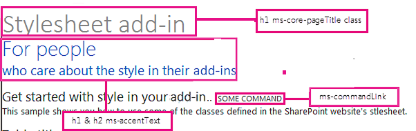

# <a name="use-a-sharepoint-websites-style-sheet-in-sharepoint-add-ins"></a><span data-ttu-id="e205b-101">Verwenden des Stylesheets einer SharePoint-Website in SharePoint-Add-Ins</span><span class="sxs-lookup"><span data-stu-id="e205b-101">Use a SharePoint website's style sheet in SharePoint Add-ins</span></span>
<span data-ttu-id="e205b-102">In diesem Artikel erhalten Sie Informationen zur Verwendung des Stylesheets einer SharePoint-Website in einem SharePoint-Add-In.</span><span class="sxs-lookup"><span data-stu-id="e205b-102">Learn how to use a SharePoint website's style sheet in an SharePoint Add-in.</span></span>
 

 <span data-ttu-id="e205b-p101">**Hinweis** Der Name „Apps für SharePoint“ wird in „SharePoint-Add-Ins“ geändert. Während des Übergangszeitraums wird in der Dokumentation und der Benutzeroberfläche einiger SharePoint-Produkte und Visual Studio-Tools möglicherweise weiterhin der Begriff „Apps für SharePoint“ verwendet. Weitere Informationen finden Sie unter [Neuer Name für Office- und SharePoint-Apps](new-name-for-apps-for-sharepoint#bk_newname).</span><span class="sxs-lookup"><span data-stu-id="e205b-p101">The name "apps for SharePoint" is changing to "SharePoint Add-ins". During the transition, the documentation and the UI of some SharePoint products and Visual Studio tools might still use the term "apps for SharePoint". For details, see [New name for apps for Office and SharePoint](new-name-for-apps-for-sharepoint#bk_newname).</span></span>
 

<span data-ttu-id="e205b-p102">Sie können in Ihrem SharePoint-Add-In auf das Stylesheet einer SharePoint-Website verweisen und es zum Formatieren Ihrer Webseiten nutzen, indem Sie das Stylesheet in SharePoint verwenden. Wenn ein Benutzer das Stylesheet oder Design der SharePoint-Website ändert, können Sie außerdem die neue Gruppe von Formatvorlagen in Ihr Add-In übernehmen, ohne den Stylesheet-Verweis im Add-In ändern zu müssen.</span><span class="sxs-lookup"><span data-stu-id="e205b-p102">You can reference the style sheet of a SharePoint website in your SharePoint Add-in and use it to style your webpages by using the style sheet in SharePoint. In addition, if someone changes the SharePoint website's style sheet or theme, you can adopt the new set of styles in your add-in without modifying the style sheet reference in your add-in.</span></span>
 

 <span data-ttu-id="e205b-108">**Wichtig** Wenn Sie für Ihre Webseiten das Chromsteuerelement oder die Add-In-Masterseite verwenden, sind die Stylesheets für Sie bereits verfügbar. Sie müssen dann nicht manuell auf das Stylesheet verweisen, indem Sie das in diesem Artikel beschriebene Verfahren nutzen.</span><span class="sxs-lookup"><span data-stu-id="e205b-108">**Important** If your webpages use the chrome control or the add-in master page, the styles are already available for you to use, and you don't have to reference the style sheet manually by using the procedure in this article.</span></span> 
 


## <a name="prerequisites-for-using-the-examples-in-this-article"></a><span data-ttu-id="e205b-109">Voraussetzungen für die Verwendung der Beispiele in diesem Artikel</span><span class="sxs-lookup"><span data-stu-id="e205b-109">Prerequisites for using the examples in this article</span></span>
<span data-ttu-id="e205b-110"><a name="SP15Usestylesheetcontrol_Prereq"> </a></span><span class="sxs-lookup"><span data-stu-id="e205b-110"></span></span>

<span data-ttu-id="e205b-111">Sie benötigen eine Entwicklungsumgebung, wie unter [Erste Schritte beim Erstellen von von einem Anbieter gehosteten SharePoint-Add-Ins](get-started-creating-provider-hosted-sharepoint-add-ins) erläutert.</span><span class="sxs-lookup"><span data-stu-id="e205b-111">You need a development environment as explained in  [Get started creating provider-hosted SharePoint Add-ins](get-started-creating-provider-hosted-sharepoint-add-ins).</span></span>
 

 

### <a name="core-concepts-to-know-before-using-the-sharepoint-style-sheet-in-a-sharepoint-add-in"></a><span data-ttu-id="e205b-112">Kernkonzepte, die Ihnen vor der Verwendung des SharePoint-Stylesheets in einem SharePoint-Add-In bekannt sein sollten</span><span class="sxs-lookup"><span data-stu-id="e205b-112">Core concepts to know before using the SharePoint style sheet in a SharePoint Add-in</span></span>

<span data-ttu-id="e205b-113">In der folgenden Tabelle sind Artikel aufgeführt, die Ihnen das Verständnis der relevanten Konzepte in einem Szenario mit Verwendung des SharePoint-Stylesheets erleichtern.</span><span class="sxs-lookup"><span data-stu-id="e205b-113">The following table lists useful articles that can help you understand the concepts involved in a scenario that uses the SharePoint style sheet.</span></span>
 

 

<span data-ttu-id="e205b-114">**Tabelle 1. Kernkonzepte vor der Verwendung des Stylesheets**</span><span class="sxs-lookup"><span data-stu-id="e205b-114">**Table 1. Core concepts before using the style sheet**</span></span>


|<span data-ttu-id="e205b-115">**Titel des Artikels**</span><span class="sxs-lookup"><span data-stu-id="e205b-115">**Article title**</span></span>|<span data-ttu-id="e205b-116">**Beschreibung**</span><span class="sxs-lookup"><span data-stu-id="e205b-116">**Description**</span></span>|
|:-----|:-----|
| [<span data-ttu-id="e205b-117">SharePoint-Add-Ins</span><span class="sxs-lookup"><span data-stu-id="e205b-117">SharePoint Add-ins</span></span>](sharepoint-add-ins)|<span data-ttu-id="e205b-118">Hier finden Sie Informationen über das neue Add-In-Modell in SharePoint, das es Ihnen ermöglicht, Add-Ins als kompakte, einfach zu verwendende Lösungen für Endbenutzer zu erstellen.</span><span class="sxs-lookup"><span data-stu-id="e205b-118">Learn about the new add-in model in SharePoint that enables you to create add-ins, which are small, easy-to-use solutions for end users.</span></span>|
| [<span data-ttu-id="e205b-119">UX-Design für SharePoint-Add-Ins</span><span class="sxs-lookup"><span data-stu-id="e205b-119">UX design for SharePoint Add-ins</span></span>](ux-design-for-sharepoint-add-ins)|<span data-ttu-id="e205b-120">Hier erfahren Sie mehr über die UX-Optionen (User eXperience, Benutzerumgebung) und Alternativen beim Erstellen von SharePoint-Add-Ins.</span><span class="sxs-lookup"><span data-stu-id="e205b-120">Learn about the user experience (UX) options and alternatives that you have when building SharePoint Add-ins.</span></span>|
| [<span data-ttu-id="e205b-121">Hostwebs, Add-In-Webs und SharePoint-Komponenten in SharePoint 2013</span><span class="sxs-lookup"><span data-stu-id="e205b-121">Host webs, add-in webs, and SharePoint components in SharePoint</span></span>](host-webs-add-in-webs-and-sharepoint-components-in-sharepoint-2013)|<span data-ttu-id="e205b-p103">Lernen Sie den Unterschied zwischen Hostwebs und App-Webs kennen. Erfahren Sie, welche SharePoint-Komponenten in eine SharePoint-Add-In eingeschlossen werden können, welche Komponenten im Hostweb und welche im App-Web bereitgestellt werden und wie das App-Web in einer isolierten Domäne bereitgestellt wird.</span><span class="sxs-lookup"><span data-stu-id="e205b-p103">Learn about the difference between host webs and add-in webs. Find out which SharePoint components can be included in a SharePoint Add-in, which components are deployed to the host web, which components are deployed to the add-in web, and how the add-in web is deployed in an isolated domain.</span></span>|

## <a name="code-example-use-a-sharepoint-websites-style-sheet-in-a-sharepoint-add-in"></a><span data-ttu-id="e205b-124">Codebeispiel: Verwenden des Stylesheets einer SharePoint-Website in einem SharePoint-Add-In</span><span class="sxs-lookup"><span data-stu-id="e205b-124">Code example: Use a SharePoint website's style sheet in a SharePoint Add-in</span></span>
<span data-ttu-id="e205b-125"><a name="SP15Usestylesheetcontrol_Example"> </a></span><span class="sxs-lookup"><span data-stu-id="e205b-125"></span></span>

<span data-ttu-id="e205b-p104">This code example shows you how to use the SharePoint website's stylesheet. This enables your remote web application pages to match the look-and-feel of the pages in the SharePoint host web.</span><span class="sxs-lookup"><span data-stu-id="e205b-p104">This code example shows you how to use the SharePoint website's stylesheet. This enables your remote web application pages to match the look-and-feel of the pages in the SharePoint host web.</span></span>
 

 
<span data-ttu-id="e205b-128">Führen Sie die folgenden Schritte aus, um das Stylesheet in einer SharePoint-Add-In zu verwenden:</span><span class="sxs-lookup"><span data-stu-id="e205b-128">To use the style sheet in a SharePoint Add-in, follow these steps:</span></span>
 

 

1. <span data-ttu-id="e205b-129">Erstellen Sie die vom Anbieter gehostete SharePoint-Add-In.</span><span class="sxs-lookup"><span data-stu-id="e205b-129">Create the provider-hosted SharePoint Add-in..</span></span> 
    
 
2. <span data-ttu-id="e205b-130">Erzwingen Sie die App-Webbereitstellung, indem Sie eine leere Seite erstellen.</span><span class="sxs-lookup"><span data-stu-id="e205b-130">Force the add-in web provisioning by creating a blank page.</span></span>
    
 
3. <span data-ttu-id="e205b-131">Fügen Sie dem Webprojekt eine Webseite hinzu, und verweisen Sie auf das Stylesheet.</span><span class="sxs-lookup"><span data-stu-id="e205b-131">Add a webpage to the web project, and reference the style sheet.</span></span>
    
 
4. <span data-ttu-id="e205b-132">Bearbeiten Sie das Element im App-Manifest.</span><span class="sxs-lookup"><span data-stu-id="e205b-132">Edit the element in the add-in manifest.</span></span>
    
 
<span data-ttu-id="e205b-133">In Abbildung 1 ist eine SharePoint-Webseite dargestellt, die das Stylesheet verwendet.</span><span class="sxs-lookup"><span data-stu-id="e205b-133">Figure 1 shows a SharePoint webpage that is using the style sheet.</span></span>
 

 

<span data-ttu-id="e205b-134">**Abbildung 1. Webseite, die das Stylesheet verwendet**</span><span class="sxs-lookup"><span data-stu-id="e205b-134">**Figure 1. Webpage using the style sheet**</span></span>

 

 

 

### <a name="to-create-the-sharepoint-add-in-and-remote-web-projects"></a><span data-ttu-id="e205b-136">So erstellen Sie die SharePoint-Add-In- und Remoteweb-Projekte</span><span class="sxs-lookup"><span data-stu-id="e205b-136">To create the SharePoint Add-in and remote web projects</span></span>


1. <span data-ttu-id="e205b-p105">Öffnen Sie Visual Studio als Administrator. (Klicken Sie dazu im Menü **Start** mit der rechten Maustaste auf das Visual Studio-Symbol, und wählen Sie **Als Administrator ausführen** aus.)</span><span class="sxs-lookup"><span data-stu-id="e205b-p105">Open Visual Studio as administrator. (To do this, right-click the Visual Studio icon on the **Start** menu, and choose **Run as administrator**.)</span></span>
    
 
2. <span data-ttu-id="e205b-139">Erstellen Sie das von einem Anbieter gehostete SharePoint-Add-In wie unter [Erste Schritte beim Erstellen von von einem Anbieter gehosteten SharePoint-Add-Ins](get-started-creating-provider-hosted-sharepoint-add-ins) erläutert, und nennen Sie es „StylesheetAdd-In“.</span><span class="sxs-lookup"><span data-stu-id="e205b-139">Create the provider-hosted SharePoint Add-in as explained in  [Get started creating provider-hosted SharePoint Add-ins](get-started-creating-provider-hosted-sharepoint-add-ins) and name itStylesheetAdd-in.</span></span> 
    
 

### <a name="to-force-the-add-in-web-provisioning-by-creating-a-blank-page"></a><span data-ttu-id="e205b-140">So erzwingen Sie die Add-In-Webbereitstellung, indem Sie eine leere Seite erstellen</span><span class="sxs-lookup"><span data-stu-id="e205b-140">To force the add-in web provisioning by creating a blank page</span></span>


1. <span data-ttu-id="e205b-141">Klicken Sie mit der rechten Maustaste auf das SharePoint-Add-In-Projekt, und fügen Sie ein neues Modul hinzu.</span><span class="sxs-lookup"><span data-stu-id="e205b-141">Right-click the SharePoint Add-in project, and add a new module.</span></span>
    
 
2. <span data-ttu-id="e205b-142">Klicken Sie mit der rechten Maustaste auf das neue Modul, und fügen Sie ein neues Element hinzu.</span><span class="sxs-lookup"><span data-stu-id="e205b-142">Right-click the new module, and add a new item.</span></span>
    
 
3. <span data-ttu-id="e205b-p106">Wählen Sie unter **Visual C#-Elemente**, **Web** die Option **HTML-Seite**. Benennen Sie die Seite in **blank.html** um.</span><span class="sxs-lookup"><span data-stu-id="e205b-p106">Under **Visual C# items**, **Web**, choose **HTML Page**. Rename the page to **blank.html**.</span></span>
    
 
4. <span data-ttu-id="e205b-145">Löschen Sie den Inhalt der Datei „blank.html“.</span><span class="sxs-lookup"><span data-stu-id="e205b-145">Delete the contents of blank.html.</span></span>
    
 

### <a name="to-add-a-webpage-that-references-the-style-sheet-in-the-web-project"></a><span data-ttu-id="e205b-146">So fügen Sie im Webprojekt eine Webseite hinzu, die auf das Stylesheet verweist</span><span class="sxs-lookup"><span data-stu-id="e205b-146">To add a webpage that references the style sheet in the web project</span></span>


1. <span data-ttu-id="e205b-p107">Klicken Sie mit der rechten Maustaste auf das Webprojekt, und fügen Sie ein neues Web Form hinzu. Benennen Sie das Web Form in **StyleConsumer.aspx** um.</span><span class="sxs-lookup"><span data-stu-id="e205b-p107">Right-click the web project, and add a new Web Form. Rename the Web Form to **StyleConsumer.aspx**.</span></span>
    
 
2. <span data-ttu-id="e205b-p108">Ersetzen Sie den Inhalt der Web Form-ASPX-Datei durch den folgenden Code. Mit dem Code werden die folgenden Aufgaben durchgeführt:</span><span class="sxs-lookup"><span data-stu-id="e205b-p108">Replace the contents of the Web Form .aspx file with the following code. The code performs the following tasks:</span></span>
    
      - <span data-ttu-id="e205b-151">Laden der Seite "blank.html" aus dem App-Web in ein unsichtbares IFrame-Element.</span><span class="sxs-lookup"><span data-stu-id="e205b-151">Loads the blank.html page from the add-in web in an invisible IFrame.</span></span>
    
 
  - <span data-ttu-id="e205b-152">Laden der Datei "defaultcss.ashx" aus dem App-Web.</span><span class="sxs-lookup"><span data-stu-id="e205b-152">Loads the defaultcss.ashx file from the add-in web.</span></span>
    
 
  - <span data-ttu-id="e205b-153">Verwenden der verfügbaren StyleSheets.</span><span class="sxs-lookup"><span data-stu-id="e205b-153">Uses the available styles.</span></span>
    
 

```
  <%@ Page Language="C#" AutoEventWireup="true" CodeBehind="StyleConsumer.aspx.cs" Inherits="StylesheetAppWeb.StyleConsumer" %>

<!DOCTYPE html>
<html>
<head>
    <title>Add-in using stylesheet</title>
</head>
<body>

    <!-- The main page title -->
    <h1 class="ms-core-pageTitle">Stylesheet add-in</h1>

    <!-- Some subtitle -->
    <h1 class="ms-accentText">For people</h1>

    <!-- Subtitle comments -->
    <h2 class="ms-accentText">who care about the style in their add-ins</h2>
    <p></p>
    <div>
        <h2 class="ms-webpart-titleText">Get started with style in your add-in... </h2>
        <a class="ms-commandLink" href="#">some command</a>
        <br />
        This sample shows you how to use some of the classes defined in the SharePoint website's style sheet.
    </div>

    <!-- Script to load SharePoint resources
        and load the blank.html page in
        the invisible iframe
        -->
    <script type="text/javascript">
        "use strict";
        var appweburl;

        (function () {
            var ctag;

            // Get the URI decoded add-in web URL.
            appweburl =
                decodeURIComponent(
                    getQueryStringParameter("SPAppWebUrl")
            );
            // Get the ctag from the SPClientTag token.
            ctag =
                decodeURIComponent(
                    getQueryStringParameter("SPClientTag")
            );

            // The resource files are in a URL in the form:
            // web_url/_layouts/15/Resource.ashx
            var scriptbase = appweburl + "/_layouts/15/";

            // Dynamically create the invisible iframe.
            var blankiframe;
            var blankurl;
            var body;
            blankurl = appweburl + "/Pages/blank.html";
            blankiframe = document.createElement("iframe");
            blankiframe.setAttribute("src", blankurl);
            blankiframe.setAttribute("style", "display: none");
            body = document.getElementsByTagName("body");
            body[0].appendChild(blankiframe);

            // Dynamically create the link element.
            var dclink;
            var head;
            dclink = document.createElement("link");
            dclink.setAttribute("rel", "stylesheet");
            dclink.setAttribute("href", scriptbase + "defaultcss.ashx?ctag=" + ctag);
            head = document.getElementsByTagName("head");
            head[0].appendChild(dclink);
        })();

        // Function to retrieve a query string value.
        // For production purposes you may want to use
        //  a library to handle the query string.
        function getQueryStringParameter(paramToRetrieve) {
            var params;
            var strParams;

            params = document.URL.split("?")[1].split("&amp;");
            strParams = "";
            for (var i = 0; i < params.length; i = i + 1) {
                var singleParam = params[i].split("=");
                if (singleParam[0] == paramToRetrieve)
                    return singleParam[1];
            }
        }
    </script>
</body>
</html>

```


    In some cases, the user has to be authenticated to SharePoint before your page will be able to download the CSS and images for styling. Link tags do not automatically authenticate a user who is not already signed in. Consider loading a page resource from the add-in web in your webpage to force the user's authentication before linking to the CSS file. In this example, the blank.html page is loaded in an invisible IFrame.
    
 

### <a name="to-edit-the-startpage-element-in-the-add-in-manifest"></a><span data-ttu-id="e205b-154">So bearbeiten Sie das StartPage-Element im Add-In-Manifest</span><span class="sxs-lookup"><span data-stu-id="e205b-154">To edit the StartPage element in the add-in manifest</span></span>


1. <span data-ttu-id="e205b-155">Doppelklicken Sie im **Projektmappen-Explorer** auf die Datei **AppManifest.xml**.</span><span class="sxs-lookup"><span data-stu-id="e205b-155">Double-click the **AppManifest.xml** file in **Solution Explorer**.</span></span>
    
 
2. <span data-ttu-id="e205b-156">Wählen Sie im Dropdownmenü **Startseite** die Webseite aus, auf der das Stylesheet verwendet wird.</span><span class="sxs-lookup"><span data-stu-id="e205b-156">On the **Start page** drop-down menu, choose the webpage that uses the style sheet.</span></span>
    
 

### <a name="to-build-and-run-the-solution"></a><span data-ttu-id="e205b-157">So erstellen Sie die Lösung und führen sie aus</span><span class="sxs-lookup"><span data-stu-id="e205b-157">To build and run the solution</span></span>


1. <span data-ttu-id="e205b-158">Stellen Sie sicher, dass das "SharePoint-Add-In"-Projekt als Startprojekt festgelegt ist.</span><span class="sxs-lookup"><span data-stu-id="e205b-158">Make sure that the SharePoint Add-in project is set as the startup project.</span></span>
    
 
2. <span data-ttu-id="e205b-159">Drücken Sie F5.</span><span class="sxs-lookup"><span data-stu-id="e205b-159">Press the F5 key.</span></span>
    
     <span data-ttu-id="e205b-160">**Hinweis** Wenn Sie F5 drücken, erstellt Visual Studio die Lösung, stellt das Add-In bereit und öffnet die Berechtigungsseite für das Add-In.</span><span class="sxs-lookup"><span data-stu-id="e205b-160">**Note** When you press F5, Visual Studio builds the solution, deploys the add-in, and opens the permissions page for the add-in.</span></span>
3. <span data-ttu-id="e205b-161">Klicken Sie auf die Schaltfläche **Vertrauen**.</span><span class="sxs-lookup"><span data-stu-id="e205b-161">Choose the **Trust It** button.</span></span>
    
 
4. <span data-ttu-id="e205b-162">Klicken Sie auf das Add-In-Symbol **StylesheetBasic**.</span><span class="sxs-lookup"><span data-stu-id="e205b-162">Click the **StylesheetBasic** add-in icon.</span></span>
    
 
5. <span data-ttu-id="e205b-163">Abbildung 2 zeigt die resultierende Webseite mit dem SharePoint-Stylesheet.</span><span class="sxs-lookup"><span data-stu-id="e205b-163">Figure 2 shows the resulting webpage using the SharePoint styles.</span></span>
    
    <span data-ttu-id="e205b-164">**Abbildung 2: Auf der Seite verwendetes Stylesheet**</span><span class="sxs-lookup"><span data-stu-id="e205b-164">**Figure 2. Style sheet used in the page**</span></span>

 

  
 

 

 
6. <span data-ttu-id="e205b-p109">Sie können auch zum Hostweb wechseln und das Design ändern. Laden Sie anschließend die Webseite des Add-Ins neu, damit die neuen Stylesheets verwendet werden.</span><span class="sxs-lookup"><span data-stu-id="e205b-p109">You can also go to the host web and change the theme. Then reload the add-in webpage to use the new styles.</span></span>
    
 

<span data-ttu-id="e205b-168">**Tabelle 2: Problembehandlung für die Lösung**</span><span class="sxs-lookup"><span data-stu-id="e205b-168">**Table 2. Troubleshooting the solution**</span></span>


|<span data-ttu-id="e205b-169">**Problem**</span><span class="sxs-lookup"><span data-stu-id="e205b-169">**Problem**</span></span>|<span data-ttu-id="e205b-170">**Lösung**</span><span class="sxs-lookup"><span data-stu-id="e205b-170">**Solution**</span></span>|
|:-----|:-----|
|<span data-ttu-id="e205b-171">Der Browser wird nicht geöffnet, nachdem Sie F5 gedrückt haben.</span><span class="sxs-lookup"><span data-stu-id="e205b-171">Visual Studio does not open the browser after you press the F5 key.</span></span>|<span data-ttu-id="e205b-172">Legen Sie das SharePoint-Add-In-Projekt als Startprojekt fest.</span><span class="sxs-lookup"><span data-stu-id="e205b-172">Set the SharePoint Add-in project as the startup project.</span></span>|
|<span data-ttu-id="e205b-173">Zertifikatfehler</span><span class="sxs-lookup"><span data-stu-id="e205b-173">Certificate error.</span></span>|<span data-ttu-id="e205b-p110">Legen Sie die Eigenschaft **SSL-aktiviert** des Webprojekts auf „false“ fest. Legen Sie im SharePoint-Add-In-Projekt die Eigenschaft **Webprojekt** auf „Kein“ fest, und setzen Sie die Eigenschaft dann wieder auf den Namen des Webprojekts zurück. </span><span class="sxs-lookup"><span data-stu-id="e205b-p110">Set the **SSL Enabled** property of your web project to false. In the SharePoint Add-in project, set the **Web Project** property toNone, and then set the property back to your web project's name.</span></span>|

## <a name="next-steps"></a><span data-ttu-id="e205b-176">Nächste Schritte</span><span class="sxs-lookup"><span data-stu-id="e205b-176">Next steps</span></span>
<span data-ttu-id="e205b-177"><a name="SP15Usestylesheetcontrol_Nextsteps"> </a></span><span class="sxs-lookup"><span data-stu-id="e205b-177"></span></span>

<span data-ttu-id="e205b-p111">In diesem Artikel wurde die Verwendung des Stylesheets in einer SharePoint-Add-In erläutert. Als Nächstes können Sie andere verfügbare UX-Komponenten für SharePoint-Add-Ins kennen lernen. Weitere Informationen finden Sie in den folgenden Ressourcen:</span><span class="sxs-lookup"><span data-stu-id="e205b-p111">This article demonstrated how to use the style sheet in a SharePoint Add-in. As a next step, you can learn about other UX components that are available for SharePoint Add-ins. To learn more, see the following:</span></span>
 

 

-  [<span data-ttu-id="e205b-181">Codebeispiel: Verwenden des SharePoint-Stylesheets in einem Add-In</span><span class="sxs-lookup"><span data-stu-id="e205b-181">Code sample: Use the SharePoint style sheet in an add-in</span></span>](http://code.msdn.microsoft.com/SharePoint-2013-Use-the-7a8684e2)
    
 
-  [<span data-ttu-id="e205b-182">Verwenden des Client-Chromsteuerelements in SharePoint-Add-Ins</span><span class="sxs-lookup"><span data-stu-id="e205b-182">Use the client chrome control in SharePoint Add-ins</span></span>](use-the-client-chrome-control-in-sharepoint-add-ins)
    
 
-  [<span data-ttu-id="e205b-183">Erstellen benutzerdefinierter Aktionen zur Bereitstellung mit SharePoint-Add-Ins</span><span class="sxs-lookup"><span data-stu-id="e205b-183">Create custom actions to deploy with SharePoint Add-ins</span></span>](create-custom-actions-to-deploy-with-sharepoint-add-ins)
    
 
-  [<span data-ttu-id="e205b-184">Erstellen von Add-In-Webparts zur Installation mit Ihrem SharePoint-Add-In</span><span class="sxs-lookup"><span data-stu-id="e205b-184">Create add-in parts to install with your SharePoint Add-in</span></span>](create-add-in-parts-to-install-with-your-sharepoint-add-in)
    
 

## <a name="additional-resources"></a><span data-ttu-id="e205b-185">Zusätzliche Ressourcen</span><span class="sxs-lookup"><span data-stu-id="e205b-185">Additional resources</span></span>
<span data-ttu-id="e205b-186"><a name="SP15Usestylesheetcontrol_Addresources"> </a></span><span class="sxs-lookup"><span data-stu-id="e205b-186"></span></span>


-  [<span data-ttu-id="e205b-187">UX-Design für SharePoint-Add-Ins</span><span class="sxs-lookup"><span data-stu-id="e205b-187">UX design for SharePoint Add-ins</span></span>](ux-design-for-sharepoint-add-ins)
    
 
-  [<span data-ttu-id="e205b-188">Designrichtlinien für die Benutzerfreundlichkeit von Add-Ins für SharePoint</span><span class="sxs-lookup"><span data-stu-id="e205b-188">SharePoint Add-ins UX design guidelines</span></span>](sharepoint-add-ins-ux-design-guidelines)
    
 
-  [<span data-ttu-id="e205b-189">Erstellen von UX-Komponenten in SharePoint</span><span class="sxs-lookup"><span data-stu-id="e205b-189">Create UX components in SharePoint</span></span>](create-ux-components-in-sharepoint-2013)
    
 
-  [<span data-ttu-id="e205b-190">Drei Methoden für Entwurfsoptionen für SharePoint-Add-Ins</span><span class="sxs-lookup"><span data-stu-id="e205b-190">Three ways to think about design options for SharePoint Add-ins</span></span>](three-ways-to-think-about-design-options-for-sharepoint-add-ins)
    
 
-  [<span data-ttu-id="e205b-191">Kritische Aspekte der Architektur und der Entwicklungslandschaft für SharePoint-Add-Ins</span><span class="sxs-lookup"><span data-stu-id="e205b-191">Important aspects of the SharePoint Add-in architecture and development landscape</span></span>](important-aspects-of-the-sharepoint-add-in-architecture-and-development-landscape)
    
 

