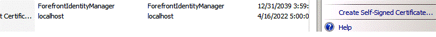
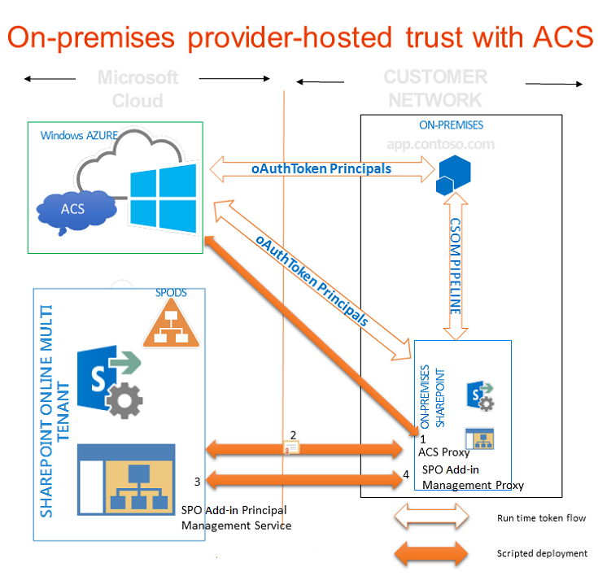

# <a name="use-an-office-365-sharepoint-site-to-authorize-provider-hosted-add-ins-on-an-on-premises-sharepoint-site"></a><span data-ttu-id="f01ca-101">Verwenden einer Office 365 SharePoint-Website, um vom Anbieter gehostete Add-Ins auf einer lokalen SharePoint-Website zu autorisieren</span><span class="sxs-lookup"><span data-stu-id="f01ca-101">Use an Office 365 SharePoint site to authorize provider-hosted add-ins on an on-premises SharePoint site</span></span>
<span data-ttu-id="f01ca-102">Verwenden Sie eine Office 365-SharePoint-Website, um eine Umgebung zu erstellen, in der Sie ACS zur Einrichtung einer Vertrauensstellung zwischen einem vom Anbieter gehosteten Add-In und einer lokalen SharePoint-Farm verwenden, wie Sie dies tun würden, wenn Sie Add-Ins für eine Office 365-SharePoint-Website entwickeln würden.</span><span class="sxs-lookup"><span data-stu-id="f01ca-102">Use an Office 365 SharePoint site to create an environment where you can use ACS to establish trust between a provider-hosted add-in and an on-premises SharePoint farm, just as you would if you were developing add-ins for an Office 365 SharePoint site.</span></span>
 

 <span data-ttu-id="f01ca-p101">**Hinweis** Der Name „Apps für SharePoint“ wird in „SharePoint-Add-Ins“ geändert. Während des Übergangszeitraums wird in der Dokumentation und der Benutzeroberfläche einiger SharePoint-Produkte und Visual Studio-Tools möglicherweise weiterhin der Begriff „Apps für SharePoint“ verwendet. Weitere Informationen finden Sie unter [Neuer Name für Office- und SharePoint-Apps](new-name-for-apps-for-sharepoint#bk_newname).</span><span class="sxs-lookup"><span data-stu-id="f01ca-p101">The name "apps for SharePoint" is changing to "SharePoint Add-ins". During the transition, the documentation and the UI of some SharePoint products and Visual Studio tools might still use the term "apps for SharePoint". For details, see [New name for apps for Office and SharePoint](new-name-for-apps-for-sharepoint#bk_newname).</span></span>
 


## <a name="prerequisites-for-using-acs-with-provider-hosted-add-ins-in-on-premises-environments"></a><span data-ttu-id="f01ca-106">Voraussetzungen für die Verwendung von ACS mit vom Anbieter gehosteten Add-Ins in lokalen Umgebungen</span><span class="sxs-lookup"><span data-stu-id="f01ca-106">Prerequisites for using ACS with provider-hosted add-ins in on-premises environments</span></span>
<span data-ttu-id="f01ca-107"><a name="Prerequisites"> </a></span><span class="sxs-lookup"><span data-stu-id="f01ca-107"></span></span>

<span data-ttu-id="f01ca-108">Sorgen Sie dafür, dass Sie über Folgendes verfügen.</span><span class="sxs-lookup"><span data-stu-id="f01ca-108">Be sure that you have the following.</span></span>
 

 

- <span data-ttu-id="f01ca-p102">Eine lokale SharePoint-Entwicklungsumgebung. Siehe [Einrichten einer lokalen Entwicklungsumgebung für SharePoint-Add-Ins](set-up-an-on-premises-development-environment-for-sharepoint-add-ins).</span><span class="sxs-lookup"><span data-stu-id="f01ca-p102">An on-premises SharePoint development environment. See  [Set up an on-premises development environment for SharePoint Add-ins](set-up-an-on-premises-development-environment-for-sharepoint-add-ins).</span></span>
    
 
- <span data-ttu-id="f01ca-p103">Eine Office 365-SharePoint-Website. Wenn Sie noch keine haben und schnell eine Entwicklungsumgebung einrichten möchten, finden Sie Hilfe unter  [Einrichten einer Entwicklungsumgebung für SharePoint-Add-Ins in Office 365](set-up-a-development-environment-for-sharepoint-add-ins-on-office-365).</span><span class="sxs-lookup"><span data-stu-id="f01ca-p103">An Office 365 SharePoint site. If don't have one yet and you want to set up a development environment quickly, you can  [Set up a development environment for SharePoint Add-ins on Office 365](set-up-a-development-environment-for-sharepoint-add-ins-on-office-365).</span></span>
    
 
-  <span data-ttu-id="f01ca-113">[Visual Studio 2012](https://www.microsoft.com/en-us/download/details.aspx?id=30682), entweder remote oder auf dem Computer installiert, auf dem Sie SharePoint installiert haben.</span><span class="sxs-lookup"><span data-stu-id="f01ca-113">[Visual Studio 2012](https://www.microsoft.com/en-us/download/details.aspx?id=30682) installed either remotely or on the computer where you installed SharePoint.</span></span>
    
 
-  <span data-ttu-id="f01ca-114">[Microsoft Office Developer Tools für Visual Studio 2012](https://msdn.microsoft.com/en-us/office/aa905340.aspx).</span><span class="sxs-lookup"><span data-stu-id="f01ca-114">[Microsoft Office Developer Tools for Visual Studio 2012](https://msdn.microsoft.com/en-us/office/aa905340.aspx) .</span></span>
    
 
- <span data-ttu-id="f01ca-p104">Die 64-Bit-Edition von [Microsoft Online Services-Anmeldeassistent](http://www.microsoft.com/en-us/download/details.aspx?id=41950), auf dem Computer installiert, auf dem Sie SharePoint installiert haben.</span><span class="sxs-lookup"><span data-stu-id="f01ca-p104">The 64-bit edition of  [Microsoft Online Services Sign-In Assistant.](http://www.microsoft.com/en-us/download/details.aspx?id=41950) installed on the computer where you installed SharePoint.</span></span>
    
 
-  <span data-ttu-id="f01ca-117">[Microsoft Online Services-Modul für Windows Powershell (64-Bit)](http://go.microsoft.com/fwlink/p/?linkid=236297), installiert auf dem Computer, auf dem Sie SharePoint installiert haben.</span><span class="sxs-lookup"><span data-stu-id="f01ca-117">[Microsoft Online Services Module for Windows Powershell (64-bit)](http://go.microsoft.com/fwlink/p/?linkid=236297) installed on the computer where you installed SharePoint.</span></span>
    
 

## <a name="create-a-certificate-and-make-it-the-security-token-service-sts-certificate-of-your-on-premises-installation-of-sharepoint"></a><span data-ttu-id="f01ca-118">Erstellen eines Zertifikats und es zum Sicherheitstokendienst-Zertifikat Ihrer lokalen Installation von SharePoint machen</span><span class="sxs-lookup"><span data-stu-id="f01ca-118">Create a certificate and make it the security token service (STS) certificate of your on-premises installation of SharePoint</span></span>
<span data-ttu-id="f01ca-119"><a name="Certificate"> </a></span><span class="sxs-lookup"><span data-stu-id="f01ca-119"></span></span>

<span data-ttu-id="f01ca-p105">Sie müssen das standardmäßige Sicherheitstokendienst-Zertifikat Ihrer lokalen Installation von SharePoint durch Ihr eigenes Zertifikat ersetzen. In diesem Artikel finden Sie ein Beispiel, wie Sie mithilfe der Option **Selbstsigniertes Zertifikat erstellen** in IIS ein Testzertifikat erstellen und exportieren. Sie können auch ein kommerzielles Zertifikat verwenden, das von einer Zertifikatsstelle ausgestellt wurde.</span><span class="sxs-lookup"><span data-stu-id="f01ca-p105">You'll need to replace the default security token service (STS) certificate of your on-premises installation of SharePoint with your own certificate. This article gives you an example of how to create and export a test certificate by using the **Create Self Signed Certificate** option in IIS. You can also use a commercial certificate issued by a certificate authority.</span></span>
 

 
 <span data-ttu-id="f01ca-123">[Erstellen Sie zuerst eine PFX-Zertifikatstestdatei und dann eine entsprechende CER-Testdatei](http://msdn.microsoft.com/en-us/library/windows/hardware/ff552299%28v=vs.85%29.aspx).</span><span class="sxs-lookup"><span data-stu-id="f01ca-123">[Create a test .pfx certificate file first, and then a corresponding test .cer file](http://msdn.microsoft.com/en-us/library/windows/hardware/ff552299%28v=vs.85%29.aspx).</span></span> 
 

 
 <span data-ttu-id="f01ca-124">[Sie können auch das MakeCert-Testprogramm verwenden, um ein X.509-Testzertifikat zu erstellen](http://msdn.microsoft.com/en-us/library/ms537364%28VS.85%29.aspx).</span><span class="sxs-lookup"><span data-stu-id="f01ca-124">[You can also use the MakeCert test program to generate a test X.509 certificate](http://msdn.microsoft.com/en-us/library/ms537364%28VS.85%29.aspx).</span></span> 
 

 

### <a name="to-create-a-test-pfx-certificate-file"></a><span data-ttu-id="f01ca-125">So erstellen Sie eine PFX-Zertifikatstestdatei</span><span class="sxs-lookup"><span data-stu-id="f01ca-125">To create a test .pfx certificate file</span></span>


1. <span data-ttu-id="f01ca-126">Wählen Sie im IIS-Manager in der Strukturansicht auf der linken Seite den Knoten _ServerName_ aus.</span><span class="sxs-lookup"><span data-stu-id="f01ca-126">In IIS Manager, select the  _ServerName_ node in the tree view on the left.</span></span>
    
 
2. <span data-ttu-id="f01ca-127">Wählen Sie **Serverzertifikate** aus, wie in Abbildung 1 dargestellt.</span><span class="sxs-lookup"><span data-stu-id="f01ca-127">Choose **Server Certificates**, as shown in Figure 1.</span></span>
    
    <span data-ttu-id="f01ca-128">**Abbildung 1: Option „Serverzertifikate“ in IIS**</span><span class="sxs-lookup"><span data-stu-id="f01ca-128">**Figure 1. Server Certificates option in IIS**</span></span>

 

  
 

 

 
3. <span data-ttu-id="f01ca-130">Klicken Sie in der Gruppe mit den Links auf der rechten Seite auf den Link **Selbstsigniertes Zertifikat erstellen**, wie in Abbildung 2 dargestellt.</span><span class="sxs-lookup"><span data-stu-id="f01ca-130">Click the **Create Self-Signed Certificate** link in the set of links on the right side, as shown in Figure 2.</span></span>
    
    <span data-ttu-id="f01ca-131">**Abbildung 2: Link zum Erstellen eines selbstsignierten Zertifikats**</span><span class="sxs-lookup"><span data-stu-id="f01ca-131">**Figure 2. Create Self-Signed Certificate link**</span></span>

 

  
 

 

 
4. <span data-ttu-id="f01ca-133">Geben Sie dem Zertifikat den Namen „Beispielzert“, und wählen Sie dann **OK** aus.</span><span class="sxs-lookup"><span data-stu-id="f01ca-133">Name the certificate SampleCert, and then choose **OK**.</span></span>
    
 
5. <span data-ttu-id="f01ca-134">Klicken Sie mit der rechten Maustaste auf das Zertifikat, und wählen Sie dann **Exportieren** aus, wie in Abbildung 3 dargestellt.</span><span class="sxs-lookup"><span data-stu-id="f01ca-134">Right-click the certificate, and then choose **Export**, as shown in Figure 3.</span></span>
    
    <span data-ttu-id="f01ca-135">**Abbildung 3: Exportieren eines Testzertifikats**</span><span class="sxs-lookup"><span data-stu-id="f01ca-135">**Figure 3. Exporting a test certificate**</span></span>

 

  
 

 

 
6. <span data-ttu-id="f01ca-p106">Exportieren Sie die Datei an einen gewünschten Speicherort, und vergeben Sie ein Kennwort. In diesem Beispiel lautet das Kennwort nur der Einfachheit halber **Kennwort**. Verwenden Sie in einer Produktionsumgebung ein sicheres Kennwort. Siehe [Richtlinien für die Erstellung sicherer Kennwörter](http://msdn.microsoft.com/en-us/library/bb416446.aspx) und [Sichere Kennwörter](http://msdn.microsoft.com/en-us/library/ms161962.aspx).</span><span class="sxs-lookup"><span data-stu-id="f01ca-p106">Export the file to a location you choose and give it a password. In this example, the password is **password**. In a production environment, use a strong password. See [Guidelines for creating strong passwords](http://msdn.microsoft.com/en-us/library/bb416446.aspx) and [Strong passwords](http://msdn.microsoft.com/en-us/library/ms161962.aspx).</span></span>
    
 

## <a name="make-your-certificate-the-sts-certificate-for-your-on-premises-installation-of-sharepoint"></a><span data-ttu-id="f01ca-141">Ihr Zertifikat zum Sicherheitstokendienst-Zertifikat für Ihre lokale Installation von SharePoint machen</span><span class="sxs-lookup"><span data-stu-id="f01ca-141">Make your certificate the STS certificate for your on-premises installation of SharePoint</span></span>
<span data-ttu-id="f01ca-142"><a name="STSCertificate"> </a></span><span class="sxs-lookup"><span data-stu-id="f01ca-142"></span></span>

<span data-ttu-id="f01ca-143">Nachdem Sie jetzt ein Zertifikat haben, können Sie es zum Sicherheitstokendienst-Zertifikat für Ihre lokale SharePoint-Farm machen.</span><span class="sxs-lookup"><span data-stu-id="f01ca-143">Now that you have a certificate, you make it the STS certificate for your on-premises SharePoint farm.</span></span> 
 

 
<span data-ttu-id="f01ca-144">Öffnen Sie die SharePoint-Verwaltungsshell als Administrator, und führen Sie dieses Windows PowerShell-Skript aus.</span><span class="sxs-lookup"><span data-stu-id="f01ca-144">Open the SharePoint Management Shell as an administrator and run this Windows PowerShell script.</span></span>
 

 


```
$certPrKPath = "c:\location of your .pfx file"
$certPassword = "password"
$stsCertificate = New-Object System.Security.Cryptography.X509Certificates.X509Certificate2 $certPrKPath, $certPassword, 20
Set-SPSecurityTokenServiceConfig -ImportSigningCertificate $stsCertificate -confirm:$false

```


 <span data-ttu-id="f01ca-145">**Hinweis** Im Dokument [Configure a one-way hybrid environment with SharePoint Server 2013 and Office 365](http://download.microsoft.com/download/6/4/4/644BA525-96CB-4739-B08F-18949A9BDADC/sps-2013-config-one-way-hybrid-environment.docx), das auf der [Seite mit SharePoint-Hybridressourcen](http://www.microsoft.com/en-us/download/details.aspx?id=35593) zum Download verfügbar ist, wird ausführlicher erläutert, wie Sie das standardmäßige Sicherheitstokendienst-Zertifikat Ihrer lokalen Farm durch ein Zertifikat von einer bekannten Zertifikatsstelle oder ein selbstsigniertes Zertifikat ersetzen.</span><span class="sxs-lookup"><span data-stu-id="f01ca-145">**Note** The  [Configure a one-way hybrid environment with SharePoint Server 2013 and Office 365](http://download.microsoft.com/download/6/4/4/644BA525-96CB-4739-B08F-18949A9BDADC/sps-2013-config-one-way-hybrid-environment.docx) document that is available for download on the [SharePoint hybrid resources page](http://www.microsoft.com/en-us/download/details.aspx?id=35593) explains in greater detail how to replace the default STS certificate of your on-premises farm with a certificate from a well-known certification authority or a self-signed certificate.</span></span>
 


## <a name="configure-your-on-premises-installation-of-sharepoint-to-use-acs"></a><span data-ttu-id="f01ca-146">Konfigurieren Ihrer lokalen Installation von SharePoint für die Verwendung von ACS</span><span class="sxs-lookup"><span data-stu-id="f01ca-146">Configure your on-premises installation of SharePoint to use ACS</span></span>
<span data-ttu-id="f01ca-147"><a name="ConnectAAD"> </a></span><span class="sxs-lookup"><span data-stu-id="f01ca-147"></span></span>

<span data-ttu-id="f01ca-p107">Abbildung 4 zeigt die vier Schritte, um die Verbindungen zu aktivieren, die Sie in der Gesamtarchitektur eines vom Anbieter gehosteten Add-Ins benötigen, das auf einer lokalen Website ausgeführt wird. Sie zeigt außerdem den Fluss von OAuth-Token, wenn das Add-In ausgeführt wird.</span><span class="sxs-lookup"><span data-stu-id="f01ca-p107">Figure 4 shows the four steps to enable the connections you need within the overall architecture of a provider-hosted add-in that runs on an on-premises site. It also shows the flow of OAuth tokens when the add-in is running.</span></span>
 

 

<span data-ttu-id="f01ca-150">**Abbildung 4: Verwenden von ACS mit einer lokalen Installation von SharePoint mithilfe einer Office 365 SharePoint-Website**</span><span class="sxs-lookup"><span data-stu-id="f01ca-150">**Figure 4. Make ACS work with an on-premises installation of SharePoint by using an Office 365 SharePoint site**</span></span>

 

 

 

 

1. <span data-ttu-id="f01ca-152">Erstellen Sie in Ihrer lokalen SharePoint-Farm einen ACS-Proxy.</span><span class="sxs-lookup"><span data-stu-id="f01ca-152">Create an ACS proxy in your on-premises SharePoint farm.</span></span>
    
 
2. <span data-ttu-id="f01ca-153">Installieren Sie das Signaturzertifikat Ihres lokalen Servers auf Ihrem Office 365-Mandanten.</span><span class="sxs-lookup"><span data-stu-id="f01ca-153">Install the signing certificate of your on-premises server to your Office 365 tenancy.</span></span>
    
 
3. <span data-ttu-id="f01ca-154">Fügen Sie die vollständig qualifizierten Domänennamen auf Ihrer SharePoint-Farm, auf der Sie Add-Ins ausführen möchten, der Sammlung der Dienstprinzipalnamen auf Ihrem Office 365-Mandanten hinzu.</span><span class="sxs-lookup"><span data-stu-id="f01ca-154">Add the fully qualified domain names of the sites on your SharePoint farm where you want to run add-ins to the service principal name collection in your Office 365 tenancy.</span></span>
    
 
4. <span data-ttu-id="f01ca-155">Erstellen Sie in Ihrer SharePoint-Farm einen Add-In-Verwaltungsproxy.</span><span class="sxs-lookup"><span data-stu-id="f01ca-155">Create an add-in management proxy on your SharePoint farm.</span></span>
    
 
<span data-ttu-id="f01ca-p108">Mithilfe der unten stehenden Funktion lässt sich Ihre lokale SharePoint-Website für die Verwendung von ACS konfigurieren. Sie können mit dieser Funktion auch einige Bereinigungsaufgaben durchführen, wenn Sie frühere Konfigurationen entfernen müssen. Es gibt verschiedene Möglichkeiten, die Funktion in PowerShell auszuführen. Hier eine Option:</span><span class="sxs-lookup"><span data-stu-id="f01ca-p108">The function below does all the work to configure your on-premises SharePoint site to use ACS. You can also use this function to do some cleanup tasks if you need to remove previous configurations. There are a variety of ways to run the function in PowerShell. The following is one method:</span></span>
 

 

 

1. <span data-ttu-id="f01ca-p109">Kopieren Sie auf dem lokalen SharePoint-Server den Code der Funktion in eine Textdatei, und speichern Sie diese unter dem Namen "MySharePointFunctions.psm1" in einem der beiden folgenden Ordner (nicht in beiden Ordnern). Sie müssen möglicherweise Teile des Pfads erstellen, wenn dieser noch nicht vorhandene Ordner enthält. Beachten Sie in beiden Fällen, dass der unterste Ordner im Pfad den gleichen Namen wie die Datei haben muss.</span><span class="sxs-lookup"><span data-stu-id="f01ca-p109">On the on-premises SharePoint server, copy the code in the function into a text file and save it with the name MySharePointFunctions.psm1 to one or the other of the following folders (not both). You may have to create parts of the path, if it includes folders that do not already exist. Notice that in both cases, the lowest folder in the path has to have the same name as the file.</span></span>
    
     <span data-ttu-id="f01ca-p110">**Tipp** Die Datei muss im ANSI-Format, nicht im UTF-8-Format, gespeichert werden. Es kann sein, dass PowerShell Syntaxfehler ausgibt, wenn eine Datei in einem anderen Format als ANSI hochgeladen wird. Windows Editor speichert sie standardmäßig im ANSI-Format. Wenn Sie zum Speichern der Datei einen anderen Editor verwenden, achten Sie darauf, die Datei im ANSI-Format zu speichern.</span><span class="sxs-lookup"><span data-stu-id="f01ca-p110">**TIP** The file has to be saved as ANSI format, not UTF-8. PowerShell may give syntax errors when it loads a file with a non-ANSI format. Windows NotePad will default to saving it as ANSI. If you use any other editor to save the file, be sure you are saving it as ANSI.</span></span>

      -  <span data-ttu-id="f01ca-167">`C:\users\username\documents\windowspowershell\modules\MySharePointFunctions`, wobei _username_ für den Farmadministrator steht, der die Datei ausführt.</span><span class="sxs-lookup"><span data-stu-id="f01ca-167">`C:\users\username\documents\windowspowershell\modules\MySharePointFunctions`, where  _username_ is the farm administrator who will be executing the file.</span></span>
    
 
  -  `C:\windows\system32\windowspowershell\V1.0\modules\MySharePointFunctions`
    
 
2. <span data-ttu-id="f01ca-168">Öffnen Sie die SharePoint-Verwaltungsshell als Administrator, und führen Sie das folgende Cmdlet aus, um überprüfen, ob das MySharePointFunctions-Modul aufgeführt wird.</span><span class="sxs-lookup"><span data-stu-id="f01ca-168">Open the SharePoint Management Shell as an administrator and run the following cmdlet to verify that the MySharePointFunctions module is listed.</span></span>
    
```
  Get-Module -listavailable
```

3. <span data-ttu-id="f01ca-169">Führen Sie das folgende Cmdlet aus, um das Modul zu importieren.</span><span class="sxs-lookup"><span data-stu-id="f01ca-169">Run the following cmdlet to import the module.</span></span>
    
```
  Import-Module MySharePointFunctions
```

4. <span data-ttu-id="f01ca-170">Führen Sie das folgende Cmdlet aus, um sicherzustellen, dass die Connect-SPFarmToAAD-Funktion als Teil des Moduls aufgeführt wird:</span><span class="sxs-lookup"><span data-stu-id="f01ca-170">Run the following cmdlet to verify that the Connect-SPFarmToAAD function is listed as part of the module:</span></span>
    
```
  Get-Command -module MySharePointFunctions
```

5. <span data-ttu-id="f01ca-171">Führen Sie das folgende Cmdlet aus, um sicherzustellen, dass die Connect-SPFarmToAAD-Funktion geladen ist.</span><span class="sxs-lookup"><span data-stu-id="f01ca-171">Run the following cmdlet to verify that the Connect-SPFarmToAAD function is loaded.</span></span>
    
```
  ls function:\ | where {$_.Name -eq "Connect-SPFarmToAAD"}
```

6. <span data-ttu-id="f01ca-p111">Führen Sie die  `Connect-SPFarmToAAD`-Funktion aus. Geben Sie die erforderlichen Parameter und alle optionalen Parameter an, die sich auf Ihre Entwicklerumgebung beziehen. Im nächsten Abschnitt finden Sie nähere Informationen und Beispiele.</span><span class="sxs-lookup"><span data-stu-id="f01ca-p111">Run the  `Connect-SPFarmToAAD` function. Be sure to provide the required parameters and any optional parameters that apply to your developer environment. See the next section for details and examples.</span></span>
    
 

 

 

### <a name="connect-spfarmtoaad-function-parameters"></a><span data-ttu-id="f01ca-175">Parameter der Connect-SPFarmToAAD-Funktion</span><span class="sxs-lookup"><span data-stu-id="f01ca-175">Connect-SPFarmToAAD function parameters</span></span>
<span data-ttu-id="f01ca-176"><a name="parameters"> </a></span><span class="sxs-lookup"><span data-stu-id="f01ca-176"></span></span>


|<span data-ttu-id="f01ca-177">**Parameter**</span><span class="sxs-lookup"><span data-stu-id="f01ca-177">**Parameter**</span></span>|<span data-ttu-id="f01ca-178">**Wert**</span><span class="sxs-lookup"><span data-stu-id="f01ca-178">**Value**</span></span>|
|:-----|:-----|
| <span data-ttu-id="f01ca-179">`-AADDomain` (erforderlich)</span><span class="sxs-lookup"><span data-stu-id="f01ca-179">Required</span></span>|<span data-ttu-id="f01ca-p112">Die *.onmicrosoft.com-Domäne, die Sie erstellt haben, als Sie Ihre Office 365-Website ( _yourcustomdomain_.onmicrosoft.com) registriert haben. Wenn Sie das Skript zur Authentifizierung auffordert, verwenden Sie den Benutzernamen und das Kennwort, das Sie für diese Domäne erstellt haben:  _username_@ _yourcustomdomain_.onmicrosoft.com.  </span><span class="sxs-lookup"><span data-stu-id="f01ca-p112">The *.onmicrosoft.com domain that you created when you signed up for your Office 365 site ( _yourcustomdomain_.onmicrosoft.com). When the script prompts you to authenticate, use the user name and password that you created for this domain:  _username_@ _yourcustomdomain_.onmicrosoft.com.</span></span>|
| <span data-ttu-id="f01ca-182">`-SharePointOnlineUrl` (erforderlich)</span><span class="sxs-lookup"><span data-stu-id="f01ca-182">Required</span></span>|<span data-ttu-id="f01ca-p113">Die URL Ihrer Office 365-SharePoint-Website (_https://yourcustomdomain_.sharepoint.com). Beachten Sie, dass die übergeordnete Domäne *nicht* onmicrosoft.com ist.</span><span class="sxs-lookup"><span data-stu-id="f01ca-p113">The URL of your Office 365 SharePoint site ( _https://yourcustomdomain_.sharepoint.com). Note that parent domain is  *not*  onmicrosoft.com.</span></span>|
| <span data-ttu-id="f01ca-185">`-SharePointWeb` (manchmal erforderlich)</span><span class="sxs-lookup"><span data-stu-id="f01ca-185">`-SharePointWeb` (sometimes required)</span></span>|<span data-ttu-id="f01ca-p114">Die vollständige URL (einschließlich des Protokolls) der lokalen SharePoint-Webanwendung, unter der Sie vom Anbieter gehostete Add-Ins ausführen. Diese Funktion fügt nur eine SharePoint-Webanwendung von Ihrer lokalen Farm zu ACS hinzu. Wenn Sie keinen Wert dafür angeben, wählt das Skript die erste Webanwendung in Ihrer Farm aus. Wenn Sie eine Hostname-Websitesammlung verwenden, die mit einem Platzhalter (wie _http://*.contoso.com_) definiert werden kann, können Sie diese Zeichenfolge als Wert für diesen Parameter verwenden. Wenn die Webanwendung über eine alternative Zugriffszuordnung (Alternative Access Mapping, AAM) für die Internetzone verfügt, müssen Sie diese AAM-URL für diesen Parameter verwenden. Wenn die SharePoint-Webanwendung nicht für HTTPS konfiguriert ist, müssen Sie HTTP als Protokoll verwenden, und *Sie müssen den -AllowOverHttp-Switch verwenden (siehe unten in dieser Tabelle).* Wenn Sie vom Anbieter gehostete Add-Ins ausführen möchten, die ACS auf mehreren Webanwendungen in Ihrer Farm verwenden, müssen Sie sie zur Sammlung der Dienstprinzipalnamen hinzufügen. Das unten stehende Windows PowerShell-Skript, das der `Connect-SPFarmToAAD`-Funktion folgt, zeigt Ihnen, wie Sie alle Webanwendungen in Ihrer Farm zur Sammlung der Dienstprinzipalnamen hinzufügen.</span><span class="sxs-lookup"><span data-stu-id="f01ca-p114">The full URL (including protocol) of the on-premises SharePoint web application where you'll run provider-hosted add-ins. This function adds only one SharePoint web application from your on-premises farm to ACS. If you don't specify a value for this, the script selects the first web application in your farm. If you're using a Host Name Site Collection (HNSC) that can be defined with a wildcard (such as  _http://*.contoso.com_), you can use that string as the value for this parameter. If the web application has an alternative access mapping (AAM) for the Internet zone, you must use that AAM URL for this parameter. If the SharePoint web application is not configured for HTTPS, you have to use HTTP as the protocol and  *you have to use the -AllowOverHttp switch (see below in this table).*</span></span>|
| <span data-ttu-id="f01ca-194">`-AllowOverHttp` (optional)</span><span class="sxs-lookup"><span data-stu-id="f01ca-194">`-AllowOverHttp` (optional)</span></span>|<span data-ttu-id="f01ca-p115">Verwenden Sie diesen Switch, wenn Sie mit einer Entwicklerumgebung arbeiten und für Ihre Add-Ins kein SSL verwenden möchten. Sie müssen diesen Switch verwenden, wenn die SharePoint-Webanwendung nicht für HTTPS konfiguriert ist.</span><span class="sxs-lookup"><span data-stu-id="f01ca-p115">Use this switch if you're working with a developer environment and don't want to use SSL with your add-ins. You have to use this switch if the SharePoint web application is not configured for HTTPS.</span></span>|
| <span data-ttu-id="f01ca-197">`-O365Credentials` (optional)</span><span class="sxs-lookup"><span data-stu-id="f01ca-197">`-O365Credentials` (optional)</span></span>|<span data-ttu-id="f01ca-p116">Das erste Zeichen ist ein großgeschriebenes „O“, keine null. Wenn Sie das Skript immer wieder zum Debuggen ausführen, bietet Ihnen dieser Switch den Vorteil, nicht jedes Mal Ihren O365-Namen und Ihr Kennwort manuell eingeben zu müssen. Bevor Sie diesen Parameter verwenden können, müssen Sie das Anmeldedatenobjekt erstellen, das Sie ihm mit diesen Cmdlets zuweisen:```$User = "username@yourcustomdomain.onmicrosoft.com"$PWord = ConvertTo-SecureString -String "the_password" -AsPlainText -Force$Credential = New-Object -TypeName System.Management.Automation.PSCredential -ArgumentList $User, $PWord```Verwenden Sie `$Credential` als Wert des Parameters `-O365Credentials`.</span><span class="sxs-lookup"><span data-stu-id="f01ca-p116">The first character is a capital "O", not a zero. If you find yourself repeatedly running the script for debugging purposes, this switch enables to you avoid having to manually enter your O365 name and password each time. Before you can use this parameter, you must create the credentials object that you will assign to it with these cmdlets:</span></span>|
| <span data-ttu-id="f01ca-201">`-Verbose` (optional)</span><span class="sxs-lookup"><span data-stu-id="f01ca-201">`-Verbose` (optional)</span></span>|<span data-ttu-id="f01ca-202">Dieser Switch generiert ausführlicheres Feedback, das hilfreich sein kann, wenn die Funktion nicht verwendet werden kann und Sie sie zum Debuggen erneut ausführen müssen.</span><span class="sxs-lookup"><span data-stu-id="f01ca-202">This switch generates more detailed feedback which might help if the function is not working and you need to rerun it for debugging.</span></span>|
| <span data-ttu-id="f01ca-203">`-RemoveExistingACS` (optional)</span><span class="sxs-lookup"><span data-stu-id="f01ca-203">`-RemoveExistingACS` (optional)</span></span>|<span data-ttu-id="f01ca-p117">Verwenden Sie diesen Switch, wenn Sie eine bestehende Verbindung zu Microsoft Azure Active Directory ersetzen. Er entfernt einen bestehenden ACS-Proxy, wenn Sie in Ihrer Farm bereits einen erstellt haben.</span><span class="sxs-lookup"><span data-stu-id="f01ca-p117">Use this switch if you're replacing an existing connection to Microsoft Azure Active Directory. It removes an existing ACS proxy if you've already created one on your farm.</span></span>|
| <span data-ttu-id="f01ca-206">`-RemoveExistingSTS` (optional)</span><span class="sxs-lookup"><span data-stu-id="f01ca-206">`-RemoveExistingSTS` (optional)</span></span>|<span data-ttu-id="f01ca-p118">Verwenden Sie diesen Switch, wenn Sie eine bestehende Verbindung zu Microsoft Azure Active Directory ersetzen. Er entfernt einen bestehenden vertrauenswürdigen Sicherheitstokenaussteller, der aus einer früheren Verbindung zu ACS stammt.</span><span class="sxs-lookup"><span data-stu-id="f01ca-p118">Use this switch if you're replacing an existing connection to Microsoft Azure Active Directory. It removes an existing trusted security token issuer that is left over from an earlier connection to ACS.</span></span>|
| <span data-ttu-id="f01ca-209">`-RemoveExistingSPOProxy` (optional)</span><span class="sxs-lookup"><span data-stu-id="f01ca-209">`-RemoveExistingSPOProxy` (optional)</span></span>|<span data-ttu-id="f01ca-p119">Verwenden Sie diesen Switch, wenn Sie eine bestehende Verbindung zu Microsoft Azure Active Directory ersetzen. Er entfernt einen bestehenden Add-In-Verwaltungsproxy, wenn Sie in Ihrer Farm bereits einen erstellt haben.</span><span class="sxs-lookup"><span data-stu-id="f01ca-p119">Use this switch if you're replacing an existing connection to Microsoft Azure Active Directory. It removes an existing add-in management proxy if you've already created one on your farm.</span></span>|
| <span data-ttu-id="f01ca-212">`-RemoveExistingAADCredentials` (optional)</span><span class="sxs-lookup"><span data-stu-id="f01ca-212">`-RemoveExistingAADCredentials` (optional)</span></span>|<span data-ttu-id="f01ca-213">Verwenden Sie diesen Switch, wenn Sie die Office 365-SharePoint-Website ersetzen.</span><span class="sxs-lookup"><span data-stu-id="f01ca-213">Use this switch if you're replacing the Office 365 SharePoint site.</span></span>|
<span data-ttu-id="f01ca-214">Es folgen Beispiele:</span><span class="sxs-lookup"><span data-stu-id="f01ca-214">The following are examples:</span></span>
 

 

```
Connect-SPFarmToAAD -AADDomain 'MyO365Domain.onmicrosoft.com' -SharePointOnlineUrl https://MyO365Domain.sharepoint.com

Connect-SPFarmToAAD -AADDomain 'MyO365Domain.onmicrosoft.com' -SharePointOnlineUrl https://MyO365Domain.sharepoint.com -SharePointWeb https://fabrikam.com

Connect-SPFarmToAAD -AADDomain 'MyO365Domain.onmicrosoft.com' -SharePointOnlineUrl https://MyO365Domain.sharepoint.com -SharePointWeb http://northwind.com -AllowOverHttp

Connect-SPFarmToAAD -AADDomain 'MyO365Domain.onmicrosoft.com' -SharePointOnlineUrl https://MyO365Domain.sharepoint.com -SharePointWeb http://northwind.com -AllowOverHttp -RemoveExistingACS -RemoveExistingSTS -RemoveExistingSPOProxy -RemoveExistingAADCredentials

```


### <a name="connect-spfarmtoaad-function-script"></a><span data-ttu-id="f01ca-215">Skript der Connect-SPFarmToAAD-Funktion</span><span class="sxs-lookup"><span data-stu-id="f01ca-215">Connect-SPFarmToAAD function script</span></span>
<span data-ttu-id="f01ca-216"><a name="function"> </a></span><span class="sxs-lookup"><span data-stu-id="f01ca-216"></span></span>


```

function Connect-SPFarmToAAD {
param(
    [Parameter(Mandatory)][String]   $AADDomain,
    [Parameter(Mandatory)][String]   $SharePointOnlineUrl,
    #Specify this parameter if you don't want to use the default SPWeb returned
    [Parameter()][String]            $SharePointWeb,
    [Parameter()][System.Management.Automation.PSCredential] $O365Credentials,
    #Use these switches if you're replacing an existing connection to AAD.
    [Parameter()][Switch]            $RemoveExistingACS,
    [Parameter()][Switch]            $RemoveExistingSTS,
    [Parameter()][Switch]            $RemoveExistingSPOProxy,
    #Use this switch if you're replacing the Office 365 SharePoint site.
    [Parameter()][Switch]            $RemoveExistingAADCredentials,
    #Use this switch if you don't want to use SSL when you launch your app.
    [Parameter()][Switch]            $AllowOverHttp
)
    #Prompt for credentials right away.
    if (-not $O365Credentials) {
        $O365Credentials = Get-Credential -Message "Admin credentials for $AADDomain"
    }
    Add-PSSnapin Microsoft.SharePoint.PowerShell
    #Import the Microsoft Online Services Sign-In Assistant.
    Import-Module -Name MSOnline
    #Import the Microsoft Online Services Module for Windows Powershell.
    Import-Module MSOnlineExtended -force -verbose 
    #Set values for Constants.
    New-Variable -Option Constant -Name SP_APPPRINCIPALID -Value '00000003-0000-0ff1-ce00-000000000000' | Out-Null
    New-Variable -Option Constant -Name ACS_APPPRINCIPALID -Value '00000001-0000-0000-c000-000000000000' | Out-Null
    New-Variable -Option Constant -Name ACS_APPPROXY_NAME -Value ACS
    New-Variable -Option Constant -Name SPO_MANAGEMENT_APPPROXY_NAME -Value 'SPO Add-in Management Proxy'
    New-Variable -Option Constant -Name ACS_STS_NAME -Value ACS-STS
    New-Variable -Option Constant -Name AAD_METADATAEP_FSTRING -Value 'https://accounts.accesscontrol.windows.net/{0}/metadata/json/1'
    New-Variable -Option Constant -Name SP_METADATAEP_FSTRING -Value '{0}/_layouts/15/metadata/json/1'
    #Get the default SPWeb from the on-premises farm if no $SharePointWeb parameter is specified.
    if ([String]::IsNullOrEmpty($SharePointWeb)) {
        $SharePointWeb = Get-SPSite | Select-Object -First 1 | Get-SPWeb | Select-Object -First 1 | % Url
    }

    #Configure the realm ID for local farm so that it matches the AAD realm.
    $ACSMetadataEndpoint = $AAD_METADATAEP_FSTRING -f $AADDomain
    $ACSMetadata = Invoke-RestMethod -Uri $ACSMetadataEndpoint
    $AADRealmId = $ACSMetadata.realm

    Set-SPAuthenticationRealm -ServiceContext $SharePointWeb -Realm $AADRealmId
    
    $LocalSTS = Get-SPSecurityTokenServiceConfig
    $LocalSTS.NameIdentifier = '{0}@{1}' -f $SP_APPPRINCIPALID,$AADRealmId
    $LocalSTS.Update()

    #Allow connections over HTTP if the switch is specified.
    if ($AllowOverHttp.IsPresent -and $AllowOverHttp -eq $True) {
        $serviceConfig = Get-SPSecurityTokenServiceConfig
        $serviceConfig.AllowOAuthOverHttp = $true
        $serviceConfig.AllowMetadataOverHttp = $true
        $serviceConfig.Update()
    }

    #Step 1: Set up the ACS proxy in the on-premises SharePoint farm. Remove the existing ACS proxy
    #if the switch is specified.
    if ($RemoveExistingACS.IsPresent -and $RemoveExistingACS -eq $True) {
        Get-SPServiceApplicationProxy | ? DisplayName -EQ $ACS_APPPROXY_NAME | Remove-SPServiceApplicationProxy -RemoveData -Confirm:$false
    }
    if (-not (Get-SPServiceApplicationProxy | ? DisplayName -EQ $ACS_APPPROXY_NAME)) {
        $AzureACSProxy = New-SPAzureAccessControlServiceApplicationProxy -Name $ACS_APPPROXY_NAME -MetadataServiceEndpointUri $ACSMetadataEndpoint -DefaultProxyGroup
    }

    #Remove the existing security token service if the switch is specified.
    if ($RemoveExistingSTS.IsPresent) {
        Get-SPTrustedSecurityTokenIssuer | ? Name -EQ $ACS_STS_NAME | Remove-SPTrustedSecurityTokenIssuer -Confirm:$false
    }
    if (-not (Get-SPTrustedSecurityTokenIssuer | ? DisplayName -EQ $ACS_STS_NAME)) {
        $AzureACSSTS = New-SPTrustedSecurityTokenIssuer -Name $ACS_STS_NAME -IsTrustBroker -MetadataEndPoint $ACSMetadataEndpoint
    }

    #Update the ACS Proxy for OAuth authentication.
    $ACSProxy = Get-SPServiceApplicationProxy | ? Name -EQ $ACS_APPPROXY_NAME
    $ACSProxy.DiscoveryConfiguration.SecurityTokenServiceName = $ACS_APPPRINCIPALID
    $ACSProxy.Update()

    #Retrieve the local STS signing key from JSON metadata.
    $SPMetadata = Invoke-RestMethod -Uri ($SP_METADATAEP_FSTRING -f $SharePointWeb)
    $SPSigningKey = $SPMetadata.keys | ? usage -EQ "Signing" | % keyValue
    $CertValue = $SPSigningKey.value
    
    #Connect to Office 365.
    Connect-MsolService -Credential $O365Credentials
    #Remove existing connection to an Office 365 SharePoint site if the switch is specified.
    if ($RemoveExistingAADCredentials.IsPresent -and $RemoveExistingAADCredentials -eq $true) {
        $msolserviceprincipal = Get-MsolServicePrincipal -AppPrincipalId $SP_APPPRINCIPALID
        [Guid[]] $ExistingKeyIds = Get-MsolServicePrincipalCredential -ObjectId $msolserviceprincipal.ObjectId -ReturnKeyValues $false | % {if ($_.Type -ne "Other") {$_.KeyId}}
        Remove-MsolServicePrincipalCredential -AppPrincipalId $SP_APPPRINCIPALID -KeyIds $ExistingKeyIds
    }
    #Step 2: Upload the local STS signing certificate
    New-MsolServicePrincipalCredential -AppPrincipalId $SP_APPPRINCIPALID -Type Asymmetric -Value $CertValue -Usage Verify

    #Step 3: Add the service principal name of the local web application, if necessary.
    $indexHostName = $SharePointWeb.IndexOf('://') + 3
    $HostName = $SharePointWeb.Substring($indexHostName)
    $NewSPN = '{0}/{1}' -f $SP_APPPRINCIPALID, $HostName
    $SPAppPrincipal = Get-MsolServicePrincipal -AppPrincipalId $SP_APPPRINCIPALID
    if ($SPAppPrincipal.ServicePrincipalNames -notcontains $NewSPN) {
        $SPAppPrincipal.ServicePrincipalNames.Add($NewSPN)
        Set-MsolServicePrincipal -AppPrincipalId $SPAppPrincipal.AppPrincipalId -ServicePrincipalNames $SPAppPrincipal.ServicePrincipalNames
    }

    #Remove the existing SharePoint Online proxy if the switch is specified.
    if ($RemoveExistingSPOProxy.IsPresent -and $RemoveExistingSPOProxy -eq $True) {
        Get-SPServiceApplicationProxy | ? DisplayName -EQ $SPO_MANAGEMENT_APPPROXY_NAME | Remove-SPServiceApplicationProxy -RemoveData -Confirm:$false
    }
    #Step 4: Add the SharePoint Online proxy
    if (-not (Get-SPServiceApplicationProxy | ? DisplayName -EQ $SPO_MANAGEMENT_APPPROXY_NAME)) {
        $spoproxy = New-SPOnlineApplicationPrincipalManagementServiceApplicationProxy -Name $SPO_MANAGEMENT_APPPROXY_NAME -OnlineTenantUri $SharePointOnlineUrl -DefaultProxyGroup
    }  
}
```


### <a name="configure-the-add-in-and-the-sharepoint-web-application-for-the-office-store"></a><span data-ttu-id="f01ca-217">Konfigurieren des Add-Ins und der SharePoint-Webanwendung für den Office Store</span><span class="sxs-lookup"><span data-stu-id="f01ca-217">Configure the add-in and the SharePoint web application for the Office Store</span></span>
<span data-ttu-id="f01ca-218"><a name="function"> </a></span><span class="sxs-lookup"><span data-stu-id="f01ca-218"></span></span>

<span data-ttu-id="f01ca-p120">Es gibt einen optionalen Konfigurationsschritt, den Farmadministratoren in Produktionsumgebungen vornehmen sollten, wenn Benutzer dazu in der Lage sein sollen, vom Anbieter gehostete Add-Ins zu installieren, die ACS aus dem Office Store verwenden. Es dient in Ihrer SharePoint-Entwicklungsumgebung keinem Zweck, solange Sie nicht Add-Ins (die ACS verwenden) aus dem Store für diese Umgebung installieren möchten. Dies wird durch das folgende Cmdlet ermöglicht. Dieser Code kann zur oben aufgeführten Funktion hinzugefügt werden.</span><span class="sxs-lookup"><span data-stu-id="f01ca-p120">There is an optional configuration step that farm administrators should take on production environments, if they want users to be able to install provider-hosted add-ins that use ACS from the Office Store. (It serves no purpose on your SharePoint development environment unless you plan to install add-ins that use ACS from the store on that environment.) The following cmdlet makes this possible. This code can be added to the function above.</span></span>
 

 

```
New-SPMarketplaceWebServiceApplicationProxy -Name "ApplicationIdentityDataWebServiceProxy" -ServiceEndpointUri "https://oauth.sellerdashboard.microsoft.com/ApplicationIdentityDataWebService.svc" -DefaultProxyGroup

```

<span data-ttu-id="f01ca-p121">In SharePoint-Produktionswebanwendungen sollten Sie das Feature **Add-Ins, die verfügbare Internet-Endpunkte benötigen** aktivieren, nachdem Sie die oben genannten Konfigurationsschritte ausgeführt haben. (Siehe Prozedur unten.) Dieses Feature selbst macht nichts. Es dient nur als Kennzeichen, das dem Office Store mitteilt, dass beim Anbieter gehostete Add-Ins, die ACS verwenden, auf Websites in der SharePoint-Webanwendung installiert werden können.</span><span class="sxs-lookup"><span data-stu-id="f01ca-p121">It is also a good practice on production SharePoint web applications to activate the **Add-ins that require accessible internet facing endpoints** Feature after the configuration steps above have been completed. (See the instructions below.) This Feature does not actually do anything. It simply serves as a flag that tells the Office Store that provider-hosted add-ins that use ACS can be installed on websites in the SharePoint web application.</span></span>
 

 
<span data-ttu-id="f01ca-p122">Das System kann Auswirkungen auf das Add-In-Manifest Ihres SharePoint-Add-Ins haben. Falls Sie Ihr Add-In über den Store verkaufen möchten, sollten Sie die folgende **AppPrerequiste** dem **AppPrerequisites**-Abschnitt des Add-In-Manifests hinzufügen:</span><span class="sxs-lookup"><span data-stu-id="f01ca-p122">This system may have implications for the add-in manifest of your SharePoint Add-in. If you plan to sell your add-in through the store, it is a good practice to add the following **AppPrerequiste** to the **AppPrerequisites** section of the add-in manifest:</span></span>
 

 


```
<AppPrerequisite Type="Feature" ID="{7877bbf6-30f5-4f58-99d9-a0cc787c1300}" />
```

<span data-ttu-id="f01ca-p123">Die Auswirkung der Voraussetzung ist, dass Ihr Add-In ausgegraut und als nicht installierbar dargestellt wird, wenn Benutzer den Store von einer lokalen SharePoint-Farm aus durchsuchen und wenn die übergeordnete SharePoint-Webanwendung das Feature **Add-Ins, die verfügbare Internet-Endpunkte benötigen** nicht aktiviert haben. Diese Vorgehensweise stellt sicher, dass Benutzer, die Ihr Add-In auf einer lokalen SharePoint-Website installiert haben und feststellen, dass es nicht funktioniert, sich nicht beschweren.</span><span class="sxs-lookup"><span data-stu-id="f01ca-p123">The effect of the prerequisite is that when users are browsing the store from an on-premises SharePoint farm, your add-in will be grayed-out and uninstallable when the parent SharePoint web application does not have the **Add-ins that require accessible internet facing endpoints** Feature enabled. This ensures that you won't get complaints from customers who install your add-in to an on-premises SharePoint website and find that it does not work.</span></span>
 

 
<span data-ttu-id="f01ca-p124">Es gibt zwei Möglichkeiten, die Funktion zu aktivieren. Die erste besteht darin, das folgende PowerShell-Cmdlet (kann am Ende der oben aufgeführten Funktion hinzugefügt werden) auf einem beliebigen SharePoint-Server durchzuführen:</span><span class="sxs-lookup"><span data-stu-id="f01ca-p124">There are two ways to enable the Feature. The first is to run the following PowerShell cmdlet (which can be added to the end of the function above) on any SharePoint server:</span></span>
 

 


```
Enable-SPFeature -identity "7877bbf6-30f5-4f58-99d9-a0cc787c1300" -Url http://domain_of_the_SharePoint_web_application
```

<span data-ttu-id="f01ca-231">Die andere Methode zum Aktivieren der Funktion besteht darin, folgende Schritte in der Zentraladministration durchzuführen:</span><span class="sxs-lookup"><span data-stu-id="f01ca-231">The other way to enable the Feature is carry out the following steps in Central Administration:</span></span>
 

 

1. <span data-ttu-id="f01ca-232">Gehen Sie in **SharePoint-Zentraladministration** zu **Anwendungsverwaltung | Webanwendungen verwalten**.</span><span class="sxs-lookup"><span data-stu-id="f01ca-232">In **SharePoint Central Administration**, navigate to **Application Management | Manage web applications**.</span></span>
    
 
2. <span data-ttu-id="f01ca-233">Wählen Sie auf der Seite **Webanwendungen verwalten** die Webanwendung aus, die Sie ändern möchten.</span><span class="sxs-lookup"><span data-stu-id="f01ca-233">On the **Manage Web Applications** page, select the web application that you want to change.</span></span>
    
 
3. <span data-ttu-id="f01ca-234">Klicken Sie im Menüband auf **Features verwalten**.</span><span class="sxs-lookup"><span data-stu-id="f01ca-234">On the ribbon, click **Manage Features**.</span></span>
    
 
4. <span data-ttu-id="f01ca-235">Klicken Sie in der Liste der Features neben **Add-Ins, die verfügbare Internet-Endpunkte benötigen** auf **Aktivieren**.</span><span class="sxs-lookup"><span data-stu-id="f01ca-235">In the feature list, next to **Add-ins that require accessible internet facing endpoints**, click **Activate**.</span></span>
    
 
5. <span data-ttu-id="f01ca-236">Klicken Sie auf **OK**.</span><span class="sxs-lookup"><span data-stu-id="f01ca-236">Click **OK**.</span></span>
    
 

 

 

### <a name="configure-additional-sharepoint-web-applications-within-the-farm"></a><span data-ttu-id="f01ca-237">Konfigurieren weiterer SharePoint-Webanwendungen in der Farm</span><span class="sxs-lookup"><span data-stu-id="f01ca-237">Configure additional SharePoint web applications within the farm</span></span>
<span data-ttu-id="f01ca-238"><a name="function"> </a></span><span class="sxs-lookup"><span data-stu-id="f01ca-238"></span></span>

<span data-ttu-id="f01ca-239">Wenn sich in Ihrer SharePoint-Farm weitere Webanwendungen befinden und Sie auf diesen vom Anbieter gehostete Add-Ins ausführen möchten, die eine ACS-Vertrauensstellung verwenden, können Sie dieses Windows PowerShell-Skript (in SharePoint-Verwaltungsshell) verwenden, um sie zur Sammlung der Dienstprinzipalnamen hinzuzufügen.</span><span class="sxs-lookup"><span data-stu-id="f01ca-239">If you have additional web applications on your SharePoint farm and you want to run provider-hosted add-ins that use ACS trust on them, you can use this Windows PowerShell script (in the SharePoint Management Shell) to add them to the service principal name collection.</span></span>
 

 

```
$SPAppPrincipal = Get-MsolServicePrincipal -AppPrincipalId 00000003-0000-0ff1-ce00-000000000000
$id = "00000003-0000-0ff1-ce00-000000000000/"

Get-SPWebApplication | ForEach-Object {
    $hostName = $_.Url.substring($_.Url.indexof("//") + 2)
    $hostName = $hostName.Remove($hostName.Length - 1, 1)

    $NewSPN = $id + $hostName

    Write-Host "Adding SPN for" $NewSPN

    if ($SPAppPrincipal.ServicePrincipalNames -notcontains $NewSPN) {
       $SPAppPrincipal.ServicePrincipalNames.Add($NewSPN)
       Set-MsolServicePrincipal -AppPrincipalId $SPAppPrincipal.AppPrincipalId -ServicePrincipalNames $SPAppPrincipal.ServicePrincipalNames
    }
}

```


## <a name="next-steps"></a><span data-ttu-id="f01ca-240">Nächste Schritte</span><span class="sxs-lookup"><span data-stu-id="f01ca-240">Next Steps</span></span>
<span data-ttu-id="f01ca-241"><a name="CreateApp"> </a></span><span class="sxs-lookup"><span data-stu-id="f01ca-241"></span></span>

<span data-ttu-id="f01ca-242">Befolgen Sie die Schritte in  [Erste Schritte beim Erstellen von von einem Anbieter gehosteten SharePoint-Add-Ins](get-started-creating-provider-hosted-sharepoint-add-ins), um ein einfaches vom Anbieter gehostete "Hello World"-Add-In zu erstellen, das ACS als Tokenaussteller verwendet.</span><span class="sxs-lookup"><span data-stu-id="f01ca-242">Follow the steps in  [Get started creating provider-hosted SharePoint Add-ins](get-started-creating-provider-hosted-sharepoint-add-ins) to create a simple "hello world" provider-hosted add-in that uses ACS as the token issuer.</span></span>
 

 

## <a name="additional-resources"></a><span data-ttu-id="f01ca-243">Zusätzliche Ressourcen</span><span class="sxs-lookup"><span data-stu-id="f01ca-243">Additional resources</span></span>
<span data-ttu-id="f01ca-244"><a name="bk_addresources"> </a></span><span class="sxs-lookup"><span data-stu-id="f01ca-244"></span></span>


-  [<span data-ttu-id="f01ca-245">Autorisierung und Authentifizierung von SharePoint-Add-Ins</span><span class="sxs-lookup"><span data-stu-id="f01ca-245">Authorization and authentication of SharePoint Add-ins</span></span>](authorization-and-authentication-of-sharepoint-add-ins)
    
 
