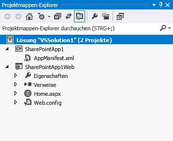
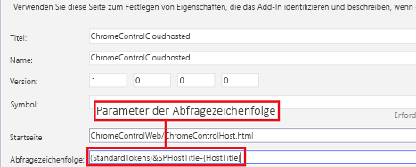
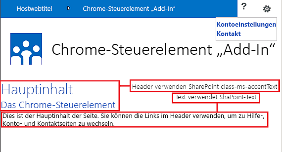

# <a name="use-the-client-chrome-control-in-sharepoint-add-ins"></a><span data-ttu-id="6a194-102">Verwenden des Client-Chromsteuerelements in SharePoint-Add-Ins</span><span class="sxs-lookup"><span data-stu-id="6a194-102">Use the client chrome control in SharePoint Add-ins</span></span>

<span data-ttu-id="6a194-103">In diesem Artikel erfahren Sie, wie Sie das Chromsteuerelement in Add-Ins in SharePoint verwenden.</span><span class="sxs-lookup"><span data-stu-id="6a194-103">Learn how to use the chrome control in add-ins in SharePoint.</span></span>
 
> [!NOTE]
> <span data-ttu-id="6a194-104">Der Name „Apps für SharePoint“ wird in „SharePoint-Add-Ins“ geändert.</span><span class="sxs-lookup"><span data-stu-id="6a194-104">The name "apps for SharePoint" is changing to "SharePoint Add-ins."</span></span> <span data-ttu-id="6a194-105">Während des Übergangszeitraums wird in der Dokumentation und der Benutzeroberfläche einiger SharePoint-Produkte und Tools für Visual Studio möglicherweise weiterhin der Begriff „Apps für SharePoint“ verwendet.</span><span class="sxs-lookup"><span data-stu-id="6a194-105">Note  The name "apps for SharePoint" is changing to "SharePoint Add-ins". During the transition, the documentation and the UI of some SharePoint products and Visual Studio tools might still use the term "apps for SharePoint". For details, see  New name for apps for Office and SharePoint.</span></span> <span data-ttu-id="6a194-106">Weitere Einzelheiten finden Sie unter [Neuer Name für SharePoint-Apps](new-name-for-apps-for-sharepoint.md).</span><span class="sxs-lookup"><span data-stu-id="6a194-106">For details, see [New name for apps for SharePoint](new-name-for-apps-for-sharepoint.md).</span></span>

<span data-ttu-id="6a194-p102">Dank des Chromsteuerelements in SharePoint können Sie den Kopfzeilenstil einer bestimmten SharePoint-Website in Ihrem Add-In verwenden, ohne eine Serverbibliothek registrieren zu müssen oder eine bestimmte Technologie bzw. ein bestimmtes Tool zu verwenden. Sie müssen dazu eine SharePoint-JavaScript-Bibliothek durch ein standardmäßiges `<script>`-Tag registrieren. Sie können einen Platzhalter bereitstellen, indem Sie ein HTML- **div**-Element verwenden und das Steuerelement mit den verfügbaren Optionen weiter anpassen. Das Steuerelement erhält sein Aussehen durch die angegebene SharePoint-Website.  </span><span class="sxs-lookup"><span data-stu-id="6a194-p102">The chrome control in SharePoint enables you to use the header styling of a specific SharePoint site in your add-in without needing to register a server library or use a specific technology or tool. To use this functionality, you must register a SharePoint JavaScript library through a standard `<script>` tag. You can provide a placeholder by using an HTML **div** element and further customize the control by using the available options. The control inherits its appearance from the specified SharePoint website.</span></span>

## <a name="prerequisites-for-using-the-examples-in-this-article"></a><span data-ttu-id="6a194-111">Voraussetzungen für die Verwendung der Beispiele in diesem Artikel</span><span class="sxs-lookup"><span data-stu-id="6a194-111">Prerequisites for using the examples in this article</span></span>
<span data-ttu-id="6a194-112"><a name="SP15Usechromecontrol_Prereq"> </a></span><span class="sxs-lookup"><span data-stu-id="6a194-112"></span></span>

<span data-ttu-id="6a194-113">Um die Schritte in diesem Beispiel auszuführen, benötigen Sie Folgendes:</span><span class="sxs-lookup"><span data-stu-id="6a194-113">To follow the steps in this example, you need the following:</span></span>

- <span data-ttu-id="6a194-114">Visual Studio 2015</span><span class="sxs-lookup"><span data-stu-id="6a194-114">Visual Studio 2015</span></span>
- <span data-ttu-id="6a194-115">Eine SharePoint-Entwicklungsumgebung (Add-In-Isolierung für lokale Szenarios erforderlich)</span><span class="sxs-lookup"><span data-stu-id="6a194-115">A SharePoint development environment (add-in isolation required for on-premises scenarios)</span></span>
 
<span data-ttu-id="6a194-116">Anweisungen zum Einrichten einer Entwicklungsumgebung, die Ihren Anforderungen entspricht, finden Sie unter [Office-Entwicklung](http://msdn.microsoft.com/library/187f8c8c-1b15-471c-80b5-69a40e67deea.aspx).</span><span class="sxs-lookup"><span data-stu-id="6a194-116">For guidance on how to set up a development environment that fits your needs, see  [Start building Office and SharePoint Add-ins](http://msdn.microsoft.com/library/187f8c8c-1b15-471c-80b5-69a40e67deea.aspx).</span></span>

### <a name="core-concepts-to-know-before-using-the-chrome-control"></a><span data-ttu-id="6a194-117">Kernkonzepte, die vor der Verwendung des Chromsteuerelements bekannt sein müssen</span><span class="sxs-lookup"><span data-stu-id="6a194-117">Core concepts to know before using the chrome control</span></span>

<span data-ttu-id="6a194-118">Die folgende Tabelle enthält eine Liste von Artikeln, die das Verständnis der Konzepte erleichtern, die in einem Szenario mit dem Chromsteuerelement relevant sind.</span><span class="sxs-lookup"><span data-stu-id="6a194-118">The following table lists useful articles that can help you understand the concepts involved in a scenario that uses the chrome control.</span></span>

<span data-ttu-id="6a194-119">**Tabelle 1. Kernkonzepte der Verwendung des Chromsteuerelements**</span><span class="sxs-lookup"><span data-stu-id="6a194-119">**Table 1. Core concepts for using the chrome control**</span></span>

|<span data-ttu-id="6a194-120">**Titel des Artikels**</span><span class="sxs-lookup"><span data-stu-id="6a194-120">**Article title**</span></span>|<span data-ttu-id="6a194-121">**Beschreibung**</span><span class="sxs-lookup"><span data-stu-id="6a194-121">**Description**</span></span>|
|:-----|:-----|
| [<span data-ttu-id="6a194-122">SharePoint-Add-Ins</span><span class="sxs-lookup"><span data-stu-id="6a194-122">SharePoint Add-ins</span></span>](sharepoint-add-ins.md)|<span data-ttu-id="6a194-123">Hier finden Sie Informationen über das neue Add-In-Modell in SharePoint, das es Ihnen ermöglicht, Add-Ins als kompakte, einfach zu verwendende Lösungen für Endbenutzer zu erstellen.</span><span class="sxs-lookup"><span data-stu-id="6a194-123">Learn about the new add-in model in SharePoint that enables you to create add-ins, which are small, easy-to-use solutions for end users.</span></span>|
| [<span data-ttu-id="6a194-124">UX-Design für SharePoint-Add-Ins</span><span class="sxs-lookup"><span data-stu-id="6a194-124">UX design for SharePoint Add-ins</span></span>](ux-design-for-sharepoint-add-ins.md)|<span data-ttu-id="6a194-125">Hier erfahren Sie mehr über die UX-Optionen (User eXperience, Benutzerumgebung) und Alternativen beim Erstellen von SharePoint-Add-Ins.</span><span class="sxs-lookup"><span data-stu-id="6a194-125">Learn about the user experience (UX) options and alternatives that you have when building SharePoint Add-ins.</span></span>|
| [<span data-ttu-id="6a194-126">Hostwebs, Add-In-Webs und SharePoint-Komponenten in SharePoint</span><span class="sxs-lookup"><span data-stu-id="6a194-126">Host webs, add-in webs, and SharePoint components in SharePoint</span></span>](host-webs-add-in-webs-and-sharepoint-components-in-sharepoint.md)|<span data-ttu-id="6a194-p103">Lernen Sie den Unterschied zwischen Hostwebs und App-Webs kennen. Erfahren Sie, welche SharePoint-Komponenten in eine SharePoint-Add-In eingeschlossen werden können, welche Komponenten im Hostweb und welche im App-Web bereitgestellt werden und wie das App-Web in einer isolierten Domäne bereitgestellt wird.</span><span class="sxs-lookup"><span data-stu-id="6a194-p103">Learn about the distinction between host webs and add-in webs. Find out which SharePoint components can be included in a SharePoint Add-in, which components are deployed to the host web, which components are deployed to the add-in web, and how the add-in web is deployed in an isolated domain.</span></span>|

## <a name="code-example-use-the-chrome-control-in-your-cloud-hosted-add-in"></a><span data-ttu-id="6a194-129">Codebeispiel: Verwenden des Chromsteuerelements in einem in der Cloud gehosteten Add-In</span><span class="sxs-lookup"><span data-stu-id="6a194-129">Code example: Use the chrome control in your cloud-hosted add-in</span></span>
<span data-ttu-id="6a194-130"><a name="SP15Usechromecontrol_Codeexample"> </a></span><span class="sxs-lookup"><span data-stu-id="6a194-130"></span></span>

<span data-ttu-id="6a194-131">Ein in einer Cloud gehostetes Add-In enthält mindestens eine Remote-Komponente.</span><span class="sxs-lookup"><span data-stu-id="6a194-131">A cloud-hosted add-in includes at least one remote component.</span></span> <span data-ttu-id="6a194-132">Weitere Informationen finden Sie unter [Auswählen von Mustern für die Entwicklung und das Hosten Ihres SharePoint-Add-Ins](choose-patterns-for-developing-and-hosting-your-sharepoint-add-in.md).</span><span class="sxs-lookup"><span data-stu-id="6a194-132">For more detailed information about the hosting options of SharePoint Add-ins, see  [Choose patterns for developing and hosting your SharePoint Add-in](choose-patterns-for-developing-and-hosting-your-sharepoint-add-in.md).</span></span> <span data-ttu-id="6a194-133">Befolgen Sie die folgenden Schritte, um das Chromsteuerelement in einem in der Cloud gehosteten Add-In zu verwenden:</span><span class="sxs-lookup"><span data-stu-id="6a194-133">To use the chrome control in your cloud-hosted add-in, follow these steps:</span></span>

1. <span data-ttu-id="6a194-134">Erstellen Sie die SharePoint-Add-In- und Remotewebprojekte.</span><span class="sxs-lookup"><span data-stu-id="6a194-134">Create the SharePoint Add-in and remote web projects.</span></span>
2. <span data-ttu-id="6a194-135">Senden Sie Standardkonfigurationsinformationen in der Abfragezeichenfolge.</span><span class="sxs-lookup"><span data-stu-id="6a194-135">Send default configuration options in the query string.</span></span>
3. <span data-ttu-id="6a194-136">Fügen Sie dem Webprojekt eine Webseite hinzu.</span><span class="sxs-lookup"><span data-stu-id="6a194-136">Add a webpage to the web project.</span></span>

<span data-ttu-id="6a194-137">In Abbildung 1 ist eine Remotewebseite mit dem Chromsteuerelement dargestellt.</span><span class="sxs-lookup"><span data-stu-id="6a194-137">Figure 1 shows a remote webpage with the chrome control.</span></span>

<span data-ttu-id="6a194-138">*Abbildung 1. Remotewebseite mit dem Chromsteuerelement*</span><span class="sxs-lookup"><span data-stu-id="6a194-138">*Figure 1. Remote webpage with the chrome control*</span></span>


 

### <a name="to-create-the-sharepoint-add-in-and-remote-web-projects"></a><span data-ttu-id="6a194-140">So erstellen Sie die Projekte für das SharePoint-Add-In und das Remoteweb</span><span class="sxs-lookup"><span data-stu-id="6a194-140">To create the SharePoint Add-in and remote web projects</span></span>

1. <span data-ttu-id="6a194-141">Öffnen Sie Visual Studio 2015 als Administrator.</span><span class="sxs-lookup"><span data-stu-id="6a194-141">Open Visual Studio 2015 as administrator.</span></span> <span data-ttu-id="6a194-142">(Klicken Sie dazu im Menü **Start** mit der rechten Maustaste auf das Symbol für Visual Studio 2015, und wählen Sie **Als Administrator ausführen** aus.)</span><span class="sxs-lookup"><span data-stu-id="6a194-142">Open Visual Studio 2015 as administrator. (To do this, right-click the Visual Studio 2015 icon on the **Start** menu, and choose **Run as administrator**.)</span></span>

2. <span data-ttu-id="6a194-143">Erstellen Sie ein neues Projekt unter Verwendung der Vorlage **SharePoint-Add-In**.</span><span class="sxs-lookup"><span data-stu-id="6a194-143">Create a new project using the **SharePoint Add-in** template.</span></span>
    
   <span data-ttu-id="6a194-144">Abbildung 2 zeigt den Speicherort der Vorlage **SharePoint-Add-In** in Visual Studio 2015 unter **Vorlagen** > **Visual C#** > **Office/SharePoint** > **Office Add-Ins**.</span><span class="sxs-lookup"><span data-stu-id="6a194-144">Figure 2 shows the location of the **SharePoint Add-in** template in Visual Studio 2015, under **Templates** > **Visual C#** > **Office/SharePoint** > **Office Add-ins**.</span></span>    

   <span data-ttu-id="6a194-145">*Abbildung 2. Visual Studio-Vorlage für SharePoint-Add-Ins*</span><span class="sxs-lookup"><span data-stu-id="6a194-145">*Figure 2. SharePoint Add-in Visual Studio template*</span></span>

   

3. <span data-ttu-id="6a194-147">Geben Sie die URL der SharePoint-Website an, die Sie für das Debugging verwenden möchten.</span><span class="sxs-lookup"><span data-stu-id="6a194-147">Provide the URL of the SharePoint website that you want to use for debugging.</span></span>
 
4. <span data-ttu-id="6a194-p106">Wählen Sie **Vom Internetanbieter gehostet** als Option zum Hosten Ihres Add-Ins aus. Ein Beispiel für von SharePoint gehosteten Code finden Sie unter [SharePoint-Add-in-JSOM-BasicDataOperations](https://github.com/OfficeDev/SharePoint-Add-in-JSOM-BasicDataOperations).</span><span class="sxs-lookup"><span data-stu-id="6a194-p106">Select **Provider-hosted** as the hosting option for your add-in. For a SharePoint-hosted code sample, see [SharePoint-Add-in-JSOM-BasicDataOperations](https://github.com/OfficeDev/SharePoint-Add-in-JSOM-BasicDataOperations).</span></span>
    
   <span data-ttu-id="6a194-150">Nachdem der Assistent beendet wurde, sollte der **Projektmappen-Explorer** eine Struktur ähnlich wie in Abbildung 3 zeigen.</span><span class="sxs-lookup"><span data-stu-id="6a194-150">After the wizard finishes, you should have a structure in **Solution Explorer** that resembles Figure 3.</span></span>
    
   <span data-ttu-id="6a194-151">*Abbildung 3: "Add-In für SharePoint"-Projekte im Projektmappen-Explorer*</span><span class="sxs-lookup"><span data-stu-id="6a194-151">*Figure 3. Add-in for SharePoint projects in Solution Explorer*</span></span>

   

### <a name="to-send-default-configuration-options-in-the-query-string"></a><span data-ttu-id="6a194-153">So senden Sie Standardkonfigurationsoptionen in der Abfragezeichenfolge</span><span class="sxs-lookup"><span data-stu-id="6a194-153">To send default configuration options in the query string</span></span>

1. <span data-ttu-id="6a194-154">Öffnen Sie die Datei „Appmanifest.xml“ im Manifest-Editor.</span><span class="sxs-lookup"><span data-stu-id="6a194-154">Open the Appmanifest.xml file in the manifest editor.</span></span>

2. <span data-ttu-id="6a194-p107">Fügen Sie der Abfragezeichenfolge das **{StandardTokens}**-Token und einen zusätzlichen  _SPHostTitle_-Parameter hinzu. Abbildung 4 zeigt den Manifest-Editor mit den konfigurierten Abfragezeichenfolgen-Parametern.</span><span class="sxs-lookup"><span data-stu-id="6a194-p107">Add the **{StandardTokens}** token and an additional _SPHostTitle_ parameter to the query string. Figure 4 shows the manifest editor with the configured query string parameters.</span></span>
    
   <span data-ttu-id="6a194-157">*Abbildung 4. Manifest-Editor mit Abfragezeichenfolgen-Parametern für das Chromsteuerelement*</span><span class="sxs-lookup"><span data-stu-id="6a194-157">*Figure 4. Manifest editor with query string parameters for the chrome control*</span></span>

   
 
   <span data-ttu-id="6a194-159">Das Chromsteuerelement übernimmt automatisch die folgenden Werte aus der Abfragezeichenfolge:</span><span class="sxs-lookup"><span data-stu-id="6a194-159">The chrome control automatically takes the following values from the query string:</span></span>
   
   -  <span data-ttu-id="6a194-160">**SPHostUrl**</span><span class="sxs-lookup"><span data-stu-id="6a194-160">**SPHostUrl**</span></span>
   -  <span data-ttu-id="6a194-161">**SPHostTitle**</span><span class="sxs-lookup"><span data-stu-id="6a194-161">**SPHostTitle**</span></span>
   -  <span data-ttu-id="6a194-162">**SPAppWebUrl**</span><span class="sxs-lookup"><span data-stu-id="6a194-162">**SPAppWebUrl**</span></span>
   -  <span data-ttu-id="6a194-163">**SPLanguage**</span><span class="sxs-lookup"><span data-stu-id="6a194-163">**SPLanguage**</span></span>
    
   <span data-ttu-id="6a194-164">**{StandardTokens} ** umfassen **SPHostUrl** und **SPAppWebUrl**.</span><span class="sxs-lookup"><span data-stu-id="6a194-164">**{StandardTokens}** include **SPHostUrl** and **SPAppWebUrl**.</span></span>

### <a name="to-add-a-page-that-uses-the-chrome-control-in-the-web-project"></a><span data-ttu-id="6a194-165">So fügen Sie dem Webprojekt eine Seite hinzu, in der das Chromsteuerelement verwendet wird</span><span class="sxs-lookup"><span data-stu-id="6a194-165">To add a page that uses the chrome control in the web project</span></span>

1. <span data-ttu-id="6a194-166">Klicken Sie mit der rechten Maustaste auf das Webprojekt, und fügen Sie ein neues Web Form hinzu.</span><span class="sxs-lookup"><span data-stu-id="6a194-166">Right-click the web project, and add a new Web Form.</span></span>

2. <span data-ttu-id="6a194-p108">Kopieren Sie das folgende Markup, und fügen Sie es in die ASPX-Seite ein. Das Markup führt folgende Aufgaben aus:</span><span class="sxs-lookup"><span data-stu-id="6a194-p108">Copy the following markup, and paste it in the ASPX page. The markup performs the following tasks:</span></span>
    
   - <span data-ttu-id="6a194-169">Laden der AJAX-Bibliothek aus dem Microsoft CDN (Content Delivery Network).</span><span class="sxs-lookup"><span data-stu-id="6a194-169">Loads the AJAX library from the Microsoft CDN (Content Delivery Network).</span></span>
   
   - <span data-ttu-id="6a194-170">Laden der jQuery-Bibliothek aus dem Microsoft CDN.</span><span class="sxs-lookup"><span data-stu-id="6a194-170">Loads the jQuery library from the Microsoft CDN.</span></span>
   
   - <span data-ttu-id="6a194-171">Laden der Datei SP.UI.Controls.js mit der jQuery-Funktion **getScript**.</span><span class="sxs-lookup"><span data-stu-id="6a194-171">Loads the SP.UI.Controls.js file using the jQuery function  **getScript**.</span></span>
   
   - <span data-ttu-id="6a194-172">Definieren einer Rückruffunktion für das **onCssLoaded**-Ereignis.</span><span class="sxs-lookup"><span data-stu-id="6a194-172">Defines a callback function for the **onCssLoaded** event.</span></span>
   
   - <span data-ttu-id="6a194-173">Vorbereiten der Optionen für das Chromsteuerelement.</span><span class="sxs-lookup"><span data-stu-id="6a194-173">Prepares the options for the chrome control.</span></span>
   
   - <span data-ttu-id="6a194-174">Initialisieren des Chromsteuerelements.</span><span class="sxs-lookup"><span data-stu-id="6a194-174">Initializes the chrome control.</span></span>

    ```HTML
       <!DOCTYPE html>
     <html xmlns="http://www.w3.org/1999/xhtml">
     <head>
         <title>Chrome control host page</title>
         <script 
             src="//ajax.aspnetcdn.com/ajax/4.0/1/MicrosoftAjax.js" 
             type="text/javascript">
         </script>
         <script 
             type="text/javascript" 
             src="//ajax.aspnetcdn.com/ajax/jQuery/jquery-1.7.2.min.js">
         </script>      
         <script 
             type="text/javascript"
             src="ChromeLoader.js">
         </script>
     <script type="text/javascript">
     "use strict";

     var hostweburl;

     //load the SharePoint resources
     $(document).ready(function () {
         //Get the URI decoded URL.
         hostweburl =
             decodeURIComponent(
                 getQueryStringParameter("SPHostUrl")
         );

         // The SharePoint js files URL are in the form:
         // web_url/_layouts/15/resource
         var scriptbase = hostweburl + "/_layouts/15/";

         // Load the js file and continue to the 
         //   success handler
         $.getScript(scriptbase + "SP.UI.Controls.js", renderChrome)
     });

     // Callback for the onCssLoaded event defined
     //  in the options object of the chrome control
     function chromeLoaded() {
         // When the page has loaded the required
         //  resources for the chrome control,
         //  display the page body.
         $("body").show();
     }

     //Function to prepare the options and render the control
     function renderChrome() {
         // The Help, Account and Contact pages receive the 
         //   same query string parameters as the main page
         var options = {
             "appIconUrl": "siteicon.png",
             "appTitle": "Chrome control add-in",
             "appHelpPageUrl": "Help.html?"
                 + document.URL.split("?")[1],
             // The onCssLoaded event allows you to 
             //  specify a callback to execute when the
             //  chrome resources have been loaded.
             "onCssLoaded": "chromeLoaded()",
             "settingsLinks": [
                 {
                     "linkUrl": "Account.html?"
                         + document.URL.split("?")[1],
                     "displayName": "Account settings"
                 },
                 {
                     "linkUrl": "Contact.html?"
                         + document.URL.split("?")[1],
                     "displayName": "Contact us"
                 }
             ]
         };

         var nav = new SP.UI.Controls.Navigation(
                                 "chrome_ctrl_placeholder",
                                 options
                             );
         nav.setVisible(true);
     }

     // Function to retrieve a query string value.
     // For production purposes you may want to use
     //  a library to handle the query string.
     function getQueryStringParameter(paramToRetrieve) {
         var params =
             document.URL.split("?")[1].split("&amp;");
         var strParams = "";
         for (var i = 0; i < params.length; i = i + 1) {
             var singleParam = params[i].split("=");
             if (singleParam[0] == paramToRetrieve)
                 return singleParam[1];
         }
     }
     </script>
     </head>

     <!-- The body is initally hidden. 
          The onCssLoaded callback allows you to 
          display the content after the required
          resources for the chrome control have
          been loaded.  -->
     <body style="display: none">

         <!-- Chrome control placeholder -->
         <div id="chrome_ctrl_placeholder"></div>

         <!-- The chrome control also makes the SharePoint
               Website stylesheet available to your page -->
         <h1 class="ms-accentText">Main content</h1>
         <h2 class="ms-accentText">The chrome control</h2>
         <div id="MainContent">
             This is the page's main content. 
             You can use the links in the header to go to the help, 
             account or contact pages.
         </div>
     </body>
     </html>
    ```

3. <span data-ttu-id="6a194-p109">Sie können das Chromsteuerelement auch in deklarativem Code verwenden. Im folgenden Codebeispiel wird das Chromsteuerelement im HTML-Markup deklariert, ohne dass JavaScript-Code zum Konfigurieren und Initialisieren des Steuerelements verwendet wird. Das nachstehende Markup führt die folgenden Aufgaben aus:</span><span class="sxs-lookup"><span data-stu-id="6a194-p109">You can also use the chrome control in a declarative way. In the following code example, the HTML markup declares the control without using JavaScript code to configure and initialize the control. The following markup performs the following tasks:</span></span>
   
   - <span data-ttu-id="6a194-178">Bereitstellen eines Platzhalters für die JavaScript-Datei „SP.UI.Controls.js“.</span><span class="sxs-lookup"><span data-stu-id="6a194-178">Provides a placeholder for the SP.UI.Controls.js JavaScript file.</span></span>
   
   - <span data-ttu-id="6a194-179">Dynamisches Laden der Datei „SP.UI.Controls.js“.</span><span class="sxs-lookup"><span data-stu-id="6a194-179">Dynamically loads the SP.UI.Controls.js file</span></span>
   
   - <span data-ttu-id="6a194-180">Bereitstellen eines Platzhalters für das Chromsteuerelement und Angeben der Optionen inline im HTML-Markup.</span><span class="sxs-lookup"><span data-stu-id="6a194-180">Provides a placeholder for the chrome control and specifies the options inline with the HTML markup.</span></span>

    ```HTML
       <!DOCTYPE html>
     <html xmlns="http://www.w3.org/1999/xhtml">
     <head>
         <title>Chrome control host page</title>
         <script 
             src="http://ajax.aspnetcdn.com/ajax/4.0/1/MicrosoftAjax.js" 
             type="text/javascript">
         </script>
         <script 
             type="text/javascript" 
             src="http://ajax.aspnetcdn.com/ajax/jQuery/jquery-1.7.2.min.js">
         </script>      
         <script type="text/javascript">
         var hostweburl;

         // Load the SharePoint resources.
         $(document).ready(function () {

             // Get the URI decoded add-in web URL.
             hostweburl =
                 decodeURIComponent(
                     getQueryStringParameter("SPHostUrl")
             );

             // The SharePoint js files URL are in the form:
             // web_url/_layouts/15/resource.js
             var scriptbase = hostweburl + "/_layouts/15/";

             // Load the js file and continue to the 
             // success handler.
             $.getScript(scriptbase + "SP.UI.Controls.js")
         });

         // Function to retrieve a query string value.
         // For production purposes you may want to use
         // a library to handle the query string.
         function getQueryStringParameter(paramToRetrieve) {
             var params =
                 document.URL.split("?")[1].split("&amp;");
             var strParams = "";
             for (var i = 0; i < params.length; i = i + 1) {
                 var singleParam = params[i].split("=");
                 if (singleParam[0] == paramToRetrieve)
                     return singleParam[1];
             }
         }
         </script>
     </head>
     <body>

         <!-- Chrome control placeholder 
                Options are declared inline.  -->
         <div 
             id="chrome_ctrl_container"
             data-ms-control="SP.UI.Controls.Navigation"  
             data-ms-options=
                 '{  
                     "appHelpPageUrl" : "Help.html",
                     "appIconUrl" : "siteIcon.png",
                     "appTitle" : "Chrome control add-in",
                     "settingsLinks" : [
                         {
                             "linkUrl" : "Account.html",
                             "displayName" : "Account settings"
                         },
                         {
                             "linkUrl" : "Contact.html",
                             "displayName" : "Contact us"
                         }
                     ]
                  }'>
         </div>

         <!-- The chrome control also makes the SharePoint
               Website style sheet available to your page. -->
         <h1 class="ms-accentText">Main content</h1>
         <h2 class="ms-accentText">The chrome control</h2>
         <div id="MainContent">
             This is the page's main content. 
             You can use the links in the header to go to the help, 
             account or contact pages.
         </div>
     </body>
     </html>
    ```

   <span data-ttu-id="6a194-181">Die Bibliothek SP.UI.Controls.js rendert das Steuerelement automatisch, wenn sie das **data-ms-control="SP.UI.Controls.Navigation"**-Attribut in einem **div**-Element findet.</span><span class="sxs-lookup"><span data-stu-id="6a194-181">The SP.UI.Controls.js library automatically renders the control if it finds the **data-ms-control="SP.UI.Controls.Navigation"** attribute in a **div** element.</span></span>

### <a name="to-edit-the-startpage-element-in-the-add-in-manifest"></a><span data-ttu-id="6a194-182">So bearbeiten Sie das StartPage-Element im Add-In-Manifest</span><span class="sxs-lookup"><span data-stu-id="6a194-182">To edit the StartPage element in the add-in manifest</span></span>

1. <span data-ttu-id="6a194-183">Doppelklicken Sie im **Projektmappen-Explorer** auf die Datei **AppManifest.xml**.</span><span class="sxs-lookup"><span data-stu-id="6a194-183">Double-click the  **AppManifest.xml** file in **Solution Explorer**.</span></span>

2. <span data-ttu-id="6a194-184">Wählen Sie im Dropdownmenü **Startseite** die Webseite aus, auf der das Chromsteuerelement verwendet wird.</span><span class="sxs-lookup"><span data-stu-id="6a194-184">On the **Start page** drop-down menu, choose the webpage that uses the chrome control.</span></span>

### <a name="to-build-and-run-the-solution"></a><span data-ttu-id="6a194-185">Erstellen und Ausführen der Lösung</span><span class="sxs-lookup"><span data-stu-id="6a194-185">To build and run the solution</span></span>

1. <span data-ttu-id="6a194-186">Stellen Sie sicher, dass das "SharePoint-Add-In"-Projekt als Startprojekt festgelegt ist.</span><span class="sxs-lookup"><span data-stu-id="6a194-186">Make sure that the SharePoint Add-in project is set as the startup project.</span></span>

2. <span data-ttu-id="6a194-187">Wählen Sie die F5-Taste.</span><span class="sxs-lookup"><span data-stu-id="6a194-187">Press the F5 key.</span></span> <span data-ttu-id="6a194-188">(Hinweis: Wenn Sie F5 wählen, erstellt Visual Studio die Lösung, stellt das Add-In bereit und öffnet die Berechtigungsseite für das Add-In.)</span><span class="sxs-lookup"><span data-stu-id="6a194-188">Note  When you press F5, Visual Studio builds the solution, deploys the add-in, and opens the permissions page for the add-in.</span></span>

3. <span data-ttu-id="6a194-189">Wählen Sie die Schaltfläche **Vertrauen**.</span><span class="sxs-lookup"><span data-stu-id="6a194-189">Choose the  **Trust It** button.</span></span>

4. <span data-ttu-id="6a194-190">Wählen Sie das Symbol des Add-Ins **ChromeControlCloudhosted**.</span><span class="sxs-lookup"><span data-stu-id="6a194-190">Click the  **ChromeControlCloudhosted** add-in icon.</span></span>

5. <span data-ttu-id="6a194-191">Wenn Sie das Chromsteuerelement in Webseiten verwenden, können Sie auch das SharePoint-Website-Stylesheet verwenden, das in Abbildung 5 dargestellt ist.</span><span class="sxs-lookup"><span data-stu-id="6a194-191">When you use the chrome control in your webpages, you can also use the SharePoint website style sheet, as shown in Figure 4.</span></span>
    
   <span data-ttu-id="6a194-192">*Abbildung 5. Auf der Seite verwendetes SharePoint-Website-Stylesheet*</span><span class="sxs-lookup"><span data-stu-id="6a194-192">*Figure 5. SharePoint website style sheet used in the page*</span></span>

   
 

<span data-ttu-id="6a194-194">**Tabelle 2: Problembehandlung für die Lösung**</span><span class="sxs-lookup"><span data-stu-id="6a194-194">**Table 2. Troubleshooting the solution**</span></span>

|<span data-ttu-id="6a194-195">**Problem**</span><span class="sxs-lookup"><span data-stu-id="6a194-195">**Problem**</span></span>|<span data-ttu-id="6a194-196">**Lösung**</span><span class="sxs-lookup"><span data-stu-id="6a194-196">**Solution**</span></span>|
|:-----|:-----|
|<span data-ttu-id="6a194-197">Unbehandelte Ausnahme **SP ist undefiniert**.</span><span class="sxs-lookup"><span data-stu-id="6a194-197">Unhandled exception **SP is undefined**.</span></span>|<span data-ttu-id="6a194-198">Stellen Sie sicher, dass Ihr Browser die Datei „SP.UI.Controls.js“ lädt.</span><span class="sxs-lookup"><span data-stu-id="6a194-198">Make sure your browser loads SP.UI.Controls.js file.</span></span>|
|<span data-ttu-id="6a194-199">Das Chromsteuerelement wird nicht ordnungsgemäß gerendert.</span><span class="sxs-lookup"><span data-stu-id="6a194-199">The chrome control does not render properly.</span></span>|<span data-ttu-id="6a194-200">Das Chromsteuerelement unterstützt nur die Dokumentmodi InternetExplorer 8 und höher.</span><span class="sxs-lookup"><span data-stu-id="6a194-200">The chrome control only supports document modes Internet Explorer 8 and later.</span></span> <span data-ttu-id="6a194-201">Stellen Sie sicher, dass Ihr Browser Ihre Seite im Dokumentmodus InternetExplorer 8 oder höher rendert.</span><span class="sxs-lookup"><span data-stu-id="6a194-201">The chrome control only supports document modes Internet Explorer 8 and superior. Make sure your browser renders your page in document mode Internet Explorer 8 or superior.</span></span>|
|<span data-ttu-id="6a194-202">Zertifikatfehler</span><span class="sxs-lookup"><span data-stu-id="6a194-202">Certificate error.</span></span>|<span data-ttu-id="6a194-203">Legen Sie die Eigenschaft **SSL-aktiviert** des Webprojekts auf **false** fest. </span><span class="sxs-lookup"><span data-stu-id="6a194-203">Set the **SSL Enabled** property of your web project to **false**.</span></span> <span data-ttu-id="6a194-204">Legen Sie im SharePoint-Add-In-Projekt die Eigenschaft **Webprojekt** auf **Kein** fest, und setzen Sie die Eigenschaft dann wieder auf den Namen des Webprojekts zurück. </span><span class="sxs-lookup"><span data-stu-id="6a194-204">Set the  **SSL Enabled** property of your web project to false. In the SharePoint Add-in project, set the **Web Project** property toNone, and then set the property back to your web project's name.</span></span>|

## <a name="next-steps"></a><span data-ttu-id="6a194-205">Nächste Schritte</span><span class="sxs-lookup"><span data-stu-id="6a194-205">Next steps</span></span>
<span data-ttu-id="6a194-206"><a name="SP15Usechromecontrol_Nextsteps"> </a></span><span class="sxs-lookup"><span data-stu-id="6a194-206"></span></span>

<span data-ttu-id="6a194-p113">In diesem Artikel wird gezeigt, wie Sie das Chromsteuerelement in einem SharePoint-Add-In verwenden. Im nächsten Schritt können Sie sich über UX-Komponenten informieren, die für SharePoint-Add-Ins verfügbar sind. Nähere Einzelheiten finden Sie unter:</span><span class="sxs-lookup"><span data-stu-id="6a194-p113">This article demonstrated how to use the chrome control in a SharePoint Add-in. As a next step, you can learn about other UX components that are available for SharePoint Add-ins. To learn more, see the following:</span></span>

-  [<span data-ttu-id="6a194-209">Codebeispiel: Verwenden des Chromsteuerelements in einem in der Cloud gehosteten Add-In</span><span class="sxs-lookup"><span data-stu-id="6a194-209">Code sample: Use the chrome control in a cloud-hosted add-in</span></span>](http://code.msdn.microsoft.com/SharePoint-Work-with-089ecc6f)
-  [<span data-ttu-id="6a194-210">Codebeispiel: Verwenden des Chromsteuerelements und der domänenübergreifenden Bibliothek (CSOM)</span><span class="sxs-lookup"><span data-stu-id="6a194-210">Code sample: Use the chrome control and the cross-domain library (CSOM)</span></span>](http://code.msdn.microsoft.com/SharePoint-Use-the-97c30a2e)
-  [<span data-ttu-id="6a194-211">Codebeispiel: Verwenden des Chromsteuerelements und der domänenübergreifenden Bibliothek (REST)</span><span class="sxs-lookup"><span data-stu-id="6a194-211">Code sample: Use the chrome control and the cross-domain library (REST)</span></span>](http://code.msdn.microsoft.com/SharePoint-Use-the-a759e9f8)
-  [<span data-ttu-id="6a194-212">Verwenden des Stylesheets einer SharePoint-Website in SharePoint-Add-Ins</span><span class="sxs-lookup"><span data-stu-id="6a194-212">Use a SharePoint website's style sheet in SharePoint Add-ins</span></span>](use-a-sharepoint-website-s-style-sheet-in-sharepoint-add-ins.md)
-  [<span data-ttu-id="6a194-213">Erstellen benutzerdefinierter Aktionen zur Bereitstellung mit SharePoint-Add-Ins</span><span class="sxs-lookup"><span data-stu-id="6a194-213">Create custom actions to deploy with SharePoint Add-ins</span></span>](create-custom-actions-to-deploy-with-sharepoint-add-ins.md)
-  [<span data-ttu-id="6a194-214">Erstellen von Add-In-Webparts zur Installation mit Ihrem SharePoint-Add-In</span><span class="sxs-lookup"><span data-stu-id="6a194-214">Create add-in parts to install with your SharePoint Add-in</span></span>](create-add-in-parts-to-install-with-your-sharepoint-add-in.md)

## <a name="additional-resources"></a><span data-ttu-id="6a194-215">Zusätzliche Ressourcen</span><span class="sxs-lookup"><span data-stu-id="6a194-215">Additional resources</span></span>
<span data-ttu-id="6a194-216"><a name="SP15Usechromecontrol_Addresources"> </a></span><span class="sxs-lookup"><span data-stu-id="6a194-216"></span></span>

-  [<span data-ttu-id="6a194-217">Einrichten einer lokalen Entwicklungsumgebung für SharePoint-Add-Ins</span><span class="sxs-lookup"><span data-stu-id="6a194-217">Set up an on-premises development environment for SharePoint Add-ins</span></span>](set-up-an-on-premises-development-environment-for-sharepoint-add-ins.md)
-  [<span data-ttu-id="6a194-218">UX-Design für SharePoint-Add-Ins</span><span class="sxs-lookup"><span data-stu-id="6a194-218">UX design for SharePoint Add-ins</span></span>](ux-design-for-sharepoint-add-ins.md)
-  [<span data-ttu-id="6a194-219">Designrichtlinien für die Benutzerfreundlichkeit von Add-Ins für SharePoint</span><span class="sxs-lookup"><span data-stu-id="6a194-219">SharePoint Add-ins UX design guidelines</span></span>](sharepoint-add-ins-ux-design-guidelines.md)
-  [<span data-ttu-id="6a194-220">Erstellen von UX-Komponenten in SharePoint</span><span class="sxs-lookup"><span data-stu-id="6a194-220">Create UX components in SharePoint</span></span>](create-ux-components-in-sharepoint.md)
-  [<span data-ttu-id="6a194-221">Drei Ansätze, um Entwurfsentscheidungen für SharePoint-Add-Ins zu treffen</span><span class="sxs-lookup"><span data-stu-id="6a194-221">Three ways to think about design options for SharePoint Add-ins</span></span>](three-ways-to-think-about-design-options-for-sharepoint-add-ins.md)
-  [<span data-ttu-id="6a194-222">Kritische Aspekte der Architektur und der Entwicklungslandschaft für SharePoint-Add-Ins</span><span class="sxs-lookup"><span data-stu-id="6a194-222">Important aspects of the SharePoint Add-in architecture and development landscape</span></span>](important-aspects-of-the-sharepoint-add-in-architecture-and-development-landscap.md)
    
 

