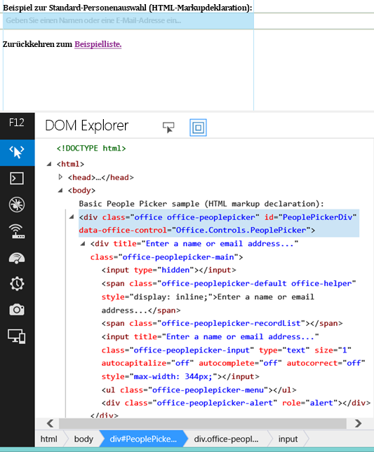

# <a name="use-the-experimental-people-picker-widget-in-sharepoint-add-ins"></a><span data-ttu-id="d24db-102">Verwenden des experimentellen Personenauswahl-Widgets in SharePoint-Add-Ins</span><span class="sxs-lookup"><span data-stu-id="d24db-102">Use the experimental People Picker widget in SharePoint Add-ins</span></span>
<span data-ttu-id="d24db-p101">Erfahren Sie, wie Sie das Personenauswahl-Widget auf einer Webseite verwenden, auch wenn die Seite nicht in SharePoint gehostet wird. Verwenden Sie das Personenauswahl-Widget in Ihren Add-Ins, um Benutzern das Suchen und Auswählen von Personen und Gruppen zu erleichtern.</span><span class="sxs-lookup"><span data-stu-id="d24db-p101">Learn how to use the People Picker widget on any web page, even if the page is not hosted in SharePoint. Use the People Picker widget in your add-ins to help users find and select people and groups.</span></span>
 

 <span data-ttu-id="d24db-p102">**Hinweis** Der Name „Apps für SharePoint“ wird in „SharePoint-Add-Ins“ geändert. Während des Übergangszeitraums wird in der Dokumentation und der Benutzeroberfläche einiger SharePoint-Produkte und Visual Studio-Tools möglicherweise weiterhin der Begriff „Apps für SharePoint“ verwendet. Weitere Informationen finden Sie unter [Neuer Name für Office- und SharePoint-Apps](new-name-for-apps-for-sharepoint.md#bk_newname).</span><span class="sxs-lookup"><span data-stu-id="d24db-p102">**Note**  The name "apps for SharePoint" is changing to "SharePoint Add-ins". During the transition, the documentation and the UI of some SharePoint products and Visual Studio tools might still use the term "apps for SharePoint". For details, see  [New name for apps for Office and SharePoint](new-name-for-apps-for-sharepoint.md#bk_newname).</span></span>
 


 <span data-ttu-id="d24db-p103">**Vorsicht** Die Office Web Widgets - Experimental werden nur zu Recherche- und Feedbackzwecken bereitgestellt. Verwenden Sie sie nicht in Produktionsszenarios. Das Verhalten von Office Web Widgets kann sich in künftigen Versionen erheblich ändern. Lesen und prüfen Sie die  [Lizenzbedingungen für Office Web Widgets - Experimental](office-web-widgetsexperimental-license-terms.md).</span><span class="sxs-lookup"><span data-stu-id="d24db-p103">**Caution**  The Office Web Widgets - Experimental are only provided for research and feedback purposes. Do not use in production scenarios. The Office Web Widgets behavior may change significantly in future releases. Read and review the  [Office Web Widgets - Experimental License Terms](office-web-widgetsexperimental-license-terms.md).</span></span>
 


<span data-ttu-id="d24db-p104">Sie können das experimentelle Personenauswahl-Widget in Add-Ins verwenden, um Ihren Benutzern zu helfen, Personen und Gruppen in einem Mandanten zu suchen und auszuwählen. Benutzer können beginnen, etwas in das Textfeld einzugeben, und das Widget ruft die Personen ab, deren Name oder E-Mail-Adresse mit dem Text übereinstimmt.</span><span class="sxs-lookup"><span data-stu-id="d24db-p104">You can use the experimental People Picker widget in add-ins to help your users find and select people and groups in a tenant. Users can start typing in the text box and the widget retrieves the people whose name or e-mail matches the text.</span></span>
 


<span data-ttu-id="d24db-114">**Abbildung 1: Personenauswahl-Widget beim Auflösen einer Abfrage**</span><span class="sxs-lookup"><span data-stu-id="d24db-114">**Figure 1. People Picker widget solving a query**</span></span>

 

 

 

 

 
<span data-ttu-id="d24db-p105">Ihr Add-In kann auf die ausgewählten Personen zugreifen, indem es die Eigenschaft **selectedItems** des Widgets liest. Die selectedItems-Eigenschaft ist ein Array von Objekten, die Personen oder Gruppen darstellen. Die folgende Tabelle zeigt die verfügbaren Eigenschaften des Benutzerobjekts.</span><span class="sxs-lookup"><span data-stu-id="d24db-p105">Your add-in can access the selected people by reading the  **selectedItems** property of the widget. The selectedItems property is an array of objects that represent people or groups. The following table shows the available properties of the user object.</span></span>
 


|<span data-ttu-id="d24db-119">**Eigenschaft**</span><span class="sxs-lookup"><span data-stu-id="d24db-119">**Property**</span></span>|<span data-ttu-id="d24db-120">**Beschreibung**</span><span class="sxs-lookup"><span data-stu-id="d24db-120">**Description**</span></span>|
|:-----|:-----|
|<span data-ttu-id="d24db-121">**department**</span><span class="sxs-lookup"><span data-stu-id="d24db-121">**department**</span></span>|<span data-ttu-id="d24db-122">Stellt die Abteilung des Benutzers oder der Gruppe dar.</span><span class="sxs-lookup"><span data-stu-id="d24db-122">Represents the department of the user or group.</span></span>|
|<span data-ttu-id="d24db-123">**displayName**</span><span class="sxs-lookup"><span data-stu-id="d24db-123">**displayName**</span></span>|<span data-ttu-id="d24db-124">Stellt den Anzeigenamen des Benutzers oder der Gruppe dar.</span><span class="sxs-lookup"><span data-stu-id="d24db-124">Represents the display name of the user or group.</span></span>|
|<span data-ttu-id="d24db-125">**email**</span><span class="sxs-lookup"><span data-stu-id="d24db-125">**email**</span></span>|<span data-ttu-id="d24db-126">Stellt die E-Mail-Adresse des Benutzers oder der Gruppe dar.</span><span class="sxs-lookup"><span data-stu-id="d24db-126">Represents the e-mail address of the user or group.</span></span>|
|<span data-ttu-id="d24db-127">**isResolved**</span><span class="sxs-lookup"><span data-stu-id="d24db-127">**isResolved**</span></span>|<span data-ttu-id="d24db-128">Zeigt an, ob das Widget den Text im Widget erfolgreich durch einen Benutzer oder eine Gruppe im Mandanten ersetzt hat.</span><span class="sxs-lookup"><span data-stu-id="d24db-128">Indicates if the widget has successfully resolved the text in the widget against a user or group in the tenant.</span></span>|
|<span data-ttu-id="d24db-129">**jobTitle**</span><span class="sxs-lookup"><span data-stu-id="d24db-129">**jobTitle**</span></span>|<span data-ttu-id="d24db-130">Stellt die Position des Benutzers dar.</span><span class="sxs-lookup"><span data-stu-id="d24db-130">Represents the job title of the user.</span></span>|
|<span data-ttu-id="d24db-131">**loginName**</span><span class="sxs-lookup"><span data-stu-id="d24db-131">**loginName**</span></span>|<span data-ttu-id="d24db-132">Stellt den Anmeldenamen des Benutzers oder der Gruppe dar.</span><span class="sxs-lookup"><span data-stu-id="d24db-132">Represents the login name of the user or group.</span></span>|
|<span data-ttu-id="d24db-133">**mobile**</span><span class="sxs-lookup"><span data-stu-id="d24db-133">**mobile**</span></span>|<span data-ttu-id="d24db-134">Stellt die Mobiltelefonnummer des Benutzers oder der Gruppe dar.</span><span class="sxs-lookup"><span data-stu-id="d24db-134">Represents the mobile phone number of the user or group.</span></span>|
|<span data-ttu-id="d24db-135">**principalId**</span><span class="sxs-lookup"><span data-stu-id="d24db-135">**principalId**</span></span>|<span data-ttu-id="d24db-136">Stellt die Prinzipal-ID des Benutzers oder der Gruppe dar.</span><span class="sxs-lookup"><span data-stu-id="d24db-136">Represents the principal ID of the user or group.</span></span>|
|<span data-ttu-id="d24db-137">**principalType**</span><span class="sxs-lookup"><span data-stu-id="d24db-137">**principalType**</span></span>|<span data-ttu-id="d24db-p106">Gibt an, ob das Element ein Benutzer oder eine Gruppe ist. Weist den Wert 1 auf, wenn es ein Benutzer ist, und den Wert 4, wenn es eine Gruppe ist.</span><span class="sxs-lookup"><span data-stu-id="d24db-p106">Indicates if the item is a user or a group. It has a value of 1 if it's a user, 4 if it's a group.</span></span>|
|<span data-ttu-id="d24db-140">**sipAddress**</span><span class="sxs-lookup"><span data-stu-id="d24db-140">**sipAddress**</span></span>|<span data-ttu-id="d24db-141">Stellt die SIPl-Adresse des Benutzers oder der Gruppe dar.</span><span class="sxs-lookup"><span data-stu-id="d24db-141">Represents the sip address of the user or group.</span></span>|
|<span data-ttu-id="d24db-142">**text**</span><span class="sxs-lookup"><span data-stu-id="d24db-142">**text**</span></span>|<span data-ttu-id="d24db-143">Stellt den Texttitel des Benutzer- oder Gruppennamens dar.</span><span class="sxs-lookup"><span data-stu-id="d24db-143">Represents the text title of the user or group name.</span></span>|
<span data-ttu-id="d24db-p107">Das Personenauswahl­-Widget weist einen Cache der zuletzt verwendeten Einträge (Most Recently Used, MRU) auf. Der Cache speichert die fünf letzten Einträge, die vom Widget aufgelöst wurden.</span><span class="sxs-lookup"><span data-stu-id="d24db-p107">The People Picker widget has a cache of the most recently used (MRU) entries. The cache stores the five latest entries that the widget resolved.</span></span>
 

## <a name="prerequisites-for-using-the-examples-in-this-article"></a><span data-ttu-id="d24db-146">Voraussetzungen für die Verwendung der Beispiele in diesem Artikel</span><span class="sxs-lookup"><span data-stu-id="d24db-146">Prerequisites for using the examples in this article</span></span>

<span data-ttu-id="d24db-147">Um die Beispiele in diesem Artikel zu verwenden, benötigen Sie Folgendes:</span><span class="sxs-lookup"><span data-stu-id="d24db-147">To use the examples in this article, you need the following:</span></span>
 

 

- <span data-ttu-id="d24db-148">Visual Studio 2013.</span><span class="sxs-lookup"><span data-stu-id="d24db-148">Visual Studio 2013.</span></span>
    
 
- <span data-ttu-id="d24db-p108">NuGet-Paket-Manager. Weitere Informationen finden Sie unter [Installieren von NuGet](http://go.microsoft.com/fwlink/?LinkId=271465).</span><span class="sxs-lookup"><span data-stu-id="d24db-p108">NuGet Package Manager. For more information, see  [Installing NuGet](http://go.microsoft.com/fwlink/?LinkId=271465).</span></span>
    
 
- <span data-ttu-id="d24db-151">Eine SharePoint-Entwicklungsumgebung (für lokale Szenarios App-Isolierung erforderlich).</span><span class="sxs-lookup"><span data-stu-id="d24db-151">A SharePoint development environment (app isolation required for on-premises scenarios).</span></span>
    
 
- <span data-ttu-id="d24db-p109">Office Web Widgets - Experimental - NuGet-Paket. Weitere Informationen dazu, wie Sie ein NuGet-Paket installieren, finden Sie unter  [Verwalten von NuGet-Paketen mithilfe des Dialogfelds](http://docs.nuget.org/docs/start-here/managing-nuget-packages-using-the-dialog). Sie können auch die  [NuGet-Galerieseite](http://www.nuget.org/packages/Microsoft.Office.WebWidgets.Experimental/) durchsuchen.</span><span class="sxs-lookup"><span data-stu-id="d24db-p109">Office Web Widgets - Experimental NuGet package. For more information about how to install a NuGet package, see  [Managing NuGet Packages Using the Dialog](http://docs.nuget.org/docs/start-here/managing-nuget-packages-using-the-dialog). You can also browse the  [NuGet gallery page](http://www.nuget.org/packages/Microsoft.Office.WebWidgets.Experimental/).</span></span>
    
 

## <a name="use-the-people-picker-widget-in-a-provider-hosted-sharepoint-add-in"></a><span data-ttu-id="d24db-155">Verwenden des Personenauswahl-Widgets in einem vom Anbieter gehosteten SharePoint-Add-In</span><span class="sxs-lookup"><span data-stu-id="d24db-155">Use the People Picker widget in a provider-hosted SharePoint Add-in</span></span>

<span data-ttu-id="d24db-p110">Dieses Beispiel enthält eine einfache Seite, die außerhalb von SharePoint gehostet wird und ein Personenauswahl-Widget mithilfe von Markup deklariert. Aus Gründen der Einfachheit werden in diesem Beispiel keine Optionen deklariert. Im Abschnitt  [Nächste Schritte](use-the-experimental-people-picker-widget-in-sharepoint-add-ins.md#NextSteps) finden Sie allerdings ein Beispiel mit Optionen.</span><span class="sxs-lookup"><span data-stu-id="d24db-p110">In this example, there is a simple page hosted outside of SharePoint that declares a People Picker widget using markup. To keep things simple, this example doesn't declare any options, but you can see an example with options in the  [NextSteps](use-the-experimental-people-picker-widget-in-sharepoint-add-ins.md#NextSteps) section.</span></span>
 

 
<span data-ttu-id="d24db-158">Wenn Sie das Personenauswahl-Widget verwenden möchten, müssen Sie Folgendes tun:</span><span class="sxs-lookup"><span data-stu-id="d24db-158">To use the People Picker widget, you must do the following:</span></span>
 

 

- <span data-ttu-id="d24db-159">Erstellen Sie SharePoint-Add-In- und Webprojekte.</span><span class="sxs-lookup"><span data-stu-id="d24db-159">Create SharePoint Add-in and web projects.</span></span>
    
 
- <span data-ttu-id="d24db-p111">Erstellen Sie im Add-In-Web ein Modul. Mit diesem Schritt wird sichergestellt, dass ein Add-In-Web erstellt wird, wenn Benutzer das Add-In bereitstellen.</span><span class="sxs-lookup"><span data-stu-id="d24db-p111">Create a module on the add-in web. This step ensures that an add-in web is created when users deploy the add-in.</span></span>
    
     <span data-ttu-id="d24db-p112">**Hinweis** Für die domänenübergreifende Bibliothek muss ein Add-In-Web vorhanden sein. Das Personenauswahl-Widget kommuniziert mithilfe der domänenübergreifenden Bibliothek mit SharePoint.</span><span class="sxs-lookup"><span data-stu-id="d24db-p112">**Note**  The cross-domain library requires the existence of an add-in web. The People Picker widget communicates with SharePoint by using the cross-domain library.</span></span>
- <span data-ttu-id="d24db-164">Erstellen Sie eine Add-In-Seite, die mithilfe von Markup eine Personenauswahl-Widget-Instanz deklariert.</span><span class="sxs-lookup"><span data-stu-id="d24db-164">Create an add-in page that declares a People Picker widget instance using markup.</span></span>
    
 

### <a name="to-create-a-sharepoint-add-in-and-web-projects"></a><span data-ttu-id="d24db-165">So erstellen Sie ein SharePoint-Add-In und Webprojekte</span><span class="sxs-lookup"><span data-stu-id="d24db-165">To create a SharePoint Add-in and web projects</span></span>


1. <span data-ttu-id="d24db-p113">Öffnen Sie Visual Studio 2013 als Administrator. (Wählen Sie dazu im Menü **Start** das Symbol für Visual Studio 2013 aus, und wählen Sie **Als Administrator ausführen** aus.)</span><span class="sxs-lookup"><span data-stu-id="d24db-p113">Open Visual Studio 2013 as administrator. (To do this, choose the Visual Studio 2013 icon on the  **Start** menu, and choose **Run as administrator**.)</span></span>
    
 
2. <span data-ttu-id="d24db-168">Erstellen Sie mithilfe der SharePoint-Add-In 2013-Vorlage ein neues Projekt. Die **SharePoint-Add-In 2013** -Vorlage befindet sich unter **Vorlagen**> **Visual C#**, **Office/SharePoint**> **Add-Ins**.</span><span class="sxs-lookup"><span data-stu-id="d24db-168">Create a new project using the SharePoint Add-in 2013 template.The  **SharePoint Add-in 2013** template is located under **Templates**> **Visual C#**,  **Office/SharePoint**> **Add-ins**.</span></span>
    
 
3. <span data-ttu-id="d24db-169">Geben Sie die URL der SharePoint-Website an, die Sie für das Debugging verwenden möchten.</span><span class="sxs-lookup"><span data-stu-id="d24db-169">Provide the SharePoint website URL that you want to use for debugging.</span></span>
    
 
4. <span data-ttu-id="d24db-170">Wählen Sie als Hostingoption für Ihr Add-In **Von Anbieter gehostet** aus.</span><span class="sxs-lookup"><span data-stu-id="d24db-170">Select  **Provider-hosted** as the hosting option for your add-in.</span></span>
    
     <span data-ttu-id="d24db-171">**Hinweis** Sie können das Personenauswahl-Widget auch mit anderen Hostingoptionen oder sogar mit Add-Ins für Office auf Ihrer eigenen Website verwenden.</span><span class="sxs-lookup"><span data-stu-id="d24db-171">**Note**  You can also use the People Picker widget with other hosting options or even with Office Add-ins or your own website.</span></span>
5. <span data-ttu-id="d24db-172">Wählen Sie als Typ des Webanwendungsprojekts **ASP.NET Webformular-Anwendung** aus.</span><span class="sxs-lookup"><span data-stu-id="d24db-172">Select  **ASP.NET Web Forms Application** as the type of web application project.</span></span>
    
 
6. <span data-ttu-id="d24db-173">Wählen Sie als Authentifizierungsoption **Windows Azure-Zugriffssteuerungsdienst** aus.</span><span class="sxs-lookup"><span data-stu-id="d24db-173">Select  **Windows Azure Access Control Service** as the authentication option.</span></span>
    
 

### <a name="to-create-a-module-on-the-add-in-web"></a><span data-ttu-id="d24db-174">So erstellen Sie ein Modul im Web-Add-In</span><span class="sxs-lookup"><span data-stu-id="d24db-174">To create a module on the add-in web</span></span>


1. <span data-ttu-id="d24db-p114">Wählen Sie das SharePoint-Add-In-Projekt im **Projektmappen-Explorer** aus. Wählen Sie **Hinzufügen**> **Neues Element** aus.</span><span class="sxs-lookup"><span data-stu-id="d24db-p114">Choose the SharePoint Add-in project in  **Solution Explorer**. Choose  **Add**> **New Item…**</span></span>
    
 
2. <span data-ttu-id="d24db-p115">Wählen Sie **Visual C#-Elemente**> **Office/SharePoint**> **Modul** aus. Geben Sie einen Namen für Ihr Modul an.</span><span class="sxs-lookup"><span data-stu-id="d24db-p115">Choose  **Visual C# Items**> **Office/SharePoint**> **Module**. Provide a name for your module.</span></span>
    
     <span data-ttu-id="d24db-179">**Hinweis** Wenn Sie eine Von SharePoint gehostetes Add-In erstellen, müssen Sie ein eigenes Modul erstellen.</span><span class="sxs-lookup"><span data-stu-id="d24db-179">**Note**  If you're building a SharePoint-hosted add-in, you don't need to create an extra module.</span></span>

### <a name="to-add-a-new-page-that-uses-the-people-picker-widget"></a><span data-ttu-id="d24db-180">So fügen Sie eine neue Seite hinzu, die das Personenauswahl-Widget verwendet</span><span class="sxs-lookup"><span data-stu-id="d24db-180">To add a new page that uses the People Picker widget</span></span>


1. <span data-ttu-id="d24db-181">Wählen Sie im **Projektmappen-Explorer** im Webprojekt den Ordner **Seiten** aus.</span><span class="sxs-lookup"><span data-stu-id="d24db-181">Choose the  **Pages** folder in the web project in **Solution Explorer**.</span></span>
    
 
2. <span data-ttu-id="d24db-p116">Kopieren Sie den folgenden Code, und fügen Sie ihn in eine **ASPX** -Datei im Projekt ein. Der Code führt die folgenden Aufgaben durch:</span><span class="sxs-lookup"><span data-stu-id="d24db-p116">Copy the following code and paste it in an  **ASPX** file in the project. The code performs the following tasks:</span></span>
    
      - <span data-ttu-id="d24db-184">Fügt Referenzen zu den erforderlichen Office-Bibliotheken und -Ressourcen hinzu.</span><span class="sxs-lookup"><span data-stu-id="d24db-184">Adds references to the required Office libraries and resources.</span></span>
    
 
  - <span data-ttu-id="d24db-185">Initialisiert die Steuerelementelaufzeit.</span><span class="sxs-lookup"><span data-stu-id="d24db-185">Initializes the controls runtime.</span></span>
    
 
  - <span data-ttu-id="d24db-186">Führt die Methode **renderAll** der Office-Steuerelementelaufzeit aus.</span><span class="sxs-lookup"><span data-stu-id="d24db-186">Runs the  **renderAll** method of the Office Controls runtime.</span></span>
    
 
  - <span data-ttu-id="d24db-187">Deklariert einen Platzhalter für das Personenauswahl-Widget.</span><span class="sxs-lookup"><span data-stu-id="d24db-187">Declares a placeholder for the People Picker widget.</span></span>
    
 

```
  <!DOCTYPE html>
<html>
<head>
    <!-- IE9 or superior -->
    <meta http-equiv="X-UA-Compatible" content="IE=9" >
    <title>People Picker HTML Markup</title>

    <!-- Widgets Specific CSS File -->
    <link 
        rel="stylesheet" 
        type="text/css" 
        href="../Scripts/Office.Controls.css" 
    />

    <!-- Ajax, jQuery, and utils --> 
    <script 
        src=" https://ajax.aspnetcdn.com/ajax/4.0/1/MicrosoftAjax.js.js">
    </script>
    <script 
        src=" https://ajax.aspnetcdn.com/ajax/jQuery/jquery-1.9.1.min.js">
    </script>
    <script type="text/javascript">
        // Function to retrieve a query string value.
        // For production purposes you may want to use
        //  a library to handle the query string.
        function getQueryStringParameter(paramToRetrieve) {
            var params =
                document.URL.split("?")[1].split("&amp;");
            var strParams = "";
            for (var i = 0; i < params.length; i = i + 1) {
                var singleParam = params[i].split("=");
                if (singleParam[0] == paramToRetrieve)
                    return singleParam[1];
            }
        }
    </script>

    <!-- Cross-Domain Library and Office controls runtime -->
    <script type="text/javascript">
        //Register namespace and variables used through the sample
        Type.registerNamespace("Office.Samples.PeoplePickerBasic");
        //Retrieve context tokens from the querystring
        Office.Samples.PeoplePickerBasic.appWebUrl =
            decodeURIComponent(getQueryStringParameter("SPAppWebUrl"));
        Office.Samples.PeoplePickerBasic.hostWebUrl =
            decodeURIComponent(getQueryStringParameter("SPHostUrl"));

        //Pattern to dynamically load JSOM and and the cross-domain library
        var scriptbase =
            Office.Samples.PeoplePickerBasic.hostWebUrl + "/_layouts/15/";

        //Get the cross-domain library
        $.getScript(scriptbase + "SP.RequestExecutor.js",
            //Get the Office controls runtime and 
            //  continue to the createControl function
            function () {
                $.getScript("../Scripts/Office.Controls.js", createControl)
            }
        );
    </script>

    <!--People Picker -->
    <script 
        src="../Scripts/Office.Controls.PeoplePicker.js" 
        type="text/javascript">
    </script>
</head>
<body>
Basic People Picker sample (HTML markup declaration):
<div 
        id="PeoplePickerDiv" 
        data-office-control="Office.Controls.PeoplePicker">
</div>

<script type="text/javascript">
    function createControl() {
        //Initialize Controls Runtime
        Office.Controls.Runtime.initialize({
            sharePointHostUrl: Office.Samples.PeoplePickerBasic.hostWebUrl,
            appWebUrl: Office.Samples.PeoplePickerBasic.appWebUrl
        });

        //Render the widget, this must be executed after the
        //placeholder DOM is loaded
        Office.Controls.Runtime.renderAll();
    }
</script>
</body>
</html>

```


 <span data-ttu-id="d24db-p117">**Hinweis** Das obige Codebeispiel gibt die URLs des Hostwebs und des Add-In-Webs explizit an, um die Office-Steuerelementelaufzeit zu initialisieren. Wenn die URLs des Hostwebs und des Add-In-Webs allerdings im Abfragezeichenfolgenparameter **SPAppWebUrl** bzw. **SPHostUrl** angegeben werden, können Sie ein leeres Objekt übergeben. Der Code wird dann versuchen, die Parameter automatisch abzurufen. Die Parameter **SPAppWebUrl** und **SPHostUrl** sind in der Abfragezeichenfolge enthalten, wenn Sie das Token **{StandardTokens}** verwenden.</span><span class="sxs-lookup"><span data-stu-id="d24db-p117">**Note**  The code example above explicitly specifies the host web and add-in web URLs to initialize the Office controls runtime. However, if the add-in web and host web URLs are specified in the  **SPAppWebUrl** and **SPHostUrl** query string parameters, respectively; you can pass an empty object and the code will attempt to get the parameters automatically. The **SPAppWebUrl** and **SPHostUrl** parameters are included in the query string when you use the **{StandardTokens}** token.</span></span>
 

<span data-ttu-id="d24db-191">Das folgende Beispiel zeigt, wie Sie ein leeres Objekt übergeben, um die Methode zu initialisieren:</span><span class="sxs-lookup"><span data-stu-id="d24db-191">The following example shows you how to pass an empty object to the initialize method:</span></span>
 

 


```
// Initialize with an empty object and the code 
// will attempt to get the tokens from the
// query string directly.
Office.Controls.Runtime.initialize({});
```


### <a name="to-build-and-run-the-solution"></a><span data-ttu-id="d24db-192">So erstellen Sie die Lösung und führen sie aus</span><span class="sxs-lookup"><span data-stu-id="d24db-192">To build and run the solution</span></span>


1. <span data-ttu-id="d24db-193">Drücken Sie F5.</span><span class="sxs-lookup"><span data-stu-id="d24db-193">Press the F5 key.</span></span>
    
     <span data-ttu-id="d24db-194">**Hinweis** Wenn Sie F5 drücken, erstellt Visual Studio die Lösung, stellt das Add-In bereit und öffnet die Berechtigungsseite für das Add-In.</span><span class="sxs-lookup"><span data-stu-id="d24db-194">**Note**  When you press F5, Visual Studio builds the solution, deploys the add-in, and opens the permissions page for the add-in.</span></span>
2. <span data-ttu-id="d24db-195">Klicken Sie auf die Schaltfläche **Vertrauen**.</span><span class="sxs-lookup"><span data-stu-id="d24db-195">Choose the  **Trust It** button.</span></span>
    
 
3. <span data-ttu-id="d24db-196">Wählen Sie auf der Seite **Websiteinhalte** das Add-In-Symbol.</span><span class="sxs-lookup"><span data-stu-id="d24db-196">Choose the add-in icon on the  **Site Contents** page.</span></span>
    
 
<span data-ttu-id="d24db-197">Sie können dieses Beispiel auch in der Codegalerie herunterladen: siehe Codebeispiel [Verwenden des experimentellen Personenauswahl-Widgets in einem Add-In](http://code.msdn.microsoft.com/SharePoint-Use-the-57859f85).</span><span class="sxs-lookup"><span data-stu-id="d24db-197">You can also download this sample from code gallery, see the  [Use the People Picker experimental widget in an add-in](http://code.msdn.microsoft.com/SharePoint-Use-the-57859f85) code sample.</span></span>
 

 

## 
<span data-ttu-id="d24db-198"><a name="NextSteps"> </a></span><span class="sxs-lookup"><span data-stu-id="d24db-198"></span></span>

<span data-ttu-id="d24db-p118">In diesem Artikel wird die Verwendung des Personenauswahl-Widgets in Ihrem Add-In mithilfe von HTML beschrieben. Sie können auch die folgenden Szenarios und Details zum Widget erkunden.</span><span class="sxs-lookup"><span data-stu-id="d24db-p118">This article shows how to use the People Picker widget in your add-in by using HTML. You can also explore the following scenarios and details about the widget.</span></span>
 

 

### <a name="use-javascript-to-declare-the-people-picker-widget"></a><span data-ttu-id="d24db-201">Verwenden von JavaScript, um das Personenauswahl-Widget zu deklarieren</span><span class="sxs-lookup"><span data-stu-id="d24db-201">Use JavaScript to declare the People Picker widget</span></span>

<span data-ttu-id="d24db-p119">Möglicherweise verwenden Sie zum Deklarieren des Widgets anstatt HTML lieber das JavaScript. Ist dies der Fall, können Sie das folgende Markup als Platzhalter für das Widget verwenden.</span><span class="sxs-lookup"><span data-stu-id="d24db-p119">Depending on your preference, you might want to use the JavaScript instead of HTML to declare the widget. If this is the case you can use the following markup as the placeholder for the widget.</span></span>
 

 

```HTML
<div id="PeoplePickerDiv"></div>
```

<span data-ttu-id="d24db-204">Verwenden Sie den folgenden JavaScript-Code, um die Personenauswahl zu instanziieren.</span><span class="sxs-lookup"><span data-stu-id="d24db-204">Use the following JavaScript code to instantiate the People Picker.</span></span>
 

 


```
new Office.Controls.PeoplePicker(
    document.getElementById("PeoplePickerDiv"), {});
```

<span data-ttu-id="d24db-205">Ein Codebeispiel, das zeigt, wie die Aufgaben durchgeführt werden, finden Sie auf der Seite **JSSimple.html** im Codebeispiel [Verwenden des experimentellen Personenauswahl-Widgets in einem Add-In](http://code.msdn.microsoft.com/SharePoint-Use-the-57859f85).</span><span class="sxs-lookup"><span data-stu-id="d24db-205">For a code sample that shows how to perform the tasks, see the  **JSSimple.html** page in the [Use the People Picker experimental widget in an add-in](http://code.msdn.microsoft.com/SharePoint-Use-the-57859f85) code sample.</span></span>
 

 

### <a name="specify-options-for-the-widget"></a><span data-ttu-id="d24db-206">Angeben von Optionen für das Widget</span><span class="sxs-lookup"><span data-stu-id="d24db-206">Specify options for the widget</span></span>

<span data-ttu-id="d24db-p120">Sie können mithilfe des Attributs **data-office-options** in der Widget-Deklaration Optionen für das Widget festlegen. Der folgende HTML-Code zeigt, wie Sie Optionen für das Personenauswahl-Widget festlegen.</span><span class="sxs-lookup"><span data-stu-id="d24db-p120">You can specify options for the widget by using the  **data-office-options** attribute in the widget declaration. The following HTML shows how to specify options for the PeoplePicker widget.</span></span>
 

 

```HTML
<div id="PeoplePickerDiv"
        data-office-control="Office.Controls.PeoplePicker"
        data-office-options='{
        "allowMultipleSelections" : true,
        "onChange" : handleChange,
        "placeholder" : "Check the count message, it changes when you add names..."
    }'>
</div>
```

<span data-ttu-id="d24db-209">Der folgende Code gibt an, wie Sie Optionen angeben, wenn Sie das Personenauswahl-Widget mit JavaScript deklarieren.</span><span class="sxs-lookup"><span data-stu-id="d24db-209">The following code shows how to specify options when you declare the PeoplePicker widget using JavaScript.</span></span>
 

 


```
new Office.Controls.PeoplePicker(
    document.getElementById("PeoplePickerDiv"), {
        allowMultipleSelections: true,
        placeholder: "Check the count message, it changes when you add names...",
        onChange: function (ctrl) {
            document.getElementById("count").textContent = 
ctrl.selectedItems.length.toString();
        }
    });
```

<span data-ttu-id="d24db-p121">Sie können auch Ereignishandler für die Ereignisse **onChange**, **onAdded** und **onRemoved** festlegen. Beachten Sie im obigen Code, dass der Ereignishandler für das onChange-Ereignis einen einzelnen **ctrl** -Parameter erhält, der einen Verweis auf das Widget darstellt.</span><span class="sxs-lookup"><span data-stu-id="d24db-p121">You can also specify event handlers for the  **onChange**, **onAdded**, and **onRemoved** events. Note in the code above that the event handler for the onChange event receives a single parameter **ctrl**, which is a reference to the widget.</span></span>
 

 
<span data-ttu-id="d24db-212">Ein Beispiel dafür, wie Sie Optionen festlegen, finden Sie auf den Seiten **MarkupOptions.html** und **JSOptions.html** im Codebeispiel [Verwenden des experimentellen Personenauswahl-Widgets in einem Add-In](http://code.msdn.microsoft.com/SharePoint-Use-the-57859f85).</span><span class="sxs-lookup"><span data-stu-id="d24db-212">For an example of how to specify options, see the  **MarkupOptions.html** and **JSOptions.html** pages in the [Use the People Picker experimental widget in an add-in](http://code.msdn.microsoft.com/SharePoint-Use-the-57859f85) code sample.</span></span>
 

 

### <a name="retrieve-the-people-or-groups-selected-in-the-widget"></a><span data-ttu-id="d24db-213">Abrufen von Personen oder Gruppen, die im Widget ausgewählt sind</span><span class="sxs-lookup"><span data-stu-id="d24db-213">Retrieve the people or groups selected in the widget</span></span>

<span data-ttu-id="d24db-214">m die Personen im Widget abzurufen, müssen Sie die folgenden Aufgaben durchführen:</span><span class="sxs-lookup"><span data-stu-id="d24db-214">To retrieve the people in the widget you must perform the following tasks:</span></span>
 

 

- <span data-ttu-id="d24db-215">Abrufen eines Verweises auf das Widget.</span><span class="sxs-lookup"><span data-stu-id="d24db-215">Get a reference to the widget.</span></span>
    
 
- <span data-ttu-id="d24db-216">Aufrufen der Eigenschaft **selectedItems** des Widgets.</span><span class="sxs-lookup"><span data-stu-id="d24db-216">Access the  **selectedItems** property of the widget.</span></span>
    
 
<span data-ttu-id="d24db-217">Sie können einen Verweis auf das Widget mithilfe der folgenden Syntax erhalten.</span><span class="sxs-lookup"><span data-stu-id="d24db-217">You can get a reference to the widget using the following syntax.</span></span>
 

 


```
var pplPicker = document.getElementById("PeoplePickerDiv")._officeControl;
```

<span data-ttu-id="d24db-218">Sie können einen Verweis auch speichern, wenn Sie das Widget instanziieren.</span><span class="sxs-lookup"><span data-stu-id="d24db-218">You can also save a reference when you instantiate the widget.</span></span>
 

 


```
var pplPicker = new Office.Controls.PeoplePicker(
                        document.getElementById("PeoplePickerDiv"), {});
```

<span data-ttu-id="d24db-p122">Die Eigenschaft **selectedItems** ist ein Array von Objekten, die Personen oder Gruppen darstellen. Personen oder Gruppen im selectedItems-Array können aufgelöst oder unaufgelöst sein, was Sie in der Eigenschaft **isResolved** überprüfen können. Im folgenden Beispiel wird gezeigt, wie Sie das Element *i*  im Array aufrufen und den Namen der Person oder Gruppe verwenden.</span><span class="sxs-lookup"><span data-stu-id="d24db-p122">The  **selectedItems** property is an array of objects that represent people or groups. People or groups in the selectedItems array can either be resolved or unresolved, which you can check in the **isResolved** property. The following example shows how to access the element *i*  in the array and use the name of the person or group.</span></span>
 

 


```
var principal = pplPicker.selectedItems[i];
$("#msg").text(principal.text + " is selected in the control.");
```

<span data-ttu-id="d24db-222">Ein Beispiel dafür, wie Sie die ausgewählten Personen oder Gruppen im Widget abrufen, finden Sie auf der Seite **demo.html** des Codebeispiels [Office Web Widgets - Experimentelle Demo](http://code.msdn.microsoft.com/SharePoint-Office-Web-6d44aa9e).</span><span class="sxs-lookup"><span data-stu-id="d24db-222">For an example of how to retrieve the selected people or groups from the widget, see the  **demo.html** page of the [Office Web Widgets - Experimental Demo](http://code.msdn.microsoft.com/SharePoint-Office-Web-6d44aa9e) code sample.</span></span>
 

 

### <a name="customize-the-style-of-the-widget"></a><span data-ttu-id="d24db-223">Anpassen des Widget-Formts</span><span class="sxs-lookup"><span data-stu-id="d24db-223">Customize the style of the widget</span></span>

<span data-ttu-id="d24db-p123">Als Entwickler möchten Sie vielleicht das Erscheinungsbild des Widgets anpassen. Die folgende Abbildung zeigt die HTML-Hierarchie im Widget, nachdem es gerendert wurde.</span><span class="sxs-lookup"><span data-stu-id="d24db-p123">As a developer, you might want to customize the look &amp; feel of the widget. The following image shows the HTML hierarchy in the widget after it has been rendered.</span></span>
 

 

<span data-ttu-id="d24db-226">**Abbildung 2: HTML-Hierarchie im Personenauswahl-Widget**</span><span class="sxs-lookup"><span data-stu-id="d24db-226">**Figure 2. HTML hierarchy in the People Picker widget**</span></span>

 

 

 
<span data-ttu-id="d24db-228">Das Widget definiert viele Klassen mit dem Präfix **office-peoplepicker**, die Sie im Stylesheet **Office.Controls.css** finden und anpassen können.</span><span class="sxs-lookup"><span data-stu-id="d24db-228">The widget defines many classes prefixed by  **office-peoplepicker**, which you can find and customize in the **Office.Controls.css** style sheet.</span></span>
 

 

## <a name="conclusion"></a><span data-ttu-id="d24db-229">Schlussbemerkung</span><span class="sxs-lookup"><span data-stu-id="d24db-229">Conclusion</span></span>
<span data-ttu-id="d24db-230"><a name="NextSteps"> </a></span><span class="sxs-lookup"><span data-stu-id="d24db-230"></span></span>

<span data-ttu-id="d24db-p124">Sie können das experimentelle Personenauswahl-Widget verwenden, um Personen und Gruppen in Ihrem Mandanten auszuwählen. Ihr Add-In kann dann die von Ihren Benutzern ausgewählten Prinzipale verwenden. Wir freuen uns auf Ihre Ideen und Kommentare auf der  [Office Developer Platform UserVoice-Website](http://officespdev.uservoice.com/).</span><span class="sxs-lookup"><span data-stu-id="d24db-p124">You can use the experimental People Picker widget to select people and groups in your tenant, your add-in can then use the principals selected by your users. Please, provide ideas and comments in the  [Office Developer Platform UserVoice site](http://officespdev.uservoice.com/).</span></span>
 

 

## <a name="additional-resources"></a><span data-ttu-id="d24db-233">Zusätzliche Ressourcen</span><span class="sxs-lookup"><span data-stu-id="d24db-233">Additional resources</span></span>
<span data-ttu-id="d24db-234"><a name="bk_addresources"> </a></span><span class="sxs-lookup"><span data-stu-id="d24db-234"></span></span>


-  [<span data-ttu-id="d24db-235">Übersicht über Office Web Widgets – Experimental</span><span class="sxs-lookup"><span data-stu-id="d24db-235">Office Web Widgets - Experimental overview</span></span>](office-web-widgetsexperimental-overview.md)
    
 
-  [<span data-ttu-id="d24db-236">Lizenzbedingungen für Office Web Widgets – Experimental</span><span class="sxs-lookup"><span data-stu-id="d24db-236">Office Web Widgets - Experimental License Terms</span></span>](office-web-widgetsexperimental-license-terms.md)
    
 
-  [<span data-ttu-id="d24db-237">Office Web Widgets – Experimental: NuGet-Galerieseite</span><span class="sxs-lookup"><span data-stu-id="d24db-237">Office Web Widgets - Experimental NuGet gallery page</span></span>](http://www.nuget.org/packages/Microsoft.Office.WebWidgets.Experimental/)
    
 
-  <span data-ttu-id="d24db-238">[Codebeispiel: Verwenden des experimentellen Personenauswahl-Widgets in einem Add-In](http://code.msdn.microsoft.com/SharePoint-Use-the-57859f85).</span><span class="sxs-lookup"><span data-stu-id="d24db-238">[Code sample: Use the People Picker experimental widget in an add-in](http://code.msdn.microsoft.com/SharePoint-Use-the-57859f85).</span></span>
    
 
-  <span data-ttu-id="d24db-239">[Verwenden des experimentellen Desktoplistenansichts-Widgets in Add-Ins für SharePoint](use-the-experimental-desktop-list-view-widget-in-sharepoint-add-ins.md) .</span><span class="sxs-lookup"><span data-stu-id="d24db-239">[Use the experimental Desktop List View widget in SharePoint Add-ins](use-the-experimental-desktop-list-view-widget-in-sharepoint-add-ins.md).</span></span>
    
 

