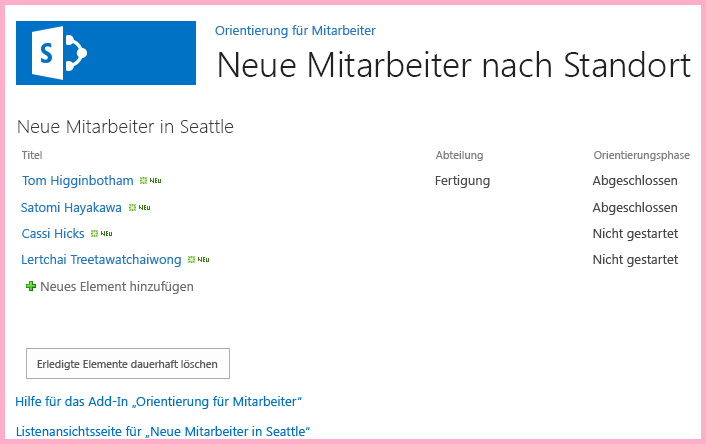
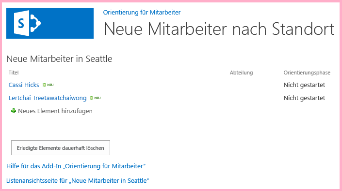

# <a name="use-the-sharepoint-javascript-apis-to-work-with-sharepoint-data"></a>Verwenden von SharePoint-JavaScript-APIs zum Arbeiten mit SharePoint-Daten

Dieser Artikel ist der zehnte Artikel in unserer Artikelreihe zu den Grundlagen der Entwicklung von SharePoint-gehosteten SharePoint-Add-Ins. Vor der Lektüre dieses Artikels sollten Sie sich zunächst mit [SharePoint-Add-Ins](sharepoint-add-ins.md) vertraut machen und die vorherigen Artikel der Reihe lesen:

-  [Erste Schritte zum Erstellen SharePoint-gehosteter SharePoint-Add-Ins](get-started-creating-sharepoint-hosted-sharepoint-add-ins.md)
-  [Bereitstellung und Installation eines von SharePoint gehosteten SharePoint-Add-Ins](deploy-and-install-a-sharepoint-hosted-sharepoint-add-in.md)
-  [Hinzufügen von Spalten zu einem von SharePoint gehosteten SharePoint-Add-In](add-custom-columns-to-a-sharepoint-hosted-sharepoint-add-in.md)
-  [Hinzufügen eines benutzerdefinierten Inhaltstyps zu einem von SharePoint gehosteten SharePoint-Add-In](add-a-custom-content-type-to-a-sharepoint-hosted-sharepoint-add-in.md) 
-  [Hinzufügen eines Webparts zu einer Seite in einem von SharePoint gehosteten SharePoint-Add-In](add-a-web-part-to-a-page-in-a-sharepoint-hosted-sharepoint-add-in.md)
-  [Hinzufügen eines Workflows zu einem von SharePoint gehosteten Add-In für SharePoint](add-a-workflow-to-a-sharepoint-hosted-sharepoint-add-in.md)
-  [Hinzufügen einer benutzerdefinierten Seite und Formatvorlage zu einem von SharePoint gehosteten Add-In für SharePoint](add-a-custom-page-and-style-to-a-sharepoint-hosted-sharepoint-add-in.md)
-  [Hinzufügen des benutzerdefinierten clientseitigen Renderings für ein von SharePoint-gehostetes SharePoint Add-In](add-custom-client-side-rendering-to-a-sharepoint-hosted-sharepoint-add-in.md)
-  [Erstellen einer benutzerdefinierten Menübandschaltfläche im Hostweb eines SharePoint-Add-Ins](create-a-custom-ribbon-button-in-the-host-web-of-a-sharepoint-add-in.md)
    
> [!NOTE]
> Wenn Sie unsere Artikelreihe zum Thema SharePoint-gehostete Add-Ins durchgearbeitet haben, haben Sie bereits eine Visual Studio-Lösung, die Sie für diesen Artikel verwenden können. Alternativ können Sie das Repository unter [SharePoint_SP-hosted_Add-Ins_Tutorials](https://github.com/OfficeDev/SharePoint_SP-hosted_Add-Ins_Tutorials) herunterladen und die Datei „BeforeJSOM.sln“ öffnen.

SharePoint-gehostete SharePoint-Add-Ins dürfen keinen serverseitigen Code enthalten. Dennoch können Sie in SharePoint-gehosteten SharePoint-Add-Ins Geschäftslogik und Laufzeitinteraktionen mit SharePoint-Komponenten realisieren, und zwar mithilfe von JavaScript und der SharePoint-Bibliothek für das JavaScript-Clientobjektmodell. Wir bezeichnen dieses Modell als JSOM. Entscheidend ist hier das „M“ am Ende: Das Konzept darf nicht verwechselt werden mit JSO**N** (JavaScript Object Notation). In diesem Artikel nutzen Sie das JavaScript-Objektmodell, um in der Liste **Neue Mitarbeiter in Seattle** alte Elemente zu finden und diese Elemente zu entfernen.

## <a name="create-the-javascript-and-a-button-to-invoke-it"></a>Erstellen des JavaScript-Codes sowie einer Schaltfläche zum Aufrufen des Codes

1. Führen Sie, sofern noch nicht geschehen, den folgenden Schritt aus dem ersten Tutorial dieser Artikelreihe durch: 
    
   Öffnen Sie die Datei **/Pages/Default.aspx** im Stammverzeichnis des Projekts. Unter anderem lädt diese generierte Datei eines oder beide der zwei Skripts, die in SharePoint gehostet werden: „sp.runtime.js“ und „sp.js“. Das Markup zum Laden dieser Dateien befindet sich im Steuerelement des Typs **Content** mit der ID **PlaceHolderAdditionalPageHead** am Anfang der Datei. Dieses Markup unterscheidet sich je nach der verwendeten Version von **Microsoft Office Developer Tools für Visual Studio**. 
   
   Für diese Tutorialreihe müssen beide Dateien geladen werden. Zudem müssen die Dateien mit herkömmlichen HTML-Tags des Typs **\<script\>** geladen werden statt mit Tags des Typs **\<SharePoint:ScriptLink\>**. Stellen Sie sicher, dass das Steuerelement **PlaceHolderAdditionalPageHead** die nachfolgenden Zeilen enthält, und zwar *direkt oberhalb* der Zeile `<meta name="WebPartPageExpansion" content="full" />`:

    ```
      <script type="text/javascript" src="/_layouts/15/sp.runtime.js"></script> 
      <script type="text/javascript" src="/_layouts/15/sp.js"></script> 
    ```

   Durchsuchen Sie anschließend die Datei nach einem anderen Markup, das auch eine oder die andere dieser Dateien lädt, und entfernen Sie das redundante Markup. Speichern und schließen Sie die Datei.

2. Möglicherweise wird im Knoten **Skripts** im **Projektmappen-Explorer** bereits eine Datei „Add-in.js“ angezeigt. Falls dem nicht so ist, jedoch eine Datei „App.js“ angezeigt wird, müssen Sie mit der rechten Maustaste auf die Datei **App.js** klicken und sie in **Add-in.js** umbenennen. Falls weder eine Datei „Add-in.js“ noch eine Datei „App.js“ vorhanden ist, müssen Sie wie folgt eine Datei erstellen:
    
   1. Klicken Sie mit der rechten Maustaste auf den Knoten **Skripts**, und wählen Sie die Option **Hinzufügen** > **Neues Element** > **Web** aus.
   2. Wählen Sie die Option **JavaScript-Datei** aus, und geben Sie der Datei den Namen **Add-in.js**.

3. Öffnen Sie die Datei „Add-in.js“, und löschen Sie gegebenenfalls vorhandene Dateiinhalte.

4. Fügen Sie die folgenden Zeilen in die Datei ein: 

    ```
      'use strict';

     var clientContext = SP.ClientContext.get_current(); 
     var employeeList = clientContext.get_web().get_lists().getByTitle('New Employees In Seattle'); 
     var completedItems; 
    ```

   Zu diesem Code ist Folgendes anzumerken:
    
   - Die Zeile `'use strict';` sorgt dafür, dass die JavaScript-Laufzeit im Browser eine Ausnahme zurückgibt, wenn Sie versehentlich bestimmte unzulässige Methoden im JavaScript-Code verwenden.

   - Die Variable `clientContext` enthält ein Objekt des Typs **SP.ClientContext**, das auf die SharePoint-Website verweist. Sämtlicher JSOM-Code erstellt zunächst ein Objekt dieses Typs oder ruft ein Objekt dieses Typs ab.

   - Die Variable `employeeList` enthält einen Verweis auf die Listeninstanz **Neue Mitarbeiter in Seattle**.

   - Die Variable `completedItems` enthält die Listenelemente, die das Skript löschen wird, d. h. die Elemente, für die das Feld **OrientationStage** auf **Abgeschlossen** gesetzt ist.

5. Das JSOM nutzt ein Batchsystem, um die Anzahl der zwischen dem Clientbrowser und dem SharePoint-Server versendeten Nachrichten möglichst gering zu halten. Tatsächlich sendet nur eine einzige Funktion Nachrichten an den Server (und erhält Antworten): **SP.ClientContext.executeQueryAsync**. 

   Aufrufe an die JSOM-APIs, die zwischen Aufrufen von **executeQueryAsync** erfolgen, werden gebündelt und beim nächsten Aufrufen von **executeQueryAsync** als Batch an den Server gesendet. Es ist jedoch nicht generell möglich, eine Methode eines JSOM-Objekts aufzurufen, es sei denn, das betreffende Objekt wurde in einem vorherigen Aufruf von **executeQueryAsync** an den Client gesendet. 
   
   Ihr Skript wird die Methode **SP.ListItem.deleteObject** für jedes abgeschlossene Element in der Liste aufrufen. Das bedeutet, es muss zwei Aufrufe von **executeQueryAsync** senden: einen Aufruf zum Abrufen einer Sammlung der abgeschlossenen Listenelemente und einen Aufruf, um die Aufrufe von **deleteObject** in einem Batch zu bündeln und diesen Batch zur Ausführung an den Server zu senden.
    
   Zunächst erstellen Sie eine Methode zum Abrufen der Listenelemente vom Server. Fügen Sie den folgenden Code in die Datei ein: 

    ```
      function purgeCompletedItems() {

       var camlQuery = new SP.CamlQuery(); 
       camlQuery.set_viewXml( 
             '<View><Query><Where><Eq>' + 
               '<FieldRef Name=\'OrientationStage\'/><Value Type=\'Choice\'>Completed</Value>' + 
             '</Eq></Where></Query></View>'); 
         completedItems = employeeList.getItems(camlQuery); 
    }
    ```

6. Sobald diese Zeilen an den Server gesendet und dort ausgeführt werden, wird eine Sammlung von Listenelementen erstellt. Das Skript muss diese Sammlung jedoch noch an den Client senden. Dazu muss die Funktion **SP.ClientContext.load** aufgerufen werden. Fügen Sie also die folgende Zeile am Ende der Methode ein:
    
    ```
      clientContext.load(completedItems);
    ```

7. Fügen Sie einen Aufruf von **executeQueryAsync** hinzu. Diese Methode hat zwei Parameter; bei beiden handelt es sich um Rückruffunktionen. Die erste wird ausgeführt, wenn der Server alle Befehle im Batch erfolgreich ausgeführt hat. Die zweite wird ausgeführt, wenn die Ausführung auf dem Server aus irgendeinem Grund fehlschlägt. Sie erstellen diese beiden Funktionen weiter unten in diesem Artikel. Fügen Sie zunächst die folgende Zeile am Ende der Methode ein:
    
    ```
      clientContext.executeQueryAsync(deleteCompletedItems, onGetCompletedItemsFail);
    ```

8. Fügen Sie nun noch die folgende Zeile am Ende der Methode ein: 

    ```
      return false;
    ```

   Durch Zurückgeben von **false** an die ASP.NET-Schaltfläche, von der die Funktion aufgerufen wird, wird das Standardverhalten von ASP.NET-Schaltflächen abgebrochen: das Neuladen der Seite. Bei einem Neuladen der Seite würde auch die Datei „Add-in.js“ neu geladen werden. Dadurch wiederum würde das Objekt des Typs `clientContext` reinitialisiert werden. 
   
   Wenn nun ein solches Neuladen zwischen dem Senden einer Anforderung durch **executeQueryAsync** und dem Senden der Antwort durch den SharePoint-Server abgeschlossen würde, würde das ursprüngliche Objekt des Typs `clientContext` nicht mehr existieren und könnte folglich die Antwort nicht mehr verarbeiten. Die Funktion würde stoppen, und es würde weder der Erfolg-Rückruf noch der Fehler-Rückruf ausgeführt werden. (Das genaue Verhalten kann je nach Browser variieren.)

9. Fügen Sie die nachfolgend aufgeführte Funktion (`deleteCompletedItems`) in die Datei ein. Diese Funktion wird ausgeführt, wenn die Funktion `purgeCompletedItems` erfolgreich ausgeführt wurde. Zu diesem Code ist Folgendes anzumerken:
    
   - Die Methode **SP.ListItem.get_id** gibt die ID des Listenelements zurück. Jedes Element im Array ist ein Objekt des Typs **SP.ListItem**.

   - Die Methode **SP.List.getItemById** gibt das Objekt **SP.ListItem** mit der angegebenen ID zurück.

   - Die Methode **SP.ListItem.deleteObject** kennzeichnet bei einem Aufruf von **executeQueryAsync** das Listenelement, das vom Server gelöscht werden soll.

   Die Listenelemente müssen aus der vom Server gesendeten Sammlung in ein Array kopiert werden, bevor sie gelöscht werden können. Würde das Skript die Methode **deleteObject** für jedes Element direkt in der **while**-Schleife aufrufen, würde der JavaScript-Code einen Fehler zurückgeben und melden, dass die Länge der Sammlung noch während der Enumeration geändert wurde. 
   
   Eine solche Fehlermeldung ist faktisch nicht korrekt, da das Element erst gelöscht wird, nachdem die Aufrufe der Methode **deleteObject** gebündelt und an den Server gesendet wurden; das JSOM ist jedoch so angelegt, dass es genau die Ausnahmen zurückgibt, die auf dem Server zurückgegeben würden (wo Code die Größe einer Sammlung nicht ändern darf, solange die Sammlung noch enumeriert wird). Arrays allerdings haben eine feste Größe: Ein Aufruf von **deleteObject** für ein Element in einem Array löscht das Element aus der Liste, ändert jedoch nicht die Größe des Arrays.

    ```
      function deleteCompletedItems() {

        var itemArray = new Array();
        var listItemEnumerator = completedItems.getEnumerator();

        while (listItemEnumerator.moveNext()) {
            var item = listItemEnumerator.get_current();
            itemArray.push(item);
        }

        var i;
        for (i = 0; i < itemArray.length; i++) {
            employeeList.getItemById(itemArray[i].get_id()).deleteObject();
        }

        clientContext.executeQueryAsync(onDeleteCompletedItemsSuccess, onDeleteCompletedItemsFail);
    }
    ```

10. Fügen Sie die unten aufgeführte Funktion (`onDeleteCompletedItemsSuccess`) in die Datei ein. Diese Funktion wird ausgeführt, wenn die abgeschlossenen Elemente erfolgreich gelöscht wurden (oder wenn in der Liste keine abgeschlossenen Elemente existieren). 

   Die Zeile `location.reload(true);` bewirkt, dass die Seite vom Server neu geladen wird. Das wird aus Komfortgründen implementiert, da das Listenansicht-Webpart auf der Seite die abgeschlossenen Elemente solange anzeigt, bis die Seite aktualisiert wird. Auch die Datei „Add-in.js“ wird durch diese Zeile neu geladen. Das führt hier jedoch nicht zu Problemen, da das Neuladen der Datei keine aktiv ausgeführten JavaScript-Funktionen stört.
    
    ```
      function onDeleteCompletedItemsSuccess() {
        alert('Completed orientations have been deleted.');
        location.reload(true);
    }
    ```

11. Fügen Sie die folgenden beiden bei Fehlern auszuführenden Rückruffunktionen in die Datei ein: 
    
    ```
      // Failure callbacks

    function onGetCompletedItemsFail(sender, args) {
        alert('Unable to get completed items. Error:' + args.get_message() + '\n' + args.get_stackTrace());
    }

    function onDeleteCompletedItemsFail(sender, args) {
        alert('Unable to delete completed items. Error:' + args.get_message() + '\n' + args.get_stackTrace());
    }
    ```

12. Öffnen Sie die Datei „default.aspx“, und suchen Sie nach dem Element des Typs **asp:Content** mit der ID **PlaceHolderMain**.

13. Fügen Sie das folgende Markup zwischen dem Element **WebPartPages:WebPartZone** und dem ersten der beiden Elemente des Typs **asp:Hyperlink** ein. Wie Sie sehen, hat der Handler **OnClientClick** den Wert `return purgeCompletedItems()` statt nur den Wert `purgeCompletedItems()`. Die von der Funktion zurückgegebene Antwort `false` ist für ASP.NET das Signal, dass die Seite nicht neu geladen werden soll.
    
    ```HTML
      <p><asp:Button runat="server" OnClientClick="return purgeCompletedItems()" 
      ID="purgecompleteditemsbutton" Text="Purge Completed Items" /></p>
    ```

14. Erstellen Sie das Projekt in Visual Studio neu.

15. Während Tests des Add-Ins soll es möglichst selten nötig sein, die **Orientierungsphase** von Listenelementen manuell auf **Abgeschlossen** zu setzen. Öffnen Sie die Datei „elements.xml“ der Listeninstanz **NewEmployeesInSeattle** (nicht die Datei „elements.xml“ der Listenvorlage **NewEmployeeOrientation**), und fügen Sie das Markup `<Field Name="OrientationStage">Completed</Field>` als letztes untergeordnetes Element zu einem oder mehreren der Elemente des Typs **Row** hinzu.
    
   Das Beispiel unten veranschaulicht, wie das Element **Rows** aussehen sollte:

    ```
     <Rows>
       <Row>
         <Field Name="Title">Tom Higginbotham</Field>
         <Field Name="Division">Manufacturing</Field>
         <Field Name="OrientationStage">Completed</Field>
       </Row>
       <Row>
         <Field Name="Title">Satomi Hayakawa</Field>
         <Field Name="OrientationStage">Completed</Field>
       </Row>
       <Row>
         <Field Name="Title">Cassi Hicks</Field>
       </Row>
       <Row>
         <Field Name="Title">Lertchai Treetawatchaiwong</Field>
       </Row>
     </Rows>
    ```


## <a name="run-and-test-the-add-in"></a>Ausführen und Testen des Add-Ins

1. Aktivieren Sie Popupfenster in dem Browser, den Visual Studio während des Debuggens verwendet.

2. Verwenden Sie die F5-TASTE, um Ihr Add-In bereitzustellen und auszuführen. Visual Studio führt eine temporäre Installation des Add-Ins auf Ihrer SharePoint-Testwebsite durch und führt das Add-In sofort aus. 

3. Die Startseite des Add-Ins wird geöffnet. In der Liste werden ein oder mehrere Elemente aufgeführt, für die unter **Orientierungsphase** der Wert **Abgeschlossen** eingetragen ist. 
    
   *Abbildung 1: Liste vor dem Löschen der abgeschlossenen Elemente*

   

4. Warten Sie, bis die Startseite des Add-Ins vollständig geladen wurde. Klicken Sie dann auf die Schaltfläche **Erledigte Elemente dauerhaft löschen**. Wird der Vorgang erfolgreich (d. h. ohne Fehlermeldung) ausgeführt, werden alle als **Abgeschlossen** gekennzeichneten Elemente gelöscht, und es wird ein Popupfenster mit der Meldung **Abgeschlossene Einführungen wurden gelöscht** angezeigt. 

5. Schließen Sie das Popupfenster. Die Seite wird neu geladen, und die als **Abgeschlossen** gekennzeichneten Elemente werden nicht mehr im Listenansicht-Webpart aufgeführt.
    
   *Abbildung 2: Liste nach dem Löschen der abgeschlossenen Elemente*

   

6. Schließen Sie zum Beenden der Debugsitzung das Browserfenster, oder beenden Sie das Debuggen in Visual Studio. Wann immer Sie F5 drücken, zieht Visual Studio die bisherige Version des Add-Ins zurück und installiert die jeweils neueste Version.

7. Da Sie mit diesem Add-In und dieser Visual Studio-Lösung auch in anderen Artikeln arbeiten werden, empfiehlt es sich, das Add-In ein letztes Mal zurückzuziehen, sobald Sie eine Weile nicht mehr an ihm arbeiten werden. Klicken Sie im **Projektmappen-Explorer** mit der rechten Maustaste auf das Projekt, und wählen Sie die Option **Zurückziehen** aus.

## <a name="next-steps"></a>Nächste Schritte
<a name="Nextsteps"> </a>

Im nächsten Artikel dieser Reihe fügen Sie JavaScript-Code zu einer Seite im Add-In-Web hinzu, die mit SharePoint-Daten im Hostweb arbeitet: [Arbeiten mit Hostwebdaten aus JavaScript im Add-In-Web](work-with-host-web-data-from-javascript-in-the-add-in-web.md).
 

 

