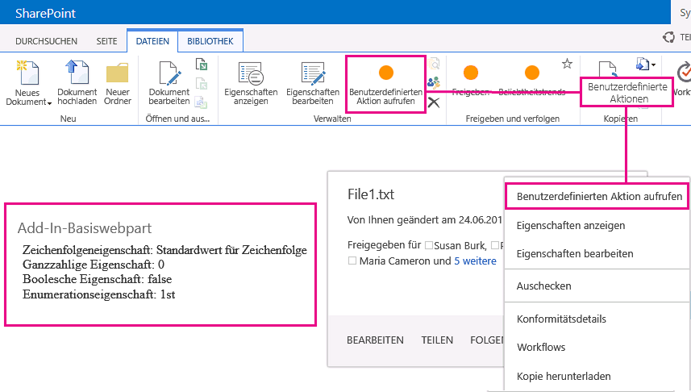

# UX-Design für SharePoint-Add-Ins

Als Entwickler sollten Sie der User Experience (UX), d. h. dem umfassenden Nutzungserlebnis des Benutzers, einen hohen Stellenwert beimessen, wenn Sie Add-Ins erstellen. Das Modell für SharePoint-Add-Ins bietet zahlreiche UX-Komponenten und Mechanismen, die Sie dabei unterstützen, ein optimales Nutzungserlebnis zu bieten. Die User Experience im Add-In-Modell ist außerdem so flexibel, dass Sie die Verfahren und Plattformen verwenden können, die sich am besten an die Anforderungen der Endbenutzer anpassen.

## Allgemeine Übersicht über Add-In-UX in SharePoint

Als Add-In-Entwickler müssen Sie die Architektur Ihres Add-Ins kennen. Nachdem Sie bestimmt haben, wie Ihr Add-In in Remote- und SharePoint-Plattformen verteilt werden soll, können Sie unter den verfügbaren Alternativen zum Erstellen Ihrer Add-In-UX eine Wahl treffen. Sie können sich folgende Fragen stellen:

- Was kann ich verwenden, wenn ich ein in der Cloud gehostetes Add-In erstelle?

- Was kann ich verwenden, wenn ich ein in SharePoint gehostetes Add-In erstelle? Weitere Informationen finden Sie unter [Auswählen von Mustern für die Entwicklung und das Hosten Ihres SharePoint-Add-Ins](choose-patterns-for-developing-and-hosting-your-sharepoint-add-in.md).

- Wie kann ich meine UX mit dem Hostweb verbinden? Weitere Informationen finden Sie unter [Hostwebsites, Add-In-Websites und SharePoint-Komponenten in SharePoint](host-webs-add-in-webs-and-sharepoint-components-in-sharepoint.md).

Das folgende Diagramm zeigt die wichtigsten Szenarios und Optionen, die beim Entwerfen der Add-In-UX berücksichtigt werden sollten.

*Abbildung 1. Wichtigste Szenarios und Optionen für die Add-In-UX*

 
Bei der Wahl Ihres Entwurfs sollten Sie grundsätzlich überlegen, welche Teile Ihres Add-Ins in SharePoint gehostet werden und welche nicht. Sie sollten außerdem überlegen, wie Ihr Add-In mit der Hostwebsite interagiert.

## Add-In-UX-Szenarios für in der Cloud gehostete Add-Ins

Angenommen, Sie bestimmen, dass ein Teil Ihrer User Experience nicht in SharePoint gehostet werden soll. Bei diesen Szenarien wird davon ausgegangen, dass Ihre Endbenutzer zwischen einer SharePoint-Website und dem in der Cloud gehosteten Add-In hin und her wechseln. Sie können die auf der Plattform verfügbaren Verfahren und Tools verwenden, jedoch bietet SharePoint ebenfalls Ressourcen, damit Sie eine nahtlose Erfahrung für Ihre Benutzer entwerfen können.

Die folgenden UX-Ressourcen sind für in der Cloud gehostete Add-Ins in SharePoint verfügbar:

- **Chromsteuerelement:** Das Chromsteuerelement ermöglicht es Ihnen, die Navigationskopfzeile einer bestimmten SharePoint-Website in Ihrem Add-In zu verwenden, ohne eine Serverbibliothek, eine bestimmte Technologie oder ein bestimmtes Tool registrieren zu müssen. Wenn Sie diese Funktion verwenden möchten, müssen Sie eine SharePoint-JavaScript-Bibliothek über standardmäßige `<script>`-Tags registrieren. Mit einem HTML-**Div**-Element können Sie einen Platzhalter bereitstellen und das Steuerelement mit den verfügbaren Optionen weiter anpassen. Das Steuerelement übernimmt die Darstellung der angegebenen SharePoint-Website. Weitere Informationen finden Sie unter [Verwenden des Client-Chromsteuerelements in SharePoint-Add-Ins](use-the-client-chrome-control-in-sharepoint-add-ins.md).

- **Stylesheet:** Sie können in Ihrer SharePoint-Add-In auf das Stylesheet einer SharePoint-Website verweisen und es zum Formatieren Ihrer Webseiten nutzen, indem Sie die verfügbaren Klassen verwenden. Wenn die Endbenutzer das Design der SharePoint-Website ändern, kann Ihr Add-In außerdem die neuen Formate übernehmen, ohne dass der Verweis in Ihrem Add-In geändert werden muss. Weitere Informationen finden Sie unter [Verwenden des Stylesheets einer SharePoint-Website in Add-Ins für SharePoint](use-a-sharepoint-website-s-style-sheet-in-sharepoint-add-ins.md).
     
Abbildung 2 zeigt die Ressourcen im Modell für SharePoint-Add-Ins für in der Cloud gehostete Add-Ins.

*Abbildung 2. Add-In-UX Ressourcen für in der Cloud gehostete Add-Ins*

## Add-In-UX-Szenarien für von SharePoint gehostete Add-Ins

Wenn Ihr Add-In in SharePoint gehostet wird, ist es weniger wahrscheinlich, dass sich die User Experience stark ändert, wenn Benutzer zwischen der Hostwebsite und der Add-In-Website hin und her wechseln. Wenn das Add-In bereitgestellt wird, übernimmt die Add-In-Website das Stylesheet und Design der Hostwebsite. Sie können das Chromsteuerelement und das Stylesheet in einem in SharePoint gehosteten Add-In weiterhin verwenden, der signifikanteste Unterschied bei in der Cloud gehosteten Szenarien besteht jedoch in der Verfügbarkeit der Add-In-Vorlage.

Die folgenden UX-Ressourcen sind für von SharePoint gehostete Add-Ins verfügbar:

- **Add-In-Vorlage:** Die Add-In-Vorlage umfasst die **app.master**-Masterpage. Dies ist die Standardoption beim Erstellen eines Add-In-Webs.

Von SharePoint gehostete Add-Ins profitieren auch von in SharePoint vorhandenen Ressourcen und Technologien, z. B. Menüband, Webpart-Infrastruktur und clientseitiges Rendering.

## Szenarien für das Herstellen einer Verbindung zwischen Add-In-UX und Hostweb

Einige Verwendungsfälle für Ihr Add-In können innerhalb der Hostwebsite ausgelöst werden. SharePoint bietet zwei Möglichkeiten zum Öffnen Ihres Add-Ins über eine Dokumentbibliothek oder Liste, zusätzlich zu den Möglichkeiten, einen Teil der Add-In-UX innerhalb von Seiten anzuzeigen, die in SharePoint gehostet sind.

Die folgenden UX-Ressourcen sind verfügbar, um Ihre Add-In-UX mit dem Hostweb zu verbinden:

- **Benutzerdefinierte Aktionen**: Sie können benutzerdefinierte Aktionen verwenden, um die Hostweb-UX mit Ihrem Add-In zu verbinden. Es gibt zwei Arten von benutzerdefinierten Aktionen: Menüband oder ECB. Eine benutzerdefinierte Aktion kann Parameter, wie z. B. die Liste oder ein Element, auf dem er aufgerufen wurde, zu einer remoten Seite senden. Weitere Informationen finden Sie unter [Erstellen benutzerdefinierter Aktionen zur Bereitstellung mit SharePoint-Add-Ins](create-custom-actions-to-deploy-with-sharepoint-add-ins.md).   
 
- **Add-In-Parts:** Sie können einen Teil der User Experience Ihres Add-Ins mithilfe von Add-In-Parts der Hostwebsite hinzufügen. Das Add-In-Part ist bei der Bereitstellung des Add-Ins im Webpartkatalog auf der Hostwebsite verfügbar. Benutzer können das Add-In-Part einer Seite hinzufügen, indem sie das Steuerelement zum **Hinzufügen von Webparts** verwenden. Weitere Informationen finden Sie unter [Erstellen von Add-In-Webparts zur Installation mit Ihrem SharePoint-Add-In](create-add-in-parts-to-install-with-your-sharepoint-add-in.md).
    
Abbildung 3 zeigt die Ressourcen im Modell für SharePoint-Add-Ins zum Verbinden der Add-In-UX mit dem Hostweb.

*Abbildung 3. Add-In-UX-Ressourcen für das Hostweb*

## Siehe auch

-  [Entwerfen von SharePoint-Add-Ins](design-sharepoint-add-ins.md)
-  [SharePoint-Add-Ins](sharepoint-add-ins.md)
-  [Drei Ansätze, um Entwurfsentscheidungen für SharePoint-Add-Ins zu treffen](three-ways-to-think-about-design-options-for-sharepoint-add-ins.md)
-  [Kritische Aspekte der Architektur und der Entwicklungslandschaft für SharePoint-Add-Ins](important-aspects-of-the-sharepoint-add-in-architecture-and-development-landscap.md)
-  [Hostwebs, Add-In-Webs und SharePoint-Komponenten in SharePoint](host-webs-add-in-webs-and-sharepoint-components-in-sharepoint.md)
-  [Designrichtlinien für die Benutzerfreundlichkeit von Add-Ins für SharePoint](sharepoint-add-ins-ux-design-guidelines.md)
-  [Erstellen von UX-Komponenten in SharePoint](create-ux-components-in-sharepoint.md)
-  [Verwenden des Stylesheets einer SharePoint-Website in SharePoint-Add-Ins](use-a-sharepoint-website-s-style-sheet-in-sharepoint-add-ins.md)
-  [Verwenden des Client-Chromsteuerelements in SharePoint-Add-Ins](use-the-client-chrome-control-in-sharepoint-add-ins.md)
-  [Erstellen von Add-In-Webparts zur Installation mit Ihrem SharePoint-Add-In](create-add-in-parts-to-install-with-your-sharepoint-add-in.md)
-  [Erstellen benutzerdefinierter Aktionen zur Bereitstellung mit SharePoint-Add-Ins](create-custom-actions-to-deploy-with-sharepoint-add-ins.md)
    
 

