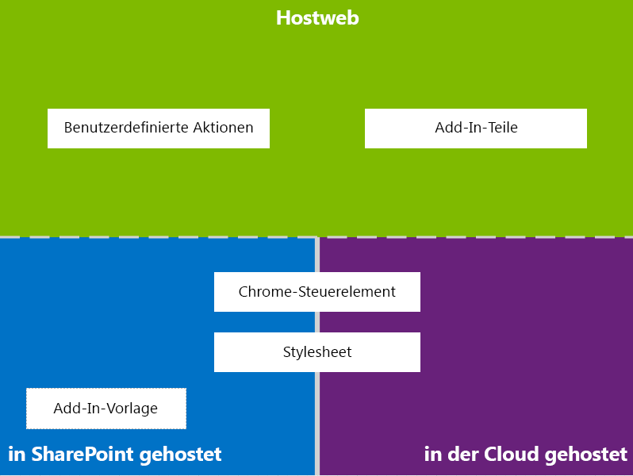
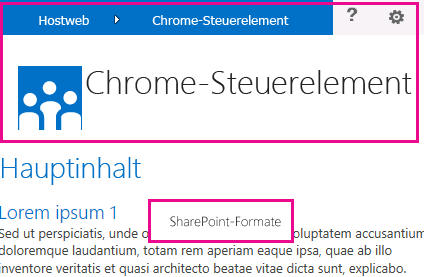

# UX-Design für SharePoint-Add-InsUX design for SharePoint Add-ins

Als Entwickler sollten Sie der User Experience (UX), d. h. dem umfassenden Nutzungserlebnis des Benutzers, einen hohen Stellenwert beimessen, wenn Sie Add-Ins erstellen. Das Modell für SharePoint-Add-Ins bietet zahlreiche UX-Komponenten und Mechanismen, die Sie dabei unterstützen, ein optimales Nutzungserlebnis zu bieten. Die User Experience im Add-In-Modell ist außerdem so flexibel, dass Sie die Verfahren und Plattformen verwenden können, die sich am besten an die Anforderungen der Endbenutzer anpassen.As a developer, you should always give high priority to the user experience (UX) when you are creating add-ins. The model for SharePoint Add-ins offers many UX components and mechanisms that help you build a great user experience. The user experience in the add-in model is also flexible enough to let you use the techniques and platforms that best adapt to the needs of end users.

## Allgemeine Übersicht über Add-In-UX in SharePointHigh-level overview of add-in UX in SharePoint

Als Add-In-Entwickler müssen Sie die Architektur Ihres Add-Ins kennen. Nachdem Sie bestimmt haben, wie Ihr Add-In in Remote- und SharePoint-Plattformen verteilt werden soll, können Sie unter den verfügbaren Alternativen zum Erstellen Ihrer Add-In-UX eine Wahl treffen. Sie können sich folgende Fragen stellen:As the add-in developer, you have to know the architecture of your add-in. After you determine how your add-in will be distributed in remote and SharePoint platforms, you can decide among the available alternatives for building your add-in UX. You might ask yourself the following questions:

- Was kann ich verwenden, wenn ich ein in der Cloud gehostetes Add-In erstelle?What can I use if I am creating a cloud-hosted add-in?

- Was kann ich verwenden, wenn ich ein in SharePoint gehostetes Add-In erstelle?What can I use if I am creating a cloud-hosted add-in? Weitere Informationen finden Sie unter [Auswählen von Mustern für die Entwicklung und das Hosten Ihres SharePoint-Add-Ins](choose-patterns-for-developing-and-hosting-your-sharepoint-add-in.md).For more detailed information about the hosting options of SharePoint Add-ins, see  [Choose patterns for developing and hosting your SharePoint Add-in](choose-patterns-for-developing-and-hosting-your-sharepoint-add-in.md).

- Wie kann ich meine UX mit dem Hostweb verbinden?How can I connect my UX to the host web? For more information, see Host webs, add-in webs, and SharePoint components. Weitere Informationen finden Sie unter [Hostwebsites, Add-In-Websites und SharePoint-Komponenten in SharePoint](host-webs-add-in-webs-and-sharepoint-components-in-sharepoint.md).How can I connect my UX to the host web? For more information, see  [Host webs, add-in webs, and SharePoint components in SharePoint](host-webs-add-in-webs-and-sharepoint-components-in-sharepoint.md).

Das folgende Diagramm zeigt die wichtigsten Szenarios und Optionen, die beim Entwerfen der Add-In-UX berücksichtigt werden sollten.The following diagram shows the main scenarios and options to consider when you are designing your add-in UX.

*Abbildung 1. Wichtigste Szenarios und Optionen für die Add-In-UX**Figure 1. Add-in UX main scenarios and options*

 
Bei der Wahl Ihres Entwurfs sollten Sie grundsätzlich überlegen, welche Teile Ihres Add-Ins in SharePoint gehostet werden und welche nicht. Sie sollten außerdem überlegen, wie Ihr Add-In mit der Hostwebsite interagiert.In choosing your design, you should fundamentally consider which parts of your add-in are hosted in SharePoint and which are not. You should also consider how your add-in interacts with the host web.

## Add-In-UX-Szenarios für in der Cloud gehostete Add-InsAdd-in UX scenarios in cloud-hosted add-ins

Angenommen, Sie bestimmen, dass ein Teil Ihrer User Experience nicht in SharePoint gehostet werden soll. Bei diesen Szenarien wird davon ausgegangen, dass Ihre Endbenutzer zwischen einer SharePoint-Website und dem in der Cloud gehosteten Add-In hin und her wechseln. Sie können die auf der Plattform verfügbaren Verfahren und Tools verwenden, jedoch bietet SharePoint ebenfalls Ressourcen, damit Sie eine nahtlose Erfahrung für Ihre Benutzer entwerfen können.Suppose that you determine that some of your user experience is not hosted in SharePoint. In these scenarios, it is expected that your end users go back and forth between a SharePoint website and the cloud-hosted add-in. You can use the techniques and tools in the platform, but SharePoint also provides resources to help you design a smooth experience for users.

Die folgenden UX-Ressourcen sind für in der Cloud gehostete Add-Ins in SharePoint verfügbar:The following UX resources are available for cloud-hosted add-ins in SharePoint:

- **Chromsteuerelement:** Das Chromsteuerelement ermöglicht es Ihnen, die Navigationskopfzeile einer bestimmten SharePoint-Website in Ihrem Add-In zu verwenden, ohne eine Serverbibliothek, eine bestimmte Technologie oder ein bestimmtes Tool registrieren zu müssen.**Chrome control:** The chrome control enables you to use the navigation header of a specific SharePoint site in your add-in without needing to register a server library or use a specific technology or tool. Wenn Sie diese Funktion verwenden möchten, müssen Sie eine SharePoint-JavaScript-Bibliothek über standardmäßige `<script>`-Tags registrieren.To use this functionality, you must register a SharePoint JavaScript library through standard `<script>` tags. Mit einem HTML-**Div**-Element können Sie einen Platzhalter bereitstellen und das Steuerelement mit den verfügbaren Optionen weiter anpassen.You can provide a placeholder by using an HTML **div** element and further customize the control by using the available options. Das Steuerelement übernimmt die Darstellung der angegebenen SharePoint-Website.The control inherits its appearance from the specified SharePoint website. Weitere Informationen finden Sie unter [Verwenden des Client-Chromsteuerelements in SharePoint-Add-Ins](use-the-client-chrome-control-in-sharepoint-add-ins.md).For more information, see [Use the client chrome control in SharePoint Add-ins](use-the-client-chrome-control-in-sharepoint-add-ins.md).

- **Stylesheet:** Sie können in Ihrer SharePoint-Add-In auf das Stylesheet einer SharePoint-Website verweisen und es zum Formatieren Ihrer Webseiten nutzen, indem Sie die verfügbaren Klassen verwenden. Wenn die Endbenutzer das Design der SharePoint-Website ändern, kann Ihr Add-In außerdem die neuen Formate übernehmen, ohne dass der Verweis in Ihrem Add-In geändert werden muss. Weitere Informationen finden Sie unter [Verwenden des Stylesheets einer SharePoint-Website in Add-Ins für SharePoint](use-a-sharepoint-website-s-style-sheet-in-sharepoint-add-ins.md).**Stylesheet:** You can reference a SharePoint website's style sheet in your SharePoint Add-in and use it to style your webpages using the available classes. In addition, if the end users change the SharePoint website's theme, your add-in can adopt the new set of styles without modifying the reference in your add-in. For more information, see [Use a SharePoint website's style sheet in SharePoint Add-ins](use-a-sharepoint-website-s-style-sheet-in-sharepoint-add-ins.md).
     
Abbildung 2 zeigt die Ressourcen im Modell für SharePoint-Add-Ins für in der Cloud gehostete Add-Ins.Figure 2 shows the resources in the model for SharePoint Add-ins for cloud-hosted add-ins.

*Abbildung 2. Add-In-UX Ressourcen für in der Cloud gehostete Add-Ins**Figure 2. Add-in UX resources for cloud-hosted add-ins*

## Add-In-UX-Szenarien für von SharePoint gehostete Add-InsAdd-in UX scenarios in SharePoint-hosted add-ins

Wenn Ihr Add-In in SharePoint gehostet wird, ist es weniger wahrscheinlich, dass sich die User Experience stark ändert, wenn Benutzer zwischen der Hostwebsite und der Add-In-Website hin und her wechseln. Wenn das Add-In bereitgestellt wird, übernimmt die Add-In-Website das Stylesheet und Design der Hostwebsite. Sie können das Chromsteuerelement und das Stylesheet in einem in SharePoint gehosteten Add-In weiterhin verwenden, der signifikanteste Unterschied bei in der Cloud gehosteten Szenarien besteht jedoch in der Verfügbarkeit der Add-In-Vorlage.If your add-in is hosted in SharePoint, the user experience is less likely to change very much when users move back and forth between the host web and the add-in web. When the add-in is deployed, the add-in web takes the style sheet and theme from the host web. You can still use the chrome control and style sheet in a SharePoint-hosted add-in, but the most significant difference with cloud-hosted scenarios is the availability of the add-in template.

Die folgenden UX-Ressourcen sind für von SharePoint gehostete Add-Ins verfügbar:The following UX resource is available for SharePoint-hosted add-ins:

- **Add-In-Vorlage:** Die Add-In-Vorlage umfasst die **app.master**-Masterpage. Dies ist die Standardoption beim Erstellen eines Add-In-Webs.**Add-in template:** The add-in template includes the **app.master** masterpage. It is the default option when you create an add-in web.

Von SharePoint gehostete Add-Ins profitieren auch von in SharePoint vorhandenen Ressourcen und Technologien, z. B. Menüband, Webpart-Infrastruktur und clientseitiges Rendering.SharePoint-hosted add-ins also benefit themselves from existing resources and technologies in SharePoint such as the Ribbon, web part infrastructure and client-side rendering.

## Szenarien für das Herstellen einer Verbindung zwischen Add-In-UX und HostwebScenarios for connecting the add-in UX to the host web

Einige Verwendungsfälle für Ihr Add-In können innerhalb der Hostwebsite ausgelöst werden. SharePoint bietet zwei Möglichkeiten zum Öffnen Ihres Add-Ins über eine Dokumentbibliothek oder Liste, zusätzlich zu den Möglichkeiten, einen Teil der Add-In-UX innerhalb von Seiten anzuzeigen, die in SharePoint gehostet sind.Some of the use cases for your add-in can be triggered from within the host web. SharePoint provides ways to open your add-in from a document library or list in addition to ways to show some of your add-in UX within SharePoint-hosted pages.

Die folgenden UX-Ressourcen sind verfügbar, um Ihre Add-In-UX mit dem Hostweb zu verbinden:The following UX resources are available to connect your add-in UX to the host web:

- **Benutzerdefinierte Aktionen**: Sie können benutzerdefinierte Aktionen verwenden, um die Hostweb-UX mit Ihrem Add-In zu verbinden.**Custom actions**: You can use custom actions to connect the host web UX with your add-in. Es gibt zwei Arten von benutzerdefinierten Aktionen: Menüband oder ECB.There are two types of custom actions: Ribbon or ECB. Eine benutzerdefinierte Aktion kann Parameter, wie z. B. die Liste oder ein Element, auf dem er aufgerufen wurde, zu einer remoten Seite senden.A custom action can send parameters such as the list or item on which it was invoked to a remote page. Weitere Informationen finden Sie unter [Erstellen benutzerdefinierter Aktionen zur Bereitstellung mit SharePoint-Add-Ins](create-custom-actions-to-deploy-with-sharepoint-add-ins.md).For more information, see [Create custom actions to deploy with SharePoint Add-ins](create-custom-actions-to-deploy-with-sharepoint-add-ins.md).   
 
- **Add-In-Parts:** Sie können einen Teil der User Experience Ihres Add-Ins mithilfe von Add-In-Parts der Hostwebsite hinzufügen. Das Add-In-Part ist bei der Bereitstellung des Add-Ins im Webpartkatalog auf der Hostwebsite verfügbar. Benutzer können das Add-In-Part einer Seite hinzufügen, indem sie das Steuerelement zum **Hinzufügen von Webparts** verwenden. Weitere Informationen finden Sie unter [Erstellen von Add-In-Webparts zur Installation mit Ihrem SharePoint-Add-In](create-add-in-parts-to-install-with-your-sharepoint-add-in.md).**Add-in parts:** You can include some of your add-in user experience in the host web by using add-in parts. The add-in part is available in the Web Part gallery in the host web when you deploy the add-in. Users can add the add-in part to a page by using the **Web Part Adder** control. For more information, see [Create add-in parts to install with your SharePoint Add-in](create-add-in-parts-to-install-with-your-sharepoint-add-in.md).
    
Abbildung 3 zeigt die Ressourcen im Modell für SharePoint-Add-Ins zum Verbinden der Add-In-UX mit dem Hostweb.Figure 3 shows the resources in the model for SharePoint Add-ins to connect your add-in UX to the host web.

*Abbildung 3. Add-In-UX-Ressourcen für das Hostweb**Figure 3. Add-in UX resources for the host web*

## Zusätzliche RessourcenAdditional resources

-  [Entwerfen von SharePoint-Add-InsDesign SharePoint Add-ins](design-sharepoint-add-ins.md)
-  [SharePoint-Add-InsSharePoint Add-ins](sharepoint-add-ins.md)
-  [Drei Ansätze, um Entwurfsentscheidungen für SharePoint-Add-Ins zu treffenThree ways to think about design options for SharePoint Add-ins](three-ways-to-think-about-design-options-for-sharepoint-add-ins.md)
-  [Kritische Aspekte der Architektur und der Entwicklungslandschaft für SharePoint-Add-InsImportant aspects of the SharePoint Add-in architecture and development landscape](important-aspects-of-the-sharepoint-add-in-architecture-and-development-landscap.md)
-  [Hostwebs, Add-In-Webs und SharePoint-Komponenten in SharePointHost webs, add-in webs, and SharePoint components in SharePoint](host-webs-add-in-webs-and-sharepoint-components-in-sharepoint.md)
-  [Designrichtlinien für die Benutzerfreundlichkeit von Add-Ins für SharePointSharePoint Add-ins UX design guidelines](sharepoint-add-ins-ux-design-guidelines.md)
-  [Erstellen von UX-Komponenten in SharePointCreate UX components in SharePoint](create-ux-components-in-sharepoint.md)
-  [Verwenden des Stylesheets einer SharePoint-Website in SharePoint-Add-InsUse a SharePoint website's style sheet in SharePoint Add-ins](use-a-sharepoint-website-s-style-sheet-in-sharepoint-add-ins.md)
-  [Verwenden des Client-Chromsteuerelements in SharePoint-Add-InsUse the client chrome control in SharePoint Add-ins](use-the-client-chrome-control-in-sharepoint-add-ins.md)
-  [Erstellen von Add-In-Webparts zur Installation mit Ihrem SharePoint-Add-InCreate add-in parts to install with your SharePoint Add-in](create-add-in-parts-to-install-with-your-sharepoint-add-in.md)
-  [Erstellen benutzerdefinierter Aktionen zur Bereitstellung mit SharePoint-Add-InsCreate custom actions to deploy with SharePoint Add-ins](create-custom-actions-to-deploy-with-sharepoint-add-ins.md)
    
 

