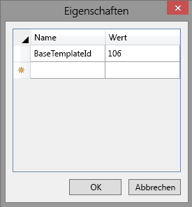

# <a name="work-with-host-web-data-from-javascript-in-the-add-in-web"></a>Arbeiten mit Hostwebdaten aus JavaScript im Add-In-Web

Dies ist der elfte einer Reihe von Artikeln über die Grundlagen der Entwicklung von von SharePoint gehosteten SharePoint-Add-Ins. Machen Sie sich zunächst mit [SharePoint-Add-Ins](sharepoint-add-ins.md) und den vorherigen Artikeln dieser Reihe vertraut, die Sie unter [Erste Schritte beim Erstellen von von SharePoint gehosteten SharePoint-Add-Ins](get-started-creating-sharepoint-hosted-sharepoint-add-ins.md#Nextsteps) finden. 
    
> [!NOTE]
> Wenn Sie unsere Artikelreihe zum Thema SharePoint-gehostete Add-Ins durchgearbeitet haben, haben Sie bereits eine Visual Studio-Lösung, die Sie für diesen Artikel verwenden können. Sie können auch das Repository unter [SharePoint_SP-hosted_Add-Ins_Tutorials](https://github.com/OfficeDev/SharePoint_SP-hosted_Add-Ins_Tutorials) herunterladen und die Datei „BeforeHostWebData.sln“ öffnen.

Standardmäßig verhindert SharePoint, dass JavaScript in einem Add-In Zugriff auf Daten auf anderen SharePoint-Websites in der Farm erhält. So wird verhindert, dass ein Skript in einem nicht autorisierten Add-In Zugriff auf vertrauliche Daten erhält. Aber oft muss ein Add-In auf das Hostweb oder andere Websites innerhalb derselben Websitesammlung wie das Hostweb zugreifen können. 

Die Aktivierung dieses Szenarios in Ihrem Add-In besteht aus zwei Teilen:

- Sie fordern die Berechtigung für das Hostweb in der Add-In-Manifestdatei des Add-Ins an. Der Benutzer, der das Add-In installiert, wird aufgefordert, diese Berechtigung zu gewähren, und das Add-In kann nicht installiert werden, wenn dies nicht der Fall ist.

- Statt ein **SP.ClientContext**-Objekt zu verwenden, um JSOM-Aufrufe an das Hostweb durchzuführen, verwenden Sie ein **SP.AppContextSite**-Objekt. Dieses Objekt ermöglicht dem Add-In das Abrufen eines Kontextobjekts für andere Websites als das Add-In-Web, jedoch nur für Websites innerhalb derselben Websitesammlung. (Es gibt auch eine Möglichkeit zum Zugriff auf beliebige Websites im SharePoint Online-Abonnement [oder einer lokalen SharePoint-Webanwendung], aber das ist ein erweitertes Thema.)

In diesem Artikel verwenden Sie JSOM, um nach den Einführungen zu suchen, die noch nicht gestartet wurden, und sicherzustellen, dass diese in einem Kalender im Hostweb geplant werden.

## <a name="prepare-the-host-web-calendar"></a>Vorbereiten des Hostwebkalenders

Öffnen Sie das Hostweb – Ihre Developer-Testwebsite – und stellen Sie sicher, dass dort ein Kalender namens **Planung für Orientierung für Mitarbeiter** mit einem einzigen Ereignis vorhanden ist: **Orientierung Cassie Hicks**. Wenn dies nicht der Fall ist, führen Sie die folgenden Schritte aus:

1. Wählen Sie auf der Startseite der Website **Websiteinhalte** > **Add-In hinzufügen** > **Kalender** aus.    
 
2. Geben Sie im Dialogfeld **Kalender hinzufügen** für **Name** den Wert **Planung für Orientierung für Mitarbeiter** ein, und wählen Sie dann **Erstellen** aus.
    
3. Wenn der Kalender geöffnet wird, setzen Sie den Cursor auf ein beliebiges Datum, bis der Link **Hinzufügen** auf dem Datum angezeigt wird, und wählen Sie dann **Hinzufügen** aus.   
 
4. Geben Sie im Dialogfeld **Planung für Orientierung für Mitarbeiter - neues Element** für **Titel** den Text **Orientierung Cassi Hicks** ein. Behalten Sie für die anderen Felder die Standardwerte bei, und wählen Sie **Speichern** aus.
    
   Der Kalender sollte ähnlich wie im folgenden Beispiel aussehen:
    
   *Abbildung 1. Benutzerdefinierter Kalender*

   


## <a name="create-the-javascript-and-a-button-to-invoke-it"></a>Erstellen des JavaScript und einer Schaltfläche zum Aufrufen

1. Öffnen Sie die Datei Add-in.js im Knoten **Skripts** im **Projektmappen-Explorer**. 
    
2. Fügen Sie die folgenden Deklarationen unterhalb der Deklaration von `completedItems` ein. 
    
    ```
     var notStartedItems;
     var calendarList;
     var scheduledItems;
    ```
    
   - `notStartedItems` verweist auf die Elemente in der Liste **Neue Mitarbeiter in Seattle**, deren **Orientierungsphase** auf **Nicht gestartet** festgelegt ist.
   - `calendarList` verweist auf den Kalender, den Sie im Hostweb erstellt haben.
   - `scheduledItems` verweist auf eine Sammlung von Elementen im Kalender.

3. Wenn ein SharePoint-Add-In ausgeführt wird, ruft SharePoint seine Startseite auf und fügt einige Abfrageparameter zur Startseiten-URL hinzu. Einer davon ist `SPHostUrl`, der natürlich die URL des Hostwebs darstellt. Das Add-In benötigt diese Informationen, um Aufrufe für Hostwebdaten durchzuführen. Fügen Sie deshalb im oberen Bereich der Datei Add-in.js direkt unter der Variablendeklaration für `scheduledItems` die folgende Zeile hinzu. 

    ```
      var hostWebURL = decodeURIComponent(getQueryStringParameter("SPHostUrl"));
    ```

   Beachten Sie Folgendes zu diesem Code:
    
   - `getQueryStringParameter` ist eine Hilfsfunktion, die Sie im nächsten Schritt erstellen.
   - `decodeUriComponent` ist eine Standard-JavaScript-Funktion, die die URI-Codierung umkehrt, die SharePoint an den Abfrageparametern durchführt. So wird z. B. ein codierter Schrägstrich %2F wieder in ein / geändert.

4. Fügen Sie den folgenden Code am Ende der Datei ein. Diese Funktion kann zum Lesen der Abfrageparameter verwendet werden. 
    
    ```
      // Utility functions

    function getQueryStringParameter(paramToRetrieve) {
         var params = document.URL.split("?")[1].split("&amp;");
         var strParams = "";
         for (var i = 0; i < params.length; i = i + 1) {
             var singleParam = params[i].split("=");
             if (singleParam[0] == paramToRetrieve) {
                 return singleParam[1];
            }
         }
     }
    ```

5. Fügen Sie die folgende Funktion an eine beliebige Stelle über dem Abschnitt zu Fehlerrückrufen zur Datei Add-in.js hinzu. 

    ```
      function ensureOrientationScheduling() {

        var camlQuery = new SP.CamlQuery();
        camlQuery.set_viewXml(
            '<View><Query><Where><Eq>' +
                '<FieldRef Name=\'OrientationStage\'/><Value Type=\'Choice\'>Not started</Value>' +
            '</Eq></Where></Query></View>');
        notStartedItems = employeeList.getItems(camlQuery);

        clientContext.load(notStartedItems);
        clientContext.executeQueryAsync(getScheduledOrientations, onGetNotStartedItemsFail);
        return false;
    }
    ```

   Beachten Sie Folgendes zu diesem Code:

   - Dies ist fast identisch mit der Listenabfragemethode, die die **Abgeschlossen**-Elemente abruft, mit dem Unterschied, dass sie statt der **Abgeschlossen**-Elemente die **Nicht gestartet**-Elemente abruft. Wir sind nur an den Elementen **Nicht gestartet** interessiert, da das Skript die vereinfachende Annahme macht, dass eine Einführung, die nach der Phase **Nicht gestartet** liegt, bereits geplant sein muss.
   - Sie erstellen die beiden Rückrufmethoden im **executeQueryAsync**-Aufruf in späteren Schritten.

6. Fügen Sie die folgende Funktion zur Datei Add-in.js direkt unterhalb der vorherigen Funktion hinzu. Beachten Sie, dass sie das Objekt **hostWebContext** verwendet, um die Liste zu identifizieren, die abgefragt wird.

    ```
      function getScheduledOrientations() {

        var hostWebContext = new SP.AppContextSite(clientContext, hostWebURL);
        calendarList = hostWebContext.get_web().get_lists().getByTitle('Employee Orientation Schedule');

        var camlQuery = new SP.CamlQuery();
        scheduledItems = calendarList.getItems(camlQuery);

        clientContext.load(scheduledItems);
        clientContext.executeQueryAsync(scheduleAsNeeded, onGetScheduledItemsFail);
    }
    ```

   > [!NOTE]
   > Beachten Sie, dass der CAML-Abfrage kein Abfragemarkup hinzugefügt wird. Dadurch, dass keine tatsächliche Abfrage im Abfrageobjekt vorhanden ist, wird sichergestellt, dass *alle* Listenelemente abgerufen werden. Wenn die Liste sehr groß ist, führt dies möglicherweise dazu, dass die Anforderung an den Server inakzeptabel lange dauert. In diesem Fall brauchen wir eine andere Möglichkeit, unser Ziel zu erreichen. Aber in dieser Beispielsituation mit einer sehr kleinen Liste (und Kalenderlisten sind fast immer klein) trägt das Abrufen der gesamten Liste, damit wir sie auf dem Client durchlaufen können, tatsächlich dazu bei, die Anzahl der Aufrufe an den Server zu minimieren, d. h. Aufrufe von **executeQueryAsync**.

7. Fügen Sie die folgende Funktion zur Datei hinzu. 

    ```
      function scheduleAsNeeded() {

        var unscheduledItems = false;
        var dayOfMonth = '10';

        var listItemEnumerator = notStartedItems.getEnumerator();

        while (listItemEnumerator.moveNext()) {
            var alreadyScheduled = false;
            var notStartedItem = listItemEnumerator.get_current();

            var calendarEventEnumerator = scheduledItems.getEnumerator();
            while (calendarEventEnumerator.moveNext()) {
                var scheduledEvent = calendarEventEnumerator.get_current();

                 // The SP.ListItem.get_item('field_name ') method gets the value of the specified field.
                if (scheduledEvent.get_item('Title').indexOf(notStartedItem.get_item('Title')) > -1) {
                    alreadyScheduled = true;
                    break;
                }
            }
            if (alreadyScheduled === false) {

                 // SP.ListItemCreationInformation holds the information the SharePoint server needs to
                 // create a list item
                var calendarItem = new SP.ListItemCreationInformation();

                 // The some_list .additem method tells the server which list to add 
                 // the item to.
                var itemToCreate = calendarList.addItem(calendarItem);

                 // The some_item .set_item method sets the value of the specified field.
                itemToCreate.set_item('Title', 'Orient ' + notStartedItem.get_item('Title'));

                 // The EventDate and EndDate are the start and stop times of an event.
                itemToCreate.set_item('EventDate', '2015-06-' + dayOfMonth + 'T21:00:00Z');
                itemToCreate.set_item('EndDate', '2015-06-' + dayOfMonth + 'T23:00:00Z');
                dayOfMonth++;

                 // The update method tells the server to commit the changes to the SharePoint database.
                itemToCreate.update();
                unscheduledItems = true;
            }
        }
        if (unscheduledItems) {
            calendarList.update();
            clientContext.executeQueryAsync(onScheduleItemsSuccess, onScheduleItemsFail);
        }
    }
    ```

   Beachten Sie Folgendes zu diesem Code:

   - Die Methode überprüft, ob der Titel eines **Nicht gestartet**-Elements in der Liste **Neue Mitarbeiter in Seattle**, der dem Namen eines Mitarbeiters entspricht, im Titel eines Ereignisses im Kalender **Planung für Orientierung für Mitarbeiter** enthalten ist. Es wird also vereinfachend angenommen, dass alle Einträge im Kalender mit dem vollständigen Mitarbeiternamen im Ereignistitel erstellt werden.

   - Wenn keins der Ereignisse, die bereits im Kalender sind, einem Element **Nicht gestartet** entspricht, erstellt das Skript ein Kalenderelement für das Element **Nicht gestartet**.

   - JSOM verwendet ein einfaches **ListItemCreationInformation**-Objekt anstelle eines **SPListItem**-Objekts, um die Nutzlast zu minimieren, die an den SharePoint-Server gesendet wird.

   - Die zwei **DateTime**-Felder des neuen Kalenderereignisses werden auf Tage in dem Monat festgelegt, in dem dieser Artikel geschrieben wurde: `2015-06`. *Ändern Sie diese Daten auf einen Tag im aktuellen Monat und Jahr,  damit Sie nicht im Kalender zurückblättern müssen, um die Elemente zu finden.* 

   - Wenn festgestellt wird, dass Element **Nicht gestartet** ungeplant sind, wird das erste für den 10. des Monats geplant. Jedes weitere ungeplante Element wird für einen Tag später geplant. Die vereinfachende Annahme ist hier, dass nicht so viele vorhanden sind, dass einige an unmöglichen Tagen des Monats wie „32" geplant werden.

   - Dieser Code verwendet hauptsächlich Standard-JavaScript. Es gibt Kommentare für die Zeilen, in denen SharePoint JSOM verwendet wird.

8. Fügen Sie den folgenden Erfolgshandler hinzu, der aufgerufen wird, wenn die zuvor ungeplanten Elemente zum Kalender hinzugefügt werden.
    
    ```
      function onScheduleItemsSuccess() {
        alert('There was one or more unscheduled orientations and they have been added to the '
                  + 'Employee Orientation Schedule calendar.');
    }
    ```

9. Fügen Sie dem Abschnitt mit den Fehlerrückrufen die folgenden Fehlerfunktionen hinzu.
    
    ```
      function onGetNotStartedItemsFail(sender, args) {
        alert('Unable to get the not-started items. Error:' 
            + args.get_message() + '\n' + args.get_stackTrace());
    }

    function onGetScheduledItemsFail(sender, args) {
        alert('Unable to get scheduled items from host web. Error:' 
            + args.get_message() + '\n' + args.get_stackTrace());
    }

    function onScheduleItemsFail(sender, args) {
        alert('Unable to schedule items on host web calendar. Error:' 
            + args.get_message() + '\n' + args.get_stackTrace());
    }
    ```

10. Öffnen Sie die Datei default.aspx, und suchen Sie nach dem **asp:Content**-Element mit der ID **PlaceHolderMain**.

11. Fügen Sie das folgende Markup direkt unterhalb der Schaltfläche `purgeCompletedItems` hinzu.
    
    ```HTML
      <p><asp:Button runat="server" OnClientClick="return ensureOrientationScheduling()" 
      ID="ensureorientationschedulingbutton" Text="Ensure all items are on the Calendar" /></p>
    ```

12. Erstellen Sie das Projekt in Visual Studio neu.

13. Damit Sie beim Testen des Add-Ins die **Orientierungsphase** von Listenelementen nicht so häufig manuell auf **Nicht gestartet** festlegen müssen, öffnen Sie die Datei elements.xml für die Listeninstanz **NewEmployeesInSeattle** (nicht für die Listenvorlage **NewEmployeeOrientation**), und stellen Sie sicher, dass der Wert **Orientierungsphase** für mindestens drei der **Row**-Elemente *einschließlich der Zeile für Cassie Hicks* den Wert **Nicht gestartet** hat. Da dies der Standardwert ist, besteht die einfachste Möglichkeit hierfür darin, sicherzustellen, dass kein **Field**-Element für `OrientationStage` für die drei (oder mehr) Zeilen vorhanden ist.
    
   Im Folgenden sehen Sie ein Beispiel, wie das Element **Rows** aussehen sollte.
 
    ```
      <Rows>
        <Row>
          <Field Name="Title">Tom Higginbotham</Field>
          <Field Name="Division">Manufacturing</Field>
          <Field Name="OrientationStage">Completed</Field>
        </Row>
        <Row>
          <Field Name="Title">Satomi Hayakawa</Field>
        </Row>
        <Row>
          <Field Name="Title">Cassi Hicks</Field>
        </Row>
        <Row>
          <Field Name="Title">Lertchai Treetawatchaiwong</Field>
        </Row>
      </Rows>
    ```


## <a name="specify-the-permissions-to-the-host-web-that-the-add-in-needs"></a>Angeben der Berechtigungen für das Host-Web, die das Add-In benötigt

Da das Add-In automatisch über Vollzugriff auf das eigene Add-In-Web verfügt, mussten Sie bisher nicht angeben, welche Berechtigungen es benötigt. Sie müssen jedoch spezifisch Berechtigungen für das Hostweb anfordern, um mit dessen Daten interagieren zu können. Das Add-In „Mitarbeitereinführung" benötigt die Berechtigung, Elemente zum Kalender im Hostweb hinzufügen zu können. 

1. Öffnen Sie im **Projektmappen-Explorer** die Datei appmanifest.xml. 

2. Öffnen Sie im Manifest-Designer die Registerkarte **Berechtigungen**.

3. Wählen Sie in der obersten Reihe der Spalte **Bereich** die Option **Liste** aus der Dropdownliste aus.

4. Wählen Sie in der Spalte **Berechtigung** die Option **Verwalten** aus.

5. Wenn die Spalte **Eigenschaften** leer gelassen wird, fragt das Add-In nach einer Schreibberechtigung für alle Listen im Hostweb. Es empfiehlt sich, Add-Ins auf die Berechtigungen zu beschränken, die sie benötigen. Es gibt im Add-In-Manifest keine Möglichkeit, Berechtigungen auf eine bestimmte Listeninstanz zu beschränken, aber es ist möglich, das Add-In nur auf Listeninstanzen zu beschränken, die auf einer bestimmten Basislistenvorlage basieren. Die Basislistenvorlage eines Kalenders ist **Events**, deren numerische ID 106 ist.
    
   Klicken Sie auf die Zelle **Eigenschaften** derselben Zeile, damit die Schaltfläche **Bearbeiten** in der Zelle angezeigt wird. Die Berechtigungsliste sollte jetzt in etwa wie folgt aussehen.

   *Abbildung 2. Berechtigungsliste mit angezeigter Schaltfläche „Bearbeiten“*

   

6. Wählen Sie **Bearbeiten** aus, um das Dialogfeld **Eigenschaften** zu öffnen.

7. Legen Sie **Name** auf **BaseTemplateId** und **Wert** auf **106** fest. Das Dialogfeld sollte nun wie folgt aussehen.
    
   *Abbildung 3. Dialogfeld „Eigenschaften“ für Listenberechtigungen*

   

8. Wählen Sie **OK** aus. Die Registerkarte **Berechtigungen** sollte jetzt etwa wie folgt aussehen.

   *Abbildung 4. Registerkarte „Berechtigungen“ des Add-In-Manifest-Designers in Visual Studio*

   

## <a name="run-and-test-the-add-in"></a>Ausführen und Testen des Add-Ins

1. Stellen Sie sicher, dass der Hostwebkalender wie zuvor in diesem Artikel beschrieben vorbereitet ist. Er sollte ein einziges Ereignis namens **Orientierung Cassi Hicks** enthalten.

2. Aktivieren Sie Popupfenster im Browser, den Visual Studio beim Debuggen verwendet.

3. Verwenden Sie die F5-TASTE, um Ihr Add-In bereitzustellen und auszuführen. Visual Studio führt eine temporäre Installation des Add-Ins auf Ihrer SharePoint-Testwebsite durch und führt das Add-In sofort aus. 

4. Das Berechtigungszustimmungsformular wird geöffnet, in dem Sie dem Add-In die erforderliche Berechtigung erteilen können. Es gibt eine Dropdownliste auf der Seite, in der Sie aus allen Kalendern im Hostweb auswählen können. Wählen Sie **Planung für Orientierung für Mitarbeiter** und dann **Vertrauen** aus.
    
   *Abbildung 5. SharePoint-Add-In-Zustimmungsaufforderung*

   

5. Wenn die Startseite des Add-Ins vollständig geladen wurde, wählen Sie die Schaltfläche **Sicherstellen, dass Elemente eingeplant sind** aus.
    
   *Abbildung 6. Startseite „Orientierung für Mitarbeiter“ mit neuer Schaltfläche*

   

6. Wenn eine der Fehlerrückruffunktionen ausgeführt wird, wird die Fehlermeldungswarnung angezeigt, die Ihre Rückruffunktionen erstellen. Andernfalls wird die Erfolgsmeldung angezeigt, die vom letzten Erfolgsrückruf erstellt wurde: *Es war mindestens eine ungeplante Einführung vorhanden und diese wurde dem Kalender für die Mitarbeitereinführungsplanung hinzugefügt.*

7. Wechseln Sie zum Kalender **Planung für Orientierung für Mitarbeiter** im Hostweb. Wählen Sie beispielsweise den Breadcrumblink zur Startseite Ihrer Entwicklerwebsite und dann **Websiteinhalte** aus. Wählen Sie die Kachel **Planung für Orientierung für Mitarbeiter** aus (nicht die Kachel **Orientierung für Mitarbeiter**).

   Der Kalender sollte etwa wie folgt aussehen. Das Skript hat festgestellt, dass bereits ein Ereignis für Cassi Hicks vorhanden war, und deshalb kein zweites für sie erstellt. Es hat Ereignisse für die anderen beiden Mitarbeiter erstellt, deren Einführung den Status **Nicht gestartet** aufwies. Es hat auch kein Ereignis für den Mitarbeiter erstellt, deren Einführung über den Status **Nicht gestartet** hinaus war.

   *Abbildung 7. Kalender nach dem Hinzufügen zweier neuer Ereignisse*

   

8. Stellen Sie sicher, dass Sie die zwei neuen Ereignisse aus dem Kalender löschen, bevor Sie erneut **Sicherstellen, dass Elemente eingeplant sind** auswählen.

9. Schließen Sie zum Beenden der Debugsitzung das Browserfenster, oder beenden Sie das Debuggen in Visual Studio. Wann immer Sie F5 drücken, zieht Visual Studio die bisherige Version des Add-Ins zurück und installiert die jeweils neueste Version.

10. Da Sie mit diesem Add-In und dieser Visual Studio-Lösung auch in anderen Artikeln arbeiten werden, empfiehlt es sich, das Add-In ein letztes Mal zurückzuziehen, sobald Sie eine Weile nicht mehr an ihm arbeiten werden. Klicken Sie im **Projektmappen-Explorer** mit der rechten Maustaste auf das Projekt, und wählen Sie die Option **Zurückziehen** aus.

## <a name="next-steps"></a>Nächste Schritte
<a name="Nextsteps"> </a>

Führen Sie erweiterte Aufgaben in von SharePoint gehosteten SharePoint-Add-Ins durch: 

-  [Entwerfen von SharePoint-Add-Ins](design-sharepoint-add-ins.md)
-  [Entwickeln von SharePoint-Add-ins](develop-sharepoint-add-ins.md)
-  [Veröffentlichen von SharePoint-Add-Ins](publish-sharepoint-add-ins.md)
-  [Tools und Umgebungen für die Entwicklung von SharePoint-Add-Ins](tools-and-environments-for-developing-sharepoint-add-ins.md)
    
 

