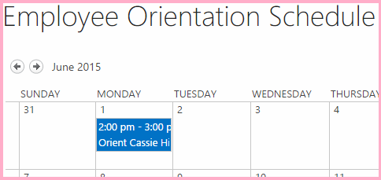
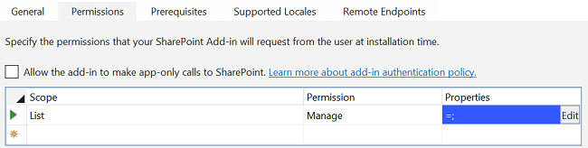
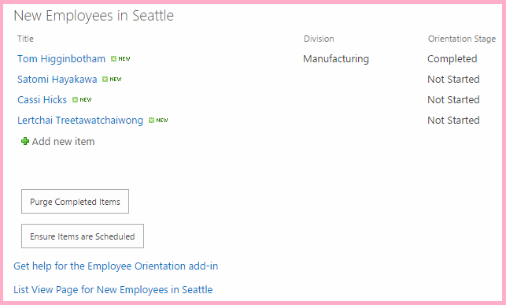

# <a name="work-with-host-web-data-from-javascript-in-the-add-in-web"></a><span data-ttu-id="d7644-101">Arbeiten mit Hostweb-Daten von JavaScript im Web-Add-In</span><span class="sxs-lookup"><span data-stu-id="d7644-101">Work with host web data from JavaScript in the add-in web</span></span>
<span data-ttu-id="d7644-102">Verwenden Sie das SharePoint-JavaScript-Objektmodell (JSOM) zum Arbeiten mit SharePoint-Daten im Hostweb von JavaScript auf Seiten im Add-In-Web.</span><span class="sxs-lookup"><span data-stu-id="d7644-102">Use the SharePoint JavaScript  object model (JSOM) to work with SharePoint data in the host web from ecmascriptshort on pages in the add-in web.</span></span>
 

 <span data-ttu-id="d7644-p101">**Hinweis** Der Name „Apps für SharePoint“ wird in „SharePoint-Add-Ins“ geändert. Während des Übergangszeitraums wird in der Dokumentation und der Benutzeroberfläche einiger SharePoint-Produkte und Visual Studio-Tools möglicherweise weiterhin der Begriff „Apps für SharePoint“ verwendet. Weitere Informationen finden Sie unter [Neuer Name für Office- und SharePoint-Apps](new-name-for-apps-for-sharepoint#bk_newname).</span><span class="sxs-lookup"><span data-stu-id="d7644-p101">The name "apps for SharePoint" is changing to "SharePoint Add-ins". During the transition, the documentation and the UI of some SharePoint products and Visual Studio tools might still use the term "apps for SharePoint". For details, see [New name for apps for Office and SharePoint](new-name-for-apps-for-sharepoint#bk_newname).</span></span>
 

<span data-ttu-id="d7644-p102">Dies ist der elfte in einer Reihe von Artikeln über die Grundlagen der Entwicklung von von SharePoint gehosteten SharePoint-Add-Ins. Machen Sie sich zunächst mit [SharePoint-Add-Ins](sharepoint-add-ins) und den vorherigen Artikeln in dieser Reihe vertraut:</span><span class="sxs-lookup"><span data-stu-id="d7644-p102">This is the 11th in  a series of articles about the basics of developing SharePoint-hosted spappplural. You should first be familiar with SharePoint Add-ins and the previous articles in this series:</span></span>
 

-  [<span data-ttu-id="d7644-108">Erste Schritte beim Erstellen von von SharePoint gehosteten SharePoint-Add-Ins</span><span class="sxs-lookup"><span data-stu-id="d7644-108">Get started creating SharePoint-hosted SharePoint Add-ins</span></span>](get-started-creating-sharepoint-hosted-sharepoint-add-ins)
    
 
-  [<span data-ttu-id="d7644-109">Bereitstellung und Installation eines von SharePoint gehosteten SharePoint-Add-Ins</span><span class="sxs-lookup"><span data-stu-id="d7644-109">Deploy and install a SharePoint-hosted SharePoint Add-in</span></span>](deploy-and-install-a-sharepoint-hosted-sharepoint-add-in)
    
 
-  [<span data-ttu-id="d7644-110">Hinzufügen von benutzerdefinierten Spalten zu einem von SharePoint gehosteten SharePoint-Add-In</span><span class="sxs-lookup"><span data-stu-id="d7644-110">Add custom columns to a SharePoint-hostedSharePoint Add-in</span></span>](add-custom-columns-to-a-sharepoint-hostedsharepoint-add-in)
    
 
-  [<span data-ttu-id="d7644-111">Hinzufügen eines benutzerdefinierten Inhaltstyps zu einem von SharePoint gehosteten SharePoint-Add-In</span><span class="sxs-lookup"><span data-stu-id="d7644-111">Add a custom content type to a SharePoint-hostedSharePoint Add-in</span></span>](add-a-custom-content-type-to-a-sharepoint-hostedsharepoint-add-in)
    
 
-  [<span data-ttu-id="d7644-112">Hinzufügen eines Webparts zu einer Seite in einem von SharePoint gehosteten SharePoint-Add-In</span><span class="sxs-lookup"><span data-stu-id="d7644-112">Add a Web Part to a page in a SharePoint-hosted SharePoint Add-in</span></span>](add-a-web-part-to-a-page-in-a-sharepoint-hosted-sharepoint-add-in)
    
 
-  [<span data-ttu-id="d7644-113">Hinzufügen eines Workflows zu einem von SharePoint gehosteten SharePoint-Add-In</span><span class="sxs-lookup"><span data-stu-id="d7644-113">Add a workflow to a SharePoint-hosted SharePoint Add-in</span></span>](add-a-workflow-to-a-sharepoint-hosted-sharepoint-add-in)
    
 
-  [<span data-ttu-id="d7644-114">Hinzufügen einer benutzerdefinierten Seite und Formatvorlage zu einem von SharePoint gehosteten SharePoint-Add-In</span><span class="sxs-lookup"><span data-stu-id="d7644-114">Add a custom page and style to a SharePoint-hosted SharePoint Add-in</span></span>](add-a-custom-page-and-style-to-a-sharepoint-hosted-sharepoint-add-in)
    
 
-  [<span data-ttu-id="d7644-115">Hinzufügen des benutzerdefinierten clientseitigen Renderings für ein von SharePoint gehostetes SharePoint-Add-In</span><span class="sxs-lookup"><span data-stu-id="d7644-115">Add custom client-side rendering to a SharePoint-hosted SharePoint Add-in</span></span>](add-custom-client-side-rendering-to-a-sharepoint-hosted-sharepoint-add-in)
    
 
-  [<span data-ttu-id="d7644-116">Erstellen einer benutzerdefinierten Menübandschaltfläche im Hostweb eines SharePoint-Add-Ins</span><span class="sxs-lookup"><span data-stu-id="d7644-116">Create a custom ribbon button in the host web of a SharePoint Add-in</span></span>](create-a-custom-ribbon-button-in-the-host-web-of-a-sharepoint-add-in)
    
 
-  [<span data-ttu-id="d7644-117">Verwenden von SharePoint-JavaScript-APIs zum Arbeiten mit SharePoint-Daten</span><span class="sxs-lookup"><span data-stu-id="d7644-117">Use the SharePoint JavaScript APIs to work with SharePoint data</span></span>](use-the-sharepoint-javascript-apis-to-work-with-sharepoint-data)
    
 

 <span data-ttu-id="d7644-p103">**Hinweis** Wenn Sie diese Reihe zu von SharePoint gehosteten Add-Ins durchgearbeitet haben, haben Sie eine Visual Studio-Projektmappe, die Sie verwenden können, um mit diesem Thema fortzufahren. Sie können außerdem das Repository unter  [SharePoint_SP-Hosted_Add-Ins_Tutorials](https://github.com/OfficeDev/SharePoint_SP-hosted_Add-Ins_Tutorials) herunterladen und die Datei „BeforeHostWebData.sln“ öffnen.</span><span class="sxs-lookup"><span data-stu-id="d7644-p103">**Note** If you have been working through this series about SharePoint-hosted add-ins, then you have a Visual Studio solution that you can use to continue with this topic. You can also download the repository at  [SharePoint_SP-hosted_Add-Ins_Tutorials](https://github.com/OfficeDev/SharePoint_SP-hosted_Add-Ins_Tutorials) and open the BeforeHostWebData.sln file.</span></span>
 

<span data-ttu-id="d7644-p104">Standardmäßig verhindert SharePoint, dass JavaScript in einem Add-In Zugriff auf Daten auf anderen SharePoint-Websites in der Farm erhält. So wird verhindert, dass Skript in einem nicht autorisierten Add-In Zugriff auf vertrauliche Daten erhält. Aber oft muss ein Add-In auf das Hostweb oder andere Websites innerhalb derselben Websitesammlung wie das Hostweb zugreifen können. Es gibt zwei Teile, um dieses Szenario in Ihrem Add-In zu aktivieren:</span><span class="sxs-lookup"><span data-stu-id="d7644-p104">By default, SharePoint is designed to prevent JavaScript in an add-in from getting access to data in other SharePoint websites on the farm. This prevents script in a rogue add-in from getting access to sensitive data. But often an add-in needs to have access to the host web, or to other websites within the same site collection as the host web. There are two parts to enabling this scenario in your add-in:</span></span>
 

- <span data-ttu-id="d7644-p105">Sie fordern die Berechtigung für das Hostweb in der Add-In-Manifestdatei für das Add-In an. Der Benutzer, der das Add-In installiert, wird aufgefordert, diese Berechtigung zu gewähren, und das Add-In kann nicht installiert werden, wenn dies nicht der Fall ist.</span><span class="sxs-lookup"><span data-stu-id="d7644-p105">You request permission to the host web in the add-in manifest file of your add-in. The user who installs the add-in is prompted to grant this permission, and the add-in cannot be installed if user does not.</span></span>
    
 
- <span data-ttu-id="d7644-p106">Statt ein **SP.ClientContext**-Objekt zu verwenden, um JSOM-Aufrufe an das Hostweb durchzuführen, verwenden Sie ein **SP.AppContextSite**-Objekt. Dieses Objekt ermöglicht dem Add-In das Abrufen von Kontextobjekten für andere Websites als das Add-In-Web, jedoch nur für Websites innerhalb derselben Websitesammlung. (Es gibt auch eine Möglichkeit zum Zugriff auf beliebige Websites im SharePoint Online-Abonnement [oder der lokalen SharePoint-Webanwendung], aber das ist ein erweitertes Thema.)</span><span class="sxs-lookup"><span data-stu-id="d7644-p106">Instead of using an **SP.ClientContext** object to make JSOM calls to the host web, you use a **SP.AppContextSite** object. This object enables the add-in to get a context objects for websites other than the add-in web, but only for websites within the same site collection. (There is also a way to get access to any website in the SharePoint Online subscription [or on-premise SharePoint Web Application], but that is an advanced subject.)</span></span>
    
 
 <span data-ttu-id="d7644-129">In diesem Artikel verwenden Sie JSOM, um nach den Einführungen zu suchen, die noch nicht gestartet wurden, und sicherzustellen, dass diese in einem Kalender im Hostweb geplant werden.</span><span class="sxs-lookup"><span data-stu-id="d7644-129">In this article you use the JSOM to find the orientations that are not yet started and ensure that they are scheduled on a calendar in the host web.</span></span>
 

## <a name="prepare-the-host-web-calendar"></a><span data-ttu-id="d7644-130">Vorbereiten des Hostwebkalenders</span><span class="sxs-lookup"><span data-stu-id="d7644-130">Prepare the host web calendar</span></span>

<span data-ttu-id="d7644-p107">Öffnen Sie das Hostweb - Ihre Developer-Testwebsite - und stellen Sie sicher, dass dort ein Kalender mit dem Namen „Mitarbeitereinführungsplanung" mit einem einzigen Ereignis vorhanden ist: „Einführung Katrin Hicks". Wenn nicht der Fall ist, führen Sie die folgenden Schritte aus:</span><span class="sxs-lookup"><span data-stu-id="d7644-p107">Open the host web -- your developer test website -- and verify that there is a calendar on it named "Employee Orientation Schedule" and it has a single event on it: "Orient Cassie Hicks". If there isn't, take the following steps:</span></span>
 

 

1. <span data-ttu-id="d7644-133">Wählen Sie auf der Startseite der Website **Websiteinhalte** > **Add-In hinzufügen** > **Kalender** aus.</span><span class="sxs-lookup"><span data-stu-id="d7644-133">From the home page of the site, choose **Site Contents** > **add an add-in** > **Calendar**.</span></span>
    
 
2. <span data-ttu-id="d7644-134">Geben Sie im Dialogfeld **Kalender hinzufügen** „Planung für Orientierung für Mitarbeiter“ in das Feld **Name** ein, und wählen Sie dann **Erstellen** aus.</span><span class="sxs-lookup"><span data-stu-id="d7644-134">On the **Adding Calendar** dialog, typeEmployee Orientation Schedule for the **Name**, and then choose **Create**.</span></span>
    
 
3. <span data-ttu-id="d7644-135">Wenn der Kalender geöffnet wird, setzen Sie den Cursor auf ein beliebiges Datum, bis der Link **Hinzufügen** auf dem Datum angezeigt wird, und klicken Sie dann auf **Hinzufügen**.</span><span class="sxs-lookup"><span data-stu-id="d7644-135">When the calendar opens, put the cursor on any date until the **Add** link appears on the date, and then click **Add**.</span></span> 
    
 
4. <span data-ttu-id="d7644-p108">Geben Sie im Dialogfeld **Planung für Orientierung für Mitarbeiter - neues Element** den Text „Orientierung Cassi Hicks“ in das Feld **Titel** ein. Behalten Sie für die anderen Felder die Standardwerte bei, und klicken Sie auf **Speichern**.</span><span class="sxs-lookup"><span data-stu-id="d7644-p108">On the **Employee Orientation Schedule - New Item** dialog, typeOrient Cassi Hicks for the **Title**. Leave the other fields at their defaults and click **Save**.</span></span>
    
    <span data-ttu-id="d7644-138">Der Kalender sollte ähnlich wie im folgenden Beispiel aussehen:</span><span class="sxs-lookup"><span data-stu-id="d7644-138">The calendar should look similar to the following:</span></span>
    

    <span data-ttu-id="d7644-139">**Benutzerdefinierter Kalender**</span><span class="sxs-lookup"><span data-stu-id="d7644-139">**Custom calendar**</span></span>

 

  
 

 

 

## <a name="create-the-javascript-and-a-button-to-invoke-it"></a><span data-ttu-id="d7644-141">Erstellen des JavaScript-Codes und einer Schaltfläche, um ihn aufzurufen</span><span class="sxs-lookup"><span data-stu-id="d7644-141">Create the JavaScript and a button to invoke it</span></span>


1. <span data-ttu-id="d7644-142">Öffnen Sie die Datei „Add-in.js“ im Knoten **Skripts** im **Projektmappen-Explorer**.</span><span class="sxs-lookup"><span data-stu-id="d7644-142">Open the Add-in.js file in the **Scripts** node in **Solution Explorer**.</span></span> 
    
 
2. <span data-ttu-id="d7644-143">Fügen Sie die folgenden Deklarationen unterhalb der Deklaration von `completedItems` ein.</span><span class="sxs-lookup"><span data-stu-id="d7644-143">Add the following declarations below the declaration for  `completedItems`.</span></span> 
    
      - <span data-ttu-id="d7644-144">`notStartedItems` verweist auf die Elemente in der Liste **Neue Mitarbeiter in Seattle**, deren **Orientierugsphase** noch **nicht gestartet** wurde.</span><span class="sxs-lookup"><span data-stu-id="d7644-144">The  `notStartedItems` references the items on the **New Employees in Seattle** list whose **Orientation Stage** is **Not Started**.</span></span>
    
 
  - <span data-ttu-id="d7644-145">`calendarList` verweist auf den Kalender, den Sie im Hostweb erstellt haben.</span><span class="sxs-lookup"><span data-stu-id="d7644-145">The  `calendarList` references the calendar you created on the host web.</span></span>
    
 
  - <span data-ttu-id="d7644-146">`scheduledItems` verweist auf eine Auflistung der Elemente im Kalender.</span><span class="sxs-lookup"><span data-stu-id="d7644-146">The  `scheduledItems` references a collection of items on the calendar.</span></span>
    
 

```
  var notStartedItems;
var calendarList;
var scheduledItems;
```

3. <span data-ttu-id="d7644-p109">Wenn ein SharePoint-Add-In ausgeführt wird, ruft SharePoint seine Startseite auf und fügt einige Abfrageparameter zur Startseiten-URL hinzu. Einer davon ist  `SPHostUrl`, der natürlich die URL des Hostwebs darstellt. Das Add-In benötigt diese Informationen, um Aufrufe für Hostwebdaten durchzuführen. Fügen Sie deshalb im oberen Bereich der Datei Add-in.js direkt unter der Variablendeklaration für  `scheduledItems` die folgende Zeile hinzu. Beachten Sie Folgendes zu diesem Code:</span><span class="sxs-lookup"><span data-stu-id="d7644-p109">When a SharePoint Add-in is run, SharePoint calls its start page and adds some query parameters to the start page URL. One of these is  `SPHostUrl` which is, of course, the URL of the host web. The add-in needs this information in order to make calls to host web data, so near the top of the Add-in.js file, just under the variable declaration for `scheduledItems`, add the following line. Note the following about this code:</span></span>
    
      - <span data-ttu-id="d7644-151">`getQueryStringParameter` ist eine Hilfsfunktion, die Sie im nächsten Schritt erstellen.</span><span class="sxs-lookup"><span data-stu-id="d7644-151">The  `getQueryStringParameter` is a utility function that you create in the next step.</span></span>
    
 
  - <span data-ttu-id="d7644-152">`decodeUriComponent` ist eine Standard-JavaScript-Funktion, die die URI-Codierung umkehrt, die SharePoint an den Abfrageparametern durchführt. So wird z. B. ein codierter Schrägstrich %2f wieder in ein / geändert.</span><span class="sxs-lookup"><span data-stu-id="d7644-152">The  `decodeUriComponent` is a standard JavaScript function that reverses the URI-encoding that SharePoint does on the query parameters; for example, an encoded forward slash, "%2F", is changed back to a "/".</span></span>
    
 

```
  var hostWebURL = decodeURIComponent(getQueryStringParameter("SPHostUrl"));
```

4. <span data-ttu-id="d7644-p110">Fügen Sie den folgenden Code am Ende der Datei ein. Diese Funktion kann zum Lesen der Abfrageparameter verwendet werden.</span><span class="sxs-lookup"><span data-stu-id="d7644-p110">Add the following code to the bottom of the file. This function can be used to read the query parameters.</span></span> 
    
```
  // Utility functions

function getQueryStringParameter(paramToRetrieve) {
     var params = document.URL.split("?")[1].split("&amp;");
     var strParams = "";
     for (var i = 0; i < params.length; i = i + 1) {
         var singleParam = params[i].split("=");
         if (singleParam[0] == paramToRetrieve) {
             return singleParam[1];
        }
     }
 }
```

5. <span data-ttu-id="d7644-p111">Fügen Sie die folgende Funktion an einer beliebigen Stelle oberhalb des Fehlerrückrufabschnitts in die Datei „Add-in.js“ ein. Beachten Sie Folgendes zu diesem Code:</span><span class="sxs-lookup"><span data-stu-id="d7644-p111">Add the following function to the Add-in.js file somewhere above the failure callbacks section. Note the following about this code:</span></span>
    
      - <span data-ttu-id="d7644-p112">Dies ist fast identisch mit der Listenabfragemethode, die die Elemente **Abgeschlossen** Elemente abruft, mit der Ausnahme, dass sie die Elemente abruft, die **Nicht gestartet** sind, statt der, die **Abgeschlossenen** sind. Wir sind nur an den Elementen **Nicht gestartet** interessiert, da das Skript die vereinfachende Annahme macht, dass eine Einführung, die nach der Phase **Nicht gestartet** liegt, bereits geplant sein muss.</span><span class="sxs-lookup"><span data-stu-id="d7644-p112">This is nearly identical to the list query method that gets the **Completed** items, except that it gets items that are **Not Started** instead of those that are **Completed**. We are interested in only the **Not Started** items because the script makes the simplifying assumption that if an orientation is past the **Not Started** stage, then it must already be scheduled.</span></span>
    
 
  -  <span data-ttu-id="d7644-159">Sie erstellen die beiden Rückrufmethoden im **executeQueryAsync**-Aufruf in späteren Schritten.</span><span class="sxs-lookup"><span data-stu-id="d7644-159">You create the two callback methods in the **executeQueryAsync** call in later steps.</span></span>
    
 

```
  function ensureOrientationScheduling() {

    var camlQuery = new SP.CamlQuery();
    camlQuery.set_viewXml(
        '<View><Query><Where><Eq>' +
            '<FieldRef Name=\'OrientationStage\'/><Value Type=\'Choice\'>Not started</Value>' +
        '</Eq></Where></Query></View>');
    notStartedItems = employeeList.getItems(camlQuery);
  
    clientContext.load(notStartedItems);
    clientContext.executeQueryAsync(getScheduledOrientations, onGetNotStartedItemsFail);
    return false;
}
```

6. <span data-ttu-id="d7644-p113">Fügen Sie die folgende Funktion zur Datei Add-in.js direkt unterhalb der vorherigen Funktion hinzu. Beachten Sie, dass sie das Objekt  `hostWebContext` verwendet, um die Liste zu identifizieren, die abgefragt wird.</span><span class="sxs-lookup"><span data-stu-id="d7644-p113">Add the following function to the Add-in.js file just below the preceding function. Notice that it uses the  `hostWebContext` object to identify the list that is queried.</span></span>
    
     <span data-ttu-id="d7644-p114">**Hinweis** Beachten Sie, dass der CAML-Abfrage kein Abfragemarkup hinzugefügt wird. Da keine tatsächliche Abfrage im Abfrageobjekt vorhanden ist, wird sichergestellt, dass  *alle*  Listenzeiten abgerufen werden. Wenn die Liste sehr groß ist, führt dies möglicherweise dazu, dass die Anforderung an den Server inakzeptabel lange dauert. In diesem Fall brauchen wir eine andere Möglichkeit, unser Ziel zu erreichen. Aber in dieser Beispielsituation mit einer sehr kleinen Liste (und Kalenderlisten sind fast immer klein) trägt das Abrufen der gesamten Liste, damit wir sie auf dem Client durchlaufen können, tatsächlich dazu bei, die Anzahl der Aufrufe an den Server zu minimieren, d. h. Aufrufe von **executeQueryAsync**.</span><span class="sxs-lookup"><span data-stu-id="d7644-p114">**Note** Notice that no query markup is added to the CAML query. The effect of having no actual query in the query object is to ensure that  *all*  of the list times will be retrieved. If the list was very large this might cause the request to the server to be unacceptably long-running. In that case, we'd want to find some other way of accomplishing our goal. But in this sample situation with a very small list (and calendar lists are almost always small), getting the whole list, so that we can iterate through it on the client will actually help us minimize the number of calls to the server; that is, calls of **executeQueryAsync**.</span></span>

```
  function getScheduledOrientations() {

    var hostWebContext = new SP.AppContextSite(clientContext, hostWebURL);
    calendarList = hostWebContext.get_web().get_lists().getByTitle('Employee Orientation Schedule');

    var camlQuery = new SP.CamlQuery();
    scheduledItems = calendarList.getItems(camlQuery);

    clientContext.load(scheduledItems);
    clientContext.executeQueryAsync(scheduleAsNeeded, onGetScheduledItemsFail);
}
```

7. <span data-ttu-id="d7644-p115">Fügen Sie der Datei die folgende Funktion hinzu. Beachten Sie Folgendes zu diesem Code:</span><span class="sxs-lookup"><span data-stu-id="d7644-p115">Add the following function to the file. Note the following about this code:</span></span>
    
      - <span data-ttu-id="d7644-p116">Die Methode überprüft, ob der Titel eines **nicht gestarteten** Elements in der Liste **Neue Mitarbeiter In Seattle**, das dem Namen eines Mitarbeiters entspricht, im Titel eines Ereignisses im Kalender **Mitarbeitereinführungsplanung** enthalten ist. Es ist also die vereinfachte Annahme vorhanden, dass alle Einträge im Kalender mit dem vollständigen Mitarbeiternamen im Ereignistitel erstellt werden.</span><span class="sxs-lookup"><span data-stu-id="d7644-p116">The method checks to see if the title of a **Not Started** item in the **New Employees In Seattle** list, which is the name of an employee, is contained in the title of an event in the **Employee Orientation Schedule** calendar. So there is a simplifying assumption that all entries in the calendar are created with the full employee name in the event title.</span></span>
    
 
  - <span data-ttu-id="d7644-171">Wenn keins der Ereignisse, die bereits im Kalender sind, einem Element **Nicht gestartet** entspricht, erstellt das Skript ein Kalenderelement für das Element **Nicht gestartet**.</span><span class="sxs-lookup"><span data-stu-id="d7644-171">If none of the events that are already on the calendar matches a **Not Started** item, the script creates a calendar item for the **Not Started** item.</span></span>
    
 
  - <span data-ttu-id="d7644-172">JSOM verwendet ein einfaches **ListItemCreationInformation**-Objekt anstelle eines **SPListItem**-Objekts, um die Nutzlast zu minimieren, die an den SharePoint-Server gesendet wird.</span><span class="sxs-lookup"><span data-stu-id="d7644-172">JSOM uses a light weight **ListItemCreationInformation** object instead of a **SPListItem** object to minimize the size of the payload that is sent to the SharePoint server.</span></span>
    
 
  - <span data-ttu-id="d7644-p117">Die zwei DateTime-Felder des neuen Kalenderereignisses werden auf die Tage in dem Monat festgelegt, an denen dieser Artikel geschrieben wurde:  `2015-06`.  *Ändern Sie diese Daten auf einen Tag im aktuellen Monat und Jahr, damit Sie nicht im Kalender zurückblättern müssen, um die Elemente zu finden.*</span><span class="sxs-lookup"><span data-stu-id="d7644-p117">The two DateTime fields of the new calendar event are set to days in the month when this article was written:  `2015-06`.  *Change these dates to a day in the current month and year, so you don't have to scroll back in your calendar to find the items.*</span></span> 
    
 
  - <span data-ttu-id="d7644-p118">Wenn festgestellt wird, dass Element **Nicht gestartet** ungeplant sind, wird das erste für den 10. des Monats geplant. Jedes weitere ungeplante Element wird für einen Tag später geplant. Die vereinfachende Annahme ist hier, dass nicht so viele vorhanden sind, dass einige an unmöglichen Tagen des Monats wie „32" geplant werden.</span><span class="sxs-lookup"><span data-stu-id="d7644-p118">If any **Not Started** items are found to be unscheduled, the first one will be scheduled for the 10th of the month. Each additional unscheduled item will be scheduled for a day later. The simplifying assumption is that there won't be so many that some are scheduled for impossible days of the month, such as "32".</span></span>
    
 
  - <span data-ttu-id="d7644-p119">Dieser Code verwendet hauptsächlich Standard-JavaScript. Es gibt Kommentare für die Zeilen, in denen SharePoint JSOM verwendet wird.</span><span class="sxs-lookup"><span data-stu-id="d7644-p119">Most of this code is standard JavaScript. There are comments for the lines that use SharePoint JSOM.</span></span>
    
 

```
  function scheduleAsNeeded() {

    var unscheduledItems = false;
    var dayOfMonth = '10';

    var listItemEnumerator = notStartedItems.getEnumerator();

    while (listItemEnumerator.moveNext()) {
        var alreadyScheduled = false;
        var notStartedItem = listItemEnumerator.get_current();

        var calendarEventEnumerator = scheduledItems.getEnumerator();
        while (calendarEventEnumerator.moveNext()) {
            var scheduledEvent = calendarEventEnumerator.get_current();

             // The SP.ListItem.get_item('field_name ') method gets the value of the specified field.
            if (scheduledEvent.get_item('Title').indexOf(notStartedItem.get_item('Title')) > -1) {
                alreadyScheduled = true;
                break;
            }
        }
        if (alreadyScheduled === false) {

             // SP.ListItemCreationInformation holds the information the SharePoint server needs to
             // create a list item
            var calendarItem = new SP.ListItemCreationInformation();

             // The some_list .additem method tells the server which list to add 
             // the item to.
            var itemToCreate = calendarList.addItem(calendarItem);

             // The some_item .set_item method sets the value of the specified field.
            itemToCreate.set_item('Title', 'Orient ' + notStartedItem.get_item('Title'));

             // The EventDate and EndDate are the start and stop times of an event.
            itemToCreate.set_item('EventDate', '2015-06-' + dayOfMonth + 'T21:00:00Z');
            itemToCreate.set_item('EndDate', '2015-06-' + dayOfMonth + 'T23:00:00Z');
            dayOfMonth++;

             // The update method tells the server to commit the changes to the SharePoint database.
            itemToCreate.update();
            unscheduledItems = true;
        }
    }
    if (unscheduledItems) {
        calendarList.update();
        clientContext.executeQueryAsync(onScheduleItemsSuccess, onScheduleItemsFail);
    }
}
```

8. <span data-ttu-id="d7644-180">Fügen Sie den folgenden Erfolgshandler hinzu, der aufgerufen wird, wenn die zuvor ungeplanten Elemente zum Kalender hinzugefügt werden.</span><span class="sxs-lookup"><span data-stu-id="d7644-180">Add the following success handler that is called when the previously unscheduled items are added to the calendar.</span></span>
    
```
  function onScheduleItemsSuccess() {
    alert('There was one or more unscheduled orientations and they have been added to the '
              + 'Employee Orientation Schedule calendar.');
}
```

9. <span data-ttu-id="d7644-181">Fügen Sie dem Abschnitt mit den Fehlerrückrufen die folgenden Fehlerfunktionen hinzu.</span><span class="sxs-lookup"><span data-stu-id="d7644-181">Add the following failure functions to the Failure callbacks section of the file.</span></span>
    
```
  function onGetNotStartedItemsFail(sender, args) {
    alert('Unable to get the not-started items. Error:' 
        + args.get_message() + '\n' + args.get_stackTrace());
}

function onGetScheduledItemsFail(sender, args) {
    alert('Unable to get scheduled items from host web. Error:' 
        + args.get_message() + '\n' + args.get_stackTrace());
}

function onScheduleItemsFail(sender, args) {
    alert('Unable to schedule items on host web calendar. Error:' 
        + args.get_message() + '\n' + args.get_stackTrace());
}
```

10. <span data-ttu-id="d7644-182">Öffnen Sie die Datei „default.aspx“, und suchen Sie nach dem **asp:Content**-Element mit der ID **PlaceHolderMain**.</span><span class="sxs-lookup"><span data-stu-id="d7644-182">Open the default.aspx file and find the **asp:Content** element with the ID **PlaceHolderMain**.</span></span>
    
 
11. <span data-ttu-id="d7644-183">Fügen Sie das folgende Markup direkt unter der `purgeCompletedItems`-Schaltfläche ein.</span><span class="sxs-lookup"><span data-stu-id="d7644-183">Add the following markup just below the  `purgeCompletedItems` button.</span></span>
    
```HTML
  <p><asp:Button runat="server" OnClientClick="return ensureOrientationScheduling()" 
  ID="ensureorientationschedulingbutton" Text="Ensure all items are on the Calendar" /></p>
```

12. <span data-ttu-id="d7644-184">Erstellen Sie das Projekt in Visual Studio neu.</span><span class="sxs-lookup"><span data-stu-id="d7644-184">Rebuild the project in Visual Studio.</span></span>
    
 
13. <span data-ttu-id="d7644-p120">Zum Minimieren der Notwendigkeit, die **Einführungsphase** von Listenelementen manuell auf „Nicht gestartet“ festzulegen, während das Add-In getestet wird, öffnen Sie die Datei „elements.xml“ für die Listeninstanz **NeueMitarbeiterInSeattle** (nicht für die elements.xml für die Listenvorlage **NeueMitarbeiterEinführung**) und stellen Sie sicher, dass der Wert für die Einführungsphase für mindestens drei der **Row**-Elemente, *einschließlich der Zeile für Cassie Hicks* den Wert „Nicht gestartet“ hat. Da dies der Standardwert ist, besteht die einfachste Möglichkeit hierfür darin, sicherzustellen, dass kein **Field**-Element für `OrientationStage` für die drei (oder mehr) Zeilen vorhanden ist.</span><span class="sxs-lookup"><span data-stu-id="d7644-p120">To minimize the need to manually set the **Orientation Stage** of list items toNot Started while testing the add-in, open the elements.xml file for the list instance **NewEmployeesInSeattle** (not the elements.xml for the list template **NewEmployeeOrientation**) and ensure that the Orientation Stage value for at least three of the **Row** elements, *including the row for Cassie Hicks*  will have the valueNot Started. Since that is the default value, the simplest way to do this is to ensure that there is no **Field** element for `OrientationStage` for the three (or more) rows.</span></span>
    
    <span data-ttu-id="d7644-187">Im Folgenden sehen Sie ein Beispiel, wie das Element **Rows** aussehen sollte.</span><span class="sxs-lookup"><span data-stu-id="d7644-187">The following is an example of how the **Rows** element should look.</span></span>
    


```
  <Rows>
  <Row>
    <Field Name="Title">Tom Higginbotham</Field>
    <Field Name="Division">Manufacturing</Field>
    <Field Name="OrientationStage">Completed</Field>
  </Row>
  <Row>
    <Field Name="Title">Satomi Hayakawa</Field>
  </Row>
  <Row>
    <Field Name="Title">Cassi Hicks</Field>
  </Row>
  <Row>
    <Field Name="Title">Lertchai Treetawatchaiwong</Field>
  </Row>
</Rows>
```


## <a name="specify-the-permissions-to-the-host-web-that-the-add-in-needs"></a><span data-ttu-id="d7644-188">Angeben der Berechtigungen für das Host-Web, die das Add-In benötigt</span><span class="sxs-lookup"><span data-stu-id="d7644-188">Specify the permissions to the host web that the add-in needs</span></span>

<span data-ttu-id="d7644-p121">Da das Add-In automatisch über Vollzugriff auf das eigene Add-In-Web verfügt, mussten Sie bisher nicht angeben, welche Berechtigungen es benötigt. Sie müssen jedoch spezifisch Berechtigungen für das Hostweb anfordern, um mit dessen Daten interagieren zu können. Das Add-In „Mitarbeitereinführung" benötigt die Berechtigung, Elemente zum Kalender im Hostweb hinzufügen zu können.</span><span class="sxs-lookup"><span data-stu-id="d7644-p121">Your add-in automatically has full control permission to its own add-in web, so until now you have not needed to specify what permissions it needs. But you must specifically request permissions to the host web to interact with its data. The Employee Orientation add-in needs permission to add items to the calendar in the host web.</span></span> 
 

 

1. <span data-ttu-id="d7644-192">Öffnen Sie im **Projektmappen-Explorer** die Datei „appmanifest.xml“.</span><span class="sxs-lookup"><span data-stu-id="d7644-192">From **Solution Explorer**, open the appmanifest.xml file.</span></span> 
    
 
2. <span data-ttu-id="d7644-193">Öffnen Sie im Manifest-Designer die Registerkarte **Berechtigungen**.</span><span class="sxs-lookup"><span data-stu-id="d7644-193">In the manifest designer, open the **Permissions** tab.</span></span>
    
 
3. <span data-ttu-id="d7644-194">Wählen Sie in der obersten Reihe der Spalte **Bereich** die Option **Liste** aus der Dropdownliste aus.</span><span class="sxs-lookup"><span data-stu-id="d7644-194">In the top row of the **Scope** column, choose **List** from the drop down.</span></span>
    
 
4. <span data-ttu-id="d7644-195">Wählen Sie in der Spalte **Berechtigung** die Option **Verwalten** aus.</span><span class="sxs-lookup"><span data-stu-id="d7644-195">In the **Permission** column, choose **Manage**.</span></span>
    
 
5. <span data-ttu-id="d7644-p122">Wenn die Spalte **Eigenschaften** leer gelassen wird, fragt das Add-In nach einer Schreibberechtigung für alle Listen im Hostweb. Es empfiehlt sich, Add-Ins auf die Berechtigungen zu beschränken, die sie benötigen. Es gibt im Add-In-Manifest keine Möglichkeit, Berechtigungen für eine bestimmte Listeninstanz zu beschränken, aber es ist möglich, das Add-In nur auf Listeninstanzen zu beschränken, die auf einer bestimmten Basislistenvorlage basieren. Die Basislistenvorlage eines Kalenders ist **Events**, deren numerische ID 106 ist.</span><span class="sxs-lookup"><span data-stu-id="d7644-p122">If the **Properties** column is left blank, then the add-in is asking for write permission to every list on the host web. It is a good practice to limit add-ins to only the permissions that they need. There isn't any way, in the add-in manifest, to limit permissions to a specific list instance, but it is possible to limit the add-in to only list instances that are built on a specific base list template. The base list template of a calendar is **Events** whose numeric ID is 106.</span></span>
    
    <span data-ttu-id="d7644-p123">Klicken Sie auf die Zelle **Eigenschaften** derselben Zeile, damit die Schaltfläche **Bearbeiten** in der Zelle angezeigt wird. Die Berechtigungsliste sollte nun etwa wie folgt aussehen:</span><span class="sxs-lookup"><span data-stu-id="d7644-p123">Click the **Properties** cell of the same row to make the **Edit** button appear in the cell. The permissions list should now look similar to the following:</span></span>
    

    <span data-ttu-id="d7644-202">**Berechtigungsliste mit angezeigter Schaltfläche „Bearbeiten“**</span><span class="sxs-lookup"><span data-stu-id="d7644-202">**Permission list with Edit button visible**</span></span>

 

  
 

 

 
6. <span data-ttu-id="d7644-204">Wählen Sie **Bearbeiten**, um das Dialogfeld **Eigenschaften** zu öffnen.</span><span class="sxs-lookup"><span data-stu-id="d7644-204">Choose **Edit** to open the **Properties** dialog.</span></span>
    
 
7. <span data-ttu-id="d7644-p124">Legen Sie **Name** auf „BasisVorlagenID“ und **Wert** auf 106 fest. Das Dialogfeld sollte nun wie folgt aussehen:</span><span class="sxs-lookup"><span data-stu-id="d7644-p124">Set **Name** toBaseTemplateID, set **Value** to106. The dialog should now look like the following:</span></span>
    
    <span data-ttu-id="d7644-207">**Dialogfeld „Eigenschaften“ für Listenberechtigungen**</span><span class="sxs-lookup"><span data-stu-id="d7644-207">**List permission properties dialog**</span></span>

 

  
 

    <span data-ttu-id="d7644-p125">Wählen Sie **OK** aus. Die Registerkarte **Berechtigungen** sollte jetzt etwa wie folgt aussehen:</span><span class="sxs-lookup"><span data-stu-id="d7644-p125">Choose **OK**. The **Permissions** tab should now look similar to the following:</span></span>
    

    <span data-ttu-id="d7644-211">**Registerkarte „Berechtigungen“ des Add-In-Manifest-Designers in Visual Studio**</span><span class="sxs-lookup"><span data-stu-id="d7644-211">**Permissions tab of add-in manifest designer in Visual Studio**</span></span>

 

  
 

 

 

## <a name="run-and-test-the-add-in"></a><span data-ttu-id="d7644-213">Ausführen und Testen des Add-Ins</span><span class="sxs-lookup"><span data-stu-id="d7644-213">Run and test the add-in</span></span>


 

 

1. <span data-ttu-id="d7644-p126">Stellen Sie sicher, dass der Hostwebkalender wie zuvor in diesem Artikel beschrieben vorbereitet ist. Er sollte ein einziges Ereignis namens „Einführung Cassi Hicks" enthalten.</span><span class="sxs-lookup"><span data-stu-id="d7644-p126">Be sure the host web calendar is prepared as described earlier in this article. It should have a single event, named "Orient Cassi Hicks".</span></span>
    
 
2. <span data-ttu-id="d7644-216">Aktivieren Sie Popups im Browser, den Visual Studio beim Debuggen verwendet.</span><span class="sxs-lookup"><span data-stu-id="d7644-216">Enable popups on the browser that Visual Studio uses when you debug.</span></span>
    
 
3. <span data-ttu-id="d7644-p127">Verwenden Sie die F5-TASTE, um Ihr Add-In bereitzustellen und auszuführen. Visual Studio führt eine temporäre Installation des Add-Ins auf Ihrer SharePoint-Testwebsite durch und führt das Add-In sofort aus.</span><span class="sxs-lookup"><span data-stu-id="d7644-p127">Use the F5 key to deploy and run your add-in. Visual Studio makes a temporary installation of the add-in on your test SharePoint site and immediately runs the add-in.</span></span> 
    
 
4. <span data-ttu-id="d7644-p128">Das Berechtigungszustimmungsformular wird geöffnet, in dem Sie dem Add-In die erforderliche Berechtigung gewähren können. Es gibt eine Dropdownliste auf der Seite, aus der Sie die Kalender im Hostweb auswählen können. Wählen Sie **Mitarbeitereinführungsplanung** und dann **Vertrauen** aus.</span><span class="sxs-lookup"><span data-stu-id="d7644-p128">The permission consent form opens where you can grant the add-in the permission it seeks. There is a drop down list on the page where you can choose from among all the calendars on the host web. Choose **Employee Orientation Schedule**, and then choose **Trust It**.</span></span>
    
    <span data-ttu-id="d7644-222">**SharePoint-Add-In-Zustimmungsaufforderung**</span><span class="sxs-lookup"><span data-stu-id="d7644-222">**SharePoint Add-in consent prompt**</span></span>

 

  
 

 

 
5. <span data-ttu-id="d7644-224">Wenn die Startseite des Add-Ins vollständig geladen wurde, wählen Sie die Schaltfläche **Sicherstellen, dass Elemente eingeplant sind** aus.</span><span class="sxs-lookup"><span data-stu-id="d7644-224">When the add-in's start page has completely loaded, choose the **Ensure Items are Scheduled** button.</span></span>
    
    <span data-ttu-id="d7644-225">**Startseite „Einführung für Mitarbeiter“ mit neuer Schaltfläche**</span><span class="sxs-lookup"><span data-stu-id="d7644-225">**Employee Orientation home page with new button**</span></span>

 

  
 

 

 
6. <span data-ttu-id="d7644-p129">Wenn eine der Fehlerrückruffunktionen ausgeführt wird, wird die Fehlermeldungswarnung angezeigt, die Ihre Rückruffunktionen erstellen. Andernfalls wird die Erfolgsmeldung angezeigt, die vom letzten Erfolgsrückruf erstellt wurde: **Es war mindestens eine ungeplante Einführung vorhanden und diese wurde dem Kalender für die Mitarbeitereinführungsplanung hinzugefügt.**</span><span class="sxs-lookup"><span data-stu-id="d7644-p129">If any of the failure callback functions is run, you will see the error message alert that your callback functions create. Otherwise, you will see the success message created by the final success callback: **There was one or more unscheduled orientations and they have been added to the Employee Orientation Schedule calendar.**.</span></span>
    
 
7. <span data-ttu-id="d7644-p130">Navigieren Sie zum Kalender **Mitarbeitereinführungsplanung** im Hostweb. Wählen Sie beispielsweise den Breadcrumblink zur Startseite Ihrer Entwicklerwebsite und dann **Websiteinhalte** aus. Klicken Sie dann auf die Kachel **Mitarbeitereinführungsplanung** (nicht die Kachel **Mitarbeitereinführung**).</span><span class="sxs-lookup"><span data-stu-id="d7644-p130">Navigate to the **Employee Orientation Schedule** calendar on the host web. For example, choose the breadcrumb link to your developer site's home page and choose **Site Contents**. Then choose the **Employee Orientation Schedule** tile (not the **Employee Orientation** tile).</span></span>
    
    <span data-ttu-id="d7644-p131">Der Kalender sollte etwa wie folgt aussehen. Das Skript hat festgestellt, dass bereits ein Ereignis für Cassi Hicks vorhanden war, und deshalb kein zweites für sie erstellt. Es hat Ereignisse für die anderen beiden Mitarbeiter erstellt, deren Einführung den Status **Nicht gestartet** aufwies. Es hat auch kein Ereignis für den Mitarbeiter erstellt, deren Einführung über den Status **Nicht gestartet** hinaus war.</span><span class="sxs-lookup"><span data-stu-id="d7644-p131">The calendar should look similar to the following. The script detected that there was already an event for Cassi Hicks, so it did not create a second one for her. It created events for the other two employees whose orientation was in the **Not Started** state. It also did not create an event for the employee whose orientation was past the **Not Started** state.</span></span>
    

    <span data-ttu-id="d7644-236">**Kalender nach dem Hinzufügen zweier neuer Ereignisse**</span><span class="sxs-lookup"><span data-stu-id="d7644-236">**Calendar after two new events added**</span></span>

 

  
 

 

 
8.  <span data-ttu-id="d7644-238">*Stellen Sie sicher, dass Sie die zwei neuen Ereignisse aus dem Kalender löschen, bevor Sie erneut auf **Sicherstellen, dass Elemente eingeplant sind** klicken.*</span><span class="sxs-lookup"><span data-stu-id="d7644-238">*Be sure you delete the two new events from the calendar before you press the **Ensure Items are Scheduled** again.*</span></span> 
    
 
9. <span data-ttu-id="d7644-p132">Schließen Sie zum Beenden der Debugsitzung das Browserfenster, oder beenden Sie das Debuggen in Visual Studio. Jedes Mal, wenn Sie F5 drücken, zieht Visual Studio die vorherige Version des Add-Ins zurück und installiert die neueste.</span><span class="sxs-lookup"><span data-stu-id="d7644-p132">To end the debugging session, close the browser window or stop debugging in Visual Studio. Each time that you press F5, Visual Studio will retract the previous version of the add-in and install the latest one.</span></span>
    
 
10. <span data-ttu-id="d7644-p133">Da Sie mit diesem Add-In und dieser Visual Studio-Projektmappe in anderen Artikeln arbeiten werden, hat es sich bewährt, das Add-In ein letztes Mal zurückzuziehen, wenn Sie Ihre Arbeit daran für eine Weile abgeschlossen haben. Klicken Sie mit der rechten Maustaste auf das Projekt im **Projektmappen-Explorer**, und wählen Sie **Zurückziehen** aus.</span><span class="sxs-lookup"><span data-stu-id="d7644-p133">You will work with this add-in and Visual Studio solution in other articles, and it's a good practice to retract the add-in one last time when you are done working with it for a while. Right-click the project in **Solution Explorer** and choose **Retract**.</span></span>
    
 

## 
<span data-ttu-id="d7644-243"><a name="Nextsteps"> </a></span><span class="sxs-lookup"><span data-stu-id="d7644-243"></span></span>

<span data-ttu-id="d7644-244">Führen Sie erweiterte Aufgaben in von SharePoint gehosteten SharePoint-Add-Ins durch:</span><span class="sxs-lookup"><span data-stu-id="d7644-244">Go on to advanced work in SharePoint-hosted SharePoint Add-ins:</span></span> 
 

 

-  [<span data-ttu-id="d7644-245">Entwerfen von SharePoint-Add-Ins</span><span class="sxs-lookup"><span data-stu-id="d7644-245">Design SharePoint Add-ins</span></span>](design-sharepoint-add-ins)
    
 
-  [<span data-ttu-id="d7644-246">Entwickeln von SharePoint-Add-Ins</span><span class="sxs-lookup"><span data-stu-id="d7644-246">Develop SharePoint Add-ins</span></span>](develop-sharepoint-add-ins)
    
 
-  [<span data-ttu-id="d7644-247">Veröffentlichen von SharePoint-Add-Ins</span><span class="sxs-lookup"><span data-stu-id="d7644-247">Publish SharePoint Add-ins</span></span>](publish-sharepoint-add-ins)
    
 
-  [<span data-ttu-id="d7644-248">Tools und Umgebungen für die Entwicklung von SharePoint-Add-Ins</span><span class="sxs-lookup"><span data-stu-id="d7644-248">Tools and environments for developing SharePoint Add-ins</span></span>](tools-and-environments-for-developing-sharepoint-add-ins)
    
 

