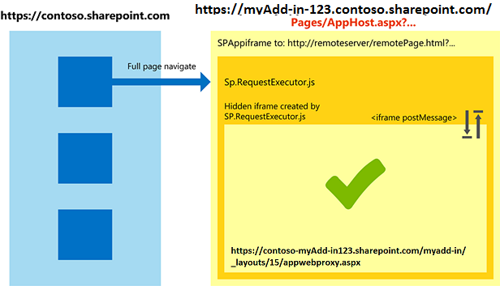

# <a name="work-with-the-cross-domain-library-across-different-internet-explorer-security-zones-in-sharepoint-add-ins"></a><span data-ttu-id="33978-101">Arbeiten mit der domänenübergreifenden Bibliothek in verschiedenen Internet Explorer-Sicherheitszonen in SharePoint-Add-Ins</span><span class="sxs-lookup"><span data-stu-id="33978-101">Work with the cross-domain library across different Internet Explorer security zones in SharePoint Add-ins</span></span>
<span data-ttu-id="33978-102">Hier erfahren Sie, wie Sie die domänenübergreifende Bibliothek in SharePoint verwenden, wenn sich das Hostweb und Add-In-Seiten in verschiedenen Sicherheitszonen in Windows Internet Explorer befinden.</span><span class="sxs-lookup"><span data-stu-id="33978-102">Learn how to use the cross-domain library in sp15allshort when the host web and add-in pages are in different security zones in Windows Internet Explorer.</span></span>
 

 <span data-ttu-id="33978-p101">**Hinweis** Der Name „Apps für SharePoint“ wird in „SharePoint-Add-Ins“ geändert. Während des Übergangszeitraums wird in der Dokumentation und der Benutzeroberfläche einiger SharePoint-Produkte und Visual Studio-Tools möglicherweise weiterhin der Begriff „Apps für SharePoint“ verwendet. Weitere Informationen finden Sie unter [Neuer Name für Office- und SharePoint-Apps](new-name-for-apps-for-sharepoint#bk_newname).</span><span class="sxs-lookup"><span data-stu-id="33978-p101">The name "apps for SharePoint" is changing to "SharePoint Add-ins". During the transition, the documentation and the UI of some SharePoint products and Visual Studio tools might still use the term "apps for SharePoint". For details, see [New name for apps for Office and SharePoint](new-name-for-apps-for-sharepoint#bk_newname).</span></span>
 

<span data-ttu-id="33978-p102">Wenn Sie die domänenübergreifende SharePoint-Bibliothek für Ihr Add-In verwenden, müssen Sie die Funktion von Sicherheitszonen in Internet Explorer kennen. In dem Add-In können Kommunikationsprobleme auftreten, wenn sich die SharePoint-Website und das Add-In in verschiedenen Zonen befinden. In diesem Artikel wird erklärt, was geschieht, wenn Sie die domänenübergreifende Bibliothek in verschiedenen Internet Explorer-Sicherheitszonen verwenden.</span><span class="sxs-lookup"><span data-stu-id="33978-p102">If you are using the sp15allshort cross-domain library for your add-ins, you should be aware of how security zones work in Internet Explorer. Your add-in may encounter some communication issues if the SharePoint website and the add-in are in different zones. This article explains what happens when you use the cross-domain library in different Internet Explorer security zones.</span></span>
 

## <a name="cross-zone-scenarios-in-internet-explorer-using-the-sharepoint-cross-domain-library"></a><span data-ttu-id="33978-109">Zonenübergreifende Szenarios in Internet Explorer bei Verwendung der domänenübergreifenden SharePoint-Bibliothek</span><span class="sxs-lookup"><span data-stu-id="33978-109">Cross-zone scenarios in Internet Explorer using the SharePoint cross-domain library</span></span>
<span data-ttu-id="33978-110"><a name="bk_crosszonescenarios"> </a></span><span class="sxs-lookup"><span data-stu-id="33978-110"></span></span>

<span data-ttu-id="33978-p103">Aus Sicherheitsgründen verhindert Internet Explorer, dass Seiten, die verschiedenen Integritätsebenen (auch Sicherheitszonen genannt) angehören, Cookies gemeinsam nutzen, weil jede Integritätsebene über einen eigenen Cookiespeicher verfügt. Die Integritätsebene einer Seite wird durch die oberste Seite bestimmt, und jeder Frame innerhalb dieser Seite gehört der gleichen Integritätsebene an. Weitere Informationen finden Sie unter dem Thema zum Cookie-Sharing, [Beware Cookie Sharing in Cross-Zone Scenarios](http://blogs.msdn.com/b/ieinternals/archive/2011/03/10/internet-explorer-beware-cookie-sharing-in-cross-zone-scenarios.aspx).</span><span class="sxs-lookup"><span data-stu-id="33978-p103">For security reasons, Internet Explorer prevents pages that are on different integrity levels (also known as security zones) to share cookies because each integrity level has its own cookie store. The integrity level of a page is determined by its top-most page, and any frame within that page will share the same integrity level. For more information, see  [Beware Cookie Sharing in Cross-Zone Scenarios](http://blogs.msdn.com/b/ieinternals/archive/2011/03/10/internet-explorer-beware-cookie-sharing-in-cross-zone-scenarios.aspx).</span></span>
 

 
<span data-ttu-id="33978-p104">Die domänenübergreifende SharePoint-Bibliothek verwendet einen verborgenen **IFrame** und eine clientseitige Proxyseite, die in SharePoint gehostet ist, um die clientseitige Kommunikation über JavaScript zu ermöglichen. Die domänenübergreifende Bibliothek ist verfügbar, wenn Sie in Seiten auf die Datei „sp.requestexecutor.js“ verweisen. Weitere Informationen finden Sie unter [Zugreifen auf SharePoint-Daten über Add-Ins mithilfe der domänenübergreifenden Bibliothek](access-sharepoint-2013-data-from-add-ins-using-the-cross-domain-library).</span><span class="sxs-lookup"><span data-stu-id="33978-p104">The SharePoint cross-domain library uses a hidden **IFrame** and a client-side proxy page hosted on SharePoint to enable client-side communication using JavaScript. The cross-domain library is available when you reference the sp.requestexecutor.js file in your pages. For more information, see [Access SharePoint data from add-ins using the cross-domain library](access-sharepoint-2013-data-from-add-ins-using-the-cross-domain-library).</span></span>
 

 
<span data-ttu-id="33978-p105">Wenn sich die Seite des Remote-Add-Ins und die SharePoint-Website in verschiedenen Sicherheitszonen befinden, können die Autorisierungscookies nicht gesendet werden. Wenn keine Autorisierungscookies vorhanden sind und der **IFrame** die Proxyseite zu laden versucht, wird dieser zur SharePoint-Anmeldeseite weitergeleitet. Aus Sicherheitsgründen kann die SharePoint-Anmeldeseite nicht in einem **IFrame** enthalten sein. In diesen Szenarios kann die Bibliothek die Proxyseite nicht laden, und es ist keine Kommunikation mit SharePoint möglich.</span><span class="sxs-lookup"><span data-stu-id="33978-p105">When the remote add-in page and SharePoint website are in different security zones, the authorization cookies cannot be sent. If there are no authorization cookies, and the **IFrame** tries to load the proxy page, it will be redirected to the SharePoint sign-in page. The SharePoint sign-in page cannot be contained in an **IFrame** for security reasons. In these scenarios, the library cannot load the proxy page, and communication with SharePoint is not possible.</span></span>
 

 
<span data-ttu-id="33978-p106">Im folgenden Diagramm ist ein zonenübergreifendes Szenario dargestellt, in dem die Proxyseite nicht geladen werden kann. Die oberste Seite weist den Frame der gleichen Sicherheitszone zu wie  `http://remoteserver/remotepage.html`. Die Proxyseite wird nicht geladen.</span><span class="sxs-lookup"><span data-stu-id="33978-p106">The following diagram shows a cross-zone scenario in which the proxy page cannot be loaded. The top page puts the frame in the same security zone as  `http://remoteserver/remotepage.html`. The proxy page does not load.</span></span>
 

 

<span data-ttu-id="33978-124">**Abbildung 1. Zonenübergreifendes Szenario, in dem die Proxyseite nicht geladen werden kann**</span><span class="sxs-lookup"><span data-stu-id="33978-124">**Figure 1. Cross-zone scenario where the proxy page cannot be loaded**</span></span>

 

 

 
<span data-ttu-id="33978-126">Es folgen einige Beispiele, in denen die domänenübergreifende Bibliothek die Proxyseite unter Umständen nicht laden kann:</span><span class="sxs-lookup"><span data-stu-id="33978-126">The following are some examples in which the cross-domain library may not be able to load the proxy page:</span></span>
 

 

 

- <span data-ttu-id="33978-p107">Ihre Kunden verwenden SharePoint Online, und die Seite des Remote-Add-In wird auf einem Intranetserver gehostet. In diesem Szenario tritt wahrscheinlich das Problem mit dem Laden der Proxyseite auf, weil die SharePoint-Online-URL in der Regel nicht zur lokalen Intranetzone gehört. Dies ist ein häufiger vorkommendes Szenario während der anfänglichen Entwicklung eines Add-Ins, da Sie möglicherweise IIS Express oder einen anderen lokalen Server verwenden, um Ihre Seite ohne vollqualifizierte Internetdomäne zu hosten.</span><span class="sxs-lookup"><span data-stu-id="33978-p107">Your customers are using SharePoint Online, and your remote add-in page is hosted on an intranet server. This scenario is prone to the proxy page loading issue because the SharePoint Online URL is not usually in the Local intranet zone. This is a very common scenario during initial development of an add-in because you may be using IIS Express or another local server to host your page without a fully qualified internet domain.</span></span>
    
 
- <span data-ttu-id="33978-130">Ihre Kunden verwenden SharePoint lokal mit formularbasierter Authentifizierung, und die Remoteseite wird von einem Clouddienst gehostet (beispielsweise Microsoft Azure).</span><span class="sxs-lookup"><span data-stu-id="33978-130">Your customers are using SharePoint on-premises with forms-based authentication, and your remote page is hosted on a cloud service (for example, Microsoft Azure).</span></span>
    
 

## <a name="handling-cross-zone-scenarios-in-sharepoint-add-ins"></a><span data-ttu-id="33978-131">Behandeln von zonenübergreifenden Szenarios in SharePoint-Add-Ins</span><span class="sxs-lookup"><span data-stu-id="33978-131">Handling cross-zone scenarios in SharePoint Add-ins</span></span>
<span data-ttu-id="33978-132"><a name="bk_handlingcrosszone"> </a></span><span class="sxs-lookup"><span data-stu-id="33978-132"></span></span>

<span data-ttu-id="33978-133">Es gibt mehrere Möglichkeiten, um dieses Problem zu beheben, sowohl während der Add-In-Entwicklung (dringend empfohlen) als auch zur Add-In-Laufzeit.</span><span class="sxs-lookup"><span data-stu-id="33978-133">There are a couple of ways to solve this problem during both add-in development (strongly recommended) and add-in run time.</span></span>
 

 

### <a name="best-practice-use-the-apphost-pattern"></a><span data-ttu-id="33978-134">Bewährte Methode: Verwenden des apphost-Musters</span><span class="sxs-lookup"><span data-stu-id="33978-134">Best practice: Use the apphost pattern</span></span>

<span data-ttu-id="33978-p108">Zur Behandlung eines zonenübergreifenden Szenarios wird empfohlen, eine apphost-Seite in die SharePoint-Website aufzunehmen. Die apphost-Seite ist eine SharePoint-Seite, welche die Remoteseite in einem **IFrame** enthält. Alles, was im **IFrame** in der apphost-Seite enthalten ist, gehört derselben Sicherheitszone wie das Add-In-Web an. Die domänenübergreifende Bibliothek in der Remoteseite kann die Autorisierungscookies empfangen und die Proxyseite erfolgreich laden.</span><span class="sxs-lookup"><span data-stu-id="33978-p108">To handle a cross-zone scenario, we recommend that you have an apphost page in SharePoint. The apphost page is a SharePoint page that contains the remote page in an **IFrame**. Everything inside the **IFrame** in the apphost page exists in the same security zone as the add-in web. The cross-domain library in the remote page can receive the authorization cookies and loads the proxy page successfully.</span></span>
 

 
<span data-ttu-id="33978-139">Das folgende Diagramm zeigt ein zonenübergreifendes Szenario, das mithilfe des apphost-Seitenmusters behandelt wird.</span><span class="sxs-lookup"><span data-stu-id="33978-139">The following diagram shows a cross-zone scenario being handled by using the apphost page pattern.</span></span> 
 

 

<span data-ttu-id="33978-140">**Abbildung 2. Behandlung eines zonenübergreifenden Szenarios mittels apphost-Seitenmuster**</span><span class="sxs-lookup"><span data-stu-id="33978-140">**Figure 2. Cross-zone scenario handling by using the apphost page pattern**</span></span>

 

 

 
<span data-ttu-id="33978-p109">Der für die apphost-Seite erforderliche Code ist einfach. Der Hauptteil der apphost-Seite ist ein **SPAppIFrame**-Element. Sie müssen CSS-Formatierungen verwenden, um den **IFrame** unsichtbar zu machen, damit es nicht zu Konflikten mit dem Add-In kommt.</span><span class="sxs-lookup"><span data-stu-id="33978-p109">The code required for the apphost page is simple. The main portion of the apphost page is an **SPAppIFrame** element. You must use CSS to make the **IFrame** invisible so that it doesn't interfere with your add-in.</span></span>
 

 
<span data-ttu-id="33978-p110">Das folgende Markup ist ein Beispiel für eine einfache apphost-Seite. Das Markup führt folgende Aufgaben aus:</span><span class="sxs-lookup"><span data-stu-id="33978-p110">The following markup is an example of a simple apphost page. The markup performs the following tasks:</span></span>
 

 

 

- <span data-ttu-id="33978-147">Es deklariert Anweisungen, die beim Verwenden von SharePoint-Komponenten erforderlich sind.</span><span class="sxs-lookup"><span data-stu-id="33978-147">Declares directives needed when using SharePoint components.</span></span>
    
 
- <span data-ttu-id="33978-148">Es deklariert Formatierungen, um den **IFrame** unsichtbar zu machen.</span><span class="sxs-lookup"><span data-stu-id="33978-148">Declares styles to make the **IFrame** invisible.</span></span>
    
 
- <span data-ttu-id="33978-149">Es deklariert den **SPAppIFrame** und legt das Ziel auf die Add-In-Startseite fest.</span><span class="sxs-lookup"><span data-stu-id="33978-149">Declares the **SPAppIFrame** and sets the target to the add-in start page.</span></span>
    
 


```HTML
<%@ Page 
    Inherits="Microsoft.SharePoint.WebPartPages.WebPartPage, Microsoft.SharePoint, Version=15.0.0.0, Culture=neutral, PublicKeyToken=71e9bce111e9429c" 
    language="C#" %>
<%@ Register 
    Tagprefix="SharePoint" 
    Namespace="Microsoft.SharePoint.WebControls" 
    Assembly="Microsoft.SharePoint, Version=15.0.0.0, Culture=neutral, PublicKeyToken=71e9bce111e9429c" %>
<%@ Register 
    Tagprefix="Utilities" 
    Namespace="Microsoft.SharePoint.Utilities" 
    Assembly="Microsoft.SharePoint, Version=15.0.0.0, Culture=neutral, PublicKeyToken=71e9bce111e9429c" %>
<%@ Register 
    Tagprefix="WebPartPages" 
    Namespace="Microsoft.SharePoint.WebPartPages" 
    Assembly="Microsoft.SharePoint, Version=15.0.0.0, Culture=neutral, PublicKeyToken=71e9bce111e9429c" %>

<html>
<head>
    <title>Your add-in page title</title>
    <style type="text/css">
        html, body
        {
            overflow:hidden;
        }
        
        body
        {
            margin:0px;
            padding:0px;
        }
         
        iframe 
        {
            border:0px;
            height:100%;
            width:100%;
        }
    </style>
</head>

<body>
    <SharePoint:SPAppIFrame 
        runat="server" 
        src="~remoteAppUrl/StartPage.html?{StandardTokens}" 
        frameborder="0">
    </SharePoint:SPAppIFrame>
</body>
</html>
```

<span data-ttu-id="33978-p111">Wenn Benutzer über Deep-Links auf Teile des Add-Ins zugreifen können sollen, kann die apphost-Seite mit Inhalten des **IFrame** zusammenarbeiten, um dies zu ermöglichen. Eine Alternative besteht darin, die postMessage-Methode des **IFrame** und jeweils verschiedene URLs für jede Seite des Remote-Add-Ins zu verwenden. Um verschiedene URLs für Seiten anzugeben, können Sie einzelne Seiten im Add-In-Web erstellen oder Abfragezeichenfolgen-Parameter für eine Seite verwenden.</span><span class="sxs-lookup"><span data-stu-id="33978-p111">If you want your users to deep link into portions of your add-in, your apphost page and the contents of the **IFrame** can collaborate to make that possible. One alternative is to use **IFrame** post-message communication and individual URLs per page in the remote add-in. To have individual URLs per page, you can create individual pages in the add-in web or use query string parameters on one page.</span></span>
 

 

### <a name="alternative-approach-add-the-sites-to-the-same-security-zone-in-internet-explorer"></a><span data-ttu-id="33978-153">Alternative Möglichkeit: Hinzufügen der Websites zur gleichen Sicherheitszone in Internet Explorer</span><span class="sxs-lookup"><span data-stu-id="33978-153">Alternative approach: Add the sites to the same security zone in Internet Explorer</span></span>

<span data-ttu-id="33978-154">Selbst wenn ein Add-In nicht unter Verwendung des Apphost-Musters entworfen wurde, können Sie für ihr Funktionieren sorgen, indem Sie die folgenden Domänen derselben Sicherheitszone hinzufügen:</span><span class="sxs-lookup"><span data-stu-id="33978-154">If an add-in was not designed following the apphost pattern, you can still allow it to work by adding the following domains into the same security zone:</span></span> 
 

 

- <span data-ttu-id="33978-155">Die Domäne der SharePoint-Website (z. B. `https://contoso.sharepoint.com`).</span><span class="sxs-lookup"><span data-stu-id="33978-155">The domain of your SharePoint site (for example,  `https://contoso.sharepoint.com`).</span></span>
    
 
- <span data-ttu-id="33978-156">Die Domäne des in der Cloud gehosteten Add-Ins (`http://remoteserver`).</span><span class="sxs-lookup"><span data-stu-id="33978-156">The domain of the cloud-hosted add-in ( `http://remoteserver`).</span></span>
    
 
- <span data-ttu-id="33978-157">Die Domäne von von Microsoft gehosteten Anmeldeseiten und -diensten (`*.microsoftonline.com`).</span><span class="sxs-lookup"><span data-stu-id="33978-157">The domain of Microsoft-hosted sign-in pages and services ( `*.microsoftonline.com`).</span></span>
    
 
<span data-ttu-id="33978-158">Administratoren können Active Directory-Richtlinien verwenden, um Änderungen an alle Computer in der Organisation zu pushen.</span><span class="sxs-lookup"><span data-stu-id="33978-158">Administrators can use Active Directory policies to push changes to all computers in the organization.</span></span>
 

 

## <a name="security-implications-of-using-the-apphost-pattern"></a><span data-ttu-id="33978-159">Sicherheitsaspekte bei der Verwendung des apphost-Musters</span><span class="sxs-lookup"><span data-stu-id="33978-159">Security implications of using the apphost pattern</span></span>
<span data-ttu-id="33978-160"><a name="bk_securityimplications"> </a></span><span class="sxs-lookup"><span data-stu-id="33978-160"></span></span>

<span data-ttu-id="33978-p112">Beachten Sie unbedingt, dass das apphost-Muster im Endeffekt bewirkt, dass die Remoteseite der gleichen Sicherheitszone wie das Add-In-Web angehört. Berücksichtigen Sie die Auswirkungen, die das Hinzufügen einer Website zu einer Sicherheitszone hat. Weitere Informationen finden Sie unter  [Gewusst wie: Verwenden von Sicherheitszonen in Internet Explorer](http://support.microsoft.com/kb/174360).</span><span class="sxs-lookup"><span data-stu-id="33978-p112">It is important to point out that the apphost pattern effectively puts your remote page in the same security zone as the add-in web. Make you sure you understand the implications of adding a site to a security zone. For more information, see  [How to use security zones in Internet Explorer](http://support.microsoft.com/kb/174360).</span></span>
 

 

## <a name="working-in-other-browsers-chrome-firefox-and-safari"></a><span data-ttu-id="33978-164">Arbeiten in anderen Browsern: Chrome, Firefox und Safari</span><span class="sxs-lookup"><span data-stu-id="33978-164">Working in other browsers: Chrome, Firefox, and Safari</span></span>
<span data-ttu-id="33978-165"><a name="bk_otherbrowsers"> </a></span><span class="sxs-lookup"><span data-stu-id="33978-165"></span></span>

<span data-ttu-id="33978-p113">Andere Browser, wie z. B. Google Chrome, Mozilla Firefox und Apple Safari, implementieren das Konzept der Sicherheitszone nicht. Wenn ein Browser Cookies nicht an getrennten Speicherorten isoliert, werden die in diesem Artikel beschriebenen Probleme wahrscheinlich nicht auftreten. Wir empfehlen, dass Sie das apphost-Muster in Ihren Add-Ins verwenden. Durch die Verwendung des apphost-Musters wird sichergestellt, dass das Add-In in den genannten Browsern und Internet Explorer unabhängig von der Sicherheitszone von SharePoint funktioniert.</span><span class="sxs-lookup"><span data-stu-id="33978-p113">Other browsers, such as Google Chrome, Mozilla Firefox, and Apple Safari, do not implement the concept of security zone. If a browser does not isolate the cookies in separated storage, it probably will not encounter the difficulties described in this article. We recommend that you follow the apphost pattern in your add-ins. Using the apphost pattern ensures that your add-in works in the mentioned browsers and Internet Explorer, regardless of which security zone SharePoint is in.</span></span>
 

 

## <a name="additional-resources"></a><span data-ttu-id="33978-170">Zusätzliche Ressourcen</span><span class="sxs-lookup"><span data-stu-id="33978-170">Additional resources</span></span>
<span data-ttu-id="33978-171"><a name="bk_addresources"> </a></span><span class="sxs-lookup"><span data-stu-id="33978-171"></span></span>


-  [<span data-ttu-id="33978-172">Sicherer Datenzugriff und Clientobjektmodelle für SharePoint-Add-Ins</span><span class="sxs-lookup"><span data-stu-id="33978-172">Secure data access and client object models for SharePoint Add-ins</span></span>](secure-data-access-and-client-object-models-for-sharepoint-add-ins)
    
 
-  [<span data-ttu-id="33978-173">Zugreifen auf SharePoint-Daten über Add-Ins mithilfe der domänenübergreifenden Bibliothek</span><span class="sxs-lookup"><span data-stu-id="33978-173">Access SharePoint data from add-ins using the cross-domain library</span></span>](access-sharepoint-2013-data-from-add-ins-using-the-cross-domain-library)
    
 
-  [<span data-ttu-id="33978-174">SharePoint-Add-Ins</span><span class="sxs-lookup"><span data-stu-id="33978-174">SharePoint Add-ins</span></span>](sharepoint-add-ins)
    
 
-  [<span data-ttu-id="33978-175">Autorisierung und Authentifizierung von SharePoint-Add-Ins</span><span class="sxs-lookup"><span data-stu-id="33978-175">Authorization and authentication of SharePoint Add-ins</span></span>](authorization-and-authentication-of-sharepoint-add-ins)
    
 
-  [<span data-ttu-id="33978-176">Drei Ansätze, um Entwurfsentscheidungen für SharePoint-Add-Ins zu treffen</span><span class="sxs-lookup"><span data-stu-id="33978-176">Three ways to think about design options for SharePoint Add-ins</span></span>](three-ways-to-think-about-design-options-for-sharepoint-add-ins)
    
 
-  [<span data-ttu-id="33978-177">Kritische Aspekte der Architektur und der Entwicklungslandschaft für SharePoint-Add-Ins</span><span class="sxs-lookup"><span data-stu-id="33978-177">Important aspects of the SharePoint Add-in architecture and development landscape</span></span>](important-aspects-of-the-sharepoint-add-in-architecture-and-development-landscape)
    
 
-  [<span data-ttu-id="33978-178">Hostwebs, Add-In-Webs und SharePoint-Komponenten in SharePoint</span><span class="sxs-lookup"><span data-stu-id="33978-178">Host webs, add-in webs, and SharePoint components in SharePoint</span></span>](host-webs-add-in-webs-and-sharepoint-components-in-sharepoint-2013)
    
 
-  [<span data-ttu-id="33978-179">Datenspeicheroptionen in SharePoint Add-Ins</span><span class="sxs-lookup"><span data-stu-id="33978-179">Data storage in SharePoint Add-ins</span></span>](important-aspects-of-the-sharepoint-add-in-architecture-and-development-landscape#Data)
    
 
-  [<span data-ttu-id="33978-180">Erstellen einer benutzerdefinierten Proxyseite für die domänenübergreifende Bibliothek in SharePoint</span><span class="sxs-lookup"><span data-stu-id="33978-180">Create a custom proxy page for the cross-domain library in SharePoint</span></span>](create-a-custom-proxy-page-for-the-cross-domain-library-in-sharepoint-2013)
    
 
-  [<span data-ttu-id="33978-181">Clientseitige domänenübergreifende Sicherheit</span><span class="sxs-lookup"><span data-stu-id="33978-181">Client-side Cross-domain Security</span></span>](http://msdn.microsoft.com/en-us/library/cc709423%28v=vs.85%29.aspx)
    
 

