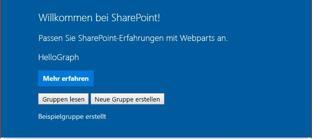

# <a name="use-graphhttpclient-to-call-microsoft-graph"></a>Verwenden von GraphHttpClient zum Aufrufen von Microsoft Graph
> [!IMPORTANT]
>Der **GraphHttpClient** befindet sich derzeit in der Preview-Phase. Änderungen sind vorbehalten. Er wird derzeit in Produktionsumgebungen nicht unterstützt.

Verwenden Sie die **GraphHttpClient**-Klasse zum Aufrufen der Microsoft Graph-REST-API. Sie können GET-, POST- und PATCH-Anforderungen vornehmen. Verwenden Sie dazu die Methoden **get()**, **post()** und **fetch()**. Dieser Artikel erläutert, wie Sie ein Webpart erstellen, das **GraphHttpClient** verwendet, Sie können **GraphHttpClient** jedoch in jedem SharePoint-Framework-Clientcode verwenden.

## <a name="retrieve-office-365-groups-using-a-get-call"></a>Abrufen von Office 365-Gruppen mit einem GET-Aufruf

Sie können die **get()**-Methode verwenden, um einen REST-Aufruf an Microsoft Graph vorzunehmen. In diesem Beispiel wird gezeigt, wie Sie eine Liste der Office 365-Gruppen abrufen. 

### <a name="create-a-new-web-part-project"></a>Erstellen eines neuen Webpart-Projekts

1. Erstellen Sie an einem Speicherort Ihrer Wahl ein neues Projektverzeichnis: 

  ```
  mkdir hellograph-webpart
  ```

2. Wechseln Sie in das Projektverzeichnis:

  ```
  cd hellograph-webpart
  ```

3. Führen Sie den Yeoman-SharePoint-Generator aus, um ein neues Webpart zu erstellen.

  ```
  yo @microsoft/sharepoint
  ```

4. Es werden verschiedene Eingabeaufforderungen angezeigt. Gehen Sie wie folgt vor:

  * Geben Sie als Namen der Lösung **hellograph-webpart** ein.
  * Wählen Sie als Speicherort für die Dateien die Option **Use the current folder** aus.
  * Geben Sie bei Aufforderung **y** ein, wenn Sie dem Mandantenadministrator erlauben möchten, die Lösung sofort auf allen Websites bereitzustellen, ohne dass eine Featurebereitstellung durchgeführt oder Apps zu Websites hinzugefügt werden.
  * Wählen Sie **Webpart** als Typ der zu erstellenden clientseitigen Komponente aus.
  * Geben Sie **HelloGraph** als Webpartnamen ein.
  * Geben Sie als Beschreibung des Webparts **Calls the Microsoft Graph Groups API** (Ruft die Microsoft Graph Groups-API) ein.
  * Übernehmen Sie die Standardeinstellung **No javaScript web framework** aus, und drücken Sie die **EINGABETASTE**.

  

5. Der Yeoman Generator erstellt das Webpart. Öffnen Sie den Projektordner in Ihrem Code-Editor, sobald die Gerüsterstellung abgeschlossen ist. In diesem Artikel wird Visual Studio Code in den Schritten und Screenshots verwendet, Sie können jedoch einen beliebigen Editor verwenden.

6. Führen Sie den Befehl „gulp serve“ aus, und überprüfen Sie, ob er in der lokalen Workbench korrekt ausgeführt wird.

  ```
  gulp serve
  ```

### <a name="add-a-button-and-placeholder-for-results"></a>Hinzufügen einer Schaltfläche und eines Platzhalters für Ergebnisse
Im nächsten Schritt müssen Sie den HTML-Code ändern, um eine Schaltfläche zum Abrufen von Office 365-Gruppen bereitzustellen. Der HTML-Code benötigt darüber hinaus einen Platzhalter, um die Gruppen anzeigen zu können.

1. Öffnen Sie im Code-Editor die Datei **/src/webparts/helloGraph/HelloGraphWebPart.ts** .

2. Ändern Sie die **render()**-Methode so, dass Sie eine Schaltfläche und ein **div** umfasst, damit der Code die Office 365-Gruppen nach dem Abrufen auflistet.

  Ihr Code sollte wie das folgende TypeScript aussehen.

  ```typescript
    public render(): void {
      this.domElement.innerHTML = `
        <div class="${styles.helloGraph}">
        <div class="${styles.container}">
        <div class="ms-Grid-row ms-bgColor-themeDark ms-fontColor-white ${styles.row}">
          <div class="ms-Grid-col ms-u-lg10 ms-u-xl8 ms-u-xlPush2 ms-u-lgPush1">
            <span class="ms-font-xl ms-fontColor-white">Welcome to SharePoint!</span>
            <p class="ms-font-l ms-fontColor-white">Customize SharePoint experiences using Web Parts.</p>
            <p class="ms-font-l ms-fontColor-white">${escape(this.properties.description)}</p>
            <a href="https://aka.ms/spfx" class="${styles.button}">
              <span class="${styles.label}">Learn more</span>
            </a>
            <p>
            <input id="readGroups" type="button" value="Read Groups"/> 
            </p>
            <div id="spTableContainer" ></div>
          </div>
        </div>
      </div>
    </div>`;
    this.domElement.querySelector('#readGroups').addEventListener('click',() => {this._readGroups();});
    }
  ```

  Sie definieren die **_readGroups()**-Methode später.

3. Definieren Sie eine Schnittstelle für jede Office 365-Gruppe. Fügen Sie den folgenden Code genau vor der **HelloGraphWebPart**-Klasse, jedoch nach den Importen ein.

  ```typescript
  export interface IOffice365Group {
    // Microsoft Graph has more group properties.
    displayName: string;
    mail: string;
    description: string;
  }
  ```

### <a name="use-the-graphhttpclientget-method-to-retrieve-office-365-groups"></a>Verwenden der GraphHttpClient.get-Methode zum Abrufen von Office 365-Gruppen
Als Nächstes rufen Sie die **GraphHttpClient.get()**-Methode auf, um einen REST-Aufruf für Microsoft Graph durchzuführen, mit dem eine Liste der Office 365-Gruppen abgerufen wird.

1. I0mportieren Sie die **GraphHttpClient**-Klasse und verwandte Typen, indem Sie die folgende Importanweisung oben in die Datei **HelloGraphWebPart.ts** einfügen.

  ```typescript
  import { GraphHttpClient, HttpClientResponse, IGraphHttpClientOptions } from '@microsoft/sp-http';
  ```

2. Erstellen Sie die **_readGroups()**-Methode, indem Sie den folgenden Code zur **HelloGraphWebPart**-Klasse hinzufügen.

  ```typescript
  protected _readGroups(){
      // Query for all groups on the tenant using Microsoft Graph.
      this.context.graphHttpClient.get(`v1.0/groups?$orderby=displayName`, GraphHttpClient.configurations.v1).then((response: HttpClientResponse) => {
        if (response.ok) {
          return response.json();
        } else {
          console.warn(response.statusText);
        }
      }).then((result: any) => {
        // Transfer result values to the group variable
        this._renderTable(result.value);
      });
  }
  ```

  Im vorherigen Code hat die Kontexteigenschaft die GraphHttpClient-Instanz. Wenn Sie die **get()**-Methode aufrufen, erfolgt ein REST-Aufruf an Microsoft Graph, der die angegebene URL übergibt. In diesem Fall ist die URL **v1.0/groups?orderby=displayName**. Diese gibt eine GET-Anforderung aus, und Microsoft Graph gibt alle Office 365-Gruppen im Mandanten geordnet nach Name zurück.

  Sie können eine beliebige GET-Anforderung ausgeben, indem Sie diese Methode verwenden und die richtigen Werte für die URL eingeben. Weitere Informationen zum Suchen der URL-Werte finden Sie in der [Dokumentation zu Microsoft Graph](https://developer.microsoft.com/de-DE/graph/docs/concepts/overview). Sie können zum Beispiel die im Thema [GET-Anforderung für Gruppen](https://developer.microsoft.com/de-DE/graph/docs/api-reference/v1.0/api/group_get) aufgeführte URL verwenden, um Gruppen abzurufen. 

  Die **get()**-Methode gibt eine **HttpClientResponse** zurück, die Sie verwenden können um zu ermitteln, ob der Aufruf erfolgreich durchgeführt wurde. Der zurückgegebene JSON-Code befindet sich im **result.value**. Da Sie davon ausgehen, dass mehrere Gruppen zurückgegeben werden, übergeben Sie den Wert an eine **_renderTable()**-Methode, die eine Tabelle mit Zeilen für die einzelnen Gruppen erstellt.

3. Erstellen Sie eine **_renderTable()**-Methode zum Rendern der zurückgegebenen Gruppen in einer Tabelle, wobei jede Zeile eine Gruppe darstellt. Fügen Sie die folgende Methode zur **HelloGraphWebPart**-Klasse hinzu.

  ```typescript
  protected _renderTable(items: IOffice365Group[]): void {
    let html: string = '';
    if (items.length<=0){
      html=`<p>There are no groups to list...</p>`;
    }
    else {
      html += `
      <table><tr>
        <th>Display Name</th>
        <th>Mail</th>
        <th>Description</th></tr>`;
      items.forEach((item: IOffice365Group) => {
        html += `
          <tr>
              <td>${item.displayName}</td>
              <td>${item.mail}</td>
              <td>${item.description}</td>
          </tr>`;
      });
      html += `</table>`;
    }
    const tableContainer: Element = this.domElement.querySelector('#spTableContainer');
    tableContainer.innerHTML = html;
    return;
  }
  ```

### <a name="run-the-web-part-to-call-microsoft-graph"></a>Ausführen des Webparts zum Aufrufen von Microsoft Graph
Der Code muss die **GraphHttpClient**-Anwendung aufrufen, die in SharePoint ausgeführt wird. Sie können die Anwendung nicht in der lokalen Workbench ausführen. Sie müssen Sie packen und in SharePoint bereitstellen.

1. Verwenden Sie zum Packen der Lösung „gulp“.

  ```
  gulp package-solution
  ```

2. Stellen Sie die Lösung in Ihrem SharePoint-Mandanten bereit:
  * Wechseln Sie zum App-Katalog der Website.
  * Laden Sie **helloworld-webpart.sppkg** in den App-Katalog hoch, oder legen Sie es mit Drag & Drop dort ab.
  * Wenn Sie aufgefordert werden anzugeben, ob Sie **hellograph-webpart-client-side-solution** vertrauen, wählen Sie **Diese Lösung für alle Websites in der Organisation verfügbar machen** aus, und wählen Sie dann **Bereitstellen**.

3. Verwenden Sie zum Hosten des Webparts „gulp serve“.

  ```
  gulp serve --nobrowser
  ```

4. Fügen Sie das Webpart einer Webseite hinzu, oder verwenden Sie die SharePoint-Workbench.

  Folgendes solle auf der Seite angezeigt werden:
  

  Wenn Sie **Gruppen lesen** auswählen, wird eine Liste aller Office 365-Gruppen auf dem Mandanten angezeigt. Wenn keine Gruppen aufgelistet sind, wird eine Meldung angezeigt, die angibt, dass keine Gruppen vorhanden sind. Als Nächstes erstellen Sie eine neue Gruppe.

## <a name="create-a-new-office-365-group-using-a-post-call"></a>Erstellen einer neuen Office 365-Gruppe mit einem POST-Aufruf

Sie können POST-Aufrufe an die Microsoft Graph-API ausgeben, indem Sie die **GraphHttpClient.post()**-Methode verwenden. Verwenden Sie die **post()**-Methode zum Erstellen einer neuen Office 365-Gruppe.


### <a name="add-a-button-and-placeholder-for-results"></a>Hinzufügen einer Schaltfläche und eines Platzhalters für Ergebnisse
Sie müssen erneut den HTML-Code ändern, um eine Schaltfläche hinzuzufügen, mit der eine neue Gruppe erstellt wird.

1. Öffnen Sie im Code-Editor die Datei **/src/webparts/helloGraph/HelloGraphWebPart.ts** .

2. Ändern Sie die **render()**-Methode so, dass sie eine Schaltfläche und ein **div** enthält, um anzugebn, ob die Erstellung erfolgreich war.

  Ihr Code sollte wie das folgende TypeScript aussehen.

  ```typescript
    public render(): void {
      this.domElement.innerHTML = `
        <div class="${styles.helloGraph}">
        <div class="${styles.container}">
        <div class="ms-Grid-row ms-bgColor-themeDark ms-fontColor-white ${styles.row}">
          <div class="ms-Grid-col ms-u-lg10 ms-u-xl8 ms-u-xlPush2 ms-u-lgPush1">
            <span class="ms-font-xl ms-fontColor-white">Welcome to SharePoint!</span>
            <p class="ms-font-l ms-fontColor-white">Customize SharePoint experiences using Web Parts.</p>
            <p class="ms-font-l ms-fontColor-white">${escape(this.properties.description)}</p>
            <a href="https://aka.ms/spfx" class="${styles.button}">
              <span class="${styles.label}">Learn more</span>
            </a>
            <p>
            <input id="readGroups" type="button" value="Read Groups"/> 
            <input id="createGroup" type="button" value="Create New Group"/>                           
            </p>
            <div id="spCreateGroupResults" ></div>
            <div id="spTableContainer" ></div>
          </div>
        </div>
      </div>
    </div>`;
    this.domElement.querySelector('#createGroup').addEventListener('click',() => {this._createGroup();});
    this.domElement.querySelector('#readGroups').addEventListener('click',() => {this._readGroups();});    
    }
  ```

3. Fügen Sie die **_createGroup()**-Methode hinzu, um die Microsoft Graph-API aufzurufen und eine neue Gruppe zu erstellen.

  ```typescript
    protected _createGroup(){
      // Use Microsoft Graph to create a sample group.
      this.context.graphHttpClient.post(`v1.0/groups`,GraphHttpClient.configurations.v1,{
        body: JSON.stringify({"description": "Self help community for library",
        "displayName": "Library Assist",
        "groupTypes": [
          "Unified"
        ],
        "mailEnabled": true,
        "mailNickname": "library",
        "securityEnabled": false
      })
    }).then((response: HttpClientResponse) => {
      const resultContainer: Element = this.domElement.querySelector('#spCreateGroupResults');
        if (response.ok) {
          resultContainer.innerHTML = `<p>Sample group created</p>`;
        } else {
          resultContainer.innerHTML = `<p>Could not create group see console for details</p>`;        
          console.warn(response.status);
        }
      });
    }
  ```

  Der vorherige Code erstellt eine einfache Gruppe mithilfe des Codebeispiels im Artikel [Gruppe erstellen](https://developer.microsoft.com/de-DE/graph/docs/api-reference/v1.0/api/group_post_groups) von Microsoft Graph.

  Die **post()**-Methode gibt einen POST-REST-API-Aufruf an die URL **v1.0/groups** aus. Der dritte Parameter ist ein **IGraphHttpClientOptions**-Wert, in dem der JSON-Text zum Beschreiben der neuen Gruppe angegeben ist. Die **HttpClientResponse** wird verwendet, um zu ermitteln, ob der Aufruf erfolgreich war, und um das entsprechende Ergebnis anzuzeigen.

  Sie können einen POST-Aufruf über die Microsoft Graph-Dokumentation ausgeben, indem Sie dieses Muster verwenden und JSON im Textkörper angeben.

### <a name="run-the-web-part-to-create-a-new-group"></a>Ausführen des Webparts zum Erstellen einer neuen Gruppe

1. Verwenden Sie zum Packen der Lösung „gulp“.

  ```
  gulp package-solution
  ```

2. Stellen Sie die Lösung in Ihrem SharePoint-Mandanten bereit:
  * Wechseln Sie zum App-Katalog der Website.
  * Laden Sie **helloworld-webpart.sppkg** in den App-Katalog hoch, oder legen Sie es mit Drag & Drop dort ab.
  * Da Ihre Lösung bereits registriert ist, werden Sie aufgefordert zu bestätigen, ob Sie sie ersetzen möchten. Wählen Sie **Ersetzen**.
  * Wenn Sie aufgefordert werden anzugeben, ob Sie der Lösung vertrauen, wählen Sie **Bereitstellen**.

3. Verwenden Sie zum Hosten des Webparts „gulp serve“.

  ```
  gulp serve --nobrowser
  ```

4. Fügen Sie das Webpart einer Webseite hinzu, oder verwenden Sie die SharePoint-Workbench.

  Folgendes solle auf der Seite angezeigt werden:
  

5. Wenn Sie **Neue Gruppe erstellen** wählen, erstellt der code eine neue Office 365-Gruppe. 

  > [!NOTE] 
  >Wenn Sie versuchen, die gleiche Gruppe erneut zu erstellen, gibt der Code einen Fehler zurück, da die Gruppe bereits vorhanden ist. Der Fehler wird in der Konsole protokolliert, und Sie können dies im Entwicklermodus des Browsers anzeigen.

## <a name="update-a-group-using-a-patch-call"></a>Aktualisieren einer Gruppe mit einem PATCH-Aufruf

Das Muster sollte Ihnen nun klar sein. Wenn Sie eine Microsoft Graph-REST-API aufrufen müssen, verwenden Sie die Methoden **get()** oder **post()** zusammen mit der URL für Ihre Anforderung. Die letzte zu erläuternde Methode ist die **fetch()**-Methode. Mit dieser Methode können Sie eine PATCH-Anfoderung an Microsoft Graph ausgeben, um eine Ressource zu aktualisieren.

Der folgende Code zeigt, wie Sie die **fetch()**-Methode zum Aktualisieren einer vorhandenen Gruppe aufrufen.

```typescript
    this.context.graphHttpClient.fetch(`v1.0/groups/2dfead70-21e4-4f30-bb2b-94b1bbdefdfa`,GraphHttpClient.configurations.v1,{
      method: "PATCH",
      body: JSON.stringify(
        {
          "description": "This is the new description",
          "displayName": "testtest"
        })
  }).then((response: HttpClientResponse) => {
    const resultContainer: Element = this.domElement.querySelector('#spUpdateGroupResults');
      if (response.ok) {
        resultContainer.innerHTML = `<p>Group updated</p>`;
      } else {
        resultContainer.innerHTML = `<p>Could not update group see console for details</p>`;        
        console.warn(response.status);
      }
    });
```

Die ID der Gruppe wird in der URL angegeben. Rufen Sie die ID zuerst mithilfe eines GET-Aufrufs ab. Der **method**-Parameter ist auf **PATCH** festgelegt. Der Textkörper gibt an, welche Gruppeneigenschaften geändert werden sollen.
