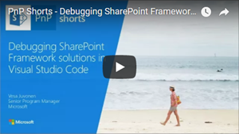

# <a name="debug-sharepoint-framework-solutions-in-visual-studio-code"></a><span data-ttu-id="946ae-103">Debuggen von SharePoint-Framework-Lösungen in Visual Studio Code</span><span class="sxs-lookup"><span data-stu-id="946ae-103">Debug SharePoint Framework solutions in Visual Studio Code</span></span>

<span data-ttu-id="946ae-104">Visual Studio Code ist eine beliebter Code-Editor, der häufig zur Erstellung von SharePoint Framework-Lösungen verwendet wird.</span><span class="sxs-lookup"><span data-stu-id="946ae-104">Visual Studio Code is a popular code editor frequently used for building SharePoint Framework solutions.</span></span> <span data-ttu-id="946ae-105">Wenn Sie Ihre SharePoint Framework-Lösung in Visual Studio Code debuggen, können Sie Ihren Code effizienter durcharbeiten und Fehler beheben.</span><span class="sxs-lookup"><span data-stu-id="946ae-105">By setting up debugging of your SharePoint Framework solution in Visual Studio Code, you can more efficiently step through your code and fix errors.</span></span> 

<span data-ttu-id="946ae-106">In einem Video in unserem [YouTube-Kanal „SharePoint Patterns & Practices“](https://www.youtube.com/watch?v=oNChcluMrm8&list=PLR9nK3mnD-OXZbEvTEPxzIOMGXj_aZKJG) werden auch die erforderlichen Schritte zum Aktivieren von Debugging in Visual Studio Code erläutert.</span><span class="sxs-lookup"><span data-stu-id="946ae-106">You can also see the required steps to enable debugging in Visaul Studio Code by watching a video on the [SharePoint PnP YouTube Channel](https://www.youtube.com/watch?v=oNChcluMrm8&list=PLR9nK3mnD-OXZbEvTEPxzIOMGXj_aZKJG).</span></span> 

<a href="https://www.youtube.com/watch?v=oNChcluMrm8&list=PLR9nK3mnD-OXZbEvTEPxzIOMGXj_aZKJG">

</a>

## <a name="prerequisites"></a><span data-ttu-id="946ae-107">Voraussetzungen</span><span class="sxs-lookup"><span data-stu-id="946ae-107">Prerequisites</span></span>

<span data-ttu-id="946ae-108">Am einfachsten lässt sich Visual Studio Code mit Google Chrome und der Visual Studio Code-Extension „Debugger for Chrome“ für das Debuggen von SharePoint Framework-Lösungen konfigurieren.</span><span class="sxs-lookup"><span data-stu-id="946ae-108">The easiest way to configure Visual Studio Code to debug SharePoint Framework solutions is by using Google Chrome and the Debugger for Chrome Visual Studio Code extension.</span></span> <span data-ttu-id="946ae-109">Ab SharePoint-Framework-Yeoman-Generator Version 1.3.4 werden Standardprojektvorlagen (Webparts und Erweiterungen) mit zugehörigen Voraussetzungen geliefert und fordern zur Installation der erforderlichen Visual Studio Code-Erweiterungen auf.</span><span class="sxs-lookup"><span data-stu-id="946ae-109">Starting with the SharePoint Framework yeoman generator version 1.3.4, the default project (web parts and extensions) templates will come setup with the pre-requisites and will prompt for the required Visual Studio Code extensions to install.</span></span> <span data-ttu-id="946ae-110">In diesem Fall werden Sie aufgefordert, die Chrome-Debugger-Erweiterung für Visual Studio Code zu installieren.</span><span class="sxs-lookup"><span data-stu-id="946ae-110">In this case, it will prompt to install Debugger for Chrome Visual Studio Code extension.</span></span>

<span data-ttu-id="946ae-111">Sie benötigen auch Google Chrome.</span><span class="sxs-lookup"><span data-stu-id="946ae-111">You will also need Google Chrome browser.</span></span> <span data-ttu-id="946ae-112">[Laden Sie die aktuelle Version von Google Chrome herunter, und installieren Sie sie](https://www.google.com/chrome/browser/desktop/index.html).</span><span class="sxs-lookup"><span data-stu-id="946ae-112">Download and install the latest version of Google Chrome from [https://www.google.com/chrome/browser/desktop/index.html](https://www.google.com/chrome/browser/desktop/index.html).</span></span>

<span data-ttu-id="946ae-113">Wenn Sie eine ältere Version des SharePoint-Framework-Yeoman-Generators als 1.3.4 verwenden, können Sie [die Chrome-Debugger-Erweiterung für Visual Studio Code aus dem Visual Studio Marketplace](https://marketplace.visualstudio.com/items?itemName=msjsdiag.debugger-for-chrome) installieren.</span><span class="sxs-lookup"><span data-stu-id="946ae-113">If you are using an older SharePoint Framework yeoman generator, older than 1.3.4, then you can install the Chrome debugger extension for Visual Studio Code from the [Visual Studio Marketplace](https://marketplace.visualstudio.com/items?itemName=msjsdiag.debugger-for-chrome).</span></span>

## <a name="debug-configurations"></a><span data-ttu-id="946ae-114">Debugkonfigurationen</span><span class="sxs-lookup"><span data-stu-id="946ae-114">Debug configurations</span></span>

<span data-ttu-id="946ae-115">Die Debugkonfigurationen sind in der Datei „launch.json“ im folgenden Visual Studio Code-Arbeitsbereichordner enthalten:</span><span class="sxs-lookup"><span data-stu-id="946ae-115">You can locate the debug configurations in the launch.json file under the Visua Studio Code workspace folder:</span></span>

```
project-name\.vscode
```

<span data-ttu-id="946ae-116">Die Datei „launch.json“ enthält zwei Debugkonfigurationen:</span><span class="sxs-lookup"><span data-stu-id="946ae-116">The launch.json contains two debug configurations:</span></span>
* <span data-ttu-id="946ae-117">Konfiguration für die lokale Workbench</span><span class="sxs-lookup"><span data-stu-id="946ae-117">Local workbench configuration</span></span>
* <span data-ttu-id="946ae-118">Konfiguration für die gehostete Workbench</span><span class="sxs-lookup"><span data-stu-id="946ae-118">Hosted workbench configuration</span></span>

## <a name="debug-solution-using-local-workbench"></a><span data-ttu-id="946ae-119">Debuggen der Lösung mithilfe der lokalen Workbench</span><span class="sxs-lookup"><span data-stu-id="946ae-119">Debug SharePoint Framework solution using local workbench</span></span>

<span data-ttu-id="946ae-p104">Während der Erstellung von SharePoint Framework-Lösungen können Sie mithilfe der lokalen Workbench überprüfen, ob Ihr Webpart einwandfrei funktioniert. Über die lokale Workbench lassen sich komfortabel alle Szenarien testen, die keine Kommunikation mit SharePoint erfordern. Sie eignet sich zudem für die Offline-Entwicklung.</span><span class="sxs-lookup"><span data-stu-id="946ae-p104">When building SharePoint Framework solutions, you can use the local workbench to verify that your web part is working correctly. Using local workbench is convenient for testing all scenarios that do not require communicating with SharePoint as well as for offline development.</span></span>

<span data-ttu-id="946ae-122">Sobald Sie Visual Studio Code für das Debuggen von SharePoint Framework-Lösungen mit Google Chrome und der lokalen Workbench konfiguriert haben, können Sie überprüfen, ob alles wie erwartet funktioniert.</span><span class="sxs-lookup"><span data-stu-id="946ae-122">With Visual Studio Code configured for debugging SharePoint Framework solutions using Google Chrome and the local workbench, you can verify that everything is working as expected.</span></span>

### <a name="configure-a-breakpoint"></a><span data-ttu-id="946ae-123">Konfigurieren eines Haltepunkts</span><span class="sxs-lookup"><span data-stu-id="946ae-123">Configure a breakpoint</span></span>

1. <span data-ttu-id="946ae-124">Öffnen Sie in Visual Studio Code die Quelldatei des Hauptwebparts, und fügen Sie in der ersten Zeile der Methode **render** einen Haltepunkt hinzu. Klicken Sie dazu entweder links neben die Zeilennummer, oder markieren Sie die Codezeile im Editor, und drücken Sie die Taste F9.</span><span class="sxs-lookup"><span data-stu-id="946ae-124">In Visual Studio Code open the main web part source file and add a breakpoint in the first line of the **render** method by either clicking on the margin left to the line number or by highlighting the code line in the editor and pressing the F9 key.</span></span>

    

2. <span data-ttu-id="946ae-126">Wählen Sie in Visual Studio Code im Menü **Anzeigen** die Option **Integriertes Terminal** aus, oder drücken Sie **STRG+\`** auf der Tastatur.</span><span class="sxs-lookup"><span data-stu-id="946ae-126">In Visual Studio Code, from the **View** menu select the **Integrated Terminal** option or press **CTRL+\`** on the keyboard.</span></span> 

3. <span data-ttu-id="946ae-127">Führen Sie im Terminal den folgenden Befehl aus:</span><span class="sxs-lookup"><span data-stu-id="946ae-127">In the terminal run the following command:</span></span>

    ```sh
    gulp serve --nobrowser
    ```

    <span data-ttu-id="946ae-128">Dieser Befehl erstellt Ihre SharePoint Framework-Lösung und startet den lokalen Webserver, der dann die Ausgabedateien ausliefert.</span><span class="sxs-lookup"><span data-stu-id="946ae-128">Running this command will build your SharePoint Framework solution and start the local webserver to serve the output files.</span></span> <span data-ttu-id="946ae-129">Da der Debugger eine eigene Instanz des Browsers startet, verwenden Sie das Argument **--nobrowser**. Es verhindert, dass der Task **serve** ein Browserfenster öffnet.</span><span class="sxs-lookup"><span data-stu-id="946ae-129">Because the debugger will start its own instance of the browser, you use the **--nobrowser** argument to prevent the **serve** task from opening a browser window.</span></span>

    

### <a name="start-debugging-in-visual-studio-code"></a><span data-ttu-id="946ae-131">Starten des Debuggens in Visual Studio Code</span><span class="sxs-lookup"><span data-stu-id="946ae-131">Start debugging in Visual Studio Code</span></span>

<span data-ttu-id="946ae-132">Wechseln Sie nach Abschluss des gulp-Tasks in den Codebereich von Visual Studio Code, und drücken Sie F5. (Alternativ können Sie aus dem Menü **Debuggen** die Option **Debugging starten** auswählen.)</span><span class="sxs-lookup"><span data-stu-id="946ae-132">Once the gulp task is finished, move the focus to the code area of Visual Studio Code and press F5 (or from the Debug menu select the Start Debugging option).</span></span> 

<span data-ttu-id="946ae-133">Der Debugmodus in Visual Studio Code startet, und die Statusleiste wird orange. Außerdem wird ein neues Google Chrome-Fenster mit der lokalen Version der SharePoint-Workbench geöffnet.</span><span class="sxs-lookup"><span data-stu-id="946ae-133">The debug mode in Visual Studio Code will start, changing the color of the status bar to orange and a new window of Google Chrome will open showing the local version of the SharePoint workbench.</span></span>

> [!NOTE] 
> <span data-ttu-id="946ae-134">Zu diesem Zeitpunkt ist der Haltepunkt deaktiviert, da der Code des Webparts noch nicht geladen wurde.</span><span class="sxs-lookup"><span data-stu-id="946ae-134">At this point the breakpoint is disabled because the web part's code hasn't been loaded yet.</span></span> <span data-ttu-id="946ae-135">SharePoint Framework kann Webparts erst bei Bedarf laden, wenn sie der Seite hinzugefügt wurden.</span><span class="sxs-lookup"><span data-stu-id="946ae-135">Note, that at this point the breakpoint is disabled, because the web part's code hasn't been loaded yet. SharePoint Framework loads web parts on demand only after they have been added to the page.</span></span>


### <a name="add-a-web-part-to-the-canvas"></a><span data-ttu-id="946ae-137">Hinzufügen eines Webparts zum Zeichenbereich</span><span class="sxs-lookup"><span data-stu-id="946ae-137">Add web part to canvas</span></span>

<span data-ttu-id="946ae-138">Um zu überprüfen, ob das Debuggen funktioniert, fügen Sie Ihr Webpart in der Workbench nun dem Zeichenbereich hinzu.</span><span class="sxs-lookup"><span data-stu-id="946ae-138">To verify that debugging is working, in the workbench add your web part to the canvas.</span></span>


<br/>

<span data-ttu-id="946ae-140">Sie sehen: Jetzt da der Code auf der Seite geladen wurde, ist der Haltepunktindikator aktiviert.</span><span class="sxs-lookup"><span data-stu-id="946ae-140">Notice, that with the code loaded on the page, the breakpoint indicator changed to active.</span></span>


<br/>

<span data-ttu-id="946ae-142">Wenn Sie die Seite nun neu laden, greift der Haltepunkt in Visual Studio Code, und Sie können alle Eigenschaften prüfen und den Code Schritt für Schritt durcharbeiten.</span><span class="sxs-lookup"><span data-stu-id="946ae-142">If you now reload the page, your breakpoint in Visual Studio Code will be hit, and you will be able to inspect all properties and step through the code.</span></span>


## <a name="debug-solution-using-hosted-workbench"></a><span data-ttu-id="946ae-144">Debuggen der Lösung mithilfe der gehosteten Workbench</span><span class="sxs-lookup"><span data-stu-id="946ae-144">Debug SharePoint Framework solution using hosted workbench</span></span>

<span data-ttu-id="946ae-145">Wenn Sie SharePoint Framework-Lösungen erstellen, die mit SharePoint kommunizieren, möchten Sie möglicherweise überprüfen, ob die Interaktion zwischen Ihrer Lösung und SharePoint funktioniert.</span><span class="sxs-lookup"><span data-stu-id="946ae-145">When building SharePoint Framework solutions that communicate with SharePoint you might want to verify the interaction between your solution in SharePoint.</span></span> <span data-ttu-id="946ae-146">Das geht ganz einfach mit der gehosteten Version der SharePoint-Workbench. Sie ist auf jedem Office 365-Mandanten verfügbar, unter der Adresse `https://yourtenant.sharepoint.com/_layouts/workbench.aspx`.</span><span class="sxs-lookup"><span data-stu-id="946ae-146">To do this easily, you can use the hosted version of the SharePoint workbench which is available on every Office 365 tenant at `https://yourtenant.sharepoint.com/_layouts/workbench.aspx`.</span></span> 

<span data-ttu-id="946ae-147">Da solche Tests während der Erstellung von SharePoint-Framework-Lösungen regelmäßig durchgeführt werden, ist es empfehlenswert, eine separate Debugkonfiguration für die gehostete Version der SharePoint-Workbench zu erstellen.</span><span class="sxs-lookup"><span data-stu-id="946ae-147">When building SharePoint Framework solutions, you will be doing such tests regularly and it is a good idea to create a separate debug configuration for the hosted version of the SharePoint workbench.</span></span>

### <a name="debug-solution-using-hosted-workbench"></a><span data-ttu-id="946ae-148">Debuggen der Lösung mithilfe der gehosteten Workbench</span><span class="sxs-lookup"><span data-stu-id="946ae-148">Debug SharePoint Framework solution using hosted workbench</span></span>

1. <span data-ttu-id="946ae-149">Öffnen Sie die Datei „launch.json“ und ersetzen Sie die `url`-Eigenschaft in der Konfiguration für die *gehostete Workbench* durch die URL Ihrer SharePoint-Website.</span><span class="sxs-lookup"><span data-stu-id="946ae-149">Open launch.json and update the `url` property under *Hosted workbench* configuration to your SharePoint site URL.</span></span>

    ```json
    "url": "https://enter-your-SharePoint-site/_layouts/workbench.aspx",
    ```

2. <span data-ttu-id="946ae-150">Öffnen Sie in Visual Studio Code den Bereich **Debuggen**, und wählen Sie aus der Liste **Konfigurationen** die gerade erstellte Konfiguration für die **gehostete Workbench** aus.</span><span class="sxs-lookup"><span data-stu-id="946ae-150">In Visual Studio Code, activate the **Debug** pane and in the **Configurations** drop-down, select the newly added **Hosted workbench** configuration.</span></span>

    

3. <span data-ttu-id="946ae-152">Starten Sie das Debuggen. Drücken Sie dazu entweder die Taste F5, oder wählen Sie aus dem Menü **Debuggen** die Option **Debugging starten** aus.</span><span class="sxs-lookup"><span data-stu-id="946ae-152">Start debugging either by selecting F5 or by selecting the **Start Debugging** option on the **Debug** menu.</span></span> <span data-ttu-id="946ae-153">Visual Studio Code wechselt in den Debugmodus, und die Statusleiste wird orange. Außerdem öffnet die Extension „Debugger for Chrome“ eine neue Instanz von Google Chrome mit der Office 365-Anmeldeseite.</span><span class="sxs-lookup"><span data-stu-id="946ae-153">Visual Studio Code will switch into debug mode, indicated by the orange status bar, and the Debugger for Chrome extension will open a new instance of Google Chrome with the Office 365 login page.</span></span>

    

4. <span data-ttu-id="946ae-155">Fügen Sie nach der Anmeldung das Webpart zum Zeichenbereich hinzu, und aktualisieren Sie die Workbench, so wie dies mit der lokalen Workbench getan haben.</span><span class="sxs-lookup"><span data-stu-id="946ae-155">After you sign in, add the web part to the canvas and refresh the workbench, just like you did with the local workbench.</span></span> <span data-ttu-id="946ae-156">Sie werden sehen, wie der Haltepunkt in Visual Studio Code gegriffen wird. Außerdem können Sie Variablen überprüfen und den Code durchlaufen.</span><span class="sxs-lookup"><span data-stu-id="946ae-156">You will see the breakpoint in Visual Studio Code be hit, and you are able to inspect variables and step through the code.</span></span>

    

## <a name="for-older-projects"></a><span data-ttu-id="946ae-158">Für ältere Projekte</span><span class="sxs-lookup"><span data-stu-id="946ae-158">For older projects</span></span>

<span data-ttu-id="946ae-159">Wenn Sie eine ältere Version des SharePoint-Framework-Yeoman-Generators verwenden, führen Sie die folgenden Schritte aus, um die Datei „launch.json“ manuell zu erstellen.</span><span class="sxs-lookup"><span data-stu-id="946ae-159">If you are using an older version of SharePoint Framework yeoman generator, then follow the steps below to create the launch.json file manually.</span></span>

### <a name="create-debug-configuration-for-local-workbench"></a><span data-ttu-id="946ae-160">Erstellen einer Debugkonfiguration für die lokale Workbench</span><span class="sxs-lookup"><span data-stu-id="946ae-160">Create debug configuration for local workbench</span></span>

1. <span data-ttu-id="946ae-161">Öffnen Sie in Visual Studio Code den Bereich **Debuggen**.</span><span class="sxs-lookup"><span data-stu-id="946ae-161">In Visual Studio Code activate the **Debug** pane.</span></span>

    

2. <span data-ttu-id="946ae-163">Öffnen Sie im oberen Abschnitt des Bereichs die Liste **Konfigurationen**, und wählen Sie die Option **Konfiguration hinzufügen...** aus.</span><span class="sxs-lookup"><span data-stu-id="946ae-163">In the top section of the pane, open the **Configurations** drop-down and select the **Add Configuration...** option.</span></span>

    

3. <span data-ttu-id="946ae-165">Wählen Sie aus der Liste der Debugumgebungen **Chrome** aus.</span><span class="sxs-lookup"><span data-stu-id="946ae-165">From the list of debug environments select **Chrome**.</span></span>

    

4. <span data-ttu-id="946ae-167">Ersetzen Sie den Inhalt der generierten Datei **launch.json** durch:</span><span class="sxs-lookup"><span data-stu-id="946ae-167">Replace the contents of the generated **launch.json** file with:</span></span>

    ```json
    {
        "version": "0.2.0",
        "configurations": [
            {
                "name": "Local workbench",
                "type": "chrome",
                "request": "launch",
                "url": "https://localhost:4321/temp/workbench.html",
                "webRoot": "${workspaceRoot}",
                "sourceMaps": true,
                "sourceMapPathOverrides": {
                    "webpack:///../../../src/*": "${webRoot}/src/*",
                    "webpack:///../../../../src/*": "${webRoot}/src/*",
                    "webpack:///../../../../../src/*": "${webRoot}/src/*"
                },
                "runtimeArgs": [
                    "--remote-debugging-port=9222"
                ]
            }
        ]
    }
    ```

    <span data-ttu-id="946ae-168">Diese Konfiguration verwendet den Debugger **chrome**, der in der Extension **Debugger for Chrome** enthalten ist.</span><span class="sxs-lookup"><span data-stu-id="946ae-168">This configuration uses the **chrome** debugger provided with the **Debugger for Chrome** extension.</span></span> <span data-ttu-id="946ae-169">Sie verweist auf die URL der lokalen Workbench als Ausgangspunkt.</span><span class="sxs-lookup"><span data-stu-id="946ae-169">It points to the URL of the local workbench as the starting point.</span></span> <span data-ttu-id="946ae-170">Essenziell beim Debuggen von TypeScript-Code ist die Konfiguration von Quellzuordnungen, die der Debugger nutzt, um im Browser ausgeführtes JavaScript dem ursprünglichen TypeScript-Code zuzuordnen.</span><span class="sxs-lookup"><span data-stu-id="946ae-170">What is essential in debugging TypeScript code, is the configuration of source maps that the debugger uses to map the JavaScript running in the browser to the original TypeScript code.</span></span>

### <a name="create-debug-configuration-for-hosted-workbench"></a><span data-ttu-id="946ae-171">Erstellen einer Debugkonfiguration für die gehostete Workbench</span><span class="sxs-lookup"><span data-stu-id="946ae-171">Create debug configuration for hosted workbench</span></span>

1. <span data-ttu-id="946ae-172">Öffnen Sie in Visual Studio Code die Datei **./.vscode/launch.json**.</span><span class="sxs-lookup"><span data-stu-id="946ae-172">In Visual Studio Code open the **./.vscode/launch.json** file.</span></span> 

2. <span data-ttu-id="946ae-173">Kopieren Sie die vorhandene Debugkonfiguration, und verwenden Sie die URL der gehosteten Workbench:</span><span class="sxs-lookup"><span data-stu-id="946ae-173">Copy the existing debug configuration and use the URL of the hosted workbench:</span></span>

    ```json
    {
        "version": "0.2.0",
        "configurations": [
            {
                "name": "Local workbench",
                "type": "chrome",
                "request": "launch",
                "url": "https://localhost:4321/temp/workbench.html",
                "webRoot": "${workspaceRoot}",
                "sourceMaps": true,
                "sourceMapPathOverrides": {
                    "webpack:///../../../src/*": "${webRoot}/src/*",
                    "webpack:///../../../../src/*": "${webRoot}/src/*",
                    "webpack:///../../../../../src/*": "${webRoot}/src/*"
                },
                "runtimeArgs": [
                    "--remote-debugging-port=9222"
                ]
            },
            {
                "name": "Hosted workbench",
                "type": "chrome",
                "request": "launch",
                "url": "https://contoso.sharepoint.com/_layouts/workbench.aspx",
                "webRoot": "${workspaceRoot}",
                "sourceMaps": true,
                "sourceMapPathOverrides": {
                    "webpack:///../../../src/*": "${webRoot}/src/*",
                    "webpack:///../../../../src/*": "${webRoot}/src/*",
                    "webpack:///../../../../../src/*": "${webRoot}/src/*"
                },
                "runtimeArgs": [
                    "--remote-debugging-port=9222"
                ]
            }
        ]
    }
    ```

## <a name="see-also"></a><span data-ttu-id="946ae-174">Weitere Artikel</span><span class="sxs-lookup"><span data-stu-id="946ae-174">See also</span></span>

- [<span data-ttu-id="946ae-175">How to debug your SharePoint Framework web part (Elio Struyf)</span><span class="sxs-lookup"><span data-stu-id="946ae-175">How to debug your SharePoint Framework web part (Elio Struyf)</span></span>](https://www.eliostruyf.com/how-to-debug-your-sharepoint-framework-web-part/)
- [<span data-ttu-id="946ae-176">Debug SPFx React webpart with Visual Studio Code (Velin Georgiev)</span><span class="sxs-lookup"><span data-stu-id="946ae-176">Debug SPFx React webpart with Visual Studio Code (Velin Georgiev)</span></span>](https://blog.velingeorgiev.com/how-debug-sharepoint-framework-webpart-visual-studio-code)
- [<span data-ttu-id="946ae-177">Erstellen von Gerüsten für Projekte unter Verwendung des Yeoman-Generators von SharePoint</span><span class="sxs-lookup"><span data-stu-id="946ae-177">Scaffold projects using yeoman SharePoint generator</span></span>](toolchain/scaffolding-projects-using-yeoman-sharepoint-generator.md)
- [<span data-ttu-id="946ae-178">SharePoint Framework-Übersicht</span><span class="sxs-lookup"><span data-stu-id="946ae-178">SharePoint Framework Extensions Overview</span></span>](sharepoint-framework-overview.md)
