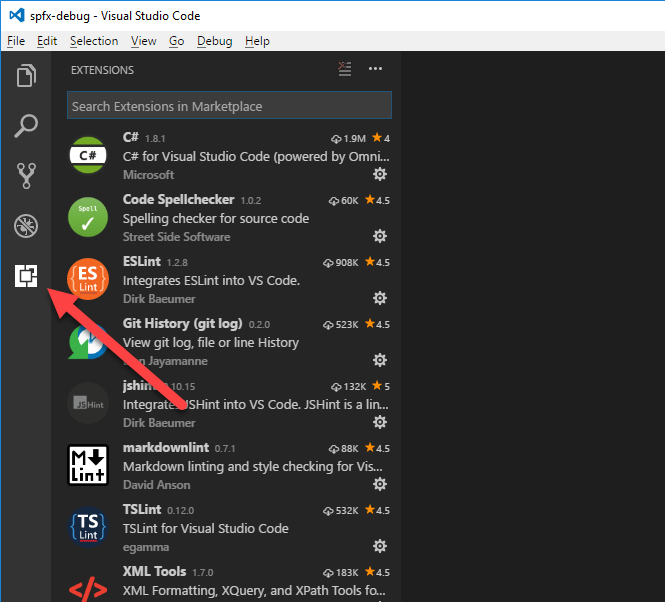
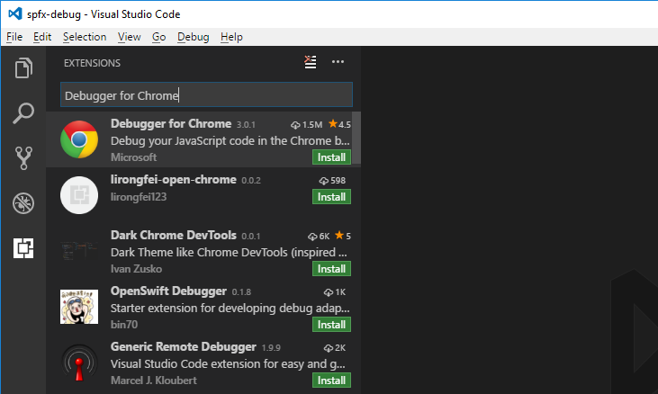
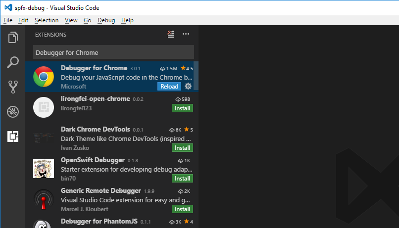
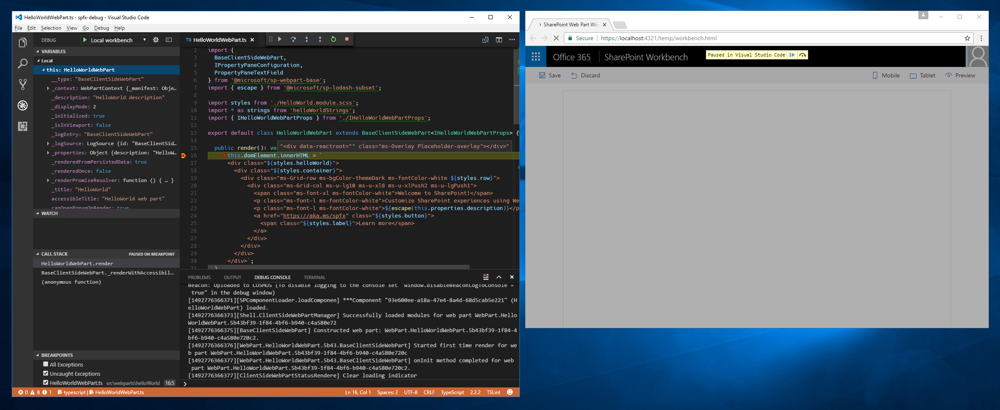

# <a name="debug-sharepoint-framework-solutions-in-visual-studio-code"></a>Debuggen von SharePoint Framework-Lösungen in Visual Studio Code

Visual Studio Code ist eine beliebter Code-Editor, der häufig zur Erstellung von SharePoint Framework-Lösungen verwendet wird. Wenn Sie Ihre SharePoint Framework-Lösung in Visual Studio Code debuggen, können Sie Ihren Code effizienter durcharbeiten und Fehler beheben. In diesem Artikel werden die Komponenten und Konfigurationsschritte beschrieben, die erforderlich sind, um Visual Studio Code für das Debuggen von SharePoint Framework-Lösungen zu konfigurieren.

## <a name="prerequisites"></a>Erforderliche Komponenten

Am einfachsten lässt sich Visual Studio Code mit Google Chrome und der Visual Studio Code-Extension „Debugger for Chrome“ für das Debuggen von SharePoint Framework-Lösungen konfigurieren.

### <a name="install-google-chrome"></a>Installieren von Google Chrome

Laden Sie die aktuelle Version von Google Chrome unter [https://www.google.com/chrome/browser/desktop/index.html](https://www.google.com/chrome/browser/desktop/index.html) herunter, und installieren Sie sie.

### <a name="install-the-debugger-for-chrome-visual-studio-code-extension"></a>Installieren der Visual Studio Code-Extension „Debugger for Chrome“

Starten Sie Visual Studio Code, und öffnen Sie den Bereich **Extensions**.



Geben Sie **Debugger for Chrome** in das Suchfeld ein.



Klicken Sie auf die Schaltfläche **Installieren** neben der Extension **Debugger for Chrome**, um die Extension zu installieren. Klicken Sie nach der Installation der Extension auf die Schaltfläche **Erneut laden**, um das Visual Studio Code-Fenster neu zu laden.



## <a name="debug-sharepoint-framework-solution-using-local-workbench"></a>Debuggen von SharePoint Framework-Lösungen mithilfe der lokalen Workbench

Während der Erstellung von SharePoint Framework-Lösungen können Sie mithilfe der lokalen Workbench überprüfen, ob Ihr Webpart einwandfrei funktioniert. Über die lokale Workbench lassen sich komfortabel alle Szenarien testen, die keine Kommunikation mit SharePoint erfordern. Sie eignet sich zudem für die Offline-Entwicklung.

### <a name="create-debug-configuration-for-local-workbench"></a>Erstellen einer Debugkonfiguration für die lokale Workbench

Öffnen Sie in Visual Studio Code den Bereich **Debuggen**.


Öffnen Sie im oberen Abschnitt des Bereichs das Dropdownmenü **Konfigurationen**, und wählen Sie die Option **Konfiguration hinzufügen...** aus.


Wählen Sie aus der Liste der Debugumgebungen **Chrome** aus.


Ersetzen Sie den Inhalt der generierten Datei **launch.json** durch:

```json
{
    "version": "0.2.0",
    "configurations": [
        {
            "name": "Local workbench",
            "type": "chrome",
            "request": "launch",
            "url": "https://localhost:4321/temp/workbench.html",
            "webRoot": "${workspaceRoot}",
            "sourceMaps": true,
            "sourceMapPathOverrides": {
                "webpack:///../../../../*": "${webRoot}/*"
            },
            "runtimeArgs": [
                "--remote-debugging-port=9222"
            ]
        }
    ]
}
```

Diese Konfiguration verwendet den Debugger **chrome**, der in der Extension **Debugger for Chrome** enthalten ist. Sie verweist auf die URL der lokalen Workbench als Ausgangspunkt. Essenziell beim Debuggen von TypeScript-Code ist die Konfiguration von Quellzuordnungen, die der Debugger nutzt, um im Browser ausgeführtes JavaScript dem ursprünglichen TypeScript-Code zuzuordnen.

### <a name="test-debugging-sharepoint-framework-client-side-web-part-in-the-local-workbench"></a>Test: Debuggen eines clientseitigen SharePoint Framework-Webparts in der lokalen Workbench

Sobald Sie Visual Studio Code für das Debuggen von SharePoint Framework-Lösungen mit Google Chrome und der lokalen Workbench konfiguriert haben, können Sie überprüfen, ob alles wie erwartet funktioniert.

#### <a name="configure-a-breakpoint"></a>Konfigurieren eines Haltepunkts

Öffnen Sie in Visual Studio Code die Quelldatei des Hauptwebparts, und fügen Sie in der ersten Zeile der Methode **render** einen Haltepunkt hinzu. Klicken Sie dazu entweder links neben die Zeilennummer, oder markieren Sie die Codezeile im Editor, und drücken Sie die Taste **F9**.


#### <a name="start-serving-the-sharepoint-framework-solution"></a>Starten der Auslieferung der SharePoint Framework-Lösung

Wählen Sie in Visual Studio Code im Menü **Anzeigen** die Option **Integriertes Terminal** aus, oder drücken Sie **STRG+`** auf der Tastatur. Führen Sie im Terminal den folgenden Befehl aus:

```sh
gulp serve --nobrowser
```

Dieser Befehl erstellt Ihre SharePoint Framework-Lösung und startet den lokalen Webserver, der dann die Ausgabedateien ausliefert. Da der Debugger eine eigene Instanz des Browsers startet, verwenden Sie das Argument **--nobrowser**. Es verhindert, dass der Task **serve** ein Browserfenster öffnet.


#### <a name="start-debugging-in-visual-studio-code"></a>Starten des Debuggens in Visual Studio Code

Wechseln Sie nach Abschluss des gulp-Tasks in den Codebereich von Visual Studio Code, und drücken Sie **F5**. (Alternativ können Sie aus dem Menü **Debuggen** die Option **Debugging starten** auswählen.) Der Debugmodus in Visual Studio Code startet, und die Statusleiste wird orange. Außerdem wird ein neues Google Chrome-Fenster mit der lokalen Version der SharePoint-Workbench geöffnet.


> Beachten Sie: Zu diesem Zeitpunkt ist der Haltepunkt deaktiviert, da der Code des Webparts noch nicht geladen wurde. SharePoint Framework kann Webparts erst bei Bedarf laden, wenn sie der Seite hinzugefügt wurden.

#### <a name="add-web-part-to-canvas"></a>Hinzufügen des Webparts zur Canvas

Um zu überprüfen, ob das Debuggen funktioniert, fügen Sie Ihr Webpart in der Workbench nun der Canvas hinzu.


Sie sehen: Jetzt da der Code auf der Seite geladen wurde, ist der Haltepunktindikator aktiviert.


Wenn Sie die Seite nun neu laden, greift der Haltepunkt in Visual Studio Code, und Sie können alle Eigenschaften prüfen und den Code Schritt für Schritt durcharbeiten.



## <a name="debug-sharepoint-framework-solution-using-hosted-workbench"></a>Debuggen von SharePoint Framework-Lösungen mithilfe der gehosteten Workbench

Wenn Sie SharePoint Framework-Lösungen erstellen, die mit SharePoint kommunizieren, möchten Sie möglicherweise überprüfen, ob die Interaktion zwischen Ihrer Lösung und SharePoint funktioniert. Das geht ganz einfach mit der gehosteten Version der SharePoint-Workbench. Sie ist auf jedem Office 365-Mandanten verfügbar, unter der Adresse **https://ihrmandant.sharepoint.com/_layouts/workbench.aspx**. Da solche Tests während der Erstellung von SharePoint Framework-Lösungen regelmäßig durchgeführt werden, ist es empfehlenswert, eine separate Debugkonfiguration für die gehostete Version der SharePoint-Workbench zu erstellen.

### <a name="create-debug-configuration-for-hosted-workbench"></a>Erstellen einer Debugkonfiguration für die gehostete Workbench

Öffnen Sie in Visual Studio Code die Datei **./.vscode/launch.json**. Kopieren Sie die vorhandene Debugkonfiguration, und verwenden Sie die URL der gehosteten Workbench:

```json
{
    "version": "0.2.0",
    "configurations": [
        {
            "name": "Local workbench",
            "type": "chrome",
            "request": "launch",
            "url": "https://localhost:4321/temp/workbench.html",
            "webRoot": "${workspaceRoot}",
            "sourceMaps": true,
            "sourceMapPathOverrides": {
                "webpack:///../../../../*": "${webRoot}/*"
            },
            "runtimeArgs": [
                "--remote-debugging-port=9222"
            ]
        },
        {
            "name": "Hosted workbench",
            "type": "chrome",
            "request": "launch",
            "url": "https://contoso.sharepoint.com/_layouts/workbench.aspx",
            "webRoot": "${workspaceRoot}",
            "sourceMaps": true,
            "sourceMapPathOverrides": {
                "webpack:///../../../../*": "${webRoot}/*"
            },
            "runtimeArgs": [
                "--remote-debugging-port=9222"
            ]
        }
    ]
}
```

### <a name="test-debugging-sharepoint-framework-client-side-web-part-in-the-hosted-workbench"></a>Test: Debuggen eines clientseitigen SharePoint Framework-Webparts in der gehosteten Workbench

Sobald Sie die Debugkonfiguration für die gehostete Workbench erstellt haben, müssen Sie überprüfen, ob sie korrekt funktioniert. Öffnen Sie in Visual Studio Code den Bereich **Debuggen**, und wählen Sie aus dem Dropdownmenü **Konfigurationen** die gerade erstellte Konfiguration **Hosted workbench** aus.


Starten Sie nun das Debuggen. Drücken Sie dazu entweder die Taste **F5**, oder wählen Sie aus dem Menü **Debuggen** die Option **Debugging starten** aus. Visual Studio Code wechselt in den Debugmodus, und die Statusleiste wird orange. Außerdem öffnet die Extension „Debugger for Chrome“ eine neue Instanz von Google Chrome mit der Office 365-Anmeldeseite.


Melden Sie sich an, fügen Sie der Canvas das Webpart hinzu, und laden Sie die Workbench neu. Wie in der lokalen Workbench greift nun der Haltepunkt in Visual Studio Code, und Sie können alle Variablen überprüfen und den Code Schritt für Schritt durcharbeiten.


## <a name="additional-information"></a>Weitere Informationen

- [How to debug your SharePoint Framework web part (Elio Struyf)](http://www.eliostruyf.com/how-to-debug-your-sharepoint-framework-web-part/)
- [Debug SPFx React webpart with Visual Studio Code (Velin Georgiev)](http://blog.velingeorgiev.pro/how-debug-sharepoint-framework-webpart-visual-studio-code)