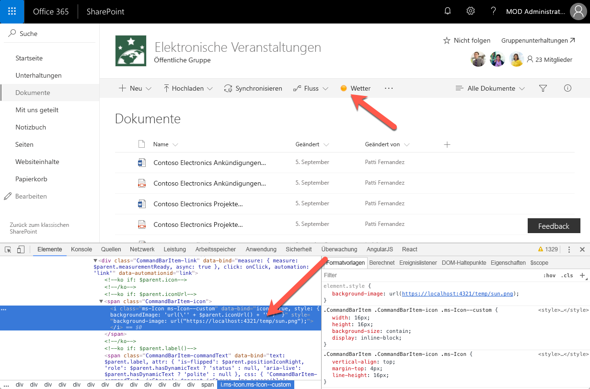
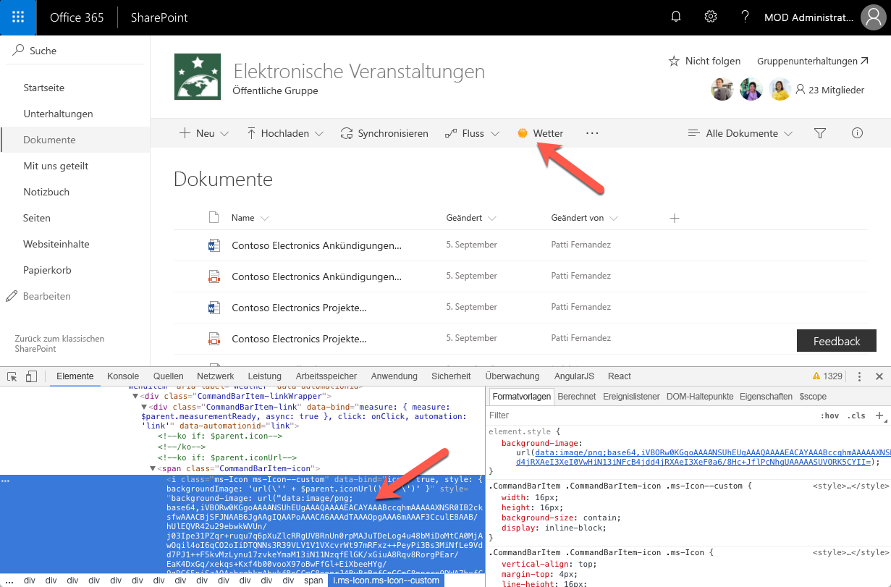

# <a name="configure-extension-icon"></a>Konfigurieren des Erweiterungssymbols

Die Verwendung eines Symbols, das den Zweck des benutzerdefinierten Befehls darstellt, erleichtert Benutzern die Suche nach Ihrem Befehl unter anderen Optionen, die in der Symbolleiste oder im Kontextmenü angezeigt werden. In diesem Artikel werden die verschiedenen Optionen erläutert, die beim Konfigurieren des Symbols für Ihre Befehle zur Verfügung stehen.

## <a name="extension-types-that-support-icons"></a>Erweiterungstypen, die Symbole unterstützen

SharePoint-Framework unterstützt die folgenden Erweiterungstypen:

- Application Customizer
- Field Customizer
- Befehlssatz

Befehlssatz ist der einzige SharePoint-Framework-Erweiterungstyp, in dem Symbole konfiguriert werden können.

## <a name="defining-command-set-locations"></a>Definieren der Position des Befehlssatzes

Wenn Sie Befehlssätze bereitstellen, können Sie festlegen, ob die Befehle auf der Befehlsleiste (`location: ClientSideExtension.ListViewCommandSet.CommandBar`), im Kontextmenü (`location: ClientSideExtension.ListViewCommandSet.ContextMenu`) oder sowohl auf der Befehlsleiste als auch im Kontextmenü (`location: ClientSideExtension.ListViewCommandSet`) angezeigt werden sollen. Symbole, die für andere Befehle definiert werden, werden nur für Befehle auf der Befehlsleiste angezeigt.

## <a name="configuring-command-set-icons"></a>Konfigurieren von Symbolen für Befehlssätze

SharePoint-Framework bietet zwei Möglichkeiten zum Definieren des Symbols für Ihre Erweiterung.

### <a name="using-an-external-icon-image"></a>Verwenden eines externen Symbolbilds

Beim Erstellen von Befehlssätzen des SharePoint-Framework können Sie für jeden Befehl ein Symbol angeben, indem Sie in der **iconImageUrl**-Eigenschaft eine absolute URL angeben, die auf das Symbolbild im Erweiterungsmanifest verweist.

```json
{
  "$schema": "https://dev.office.com/json-schemas/spfx/command-set-extension-manifest.schema.json",

  "id": "6cdfbff6-714f-4c26-a60c-0b18afe60837",
  "alias": "WeatherCommandSet",
  "componentType": "Extension",
  "extensionType": "ListViewCommandSet",

  // The "*" signifies that the version should be taken from the package.json
  "version": "*",
  "manifestVersion": 2,

  // If true, the component can only be installed on sites where Custom Script is allowed.
  // Components that allow authors to embed arbitrary script code should set this to true.
  // https://support.office.com/en-us/article/Turn-scripting-capabilities-on-or-off-1f2c515f-5d7e-448a-9fd7-835da935584f
  "requiresCustomScript": false,

  "items": {
    "WEATHER": {
      "title": { "default": "Weather" },
      "iconImageUrl": "https://localhost:4321/temp/sun.png",
      "type": "command"
    }
  }
}
```

Das auf der Befehlsleiste angezeigte Befehlssymbol weist eine Größe von 16 x 16 Pixel auf. Wenn das Bild größer ist, wird seine Größe proportional entsprechend dieser Größe angepasst.



Während Sie mit benutzerdefinierten Bildern von mehr Flexibilität bei der Wahl eines Symbols für Ihren Befehl profitieren, müssen Sie diese zusammen mit anderen Erweiterungsressourcen bereitzustellen. Darüber hinaus kann es zum Qualitätsverlust kommen, wenn das Bild mit höheren DPI-Werten oder bestimmten Barrierefreiheitseinstellungen angezeigt wird. Um Qualitätsverlust zu vermeiden, können Sie Vektor-basierte SVG-Bilder verwenden, die auch von SharePoint-Framework unterstützt werden.

### <a name="using-a-base64-encoded-image"></a>Verwenden eines base64-codierten Bilds

Wenn Sie ein benutzerdefiniertes Bild verwenden, statt eine absolute URL zu der mit anderen Erweiterungsressourcen gehosteten Bilddatei anzugeben, können Sie ein base64-codiertes Bild und die base64-Zeichenfolge anstelle der URL verwenden.

> Im Internet sind zahlreiche Dienste verfügbar, die Sie für die base64-Codierung von Bildern verwenden können, zum Beispiel [https://www.base64-image.de](https://www.base64-image.de).

Kopieren Sie nach dem Codieren des Bilds die base64-Zeichenfolge, und verwenden Sie sie als Wert für die **iconImageUrl**-Eigenschaft im Manifest des Webparts.

```json
{
  "$schema": "https://dev.office.com/json-schemas/spfx/command-set-extension-manifest.schema.json",

  "id": "6cdfbff6-714f-4c26-a60c-0b18afe60837",
  "alias": "WeatherCommandSet",
  "componentType": "Extension",
  "extensionType": "ListViewCommandSet",

  // The "*" signifies that the version should be taken from the package.json
  "version": "*",
  "manifestVersion": 2,

  // If true, the component can only be installed on sites where Custom Script is allowed.
  // Components that allow authors to embed arbitrary script code should set this to true.
  // https://support.office.com/en-us/article/Turn-scripting-capabilities-on-or-off-1f2c515f-5d7e-448a-9fd7-835da935584f
  "requiresCustomScript": false,

  "items": {
    "WEATHER": {
      "title": { "default": "Weather" },
      "iconImageUrl": "data:image/png;base64,iVBORw0KGgoAAAANSUhEUgAAAQAAAAEACAYAAABccqhmAAAAAXNSR0IB2cksfwAAACBjSFJNAAB6JgAAgIQAAPoAAACA6AAAdTAAAOpgAAA6mAAAF3CculE8AAB/hUlEQVR42u29ebwkWVUn/j03Ipe31PZqr+ruqu7q6pXuZlcRRgUVBRnUn0rpMAJuTDeLog4u48bMiDoMtCA0MjAwOqil4oI6qCO2oIiDTQ...",
      "type": "command"
    }
  }
}
```



Base64-Codierung kann sowohl für BItmapbilder, zum Beispiel PNG, sowie für Vektor-basierte SVG-Bilder verwendet werden. Der große Vorteil der base64-Codierung von Bildern ist, dass Sie das Webpartsymbolbild nicht separat bereitstellen müssen.

## <a name="additional-considerations"></a>Zusätzliche Überlegungen

Das Angeben eines Symbols für einen Befehl ist optional. Wenn Sie kein Symbol angeben, wird nur der Befehlstitel auf der Befehlsleiste angezeigt.