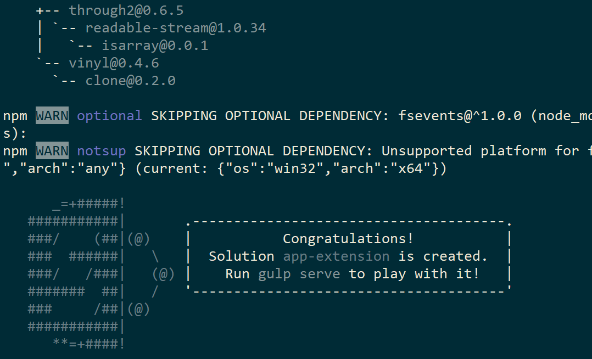
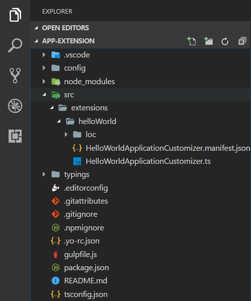
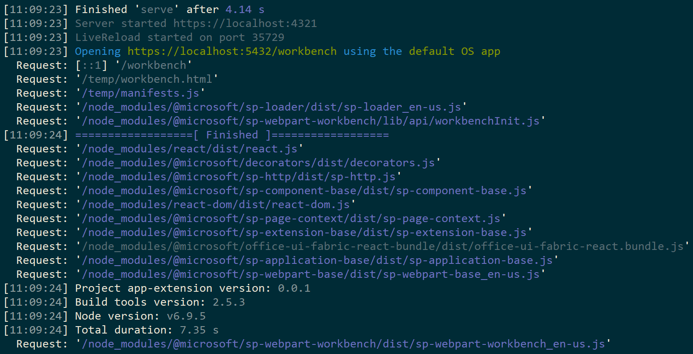

# <a name="build-your-first-sharepoint-framework-extension-hello-world-part-1"></a>Erstellen Ihrer ersten SharePoint-Framework-Erweiterung (Hello World, Teil 1)

>**Hinweis:** Die SharePoint-Framework-Erweiterungen befinden sich derzeit in der Preview-Phase. Änderungen sind vorbehalten. Die Verwendung von SharePoint-Framework-Erweiterungen in Produktionsumgebungen wird aktuell nicht unterstützt.

Erweiterungen sind clientseitige Komponenten, die im Kontext einer SharePoint-Seite ausgeführt werden. Sie lassen sich in SharePoint Online bereitstellen und auch mithilfe aktueller JavaScript-Tools und -Bibliotheken erstellen.

>**Hinweis:** Bevor Sie die Schritte in diesem Artikel durchführen, müssen Sie [Ihre Entwicklungsumgebung einrichten](../../set-up-your-development-environment). Beachten Sie, dass Erweiterungen derzeit **AUSSCHLIESSLICH** über Office 365-Entwicklermandanten verfügbar sind.

## <a name="create-an-extension-project"></a>Erstellen eines Erweiterungsprojekts
Erstellen Sie an einem Speicherort Ihrer Wahl ein neues Projektverzeichnis.

```
md app-extension
```

Wechseln Sie in das Projektverzeichnis.

```
cd app-extension
```

Führen Sie den Yeoman-SharePoint-Generator aus, um eine neue HelloWorld-Erweiterung zu erstellen.

```
yo @microsoft/sharepoint
```

Es werden verschiedene Eingabeaufforderungen angezeigt. Gehen Sie wie folgt vor:

* Übernehmen Sie den Standardwert **app-extension** als Lösungsnamen, und drücken Sie die **EINGABETASTE**.
* Wählen Sie **Extension (Preview)** als den zu erstellenden Typ von clientseitiger Komponente aus. 
* Wählen Sie **Application Customizer (Preview)** als den zu erstellenden Erweiterungstyp aus.

Über die nächsten Eingabeaufforderungen werden spezifische Informationen zu der Erweiterung abgefragt:

* Übernehmen Sie den Standardwert **HelloWorld** als Namen für Ihre Erweiterung, und drücken Sie die **EINGABETASTE**.
* Übernehmen Sie den Standardwert **HelloWorld description** als Beschreibung Ihrer Erweiterung, und drücken Sie die **EINGABETASTE**.


> Beachten Sie, dass zu lange Namen für die Erweiterung zu Problemen führen können. Bereitgestellte Einträge werden verwendet, um einen Alias-Eintrag für die Json-Datei des Anwendungsanpassermanifests zu generieren. Wenn der Alias mehr als 40 Zeichen enthält, führt dies zu einer Ausnahme, wenn Sie versuchen, die Erweiterung mit `gulp serve --nobrowser` zu bedienen. Sie können dieses Problem auch später lösen, indem Sie den Alias-Eintrag aktualisieren.

An diesem Punkt installiert Yeoman die erforderlichen Abhängigkeiten und erstellt ein Gerüst für die Lösungsdateien sowie die **HelloWorld**-Erweiterung. Das kann einige Minuten dauern. 

Nach Abschluss der Gerüsterstellung sollte folgende Erfolgsmeldung angezeigt werden:



Details zur Behebung etwaiger Fehler finden Sie unter [Known issues](../basics/known-issues).

Geben Sie nach der Erstellung des Lösungsgerüsts Folgendes in die Konsole ein, um Visual Studio Code zu starten:

```
code .
```

> Beachten Sie: Da die clientseitige SharePoint-Lösung auf HTML/TypeScript basiert, können Sie zur Erstellung Ihrer Erweiterung jeden Code-Editor verwenden, der clientseitige Entwicklung unterstützt.

Wie Sie sehen, entspricht die Standardlösungsstruktur der Lösungsstruktur clientseitiger Webparts. Hierbei handelt es sich um die grundlegende SharePoint-Framework-Lösungsstruktur, die für alle Lösungstypen vergleichbare Konfigurationsoptionen bereitstellt.



Öffnen Sie **HelloWorldApplicationCustomizer.manifest.json** im Ordner „src\extensions\helloWorld“.

In dieser Datei sind der Erweiterungstyp und ein eindeutiger Bezeichner **„id“** für die Erweiterung definiert. Sie benötigen diesen eindeutigen Bezeichner später, um die Erweiterung zu debuggen und in SharePoint bereitzustellen.


## <a name="coding-your-application-customizer"></a>Codieren des Application Customizer 
Öffnen Sie die Datei **HelloWorldApplicationCustomizer.ts** im Ordner **src\extensions\helloWorld**.

Beachten Sie, dass die Basisklasse für den Application Customizer aus dem **sp-application-base**-Paket importiert wird, das den SharePoint-Framework-Code enthält, der für den Application Customizer erforderlich ist.


Die Logik für den Application Customizer ist in den beiden Methoden **onInit** und **onRender** enthalten.

- In **onInit():** müssen Sie jegliches Setup vornehmen, das für die Erweiterung erforderlich ist. Dieses Ereignis tritt auf, nachdem ```this.context``` und ```this.properties``` zugewiesen wurden, jedoch bevor das Seiten-DOM bereit ist. Wie bei Webparts gibt ```onInit()``` eine Zusage zurück, die Sie verwenden können, um asynchrone Vorgänge durchzuführen; ```onRender()``` wird erst dann aufgerufen, wenn die Zusage erfüllt wurde. Wenn Sie dies nicht benötigen, geben Sie einfach ```super.onInit()``` zurück.
- In **onRender()** kann die Erweiterung mit der Benutzeroberfläche interagieren. Dieses Ereignis tritt auf, nachdem die DOM-Struktur der Startseite der Anwendung erstellt wurde (obwohl einige Teile der Benutzeroberfläche möglicherweise noch nicht fertig gerendert sind).

> Beachten Sie: Der Klassenkonstruktor wird in einer frühen Phase aufgerufen, wenn ```this.context``` und ```this.properties``` noch nicht definiert sind. Das Einschließen benutzerdefinierter Initiierungslogik wird an dieser Stelle nicht unterstützt.

Im Folgenden sind die Inhalte von **onInit()** und **onRender()** in der Standardlösung aufgelistet. Die Standardlösung schreibt einfach ein Protokoll in das Dev Dashboard und zeigt dann beim Rendern der Seite eine einfache JavaScript-Warnung an.


>  Wenn die Anpassung Ihrer Anwendung die JSON-Eingabe ClientSideComponentProperties verwendet, wird sie in das Objekt BaseExtension.properties deserialisiert. Sie können eine Benutzeroberfläche definieren, um sie zu beschreiben. Die Standardvorlage sucht nach einer Eigenschaft mit dem Namen testMessage und gibt sie, wenn sie bereitgestellt wird, in einer Warnmeldung aus.

## <a name="debugging-your-application-customizer-using-gulp-serve-and-query-string-parameters"></a>Debuggen Ihres Application Customizer mit gulp serve- und Abfragezeichenfolgen-Parametern
SharePoint-Framework-Erweiterungen lassen sich aktuell nicht mithilfe der lokalen Workbench testen. Sie müssen direkt auf einer aktiven SharePoint Online-Website getestet und entwickelt werden. Dazu ist es jedoch nicht nötig, Ihre Anpassung im App-Katalog bereitzustellen. Dadurch bleibt das Debuggen einfach und effizient. 

Zunächst führen Sie den folgenden Befehl aus, um den Code zu kompilieren und die kompilierten Dateien auf Ihrem lokalen Computer zu hosten:
```
gulp serve --nobrowser
```

>**Hinweis:** Wenn Sie das SPFx-Entwicklerzertifikat noch nicht installiert haben, meldet Workbench, dass das Laden von Skripts von „localhost“ nicht konfiguriert ist. Halten Sie den aktuell ausgeführten Prozess im Konsolenfenster an, und führen Sie in der Konsole des Projektverzeichnisses den Befehl `gulp trust-dev-cert` aus, um das Entwicklerzertifikat zu installieren, bevor Sie den `gulp serve --nobrowser`-Befehl erneut ausführen.

Die Option ```--nobrowser``` verwenden wir, weil Erweiterungen derzeit nicht lokal debuggt werden können und daher keine Notwendigkeit besteht, die lokale Workbench zu starten.

Sobald der Code ohne Fehler kompiliert wurde, wird das resultierende Manifest von http://localhost:4321 ausgeliefert.



Zum Testen der Erweiterung navigieren Sie zu einer Seite mit der modernen Listenansicht in Ihrer SharePoint-Umgebung, und fügen Sie die folgenden Abfragezeichenfolgen-Parameter an die URL an:
```
?loadSPFX=true&debugManifestsFile=https://localhost:4321/temp/manifests.js&customActions={"d03ae0c2-bbbf-4cf5-9ff7-0986904553da":{"location":"ClientSideExtension.ApplicationCustomizer","properties":{"testMessage":"Hello as property!"}}}
```

Weitere Details zu den URL-Abfrageparametern:

* **loadSPFX=true:** Dieser Parameter stellt sicher, dass das SharePoint-Framework auf der Seite geladen wird. Aus Leistungsgründen wird das Framework normalerweise erst geladen, wenn mindestens eine Erweiterung registriert ist. Da aktuell noch keine Komponenten registriert sind, müssen Sie das Framework explizit laden.

* **debugManifestsFile:** Dieser Parameter gibt an, dass lokal ausgelieferte SPFx-Komponenten geladen werden sollen. Normalerweise sucht das Ladeprogramm nur an zwei Orten nach Komponenten: im App-Katalog (nach Komponenten der bereitgestellten Lösung) und auf dem SharePoint-Manifestserver (nach den Systembibliotheken).

* **customActions:** Dieser URL-Abfrageparameter simuliert eine benutzerdefinierte Aktion. Wenn wir diese Komponente später in diesem Kurs tatsächlich bereitstellen und auf einer Website registrieren, erstellen wir dieses CustomAction-Objekt tatsächlich und beschreiben alle anderen Eigenschaften, die Sie dafür festlegen können. 
    * **Key:** Verwenden Sie die GUID der Erweiterung als Schlüssel, der der benutzerdefinierten Aktion zuordnen ist.
    * **Location:** Der Typ der benutzerdefinierten Aktion, verwenden Sie "ClientSideExtension.ApplicationCustomizer" für die Application Customizer-Erweiterung.
    * **Properties:** Ein optionales JSON-Objekt mit Eigenschaften, die über das Mitglied this.properties zur Verfügung stehen. In diesem „HelloWorld“-Beispiel definiert es eine „testMessage“-Eigenschaft.


Navigieren Sie zu einer vordefinierten modernen Liste in SharePoint Online. Dies kann für die anfänglichen Tests eine Liste oder eine Bibliothek sein. Application Customizers werden ebenfalls auf modernen Seiten und auf der Seite „Websiteinhalte“ unterstützt. 

Erweitern Sie die URL mit den oben definierten zusätzlichen Abfrageparametern. Beachten Sie, dass Sie die GUID entsprechend der ID Ihres benutzerdefinierten Application Customizers aktualisieren müssen, die in **HelloWorldApplicationCustomizer.manifest.json** im Ordner „src\extensions\helloWorld“ verfügbar ist. 

Die vollständige URL sollte abhängig von der URL Ihres Mandanten in etwa wie folgt aussehen:

```
contoso.sharepoint.com/Lists/Contoso/AllItems.aspx?loadSPFX=true&debugManifestsFile=https://localhost:4321/temp/manifests.js&customActions={"5fc73e12-8085-4a4b-8743-f6d02ffe1240":{"location":"ClientSideExtension.ApplicationCustomizer","properties":{"testMessage":"Hello as property!"}}}
```


Klicken Sie auf die Schaltfläche zum **Laden von Debugging-Skripts**, um weiter Skripts von Ihrem lokalen Host zu laden.

Die Warnmeldung sollte nun auf Ihrer Seite angezeigt werden. 


Diese Warnung wird von der SharePoint-Framework-Erweiterung ausgelöst. Da wir die testMessage-Eigenschaft als Teil der Debug-Abfrageparameter bereitgestellt haben, ist sie in der Warnmeldung enthalten. Sie können Ihre Erweiterungsinstanzen auf Grundlage der Clientkomponenteneigenschaften konfigurieren, die für die Instanz auch im Laufzeitmodus übergeben werden. 

> Wenn Sie Probleme beim Debuggen haben, überprüfen Sie die URL-Abfrageparameter für die Abfrage. Einige Browser codieren in der Regel die Parameter, und in einigen Fällen wirkt sich das auf das Verhalten aus. 

## <a name="next-steps"></a>Nächste Schritte
Herzlichen Glückwunsch! Ihre erste SharePoint-Framework-Erweiterung läuft. Jetzt können Sie die Erweiterung weiter ausbauen. Wie das funktioniert, erfahren Sie im nächsten Thema, [Verwenden von Seitenplatzhaltern aus dem Anwendungsanpasser (Hello World, Teil 2)](./using-page-placeholder-with-extensions.md). Dort verwenden Sie dasselbe Projekt und nutzen spezifische Inhaltsplatzhalter für die Änderung der Benutzeroberfläche von SharePoint. Beachten Sie, dass der Befehl ```gulp serve``` immer noch im Konsolenfenster ausgeführt wird (oder in Visual Studio Code, falls Sie den Editor verwenden). Sie können ihn einfach weiterlaufen lassen und zum nächsten Artikel wechseln.
