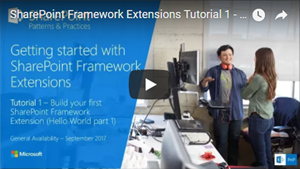
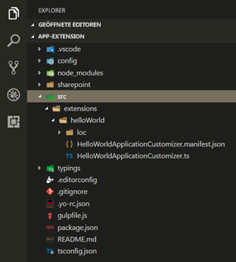

# <a name="build-your-first-sharepoint-framework-extension-hello-world-part-1"></a>Erstellen Ihrer ersten SharePoint-Framework-Erweiterung (Hello World, Teil 1)

SharePoint-Framework (SPFx)-Erweiterungen sind clientseitige Komponenten, die im Kontext einer SharePoint-Seite ausgeführt werden. Sie können Erweiterungen in SharePoint Online bereitstellen und mithilfe aktueller JavaScript-Tools und -Bibliotheken erstellen.

Sie können die in diesem Artikel beschriebenen Schritte auch anhand des Videos in unserem [YouTube-Kanal „SharePoint Patterns & Practices“](https://www.youtube.com/watch?v=0BeS0HukW24&list=PLR9nK3mnD-OXtWO5AIIr7nCR3sWutACpV) nachvollziehen. 

<a href="https://www.youtube.com/watch?v=yrFNu6K7iuU">

</a>

## <a name="create-an-extension-project"></a>Erstellen eines Erweiterungsprojekts

1. Erstellen Sie an einem Speicherort Ihrer Wahl ein neues Projektverzeichnis:

    ```
    md app-extension
    ```

2. Wechseln Sie in das Projektverzeichnis:

    ```
    cd app-extension
    ```

3. Führen Sie den Yeoman-SharePoint-Generator aus, um eine neue HelloWorld-Erweiterung zu erstellen:

    ```
    yo @microsoft/sharepoint
    ```

4. Es werden verschiedene Eingabeaufforderungen angezeigt. Gehen Sie wie folgt vor:

    * Übernehmen Sie den Standardwert **app-extension** als Lösungsnamen, und drücken Sie die EINGABETASTE.
    * Wählen Sie **SharePoint Online only (latest)**, und drücken Sie die EINGABETASTE.
    * Wählen Sie **Use the current folder** aus, und drücken Sie die EINGABETASTE.
    * Wählen Sie **N**, damit die Erweiterung auf jeder Website explizit installiert werden muss, wenn sie verwendet wird. 
    * Wählen Sie **Extension** als den zu erstellenden Typ von clientseitiger Komponente aus. 
    * Wählen Sie **Application Customizer** als den zu erstellenden Erweiterungstyp aus.

5. Über die nächsten Eingabeaufforderungen werden spezifische Informationen zu der Erweiterung abgefragt. Es werden verschiedene Eingabeaufforderungen angezeigt. Gehen Sie wie folgt vor:

    * Übernehmen Sie den Standardwert **HelloWorld** als Namen für Ihre Erweiterung, und drücken Sie die EINGABETASTE.
    * Übernehmen Sie den Standardwert **HelloWorld description** als Beschreibung Ihrer Erweiterung, und drücken Sie die EINGABETASTE.

    <br/>

    

    > [!NOTE] 
    > Wenn der verwendete Erweiterungsname zu lang ist, können Probleme auftreten. Mit den bereitgestellten Eingaben wird ein Aliaseintrag für die JSON-Manifestdatei des Application Customizer generiert. Falls der Alias mehr als 40 Zeichen enthält, wird eine Ausnahme ausgelöst, wenn Sie versuchen, die Erweiterung mit `gulp serve --nobrowser` zu verarbeiten. Sie können dieses Problem beheben, indem Sie den Aliaseintrag später aktualisieren.

    An diesem Punkt installiert Yeoman die erforderlichen Abhängigkeiten und erstellt ein Gerüst für die Lösungsdateien sowie die **HelloWorld**-Erweiterung. Das kann einige Minuten dauern. 

    Nach Abschluss der Gerüsterstellung sollte folgende Erfolgsmeldung angezeigt werden:

    

    Details zur Behebung etwaiger Fehler finden Sie unter [Bekannte Probleme](../../known-issues-and-common-questions.md).

6. Sobald das Gerüst abgeschlossen ist, sperren Sie die Version der Projektabhängigkeiten, indem Sie den folgenden Befehl ausführen:

    ```sh
    npm shrinkwrap
    ```

7. Geben Sie als Nächstes Folgendes in die Konsole ein, um Visual Studio Code zu starten.

    ```
    code .
    ```

    > [!NOTE] 
    > Da die clientseitige SharePoint-Lösung auf HTML/TypeScript basiert, können Sie zur Erstellung Ihrer Erweiterung jeden Code-Editor verwenden, der clientseitige Entwicklung unterstützt.

    Wie Sie sehen, sieht die Standardlösungsstruktur wie die Lösungsstruktur clientseitiger Webparts aus. Hierbei handelt es sich um die grundlegende SharePoint-Framework-Lösungsstruktur, die für alle Lösungstypen vergleichbare Konfigurationsoptionen bereitstellt.

    

8. Öffnen Sie **HelloWorldApplicationCustomizer.manifest.json** im Ordner „src\extensions\helloWorld“.

    In dieser Datei sind der Erweiterungstyp und ein eindeutiger Bezeichner für die Erweiterung definiert. Sie benötigen diese ID später, um die Erweiterung zu debuggen und in SharePoint bereitzustellen.

    

## <a name="code-your-application-customizer"></a>Codieren des Anwendungsanpassers 

Öffnen Sie die Datei **HelloWorldApplicationCustomizer.ts** im Ordner **src\extensions\helloWorld**.

Beachten Sie, dass die Basisklasse für den Application Customizer aus dem **sp-application-base**-Paket importiert wird, das den SharePoint-Framework-Code enthält, der für den Application Customizer erforderlich ist. 


Die Logik für den Anwendungsanpasser ist in der **onInit**-Methode enthalten, die aufgerufen wird, wenn die clientseitige Erweiterung erstmalig auf der Seite aktiviert wird. Dieses Ereignis tritt nach Zuweisung von `this.context` und `this.properties` ein. Wie bei Webparts gibt `onInit()` eine Zusage zurück, die Sie verwenden können, um asynchrone Operationen auszuführen.

> [!NOTE] 
> Der Klassenkonstruktor wird in einer frühen Phase aufgerufen, wenn `this.context` und `this.properties` noch nicht definiert sind. Benutzerdefinierte Initiierungslogik wird an dieser Stelle nicht unterstützt.

Im Folgenden werden die Inhalte von **onInit()** in der Standardlösung aufgelistet. Die Standardlösung schreibt ein Protokoll in das Dev Dashboard und zeigt dann beim Rendern der Seite eine einfache JavaScript-Warnung an.


Wenn Ihr Anwendungsanpasser die JSON-Eingabe **ClientSideComponentProperties** verwendet, wird sie in das Objekt **BaseExtension.properties** deserialisiert. Sie können eine Benutzeroberfläche definieren, um sie zu beschreiben. Die Standardvorlage sucht nach einer Eigenschaft mit dem Namen **testMessage**. Wenn diese Eigenschaft bereitgestellt wird, wird diese in einer Warnmeldung ausgegeben.

## <a name="debug-your-application-customizer"></a>Debuggen des Anwendungsanpassers

SharePoint-Framework-Erweiterungen können derzeit nicht mit der lokalen Workbench getestet werden. Sie müssen sie mit einer SharePoint Online-Live-Website testen. Hierzu ist es nicht erforderlich, die Anpassung im App-Katalog bereitzustellen, was das Debugging vereinfacht und beschleunigt. 

1. Führen Sie den folgenden Befehl aus, um den Code zu kompilieren und die kompilierten Dateien auf Ihrem lokalen Computer zu hosten:

    ```
    gulp serve --nobrowser
    ```

    > [!NOTE] 
    > Wenn Sie das SPFx-Entwicklerzertifikat noch nicht installiert haben, meldet Workbench, dass das Laden von Skripts von „localhost“ nicht konfiguriert ist. Beenden Sie in diesem Fall den Prozess, der derzeit im Konsolenfenster ausgeüfhrt wird, führen Sie den Befehl `gulp trust-dev-cert` im Projektverzeichnis aus, um das Entwicklerzertifikat zu installieren, und führen Sie dann den Befehl `gulp serve --nobrowser` erneut aus.

    Sie verwenden die Option `--nobrowser`, da ein Start der lokalen Workbench nicht nötig ist, weil Erweiterungen nicht lokal gedebuggt werden können.

    Wenn der Code ohne Fehler kompiliert wurde, verarbeitet er das resultierende Manifest von https://localhost:4321.

    

2. Zum Testen der Erweiterung wechseln Sie zu einer Seite mit der modernen Listenansicht in Ihrer SharePoint-Umgebung, und fügen Sie die folgenden Abfragezeichenfolgen-Parameter an die URL an: Beachten Sie, dass Sie die ID entsprechend Ihrem eigenen Erweiterungsbezeichner aktualisieren müssen. Dieser ist in der Datei **HelloWorldApplicationCustomizer.manifest.json** verfügbar.

    ```json
        ?loadSPFX=true&debugManifestsFile=https://localhost:4321/temp/manifests.js&customActions={"e5625e23-5c5a-4007-a335-e6c2c3afa485":{"location":"ClientSideExtension.ApplicationCustomizer","properties":{"testMessage":"Hello as property!"}}}
    ```

    Weitere Details zu den URL-Abfrageparametern:

    * **loadSPFX=true**. Dient zum Sicherstellen, dass das SharePoint-Framework auf der Seite geladen wird. Aus Leistungsgründen wird das Framework erst geladen, wenn mindestens eine Erweiterung registriert wurde. Da keine Komponenten registriert sind, müssen Sie das Framework explizit laden.

    * **debugManifestsFile**. Gibt an, dass lokal verarbeitete SPFx-Komponenten geladen werden sollen. Das Ladeprogramm sucht nur an zwei Stellen nach Komponenten: im App-Katalog (nach Komponenten der bereitgestellten Lösung) und auf dem SharePoint-Manifestserver (nach den Systembibliotheken).

    * **customActions**. Simuliert eine benutzerdefinierte Aktion. Wenn Sie diese Komponente auf einer Website bereitstellen und registrieren, erstellen Sie dieses **CustomAction**-Objekt und beschreiben die verschiedenen Eigenschaften, die Sie dafür festlegen können. 
        * **Key**. Verwenden Sie die GUID der Erweiterung als Schlüssel, der der benutzerdefinierten Aktion zuzuordnen ist. Dieser muss dem ID-Wert der Erweiterung entsprechen, der in der JSON-Manifestdatei der Erweiterung zur Verfügung steht.
        * **Location**. Der Typ der benutzerdefinierten Aktion. Verwenden Sie `ClientSideExtension.ApplicationCustomizer` für die Application Customizer-Erweiterung.
        * **Properties**. Ein optionales JSON-Objekt mit Eigenschaften, die über den Member **this.properties** verfügbar sind. In diesem HelloWorld-Beispiel definiert es eine `testMessage`-Eigenschaft.


3. Wechseln Sie zu einer modernen Liste in SharePoint Online. Dies kann eine Liste oder eine Bibliothek sein. Anwendungsanpasser werden auch in modernen Seiten und auf der Seite „Websiteinhalte“ unterstützt. 

4. Erweitern Sie die URL mit den beschriebenen zusätzlichen Abfrageparametern. Beachten Sie, dass Sie die GUID entsprechend der ID des benutzerdefinierten Application Customizer aktualisieren müssen. 

    Die vollständige URL sollte ähnlich wie im folgenden Beispiel aussehen:

    ```json
    contoso.sharepoint.com/Lists/Contoso/AllItems.aspx?loadSPFX=true&debugManifestsFile=https://localhost:4321/temp/manifests.js&customActions={"e5625e23-5c5a-4007-a335-e6c2c3afa485":{"location":"ClientSideExtension.ApplicationCustomizer","properties":{"testMessage":"Hello as property!"}}}
    ```

5. Wählen Sie **Load debug scripts** aus, um weiter Skripts von Ihrem lokalen Host zu laden.

    

    <br/>

    Das Dialogmeldung sollte nun auf Ihrer Seite angezeigt werden.

    

    Dieses Dialogfeld wird von der SharePoint-Framework-Erweiterung ausgelöst. Da Sie die `testMessage`-Eigenschaft als Teil der Debug-Abfrageparameter bereitgestellt haben, ist diese in der Warnmeldung enthalten. Sie können Ihre Erweiterungsinstanzen basierend auf den Clientkomponenteneigenschaften konfigurieren, die für die Instanz im Laufzeitmodus übergeben werden.

> [!NOTE] 
> Wenn Probleme beim Debuggen auftreten, überprüfen Sie die URL-Abfrageparameter, die für die Abfrage verwendet wurden. In einigen Browsern werden die Parameter codiert, und in einigen Szenarien hat sich Auswirkungen auf das Verhalten.

## <a name="next-steps"></a>Nächste Schritte

Herzlichen Glückwunsch, Sie haben Ihre erste SharePoint Framework-Erweiterung erstellt! 

Um mit dem Erstellen der Erweiterung fortzufahren, lesen Sie [Verwenden von Seitenplatzhaltern aus dem Anwendungsanpasser (Hello World, Teil 2)](./using-page-placeholder-with-extensions.md). Sie verwenden das gleiche Projekt und nutzen bestimmte Inhaltsplatzhalter zum Ändern der Benutzeroberfläche von SharePoint. Ihnen wird bereits aufgefallen sein, dass der Befehl `gulp serve` immer noch im Konsolenfenster ausgeführt wird (oder in Visual Studio Code, falls Sie den Editor verwenden). Sie können ihn einfach weiterlaufen lassen und zum nächsten Artikel wechseln.

> [!NOTE]
> Wenn Sie einen Fehler in der Dokumentation oder im SharePoint-Framework finden, melden Sie ihn an das SharePoint Engineering unter Verwendung der [Fehlerliste im sp-dev-docs-Repository](https://github.com/SharePoint/sp-dev-docs/issues). Vielen Dank im Voraus für Ihr Feedback.