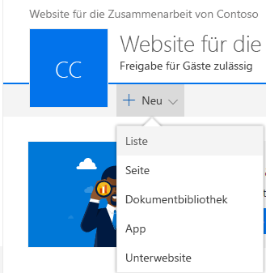
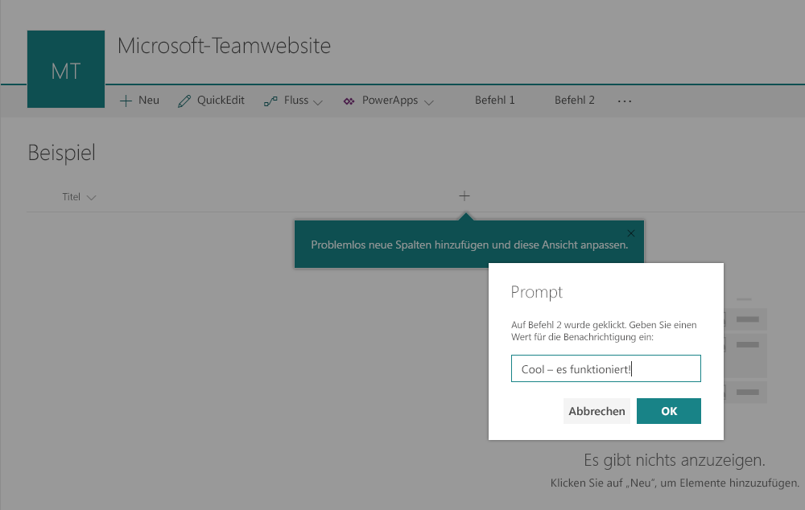

Wählen Sie die App **command-extension-client-side-solution** aus, um die Lösung auf der Website zu installieren. Aktualisieren Sie die Seite nach Abschluss der Installation mithilfe der Taste **F5**.Choose the **asset-deployment-webpart-client-side-solution** app to install the app on the site. When installation is completed, refresh the page by pressing **F5**.](../../../../images/ext-com-install-solution-to-site.png)

Wählen Sie die App **command-extension-client-side-solution** aus, um die Lösung auf der Website zu installieren. Aktualisieren Sie die Seite nach Abschluss der Installation mithilfe der Taste **F5**.

Klicken Sie nach der Installation der Anwendung auf **Neu** auf der Symbolleiste auf der Seite **Websiteinhalte**, und wählen Sie die Option **Liste** aus.When the application has been successfully installed, Click **New** from the toolbar on the **Site Contents** page and choose **List**

Geben Sie als Namen **Sample** ein, und klicken Sie auf **Erstellen**.Provide the name as **Sample** and click **Create**.

**Command One** und **Command Two** werden nun gemäß den Anpassungen in der Erweiterung des Typs „ListView Command Set“ auf der Symbolleiste gerendert.Notice how **Command One** and **Command Two** are being rendered in the toolbar based on your ListView Command Set customizations. 

