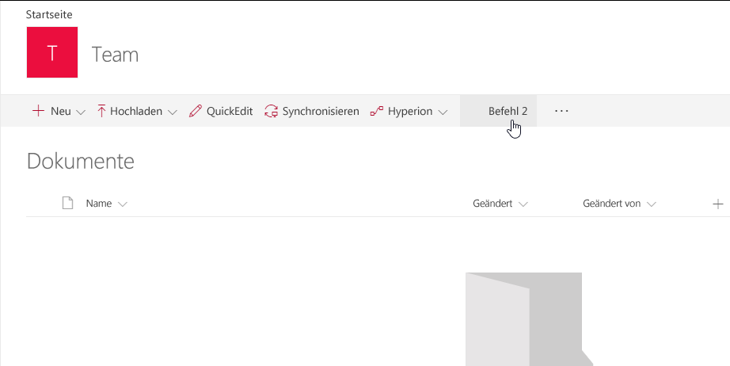
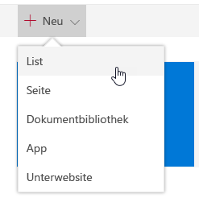

# <a name="build-your-first-listview-command-set-extension"></a>Erstellen Ihrer ersten Erweiterung des Typs „ListView Command Set“

Erweiterungen sind clientseitige Komponenten, die im Kontext einer SharePoint-Website ausgeführt werden. Erweiterungen lassen sich auf SharePoint Online bereitstellen und auch mithilfe aktueller JavaScript-Tools und -Bibliotheken erstellen.

In diesem Artikel wird beschrieben, wie Sie Ihre erste Erweiterung vom Typ „ListView Command Set“ erstellen. Sie können die nachfolgend beschriebene Anleitung auch anhand dieses Videos in unserem [YouTube-Kanal „SharePoint Patterns & Practices“](https://www.youtube.com/watch?v=iW0LQQqAY0Y&list=PLR9nK3mnD-OXtWO5AIIr7nCR3sWutACpV) nachvollziehen: 

<a href="https://www.youtube.com/watch?v=JBhgdSgWgdM">

</a>

## <a name="create-an-extension-project"></a>Erstellen eines Erweiterungsprojekts

1. Erstellen Sie an einem Speicherort Ihrer Wahl ein neues Projektverzeichnis:
    
    ```
    md command-extension
    ```
    
2. Wechseln Sie in das Projektverzeichnis:
    
    ```
    cd command-extension
    ```
    
3. Führen Sie den Yeoman-SharePoint-Generator aus, um eine neue HelloWorld-Erweiterung zu erstellen:
    
    ```
    yo @microsoft/sharepoint
    ```
    
4. Es werden verschiedene Eingabeaufforderungen angezeigt. Gehen Sie wie folgt vor:

    * Übernehmen Sie den Standardwert **command-extension** als Namen der Lösung, und drücken Sie die EINGABETASTE.
    * Wählen Sie **SharePoint Online only (latest)**, und drücken Sie die EINGABETASTE.
    * Wählen Sie **Use the current folder** aus, und drücken Sie die EINGABETASTE.
    * Wählen Sie **N**, damit die Erweiterung auf jeder Website explizit installiert werden muss, wenn sie verwendet wird. 
    * Wählen Sie **Extension** als den zu erstellenden Typ von clientseitiger Komponente aus. 
    * Wählen Sie **ListView Command Set** als den zu erstellenden Typ von Erweiterung aus.

5. Über die nächsten Eingabeaufforderungen werden spezifische Informationen zu der Erweiterung abgefragt:

    * Übernehmen Sie den Standardwert **HelloWorld** als Namen für Ihre Erweiterung, und drücken Sie die EINGABETASTE.
    * Übernehmen Sie den Standardwert **HelloWorld description** als Beschreibung Ihrer Erweiterung, und drücken Sie die EINGABETASTE.

    

    An diesem Punkt installiert Yeoman die erforderlichen Abhängigkeiten und erstellt ein Gerüst für die Lösungsdateien sowie die **HelloWorld**-Erweiterung. Das kann einige Minuten dauern.

    Nach Abschluss der Gerüsterstellung sollte folgende Erfolgsmeldung angezeigt werden:

    

    Details zur Behebung etwaiger Fehler finden Sie unter [Bekannte Probleme](../../known-issues-and-common-questions.md).

6. Sobald das Gerüst abgeschlossen ist, sperren Sie die Version der Projektabhängigkeiten, indem Sie den folgenden Befehl ausführen:

    ```sh
    npm shrinkwrap
    ```

7. Geben Sie als Nächstes Folgendes in die Konsole ein, um Visual Studio Code zu starten.

    ```
    code .
    ```

    > **Hinweis:** Da die clientseitige SharePoint-Lösung auf HTML/TypeScript basiert, können Sie zur Erstellung Ihrer Erweiterung jeden Code-Editor verwenden, der clientseitige Entwicklung unterstützt.

    Beachten Sie, dass die Standardlösungsstruktur wie die Lösungsstruktur für clientseitige Webparts aussieht. Dies ist die grundlegende SharePoint-Framework-Lösungsstruktur mit ähnlichen Konfigurationsoptionen über alle Lösungstypen hinweg.

    

8. Öffnen Sie die Datei **HelloWorldCommandSet.manifest.json** im Ordner **src\extensions\helloWorld**.

    Diese Datei definiert den Erweiterungstyp und eine eindeutige `id` für die Erweiterung. Sie benötigen diese eindeutige ID später beim Debuggen und Bereitstellen der Erweiterung in SharePoint.

    Beachten Sie die aktuellen Befehlsdefinitionen in der Manifestdatei. Es handelt sich hierbei um Schaltflächen, die auf Grundlage des Registrierungsziels verfügbar gemacht werden. In der Standardvorlage finden Sie zwei verschiedene Schaltflächen: **Command One** und **Command Two**.

    

    Derzeit lassen sich Bilder nur von absoluten Speicherorten in einem CDN korrekt im Manifest referenzieren. Dies wird in zukünftigen Versionen verbessert werden.

## <a name="code-your-listview-command-set"></a>Programmieren Ihrer Erweiterung des Typs „ListView Command Set“ 

Öffnen Sie die Datei **HelloWorldCommandSet.ts** im Ordner **src\extensions\helloWorld**.

Wie Sie sehen, wird die Basisklasse Ihrer Erweiterung des Typs „ListView Command Set“ aus dem Paket **sp-listview-extensibility** importiert. Es enthält SharePoint-Framework-Code, der von „ListView Command Set“ benötigt wird.

```ts
import { override } from '@microsoft/decorators';
import { Log } from '@microsoft/sp-core-library';
import {
  BaseListViewCommandSet,
  Command,
  IListViewCommandSetListViewUpdatedParameters,
  IListViewCommandSetExecuteEventParameters
} from '@microsoft/sp-listview-extensibility';
import { Dialog } from '@microsoft/sp-dialog';
```

Das Verhalten Ihrer benutzerdefinierten Schaltflächen wird in den Methoden **onListViewUpdated()** und **OnExecute()** definiert.

Das **onListViewUpdated()**-Ereignis tritt für jeden Befehl separat auf (z. B. ein Menüelement), wenn eine Änderung an ListView vorgenommen wurde und die Benutzeroberfläche erneut gerendert werden muss. Der `event`-Funktionsparameter gibt Informationen über den angezeigten Befehl an. Der Handler kann mithilfe dieser Informationen den Titel oder die Sichtbarkeit anpassen, beispielsweise wenn ein Befehl nur angezeigt werden soll, wenn eine bestimmte Anzahl von Elementen in der Listenansicht ausgewählt ist. Dies ist die Standardimplementierung.

Wenn Sie die `tryGetCommand`-Methode verwenden, erhalten Sie ein Command-Objekt, das den auf der Benutzeroberfläche angezeigten Befehl angibt. Sie können die zugehörigen Werte wie `title`, oder `visible` ändern, um das Benutzeroberflächenelement zu ändern. SPFx verwendet diese Informationen, wenn die Befehle neu gerendert werden müssen. Diese Objekte speichern den Status des letzten Renderings. Wenn ein Befehl zum Beispiel auf `visible = false` festgelegt wurde, wird er erst eingeblendet, wenn er wieder auf `visible = true` festgelegt wurde.

```ts
  @override
  public onListViewUpdated(event: IListViewCommandSetListViewUpdatedParameters): void {
    const compareOneCommand: Command = this.tryGetCommand('COMMAND_1');
    if (compareOneCommand) {
      // This command should be hidden unless exactly one row is selected.
      compareOneCommand.visible = event.selectedRows.length === 1;
    }
  }
```

Die **OnExecute()**-Methode definiert die Aktion beim Ausführen eines Befehls (wenn z. B. das Menüelement ausgewählt ist). In der Standardimplementierung werden je nach ausgewählter Schaltfläche unterschiedliche Meldungen angezeigt. 


```ts
  @override
  public onExecute(event: IListViewCommandSetExecuteEventParameters): void {
    switch (event.itemId) {
      case 'COMMAND_1':
        Dialog.alert(`${this.properties.sampleTextOne}`);
        break;
      case 'COMMAND_2':
        Dialog.alert(`${this.properties.sampleTextTwo}`);
        break;
      default:
        throw new Error('Unknown command');
    }
  }
```


## <a name="debug-your-listview-command-set-using-gulp-serve-and-query-string-parameters"></a>Debuggen Ihrer Erweiterung des Typs „ListView Command Set“ mit gulp serve und Abfragezeichenfolgeparametern

SharePoint-Framework-Erweiterungen können derzeit nicht mit der lokalen Workbench getestet werden. Sie müssen sie direkt mit einer SharePoint Online-Live-Website testen und bereitstellen. Hierzu ist es nicht erforderlich, die Anpassung im App-Katalog bereitzustellen, was das Debugging vereinfacht und beschleunigt. 

1. Zunächst führen Sie den folgenden Befehl aus, um den Code zu kompilieren und die Dateien auf Ihrem lokalen Computer zu hosten:

    ```
    gulp serve --nobrowser
    ```

    Sie verwenden die Option `--nobrowser`, da ein Start der lokalen Workbench nicht nötig ist, weil Erweiterungen nicht lokal gedebuggt werden können.

    Wenn der Code ohne Fehler kompiliert wurde, verarbeitet er das resultierende Manifest von https://localhost:4321.

2. Navigieren Sie auf Ihrer SharePoint Online-Website zu einer beliebigen SharePoint-Liste, indem Sie die moderne Oberfläche verwenden.
    
    Da unsere Erweiterung des Typs „ListView Command Set“ auf Localhost gehostet wird und aktuell ausgeführt wird, können wir den Code mithilfe spezifischer Debugabfrageparameter in der Listenansicht ausführen.
    
3. Hängen Sie die folgenden Abfragezeichenfolgenparameter an die URL an. Dabei müssen Sie die GUID durch die ID Ihrer Erweiterung des Typs „ListView Command Set“ aus der Datei **HelloWorldCommandSet.manifest.json** ersetzen. Weitere Informationen finden Sie unter [Weitere Details zu den URL-Abfrageparametern](#more-details-about-the-url-query-parameters).
    
    ```
    ?loadSpfx=true&debugManifestsFile=https://localhost:4321/temp/manifests.js&customActions={"a8047e2f-30d5-40fc-b880-b2890c7c16d6":{"location":"ClientSideExtension.ListViewCommandSet.CommandBar","properties":{"sampleTextOne":"One item is selected in the list.","sampleTextTwo":"This command is always visible."}}}
    ```

    Die vollständige URL sollte in etwa wie folgt aussehen, abhängig von der URL Ihres Mandanten und der Position der Liste.

    ```
    contoso.sharepoint.com/Lists/Orders/AllItems.aspx?loadSpfx=true&debugManifestsFile=https://localhost:4321/temp/manifests.js&customActions={"a8047e2f-30d5-40fc-b880-b2890c7c16d6":{"location":"ClientSideExtension.ListViewCommandSet.CommandBar","properties":{"sampleTextOne":"One item is selected in the list.","sampleTextTwo":"This command is always visible."}}}
    ```

4. Klicken Sie bei Aufforderung auf **Debugskripts laden**, um das Laden der Debugmanifeste zu akzeptieren.
    
    
    
5. Beachten Sie die neue Schaltfläche **Command Two**, die auf der Symbolleiste zur Verfügung steht. Wählen Sie diese Schaltfläche, um den als Eigenschaft für die `sampleTextTwo`-Eigenschaft bereitgestellten Text anzuzeigen.

    

6. Die Schaltfläche **Command One** wird basierend auf dem Code erst dann angezeigt, wenn eine Ziele in der Dokumentbibliothek ausgewählt ist. Erstellen Sie ein Dokument oder laden Sie es in die Bibliothek hoch, und stellen Sie sicher, dass die zweite Schaltfläche angezeigt wird.

    

7. Wählen Sie **Command Two** aus, um zu sehen, wie die Dialogfeldsteuerung funktioniert, die in der Standardausgabe aus dem Lösungsgerüst verwendet wird, wenn „ListView Command Set“ als Erweiterungstyp ausgewählt ist. 

    


### <a name="more-details-about-the-url-query-parameters"></a>Weitere Details zu den URL-Abfrageparametern

- **loadSPFX=true** dient zum Sicherstellen, dass das SharePoint-Framework auf der Seite geladen wird. Aus Leistungsgründen wird das Framework erst geladen, wenn mindestens eine Erweiterung registriert wurde. Da keine Komponenten registriert sind, müssen Sie das Framework explizit laden.
- **debugManifestsFile** gibt an, dass lokal verarbeitete SPFx-Komponenten geladen werden sollen. Das Ladeprogramm sucht nur an zwei Stellen nach Komponenten: im App-Katalog (nach Komponenten der bereitgestellten Lösung) und auf dem SharePoint-Manifestserver (nach den Systembibliotheken).
- **customActions** simuliert eine benutzerdefinierte Aktion. Sie können zahlreiche Eigenschaften für dieses `CustomAction`-Objekt festlegen, die sich auf die Darstellung und den Ort der Schaltfläche auswirken. Diese werden zu einem späteren Zeitpunkt erläutert.
    - **Key**: die GUID der Erweiterung
    - **Location:**: Ort, wo die Befehle angezeigt werden sollen. Die folgenden Werte sind möglich:
        - **ClientSideExtension.ListViewCommandSet.ContextMenu:** im Kontextmenü der Elemente
        - **ClientSideExtension.ListViewCommandSet.CommandBar:** im oberen Befehlssatzmenü in einer Liste oder Bibliothek
        - **ClientSideExtension.ListViewCommandSet:** sowohl im Kontextmenü als auch auf der Befehlsleiste (entspricht SPUserCustomAction.Location="CommandUI.Ribbon")
    - **Properties:**: ein optionales JSON-Objekt mit Eigenschaften, die über den Member `this.properties` verfügbar gemacht werden.

<br/>

## <a name="enhance-the-listview-command-set-rendering"></a>Erweitern der Darstellung von Erweiterungen des Typs „ListView Command Set“

Für die Standardlösung nutzen wir eine neue Dialogfeld-API, mit der Sie über Ihren Code ganz einfach modale Dialogfelder anzeigen lassen können. In den folgenden Schritten wird nun die Standardoberfläche leicht geändert, um Anwendungsfälle der Dialogfeld-API zu demonstrieren.

1. Wechseln Sie wieder zur Konsole, und führen Sie den folgenden Befehl aus, um die Dialogfeld-API in die Lösung einzuschließen.

2. Wechseln Sie wieder zu Visual Studio Code (oder Ihrem bevorzugten Editor).

3. Öffnen Sie die Datei **HelloWorldCommandSet.ts** im Ordner **src\extensions\helloWorld**.

4. Fügen Sie hinter den bereits vorhandenen Importanweisungen die folgende Importanweisung für den Import der Klasse `Dialog` aus `@microsoft/sp-dialog` ein. 

5. Aktualisieren Sie die Methode **onExecute** wie folgt:
    
    ```ts
      @override
      public onExecute(event: IListViewCommandSetExecuteEventParameters): void {
        switch (event.commandId) {
          case 'COMMAND_1':
            Dialog.alert(`Clicked ${strings.Command1}`);
            break;
          case 'COMMAND_2':
            Dialog.prompt(`Clicked ${strings.Command2}. Enter something to alert:`).then((value: string) => {
              Dialog.alert(value);
            });
            break;
          default:
            throw new Error('Unknown command');
        }
      }
    ``` 
    
6. Stellen Sie in dem Konsolenfenster sicher, dass keine Ausnahmen vorhanden sind. Wenn die Lösung nicht in localhost ausgeführt wird, führen Sie den folgenden Befehl aus:

    ```
    gulp serve --nobrowser
    ```

7. Verwenden Sie in der Listenansicht dieselben Abfrageparameter wie zuvor, nun mit der ID des Bezeichners Ihrer Erweiterung aus der Datei **HelloWorldCommandSet.manifest.json**.

8. Klicken Sie bei Aufforderung auf **Debugskripts laden**, um das Laden der Debugmanifeste zu akzeptieren.

    

    Auf der Symbolleiste werden weiterhin dieselben Schaltflächen angezeigt, sie verhalten sich nun jedoch anders, wenn sie einzeln ausgewählt werden. Wir verwenden jetzt die neue Dialogfeld-API, die sogar für komplexe Szenarien problemlos verwendet werden kann. 

    


## <a name="add-a-listview-command-set-to-a-solution-package-for-deployment"></a>Hinzufügen einer Erweiterung des Typs „ListView Command Set“ zu einem Lösungspaket zwecks Bereitstellung

1. Wechseln Sie wieder zu Ihrer Lösung in Visual Studio Code (oder Ihrem bevorzugten Editor).

2. Erweitern Sie im Stammverzeichnis der Lösung den Ordner **sharepoint** und den Unterordner **assets**, um die vorhandene Datei **elements.xml** anzuzeigen. 
    
    
    
### <a name="review-the-elementsxml-file"></a>Prüfen der Datei „elements.xml“ 

Öffnen Sie im Ordner **sharepoint\assets** die Datei mit dem Namen **elements.xml**.

Beachte Sie die folgende XML-Struktur in **elements.xml**. Für die Eigenschaft **ClientSideComponentId** wurde die eindeutige ID Ihrer Erweiterung vom Typ „ListView Command Set“ aus der Datei **HelloWorldCommandSet.manifest.json** im Ordner **src\extensions\helloWorld** automatisch angegeben.

Beachten Sie, dass wir einen bestimmten Location-Wert von `ClientSideExtension.ListViewCommandSet.CommandBar` verwenden, um die Erweiterung als „ListView Command Set“ zu definieren und anzugeben, dass sie in der Befehlsleiste angezeigt werden soll. Wir definieren auch `RegistrationId` als **100** und `RegistrationType` als **Liste**, um diese benutzerdefinierte Aktion automatisch generischen Listen zuzuordnen. `ClientSideComponentProperties` kann verwendet werden, um instanzspezifische Konfigurationen bereitzustellen. In diesem Fall verwenden wir die Standardeigenschaften *sampleTextOne* und *sampleTextTwo*.

```xml
<?xml version="1.0" encoding="utf-8"?>
<Elements xmlns="http://schemas.microsoft.com/sharepoint/">

    <CustomAction 
        Title="SPFxListViewCommandSet"
        RegistrationId="100"
        RegistrationType="List"
        Location="ClientSideExtension.ListViewCommandSet.CommandBar"
        ClientSideComponentId="5fc73e12-8085-4a4b-8743-f6d02ffe1240"
        ClientSideComponentProperties="{&quot;sampleTextOne&quot;:&quot;One item is selected in the list.&quot;, &quot;sampleTextTwo&quot;:&quot;This command is always visible.&quot;}">

    </CustomAction>

</Elements>
```

Für eine Erweiterung des Typs „ListView Command Set“ können Sie folgende Positionswerte angeben:

* `ClientSideExtension.ListViewCommandSet.CommandBar`: auf der Symbolleiste der Liste oder Bibliothek
* `ClientSideExtension.ListViewCommandSet.ContextMenu`: im Kontextmenü von Listen- oder Bibliothekselementen
* `ClientSideExtension.ListViewCommandSet`: Registrierung von Befehlen sowohl auf der Symbolleiste als auch im Kontextmenü

### <a name="ensure-that-definitions-are-taken-into-account-within-the-build-pipeline"></a>Gewährleisten der Berücksichtigung von Definitionen in der Buildpipeline

Öffnen Sie die Datei **package-solution.json** im Ordner **config**. Die Datei **package-solution.json** enthält die Paketmetadaten, definiert wie folgt:

```json
{
  "$schema": "https://dev.office.com/json-schemas/spfx-build/package-solution.schema.json",
  "solution": {
    "name": "command-extension-client-side-solution",
    "id": "690ae189-a4fc-4b98-8f28-d4ec17448b7a",
    "version": "1.0.0.0",
    "features": [
      {
        "title": "Application Extension - Deployment of custom action.",
        "description": "Deploys a custom action with ClientSideComponentId association",
        "id": "e91d5532-3519-4b50-b55e-b142fc74cd8a",
        "version": "1.0.0.0",
        "assets": {
          "elementManifests": [
            "elements.xml"
          ]
        }
      }
    ]
  },
  "paths": {
    "zippedPackage": "solution/command-extension.sppkg"
  }
}
```

Um sicherzustellen, dass die Datei **element.xml** beim Packen der Lösung berücksichtigt wird, hat das Standardgerüst die benötigte Konfiguration hinzugefügt, um eine Framework-Featuredefinition für das Lösungspaket zu definieren.

## <a name="deploy-the-extension-to-sharepoint-online-and-host-javascript-from-local-host"></a>Bereitstellen der Erweiterung in SharePoint Online und Hosten des JavaScript-Codes über Localhost

Nun können Sie die Lösung auf einer SharePoint-Website bereitstellen und das Objekt `CustomAction` automatisch auf Website-Ebene verknüpfen.

1. Geben Sie im Konsolenfenster den folgenden Befehl ein, um die clientseitige Lösung, die die Erweiterung enthält, zu verpacken und so die Grundstruktur für die Paketerstellung zu erstellen:
    
    ```
    gulp bundle
    ```
    
2. Führen Sie den folgenden Befehl aus, um das Lösungspaket zu erstellen:
    
    ```
    gulp package-solution
    ```
    
    Der Befehl erstellt das Paket im Ordner **sharepoint/solution**:
    
    ```
    command-extension.sppkg
    ```
    
3. Als Nächstes müssen Sie das Paket, das generiert wurde, im App-Katalog bereitstellen. Wechseln Sie dazu zum **App-Katalog** Ihres Mandanten, und öffnen Sie die Bibliothek **Apps für SharePoint**.

4. Laden Sie das Paket `command-extension.sppkg`, das sich im Ordner **sharepoint/solution** befindet, in den App-Katalog hoch, oder platzieren Sie es dort per Drag & Drop. In SharePoint wird ein Dialogfeld angezeigt, und Sie werden aufgefordert, der clientseitigen Lösung zu vertrauen.

    Da wir die Host-URLs der Lösung für diese Bereitstellung nicht aktualisiert haben, verweist die URL immer noch auf https://localhost:4321. 
    
5. Klicken Sie auf die Schaltfläche **Bereitstellen**.

    

6. Stellen Sie in der Konsole sicher, dass die Lösung ausgeführt wird. Wenn sie nicht ausgeführt wird, führen Sie den folgenden Befehl im Lösungsordner aus:

    ```
    gulp serve --nobrowser
    ```

7. Wechseln Sie zu der Website, auf der Sie die Bereitstellung der SharePoint-Ressource testen möchten. Dies könnte eine Websitesammlung im Mandanten sein, auf dem Sie dieses Lösungspaket bereitgestellt haben.

8. Klicken Sie auf der oberen Navigationsleiste rechts auf das Zahnradsymbol und anschließend auf **App hinzufügen**, um Ihre Apps-Seite aufzurufen.

9. Geben Sie in das **Suchfeld** die Zeichenfolge **extension** ein, und drücken Sie die EINGABETASTE, um Ihre Apps zu filtern.

    

10. Wählen Sie die App **command-extension-client-side-solution**, um die Lösung auf der Website zu installieren. Wenn die Installation abgeschlossen ist, aktualisieren Sie die Seite, indem Sie **F5** drücken.

11. Klicken Sie nach der Installation der Anwendung auf der Symbolleiste auf der Seite **Websiteinhalte** auf **Neu**, und wählen Sie die Option **Liste** aus.

    

12. Geben Sie als Namen **Sample** ein, und klicken Sie auf **Erstellen**.

    **Command One** und **Command Two** werden nun gemäß den Anpassungen in der Erweiterung des Typs „ListView Command Set“ auf der Symbolleiste gerendert. 

    
