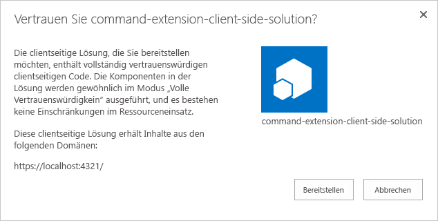

# <a name="build-your-first-listview-command-set-extension"></a>Erstellen Ihrer ersten Erweiterung des Typs „ListView Command Set“

>**Hinweis:** Die SharePoint Framework-Erweiterungen befinden sich derzeit in der Preview-Phase. Änderungen sind vorbehalten. Die Verwendung von SharePoint Framework-Erweiterungen in Produktionsumgebungen wird aktuell nicht unterstützt.

Erweiterungen sind clientseitige Komponenten, die im Kontext einer SharePoint-Seite ausgeführt werden. Sie lassen sich in SharePoint Online bereitstellen und mithilfe aktueller JavaScript-Tools und -Bibliotheken erstellen.

>**Hinweis:** Bevor Sie die Schritte in diesem Artikel durchführen, müssen Sie [Ihre Entwicklungsumgebung einrichten](../../set-up-your-development-environment). Beachten Sie, dass Erweiterungen derzeit **AUSSCHLIESSLICH** über Office 365-Entwicklermandanten verfügbar sind.

>**Hinweis:** Erweiterungen des Typs „ListView Command Set“ lassen sich derzeit nur mit der modernen Oberfläche auf klassischen SharePoint-Websites debuggen. Stellen Sie sicher, dass Sie für die Tests eine klassische Teamwebsite mit moderner Listenoberfläche verwenden.

## <a name="create-an-extension-project"></a>Erstellen eines Erweiterungsprojekts
Erstellen Sie an einem Speicherort Ihrer Wahl ein neues Projektverzeichnis:

```
md command-extension
```

Wechseln Sie in das Projektverzeichnis:

```
cd command-extension
```

Führen Sie den Yeoman-SharePoint-Generator aus, um eine neue HelloWorld-Erweiterung zu erstellen:

```
yo @microsoft/sharepoint
```

Es werden verschiedene Eingabeaufforderungen angezeigt. Gehen Sie wie folgt vor:

* Übernehmen Sie den Standardwert **command-extension** als Namen der Lösung, und drücken Sie die **EINGABETASTE**.
* Wählen Sie **Extension (Preview)** als den zu erstellenden Typ von clientseitiger Komponente aus. 
* Wählen Sie **ListView Command Set (Preview)** als den zu erstellenden Typ von Erweiterung aus.

Über die nächsten Eingabeaufforderungen werden spezifische Informationen zu der Erweiterung abgefragt:

* Übernehmen Sie den Standardwert **HelloWorld** als Namen für Ihre Erweiterung, und drücken Sie die **EINGABETASTE**.
* Übernehmen Sie den Standardwert **HelloWorld description** als Beschreibung Ihrer Erweiterung, und drücken Sie die **EINGABETASTE**.


An diesem Punkt installiert Yeoman die erforderlichen Abhängigkeiten und erstellt ein Gerüst für die Lösungsdateien sowie die **HelloWorld**-Erweiterung. Das kann einige Minuten dauern. 

Nach Abschluss der Gerüsterstellung sollte folgende Erfolgsmeldung angezeigt werden:


Details zur Behebung etwaiger Fehler finden Sie unter [Known issues](../basics/known-issues).

Geben Sie nach der Erstellung des Lösungsgerüsts Folgendes in die Konsole ein, um Visual Studio Code zu starten:

```
code .
```

> Beachten Sie: Da die clientseitige SharePoint-Lösung auf HTML/TypeScript basiert, können Sie zur Erstellung Ihrer Erweiterung jeden Code-Editor verwenden, der clientseitige Entwicklung unterstützt.

Wie Sie sehen, entspricht die Standardlösungsstruktur der Lösungsstruktur clientseitiger Webparts. Hierbei handelt es sich um die grundlegende SharePoint Framework-Lösungsstruktur, die für alle Lösungstypen vergleichbare Konfigurationsoptionen bereitstellt.


Öffnen Sie die Datei **HelloWorldCommandSet.manifest.json** im Ordner **src\extensions\helloWorld**.

In dieser Datei sind der Erweiterungstyp und ein eindeutiger Bezeichner **„id“** für die Erweiterung definiert. Sie benötigen diesen eindeutigen Bezeichner später, um die Erweiterung zu debuggen und in SharePoint bereitzustellen.

In der Manifestdatei finden Sie auch die tatsächlichen Befehlsdefinitionen. Hierbei handelt es sich um die Schaltflächen, die später basierend auf dem Registrierungsziel verfügbar gemacht werden. In der Standardvorlage sind zwei Schaltflächen definiert: *„Command One“* und *„Command Two“*.


> Derzeit lassen sich Bilder nur von absoluten Speicherorten in einem CDN korrekt im Manifest referenzieren. Dies wird in zukünftigen Versionen verbessert werden.

## <a name="coding-your-listview-command-set"></a>Programmieren Ihrer Erweiterung des Typs „ListView Command Set“ 
Öffnen Sie die Datei **HelloWorldCommandSet.ts** im Ordner **src\extensions\helloWorld**.

Wie Sie sehen, wird die Basisklasse Ihrer Erweiterung des Typs „ListView Command Set“ aus dem Paket **sp-listview-extensibility** importiert. Es enthält SharePoint Framework-Code, der von „ListView Command Set“ benötigt wird.


Das Verhalten Ihrer benutzerdefinierten Schaltflächen wird in den Methoden **onRefreshCommand()** und **OnExecute()** definiert.

Das Ereignis **onRefreshCommand()** tritt für jeden Befehl (d. h. für jedes Menüelement) separat ein, und zwar immer dann, wenn die Anwendung versucht, den Befehl auf der Benutzeroberfläche anzuzeigen. Der Funktionsparameter `“event”` enthält Informationen über den zu rendernden Befehl. Anhand dieser Informationen kann der Handler den Titel und die Sichtbarkeit anpassen. Soll ein Befehl beispielsweise nur angezeigt werden, wenn eine bestimmte Anzahl von Elementen in der Listenansicht ausgewählt wurde, würde das standardmäßig wie folgt implementiert:

```ts
  @override
  public onRefreshCommand(event: IListViewCommandSetRefreshEventParameters): void {
    event.visible = true; // assume true by default

    if (this.properties.disabledCommandIds) {
      if (this.properties.disabledCommandIds.indexOf(event.commandId) >= 0) {
        Log.info(LOG_SOURCE, 'Hiding command ' + event.commandId);
        event.visible = false;
      }
    }
  }
```
Die Methode **OnExecute()** definiert, was passiert, wenn ein Befehl ausgeführt wird (d. h. wenn der Benutzer auf das Menüelement klickt). In der Standardimplementierung werden unterschiedliche Meldungen angezeigt, je nachdem, auf welche Schaltfläche der Benutzer klickt: 

```ts
  @override
  public onExecute(event: IListViewCommandSetExecuteEventParameters): void {
    switch (event.commandId) {
      case 'COMMAND_1':
        alert(`Clicked ${strings.Command1}`);
        break;
      case 'COMMAND_2':
        alert(`Clicked ${strings.Command2}`);
        break;
      default:
        throw new Error('Unknown command');
    }
  }
```


## <a name="debugging-your-listview-command-set-using-gulp-serve-and-query-string-parameters"></a>Debuggen Ihrer Erweiterung des Typs „ListView Command Set“ mit gulp serve und Abfragezeichenfolgeparametern
SharePoint Framework-Erweiterungen lassen sich aktuell nicht mithilfe der lokalen Workbench testen. Sie müssen direkt auf einer aktiven SharePoint Online-Website getestet und entwickelt werden. Dazu ist es jedoch nicht nötig, Ihre Anpassung im App-Katalog bereitzustellen. Dadurch bleibt das Debuggen einfach und effizient. 

Zunächst führen Sie den folgenden Befehl aus, um den Code zu kompilieren und die Dateien auf Ihrem lokalen Computer zu hosten:
```
gulp serve --nobrowser
```

Die Option `--nobrowser` verwenden wir, weil Erweiterungen derzeit nicht lokal debuggt werden können und daher keine Notwendigkeit besteht, die lokale Workbench zu starten.

Sobald der Code ohne Fehler kompiliert wurde, wird das resultierende Manifest von *http://localhost:4321* ausgeliefert.

Navigieren Sie auf Ihrer SharePoint Online-Website zu einer beliebigen SharePoint-Liste, die die moderne Oberfläche verwendet.

Da unsere Erweiterung des Typs „ListView Command Set“ auf Localhost gehostet wird und aktuell ausgeführt wird, können wir den Code mithilfe spezifischer Debugabfrageparameter in der Listenansicht ausführen.

Fügen Sie die folgenden Abfragezeichenfolgeparameter an die URL an. Dabei müssen Sie die GUID durch die ID Ihrer Erweiterung des Typs „ListView Command Set“ aus der Datei **HelloWorldCommandSet.manifest.json** ersetzen:

```
?loadSpfx=true&debugManifestsFile=https://localhost:4321/temp/manifests.js&customActions={"81b6a3d7-e408-43a4-8ef1-180d0f2582cc":{"location":"ClientSideExtension.ListViewCommandSet.CommandBar"}}
```

* **loadSPFX=true:** Dieser Parameter stellt sicher, dass SharePoint Framework auf der Seite geladen wird. Aus Leistungsgründen wird das Framework normalerweise erst geladen, wenn mindestens eine Erweiterung registriert ist. Da aktuell noch keine Komponenten registriert sind, müssen Sie das Framework explizit laden.
* **debugManifestsFile:** Dieser Parameter gibt an, dass lokal ausgelieferte SPFx-Komponenten geladen werden sollen. Normalerweise sucht das Ladeprogramm nur an zwei Orten nach Komponenten: im App-Katalog (nach Komponenten der bereitgestellten Lösung) und auf dem SharePoint-Manifestserver (nach den Systembibliotheken).
* **customActions:** Dieser URL-Abfrageparameter simuliert eine benutzerdefinierte Aktion. Für das Objekt *CustomAction* lassen sich zahlreiche Eigenschaften festlegen, die das Design und die Position Ihrer Schaltfläche beeinflussen. Mehr dazu finden Sie weiter unten in diesem Artikel.
    * **Key:** die GUID der Erweiterung
    * **location:** wo die Befehle angezeigt werden sollen. Die möglichen Werte sind:
        * **ClientSideExtension.ListViewCommandSet.ContextMenu:** im Kontextmenü der Elemente
        * **ClientSideExtension.ListViewCommandSet.CommandBar:** im oberen Befehlssatzmenü in einer Liste oder Bibliothek
        * **ClientSideExtension.ListViewCommandSet:** sowohl im Kontextmenü als auch auf der Befehlsleiste (entspricht SPUserCustomAction.Location="CommandUI.Ribbon")
* **Properties:** ein optionales JSON-Objekt mit Eigenschaften, die über den Member `this.properties` verfügbar gemacht werden.

Die vollständige URL sollte in etwa wie folgt aussehen, abhängig von der URL Ihres Mandanten und der Position der Liste.

```
contoso.sharepoint.com/Lists/Orders/AllItems.aspx?loadSpfx=true&debugManifestsFile=https://localhost:4321/temp/manifests.js&customActions={"81b6a3d7-e408-43a4-8ef1-180d0f2582cc":{"location":"ClientSideExtension.ListViewCommandSet.CommandBar"}}
```

Klicken Sie bei Aufforderung auf **Load debug scripts**, um das Laden der Debugmanifeste zu akzeptieren.


Nun sehen Sie zwei neue Schaltflächen auf der Symbolleiste mit den Titeln *Command One* und *Command Two*.


## <a name="enhancing-the-listview-command-set-rendering"></a>Erweitern der Darstellung von Erweiterungen des Typs „ListView Command Set“
Für dieses Beispiel nutzen wir eine neue Dialogfeld-API, mit der Sie über Ihren Code ganz einfach modale Dialogfelder anzeigen lassen können. 

Wechseln Sie wieder zur Konsole, und führen Sie den folgenden Befehl aus, um die Dialogfeld-API in die Lösung einzuschließen:

``` 
npm install @microsoft/sp-dialog --save
```

Wechseln Sie wieder zu Visual Studio Code (oder Ihrem bevorzugten Editor).

Öffnen Sie die Datei **HelloWorldCommandSet.ts** im Ordner **src\extensions\helloWorld**.

Fügen Sie hinter den bereits vorhandenen Importanweisungen die folgende Importanweisung für den Import der Klasse `Dialog` aus `@microsoft/sp-dialog/lib/index` ein. 

```ts
import { Dialog } from '@microsoft/sp-dialog/lib/index';
``` 

Aktualisieren Sie die Methode **onExecute** wie folgt:

```ts
  @override
  public onExecute(event: IListViewCommandSetExecuteEventParameters): void {
    switch (event.commandId) {
      case 'COMMAND_1':
        Dialog.alert(`Clicked ${strings.Command1}`);
        break;
      case 'COMMAND_2':
        Dialog.prompt(`Clicked ${strings.Command2}. Enter something to alert:`).then((value: string) => {
          Dialog.alert(value);
        });
        break;
      default:
        throw new Error('Unknown command');
    }
  }
``` 
Wechseln Sie wieder in das Konsolenfenster, und vergewissern Sie sich, dass keine Ausnahmen angezeigt werden. Sollte die Lösung noch nicht auf Localhost ausgeführt werden, führen Sie den folgenden Befehl aus:

```
gulp serve --nobrowser
```

Rufen Sie wieder die Listenansicht auf, und verwenden Sie dieselben Abfrageparameter wie zuvor, nun mit der ID des Bezeichners Ihrer Erweiterung aus der Datei **HelloWorldCommandSet.manifest.json**.

Klicken Sie bei Aufforderung auf **Load debug scripts**, um das Laden der Debugmanifeste zu akzeptieren.


Es werden immer noch dieselben Schaltflächen auf der Symbolleiste angezeigt, sie verhalten sich nun aber anders, wenn Sie auf sie klicken. Jetzt wird die neue Dialogfeld-API verwendet, die sich selbst in komplexe Lösungsszenarien unkompliziert integrieren lässt. 


## <a name="adding-a-listview-command-set-to-a-solution-package-for-deployment"></a>Hinzufügen einer Erweiterung des Typs „ListView Command Set“ zu einem Lösungspaket zwecks Bereitstellung

Wechseln Sie wieder zu Ihrer Lösung in Visual Studio Code (oder Ihrem bevorzugten Editor).

Hier müssen Sie zunächst einen Ordner **assets** erstellen, in dem Sie alle Featureframeworkobjekte ablegen, die bei der Paketinstallation zur Bereitstellung von SharePoint-Strukturen verwendet werden.

* Erstellen Sie einen Ordner mit dem Namen **sharepoint** im Stammverzeichnis der Lösung.
* Erstellen Sie einen Ordner mit dem Namen **assets** als Unterordner im soeben erstellten Ordner **sharepoint**.

Die Lösungsstruktur sollte in etwa wie folgt aussehen:


### <a name="add-an-elementsxml-file-for-sharepoint-definitions"></a>Hinzufügen einer Datei „elements.xml“ mit SharePoint-Definitionen

Erstellen Sie im Ordner **sharepoint\assets** eine neue Datei mit dem Namen **elements.xml**.

Kopieren Sie die nachfolgende XML-Struktur in die Datei **elements.xml**. Vergessen Sie dabei nicht, für die Eigenschaft **ClientSideComponentId** die eindeutige ID Ihrer Erweiterung des Typs „ListView Command Set“ aus der Datei **HelloWorldCommandSet.manifest.json** im Ordner **src\extensions\helloWorld** anzugeben.

Wie Sie sehen, verwenden wir den Positionswert `ClientSideExtension.ListViewCommandSet.CommandBar`, um anzugeben, dass es sich um eine Erweiterung des Typs „ListView Command Set“ handelt, die auf der Befehlsleiste angezeigt werden soll. Wir legen außerdem für `RegistrationId` den Wert **100** fest und für `RegistrationType` den Wert **List**, um diese benutzerdefinierte Aktion automatisch mit generischen Listen zu verknüpfen.

```xml
<?xml version="1.0" encoding="utf-8"?>
<Elements xmlns="http://schemas.microsoft.com/sharepoint/">

    <CustomAction 
        Title="SPFxListViewCommandSet"
        RegistrationId="100"
        RegistrationType="List"
        Location="ClientSideExtension.ListViewCommandSet.CommandBar"
        ClientSideComponentId="5fc73e12-8085-4a4b-8743-f6d02ffe1240">

    </CustomAction>

</Elements>
```

Für eine Erweiterung des Typs „ListView Command Set“ können Sie folgende Positionswerte angeben:

* `ClientSideExtension.ListViewCommandSet.CommandBar`: auf der Symbolleiste der Liste oder Bibliothek
* `ClientSideExtension.ListViewCommandSet.ContextMenu`: im Kontextmenü von Listen- oder Bibliothekselementen
* `ClientSideExtension.ListViewCommandSet`: Registrierung von Befehlen sowohl auf der Symbolleiste als auch im Kontextmenü

### <a name="ensure-that-definitions-are-taken-into-account-within-the-build-pipeline"></a>Gewährleisten der Berücksichtigung von Definitionen in der Buildpipeline

Öffnen Sie die Datei **package-solution.json** im Ordner **config**. Die Datei **package-solution.json** enthält die Paketmetadaten, definiert wie folgt:

```json
{
  "solution": {
    "name": "command-extension-client-side-solution",
    "id": "dfffbe21-e422-4c0f-a302-d7d62a30c1bf",
    "version": "1.0.0.0"
  },
  "paths": {
    "zippedPackage": "solution/command-extension.sppkg"
  }
}
```

Um sicherzustellen, dass die neu hinzugefügte Datei **elements.xml** beim Verpacken der Lösung berücksichtigt wird, müssen wir eine Featureframework-Featuredefinition für das Lösungspaket einschließen. Dazu integrieren wir wie nachfolgend demonstriert eine JSON-Definition des benötigten Features in die Lösungsstruktur.

```json
{
  "solution": {
    "name": "command-extension-client-side-solution",
    "id": "dfffbe21-e422-4c0f-a302-d7d62a30c1bf",
    "version": "1.0.0.0",
    "features": [{
      "title": "ListView Command Set - Deployment of custom action.",
      "description": "Deploys a custom action with ClientSideComponentId association",
      "id": "456da147-ced2-3036-b564-8dad5c1c2e34",
      "version": "1.0.0.0",
      "assets": {        
        "elementManifests": [
          "elements.xml"
        ]
      }
    }]
  },
  "paths": {
    "zippedPackage": "solution/command-extension.sppkg"
  }
}
```

## <a name="deploy-the-extension-to-sharepoint-online-and-host-javascript-from-local-host"></a>Bereitstellen der Erweiterung in SharePoint Online und Hosten des JavaScript-Codes über Localhost

Nun können Sie die Lösung auf einer SharePoint-Website bereitstellen und das Objekt *CustomAction* automatisch auf Website-Ebene verknüpfen.

Geben Sie im Konsolenfenster den folgenden Befehl ein, um die clientseitige Lösung, die die Erweiterung enthält, zu verpacken und so die Grundstruktur für die Paketierung zu erstellen:

```
gulp bundle
```

Führen Sie als Nächstes den folgenden Befehl aus, um das Lösungspaket zu erstellen:

```
gulp package-solution
```

Der Befehl erstellt das Paket im Ordner **sharepoint/solution**:

```
command-extension.sppkg
```

Im nächsten Schritt müssen Sie das generierte Paket im App-Katalog bereitstellen.

Wechseln Sie zum **App-Katalog** Ihres Mandanten, und öffnen Sie die Bibliothek **Apps für SharePoint**.

Laden Sie das Paket `command-extension.sppkg` aus dem Ordner **sharepoint/solution** in den App-Katalog hoch, oder platzieren Sie es dort per Drag & Drop. SharePoint fordert Sie in einem Dialogfeld auf, der clientseitigen Lösung zu vertrauen.

Da wir die Host-URLs der Lösung für diese Bereitstellung nicht aktualisiert haben, verweist die URL immer noch auf `https://localhost:4321`. Klicken Sie auf die Schaltfläche **Bereitstellen**.



Wechseln Sie wieder zur Konsole, und vergewissern Sie sich, dass die Lösung ausgeführt wird. Sollte Sie nicht ausgeführt werden, führen Sie den folgenden Befehl im Lösungsordner aus:

```
gulp serve --nobrowser
```

Wechseln Sie zu der Website, auf der Sie die Bereitstellung der SharePoint-Ressource testen möchten. Dies könnte eine Websitesammlung im Mandanten sein, auf dem Sie dieses Lösungspaket bereitgestellt haben.

Klicken Sie auf der oberen Navigationsleiste rechts auf das Zahnradsymbol und anschließend auf **App hinzufügen**, um Ihre Apps-Seite aufzurufen.

Geben Sie in das **Suchfeld** die Zeichenfolge **command** ein, und drücken Sie die *EINGABETASTE*, um Ihre Apps zu filtern.


Wählen Sie die App **command-extension-client-side-solution** aus, um die Lösung auf der Website zu installieren. Aktualisieren Sie die Seite nach Abschluss der Installation mithilfe der Taste **F5**.

Klicken Sie nach der Installation der Anwendung auf **Neu** auf der Symbolleiste auf der Seite **Websiteinhalte**, und wählen Sie die Option **Liste** aus.


Geben Sie als Namen **Sample** ein, und klicken Sie auf **Erstellen**.

**Command One** und **Command Two** werden nun gemäß den Anpassungen in der Erweiterung des Typs „ListView Command Set“ auf der Symbolleiste gerendert. 


