# <a name="build-your-first-field-customizer-extension"></a>Erstellen Sie Ihre erste Field Customizer-Erweiterung

>**Hinweis:** Die SharePoint Framework-Erweiterungen befinden sich derzeit in der Preview-Phase. Änderungen sind vorbehalten. Die Verwendung von SharePoint Framework-Erweiterungen in Produktionsumgebungen wird aktuell nicht unterstützt.

Erweiterungen sind clientseitige Komponenten, die im Kontext einer SharePoint-Seite ausgeführt werden. Sie lassen sich in SharePoint Online bereitstellen und mithilfe aktueller JavaScript-Tools und -Bibliotheken erstellen.

>**Hinweis:** Bevor Sie die Schritte in diesem Artikel durchführen, müssen Sie [Ihre Entwicklungsumgebung einrichten](../../set-up-your-development-environment). Beachten Sie, dass Erweiterungen derzeit **AUSSCHLIESSLICH** über Office 365-Entwicklermandanten verfügbar sind.

>**Hinweis:** Field Customizer lassen sich derzeit nur mit der modernen Oberfläche auf klassischen SharePoint-Websites debuggen. Stellen Sie sicher, dass Sie für die Tests eine klassische Teamwebsite mit moderner Listenoberfläche verwenden.

## <a name="create-an-extension-project"></a>Erstellen eines Erweiterungsprojekts
Erstellen Sie an einem Speicherort Ihrer Wahl ein neues Projektverzeichnis:

```
md field-extension
```

Wechseln Sie in das Projektverzeichnis:

```
cd field-extension
```

Führen Sie den Yeoman-SharePoint-Generator aus, um eine neue HelloWorld-Erweiterung zu erstellen:

```
yo @microsoft/sharepoint
```

Es werden verschiedene Eingabeaufforderungen angezeigt. Gehen Sie wie folgt vor:

* Übernehmen Sie den Standardwert **field-extension** als Namen der Lösung, und drücken Sie die **EINGABETASTE**.
* Wählen Sie **Extension (Preview)** als den zu erstellenden Typ von clientseitiger Komponente aus. 
* Wählen Sie **Field Customizer (Preview)** als den zu erstellenden Erweiterungstyp aus.

Über die nächsten Eingabeaufforderungen werden spezifische Informationen zu der Erweiterung abgefragt:

* Übernehmen Sie den Standardwert **HelloWorld** als Namen für Ihre Erweiterung, und drücken Sie die **EINGABETASTE**.
* Übernehmen Sie den Standardwert **HelloWorld description** als Beschreibung Ihrer Erweiterung, und drücken Sie die **EINGABETASTE**.
* Übernehmen Sie den Standard **No JavaScript Framework** als Frameworkauswahl, und drücken Sie die **EINGABETASTE** 

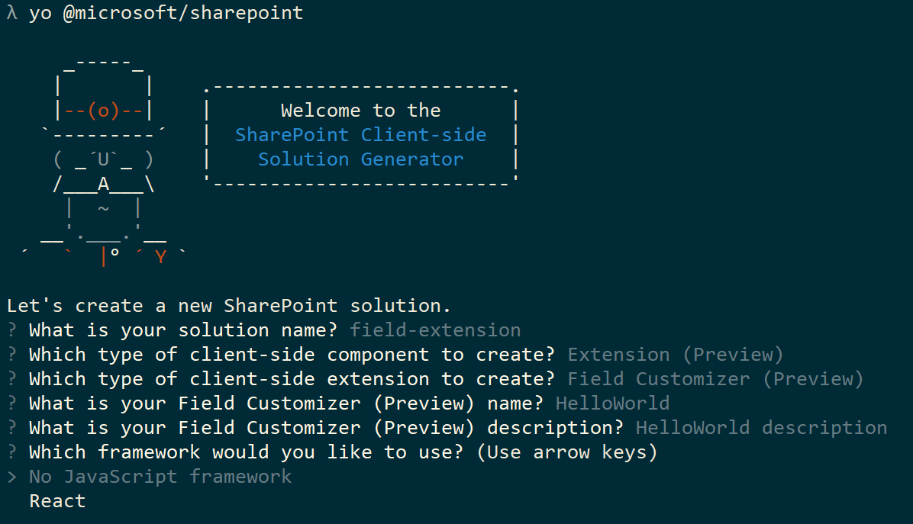

An diesem Punkt installiert Yeoman die erforderlichen Abhängigkeiten und erstellt ein Gerüst für die Lösungsdateien sowie die **HelloWorld**-Erweiterung. Das kann einige Minuten dauern. 

Nach Abschluss der Gerüsterstellung sollte folgende Erfolgsmeldung angezeigt werden:

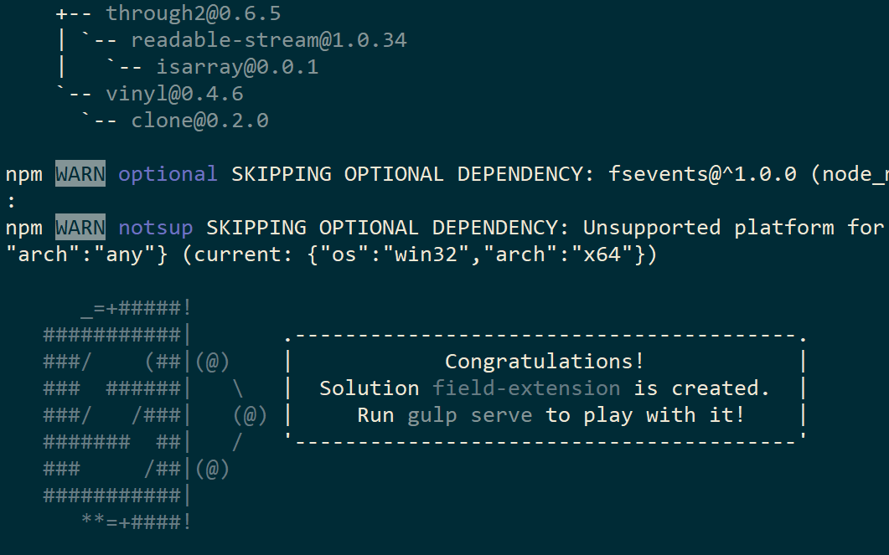

Details zur Behebung etwaiger Fehler finden Sie unter [Known issues](../basics/known-issues).

Geben Sie nach der Erstellung des Lösungsgerüsts Folgendes in die Konsole ein, um Visual Studio Code zu starten:

```
code .
```

> Beachten Sie: Da die clientseitige SharePoint-Lösung auf HTML/TypeScript basiert, können Sie zur Erstellung Ihrer Erweiterung jeden Code-Editor verwenden, der clientseitige Entwicklung unterstützt.

Wie Sie sehen, entspricht die Standardlösungsstruktur der Lösungsstruktur clientseitiger Webparts. Hierbei handelt es sich um die grundlegende SharePoint Framework-Lösungsstruktur, die für alle Lösungstypen vergleichbare Konfigurationsoptionen bereitstellt.

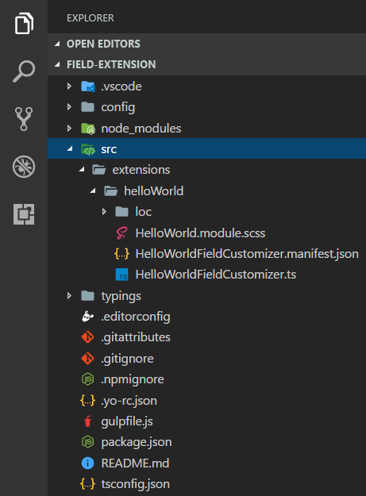

Öffnen Sie **HelloWorldFieldCustomizer.manifest.json** im Ordner **src\extensions\helloWorld**.

In dieser Datei sind der Erweiterungstyp und ein eindeutiger Bezeichner **„id“** für die Erweiterung definiert. Sie benötigen diesen eindeutigen Bezeichner später, um die Erweiterung zu debuggen und in SharePoint bereitzustellen.

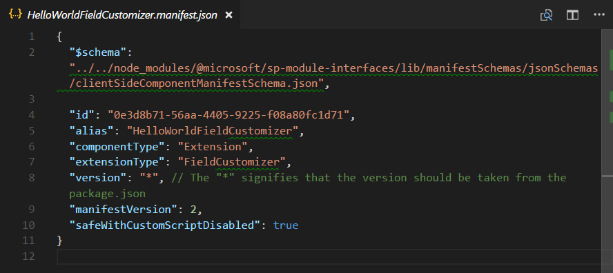

## <a name="coding-your-field-customizer"></a>Coding des Field Customizers 
Öffnen Sie die Datei **HelloWorldFieldCustomizer.ts** im Ordner **src\extensions\helloWorld**.

Beachten Sie, dass die Basisklasse für den Field Customizer aus dem **sp-application-base**-Paket importiert wird, das den SharePoint-Frameworkcode enthält, der für den Field Customizer erforderlich ist.


Die Logik für den Field Customizer befindet sich in den Methoden **OnInit()**, **onRenderCell()** und **onDisposeCell()**.

* **onInit():** Hier müssen Sie das Setup vornehmen, das für die Erweiterung erforderlich ist. Dieses Ereignis tritt auf, nachdem `this.context` und `this.properties` zugewiesen wurden, jedoch bevor das Seiten-DOM bereit ist. Wie bei Webparts gibt `onInit()` eine Zusage zurück, die Sie verwenden können, um asynchrone Vorgänge durchzuführen; `onRenderCell()` wird erst dann aufgerufen, wenn die Zusage erfüllt wurde. Wenn Sie dies nicht benötigen, geben Sie einfach `super.onInit()` zurück.
* **onRenderCell():** Dieses Ereignis tritt auf, bevor die einzelnen Zellen gerendert werden. Es stellt ein `event.cellDiv`-HTML-Element bereit, in das der Code den Inhalt schreiben kann.
* **onDisposeCell():** Dieses Ereignis tritt direkt vor dem Löschen von `event.cellDiv` auf. Es kann zum Freigeben von Ressourcen verwendet werden, die beim Rendern von Feldern zugewiesen wurden. Wenn `onRenderCell()` zum Beispiel ein React-Element bereitgestellt hat, muss `onDisposeCell()` verwendet werden, um es freizugeben, da ansonsten ein Ressourcenverlust auftritt. 

Nachfolgend finden Sie den Inhalt von **onRenderCell()** und **onDisposeCell()** in der Standardlösung:

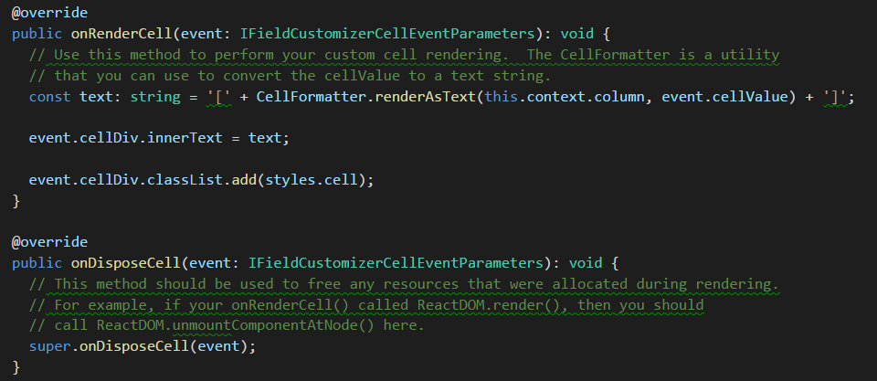

## <a name="debugging-your-field-customizer-using-gulp-serve-and-query-string-parameters"></a>Debuggen Ihres Field Customizer mit gulp serve- und Abfragezeichenfolgen-Parametern
SharePoint Framework-Erweiterungen lassen sich aktuell nicht mithilfe der lokalen Workbench testen. Sie müssen direkt auf einer aktiven SharePoint Online-Website getestet und entwickelt werden. Dazu ist es jedoch nicht nötig, Ihre Anpassung im App-Katalog bereitzustellen. Dadurch bleibt das Debuggen einfach und effizient.

Zunächst führen Sie den folgenden Befehl aus, um den Code zu kompilieren und die Dateien auf Ihrem lokalen Computer zu hosten:
```
gulp serve --nobrowser
```

Die Option `--nobrowser` verwenden wir, weil Erweiterungen derzeit nicht lokal debuggt werden können und daher keine Notwendigkeit besteht, die lokale Workbench zu starten.

Sobald der Code ohne Fehler kompiliert wurde, wird das resultierende Manifest von http://localhost:4321 ausgeliefert.

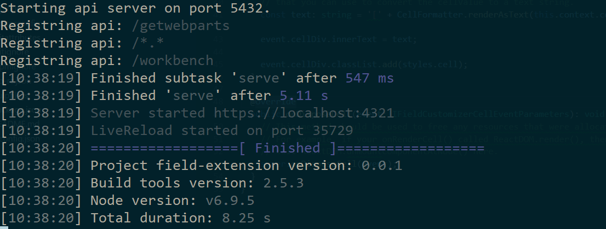

Um die Erweiterung zu testen, navigieren Sie zu einer Website in Ihrem SharePoint Online-Mandanten.

Wechseln Sie zur Seite **Websiteinhalt**.

Klicken Sie in der Symbolleiste auf **Neu**, und wählen Sie **Liste**:


Erstellen Sie eine neue Liste mit dem Namen *Bestellungen*, und klicken Sie auf **Erstellen**:

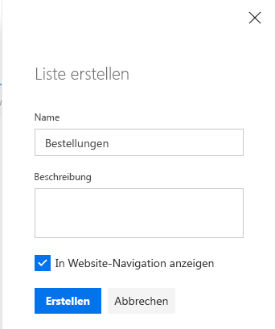

Klicken Sie auf das **Pluszeichen**, und wählen Sie **Zahl**, um ein neues Zahlenfeld für die Liste zu erstellen:

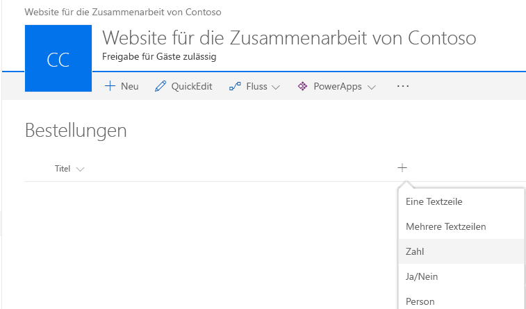

Legen Sie als Namen des Felds **Prozent** fest, und klicken Sie auf **Speichern**:

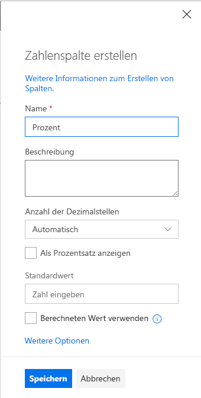

Fügen Sie einige Elemente mit verschiedenen Zahlen in das Feld „Prozent“ ein. Wir ändern die Darstellung später in diesem Lernprogramm, sodass die verschiedenen Zahlen basierend auf Ihrer benutzerdefinierten Implementierung unterschiedlich dargestellt werden.


Da der Field Customizer immer noch in localhost gehostet wird und ausgeführt wird, können wir bestimmte Debugging-Abfrageparameter zum Ausführen des Codes in der neu erstellten Liste verwenden.

Fügen Sie die folgende Zeichenfolgen-Abfrageparameter an die URL an. Beachten Sie, dass Sie die ID aktualisieren müssen, damit diese Ihrer Erweiterungs-ID entspricht, die in **HelloWorldFieldCustomizer.manifest.json** verfügbar ist:

```
?loadSPFX=true&debugManifestsFile=https://localhost:4321/temp/manifests.js&fieldCustomizers={"Percent":{"id":"0e3d8b71-56aa-4405-9225-f08a80fc1d71","properties":{"sampleText":"Hello!"}}}
```
Weitere Details zu den URL-Abfrageparametern:

* **loadSPFX=true:** Dieser Parameter stellt sicher, dass SharePoint Framework auf der Seite geladen wird. Aus Leistungsgründen wird das Framework normalerweise erst geladen, wenn mindestens eine Erweiterung registriert ist. Da aktuell noch keine Komponenten registriert sind, müssen Sie das Framework explizit laden.
* **debugManifestsFile:** Dieser Parameter gibt an, dass lokal ausgelieferte SPFx-Komponenten geladen werden sollen. Normalerweise sucht das Ladeprogramm nur an zwei Orten nach Komponenten: im App-Katalog (nach Komponenten der bereitgestellten Lösung) und auf dem SharePoint-Manifestserver (nach den Systembibliotheken).
* **FieldCustomizers**: Dieser Parameter gibt an, für welche Felder in Ihrer Liste die Darstellung vom Field Customizer gesteuert werden soll. Der ID-Parameter gibt die GUID der Erweiterung an, die zum Steuern der Felddarstellung verwendet werden soll. Der Eigenschaftenparameter ist eine optionale Textzeichenfolge, die ein JSON-Objekt enthält, das für die Erweiterung in `this.properties` deserialisiert wird.
    * **Schlüssel:** Verwenden Sie den internen Namen des Felds als Schlüssel.
    * **ID:** Die GUID der Field Customizer-Erweiterung, die mit diesem Feld verknüpft ist.
    * **Eigenschaften:** Die in der Erweiterung definierten Eigenschaftswerte. In diesem Beispiel ist *'sampleText'* eine Eigenschaft, die durch die Erweiterung definiert wird.

Die vollständige URL sollte in etwa wie folgt aussehen, abhängig von der URL Ihres Mandanten und dem Speicherort der neu erstellte Liste:

```
contoso.sharepoint.com/Lists/Orders/AllItems.aspx?loadSPFX=true&debugManifestsFile=https://localhost:4321/temp/manifests.js&fieldCustomizers={"Percent":{"id":"0e3d8b71-56aa-4405-9225-f08a80fc1d71","properties":{"sampleText":"Hello!"}}}
```

Klicken Sie bei Aufforderung auf **Load debug scripts**, um das Laden der Debugmanifeste zu akzeptieren.

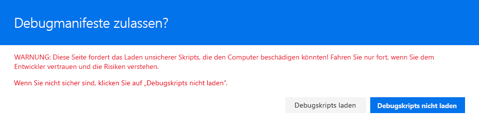

Beachten Sie, dass die Prozentwerte jetzt mit zusätzlichen []-Zeichen dargestellt werden:

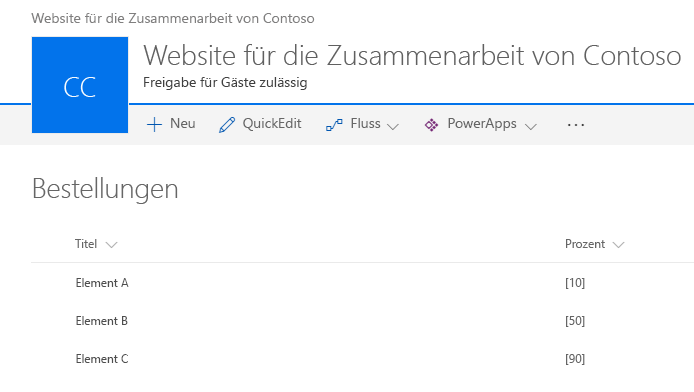

## <a name="enhancing-the-field-customizer-rendering"></a>Verbessern der Darstellung des Field Customizer
Da wir nun den sofort einsetzbaren Anfangspunkt des Field Customizer erfolgreich getestet haben, ändern wir die Logik ein wenig, um den Feldwert noch schöner darzustellen. 

Öffnen Sie die Datei **HelloWorld.module.scss** im Ordner **src\extensions\helloWorld**, und aktualisieren Sie die Stildefinition wie folgt.

```
.HelloWorld {
  .cell {
    display: 'inline-block';
  }
  .full {
    background-color: '#e5e5e5';
    width: '100px';
  }
}

```
Öffnen Sie die Datei **HelloWorldFieldCustomizer.ts** im Ordner **src\extensions\helloWorld**, und aktualisieren Sie die **onRednerCell**-Methode wie folgt.

```
  @override
  public onRenderCell(event: IFieldCustomizerCellEventParameters): void {

    event.cellDiv.classList.add(styles.cell);
    event.cellDiv.innerHTML = `
                <div class='${styles.full}'>
                  <div style='width: ${event.cellValue}px; background:#0094ff; color:#c0c0c0'>
                    &nbsp; ${event.cellValue}
                  </div>
                </div>`;

  }
```

Wechseln Sie wieder in das Konsolenfenster, und vergewissern Sie sich, dass keine Ausnahmen angezeigt werden. Sollte die Lösung noch nicht auf *localhost* ausgeführt werden, führen Sie den folgenden Befehl aus:

```
gulp serve --nobrowser
```

Gehen Sie wieder zu der zuvor erstellten Liste, und verwenden Sie den gleichen Abfrageparameter, den Sie zuvor für das Feld „Prozent“ verwendet haben, sowie die aktualisierte ID für die Erweiterungs-ID aus der Datei **HelloWorldFieldCustomizer.manifest.json**.

Klicken Sie bei Aufforderung auf **Load debug scripts**, um das Laden der Debugmanifeste zu akzeptieren.


Beachten Sie, wie wir nun die Felddarstellung vollständig geändert haben. Der Wert des Felds wird nun durch eine grafische Darstellung angezeigt.

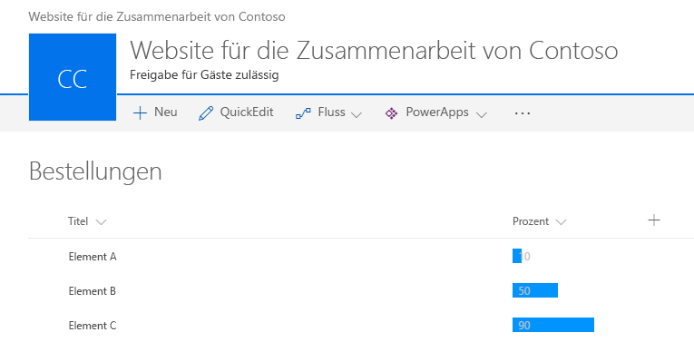

## <a name="add-the-field-definition-to-the-solution-package-for-deployment"></a>Hinzufügen der Felddefinition zum Lösungspaket für die Bereitstellung
Wir haben die Lösung nun ordnungsgemäß im Debuggingmodus getestet und können sie als Paket bereitstellen, das automatisch als Teil des Lösungspakets auf den Websites bereitgestellt wird. Jetzt gibt es noch einige Dinge zu erledigen.

1. Installieren Sie das Lösungspaket auf der Website, auf der es installiert sein soll, damit das Erweiterungsmanifest für die Ausführung freigegeben wird.
2. Ordnen Sie den Field Customizer einem vorhandenen Feld auf der Website zu. Dies kann programmgesteuert erfolgen (CSOM/REST) oder durch die Verwendung des Feature-Frameworks innerhalb des SharePoint-Framework-Lösungspakets. Müssen Sie die folgenden Eigenschaften im *SPField*-Objekt auf Website- oder Listenebene bereitstellen.
    * **ClientSiteComponentId:** Dies ist der Bezeichner (GUID) für den Field Customizer, der im App-Katalog installiert wurde. 
    * **ClientSideComponentProperties:** Dies ist ein optionaler Parameter, der zum Bereitstellen von Eigenschaften für die Field Customizer-Instanz verwendet werden kann.

> Beachten Sie, dass Sie Lösungspakete derzeit explizit auf den Websites installieren müssen, um sicherzustellen, dass die Erweiterung ordnungsgemäß ausgeführt wird. Künftig wird es alternative Verfahren geben, um dies ohne Bereitstellung Website für Website zu erreichen. 

In den folgenden Schritten erstellen wir eine neue Felddefinition, die dann automatisch mit den erforderlichen Konfigurationen bereitgestellt wird, sobald das Lösungspaket auf einer Website installiert wird. 

Wechseln Sie wieder zu Ihrer Lösung in Visual Studio Code (oder Ihrem bevorzugten Editor).

Hier müssen Sie zunächst einen Ordner **assets** erstellen, in dem Sie alle Featureframeworkobjekte ablegen, die bei der Paketinstallation zur Bereitstellung von SharePoint-Strukturen verwendet werden.

* Erstellen Sie einen Ordner mit dem Namen **sharepoint** im Stammverzeichnis der Lösung.
* Erstellen Sie einen Ordner mit dem Namen **assets** als Unterordner im soeben erstellten Ordner **sharepoint**.

Die Lösungsstruktur sollte in etwa wie folgt aussehen:

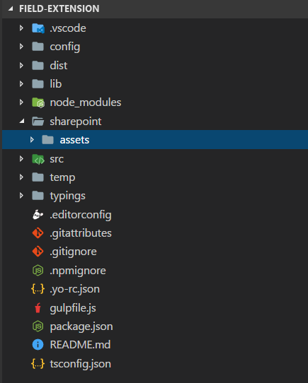

### <a name="add-an-elementsxml-file-for-sharepoint-definitions"></a>Hinzufügen einer Datei „elements.xml“ mit SharePoint-Definitionen
Erstellen Sie im Ordner **sharepoint\assets** eine neue Datei mit dem Namen **elements.xml**.

Kopieren Sie die nachfolgende XML-Struktur in die Datei **elements.xml**. Vergessen Sie dabei nicht, für die Eigenschaft **ClientSideComponentId** die eindeutige ID Ihres Field Customizer aus der Datei **HelloWorldFieldCustomizer.manifest.json** im Ordner **src\extensions\helloWorld** anzugeben.

```xml
<?xml version="1.0" encoding="utf-8"?>
<Elements xmlns="http://schemas.microsoft.com/sharepoint/">

    <Field ID="{060E50AC-E9C1-3D3C-B1F9-DE0BCAC200F6}"
            Name="SPFxPercentage"
            DisplayName="Percentage"
            Type="Number"
            Min="0"
            Required="FALSE"
            Group="SPFx Columns"
            ClientSideComponentId="0e3d8b71-56aa-4405-9225-f08a80fc1d71">
    </Field>

</Elements>
```

### <a name="ensure-that-definitions-are-taken-into-account-within-the-build-pipeline"></a>Gewährleisten der Berücksichtigung von Definitionen in der Buildpipeline

Öffnen Sie die Datei **package-solution.json** im Ordner **config**. Die Datei **package-solution.json** enthält die Paketmetadaten, definiert wie folgt:

```json
{
  "solution": {
    "name": "field-extension-client-side-solution",
    "id": "11cd343e-1ce6-462c-8acb-929804d0c3b2",
    "version": "1.0.0.0"
  },
  "paths": {
    "zippedPackage": "solution/field-extension.sppkg"
  }
}


```

Um sicherzustellen, dass die neu hinzugefügte Datei **elements.xml** beim Verpacken der Lösung berücksichtigt wird, müssen wir eine Featureframework-Featuredefinition für das Lösungspaket einschließen. Dazu integrieren wir wie nachfolgend demonstriert eine JSON-Definition des benötigten Features in die Lösungsstruktur.

```json
{
  "solution": {
    "name": "field-extension-client-side-solution",
    "id": "11cd343e-1ce6-462c-8acb-929804d0c3b2",
    "version": "1.0.0.0",
    "features": [{
      "title": "Field Extension - Deployment of custom field.",
      "description": "Deploys a custom field with ClientSideComponentId association",
      "id": "123fe847-ced2-3036-b564-8dad5c6c6e83",
      "version": "1.0.0.0",
      "assets": {        
        "elementManifests": [
          "elements.xml"
        ]
      }
    }]
  },
  "paths": {
    "zippedPackage": "solution/field-extension.sppkg"
  }
}

```

## <a name="deploy-the-field-to-sharepoint-online-and-host-javascript-from-local-host"></a>Bereitstellen des Felds in SharePoint Online und Hosten des JavaScript-Codes über Localhost
Sie können die Lösung jetzt auf einer SharePoint-Website bereitstellen, wobei die Feldzuordnung automatisch in ein Feld einbezogen wird. 

Geben Sie im Konsolenfenster den folgenden Befehl ein, um die clientseitige Lösung, die die Erweiterung enthält, zu verpacken und so die Grundstruktur für die Paketierung zu erstellen:

```
gulp bundle
```

Führen Sie als Nächstes den folgenden Befehl aus, um das Lösungspaket zu erstellen:

```
gulp package-solution
```

Der Befehl erstellt das Paket im Ordner **sharepoint/solution**:

```
field-extension.sppkg
```

Als Nächstes müssen Sie das Paket, das generiert wurde, im App-Katalog bereitstellen.

Wechseln Sie zum **App-Katalog** Ihres Mandanten, und öffnen Sie die Bibliothek **Apps für SharePoint**.

Laden Sie das Paket `field-extension.sppkg` aus dem Ordner **sharepoint/solution** in den App-Katalog hoch, oder platzieren Sie es dort per Drag & Drop. SharePoint fordert Sie in einem Dialogfeld auf, der clientseitigen Lösung zu vertrauen.

Da wir die Host-URLs der Lösung für diese Bereitstellung nicht aktualisiert haben, verweist die URL immer noch auf https://localhost:4321. Klicken Sie auf die Schaltfläche **Bereitstellen**.

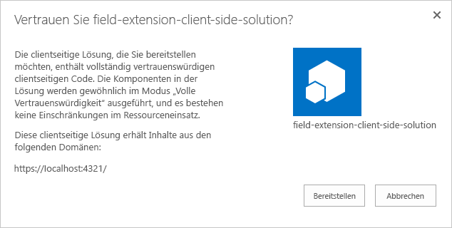

Wechseln Sie zu der Website, auf der Sie die Bereitstellung der SharePoint-Ressource testen möchten. Dies könnte eine Websitesammlung im Mandanten sein, auf dem Sie dieses Lösungspaket bereitgestellt haben.

Klicken Sie auf der oberen Navigationsleiste rechts auf das Zahnradsymbol und anschließend auf **App hinzufügen**, um Ihre Apps-Seite aufzurufen.

Geben Sie in das **Suchfeld** die Zeichenfolge **field** ein, und drücken Sie die *EINGABETASTE*, um Ihre Apps zu filtern.

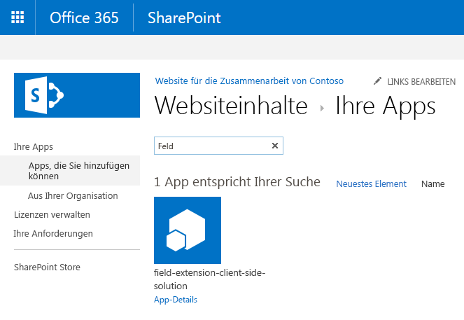

Wählen Sie die App **field-extension-client-side-solution** aus, um die Lösung auf der Website zu installieren. Aktualisieren Sie die Seite nach Abschluss der Installation mithilfe der Taste **F5**.

Klicken Sie nach dem Installieren der Lösung auf **Neu** in der Symbolleiste auf der Seite **Websiteinhalt**, und wählen Sie **Liste**:


Erstellen Sie eine Liste mit dem Namen **Rechnungen**:

Wenn die neue Liste erstellt wurde, gehen Sie zurück zur Seite **Websiteinhalte**, und wählen Sie **Einstellungen** im Kontextmenü der soeben erstellte Liste aus:

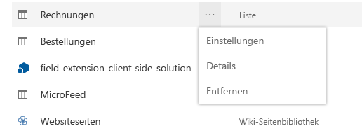

Wählen Sie **Aus vorhandenen Websitespalten hinzufügen** im Abschnitt **Spalten**:

Wählen Sie das Feld **Prozent**, das über das Lösungspaket bereitgestellt wurde, in der Gruppe **SPFx-Spalten**:

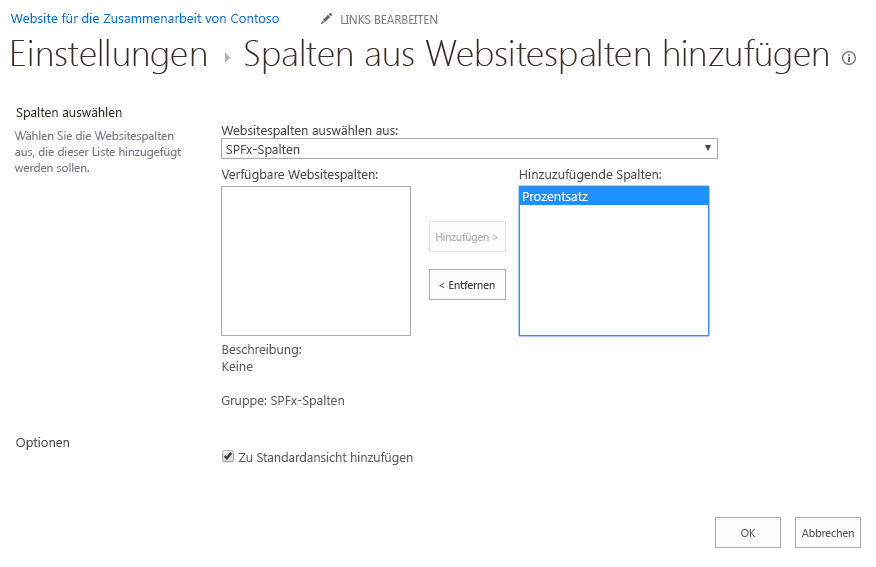

Klicken Sie auf **OK**.

Wechseln Sie wieder zur Konsole, und vergewissern Sie sich, dass die Lösung ausgeführt wird. Sollte Sie nicht ausgeführt werden, führen Sie den folgenden Befehl im Lösungsordner aus:

```
gulp serve --nobrowser
```
Wechseln Sie zu der neu erstellten Liste **Rechnungen**, und fügen Sie der Liste einige neue Einträge mit verschiedenen Werten in der Prozentspalte hinzu, um zu sehen, wie das Feld ohne die Debugging-Abfrageparameter dargestellt wird.


In diesem Fall hosten wir den JavaScript-Code weiterhin von Localhost. Sie können die Objekte jedoch auch in ein beliebiges CDN verschieben und die URL aktualisieren, um das Laden von JavaScript-Objekten auch außerhalb von Localhost zu ermöglichen. 

Das Verfahren für die Veröffentlichung der App ist für die verschiedenen Erweiterungstypen identisch. Sie können die folgenden Veröffentlichungsschritte verwenden, um die Objekte so zu aktualisieren, dass Sie von einem CDN gehostet werden.

* [Bereitstellen der Erweiterung im Office 365-CDN](./hosting-extension-from-office365-cdn.md).
