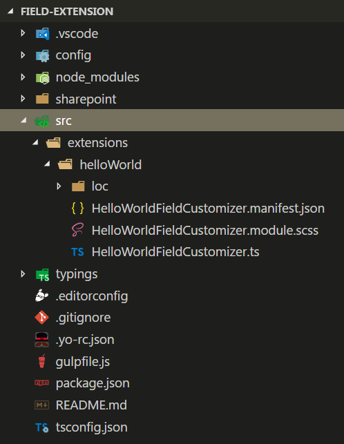
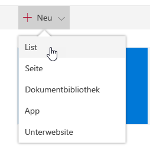
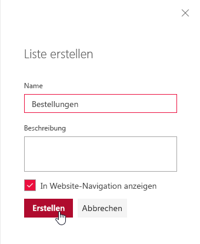
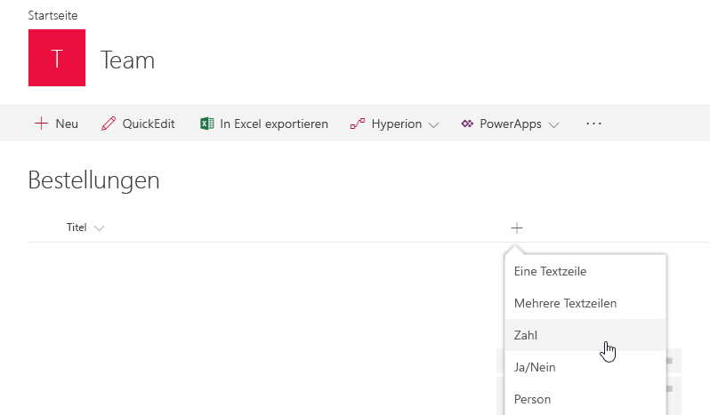
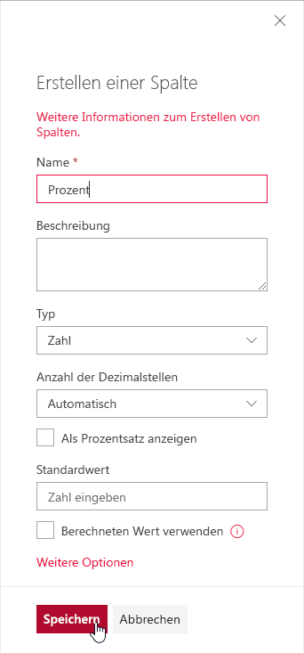
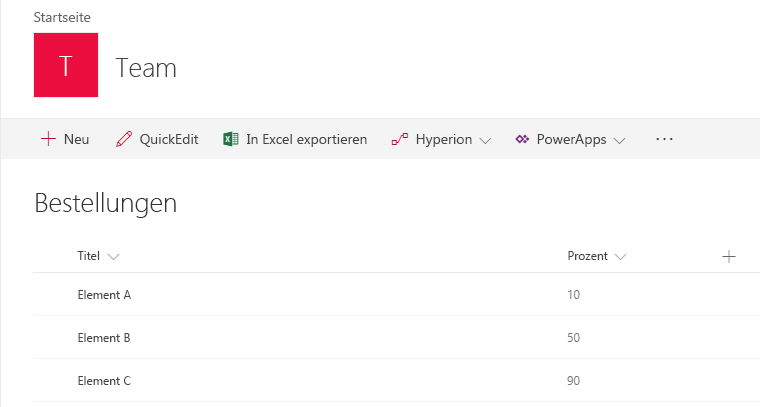
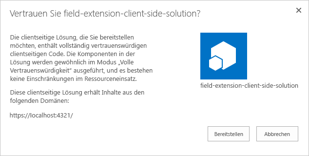
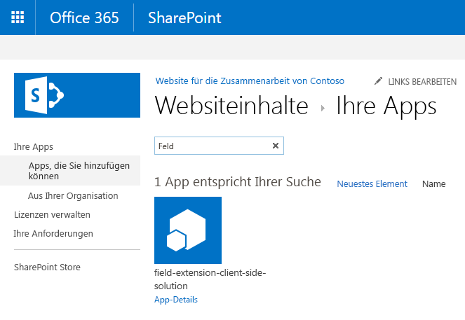
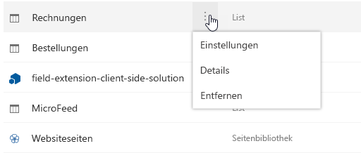
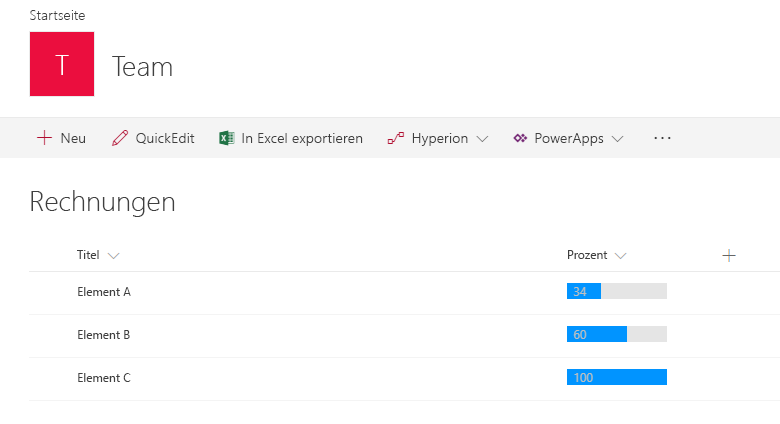

# <a name="build-your-first-field-customizer-extension"></a><span data-ttu-id="a47c9-101">Erstellen Ihrer ersten Field Customizer-Erweiterung</span><span class="sxs-lookup"><span data-stu-id="a47c9-101">Build your first Field Customizer extension</span></span>

<span data-ttu-id="a47c9-102">Erweiterungen sind clientseitige Komponenten, die im Kontext einer SharePoint-Website ausgeführt werden.</span><span class="sxs-lookup"><span data-stu-id="a47c9-102">SharePoint Framework (SPFx) Extensions are client-side components that run inside the context of a SharePoint page.</span></span> <span data-ttu-id="a47c9-103">Erweiterungen lassen sich auf SharePoint Online bereitstellen und auch mithilfe aktueller JavaScript-Tools und -Bibliotheken erstellen.</span><span class="sxs-lookup"><span data-stu-id="a47c9-103">Extensions are client-side components that run inside the context of a SharePoint page. Extensions can be deployed to SharePoint Online and you can use modern JavaScript tools and libraries to build them.</span></span>

<span data-ttu-id="a47c9-104">In diesem Artikel wird beschrieben, wie Sie Ihre erste Field Customizer-Erweiterung erstellen.</span><span class="sxs-lookup"><span data-stu-id="a47c9-104">This article describes how to create your first Hello World SharePoint Framework Extension.</span></span> <span data-ttu-id="a47c9-105">Sie können die nachfolgend beschriebene Anleitung auch anhand dieses Videos in unserem [YouTube-Kanal „SharePoint Patterns & Practices“](https://www.youtube.com/watch?v=fijOzUmlXrY&list=PLR9nK3mnD-OXtWO5AIIr7nCR3sWutACpV) nachvollziehen:</span><span class="sxs-lookup"><span data-stu-id="a47c9-105">You can also follow these steps by watching the video on the [SharePoint PnP YouTube Channel](https://www.youtube.com/watch?v=fijOzUmlXrY&list=PLR9nK3mnD-OXtWO5AIIr7nCR3sWutACpV).</span></span> 

<a href="https://www.youtube.com/watch?v=4wgZy5tm4yo">

</a>

## <a name="create-an-extension-project"></a><span data-ttu-id="a47c9-106">Erstellen eines Erweiterungsprojekts</span><span class="sxs-lookup"><span data-stu-id="a47c9-106">Create an extension project</span></span>

1. <span data-ttu-id="a47c9-107">Erstellen Sie an einem Speicherort Ihrer Wahl ein neues Projektverzeichnis:</span><span class="sxs-lookup"><span data-stu-id="a47c9-107">Create a new project directory in your favorite location.</span></span>
    
    ```
    md field-extension
    ```
    
2. <span data-ttu-id="a47c9-108">Wechseln Sie in das Projektverzeichnis:</span><span class="sxs-lookup"><span data-stu-id="a47c9-108">Go to the project directory.</span></span>
    
    ```
    cd field-extension
    ```
    
3. <span data-ttu-id="a47c9-109">Führen Sie den Yeoman-SharePoint-Generator aus, um eine neue HelloWorld-Erweiterung zu erstellen:</span><span class="sxs-lookup"><span data-stu-id="a47c9-109">Create a new HelloWorld extension by running the Yeoman SharePoint Generator.</span></span>
    
    ```
    yo @microsoft/sharepoint
    ```
    
4. <span data-ttu-id="a47c9-110">Es werden verschiedene Eingabeaufforderungen angezeigt. Gehen Sie wie folgt vor:</span><span class="sxs-lookup"><span data-stu-id="a47c9-110">When prompted:</span></span>
    
    * <span data-ttu-id="a47c9-111">Übernehmen Sie den Standardwert **field-extension** als Namen der Lösung, und drücken Sie die EINGABETASTE.</span><span class="sxs-lookup"><span data-stu-id="a47c9-111">Accept the default value of field-extension as your solution name and press Enter.</span></span>
    * <span data-ttu-id="a47c9-112">Wählen Sie **SharePoint Online only (latest)**, und drücken Sie die EINGABETASTE.</span><span class="sxs-lookup"><span data-stu-id="a47c9-112">Select **SharePoint Online only (latest)**, and select Enter.</span></span>
    * <span data-ttu-id="a47c9-113">Wählen Sie **Use the current folder** aus, und drücken Sie die EINGABETASTE.</span><span class="sxs-lookup"><span data-stu-id="a47c9-113">Choose Use the current folder and press Enter</span></span>
    * <span data-ttu-id="a47c9-114">Wählen Sie **N**, damit die Erweiterung auf jeder Website explizit installiert werden muss, wenn sie verwendet wird.</span><span class="sxs-lookup"><span data-stu-id="a47c9-114">Choose **N** to require the extension to be installed on each site explicitly when it's being used.</span></span>
    * <span data-ttu-id="a47c9-115">Wählen Sie **Extension** als den zu erstellenden Typ von clientseitiger Komponente aus.</span><span class="sxs-lookup"><span data-stu-id="a47c9-115">Choose **Extension (Preview)** as the client-side component type to be created.</span></span> 
    * <span data-ttu-id="a47c9-116">Wählen Sie **Field Customizer** als den zu erstellenden Erweiterungstyp aus.</span><span class="sxs-lookup"><span data-stu-id="a47c9-116">Choose **Field Customizer (Preview)** as the extension type to be created.</span></span>
    
5. <span data-ttu-id="a47c9-117">Über die nächsten Eingabeaufforderungen werden spezifische Informationen zu der Erweiterung abgefragt:</span><span class="sxs-lookup"><span data-stu-id="a47c9-117">The next set of prompts will ask for specific information about your extension.</span></span>
     
    * <span data-ttu-id="a47c9-118">Übernehmen Sie den Standardwert **HelloWorld** als Namen für Ihre Erweiterung, und drücken Sie die EINGABETASTE.</span><span class="sxs-lookup"><span data-stu-id="a47c9-118">Accept the default value of HelloWorld as your extension name and press Enter.</span></span>
    * <span data-ttu-id="a47c9-119">Übernehmen Sie den Standardwert **HelloWorld description** als Beschreibung Ihrer Erweiterung, und drücken Sie die EINGABETASTE.</span><span class="sxs-lookup"><span data-stu-id="a47c9-119">Accept the default value of HelloWorld description as your extension description and press Enter.</span></span>
    * <span data-ttu-id="a47c9-120">Übernehmen Sie den Standardwert **No JavaScript Framework** als Frameworkauswahl, und drücken Sie die EINGABETASTE.</span><span class="sxs-lookup"><span data-stu-id="a47c9-120">Accept the default No JavaScript Framework as the framework selection and press Enter</span></span> 
    
    <br/>
    
    
    
    <span data-ttu-id="a47c9-122">An diesem Punkt installiert Yeoman die erforderlichen Abhängigkeiten und erstellt ein Gerüst für die Lösungsdateien sowie die **HelloWorld**-Erweiterung.</span><span class="sxs-lookup"><span data-stu-id="a47c9-122">At this point, Yeoman will install the required dependencies and scaffold the solution files along with the **HelloWorld** extension. This might take a few minutes.</span></span> <span data-ttu-id="a47c9-123">Das kann einige Minuten dauern.</span><span class="sxs-lookup"><span data-stu-id="a47c9-123">This might take a few minutes.</span></span> 
    
    <span data-ttu-id="a47c9-124">Nach Abschluss der Gerüsterstellung sollte folgende Erfolgsmeldung angezeigt werden:</span><span class="sxs-lookup"><span data-stu-id="a47c9-124">When the scaffold is complete, you should see the following message indicating a successful scaffold:</span></span>
    
    
    
    <span data-ttu-id="a47c9-126">Details zur Behebung etwaiger Fehler finden Sie unter [Bekannte Probleme](../../known-issues-and-common-questions.md).</span><span class="sxs-lookup"><span data-stu-id="a47c9-126">For information about troubleshooting any errors, see [Known issues](../../known-issues-and-common-questions.md).</span></span>

6. <span data-ttu-id="a47c9-127">Sobald das Gerüst abgeschlossen ist, sperren Sie die Version der Projektabhängigkeiten, indem Sie den folgenden Befehl ausführen:</span><span class="sxs-lookup"><span data-stu-id="a47c9-127">Once the scaffolding completes, lock down the version of the project dependencies by running the following command:</span></span>

    ```sh
    npm shrinkwrap
    ```
    
7. <span data-ttu-id="a47c9-128">Geben Sie Folgendes in die Konsole ein, um Visual Studio Code zu starten.</span><span class="sxs-lookup"><span data-stu-id="a47c9-128">Once solution scaffolding is completed, type the following into the console to start Visual Studio Code.</span></span>
    
    ```
    code .
    ```
    
    > [!NOTE] 
    > <span data-ttu-id="a47c9-129">Da die clientseitige SharePoint-Lösung auf HTML/TypeScript basiert, können Sie zur Erstellung Ihrer Erweiterung jeden Code-Editor verwenden, der clientseitige Entwicklung unterstützt.</span><span class="sxs-lookup"><span data-stu-id="a47c9-129">Note: Because the SharePoint client-side solution is HTML/TypeScript based, you can use any code editor that supports client-side development to build your extension.</span></span>

    <span data-ttu-id="a47c9-130">Beachten Sie, dass die Standardlösungsstruktur wie die Lösungsstruktur für clientseitige Webparts aussieht.</span><span class="sxs-lookup"><span data-stu-id="a47c9-130">Notice how the default solution structure looks like the solution structure for client-side web parts.</span></span> <span data-ttu-id="a47c9-131">Dies ist die grundlegende SharePoint-Framework-Lösungsstruktur mit ähnlichen Konfigurationsoptionen über alle Lösungstypen hinweg.</span><span class="sxs-lookup"><span data-stu-id="a47c9-131">This is the basic SharePoint Framework solution structure, with similar configuration options across all solution types.</span></span>

    

8. <span data-ttu-id="a47c9-133">Öffnen Sie **HelloWorldFieldCustomizer.manifest.json** im Ordner **src\extensions\helloWorld**.</span><span class="sxs-lookup"><span data-stu-id="a47c9-133">Open **HelloWorldFieldCustomizer.manifest.json** at the **src\extensions\helloWorld** folder.</span></span>

    <span data-ttu-id="a47c9-134">Diese Datei definiert den Erweiterungstyp und eine eindeutige `id` für die Erweiterung.</span><span class="sxs-lookup"><span data-stu-id="a47c9-134">This file defines your extension type and a unique identifier for your extension.</span></span> <span data-ttu-id="a47c9-135">Sie benötigen diese eindeutige ID später beim Debuggen und Bereitstellen der Erweiterung in SharePoint.</span><span class="sxs-lookup"><span data-stu-id="a47c9-135">This file defines your extension type and a unique identifier “id” for your extension. You’ll need this unique identifier later when debugging and deploying your extension to SharePoint.</span></span>

    

## <a name="code-your-field-customizer"></a><span data-ttu-id="a47c9-137">Codieren des Field Customizers</span><span class="sxs-lookup"><span data-stu-id="a47c9-137">Coding your Field Customizer</span></span> 

<span data-ttu-id="a47c9-138">Öffnen Sie die Datei **HelloWorldFieldCustomizer.ts** im Ordner **src\extensions\helloWorld**.</span><span class="sxs-lookup"><span data-stu-id="a47c9-138">Open the **HelloWorldFieldCustomizer.ts** file in the **src\extensions\helloWorld** folder.</span></span>

<span data-ttu-id="a47c9-139">Beachten Sie, dass die Basisklasse für den Field Customizer aus dem **sp-listview-extensibility**-Paket importiert wird, das den SharePoint-Frameworkcode enthält, der für den Field Customizer erforderlich ist.</span><span class="sxs-lookup"><span data-stu-id="a47c9-139">Notice that the base class for the Field Customizer is imported from the **sp-application-base** package, which contains SharePoint framework code required by the Field Customizer.</span></span>

```ts
import { Log } from '@microsoft/sp-core-library';
import { override } from '@microsoft/decorators';
import {
  BaseFieldCustomizer,
  IFieldCustomizerCellEventParameters
} from '@microsoft/sp-listview-extensibility';
```

<span data-ttu-id="a47c9-140">Die Logik für den Field Customizer befindet sich in den Methoden **OnInit()**, **onRenderCell()** und **onDisposeCell()**.</span><span class="sxs-lookup"><span data-stu-id="a47c9-140">The logic for your Field Customizer is contained in the **OnInit()**, **onRenderCell()**, and **onDisposeCell()** methods.</span></span>

* <span data-ttu-id="a47c9-p106">In **onInit():** müssen Sie jegliches Setup vornehmen, das für die Erweiterung erforderlich ist. Dieses Ereignis tritt auf, nachdem `this.context` und `this.properties` zugewiesen wurden, jedoch bevor das Seiten-DOM bereit ist. Wie bei Webparts gibt `onInit()` eine Zusage zurück, die Sie verwenden können, um asynchrone Vorgänge durchzuführen; `onRenderCell()` wird erst dann aufgerufen, wenn die Zusage erfüllt wurde. Wenn Sie dies nicht benötigen, geben Sie einfach `Promise.resolve<void>();` zurück.</span><span class="sxs-lookup"><span data-stu-id="a47c9-p106">**onInit()** is where you should perform any setup needed for your extension. This event occurs after `this.context` and `this.properties` are assigned, but before the page DOM is ready. As with web parts, `onInit()` returns a promise that you can use to perform asynchronous operations; `onRenderCell()` will not be called until your promise has resolved. If you don’t need that, simply return `Promise.resolve<void>();`.</span></span>
* <span data-ttu-id="a47c9-145">**onRenderCell()** tritt auf, wenn jede Zelle gerendert wird.</span><span class="sxs-lookup"><span data-stu-id="a47c9-145">**onRenderCell()** occurs when each cell is rendered.</span></span> <span data-ttu-id="a47c9-146">Die Methode bietet ein `event.domElement`-HTML-Element, in das der Code den Inhalt schreiben kann.</span><span class="sxs-lookup"><span data-stu-id="a47c9-146">onRenderCell():  This event occurs when each cell is rendered. It provides an `event.domElement` HTML element where your code can write its content.</span></span>
* <span data-ttu-id="a47c9-147">**onDisposeCell()** tritt unmittelbar vor dem Löschen von `event.cellDiv` auf.</span><span class="sxs-lookup"><span data-stu-id="a47c9-147">**onDisposeCell()** occurs immediately before the `event.cellDiv` is deleted.</span></span> <span data-ttu-id="a47c9-148">Die Methode kann zum Freigeben von Ressourcen verwendet werden, die beim Feldrendering zugeordnet wurden.</span><span class="sxs-lookup"><span data-stu-id="a47c9-148">It can be used to free any resources that were allocated during field rendering.</span></span> <span data-ttu-id="a47c9-149">Wenn `onRenderCell()` ein React-Element bereitgestellt hat, muss `onDisposeCell()` zum Freigeben verwendet werden; anderenfalls würde ein Ressourcenverlust auftreten.</span><span class="sxs-lookup"><span data-stu-id="a47c9-149">onDisposeCell(): This event occurs immediately before the  is deleted. It can be used to free any resources that were allocated during field rendering. For example, if `onRenderCell()` mounted a React element, `onDisposeCell()` must be used to free it, otherwise a resource leak would occur.</span></span> 

<span data-ttu-id="a47c9-150">Nachfolgend finden Sie den Inhalt von **onRenderCell()** und **onDisposeCell()** in der Standardlösung:</span><span class="sxs-lookup"><span data-stu-id="a47c9-150">Below are the contents of **onRenderCell()** and **onDisposeCell()** in the default solution:</span></span>

```ts
@override
  public onRenderCell(event: IFieldCustomizerCellEventParameters): void {
    // Use this method to perform your custom cell rendering.
    const text: string = `${this.properties.sampleText}: ${event.fieldValue}`;

    event.domElement.innerText = text;

    event.domElement.classList.add(styles.cell);
  }

  @override
  public onDisposeCell(event: IFieldCustomizerCellEventParameters): void {
    // This method should be used to free any resources that were allocated during rendering.
    // For example, if your onRenderCell() called ReactDOM.render(), then you should
    // call ReactDOM.unmountComponentAtNode() here.
    super.onDisposeCell(event);
  }
```

## <a name="debug-your-field-customizer-using-gulp-serve-and-query-string-parameters"></a><span data-ttu-id="a47c9-151">Debuggen Ihres Field Customizer mit gulp serve- und Abfragezeichenfolgenparametern</span><span class="sxs-lookup"><span data-stu-id="a47c9-151">Debug your Application Customizer using gulp serve and query string parameters</span></span>
<span data-ttu-id="a47c9-152">SharePoint-Framework-Erweiterungen können derzeit nicht mit der lokalen Workbench getestet werden.</span><span class="sxs-lookup"><span data-stu-id="a47c9-152">You cannot current use the local workbench to test SharePoint Framework Extensions.</span></span> <span data-ttu-id="a47c9-153">Sie müssen sie direkt mit einer SharePoint Online-Live-Website testen und bereitstellen.</span><span class="sxs-lookup"><span data-stu-id="a47c9-153">You'll need to test them  against a live SharePoint Online site.</span></span> <span data-ttu-id="a47c9-154">Hierzu ist es nicht erforderlich, die Anpassung im App-Katalog bereitzustellen, was das Debugging vereinfacht und beschleunigt.</span><span class="sxs-lookup"><span data-stu-id="a47c9-154">You don't have to deploy your customization to the app catalog to do this, which makes the debugging experience simple and efficient.</span></span>

1. <span data-ttu-id="a47c9-155">Zunächst führen Sie den folgenden Befehl aus, um den Code zu kompilieren und die Dateien auf Ihrem lokalen Computer zu hosten:</span><span class="sxs-lookup"><span data-stu-id="a47c9-155">First, compile your code and host the compiled files from the local machine by running this command:</span></span>
    
    ```
    gulp serve --nobrowser
    ```
    
    <span data-ttu-id="a47c9-156">Sie verwenden die Option `--nobrowser`, da ein Start der lokalen Workbench nicht nötig ist, weil Erweiterungen nicht lokal gedebuggt werden können.</span><span class="sxs-lookup"><span data-stu-id="a47c9-156">You use the `--nobrowser` option because you don't need to launch the local workbench, since you can't debug extensions locally.</span></span>

    <span data-ttu-id="a47c9-157">Wenn der Code ohne Fehler kompiliert wurde, verarbeitet er das resultierende Manifest von https://localhost:4321.</span><span class="sxs-lookup"><span data-stu-id="a47c9-157">When the code compiles without errors, it will serve the resulting manifest from http://localhost:4321.</span></span>

    

2. <span data-ttu-id="a47c9-159">Um die Erweiterung zu testen, navigieren Sie zu einer Website in Ihrem SharePoint Online-Mandanten.</span><span class="sxs-lookup"><span data-stu-id="a47c9-159">To test your extension, go to a site in your SharePoint Online developer tenant.</span></span>

3. <span data-ttu-id="a47c9-160">Wechseln Sie zur Seite **Websiteinhalte**.</span><span class="sxs-lookup"><span data-stu-id="a47c9-160">Move to the **Site Contents** page.</span></span>

4. <span data-ttu-id="a47c9-161">Wählen Sie auf der Symbolleiste **Neu**, und wählen Sie dann **Liste**.</span><span class="sxs-lookup"><span data-stu-id="a47c9-161">On the toolbar, select **New**, and then select **List**.</span></span>
    
    
    
5. <span data-ttu-id="a47c9-163">Erstellen Sie eine neue Liste mit dem Namen **Bestellungen**, und klicken Sie auf **Erstellen**.</span><span class="sxs-lookup"><span data-stu-id="a47c9-163">Create a new list named **Orders** and click **Create**:</span></span>
    
    
    
6. <span data-ttu-id="a47c9-165">Klicken Sie auf das **Pluszeichen**, und wählen Sie **Zahl**, um ein neues Zahlenfeld für die Liste zu erstellen.</span><span class="sxs-lookup"><span data-stu-id="a47c9-165">Click the **plus** sign and choose **Number** to create a new Number field for the list:</span></span>
    
    
    
7. <span data-ttu-id="a47c9-167">Legen Sie den Namen des Felds auf **Prozent** fest, und wählen Sie dann **Speichern**.</span><span class="sxs-lookup"><span data-stu-id="a47c9-167">Set name of the field to **Percent** and click **Save**:</span></span>
    
    
    
8. <span data-ttu-id="a47c9-p110">Fügen Sie einige Elemente mit verschiedenen Zahlen in das Feld „Prozent“ ein. Wir ändern die Darstellung später in diesem Lernprogramm, sodass die verschiedenen Zahlen basierend auf Ihrer benutzerdefinierten Implementierung unterschiedlich dargestellt werden.</span><span class="sxs-lookup"><span data-stu-id="a47c9-p110">Add a few items with different numbers in the percent field. We'll modify the rendering later in this tutorial, so the different numbers will be presented differently based on your custom implementation.</span></span>

    

    <span data-ttu-id="a47c9-172">Da der Field Customizer immer noch in localhost gehostet wird und ausgeführt wird, können wir bestimmte Debugging-Abfrageparameter zum Ausführen des Codes in der neu erstellten Liste verwenden.</span><span class="sxs-lookup"><span data-stu-id="a47c9-172">Since our Field Customizer is still hosted in localhost and is running, we can use specific debug query parameters to execute the code in the newly created list.</span></span>

9. <span data-ttu-id="a47c9-173">Hängen Sie die folgenden Abfragezeichenfolgenparameter an die URL an.</span><span class="sxs-lookup"><span data-stu-id="a47c9-173">Choose the CustomActionTarget page. Append the following query string parameters to the URL:</span></span> <span data-ttu-id="a47c9-174">Beachten Sie, dass Sie die ID aktualisieren müssen, damit diese Ihrer Erweiterungs-ID entspricht, die in **HelloWorldFieldCustomizer.manifest.json** verfügbar ist.</span><span class="sxs-lookup"><span data-stu-id="a47c9-174">Append the following query string parameters to the URL. Notice that you will need to update the id to match your own extension identifier available from the **HelloWorldFieldCustomizer.manifest.json** file:</span></span> <span data-ttu-id="a47c9-175">Weitere Informationen finden Sie unter [Weitere Details zu den URL-Abfrageparametern](#more-details-about-the-url-query-parameters).</span><span class="sxs-lookup"><span data-stu-id="a47c9-175">For more information, see [More details about the URL query parameters](#more-details-about-the-url-query-parameters).</span></span> 

    ```
    ?loadSPFX=true&debugManifestsFile=https://localhost:4321/temp/manifests.js&fieldCustomizers={"Percent":{"id":"45a1d299-990d-4917-ba62-7cb67158be16","properties":{"sampleText":"Hello!"}}}
    ```
    
    <br/>

    <span data-ttu-id="a47c9-176">Die vollständige URL sollte in etwa wie folgt aussehen, abhängig von der URL Ihres Mandanten und dem Speicherort der neu erstellte Liste:</span><span class="sxs-lookup"><span data-stu-id="a47c9-176">The full URL should look similar to the following, depending on your tenant URL and the location of the newly created list:</span></span>
    
    <br/>
    
    ```
    contoso.sharepoint.com/Lists/Orders/AllItems.aspx?loadSPFX=true&debugManifestsFile=https://localhost:4321/temp/manifests.js&fieldCustomizers={"Percent":{"id":"45a1d299-990d-4917-ba62-7cb67158be16","properties":{"sampleText":"Hello!"}}}
    ```
    
10. <span data-ttu-id="a47c9-177">Klicken Sie bei Aufforderung auf **Debugskripts laden**, um das Laden der Debugmanifeste zu akzeptieren.</span><span class="sxs-lookup"><span data-stu-id="a47c9-177">Accept the loading of Debug Manifests, by clicking **Load debug scripts** when prompted:</span></span>

    

    <span data-ttu-id="a47c9-179">Beachten Sie, dass die prozentualen Werte jetzt mit einer zusätzlichen Präfixzeichenfolge als `Hello!: ` dargestellt werden, die eine Eigenschaft für den Field Customizer bereitstellt.</span><span class="sxs-lookup"><span data-stu-id="a47c9-179">Notice how the Percent values are now presented with an additional prefix string as `Hello!: `, which is provided as a property for the Field Customizer.</span></span>

    


### <a name="more-details-about-the-url-query-parameters"></a><span data-ttu-id="a47c9-181">Weitere Details zu den URL-Abfrageparametern</span><span class="sxs-lookup"><span data-stu-id="a47c9-181">More detail about the URL query parameters:</span></span>

- <span data-ttu-id="a47c9-182">**loadSPFX=true** dient zum Sicherstellen, dass das SharePoint-Framework auf der Seite geladen wird.</span><span class="sxs-lookup"><span data-stu-id="a47c9-182">**loadSPFX=true** - Ensures that the SharePoint Framework is loaded on the page.</span></span> <span data-ttu-id="a47c9-183">Aus Leistungsgründen wird das Framework erst geladen, wenn mindestens eine Erweiterung registriert wurde.</span><span class="sxs-lookup"><span data-stu-id="a47c9-183">For performance reasons, the framework does not load unless at least one extension is registered.</span></span> <span data-ttu-id="a47c9-184">Da keine Komponenten registriert sind, müssen Sie das Framework explizit laden.</span><span class="sxs-lookup"><span data-stu-id="a47c9-184">Because no components are registered,you must explicitly load the framework.</span></span>
- <span data-ttu-id="a47c9-185">**debugManifestsFile** gibt an, dass lokal verarbeitete SPFx-Komponenten geladen werden sollen.</span><span class="sxs-lookup"><span data-stu-id="a47c9-185">**debugManifestsFile** - Specifies that you want to load SPFx components that are locally served.</span></span> <span data-ttu-id="a47c9-186">Das Ladeprogramm sucht nur an zwei Stellen nach Komponenten: im App-Katalog (nach Komponenten der bereitgestellten Lösung) und auf dem SharePoint-Manifestserver (nach den Systembibliotheken).</span><span class="sxs-lookup"><span data-stu-id="a47c9-186">The loader only looks for components in the App Catalog (for your deployed solution) and the SharePoint manifest server (for the system libraries).</span></span>
- <span data-ttu-id="a47c9-187">**FieldCustomizers** gibt die Felder an, deren Rendering in der Liste durch den Field Customizer gesteuert wird.</span><span class="sxs-lookup"><span data-stu-id="a47c9-187">**fieldCustomizers** indicates which fields in your list should have their rendering controlled by the Field Customizer.</span></span> <span data-ttu-id="a47c9-188">Der ID-Parameter gibt die GUID der Erweiterung an, die für die Steuerung des Renderings des Felds verwendet werden soll.</span><span class="sxs-lookup"><span data-stu-id="a47c9-188">The ID parameter specifies the GUID of the extension that should be used to control the rendering of the field.</span></span> <span data-ttu-id="a47c9-189">Der Eigenschaftenparameter ist eine optionale Textzeichenfolge mit einem JSON-Objekt, das in `this.properties` der Erweiterung deserialisiert wird.</span><span class="sxs-lookup"><span data-stu-id="a47c9-189">The properties parameter is an optional text string containing a JSON object that will be deserialized into `this.properties` for your extension.</span></span>
    - <span data-ttu-id="a47c9-190">**Schlüssel:**: Verwenden Sie den internen Namen des Felds als Schlüssel.</span><span class="sxs-lookup"><span data-stu-id="a47c9-190">**Key:** use the internal name of the field as the key</span></span>
    - <span data-ttu-id="a47c9-191">**ID:**: Die GUID der Field Customizer-Erweiterung, die mit diesem Feld verknüpft ist.</span><span class="sxs-lookup"><span data-stu-id="a47c9-191">**Id:** the guid of the field customizer extension associated with this field</span></span>
    - <span data-ttu-id="a47c9-192">**Eigenschaften**: Die in der Erweiterung definierten Eigenschaftenwerte.</span><span class="sxs-lookup"><span data-stu-id="a47c9-192">**Properties**: The property values defined in the extension.</span></span> <span data-ttu-id="a47c9-193">In diesem Beispiel ist `sampleText` eine durch die Erweiterung definierte Eigenschaft.</span><span class="sxs-lookup"><span data-stu-id="a47c9-193">Properties: property values defined in the extension. In this example, ‘sampleText’`sampleText` is a property defined by the extension</span></span>

<br/>

## <a name="enhance-the-field-customizer-rendering"></a><span data-ttu-id="a47c9-194">Verbessern der Darstellung des Field Customizer</span><span class="sxs-lookup"><span data-stu-id="a47c9-194">Enhancing the Field Customizer rendering</span></span>
<span data-ttu-id="a47c9-195">Da wir nun den sofort einsetzbaren Anfangspunkt des Field Customizer erfolgreich getestet haben, ändern wir die Logik ein wenig, um den Feldwert noch schöner darzustellen.</span><span class="sxs-lookup"><span data-stu-id="a47c9-195">Now that we have successfully tested the out of the box starting point of the Field Customizer, let's modify the logic slightly to have a more polished rendering of the field value.</span></span> 

1. <span data-ttu-id="a47c9-196">Öffnen Sie die Datei **HelloWorld.module.scss** im Ordner **src\extensions\helloWorld**, und aktualisieren Sie die Stildefinition wie folgt.</span><span class="sxs-lookup"><span data-stu-id="a47c9-196">Open the **HelloWorld.module.scss** file in the **src\extensions\helloWorld** folder and update the styling definition as follows.</span></span>

    ```
    .HelloWorld {
      .cell {
        display: 'inline-block';
      }
      .full {
        background-color: '#e5e5e5';
        width: '100px';
      }
    }

    ```
    
2. <span data-ttu-id="a47c9-197">Öffnen Sie die Datei **HelloWorldFieldCustomizer.ts** im Ordner **src\extensions\helloWorld**, und aktualisieren Sie die **onRednerCell**-Methode wie folgt.</span><span class="sxs-lookup"><span data-stu-id="a47c9-197">Open the **HelloWorldFieldCustomizer.ts** file in the **src\extensions\helloWorld** folder and update the **onRednerCell** method as follows.</span></span>

    ```ts
        @override
        public onRenderCell(event: IFieldCustomizerCellEventParameters): void {

            event.domElement.classList.add(styles.cell);
            event.domElement.innerHTML = `
                    <div class='${styles.HelloWorld}'>
                        <div class='${styles.full}'>
                        <div style='width: ${event.fieldValue}px; background:#0094ff; color:#c0c0c0'>
                            &nbsp; ${event.fieldValue}
                        </div>
                        </div>
                    </div>`;
        }
    ```

3. <span data-ttu-id="a47c9-198">Stellen Sie in dem Konsolenfenster sicher, dass keine Ausnahmen vorhanden sind.</span><span class="sxs-lookup"><span data-stu-id="a47c9-198">In your console window, ensure that you do not have any exceptions.</span></span> <span data-ttu-id="a47c9-199">Wenn die Lösung nicht in *localhost* ausgeführt wird, führen Sie den folgenden Befehl aus:</span><span class="sxs-lookup"><span data-stu-id="a47c9-199">Switch back to your console window and ensure that you do not have any exceptions. If you do not have the solution running in *localhost*, execute the following command:</span></span>

    ```
    gulp serve --nobrowser
    ```

4. <span data-ttu-id="a47c9-200">Verwenden Sie in der zuvor erstellten Liste den gleichen Abfrageparameter, den Sie zuvor für das Feld `Percent` verwendet haben, sowie die aktualisierte `ID` für die Erweiterungs-ID aus der Datei **HelloWorldFieldCustomizer.manifest.json**.</span><span class="sxs-lookup"><span data-stu-id="a47c9-200">Move back to your previously created list and use the same query parameter as used previously with the Field being 'Percent' and the Id being updated to your extension identifier available from the HelloWorldFieldCustomizer.manifest.json file.</span></span>

5. <span data-ttu-id="a47c9-201">Klicken Sie bei Aufforderung auf **Debugskripts laden**, um das Laden der Debugmanifeste zu akzeptieren.</span><span class="sxs-lookup"><span data-stu-id="a47c9-201">Accept the loading of Debug Manifests, by clicking **Load debug scripts** when prompted.</span></span>

    

    <span data-ttu-id="a47c9-203">Beachten Sie, dass sich die Felddarstellung komplett geändert hat.</span><span class="sxs-lookup"><span data-stu-id="a47c9-203">Note how we changed the field rendering style completely.</span></span> <span data-ttu-id="a47c9-204">Der Feldwert wird grafisch dargestellt.</span><span class="sxs-lookup"><span data-stu-id="a47c9-204">Notice how we have changed the field rendering style completely. The field value is indicated using a graphical representation of the value.</span></span>

    

## <a name="add-the-field-definition-to-the-solution-package-for-deployment"></a><span data-ttu-id="a47c9-206">Hinzufügen der Felddefinition zum Lösungspaket für die Bereitstellung</span><span class="sxs-lookup"><span data-stu-id="a47c9-206">Add the field definition to the solution package for deployment</span></span>
<span data-ttu-id="a47c9-207">Wir haben die Lösung nun ordnungsgemäß im Debuggingmodus getestet und können sie als Paket bereitstellen, das automatisch als Teil des Lösungspakets auf den Websites bereitgestellt wird.</span><span class="sxs-lookup"><span data-stu-id="a47c9-207">Now that we have tested our solution properly in debug mode, we can package this to be deployed automatically as part of the solution package deployed to the sites. There are few things to take care of here.</span></span> 

1. <span data-ttu-id="a47c9-208">Installieren Sie das Lösungspaket auf der Website, auf der es installiert sein soll, damit das Erweiterungsmanifest für die Ausführung freigegeben wird.</span><span class="sxs-lookup"><span data-stu-id="a47c9-208">Install the solution package to the site where it should be installed, so that the extension manifest is being white listed for execution</span></span>

2. <span data-ttu-id="a47c9-209">Ordnen Sie den Field Customizer einem vorhandenen Feld in der Website zu.</span><span class="sxs-lookup"><span data-stu-id="a47c9-209">Associate the Field Customizer to an existing field in the site.</span></span> <span data-ttu-id="a47c9-210">Sie können dies programmgesteuert (CSOM/REST) oder mit dem Feature-Framework innerhalb des SharePoint-Framework-Lösungspakets tun.</span><span class="sxs-lookup"><span data-stu-id="a47c9-210">You can do this programmatically (CSOM/REST) or by using the feature framework inside of the SharePoint Framework solution package.</span></span> <span data-ttu-id="a47c9-211">Sie müssen die folgenden Eigenschaften im `SPField`-Objekt auf der Website- oder Listenebene zuweisen.</span><span class="sxs-lookup"><span data-stu-id="a47c9-211">You'll need to associate the following properties in the `SPField` object at the site or list level.</span></span>
    - <span data-ttu-id="a47c9-212">**ClientSiteComponentId:** Dies ist der Bezeichner (GUID) für den Field Customizer, der im App-Katalog installiert wurde.</span><span class="sxs-lookup"><span data-stu-id="a47c9-212">**ClientSiteComponentId:** This is the identifier (GUID) of the Field Customizer, which has been installed in the app catalog.</span></span>
    - <span data-ttu-id="a47c9-213">**ClientSideComponentProperties:** Dies ist ein optionaler Parameter, der zum Bereitstellen von Eigenschaften für die Field Customizer-Instanz verwendet werden kann.</span><span class="sxs-lookup"><span data-stu-id="a47c9-213">**ClientSideComponentProperties:** This is an optional parameter, which can be used to provide properties for the Field Customizer instance.</span></span>

    <span data-ttu-id="a47c9-214">Beachten Sie, dass Sie die Anforderung zum Hinzufügen einer Lösung mit Ihrer Erweiterung zu der Website mithilfe der `skipFeatureDeployment`-Einstellung in **package-solution.json** steuern können.</span><span class="sxs-lookup"><span data-stu-id="a47c9-214">Note that you can control the requirement to add a solution containing your extension to the site by using the `skipFeatureDeployment` setting in **package-solution.json**.</span></span> <span data-ttu-id="a47c9-215">Auch wenn Sie die Installation der Lösung auf der Website nicht voraussetzen, müssen Sie **ClientSideComponentId** bestimmten Objekten zuweisen, damit die Erweiterung angezeigt wird.</span><span class="sxs-lookup"><span data-stu-id="a47c9-215">Notice, you can control the requirement to add a solution containing your extension to the site by using  setting in package-solution.json. Event though you would not require solution to be installed on the site, you'd need to associate **ClientSideComponentId** to specific objects for the extension to be visible.</span></span>

    <span data-ttu-id="a47c9-216">In den folgenden Schritten prüfen wir die Standardfelddefinition, die automatisch erstellt und mit den erforderlichen Konfigurationen bereitgestellt wird, sobald das Lösungspaket auf einer Website installiert wird.</span><span class="sxs-lookup"><span data-stu-id="a47c9-216">In the following steps, we'll review the default field definition, which was automatically created and will then be used to automatically deploy needed configurations when the solution package is installed on a site.</span></span>

3. <span data-ttu-id="a47c9-217">Wechseln Sie wieder zu Ihrer Lösung in Visual Studio Code (oder Ihrem bevorzugten Editor).</span><span class="sxs-lookup"><span data-stu-id="a47c9-217">Return to your solution in Visual Studio Code (or to your preferred editor).</span></span>

4. <span data-ttu-id="a47c9-218">Erweitern Sie im Stammverzeichnis der Lösung den Ordner **sharepoint** und den Unterordner **assets**, um die vorhandene Datei **elements.xml** anzuzeigen.</span><span class="sxs-lookup"><span data-stu-id="a47c9-218">Extend the **sharepoint** folder and **assets** subfolder in the root of the solution to see the existing **elements.xml** file.</span></span> 
    
    

<br/>

### <a name="review-the-elementsxml-file"></a><span data-ttu-id="a47c9-220">Prüfen der Datei „elements.xml“</span><span class="sxs-lookup"><span data-stu-id="a47c9-220">Modify the elements.xml file</span></span> 

<span data-ttu-id="a47c9-221">Öffnen Sie im Ordner **sharepoint\assets** die Datei mit dem Namen **elements.xml**.</span><span class="sxs-lookup"><span data-stu-id="a47c9-221">Open the **elements.xml** file inside the **sharepoint\assets** folder.</span></span>

<span data-ttu-id="a47c9-222">Beachte Sie die folgende XML-Struktur in **elements.xml**.</span><span class="sxs-lookup"><span data-stu-id="a47c9-222">Note the following XML structure in **elements.xml**.</span></span>  <span data-ttu-id="a47c9-223">Für die Eigenschaft **ClientSideComponentId** wurde die eindeutige ID Ihres Field Customizer aus der Datei **HelloWorldFieldCustomizer.manifest.json** im Ordner **src\extensions\helloWorld** automatisch angegeben.</span><span class="sxs-lookup"><span data-stu-id="a47c9-223">The **ClientSideComponentId** property has been automatically updated to the unique ID of your Field Customizer available in the **HelloWorldFieldCustomizer.manifest.json** file in the **src\extensions\helloWorld** folder.</span></span>

```xml
<?xml version="1.0" encoding="utf-8"?>
<Elements xmlns="http://schemas.microsoft.com/sharepoint/">

    <Field ID="{060E50AC-E9C1-3D3C-B1F9-DE0BCAC200F6}"
            Name="SPFxPercentage"
            DisplayName="Percentage"
            Type="Number"
            Min="0"
            Required="FALSE"
            Group="SPFx Columns"
            ClientSideComponentId="7e7a4262-d02b-49bf-bfcb-e6ef1716aaef">
    </Field>

</Elements>
```

<br/>

### <a name="ensure-that-definitions-are-taken-into-account-within-the-build-pipeline"></a><span data-ttu-id="a47c9-224">Gewährleisten der Berücksichtigung von Definitionen in der Buildpipeline</span><span class="sxs-lookup"><span data-stu-id="a47c9-224">Ensure that definitions are taken into account within the build pipeline</span></span>

<span data-ttu-id="a47c9-p121">Öffnen Sie die Datei **package-solution.json** im Ordner **config**. Die Datei **package-solution.json** enthält die Paketmetadaten, definiert wie folgt:</span><span class="sxs-lookup"><span data-stu-id="a47c9-p121">Open **package-solution.json** from the **config** folder. The **package-solution.json** file defines the package metadata as shown in the following code:</span></span>

```json
{
  "solution": {
    "name": "field-extension-client-side-solution",
    "id": "11cd343e-1ce6-462c-8acb-929804d0c3b2",
    "version": "1.0.0.0",
    "skipFeatureDeployment": false,
    "features": [{
      "title": "Field Extension - Deployment of custom field.",
      "description": "Deploys a custom field with ClientSideComponentId association",
      "id": "123fe847-ced2-3036-b564-8dad5c6c6e83",
      "version": "1.0.0.0",
      "assets": {        
        "elementManifests": [
          "elements.xml"
        ]
      }
    }]
  },
  "paths": {
    "zippedPackage": "solution/field-extension.sppkg"
  }
}

```

<span data-ttu-id="a47c9-227">Um sicherzustellen, dass die Datei **element.xml** beim Packen der Lösung berücksichtigt wird, hat das Standardgerüst die benötigte Konfiguration hinzugefügt, um eine Framework-Featuredefinition für das Lösungspaket zu definieren.</span><span class="sxs-lookup"><span data-stu-id="a47c9-227">To ensure that the **element.xml** file is taken into account while the solution is being packaged, default scaffolding added needed configuration to define a feature framework feature definition for the solution package.</span></span>


## <a name="deploy-the-field-to-sharepoint-online-and-host-javascript-from-local-host"></a><span data-ttu-id="a47c9-228">Bereitstellen des Felds in SharePoint Online und Hosten des JavaScript-Codes über Localhost</span><span class="sxs-lookup"><span data-stu-id="a47c9-228">Deploy the field to SharePoint Online and host JavaScript from local host</span></span>

<span data-ttu-id="a47c9-229">Sie können die Lösung jetzt auf einer SharePoint-Website bereitstellen, wobei die Feldzuordnung automatisch in ein Feld einbezogen wird.</span><span class="sxs-lookup"><span data-stu-id="a47c9-229">Now you are ready to deploy the solution to a SharePoint site and to get the field association automatically included in a field.</span></span> 

1. <span data-ttu-id="a47c9-230">Geben Sie im Konsolenfenster den folgenden Befehl ein, um die clientseitige Lösung, die die Erweiterung enthält, zu verpacken und so die Grundstruktur für die Paketerstellung zu erstellen:</span><span class="sxs-lookup"><span data-stu-id="a47c9-230">In the console window, enter the following command to package your client-side solution that contains the extension, so that we get the basic structure ready for packaging:</span></span>

    ```
    gulp bundle
    ```

2. <span data-ttu-id="a47c9-231">Führen Sie den folgenden Befehl aus, um das Lösungspaket zu erstellen:</span><span class="sxs-lookup"><span data-stu-id="a47c9-231">Next, execute the following command so that the solution package is created:</span></span>

    ```
    gulp package-solution
    ```

    <span data-ttu-id="a47c9-232">Der Befehl erstellt das Paket im Ordner **sharepoint/solution**:</span><span class="sxs-lookup"><span data-stu-id="a47c9-232">The command will create the package in the **sharepoint/solution** folder:</span></span>

    ```
    field-extension.sppkg
    ```

3. <span data-ttu-id="a47c9-233">Als Nächstes müssen Sie das Paket, das generiert wurde, im App-Katalog bereitstellen.</span><span class="sxs-lookup"><span data-stu-id="a47c9-233">Next you need to deploy the package that was generated to the App Catalog.</span></span> <span data-ttu-id="a47c9-234">Wechseln Sie dazu zum **App-Katalog** Ihres Mandanten, und öffnen Sie die Bibliothek **Apps für SharePoint**.</span><span class="sxs-lookup"><span data-stu-id="a47c9-234">Go to your tenant's **App Catalog** and open the **Apps for SharePoint** library.</span></span>

4. <span data-ttu-id="a47c9-235">Laden Sie das Paket `field-extension.sppkg`, das sich im Ordner **sharepoint/solution** befindet, in den App-Katalog hoch, oder platzieren Sie es dort per Drag & Drop.</span><span class="sxs-lookup"><span data-stu-id="a47c9-235">Upload or drag-and-drop the `field-extension.sppkg` located in the **sharepoint/solution** folder to the App Catalog.</span></span> <span data-ttu-id="a47c9-236">In SharePoint wird ein Dialogfeld angezeigt, und Sie werden aufgefordert, der clientseitigen Lösung zu vertrauen.</span><span class="sxs-lookup"><span data-stu-id="a47c9-236">SharePoint displays a dialog and asks you to trust the client-side solution.</span></span>

    <span data-ttu-id="a47c9-237">Da wir die Host-URLs der Lösung für diese Bereitstellung nicht aktualisiert haben, verweist die URL immer noch auf https://localhost:4321.</span><span class="sxs-lookup"><span data-stu-id="a47c9-237">Notice that we did not update the URLs for hosting the solution for this deployment, so the URL is still pointing to https://localhost:4321. Click the Deploy button.</span></span> 
    
5. <span data-ttu-id="a47c9-238">Klicken Sie auf die Schaltfläche **Bereitstellen**.</span><span class="sxs-lookup"><span data-stu-id="a47c9-238">Select the **Deploy** button.</span></span>

    

6. <span data-ttu-id="a47c9-p124">Wechseln Sie zu der Website, auf der Sie die Bereitstellung der SharePoint-Ressource testen möchten. Dies könnte eine Websitesammlung im Mandanten sein, auf dem Sie dieses Lösungspaket bereitgestellt haben.</span><span class="sxs-lookup"><span data-stu-id="a47c9-p124">Go to the site where you want to test SharePoint asset provisioning. This could be any site collection in the tenant where you deployed this solution package.</span></span>

7. <span data-ttu-id="a47c9-242">Klicken Sie auf der oberen Navigationsleiste rechts auf das Zahnradsymbol und anschließend auf **App hinzufügen**, um Ihre Apps-Seite aufzurufen.</span><span class="sxs-lookup"><span data-stu-id="a47c9-242">Choose the gears icon on the top navigation bar on the right and choose **Add an app** to go to your Apps page.</span></span>

8. <span data-ttu-id="a47c9-243">Geben Sie in das **Suchfeld** die Zeichenfolge **field** ein, und drücken Sie die EINGABETASTE, um Ihre Apps zu filtern.</span><span class="sxs-lookup"><span data-stu-id="a47c9-243">In the Search box, enter 'field' and press Enter to filter your apps.</span></span>

    

9. <span data-ttu-id="a47c9-245">Wählen Sie die App **field-extension-client-side-solution**, um die Lösung auf der Website zu installieren.</span><span class="sxs-lookup"><span data-stu-id="a47c9-245">Select the **field-extension-client-side-solution** app to install the solution on the site.</span></span> <span data-ttu-id="a47c9-246">Wenn die Installation abgeschlossen ist, aktualisieren Sie die Seite, indem Sie **F5** drücken.</span><span class="sxs-lookup"><span data-stu-id="a47c9-246">After the installation is complete, refresh the page by selecting **F5**.</span></span>

10. <span data-ttu-id="a47c9-247">Klicken Sie nach dem Installieren der Lösung auf **Neu** in der Symbolleiste auf der Seite **Websiteinhalte**, und wählen Sie **Liste**.</span><span class="sxs-lookup"><span data-stu-id="a47c9-247">When the application has been successfully installed, Click **New** from the toolbar on the **Site Contents** page and choose **List**</span></span>

    

11. <span data-ttu-id="a47c9-249">Erstellen Sie eine Liste mit dem Namen **Rechnungen**.</span><span class="sxs-lookup"><span data-stu-id="a47c9-249">Create a list named **Invoices**:</span></span>

12. <span data-ttu-id="a47c9-250">Wählen Sie, nachdem die neue Liste erstellt wurde, im Menü der neu erstellten Liste auf der Seite **Websiteinhalte** die Option **Einstellungen** aus.</span><span class="sxs-lookup"><span data-stu-id="a47c9-250">When the new list has been created, move back to the **Site Contents** page and choose **Settings** from the context menu of the just created list:</span></span>

    

13. <span data-ttu-id="a47c9-252">Klicken Sie unter **Spalten** auf die Option **Aus vorhandenen Websitespalten hinzufügen**.</span><span class="sxs-lookup"><span data-stu-id="a47c9-252">Under **Columns**, select **Add from existing site columns**.</span></span>

14. <span data-ttu-id="a47c9-253">Wählen Sie in der Gruppe **SPFx-Spalten** das Feld **Prozent**, das über das Lösungspaket bereitgestellt wurde, und wählen Sie dann **OK**.</span><span class="sxs-lookup"><span data-stu-id="a47c9-253">Under the **SPFx Columns** group, select the **Percentage** field that was provisioned from the solution package, and then select **OK**.</span></span>

    

15. <span data-ttu-id="a47c9-255">Stellen Sie in der Konsole sicher, dass die Lösung ausgeführt wird.</span><span class="sxs-lookup"><span data-stu-id="a47c9-255">On your console, ensure that the solution is running.</span></span> <span data-ttu-id="a47c9-256">Wenn sie nicht ausgeführt wird, führen Sie den folgenden Befehl im Lösungsordner aus:</span><span class="sxs-lookup"><span data-stu-id="a47c9-256">Move back to your console and ensure that the solution is running. If it's not running, execute the following command in the solution folder:</span></span>

    ```
    gulp serve --nobrowser
    ```

16. <span data-ttu-id="a47c9-257">Wechseln Sie zu der neu erstellten Liste **Rechnungen**.</span><span class="sxs-lookup"><span data-stu-id="a47c9-257">Go to the newly created **Invoices** list.</span></span> <span data-ttu-id="a47c9-258">Fügen Sie der Liste einige neue Einträge mit verschiedenen Werten in der Prozentspalte hinzu, um zu sehen, wie das Feld ohne die Debugging-Abfrageparameter dargestellt wird.</span><span class="sxs-lookup"><span data-stu-id="a47c9-258">Navigate to the newly created Invoices list and add a few new items to the list with different values in the Percentage column to see how the field is being rendered without the Debug query parameters.</span></span>



<span data-ttu-id="a47c9-260">In diesem Fall hosten wir den JavaScript-Code weiterhin von Localhost. Sie können die Objekte jedoch auch in ein beliebiges CDN verschieben und die URL aktualisieren, um das Laden von JavaScript-Objekten auch außerhalb von Localhost zu ermöglichen.</span><span class="sxs-lookup"><span data-stu-id="a47c9-260">In this case, we continued to host the JavaScript from the localhost, but you could just as well relocate the assets to any CDN and update the URL to enable the loading of the JavaScript assets outside of the localhost as well.</span></span>

<span data-ttu-id="a47c9-261">Die Vorgehensweise für die Veröffentlichung Ihrer App ist für alle Erweiterungstypen identisch.</span><span class="sxs-lookup"><span data-stu-id="a47c9-261">The process for publishing your app is identical among the different extension types. You can follow the following publishing steps to update the assets to be hosted from a CDN.</span></span> <span data-ttu-id="a47c9-262">Sie können die folgenden Schritte für die Veröffentlichung befolgen, um die im CDN gehosteten Objekte zu aktualisieren: [Hosten von Erweiterungen in einem Office 365 CDN](./hosting-extension-from-office365-cdn.md).</span><span class="sxs-lookup"><span data-stu-id="a47c9-262">You can use the following publishing steps to update the assets to be hosted from a CDN: [Host extension from Office 365 CDN](./hosting-extension-from-office365-cdn.md).</span></span>

> [!NOTE]
> <span data-ttu-id="a47c9-263">Wenn Sie einen Fehler in der Dokumentation oder im SharePoint-Framework finden, melden Sie ihn an das SharePoint Engineering unter Verwendung der [Fehlerliste im sp-dev-docs-Repository](https://github.com/SharePoint/sp-dev-docs/issues).</span><span class="sxs-lookup"><span data-stu-id="a47c9-263">If you find an issue in the documentation or in the SharePoint Framework, please report that to SharePoint engineering using the [issue list at sp-dev-docs repository](https://github.com/SharePoint/sp-dev-docs/issues).</span></span> <span data-ttu-id="a47c9-264">Vielen Dank im Voraus für Ihr Feedback.</span><span class="sxs-lookup"><span data-stu-id="a47c9-264">Thanks for your input advance.</span></span>