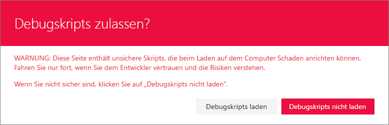
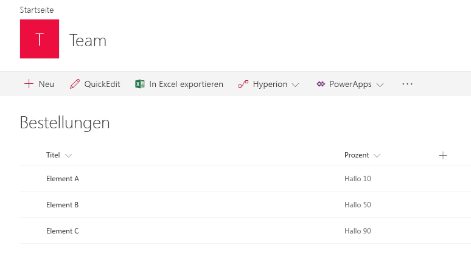
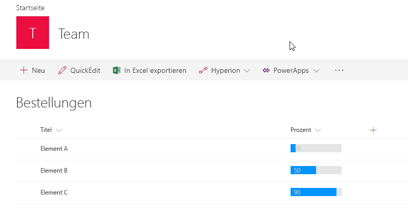
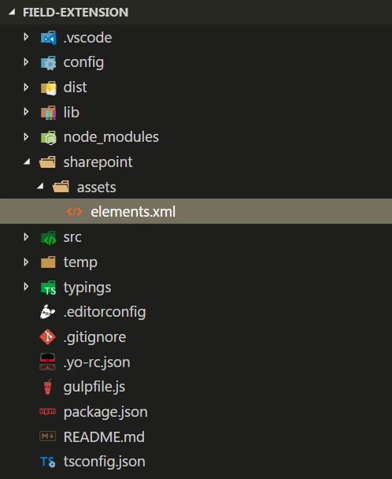
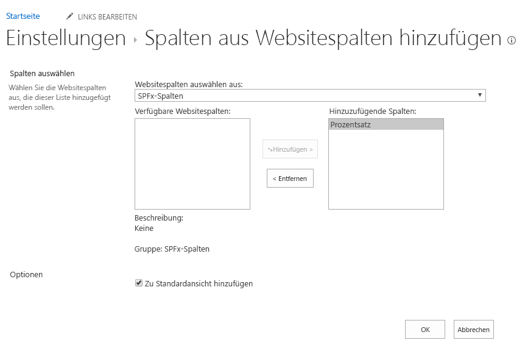

# <a name="build-your-first-field-customizer-extension"></a>Erstellen Ihrer ersten Field Customizer-Erweiterung

Erweiterungen sind clientseitige Komponenten, die im Kontext einer SharePoint-Website ausgeführt werden. Erweiterungen lassen sich auf SharePoint Online bereitstellen und auch mithilfe aktueller JavaScript-Tools und -Bibliotheken erstellen.

Sie können die nachfolgend beschriebene Anleitung auch anhand dieses Videos in unserem [YouTube-Kanal „SharePoint Patterns & Practices“](https://www.youtube.com/watch?v=fijOzUmlXrY&list=PLR9nK3mnD-OXtWO5AIIr7nCR3sWutACpV) nachvollziehen. 

<a href="https://www.youtube.com/watch?v=4wgZy5tm4yo">

</a>

## <a name="create-an-extension-project"></a>Erstellen eines Erweiterungsprojekts

1. Erstellen Sie an einem Speicherort Ihrer Wahl ein neues Projektverzeichnis:
    
    ```
    md field-extension
    ```
    
2. Wechseln Sie in das Projektverzeichnis:
    
    ```
    cd field-extension
    ```
    
3. Führen Sie den Yeoman-SharePoint-Generator aus, um eine neue HelloWorld-Erweiterung zu erstellen:
    
    ```
    yo @microsoft/sharepoint
    ```
    
4. Es werden verschiedene Eingabeaufforderungen angezeigt. Gehen Sie wie folgt vor:
    
    * Übernehmen Sie den Standardwert **field-extension** als Namen der Lösung, und drücken Sie die EINGABETASTE.
    * Wählen Sie **SharePoint Online only (latest)**, und drücken Sie die EINGABETASTE.
    * Wählen Sie **Use the current folder** aus, und drücken Sie die EINGABETASTE.
    * Wählen Sie **N**, damit die Erweiterung auf jeder Website explizit installiert werden muss, wenn sie verwendet wird.
    * Wählen Sie **Extension** als den zu erstellenden Typ von clientseitiger Komponente aus. 
    * Wählen Sie **Field Customizer** als den zu erstellenden Erweiterungstyp aus.
    
5. Über die nächsten Eingabeaufforderungen werden spezifische Informationen zu der Erweiterung abgefragt:
     
    * Übernehmen Sie den Standardwert **HelloWorld** als Namen für Ihre Erweiterung, und drücken Sie die EINGABETASTE.

    * Übernehmen Sie den Standardwert **HelloWorld description** als Beschreibung Ihrer Erweiterung, und drücken Sie die EINGABETASTE.

    * Übernehmen Sie den Standardwert **No JavaScript Framework** als Frameworkauswahl, und drücken Sie die EINGABETASTE. 
    
    
    
    An diesem Punkt installiert Yeoman die erforderlichen Abhängigkeiten und erstellt ein Gerüst für die Lösungsdateien sowie die **HelloWorld**-Erweiterung. Das kann einige Minuten dauern. 
    
    Nach Abschluss der Gerüsterstellung sollte folgende Erfolgsmeldung angezeigt werden:
    
    
    
    Details zur Behebung etwaiger Fehler finden Sie unter [Bekannte Probleme](../../known-issues-and-common-questions.md).

6. Sobald das Gerüst abgeschlossen ist, sperren Sie die Version der Projektabhängigkeiten, indem Sie den folgenden Befehl ausführen:

    ```sh
    npm shrinkwrap
    ```
    
7. Geben Sie Folgendes in die Konsole ein, um Visual Studio Code zu starten.
    
    ```
    code .
    ```
    
    > [!NOTE] 
    > Da die clientseitige SharePoint-Lösung auf HTML/TypeScript basiert, können Sie zur Erstellung Ihrer Erweiterung jeden Code-Editor verwenden, der clientseitige Entwicklung unterstützt.

    Beachten Sie, dass die Standardlösungsstruktur wie die Lösungsstruktur für clientseitige Webparts aussieht. Dies ist die grundlegende SharePoint-Framework-Lösungsstruktur mit ähnlichen Konfigurationsoptionen über alle Lösungstypen hinweg.

    

8. Öffnen Sie **HelloWorldFieldCustomizer.manifest.json** im Ordner **src\extensions\helloWorld**.

    Diese Datei definiert den Erweiterungstyp und eine eindeutige `id` für die Erweiterung. Sie benötigen diese eindeutige ID später beim Debuggen und Bereitstellen der Erweiterung in SharePoint.

    

## <a name="code-your-field-customizer"></a>Codieren des Field Customizers 

Öffnen Sie die Datei **HelloWorldFieldCustomizer.ts** im Ordner **src\extensions\helloWorld**.

Beachten Sie, dass die Basisklasse für den Field Customizer aus dem **sp-listview-extensibility**-Paket importiert wird, das den SharePoint-Frameworkcode enthält, der für den Field Customizer erforderlich ist.

```typescript
import { Log } from '@microsoft/sp-core-library';
import { override } from '@microsoft/decorators';
import {
  BaseFieldCustomizer,
  IFieldCustomizerCellEventParameters
} from '@microsoft/sp-listview-extensibility';
```

Die Logik für den Field Customizer befindet sich in den Methoden **OnInit()**, **onRenderCell()** und **onDisposeCell()**.

* In **onInit()** müssen Sie jegliches Setup vornehmen, das für die Erweiterung erforderlich ist. Dieses Ereignis tritt auf, nachdem `this.context` und `this.properties` zugewiesen wurden, jedoch bevor das Seiten-DOM bereit ist. Wie bei Webparts gibt `onInit()` eine Zusage zurück, die Sie verwenden können, um asynchrone Vorgänge durchzuführen; `onRenderCell()` wird erst dann aufgerufen, wenn die Zusage erfüllt wurde. Wenn Sie dies nicht benötigen, geben Sie einfach `Promise.resolve<void>();` zurück.
* **onRenderCell()** tritt auf, wenn jede Zelle gerendert wird. Die Methode bietet ein `event.domElement`-HTML-Element, in das der Code den Inhalt schreiben kann.
* **onDisposeCell()** tritt unmittelbar vor dem Löschen von `event.cellDiv` auf. Die Methode kann zum Freigeben von Ressourcen verwendet werden, die beim Feldrendering zugeordnet wurden. Wenn `onRenderCell()` ein React-Element bereitgestellt hat, muss `onDisposeCell()` zum Freigeben verwendet werden; anderenfalls würde ein Ressourcenverlust auftreten. 

Nachfolgend finden Sie den Inhalt von **onRenderCell()** und **onDisposeCell()** in der Standardlösung:

```typescript
@override
  public onRenderCell(event: IFieldCustomizerCellEventParameters): void {
    // Use this method to perform your custom cell rendering.
    const text: string = `${this.properties.sampleText}: ${event.fieldValue}`;

    event.domElement.innerText = text;

    event.domElement.classList.add(styles.cell);
  }

  @override
  public onDisposeCell(event: IFieldCustomizerCellEventParameters): void {
    // This method should be used to free any resources that were allocated during rendering.
    // For example, if your onRenderCell() called ReactDOM.render(), then you should
    // call ReactDOM.unmountComponentAtNode() here.
    super.onDisposeCell(event);
  }
```

## <a name="debug-your-field-customizer"></a>Debuggen des Field Customizers

SharePoint-Framework-Erweiterungen können derzeit nicht mit der lokalen Workbench getestet werden. Sie müssen sie direkt mit einer SharePoint Online-Live-Website testen und bereitstellen. Hierzu ist es nicht erforderlich, die Anpassung im App-Katalog bereitzustellen, was das Debugging vereinfacht und beschleunigt.

1. Zunächst führen Sie den folgenden Befehl aus, um den Code zu kompilieren und die Dateien auf Ihrem lokalen Computer zu hosten:
    
    ```
    gulp serve --nobrowser
    ```
    
    Sie verwenden die Option `--nobrowser`, da ein Start der lokalen Workbench nicht nötig ist, weil Erweiterungen nicht lokal debuggt werden können.

    Wenn der Code ohne Fehler kompiliert wurde, verarbeitet er das resultierende Manifest von https://localhost:4321.

    

2. Um die Erweiterung zu testen, navigieren Sie zu einer Website in Ihrem SharePoint Online-Mandanten.

3. Wechseln Sie zur Seite **Websiteinhalte**.

4. Wählen Sie auf der Symbolleiste **Neu**, und wählen Sie dann **Liste**.
    
    
    
5. Erstellen Sie eine neue Liste mit dem Namen **Bestellungen**, und klicken Sie auf **Erstellen**.
    
    
    
6. Klicken Sie auf das **Pluszeichen**, und wählen Sie **Zahl**, um ein neues Zahlenfeld für die Liste zu erstellen.
    
    
    
7. Legen Sie den Namen des Felds auf **Prozent** fest, und wählen Sie dann **Speichern**.
    
    
    
8. Fügen Sie einige Elemente mit verschiedenen Zahlen in das Feld „Prozent“ ein. Wir ändern die Darstellung später in diesem Lernprogramm, sodass die verschiedenen Zahlen basierend auf Ihrer benutzerdefinierten Implementierung unterschiedlich dargestellt werden.

    

    Da der Field Customizer immer noch in localhost gehostet wird und ausgeführt wird, können wir bestimmte Debugging-Abfrageparameter zum Ausführen des Codes in der neu erstellten Liste verwenden.

9. Hängen Sie die folgenden Abfragezeichenfolgenparameter an die URL an. Beachten Sie, dass Sie die ID aktualisieren müssen, damit diese Ihrer Erweiterungs-ID entspricht, die in **HelloWorldFieldCustomizer.manifest.json** verfügbar ist. Weitere Informationen finden Sie unter [Weitere Details zu den URL-Abfrageparametern](#more-details-about-the-url-query-parameters). 

    ```
    ?loadSPFX=true&debugManifestsFile=https://localhost:4321/temp/manifests.js&fieldCustomizers={"Percent":{"id":"45a1d299-990d-4917-ba62-7cb67158be16","properties":{"sampleText":"Hello!"}}}
    ```
    
    <br/>

    Die vollständige URL sollte in etwa wie folgt aussehen, abhängig von der URL Ihres Mandanten und dem Speicherort der neu erstellte Liste:
    
    ```
    contoso.sharepoint.com/Lists/Orders/AllItems.aspx?loadSPFX=true&debugManifestsFile=https://localhost:4321/temp/manifests.js&fieldCustomizers={"Percent":{"id":"45a1d299-990d-4917-ba62-7cb67158be16","properties":{"sampleText":"Hello!"}}}
    ```
    
10. Klicken Sie bei Aufforderung auf **Debugskripts laden**, um das Laden der Debugmanifeste zu akzeptieren.

    

    Beachten Sie, dass die prozentualen Werte jetzt mit einer zusätzlichen Präfixzeichenfolge als `Hello!: ` dargestellt werden, die eine Eigenschaft für den Field Customizer bereitstellt.

    


### <a name="more-details-about-the-url-query-parameters"></a>Weitere Details zu den URL-Abfrageparametern

- **loadSPFX=true** dient zum Sicherstellen, dass das SharePoint-Framework auf der Seite geladen wird. Aus Leistungsgründen wird das Framework erst geladen, wenn mindestens eine Erweiterung registriert wurde. Da keine Komponenten registriert sind, müssen Sie das Framework explizit laden.
- **debugManifestsFile** gibt an, dass lokal verarbeitete SPFx-Komponenten geladen werden sollen. Das Ladeprogramm sucht nur an zwei Stellen nach Komponenten: im App-Katalog (nach Komponenten der bereitgestellten Lösung) und auf dem SharePoint-Manifestserver (nach den Systembibliotheken).
- **FieldCustomizers** gibt die Felder an, deren Rendering in der Liste durch den Field Customizer gesteuert wird. Der ID-Parameter gibt die GUID der Erweiterung an, die für die Steuerung des Renderings des Felds verwendet werden soll. Der Eigenschaftenparameter ist eine optionale Textzeichenfolge mit einem JSON-Objekt, das in `this.properties` der Erweiterung deserialisiert wird.
    - **Schlüssel:**: Verwenden Sie den internen Namen des Felds als Schlüssel.
    - **ID:**: Die GUID der Field Customizer-Erweiterung, die mit diesem Feld verknüpft ist.
    - **Eigenschaften**: Die in der Erweiterung definierten Eigenschaftenwerte. In diesem Beispiel ist `sampleText` eine durch die Erweiterung definierte Eigenschaft.

<br/>

## <a name="enhance-the-field-customizer-rendering"></a>Verbessern der Darstellung des Field Customizer

Da wir nun den sofort einsetzbaren Anfangspunkt des Field Customizer erfolgreich getestet haben, ändern wir die Logik ein wenig, um den Feldwert noch schöner darzustellen. 

1. Öffnen Sie die Datei **HelloWorld.module.scss** im Ordner **src\extensions\helloWorld**, und aktualisieren Sie die Stildefinition wie folgt.

    ```
    .HelloWorld {
      .cell {
        display: 'inline-block';
      }
      .full {
        background-color: '#e5e5e5';
        width: '100px';
      }
    }

    ```
    
2. Öffnen Sie die Datei **HelloWorldFieldCustomizer.ts** im Ordner **src\extensions\helloWorld**, und aktualisieren Sie die **onRednerCell**-Methode wie folgt.

    ```typescript
        @override
        public onRenderCell(event: IFieldCustomizerCellEventParameters): void {

            event.domElement.classList.add(styles.cell);
            event.domElement.innerHTML = `
                    <div class='${styles.HelloWorld}'>
                        <div class='${styles.full}'>
                        <div style='width: ${event.fieldValue}px; background:#0094ff; color:#c0c0c0'>
                            &nbsp; ${event.fieldValue}
                        </div>
                        </div>
                    </div>`;
        }
    ```

3. Stellen Sie in dem Konsolenfenster sicher, dass keine Ausnahmen vorhanden sind. Wenn die Lösung nicht in *localhost* ausgeführt wird, führen Sie den folgenden Befehl aus:

    ```
    gulp serve --nobrowser
    ```

4. Verwenden Sie in der zuvor erstellten Liste den gleichen Abfrageparameter, den Sie zuvor für das Feld `Percent` verwendet haben, sowie die aktualisierte `ID` für die Erweiterungs-ID aus der Datei **HelloWorldFieldCustomizer.manifest.json**.

5. Klicken Sie bei Aufforderung auf **Debugskripts laden**, um das Laden der Debugmanifeste zu akzeptieren.

    

    <br/>

    Beachten Sie, dass sich die Felddarstellung komplett geändert hat. Der Feldwert wird grafisch dargestellt.

    

## <a name="add-the-field-definition-to-the-solution-package-for-deployment"></a>Hinzufügen der Felddefinition zum Lösungspaket für die Bereitstellung

Wir haben die Lösung nun ordnungsgemäß im Debuggingmodus getestet und können sie als Paket bereitstellen, das automatisch als Teil des Lösungspakets auf den Websites bereitgestellt wird. 

1. Installieren Sie das Lösungspaket auf der Website, auf der es installiert sein soll, damit das Erweiterungsmanifest für die Ausführung freigegeben wird.

2. Ordnen Sie den Field Customizer einem vorhandenen Feld in der Website zu. Sie können dies programmgesteuert (CSOM/REST) oder mit dem Feature-Framework innerhalb des SharePoint-Framework-Lösungspakets tun. Sie müssen die folgenden Eigenschaften im `SPField`-Objekt auf der Website- oder Listenebene zuweisen.
    - **ClientSiteComponentId:** Dies ist der Bezeichner (GUID) für den Field Customizer, der im App-Katalog installiert wurde.
    - **ClientSideComponentProperties:** Dies ist ein optionaler Parameter, der zum Bereitstellen von Eigenschaften für die Field Customizer-Instanz verwendet werden kann.

    Beachten Sie, dass Sie die Anforderung zum Hinzufügen einer Lösung mit Ihrer Erweiterung zu der Website mithilfe der `skipFeatureDeployment`-Einstellung in **package-solution.json** steuern können. Auch wenn Sie die Installation der Lösung auf der Website nicht voraussetzen, müssen Sie **ClientSideComponentId** bestimmten Objekten zuweisen, damit die Erweiterung angezeigt wird.

    In den folgenden Schritten prüfen wir die Standardfelddefinition, die automatisch erstellt und mit den erforderlichen Konfigurationen bereitgestellt wird, sobald das Lösungspaket auf einer Website installiert wird.

3. Wechseln Sie wieder zu Ihrer Lösung in Visual Studio Code (oder Ihrem bevorzugten Editor).

4. Erweitern Sie im Stammverzeichnis der Lösung den Ordner **sharepoint** und den Unterordner **assets**, um die vorhandene Datei **elements.xml** anzuzeigen. 
    
    

<br/>

### <a name="review-the-elementsxml-file"></a>Prüfen der Datei „elements.xml“ 

Öffnen Sie im Ordner **sharepoint\assets** die Datei mit dem Namen **elements.xml**.

Beachte Sie die folgende XML-Struktur in **elements.xml**.  Für die Eigenschaft **ClientSideComponentId** wurde die eindeutige ID Ihres Field Customizer aus der Datei **HelloWorldFieldCustomizer.manifest.json** im Ordner **src\extensions\helloWorld** automatisch angegeben.

```xml
<?xml version="1.0" encoding="utf-8"?>
<Elements xmlns="http://schemas.microsoft.com/sharepoint/">

    <Field ID="{060E50AC-E9C1-3D3C-B1F9-DE0BCAC200F6}"
            Name="SPFxPercentage"
            DisplayName="Percentage"
            Type="Number"
            Min="0"
            Required="FALSE"
            Group="SPFx Columns"
            ClientSideComponentId="7e7a4262-d02b-49bf-bfcb-e6ef1716aaef">
    </Field>

</Elements>
```

<br/>

### <a name="ensure-that-definitions-are-taken-into-account-within-the-build-pipeline"></a>Gewährleisten der Berücksichtigung von Definitionen in der Buildpipeline

Öffnen Sie **package-solution.json** im Ordner **config**. Die Datei **package-solution.json** definiert die Paketmetadaten, wie im folgenden Code dargestellt. Um sicherzustellen, dass die Datei **element.xml** beim Packen der Lösung berücksichtigt wird, hat das Standardgerüst die benötigte Konfiguration hinzugefügt, um eine Framework-Featuredefinition für das Lösungspaket zu definieren.

```json
{
  "solution": {
    "name": "field-extension-client-side-solution",
    "id": "11cd343e-1ce6-462c-8acb-929804d0c3b2",
    "version": "1.0.0.0",
    "skipFeatureDeployment": false,
    "features": [{
      "title": "Field Extension - Deployment of custom field.",
      "description": "Deploys a custom field with ClientSideComponentId association",
      "id": "123fe847-ced2-3036-b564-8dad5c6c6e83",
      "version": "1.0.0.0",
      "assets": {        
        "elementManifests": [
          "elements.xml"
        ]
      }
    }]
  },
  "paths": {
    "zippedPackage": "solution/field-extension.sppkg"
  }
}

```


## <a name="deploy-the-field-to-sharepoint-online-and-host-javascript-from-local-host"></a>Bereitstellen des Felds in SharePoint Online und Hosten des JavaScript-Codes über Localhost

Sie können die Lösung jetzt auf einer SharePoint-Website bereitstellen, wobei die Feldzuordnung automatisch in ein Feld einbezogen wird. 

1. Geben Sie im Konsolenfenster den folgenden Befehl ein, um die clientseitige Lösung, die die Erweiterung enthält, zu verpacken und so die Grundstruktur für die Paketerstellung zu erstellen:

    ```
    gulp bundle
    ```

2. Führen Sie den folgenden Befehl aus, um das Lösungspaket zu erstellen:

    ```
    gulp package-solution
    ```

    Der Befehl erstellt das Paket im Ordner **sharepoint/solution**:

    ```
    field-extension.sppkg
    ```

3. Als Nächstes müssen Sie das Paket, das generiert wurde, im App-Katalog bereitstellen. Wechseln Sie dazu zum **App-Katalog** Ihres Mandanten, und öffnen Sie die Bibliothek **Apps für SharePoint**.

4. Laden Sie das Paket `field-extension.sppkg`, das sich im Ordner **sharepoint/solution** befindet, in den App-Katalog hoch, oder platzieren Sie es dort per Drag & Drop. In SharePoint wird ein Dialogfeld angezeigt, und Sie werden aufgefordert, der clientseitigen Lösung zu vertrauen.

    Da wir die Host-URLs der Lösung für diese Bereitstellung nicht aktualisiert haben, verweist die URL immer noch auf `https://localhost:4321`. 
    
5. Klicken Sie auf die Schaltfläche **Bereitstellen**.

    

6. Wechseln Sie zu der Website, auf der Sie die Bereitstellung der SharePoint-Ressource testen möchten. Dies könnte eine Websitesammlung im Mandanten sein, auf dem Sie dieses Lösungspaket bereitgestellt haben.

7. Klicken Sie auf der oberen Navigationsleiste rechts auf das Zahnradsymbol und anschließend auf **App hinzufügen**, um Ihre Apps-Seite aufzurufen.

8. Geben Sie in das **Suchfeld** die Zeichenfolge **field** ein, und drücken Sie die EINGABETASTE, um Ihre Apps zu filtern.

    

9. Wählen Sie die App **field-extension-client-side-solution**, um die Lösung auf der Website zu installieren. Wenn die Installation abgeschlossen ist, aktualisieren Sie die Seite, indem Sie F5 drücken.

10. Klicken Sie nach dem Installieren der Lösung auf **Neu** in der Symbolleiste auf der Seite **Websiteinhalte**, und wählen Sie **Liste**.

    

11. Erstellen Sie eine Liste mit dem Namen **Rechnungen**.

12. Wählen Sie, nachdem die neue Liste erstellt wurde, im Menü der neu erstellten Liste auf der Seite **Websiteinhalte** die Option **Einstellungen** aus.

    

13. Klicken Sie unter **Spalten** auf die Option **Aus vorhandenen Websitespalten hinzufügen**.

14. Wählen Sie in der Gruppe **SPFx-Spalten** das Feld **Prozent**, das über das Lösungspaket bereitgestellt wurde, und wählen Sie dann **OK**.

    

15. Stellen Sie in der Konsole sicher, dass die Lösung ausgeführt wird. Wenn sie nicht ausgeführt wird, führen Sie den folgenden Befehl im Lösungsordner aus:

    ```
    gulp serve --nobrowser
    ```

16. Wechseln Sie zu der neu erstellten Liste **Rechnungen**. Fügen Sie der Liste einige neue Einträge mit verschiedenen Werten in der Prozentspalte hinzu, um zu sehen, wie das Feld ohne die Debugging-Abfrageparameter dargestellt wird.


In diesem Fall hosten wir den JavaScript-Code weiterhin von Localhost. Sie können die Objekte jedoch auch in ein beliebiges CDN verschieben und die URL aktualisieren, um das Laden von JavaScript-Objekten auch außerhalb von Localhost zu ermöglichen.

Die Vorgehensweise für die Veröffentlichung Ihrer App ist für alle Erweiterungstypen identisch. Sie können die folgenden Schritte für die Veröffentlichung befolgen, um die im CDN gehosteten Objekte zu aktualisieren: [Hosten von Erweiterungen in einem Office 365 CDN](./hosting-extension-from-office365-cdn.md).

> [!NOTE]
> Wenn Sie einen Fehler in der Dokumentation oder im SharePoint-Framework finden, melden Sie ihn an das SharePoint Engineering unter Verwendung der [Fehlerliste im sp-dev-docs-Repository](https://github.com/SharePoint/sp-dev-docs/issues). Vielen Dank im Voraus für Ihr Feedback.

## <a name="see-also"></a>Siehe auch

- [Erstellen Ihrer ersten Erweiterung des Typs „ListView Command Set“](./building-simple-cmdset-with-dialog-api.md)
- [Übersicht über SharePoint-Framework-Erweiterungen](../overview-extensions.md)