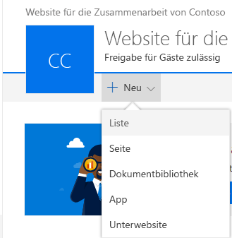

# <a name="build-your-first-field-customizer-extension"></a><span data-ttu-id="137f8-101">Erstellen Sie Ihre erste Field Customizer-Erweiterung</span><span class="sxs-lookup"><span data-stu-id="137f8-101">Build your first Field Customizer extension</span></span>

><span data-ttu-id="137f8-p101">**Hinweis:** Die SharePoint Framework-Erweiterungen befinden sich derzeit in der Preview-Phase. Änderungen sind vorbehalten. Die Verwendung von SharePoint Framework-Erweiterungen in Produktionsumgebungen wird aktuell nicht unterstützt.</span><span class="sxs-lookup"><span data-stu-id="137f8-p101">**Note:** The SharePoint Framework Extensions are currently in preview and are subject to change. SharePoint Framework Extensions are not currently supported for use in production environments.</span></span>

<span data-ttu-id="137f8-p102">Erweiterungen sind clientseitige Komponenten, die im Kontext einer SharePoint-Seite ausgeführt werden. Sie lassen sich in SharePoint Online bereitstellen und mithilfe aktueller JavaScript-Tools und -Bibliotheken erstellen.</span><span class="sxs-lookup"><span data-stu-id="137f8-p102">Extensions are client-side components that run inside the context of a SharePoint page. Extensions can be deployed to SharePoint Online and you can use modern JavaScript tools and libraries to build them.</span></span>

<span data-ttu-id="137f8-106">Sie können die nachfolgend beschriebene Anleitung auch anhand dieses Videos in unserem [YouTube-Kanal „SharePoint Patterns & Practices“](https://www.youtube.com/watch?v=fijOzUmlXrY&list=PLR9nK3mnD-OXtWO5AIIr7nCR3sWutACpV) nachvollziehen:</span><span class="sxs-lookup"><span data-stu-id="137f8-106">You can also follow these steps by watching the video on the [SharePoint PnP YouTube Channel](https://www.youtube.com/watch?v=fijOzUmlXrY&list=PLR9nK3mnD-OXtWO5AIIr7nCR3sWutACpV).</span></span> 

<a href="https://www.youtube.com/watch?v=fijOzUmlXrY&list=PLR9nK3mnD-OXtWO5AIIr7nCR3sWutACpV">

</a>

## <a name="create-an-extension-project"></a><span data-ttu-id="137f8-107">Erstellen eines Erweiterungsprojekts</span><span class="sxs-lookup"><span data-stu-id="137f8-107">Create an extension project</span></span>
<span data-ttu-id="137f8-108">Erstellen Sie an einem Speicherort Ihrer Wahl ein neues Projektverzeichnis:</span><span class="sxs-lookup"><span data-stu-id="137f8-108">Create a new project directory in your favorite location.</span></span>

```
md field-extension
```

<span data-ttu-id="137f8-109">Wechseln Sie in das Projektverzeichnis:</span><span class="sxs-lookup"><span data-stu-id="137f8-109">Go to the project directory.</span></span>

```
cd field-extension
```

<span data-ttu-id="137f8-110">Führen Sie den Yeoman-SharePoint-Generator aus, um eine neue HelloWorld-Erweiterung zu erstellen:</span><span class="sxs-lookup"><span data-stu-id="137f8-110">Create a new HelloWorld extension by running the Yeoman SharePoint Generator.</span></span>

```
yo @microsoft/sharepoint
```

<span data-ttu-id="137f8-111">Es werden verschiedene Eingabeaufforderungen angezeigt. Gehen Sie wie folgt vor:</span><span class="sxs-lookup"><span data-stu-id="137f8-111">When prompted:</span></span>

* <span data-ttu-id="137f8-112">Übernehmen Sie den Standardwert **field-extension** als Namen der Lösung, und drücken Sie die **EINGABETASTE**.</span><span class="sxs-lookup"><span data-stu-id="137f8-112">Accept the default value of **field-extension** as your solution name and press **Enter**.</span></span>
* <span data-ttu-id="137f8-113">Wählen Sie **Use the current folder (Aktuellen Ordner verwenden)** aus, und drücken Sie die **EINGABETASTE**.</span><span class="sxs-lookup"><span data-stu-id="137f8-113">Choose **Use the current folder** and press **Enter**.</span></span>
* <span data-ttu-id="137f8-114">Wählen Sie **N**, damit die Erweiterung auf jeder Website explizit installiert werden muss, wenn diese verwendet wird.</span><span class="sxs-lookup"><span data-stu-id="137f8-114">Choose **N** to require extension to be installed on each site explicitly when it's being used.</span></span>
* <span data-ttu-id="137f8-115">Wählen Sie **Extension (Preview)** als den zu erstellenden Typ von clientseitiger Komponente aus.</span><span class="sxs-lookup"><span data-stu-id="137f8-115">Choose **Extension (Preview)** as the client-side component type to be created.</span></span> 
* <span data-ttu-id="137f8-116">Wählen Sie **Field Customizer (Preview)** als den zu erstellenden Erweiterungstyp aus.</span><span class="sxs-lookup"><span data-stu-id="137f8-116">Choose **Field Customizer (Preview)** as the extension type to be created.</span></span>

<span data-ttu-id="137f8-117">Über die nächsten Eingabeaufforderungen werden spezifische Informationen zu der Erweiterung abgefragt:</span><span class="sxs-lookup"><span data-stu-id="137f8-117">The next set of prompts will ask for specific information about your extension:</span></span>

* <span data-ttu-id="137f8-118">Übernehmen Sie den Standardwert **HelloWorld** als Namen für Ihre Erweiterung, und drücken Sie die **EINGABETASTE**.</span><span class="sxs-lookup"><span data-stu-id="137f8-118">Accept the default value of **HelloWorld** as your extension name and press **Enter**.</span></span>
* <span data-ttu-id="137f8-119">Übernehmen Sie den Standardwert **HelloWorld description** als Beschreibung Ihrer Erweiterung, und drücken Sie die **EINGABETASTE**.</span><span class="sxs-lookup"><span data-stu-id="137f8-119">Accept the default value of **HelloWorld description** as your extension description and press **Enter**.</span></span>
* <span data-ttu-id="137f8-120">Übernehmen Sie den Standard **No JavaScript Framework** als Frameworkauswahl, und drücken Sie die **EINGABETASTE**</span><span class="sxs-lookup"><span data-stu-id="137f8-120">Accept the default **No JavaScript Framework** as the framework selection and press **Enter**</span></span> 


<span data-ttu-id="137f8-p103">An diesem Punkt installiert Yeoman die erforderlichen Abhängigkeiten und erstellt ein Gerüst für die Lösungsdateien sowie die **HelloWorld**-Erweiterung. Das kann einige Minuten dauern.</span><span class="sxs-lookup"><span data-stu-id="137f8-p103">At this point, Yeoman will install the required dependencies and scaffold the solution files along with the **HelloWorld** extension. This might take a few minutes.</span></span> 

<span data-ttu-id="137f8-124">Nach Abschluss der Gerüsterstellung sollte folgende Erfolgsmeldung angezeigt werden:</span><span class="sxs-lookup"><span data-stu-id="137f8-124">When the scaffold is complete, you should see the following message indicating a successful scaffold:</span></span>


<span data-ttu-id="137f8-126">Details zur Behebung etwaiger Fehler finden Sie unter [Known issues](../basics/known-issues).</span><span class="sxs-lookup"><span data-stu-id="137f8-126">For information about troubleshooting any errors, see [Known issues](../basics/known-issues).</span></span>

<span data-ttu-id="137f8-127">Geben Sie nach der Erstellung des Lösungsgerüsts Folgendes in die Konsole ein, um Visual Studio Code zu starten:</span><span class="sxs-lookup"><span data-stu-id="137f8-127">Once the solution scaffolding is completed, type the following into the console to start Visual Studio Code.</span></span>

```
code .
```

> <span data-ttu-id="137f8-128">Beachten Sie: Da die clientseitige SharePoint-Lösung auf HTML/TypeScript basiert, können Sie zur Erstellung Ihrer Erweiterung jeden Code-Editor verwenden, der clientseitige Entwicklung unterstützt.</span><span class="sxs-lookup"><span data-stu-id="137f8-128">Notice that because the SharePoint client-side solution is HTML/TypeScript based, you can use any code editor that supports client-side development to build your extension.</span></span>

<span data-ttu-id="137f8-p104">Wie Sie sehen, entspricht die Standardlösungsstruktur der Lösungsstruktur clientseitiger Webparts. Hierbei handelt es sich um die grundlegende SharePoint Framework-Lösungsstruktur, die für alle Lösungstypen vergleichbare Konfigurationsoptionen bereitstellt.</span><span class="sxs-lookup"><span data-stu-id="137f8-p104">Notice how the default solution structure is like the solution structure of client-side web parts. This is the basic SharePoint Framework solution structure with similar configuration options across all solution types.</span></span>


<span data-ttu-id="137f8-132">Öffnen Sie **HelloWorldFieldCustomizer.manifest.json** im Ordner **src\extensions\helloWorld**.</span><span class="sxs-lookup"><span data-stu-id="137f8-132">Open **HelloWorldFieldCustomizer.manifest.json** at the **src\extensions\helloWorld** folder.</span></span>

<span data-ttu-id="137f8-p105">In dieser Datei sind der Erweiterungstyp und ein eindeutiger Bezeichner **„id“** für die Erweiterung definiert. Sie benötigen diesen eindeutigen Bezeichner später, um die Erweiterung zu debuggen und in SharePoint bereitzustellen.</span><span class="sxs-lookup"><span data-stu-id="137f8-p105">This file defines your extension type and a unique identifier **“id”** for your extension. You’ll need this unique identifier later when debugging and deploying your extension to SharePoint.</span></span>


## <a name="coding-your-field-customizer"></a><span data-ttu-id="137f8-136">Coding des Field Customizers</span><span class="sxs-lookup"><span data-stu-id="137f8-136">Coding your Field Customizer</span></span> 
<span data-ttu-id="137f8-137">Öffnen Sie die Datei **HelloWorldFieldCustomizer.ts** im Ordner **src\extensions\helloWorld**.</span><span class="sxs-lookup"><span data-stu-id="137f8-137">Open the **HelloWorldFieldCustomizer.ts** file in the **src\extensions\helloWorld** folder.</span></span>

<span data-ttu-id="137f8-138">Beachten Sie, dass die Basisklasse für den Field Customizer aus dem **sp-application-base**-Paket importiert wird, das den SharePoint-Frameworkcode enthält, der für den Field Customizer erforderlich ist.</span><span class="sxs-lookup"><span data-stu-id="137f8-138">Notice that the base class for the Field Customizer is imported from the **sp-application-base** package, which contains SharePoint framework code required by the Field Customizer.</span></span>

```ts
import { Log } from '@microsoft/sp-core-library';
import { override } from '@microsoft/decorators';
import {
  BaseFieldCustomizer,
  IFieldCustomizerCellEventParameters
} from '@microsoft/sp-listview-extensibility';
```

<span data-ttu-id="137f8-139">Die Logik für den Field Customizer befindet sich in den Methoden **OnInit()**, **onRenderCell()** und **onDisposeCell()**.</span><span class="sxs-lookup"><span data-stu-id="137f8-139">The logic for your Field Customizer is contained in the **OnInit()**, **onRenderCell()**, and **onDisposeCell()** methods.</span></span>

* <span data-ttu-id="137f8-p106">**onInit():** Hier müssen Sie das Setup vornehmen, das für die Erweiterung erforderlich ist. Dieses Ereignis tritt auf, nachdem `this.context` und `this.properties` zugewiesen wurden, jedoch bevor das Seiten-DOM bereit ist. Wie bei Webparts gibt `onInit()` eine Zusage zurück, die Sie verwenden können, um asynchrone Vorgänge durchzuführen; `onRenderCell()` wird erst dann aufgerufen, wenn die Zusage erfüllt wurde. Wenn Sie dies nicht benötigen, geben Sie einfach `Promise.resolve<void>();` zurück.</span><span class="sxs-lookup"><span data-stu-id="137f8-p106">**onInit():**  this is where you should perform any setup needed for your extension. This event occurs after `this.context` and `this.properties` are assigned, but before the page DOM is ready. As with web parts, `onInit()` returns a promise that you can use to perform asynchronous operations; `onRenderCell()` will not be called until your promise has resolved. If you don’t need that, simply return `Promise.resolve<void>();`.</span></span>
* <span data-ttu-id="137f8-p107">**onRenderCell():** Dieses Ereignis tritt auf, bevor die einzelnen Zellen gerendert werden. Es stellt ein `event.domElement`-HTML-Element bereit, in das der Code den Inhalt schreiben kann.</span><span class="sxs-lookup"><span data-stu-id="137f8-p107">**onRenderCell():**  This event occurs before each cell is rendered. It provides an `event.domElement` HTML element where your code can write its content.</span></span>
* <span data-ttu-id="137f8-p108">**onDisposeCell():** Dieses Ereignis tritt direkt vor dem Löschen von `event.cellDiv` auf. Es kann zum Freigeben von Ressourcen verwendet werden, die beim Rendern von Feldern zugewiesen wurden. Wenn `onRenderCell()` zum Beispiel ein React-Element bereitgestellt hat, muss `onDisposeCell()` verwendet werden, um es freizugeben, da ansonsten ein Ressourcenverlust auftritt.</span><span class="sxs-lookup"><span data-stu-id="137f8-p108">**onDisposeCell():** This event occurs immediately before the `event.cellDiv` is deleted. It can be used to free any resources that were allocated during field rendering. For example, if `onRenderCell()` mounted a React element, `onDisposeCell()` must be used to free it, otherwise a resource leak would occur.</span></span> 

<span data-ttu-id="137f8-149">Nachfolgend finden Sie den Inhalt von **onRenderCell()** und **onDisposeCell()** in der Standardlösung:</span><span class="sxs-lookup"><span data-stu-id="137f8-149">Below are the contents of **onRenderCell()** and **onDisposeCell()** in the default solution:</span></span>

```ts
  @override
  public onRenderCell(event: IFieldCustomizerCellEventParameters): void {
    // Use this method to perform your custom cell rendering.
    const text: string = `['${event.fieldValue}']`;

    event.domElement.innerText = text;

    event.domElement.classList.add(styles.cell);
  }

  @override
  public onDisposeCell(event: IFieldCustomizerCellEventParameters): void {
    // This method should be used to free any resources that were allocated during rendering.
    // For example, if your onRenderCell() called ReactDOM.render(), then you should
    // call ReactDOM.unmountComponentAtNode() here.
    super.onDisposeCell(event);
  }
```

## <a name="debugging-your-field-customizer-using-gulp-serve-and-query-string-parameters"></a><span data-ttu-id="137f8-150">Debuggen Ihres Field Customizer mit gulp serve- und Abfragezeichenfolgen-Parametern</span><span class="sxs-lookup"><span data-stu-id="137f8-150">Debugging your Field Customizer using gulp serve and query string parameters</span></span>
<span data-ttu-id="137f8-p109">SharePoint Framework-Erweiterungen lassen sich aktuell nicht mithilfe der lokalen Workbench testen. Sie müssen direkt auf einer aktiven SharePoint Online-Website getestet und entwickelt werden. Dazu ist es jedoch nicht nötig, Ihre Anpassung im App-Katalog bereitzustellen. Dadurch bleibt das Debuggen einfach und effizient.</span><span class="sxs-lookup"><span data-stu-id="137f8-p109">SharePoint Framework extensions cannot currently be tested using the local workbench, so you'll need to test and develop them directly against a live SharePoint Online site. You do not however need to deploy your customization to the app catalog to do this, which keeps the debugging experience simple and efficient.</span></span>

<span data-ttu-id="137f8-153">Zunächst führen Sie den folgenden Befehl aus, um den Code zu kompilieren und die Dateien auf Ihrem lokalen Computer zu hosten:</span><span class="sxs-lookup"><span data-stu-id="137f8-153">First, compile your code and host the compiled files from the local machine by running this command:</span></span>
```
gulp serve --nobrowser
```

<span data-ttu-id="137f8-154">Die Option `--nobrowser` verwenden wir, weil Erweiterungen derzeit nicht lokal debuggt werden können und daher keine Notwendigkeit besteht, die lokale Workbench zu starten.</span><span class="sxs-lookup"><span data-stu-id="137f8-154">Notice that we used the `--nobrowser` option, since there's no value in launching the local workbench since you currently cannot debug extensions locally.</span></span>

<span data-ttu-id="137f8-155">Sobald der Code ohne Fehler kompiliert wurde, wird das resultierende Manifest von https://localhost:4321 ausgeliefert.</span><span class="sxs-lookup"><span data-stu-id="137f8-155">Once it compiles the code without errors, it will serve the resulting manifest from http://localhost:4321.</span></span>


<span data-ttu-id="137f8-157">Um die Erweiterung zu testen, navigieren Sie zu einer Website in Ihrem SharePoint Online-Mandanten.</span><span class="sxs-lookup"><span data-stu-id="137f8-157">To test your extension, navigate to a site in your SharePoint Online tenant.</span></span>

<span data-ttu-id="137f8-158">Wechseln Sie zur Seite **Websiteinhalt**.</span><span class="sxs-lookup"><span data-stu-id="137f8-158">Move to the **Site Contents** page.</span></span>

<span data-ttu-id="137f8-159">Klicken Sie in der Symbolleiste auf **Neu**, und wählen Sie **Liste**:</span><span class="sxs-lookup"><span data-stu-id="137f8-159">Click **New** from the toolbar and choose **List**:</span></span>



<span data-ttu-id="137f8-161">Erstellen Sie eine neue Liste mit dem Namen *Bestellungen*, und klicken Sie auf **Erstellen**:</span><span class="sxs-lookup"><span data-stu-id="137f8-161">Create a new list named *Orders* and click **Create**:</span></span>


<span data-ttu-id="137f8-163">Klicken Sie auf das **Pluszeichen**, und wählen Sie **Zahl**, um ein neues Zahlenfeld für die Liste zu erstellen:</span><span class="sxs-lookup"><span data-stu-id="137f8-163">Click the **plus** sign and choose **Number** to create a new Number field for the list:</span></span>


<span data-ttu-id="137f8-165">Legen Sie als Namen des Felds **Prozent** fest, und klicken Sie auf **Speichern**:</span><span class="sxs-lookup"><span data-stu-id="137f8-165">Set name of the field to **Percent** and click **Save**:</span></span>


<span data-ttu-id="137f8-p110">Fügen Sie einige Elemente mit verschiedenen Zahlen in das Feld „Prozent“ ein. Wir ändern die Darstellung später in diesem Lernprogramm, sodass die verschiedenen Zahlen basierend auf Ihrer benutzerdefinierten Implementierung unterschiedlich dargestellt werden.</span><span class="sxs-lookup"><span data-stu-id="137f8-p110">Add a few items with different numbers in the percent field. We'll modify the rendering later in this tutorial, so the different numbers will be presented differently based on your custom implementation.</span></span>


<span data-ttu-id="137f8-170">Da der Field Customizer immer noch in localhost gehostet wird und ausgeführt wird, können wir bestimmte Debugging-Abfrageparameter zum Ausführen des Codes in der neu erstellten Liste verwenden.</span><span class="sxs-lookup"><span data-stu-id="137f8-170">Since our Field Customizer is still hosted in localhost and is running, we can use specific debug query parameters to execute the code in the newly created list.</span></span>

<span data-ttu-id="137f8-p111">Fügen Sie die folgende Zeichenfolgen-Abfrageparameter an die URL an. Beachten Sie, dass Sie die ID aktualisieren müssen, damit diese Ihrer Erweiterungs-ID entspricht, die in **HelloWorldFieldCustomizer.manifest.json** verfügbar ist:</span><span class="sxs-lookup"><span data-stu-id="137f8-p111">Append the following query string parameters to the URL. Notice that you will need to update the id to match your own extension identifier available from the **HelloWorldFieldCustomizer.manifest.json** file:</span></span>

```
?loadSPFX=true&debugManifestsFile=https://localhost:4321/temp/manifests.js&fieldCustomizers={"Percent":{"id":"7e7a4262-d02b-49bf-bfcb-e6ef1716aaef","properties":{"sampleText":"Hello!"}}}
```
<span data-ttu-id="137f8-173">Weitere Details zu den URL-Abfrageparametern:</span><span class="sxs-lookup"><span data-stu-id="137f8-173">More detail about the URL query parameters:</span></span>

* <span data-ttu-id="137f8-p112">**loadSPFX=true:** Dieser Parameter stellt sicher, dass das SharePoint-Framework auf der Seite geladen wird. Aus Leistungsgründen wird das Framework normalerweise erst geladen, wenn mindestens eine Erweiterung registriert ist. Da aktuell noch keine Komponenten registriert sind, müssen Sie das Framework explizit laden.</span><span class="sxs-lookup"><span data-stu-id="137f8-p112">**loadSPFX=true:**  ensures that the SharePoint Framework is loaded on the page. For performance reasons, the framework is not normally loaded unless at least one extension is registered. Since no components are registered yet, we must explicitly load the framework.</span></span>
* <span data-ttu-id="137f8-p113">**debugManifestsFile:** Dieser Parameter gibt an, dass lokal ausgelieferte SPFx-Komponenten geladen werden sollen. Normalerweise sucht das Ladeprogramm nur an zwei Orten nach Komponenten: im App-Katalog (nach Komponenten der bereitgestellten Lösung) und auf dem SharePoint-Manifestserver (nach den Systembibliotheken).</span><span class="sxs-lookup"><span data-stu-id="137f8-p113">**debugManifestsFile:**  specifies that we want to load SPFx components that are being locally served. Normally the loader only looks for components in the App Catalog (for your deployed solution) and the SharePoint manifest server (for the system libraries).</span></span>
* <span data-ttu-id="137f8-p114">**FieldCustomizers**: Dieser Parameter gibt an, für welche Felder in Ihrer Liste die Darstellung vom Field Customizer gesteuert werden soll. Der ID-Parameter gibt die GUID der Erweiterung an, die zum Steuern der Felddarstellung verwendet werden soll. Der Eigenschaftenparameter ist eine optionale Textzeichenfolge, die ein JSON-Objekt enthält, das für die Erweiterung in `this.properties` deserialisiert wird.</span><span class="sxs-lookup"><span data-stu-id="137f8-p114">**fieldCustomizers**:  Indicates which fields in your list should have their rendering controlled by the Field Customizer. The ID parameter specifies the GUID of the extension that should be used to control the rendering of the field. The properties parameter is an optional text string containing a JSON object that will be deserialized into `this.properties` for your extension.</span></span>
    * <span data-ttu-id="137f8-182">**Schlüssel:** Verwenden Sie den internen Namen des Felds als Schlüssel.</span><span class="sxs-lookup"><span data-stu-id="137f8-182">**Key:** use the internal name of the field as the key</span></span>
    * <span data-ttu-id="137f8-183">**ID:** Die GUID der Field Customizer-Erweiterung, die mit diesem Feld verknüpft ist.</span><span class="sxs-lookup"><span data-stu-id="137f8-183">**Id:** the guid of the field customizer extension associated with this field</span></span>
    * <span data-ttu-id="137f8-p115">**Eigenschaften:** Die in der Erweiterung definierten Eigenschaftswerte. In diesem Beispiel ist *'sampleText'* eine Eigenschaft, die durch die Erweiterung definiert wird.</span><span class="sxs-lookup"><span data-stu-id="137f8-p115">**Properties:** property values defined in the extension. In this example, *‘sampleText’* is a property defined by the extension</span></span>

<span data-ttu-id="137f8-186">Die vollständige URL sollte in etwa wie folgt aussehen, abhängig von der URL Ihres Mandanten und dem Speicherort der neu erstellte Liste:</span><span class="sxs-lookup"><span data-stu-id="137f8-186">The full URL should look similar to the following, depending on your tenant URL and the location of the newly created list:</span></span>

```
contoso.sharepoint.com/Lists/Orders/AllItems.aspx?loadSPFX=true&debugManifestsFile=https://localhost:4321/temp/manifests.js&fieldCustomizers={"Percent":{"id":"7e7a4262-d02b-49bf-bfcb-e6ef1716aaef","properties":{"sampleText":"Hello!"}}}
```

<span data-ttu-id="137f8-187">Klicken Sie bei Aufforderung auf **Load debug scripts**, um das Laden der Debugmanifeste zu akzeptieren.</span><span class="sxs-lookup"><span data-stu-id="137f8-187">Accept the loading of Debug Manifests, by clicking **Load debug scripts** when prompted:</span></span>


<span data-ttu-id="137f8-189">Beachten Sie, dass die Prozentwerte jetzt mit zusätzlichen []-Zeichen dargestellt werden:</span><span class="sxs-lookup"><span data-stu-id="137f8-189">Notice how the Percent values are now presented with additional [ ] characters:</span></span>


## <a name="enhancing-the-field-customizer-rendering"></a><span data-ttu-id="137f8-191">Verbessern der Darstellung des Field Customizer</span><span class="sxs-lookup"><span data-stu-id="137f8-191">Enhancing the Field Customizer rendering</span></span>
<span data-ttu-id="137f8-192">Da wir nun den sofort einsetzbaren Anfangspunkt des Field Customizer erfolgreich getestet haben, ändern wir die Logik ein wenig, um den Feldwert noch schöner darzustellen.</span><span class="sxs-lookup"><span data-stu-id="137f8-192">Now that we have successfully tested the out of the box starting point of the Field Customizer, let's modify the logic slightly to have a more polished rendering of the field value.</span></span> 

<span data-ttu-id="137f8-193">Öffnen Sie die Datei **HelloWorld.module.scss** im Ordner **src\extensions\helloWorld**, und aktualisieren Sie die Stildefinition wie folgt.</span><span class="sxs-lookup"><span data-stu-id="137f8-193">Open the **HelloWorld.module.scss** file in the **src\extensions\helloWorld** folder and update the styling definition as follows.</span></span>

```
.HelloWorld {
  .cell {
    display: 'inline-block';
  }
  .full {
    background-color: '#e5e5e5';
    width: '100px';
  }
}

```
<span data-ttu-id="137f8-194">Öffnen Sie die Datei **HelloWorldFieldCustomizer.ts** im Ordner **src\extensions\helloWorld**, und aktualisieren Sie die **onRednerCell**-Methode wie folgt.</span><span class="sxs-lookup"><span data-stu-id="137f8-194">Open the **HelloWorldFieldCustomizer.ts** file in the **src\extensions\helloWorld** folder and update the **onRednerCell** method as follows.</span></span>

```ts
  @override
  public onRenderCell(event: IFieldCustomizerCellEventParameters): void {

    event.domElement.classList.add(styles.cell);
    event.domElement.innerHTML = `
                <div class='${styles.full}'>
                  <div style='width: ${event.fieldValue}px; background:#0094ff; color:#c0c0c0'>
                    &nbsp; ${event.fieldValue}
                  </div>
                </div>`;
  }
```

<span data-ttu-id="137f8-p116">Wechseln Sie wieder in das Konsolenfenster, und vergewissern Sie sich, dass keine Ausnahmen angezeigt werden. Sollte die Lösung noch nicht auf *localhost* ausgeführt werden, führen Sie den folgenden Befehl aus:</span><span class="sxs-lookup"><span data-stu-id="137f8-p116">Switch back to your console window and ensure that you do not have any exceptions. If you do not already have the solution running in localhost, execute the following command:</span></span>

```
gulp serve --nobrowser
```

<span data-ttu-id="137f8-197">Gehen Sie wieder zu der zuvor erstellten Liste, und verwenden Sie den gleichen Abfrageparameter, den Sie zuvor für das Feld „Prozent“ verwendet haben, sowie die aktualisierte ID für die Erweiterungs-ID aus der Datei **HelloWorldFieldCustomizer.manifest.json**.</span><span class="sxs-lookup"><span data-stu-id="137f8-197">Move back to your previously created list and use the same query parameter as used previously with the Field being 'Percent' and the Id being updated to your extension identifier available from the **HelloWorldFieldCustomizer.manifest.json** file.</span></span>

<span data-ttu-id="137f8-198">Klicken Sie bei Aufforderung auf **Load debug scripts**, um das Laden der Debugmanifeste zu akzeptieren.</span><span class="sxs-lookup"><span data-stu-id="137f8-198">Accept the loading of Debug Manifests, by clicking **Load debug scripts** when prompted.</span></span>


<span data-ttu-id="137f8-p117">Beachten Sie, wie wir nun die Felddarstellung vollständig geändert haben. Der Wert des Felds wird nun durch eine grafische Darstellung angezeigt.</span><span class="sxs-lookup"><span data-stu-id="137f8-p117">Notice how we have changed the field rendering style completely. The field value is indicated using a graphical representation of the value.</span></span>


## <a name="add-the-field-definition-to-the-solution-package-for-deployment"></a><span data-ttu-id="137f8-203">Hinzufügen der Felddefinition zum Lösungspaket für die Bereitstellung</span><span class="sxs-lookup"><span data-stu-id="137f8-203">Add the field definition to the solution package for deployment</span></span>
<span data-ttu-id="137f8-p118">Wir haben die Lösung nun ordnungsgemäß im Debuggingmodus getestet und können sie als Paket bereitstellen, das automatisch als Teil des Lösungspakets auf den Websites bereitgestellt wird. Jetzt gibt es noch einige Dinge zu erledigen.</span><span class="sxs-lookup"><span data-stu-id="137f8-p118">Now that we have tested our solution properly in debug mode, we can package this to be deployed automatically as part of the solution package deployed to the sites. There are few things to take care of here.</span></span>

1. <span data-ttu-id="137f8-206">Installieren Sie das Lösungspaket auf der Website, auf der es installiert sein soll, damit das Erweiterungsmanifest für die Ausführung freigegeben wird.</span><span class="sxs-lookup"><span data-stu-id="137f8-206">Install the solution package to the site where it should be installed, so that the extension manifest is being white listed for execution</span></span>
2. <span data-ttu-id="137f8-p119">Ordnen Sie den Field Customizer einem vorhandenen Feld auf der Website zu. Dies kann programmgesteuert erfolgen (CSOM/REST) oder durch die Verwendung des Feature-Frameworks innerhalb des SharePoint-Framework-Lösungspakets. Müssen Sie die folgenden Eigenschaften im *SPField*-Objekt auf Website- oder Listenebene bereitstellen.</span><span class="sxs-lookup"><span data-stu-id="137f8-p119">Associate the Field Customizer to an existing field in the site. This can be performed programmatically (CSOM/REST) or by using the feature framework inside of the SharePoint Framework solution package. You'll need to associate the following properties in the *SPField* object at the site or list level.</span></span>
    * <span data-ttu-id="137f8-210">**ClientSiteComponentId:** Dies ist der Bezeichner (GUID) für den Field Customizer, der im App-Katalog installiert wurde.</span><span class="sxs-lookup"><span data-stu-id="137f8-210">**ClientSiteComponentId:** This is the identifier (GUID) of the Field Customizer, which has been installed in the app catalog.</span></span> 
    * <span data-ttu-id="137f8-211">**ClientSideComponentProperties:** Dies ist ein optionaler Parameter, der zum Bereitstellen von Eigenschaften für die Field Customizer-Instanz verwendet werden kann.</span><span class="sxs-lookup"><span data-stu-id="137f8-211">**ClientSideComponentProperties:** This is an optional parameter, which can be used to provide properties for the Field Customizer instance.</span></span>

> <span data-ttu-id="137f8-p120">Wie Sie sehen, können Sie die Anforderung steuern, dass eine Lösung mit Ihrer Erweiterung der Website hinzugefügt wird, indem Sie `skipFeatureDeployment` in **solution.json-Paket** festlegen. Obwohl Sie nicht erfordern würden, dass die Lösung auf der Website installiert wird, müssen Sie **ClientSideComponentId** bestimmten Objekten zuordnen, damit die Erweiterung sichtbar ist.</span><span class="sxs-lookup"><span data-stu-id="137f8-p120">Notice, you can control the requirement to add a solution containing your extension to the site by using `skipFeatureDeployment` setting in **package-solution.json**. Event though you would not require solution to be installed on the site, you'd need to associate **ClientSideComponentId** to specific objects for the extension to be visible.</span></span> 

<span data-ttu-id="137f8-214">In den folgenden Schritten erstellen wir eine neue Felddefinition, die dann automatisch mit den erforderlichen Konfigurationen bereitgestellt wird, sobald das Lösungspaket auf einer Website installiert wird.</span><span class="sxs-lookup"><span data-stu-id="137f8-214">In the following steps, we'll create a new field definition, which will then be automatically deployed with the needed configurations when the solution package is installed on a site.</span></span>

<span data-ttu-id="137f8-215">Wechseln Sie wieder zu Ihrer Lösung in Visual Studio Code (oder Ihrem bevorzugten Editor).</span><span class="sxs-lookup"><span data-stu-id="137f8-215">Return to your solution in Visual Studio Code (or to your preferred editor).</span></span>

<span data-ttu-id="137f8-216">Hier müssen Sie zunächst einen Ordner **assets** erstellen, in dem Sie alle Featureframeworkobjekte ablegen, die bei der Paketinstallation zur Bereitstellung von SharePoint-Strukturen verwendet werden.</span><span class="sxs-lookup"><span data-stu-id="137f8-216">We'll first need to create an **assets** folder where we will place all feature framework assets used to provision SharePoint structures when the package is installed.</span></span>

* <span data-ttu-id="137f8-217">Erstellen Sie einen Ordner mit dem Namen **sharepoint** im Stammverzeichnis der Lösung.</span><span class="sxs-lookup"><span data-stu-id="137f8-217">Create a folder named **sharepoint** in the root of the solution</span></span>
* <span data-ttu-id="137f8-218">Erstellen Sie einen Ordner mit dem Namen **assets** als Unterordner im soeben erstellten Ordner **sharepoint**.</span><span class="sxs-lookup"><span data-stu-id="137f8-218">Create a folder named **assets** as a sub folder of the just created **sharepoint** folder</span></span>

<span data-ttu-id="137f8-219">Die Lösungsstruktur sollte in etwa wie folgt aussehen:</span><span class="sxs-lookup"><span data-stu-id="137f8-219">Your solution structure should look similar to the following picture:</span></span>


### <a name="add-an-elementsxml-file-for-sharepoint-definitions"></a><span data-ttu-id="137f8-221">Hinzufügen einer Datei „elements.xml“ mit SharePoint-Definitionen</span><span class="sxs-lookup"><span data-stu-id="137f8-221">Add an elements.xml file for SharePoint definitions</span></span>
<span data-ttu-id="137f8-222">Erstellen Sie im Ordner **sharepoint\assets** eine neue Datei mit dem Namen **elements.xml**.</span><span class="sxs-lookup"><span data-stu-id="137f8-222">Create a new file inside the **sharepoint\assets** folder named **elements.xml**</span></span>

<span data-ttu-id="137f8-p121">Kopieren Sie die nachfolgende XML-Struktur in die Datei **elements.xml**. Vergessen Sie dabei nicht, für die Eigenschaft **ClientSideComponentId** die eindeutige ID Ihres Field Customizer aus der Datei **HelloWorldFieldCustomizer.manifest.json** im Ordner **src\extensions\helloWorld** anzugeben.</span><span class="sxs-lookup"><span data-stu-id="137f8-p121">Copy the following xml structure into **elements.xml**. Be sure to update the **ClientSideComponentId** property to the unique Id of your Field Customizer available in the **HelloWorldFieldCustomizer.manifest.json** file in the** src\extensions\helloWorld** folder.</span></span>

```xml
<?xml version="1.0" encoding="utf-8"?>
<Elements xmlns="http://schemas.microsoft.com/sharepoint/">

    <Field ID="{060E50AC-E9C1-3D3C-B1F9-DE0BCAC200F6}"
            Name="SPFxPercentage"
            DisplayName="Percentage"
            Type="Number"
            Min="0"
            Required="FALSE"
            Group="SPFx Columns"
            ClientSideComponentId="7e7a4262-d02b-49bf-bfcb-e6ef1716aaef">
    </Field>

</Elements>
```

### <a name="ensure-that-definitions-are-taken-into-account-within-the-build-pipeline"></a><span data-ttu-id="137f8-225">Gewährleisten der Berücksichtigung von Definitionen in der Buildpipeline</span><span class="sxs-lookup"><span data-stu-id="137f8-225">Ensure that definitions are taken into account within the build pipeline</span></span>

<span data-ttu-id="137f8-p122">Öffnen Sie die Datei **package-solution.json** im Ordner **config**. Die Datei **package-solution.json** enthält die Paketmetadaten, definiert wie folgt:</span><span class="sxs-lookup"><span data-stu-id="137f8-p122">Open **package-solution.json** from the **config** folder. The **package-solution.json** file defines the package metadata as shown in the following code:</span></span>

```json
{
  "solution": {
    "name": "field-extension-client-side-solution",
    "id": "11cd343e-1ce6-462c-8acb-929804d0c3b2",
    "version": "1.0.0.0",
    "skipFeatureDeployment": false
  },
  "paths": {
    "zippedPackage": "solution/field-extension.sppkg"
  }
}


```

<span data-ttu-id="137f8-p123">Um sicherzustellen, dass die neu hinzugefügte Datei **elements.xml** beim Verpacken der Lösung berücksichtigt wird, müssen wir eine Featureframework-Featuredefinition für das Lösungspaket einschließen. Dazu integrieren wir wie nachfolgend demonstriert eine JSON-Definition des benötigten Features in die Lösungsstruktur.</span><span class="sxs-lookup"><span data-stu-id="137f8-p123">To ensure that our newly added **elements.xml** file is taken into account while solution is being packaged, we'll need to include a Feature Framework feature definition for the solution package. Let's include a JSON definition for the needed feature inside of the solution structure as demonstrated below.</span></span>

```json
{
  "solution": {
    "name": "field-extension-client-side-solution",
    "id": "11cd343e-1ce6-462c-8acb-929804d0c3b2",
    "version": "1.0.0.0",
    "skipFeatureDeployment": false,
    "features": [{
      "title": "Field Extension - Deployment of custom field.",
      "description": "Deploys a custom field with ClientSideComponentId association",
      "id": "123fe847-ced2-3036-b564-8dad5c6c6e83",
      "version": "1.0.0.0",
      "assets": {        
        "elementManifests": [
          "elements.xml"
        ]
      }
    }]
  },
  "paths": {
    "zippedPackage": "solution/field-extension.sppkg"
  }
}

```

## <a name="deploy-the-field-to-sharepoint-online-and-host-javascript-from-local-host"></a><span data-ttu-id="137f8-230">Bereitstellen des Felds in SharePoint Online und Hosten des JavaScript-Codes über Localhost</span><span class="sxs-lookup"><span data-stu-id="137f8-230">Deploy the field to SharePoint Online and host JavaScript from local host</span></span>
<span data-ttu-id="137f8-231">Sie können die Lösung jetzt auf einer SharePoint-Website bereitstellen, wobei die Feldzuordnung automatisch in ein Feld einbezogen wird.</span><span class="sxs-lookup"><span data-stu-id="137f8-231">Now you are ready to deploy the solution to a SharePoint site and to get the field association automatically included in a field.</span></span> 

<span data-ttu-id="137f8-232">Geben Sie im Konsolenfenster den folgenden Befehl ein, um die clientseitige Lösung, die die Erweiterung enthält, zu verpacken und so die Grundstruktur für die Paketierung zu erstellen:</span><span class="sxs-lookup"><span data-stu-id="137f8-232">In the console window, enter the following command to package your client-side solution that contains the extension, so that we get the basic structure ready for packaging:</span></span>

```
gulp bundle
```

<span data-ttu-id="137f8-233">Führen Sie als Nächstes den folgenden Befehl aus, um das Lösungspaket zu erstellen:</span><span class="sxs-lookup"><span data-stu-id="137f8-233">Next, execute the following command so that the solution package is created:</span></span>

```
gulp package-solution
```

<span data-ttu-id="137f8-234">Der Befehl erstellt das Paket im Ordner **sharepoint/solution**:</span><span class="sxs-lookup"><span data-stu-id="137f8-234">The command will create the package in the **sharepoint/solution** folder:</span></span>

```
field-extension.sppkg
```

<span data-ttu-id="137f8-235">Als Nächstes müssen Sie das Paket, das generiert wurde, im App-Katalog bereitstellen.</span><span class="sxs-lookup"><span data-stu-id="137f8-235">Next you need to deploy the package that was generated to the App Catalog.</span></span>

<span data-ttu-id="137f8-236">Wechseln Sie zum **App-Katalog** Ihres Mandanten, und öffnen Sie die Bibliothek **Apps für SharePoint**.</span><span class="sxs-lookup"><span data-stu-id="137f8-236">Go to your tenant's **App Catalog** and open the **Apps for SharePoint** library.</span></span>

<span data-ttu-id="137f8-p124">Laden Sie das Paket `field-extension.sppkg` aus dem Ordner **sharepoint/solution** in den App-Katalog hoch, oder platzieren Sie es dort per Drag & Drop. SharePoint fordert Sie in einem Dialogfeld auf, der clientseitigen Lösung zu vertrauen.</span><span class="sxs-lookup"><span data-stu-id="137f8-p124">Upload or drag and drop the `field-extension.sppkg` located in the **sharepoint/solution** folder to the App Catalog. SharePoint will display a dialog and ask you to trust the client-side solution.</span></span>

<span data-ttu-id="137f8-p125">Da wir die Host-URLs der Lösung für diese Bereitstellung nicht aktualisiert haben, verweist die URL immer noch auf https://localhost:4321. Klicken Sie auf die Schaltfläche **Bereitstellen**.</span><span class="sxs-lookup"><span data-stu-id="137f8-p125">Notice that we did not update the URLs for hosting the solution for this deployment, so the URL is still pointing to https://localhost:4321. Click the **Deploy** button.</span></span>


<span data-ttu-id="137f8-p126">Wechseln Sie zu der Website, auf der Sie die Bereitstellung der SharePoint-Ressource testen möchten. Dies könnte eine Websitesammlung im Mandanten sein, auf dem Sie dieses Lösungspaket bereitgestellt haben.</span><span class="sxs-lookup"><span data-stu-id="137f8-p126">Go to the site where you want to test SharePoint asset provisioning. This could be any site collection in the tenant where you deployed this solution package.</span></span>

<span data-ttu-id="137f8-244">Klicken Sie auf der oberen Navigationsleiste rechts auf das Zahnradsymbol und anschließend auf **App hinzufügen**, um Ihre Apps-Seite aufzurufen.</span><span class="sxs-lookup"><span data-stu-id="137f8-244">Choose the gears icon on the top navigation bar on the right and choose **Add an app** to go to your Apps page.</span></span>

<span data-ttu-id="137f8-245">Geben Sie in das **Suchfeld** die Zeichenfolge **field** ein, und drücken Sie die *EINGABETASTE*, um Ihre Apps zu filtern.</span><span class="sxs-lookup"><span data-stu-id="137f8-245">In the **Search** box, enter '**field**' and press *Enter* to filter your apps.</span></span>


<span data-ttu-id="137f8-p127">Wählen Sie die App **field-extension-client-side-solution** aus, um die Lösung auf der Website zu installieren. Aktualisieren Sie die Seite nach Abschluss der Installation mithilfe der Taste **F5**.</span><span class="sxs-lookup"><span data-stu-id="137f8-p127">Choose the **field-extension-client-side-solution** app to install the solution on the site. Once the installation is completed, refresh the page by pressing **F5**.</span></span>

<span data-ttu-id="137f8-249">Klicken Sie nach dem Installieren der Lösung auf **Neu** in der Symbolleiste auf der Seite **Websiteinhalt**, und wählen Sie **Liste**:</span><span class="sxs-lookup"><span data-stu-id="137f8-249">When the solution has been installed, Click **New** from the toolbar in **Site Contents** page and choose **List**:</span></span>


<span data-ttu-id="137f8-251">Erstellen Sie eine Liste mit dem Namen **Rechnungen**:</span><span class="sxs-lookup"><span data-stu-id="137f8-251">Create a list named **Invoices**:</span></span>

<span data-ttu-id="137f8-252">Wenn die neue Liste erstellt wurde, gehen Sie zurück zur Seite **Websiteinhalte**, und wählen Sie **Einstellungen** im Kontextmenü der soeben erstellte Liste aus:</span><span class="sxs-lookup"><span data-stu-id="137f8-252">When the new list has been created, move back to the **Site Contents** page and choose **Settings** from the context menu of the just created list:</span></span>


<span data-ttu-id="137f8-254">Wählen Sie **Aus vorhandenen Websitespalten hinzufügen** im Abschnitt **Spalten**:</span><span class="sxs-lookup"><span data-stu-id="137f8-254">Choose **Add from existing site columns** under the **Columns** section:</span></span>

<span data-ttu-id="137f8-255">Wählen Sie das Feld **Prozent**, das über das Lösungspaket bereitgestellt wurde, in der Gruppe **SPFx-Spalten**:</span><span class="sxs-lookup"><span data-stu-id="137f8-255">Choose the **Percentage** field which was provisioned from the solution package, under the **SPFx Columns** group:</span></span>


<span data-ttu-id="137f8-257">Klicken Sie auf **OK**.</span><span class="sxs-lookup"><span data-stu-id="137f8-257">Click **OK**.</span></span>

<span data-ttu-id="137f8-p128">Wechseln Sie wieder zur Konsole, und vergewissern Sie sich, dass die Lösung ausgeführt wird. Sollte Sie nicht ausgeführt werden, führen Sie den folgenden Befehl im Lösungsordner aus:</span><span class="sxs-lookup"><span data-stu-id="137f8-p128">Move back to your console and ensure that the solution is running. If it's not running, execute the following command in the solution folder:</span></span>

```
gulp serve --nobrowser
```
<span data-ttu-id="137f8-260">Wechseln Sie zu der neu erstellten Liste **Rechnungen**, und fügen Sie der Liste einige neue Einträge mit verschiedenen Werten in der Prozentspalte hinzu, um zu sehen, wie das Feld ohne die Debugging-Abfrageparameter dargestellt wird.</span><span class="sxs-lookup"><span data-stu-id="137f8-260">Navigate to the newly created **Invoices** list and add a few new items to the list with different values in the Percentage column to see how the field is being rendered without the Debug query parameters.</span></span>


<span data-ttu-id="137f8-262">In diesem Fall hosten wir den JavaScript-Code weiterhin von Localhost. Sie können die Objekte jedoch auch in ein beliebiges CDN verschieben und die URL aktualisieren, um das Laden von JavaScript-Objekten auch außerhalb von Localhost zu ermöglichen.</span><span class="sxs-lookup"><span data-stu-id="137f8-262">In this case, we continued to host the JavaScript from the localhost, but you could just as well relocate the assets to any CDN and update the URL to enable the loading of the JavaScript assets outside of the localhost as well.</span></span> 

<span data-ttu-id="137f8-p129">Das Verfahren für die Veröffentlichung der App ist für die verschiedenen Erweiterungstypen identisch. Sie können die folgenden Veröffentlichungsschritte verwenden, um die Objekte so zu aktualisieren, dass Sie von einem CDN gehostet werden.</span><span class="sxs-lookup"><span data-stu-id="137f8-p129">The process for publishing your app is identical among the different extension types. You can follow the following publishing steps to update the assets to be hosted from a CDN.</span></span>

* <span data-ttu-id="137f8-265">[Bereitstellen der Erweiterung im Office 365-CDN](./hosting-extension-from-office365-cdn.md).</span><span class="sxs-lookup"><span data-stu-id="137f8-265">[Deploy extension to Office 365 CDN](./hosting-extension-from-office365-cdn.md).</span></span>
