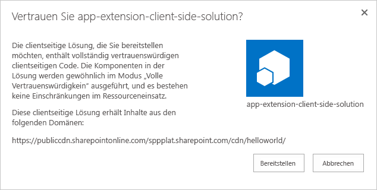

Laden Sie das neu erstellte Paket mit ihrer clientseitigen Lösung in den App-Katalog in Ihrem Mandanten hoch. Alternativ können Sie es auch per Drag-and-Drop verschieben. Klicken Sie auf die Schaltfläche **Bereitstellen**.Upload or drag & drop the newly created client-side solution package to the app catalog in your tenant.

Laden Sie das neu erstellte Paket mit ihrer clientseitigen Lösung in den App-Katalog in Ihrem Mandanten hoch. Alternativ können Sie es auch per Drag-and-Drop verschieben. Klicken Sie auf die Schaltfläche **Bereitstellen**.

Laden Sie die Dateien im Ordner **temp/deploy** in den Ordner **CDN/helloworld** hoch, den Sie zuvor erstellt haben. Sie können die Dateien auch mit Drag-and-Drop verschieben.Upload or drag & drop the files in the **temp/deploy** folder to the **CDN/helloworld** folder created earlier.

Installieren Sie die neue Version der Lösung auf Ihrer Website, und stellen Sie sicher, dass sie ordnungsgemäß funktioniert, ohne dass *locahost* die JavaScript-Datei hostet.Install the new version of the solution to your site and ensure that it's working properly without your *locahost* hosting the JavaScript file.

Herzlichen Glückwunsch! Sie haben ein öffentliches CDN in Ihrem Office 365-Mandanten aktiviert und es in der Lösung genutzt.Congratulations, you have enabled a public CDN in your Office 365 tenant and taken advantage of it from your solution!
