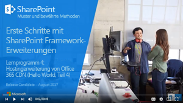

# <a name="hosting-extension-from-office-365-cdn-hello-world-part-4"></a>Hostingerweiterung von Office 365 CDN (Hello World, Teil 4)

>**Hinweis:** Die SharePoint Framework-Erweiterungen befinden sich derzeit in der Preview-Phase. Änderungen sind vorbehalten. Die Verwendung von SharePoint Framework-Erweiterungen in Produktionsumgebungen wird aktuell nicht unterstützt.

In diesem Artikel erfahren Sie, wie Sie den SharePoint-Framework-Anwendungsanpasser so bereitstellen, dass er von einem Office 365 CDN gehostet wird, und wie Sie dies in SharePoint für Endbenutzer bereitstellen. In diesem Artikel wird weiterhin die „Hello World“-Erweiterung verwendet, die Sie im hervorgehenden Artikel [# Bereitstellen der Erweiterung in SharePoint (Hello World, Teil 3)](./using-page-placeholder-with-extensions.md) erstellt haben und wo der Anpasser noch in Localhost gehoset wurde.

Achten Sie darauf, dass Sie die Verfahren in den folgenden Artikeln abgeschlossen haben, bevor Sie beginnen:

* [Erstellen Ihrer ersten SharePoint-Framework-Erweiterung (Hello World, Teil 1)](./build-a-hello-world-extension.md)
* [Verbinden des clientseitigen Webparts mit SharePoint (Hello World, Teil 2)](./using-page-placeholder-with-extensions.md)
* [Bereitstellen Ihrer Erweiterung in SharePoint (Hello World, Teil 3)](./serving-your-extension-from-sharepoint.md)

Sie können die nachfolgend beschriebene Anleitung auch anhand dieses Videos in unserem [YouTube-Kanal „SharePoint Patterns & Practices“](https://www.youtube.com/watch?v=oOIHWamPr34&list=PLR9nK3mnD-OXtWO5AIIr7nCR3sWutACpV) nachvollziehen: 

<a href="https://www.youtube.com/watch?v=oOIHWamPr34&list=PLR9nK3mnD-OXtWO5AIIr7nCR3sWutACpV">

</a>

## <a name="using-the-cdn-in-your-office-365-tenant"></a>Verwenden von CDN in Ihrem Office 365-Mandanten
Office 365 CDN ist die einfachste Möglichkeit, SharePoint-Framework-Lösungen direkt von Ihrem Mandanten aus zu hosten und dabei weiterhin die Vorteile des CDN (Content Delivery Network) zum schnelleren Laden der Objekte zu nutzen.

## <a name="enabling-the-cdn-in-your-office-365-tenant"></a>Aktivieren des CDN im Office 365-Mandanten
Stellen Sie sicher, dass Sie die neueste Version der SharePoint Online-Verwaltungsshell verwenden. Herunterladen können Sie sie im [Microsoft Download Center](https://www.microsoft.com/en-us/download/details.aspx?id=35588).

Verbinden Sie sich über PowerShell mit Ihrem SharePoint Online-Mandanten:
```
Connect-SPOService -Url https://contoso-admin.sharepoint.com
```

Führen Sie nacheinander die folgenden Befehle aus, um den aktuellen Status der auf Mandantenebene festgelegten Einstellungen für öffentliche CDNs abzurufen: 
```
Get-SPOTenantCdnEnabled -CdnType Public
Get-SPOTenantCdnOrigins -CdnType Public
Get-SPOTenantCdnPolicies -CdnType Public
```
Aktivieren Sie öffentliche CDNs im Mandanten
```
Set-SPOTenantCdnEnabled -CdnType Public
```
Jetzt sind öffentliche CDNs im Mandanten aktiviert, mit der Standardkonfiguration für zulässige Dateitypen. Dies bedeutet, dass die folgenden Dateitypen unterstützt werden: CSS, EOT, GIF, ICO, JPEG, JPG, JS, MAP, PNG, SVG, TTF und WOFF.

Öffnen Sie einen Browser, und navigieren Sie zu der Websitesammlung, in der Sie Ihre CDN-Bibliothek hosten möchten. Das kann jede beliebige Websitesammlung in Ihrem Mandanten sein. In diesem Tutorial erstellen Sie eine spezifische Bibliothek, die als Ihre CDN-Bibliothek fungiert. Sie können aber auch einen spezifischen Ordner in einer beliebigen bereits vorhandenen Dokumentbibliothek als CDN-Endpunkt nutzen.

Erstellen Sie in Ihrer Websitesammlung eine neue Dokumentbibliothek namens **CDN**, und fügen Sie ihr einen Ordner namens **helloworld** hinzu.

 

Wechseln Sie zurück zur PowerShell-Konsole, und fügen Sie einen neuen CDN-Ursprung hinzu. In diesem Fall legen Sie als Ursprung `*/cdn` fest; auf diese Weise fungieren alle relativen Ordner mit dem Namen **cdn** als ein CDN-Ursprung.
```
Add-SPOTenantCdnOrigin -CdnType Public -OriginUrl */cdn
```
Führen Sie den folgenden Befehl aus, um eine Liste aller CDN-Ursprünge von Ihrem Mandanten abzurufen:
```
Get-SPOTenantCdnOrigins -CdnType Public
```
Sie sehen, dass der neu hinzugefügte Ursprung als gültiger CDN-Ursprung aufgeführt ist. Die endgültige Konfiguration des Ursprungs dauert einige Zeit (ca. 15 Minuten). Während Sie warten, können mit der Erstellung der Testerweiterung fortfahren, die nach Abschluss der Bereitstellung im Ursprung gehostet wird. 


> Sobald ein Ursprung nicht mehr mit *(Konfiguration steht aus)* gekennzeichnet ist, kann er in Ihrem Mandanten verwendet werden. Dieser Text weist auf laufende Konfigurationsaktivitäten zwischen SharePoint Online und dem CDN-System hin. 

## <a name="updating-your-solution-project-for-the-cdn-urls"></a>Aktualisieren des Lösungsprojekts für die CDN-URLs
Kehren Sie zu der zuvor erstellten Lösung zurück, um die erforderliche URL-Updates auszuführen.
```
code .
```

Aktualisieren Sie die Datei *write-manifests.json* (im Ordner *config*) wie unten dargestellt, damit sie auf Ihren CDN-Endpunkt verweist. 

* Dabei müssen Sie „publiccdn.sharepointonline.com“ als Präfix verwenden und die URL anschließend um den tatsächlichen Pfad Ihres Mandanten erweitern.
* Die CDN-URL hat folgendes Format:

```
https://publiccdn.sharepointonline.com/<tenant host name>/sites/site/library/folder
```


Speichern Sie Ihre Änderungen.

Führen Sie die folgenden Aufgaben aus, um Ihre Lösung in einem Bundle zu verpacken.

* Es wird ein Releasebuild Ihres Projekts ausgeführt, unter Verwendung der in der Datei **write-manifests.json** angegebenen CDN-URL. Die Ausgabe dieses Befehls finden Sie im Ordner **./temp/deploy**. Dies sind die Dateien, die Sie in den SharePoint-Ordner hochladen müssen, der als CDN-Endpunkt fungiert. 

```
gulp bundle --ship
```

Führen Sie die folgende Aufgaben aus, um Ihre Lösung zu packen.

```
gulp package-solution --ship
```

Dieser Befehl erstellt ein Paket namens **app-extension.sppkg** im Ordner **sharepoint/solution** und bereitet außerdem die Ressourcen im Ordner **temp/deploy** für die Bereitstellung im CDN vor.

Laden Sie das neu erstellte Paket mit ihrer clientseitigen Lösung in den App-Katalog in Ihrem Mandanten hoch. Alternativ können Sie es auch per Drag-and-Drop verschieben. Klicken Sie auf die Schaltfläche **Bereitstellen**.


Laden Sie die Dateien im Ordner **temp/deploy** in den Ordner **CDN/helloworld** hoch, den Sie zuvor erstellt haben. Sie können die Dateien auch mit Drag-and-Drop verschieben.

Installieren Sie die neue Version der Lösung auf Ihrer Website, und stellen Sie sicher, dass sie ordnungsgemäß funktioniert, ohne dass *locahost* die JavaScript-Datei hostet.


Herzlichen Glückwunsch! Sie haben ein öffentliches CDN in Ihrem Office 365-Mandanten aktiviert und es in der Lösung genutzt.
