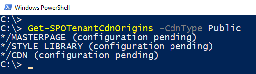

# <a name="hosting-extension-from-office-365-cdn-hello-world-part-4"></a><span data-ttu-id="ad643-101">Hostingerweiterung von Office 365 CDN (Hello World, Teil 4)</span><span class="sxs-lookup"><span data-stu-id="ad643-101">Hosting extension from Office 365 CDN (Hello world part 4)</span></span>

><span data-ttu-id="ad643-p101">**Hinweis:** Die SharePoint Framework-Erweiterungen befinden sich derzeit in der Preview-Phase. Änderungen sind vorbehalten. Die Verwendung von SharePoint Framework-Erweiterungen in Produktionsumgebungen wird aktuell nicht unterstützt.</span><span class="sxs-lookup"><span data-stu-id="ad643-p101">**Note:** The SharePoint Framework Extensions are currently in preview and are subject to change. SharePoint Framework Extensions are not currently supported for use in production environments.</span></span>

<span data-ttu-id="ad643-p102">In diesem Artikel erfahren Sie, wie Sie den SharePoint-Framework-Anwendungsanpasser so bereitstellen, dass er von einem Office 365 CDN gehostet wird, und wie Sie dies in SharePoint für Endbenutzer bereitstellen. In diesem Artikel wird weiterhin die „Hello World“-Erweiterung verwendet, die Sie im hervorgehenden Artikel [# Bereitstellen der Erweiterung in SharePoint (Hello World, Teil 3)](./using-page-placeholder-with-extensions.md) erstellt haben und wo der Anpasser noch in Localhost gehoset wurde.</span><span class="sxs-lookup"><span data-stu-id="ad643-p102">In this article, you will learn how to deploy your SharePoint Framework Application Customizer to be hosted from an Office 365 CDN and how to deploy that to SharePoint for the end users. This article continues with the hello world extension built in the previous article [# Deploy your extension to SharePoint (Hello world part 3)](./using-page-placeholder-with-extensions.md) where we were still hosting the customizer from localhost.</span></span>

<span data-ttu-id="ad643-106">Achten Sie darauf, dass Sie die Verfahren in den folgenden Artikeln abgeschlossen haben, bevor Sie beginnen:</span><span class="sxs-lookup"><span data-stu-id="ad643-106">Be sure you have completed the procedures in the following articles before you start:</span></span>

* [<span data-ttu-id="ad643-107">Erstellen Ihrer ersten SharePoint-Framework-Erweiterung (Hello World, Teil 1)</span><span class="sxs-lookup"><span data-stu-id="ad643-107">Build your first SharePoint Framework Extension (Hello world part 1)</span></span>](./build-a-hello-world-extension.md)
* [<span data-ttu-id="ad643-108">Verbinden des clientseitigen Webparts mit SharePoint (Hello World, Teil 2)</span><span class="sxs-lookup"><span data-stu-id="ad643-108">Connect your client-side web part to SharePoint (Hello world part 2)</span></span>](./using-page-placeholder-with-extensions.md)
* [<span data-ttu-id="ad643-109">Bereitstellen Ihrer Erweiterung in SharePoint (Hello World, Teil 3)</span><span class="sxs-lookup"><span data-stu-id="ad643-109">Deploy your extension to SharePoint (Hello world part 3)</span></span>](./serving-your-extension-from-sharepoint.md)

<span data-ttu-id="ad643-110">Sie können die nachfolgend beschriebene Anleitung auch anhand dieses Videos in unserem [YouTube-Kanal „SharePoint Patterns & Practices“](https://www.youtube.com/watch?v=oOIHWamPr34&list=PLR9nK3mnD-OXtWO5AIIr7nCR3sWutACpV) nachvollziehen:</span><span class="sxs-lookup"><span data-stu-id="ad643-110">You can also follow these steps by watching the video on the [SharePoint PnP YouTube Channel](https://www.youtube.com/watch?v=oOIHWamPr34&list=PLR9nK3mnD-OXtWO5AIIr7nCR3sWutACpV).</span></span> 

<a href="https://www.youtube.com/watch?v=oOIHWamPr34&list=PLR9nK3mnD-OXtWO5AIIr7nCR3sWutACpV">

</a>

## <a name="using-the-cdn-in-your-office-365-tenant"></a><span data-ttu-id="ad643-111">Verwenden von CDN in Ihrem Office 365-Mandanten</span><span class="sxs-lookup"><span data-stu-id="ad643-111">Using the CDN in your Office 365 tenant</span></span>
<span data-ttu-id="ad643-112">Office 365 CDN ist die einfachste Möglichkeit, SharePoint-Framework-Lösungen direkt von Ihrem Mandanten aus zu hosten und dabei weiterhin die Vorteile des CDN (Content Delivery Network) zum schnelleren Laden der Objekte zu nutzen.</span><span class="sxs-lookup"><span data-stu-id="ad643-112">Office 365 CDN is the easiest way to host SharePoint Framework solutions directly from your tenant while still taking advantage of the Content Delivery Network (CDN) service for faster load times of your assets.</span></span>

## <a name="enabling-the-cdn-in-your-office-365-tenant"></a><span data-ttu-id="ad643-113">Aktivieren des CDN im Office 365-Mandanten</span><span class="sxs-lookup"><span data-stu-id="ad643-113">Enabling the CDN in your Office 365 tenant</span></span>
<span data-ttu-id="ad643-114">Stellen Sie sicher, dass Sie die neueste Version der SharePoint Online-Verwaltungsshell verwenden. Herunterladen können Sie sie im [Microsoft Download Center](https://www.microsoft.com/en-us/download/details.aspx?id=35588).</span><span class="sxs-lookup"><span data-stu-id="ad643-114">Ensure that you have latest version of the SharePoint Online Management Shell by downloading it from the [Microsoft Download site](https://www.microsoft.com/en-us/download/details.aspx?id=35588).</span></span>

<span data-ttu-id="ad643-115">Verbinden Sie sich über PowerShell mit Ihrem SharePoint Online-Mandanten:</span><span class="sxs-lookup"><span data-stu-id="ad643-115">Connect to your SharePoint Online tenant through PowerShell:</span></span>
```
Connect-SPOService -Url https://contoso-admin.sharepoint.com
```

<span data-ttu-id="ad643-116">Führen Sie nacheinander die folgenden Befehle aus, um den aktuellen Status der auf Mandantenebene festgelegten Einstellungen für öffentliche CDNs abzurufen:</span><span class="sxs-lookup"><span data-stu-id="ad643-116">Get the current status of public CDN settings from the tenant level by executing the following commands one-by-one.</span></span> 
```
Get-SPOTenantCdnEnabled -CdnType Public
Get-SPOTenantCdnOrigins -CdnType Public
Get-SPOTenantCdnPolicies -CdnType Public
```
<span data-ttu-id="ad643-117">Aktivieren Sie öffentliche CDNs im Mandanten</span><span class="sxs-lookup"><span data-stu-id="ad643-117">Enable public CDN in the tenant</span></span>
```
Set-SPOTenantCdnEnabled -CdnType Public
```
<span data-ttu-id="ad643-p103">Jetzt sind öffentliche CDNs im Mandanten aktiviert, mit der Standardkonfiguration für zulässige Dateitypen. Dies bedeutet, dass die folgenden Dateitypen unterstützt werden: CSS, EOT, GIF, ICO, JPEG, JPG, JS, MAP, PNG, SVG, TTF und WOFF.</span><span class="sxs-lookup"><span data-stu-id="ad643-p103">Now public CDN has been enabled in the tenant using the default file type configuration allowed. This means that the following file type extensions are supported: "CSS,EOT,GIF,ICO,JPEG,JPG,JS,MAP,PNG,SVG,TTF,WOFF".</span></span>

<span data-ttu-id="ad643-p104">Öffnen Sie einen Browser, und navigieren Sie zu der Websitesammlung, in der Sie Ihre CDN-Bibliothek hosten möchten. Das kann jede beliebige Websitesammlung in Ihrem Mandanten sein. In diesem Tutorial erstellen Sie eine spezifische Bibliothek, die als Ihre CDN-Bibliothek fungiert. Sie können aber auch einen spezifischen Ordner in einer beliebigen bereits vorhandenen Dokumentbibliothek als CDN-Endpunkt nutzen.</span><span class="sxs-lookup"><span data-stu-id="ad643-p104">Open up a browser and move to a site collection where you'd like to host your CDN library. This could be any site collection in your tenant. In this tutorial, we will create a specific library to act as your CDN library, but you can also use a specific folder in any existing document library as the CDN endpoint.</span></span>

<span data-ttu-id="ad643-123">Erstellen Sie in Ihrer Websitesammlung eine neue Dokumentbibliothek namens **CDN**, und fügen Sie ihr einen Ordner namens **helloworld** hinzu.</span><span class="sxs-lookup"><span data-stu-id="ad643-123">Create a new document library on your site collection called **CDN** and add a folder named **helloworld** to it.</span></span>

 

<span data-ttu-id="ad643-p105">Wechseln Sie zurück zur PowerShell-Konsole, und fügen Sie einen neuen CDN-Ursprung hinzu. In diesem Fall legen Sie als Ursprung `*/cdn` fest; auf diese Weise fungieren alle relativen Ordner mit dem Namen **cdn** als ein CDN-Ursprung.</span><span class="sxs-lookup"><span data-stu-id="ad643-p105">Move back to the PowerShell console and add a new CDN origin. In this case, we are setting the origin as `*/cdn`, which means that any relative folder with the name of **cdn** will act as a CDN origin.</span></span>
```
Add-SPOTenantCdnOrigin -CdnType Public -OriginUrl */cdn
```
<span data-ttu-id="ad643-127">Führen Sie den folgenden Befehl aus, um eine Liste aller CDN-Ursprünge von Ihrem Mandanten abzurufen:</span><span class="sxs-lookup"><span data-stu-id="ad643-127">Execute the following command to get the list of CDN origins from your tenant</span></span>
```
Get-SPOTenantCdnOrigins -CdnType Public
```
<span data-ttu-id="ad643-p106">Sie sehen, dass der neu hinzugefügte Ursprung als gültiger CDN-Ursprung aufgeführt ist. Die endgültige Konfiguration des Ursprungs dauert einige Zeit (ca. 15 Minuten). Während Sie warten, können mit der Erstellung der Testerweiterung fortfahren, die nach Abschluss der Bereitstellung im Ursprung gehostet wird.</span><span class="sxs-lookup"><span data-stu-id="ad643-p106">Notice that your newly added origin is listed as a valid CDN origin. Final configuration of the origin will take a while (approximately 15 minutes), so we can continue creating your test extension, which will be hosted from the origin once deployment is completed.</span></span> 



> <span data-ttu-id="ad643-p107">Sobald ein Ursprung nicht mehr mit *(Konfiguration steht aus)* gekennzeichnet ist, kann er in Ihrem Mandanten verwendet werden. Dieser Text weist auf laufende Konfigurationsaktivitäten zwischen SharePoint Online und dem CDN-System hin.</span><span class="sxs-lookup"><span data-stu-id="ad643-p107">When origin is listed without the *(configuration pending)* text, it is ready to be used in your tenant. This is the indication of an on-going configuration between SharePoint Online and the CDN system.</span></span> 

## <a name="updating-your-solution-project-for-the-cdn-urls"></a><span data-ttu-id="ad643-133">Aktualisieren des Lösungsprojekts für die CDN-URLs</span><span class="sxs-lookup"><span data-stu-id="ad643-133">Updating your solution project for the CDN URLs</span></span>
<span data-ttu-id="ad643-134">Kehren Sie zu der zuvor erstellten Lösung zurück, um die erforderliche URL-Updates auszuführen.</span><span class="sxs-lookup"><span data-stu-id="ad643-134">Return to the previously created solution to perform the needed URL updates.</span></span>
```
code .
```

<span data-ttu-id="ad643-135">Aktualisieren Sie die Datei *write-manifests.json* (im Ordner *config*) wie unten dargestellt, damit sie auf Ihren CDN-Endpunkt verweist.</span><span class="sxs-lookup"><span data-stu-id="ad643-135">Update the *write-manifests.json* file (under the *config* folder) as follows to point to your CDN endpoint.</span></span> 

* <span data-ttu-id="ad643-136">Dabei müssen Sie „publiccdn.sharepointonline.com“ als Präfix verwenden und die URL anschließend um den tatsächlichen Pfad Ihres Mandanten erweitern.</span><span class="sxs-lookup"><span data-stu-id="ad643-136">You will need to use the publiccdn.sharepointonline.com as the prefix and then extend the URL with the actual path of your tenant</span></span>
* <span data-ttu-id="ad643-137">Die CDN-URL hat folgendes Format:</span><span class="sxs-lookup"><span data-stu-id="ad643-137">Format of the CDN URL is as follows</span></span>

```
https://publiccdn.sharepointonline.com/<tenant host name>/sites/site/library/folder
```


<span data-ttu-id="ad643-139">Speichern Sie Ihre Änderungen.</span><span class="sxs-lookup"><span data-stu-id="ad643-139">Save your changes.</span></span>

<span data-ttu-id="ad643-140">Führen Sie die folgenden Aufgaben aus, um Ihre Lösung in einem Bundle zu verpacken.</span><span class="sxs-lookup"><span data-stu-id="ad643-140">Execute the following tasks to bundle your solution</span></span>

* <span data-ttu-id="ad643-p108">Es wird ein Releasebuild Ihres Projekts ausgeführt, unter Verwendung der in der Datei **write-manifests.json** angegebenen CDN-URL. Die Ausgabe dieses Befehls finden Sie im Ordner **./temp/deploy**. Dies sind die Dateien, die Sie in den SharePoint-Ordner hochladen müssen, der als CDN-Endpunkt fungiert.</span><span class="sxs-lookup"><span data-stu-id="ad643-p108">This will execute a release build of your project using the CDN URL specified in the **write-manifests.json** file. The output of this command will be located in the **./temp/deploy** folder. These are the files which you will need to upload to the SharePoint folder acting as your CDN endpoint.</span></span> 

```
gulp bundle --ship
```

<span data-ttu-id="ad643-144">Führen Sie die folgende Aufgaben aus, um Ihre Lösung zu packen.</span><span class="sxs-lookup"><span data-stu-id="ad643-144">Execute the following task to package your solution</span></span>

```
gulp package-solution --ship
```

<span data-ttu-id="ad643-145">Dieser Befehl erstellt ein Paket namens **app-extension.sppkg** im Ordner **sharepoint/solution** und bereitet außerdem die Ressourcen im Ordner **temp/deploy** für die Bereitstellung im CDN vor.</span><span class="sxs-lookup"><span data-stu-id="ad643-145">This command will create an **app-extension.sppkg** package in the **sharepoint/solution** folder and also prepare the assets in the **temp/deploy** folder to be deployed to the CDN.</span></span>

<span data-ttu-id="ad643-p109">Laden Sie das neu erstellte Paket mit ihrer clientseitigen Lösung in den App-Katalog in Ihrem Mandanten hoch. Alternativ können Sie es auch per Drag-and-Drop verschieben. Klicken Sie auf die Schaltfläche **Bereitstellen**.</span><span class="sxs-lookup"><span data-stu-id="ad643-p109">Upload or drag & drop the newly created client-side solution package to the app catalog in your tenant. Click the **Deploy** button.</span></span>


<span data-ttu-id="ad643-149">Laden Sie die Dateien im Ordner **temp/deploy** in den Ordner **CDN/helloworld** hoch, den Sie zuvor erstellt haben. Sie können die Dateien auch mit Drag-and-Drop verschieben.</span><span class="sxs-lookup"><span data-stu-id="ad643-149">Upload or drag & drop the files in the **temp/deploy** folder to the **CDN/helloworld** folder created earlier.</span></span>

<span data-ttu-id="ad643-150">Installieren Sie die neue Version der Lösung auf Ihrer Website, und stellen Sie sicher, dass sie ordnungsgemäß funktioniert, ohne dass *locahost* die JavaScript-Datei hostet.</span><span class="sxs-lookup"><span data-stu-id="ad643-150">Install the new version of the solution to your site and ensure that it's working properly without your *locahost* hosting the JavaScript file.</span></span>


<span data-ttu-id="ad643-152">Herzlichen Glückwunsch! Sie haben ein öffentliches CDN in Ihrem Office 365-Mandanten aktiviert und es in der Lösung genutzt.</span><span class="sxs-lookup"><span data-stu-id="ad643-152">Congratulations, you have enabled a public CDN in your Office 365 tenant and taken advantage of it from your solution!</span></span>
