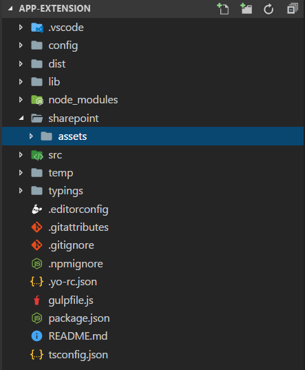
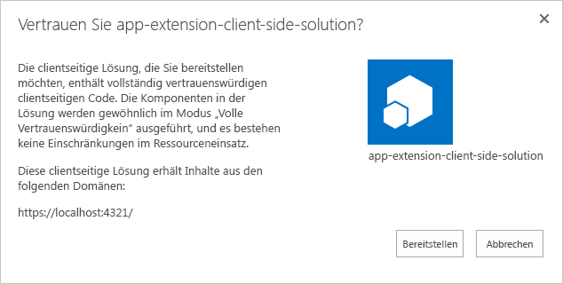
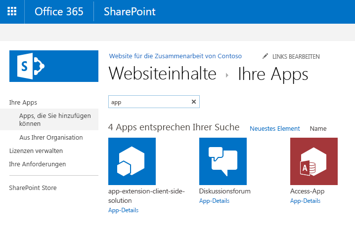
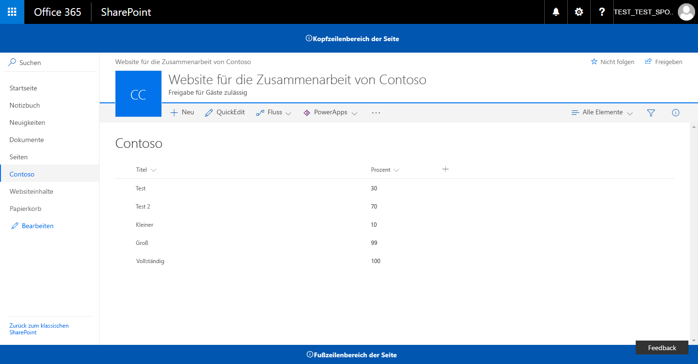

# <a name="deploy-your-extension-to-sharepoint-hello-world-part-3"></a>Bereitstellen Ihrer Erweiterung in SharePoint (Hello World, Teil 3)

>**Hinweis:** Die SharePoint Framework-Erweiterungen befinden sich derzeit in der Preview-Phase. Änderungen sind vorbehalten. Die Verwendung von SharePoint Framework-Erweiterungen in Produktionsumgebungen wird aktuell nicht unterstützt.

In diesem Artikel erfahren Sie, wie Sie Ihren SharePoint-Framework-Anwendungsanpasser in SharePoint bereitstellen und prüfen können, wie er auf den modernen SharePoint-Seiten funktioniert. In diesem Artikel wird weiterhin mit der Hello World-Erweiterung gearbeitet,die Sie im vorherigen Artikel [Verwenden von Seitenplatzhaltern des Anwendungsanpassers (Hello World, Teil 2)](./using-page-placeholder-with-extensions.md) erstellt haben.

Stellen Sie sicher, dass Sie die Verfahren in den folgenden Artikeln abgeschlossen haben, bevor Sie beginnen:

* [Erstellen Ihrer ersten SharePoint-Framework-Erweiterung (Hello World, Teil 1)](./build-a-hello-world-extension.md)
* [Verwenden von Seitenplatzhaltern aus dem Anwendungsanpasser (Hello World, Teil 2)](./using-page-placeholder-with-extensions.md)

## <a name="package-the-helloworld-application-customizer"></a>Packen des helloWorld-Anwendungsanpassers
Wechseln Sie im Konsolenfenster zum Projektverzeichnis der Erweiterung, die Sie in [Erstellen Ihrer ersten SharePoint-Framework-Erweiterung (Hello World, Teil 1)](./build-a-hello-world-extension.md) erstellt haben.

```
cd app-extension
```
Wenn gulp serve noch ausgeführt wird, beenden Sie die Ausführung, indem Sie `Ctrl+C` drücken.

Im Gegensatz zum **Debug**-Modus müssen Sie zur Verwendung einer Erweiterung auf modernen serverseitigen SharePoint-Seiten die Erweiterung bereitstellen und in SharePoint registrieren, entweder im Bereich `Site collection`, `Site` oder `List`. Der Bereich definiert, wo und wie der Anwendungsanpasser aktiv sein soll. In diesem Szenario registrieren wir den Anwendungsanpasser mit dem `Site Collection`-Bereich. 

Bevor wir die Lösung packen, müssen wir den Code, der zur Automatisierung der Erweiterungsaktivierung auf der Website bei jeder Installation der Lösung auf der Website erforderlich ist, einbeziehen. In diesem Fall verwenden wir Feature-Frameworkelemente direkt im Lösungspaket, um diese Aktionen auszuführen. Sie könnten jedoch auch den Anwendungsanpasser mit einer SharePoint-Website anhand von REST oder CSOM als Teil der Websitebereitstellung zuordnen.

1. Installieren Sie das Lösungspaket auf der Website, auf der es installiert werden soll, damit das Erweiterungsmanifest für die Ausführung freigegeben wird.
2. Ordnen Sie den Anwendungsanpasser dem geplanten Bereich zu. Dies kann programmgesteuert erfolgen (CSOM/REST) oder durch die Verwendung des Feature-Frameworks innerhalb des SharePoint-Framework-Lösungspakets. Sie müssen die folgenden Eigenschaften im `UserCustomAction`-Objekt auf Website- oder Listenebene verknüpfen.
    * **ClientSiteComponentId:** Dies ist der Bezeichner (GUID) für den Field Customizer, der im App-Katalog installiert wurde. 
    * **ClientSideComponentProperties:** Dies ist ein optionaler Parameter, der zum Bereitstellen von Eigenschaften für die Field Customizer-Instanz verwendet werden kann.

> Beachten Sie, dass Sie Lösungspakete derzeit explizit auf den Websites installieren müssen, um sicherzustellen, dass die Erweiterung ordnungsgemäß ausgeführt wird. Künftig wird es alternative Verfahren geben, um dies ohne Bereitstellung Website für Website zu erreichen. 

In den folgenden Schritten erstellen wir eine neue `CustomAction`-Definition, die dann automatisch mit den erforderlichen Konfigurationen bereitgestellt wird, sobald das Lösungspaket auf einer Website installiert wird. 

Wechseln Sie wieder zu Ihrem Lösungspaket in Visual Studio Code (oder Ihrem bevorzugten Editor).

Hier müssen Sie zunächst einen Ordner **assets** erstellen, in dem Sie alle Featureframeworkobjekte ablegen, die bei der Paketinstallation zur Bereitstellung von SharePoint-Strukturen verwendet werden.

* Erstellen Sie einen Ordner mit dem Namen **sharepoint** im Stammverzeichnis der Lösung.
* Erstellen Sie einen Ordner mit dem Namen **assets** als Unterordner im soeben erstellten Ordner **sharepoint**.

Die Lösungsstruktur sollte in etwa wie folgt aussehen:



### <a name="add-an-elementsxml-file-for-sharepoint-definitions"></a>Hinzufügen einer Datei „elements.xml“ mit SharePoint-Definitionen

Erstellen Sie im Ordner **sharepoint\assets** eine neue Datei mit dem Namen **elements.xml**.

Kopieren Sie die nachfolgende XML-Struktur in die Datei **elements.xml**. Vergessen Sie dabei nicht, für die Eigenschaft **ClientSideComponentId** die eindeutige ID Ihres Anwendungsanpassers aus der Datei **HelloWorldApplicationCustomizer.manifest.json** im Ordner **src\extensions\helloWorld** anzugeben.

Wir legen darüber hinaus die **ClientSideComponentProperties** fest und übergeben JSON-Eigenschaften für diese Erweiterungsinstanz. Beachten Sie, dass JSON hier auskommentiert ist, damit wir es ordnungsgemäß in einem XML-Attribut festlegen können. 

Beachten Sie auch, dass wir den spezifischen Speicherort von `ClientSideExtension.ApplicationCustomizer` verwenden, um zu definieren, dass es sich um einen Anwendungsanpasser handelt. Da dieses **elements.xml** standardmäßig mit einem *Web*-Bereichsfeature verknüpft ist, wird diese `CustomAction` automatisch zur `Web.UserCustomAction`-Websitesammlung auf der Website hinzugefügt, auf der die Lösung installiert wird.

```xml
<?xml version="1.0" encoding="utf-8"?>
<Elements xmlns="http://schemas.microsoft.com/sharepoint/">

    <CustomAction 
        Title="SPFxApplicationCustomizer"
        Location="ClientSideExtension.ApplicationCustomizer"
        ClientSideComponentId="46606aa6-5dd8-4792-b017-1555ec0a43a4"
        ClientSideComponentProperties="{&quot;Header&quot;:&quot;Header area of the page&quot;,&quot;Footer&quot;:&quot;Footer area in the page&quot;}">

    </CustomAction>

</Elements>
```

### <a name="ensure-that-definitions-are-taken-into-account-within-the-build-pipeline"></a>Gewährleisten der Berücksichtigung von Definitionen in der Buildpipeline

Öffnen Sie die Datei **package-solution.json** im Ordner **config**. Die Datei **package-solution.json** enthält die Paketmetadaten, definiert wie folgt:

```json
{
  "solution": {
    "name": "app-extension-client-side-solution",
    "id": "02d35a3e-5896-4664-874f-9fe9fdfe8408",
    "version": "1.0.0.0"
  },
  "paths": {
    "zippedPackage": "solution/app-extension.sppkg"
  }
}

```

Um sicherzustellen, dass die neu hinzugefügte Datei **element.xml** beim Verpacken der Lösung berücksichtigt wird, müssen wir eine Featureframework-Featuredefinition für das Lösungspaket einschließen. Dazu integrieren wir wie nachfolgend demonstriert eine JSON-Definition des benötigten Features in die Lösungsstruktur.

```json
{
  "solution": {
    "name": "app-extension-client-side-solution",
    "id": "02d35a3e-5896-4664-874f-9fe9fdfe8408",
    "version": "1.0.0.0",
    "features": [{
      "title": "Application Extension - Deployment of custom action.",
      "description": "Deploys a custom action with ClientSideComponentId association",
      "id": "456da147-ced2-3036-b564-8dad5c1c2e34",
      "version": "1.0.0.0",
      "assets": {        
        "elementManifests": [
          "elements.xml"
        ]
      }
    }]
  },
  "paths": {
    "zippedPackage": "solution/app-extension.sppkg"
  }
}

```

## <a name="deploy-the-extension-to-sharepoint-online-and-host-javascript-from-local-host"></a>Bereitstellen der Erweiterung in SharePoint Online und Hosten des JavaScript-Codes über Localhost

Nun können Sie die Lösung auf einer SharePoint-Website bereitstellen und das Objekt `CustomAction` automatisch auf Website-Ebene verknüpfen.

Geben Sie im Konsolenfenster den folgenden Befehl ein, um die clientseitige Lösung, die die Erweiterung enthält, zu verpacken und so die Grundstruktur für die Paketierung zu erstellen:

```
gulp bundle
```

Führen Sie als Nächstes den folgenden Befehl aus, um das Lösungspaket zu erstellen:

```
gulp package-solution
```

Der Befehl erstellt das Paket im Ordner **sharepoint/solution**:

```
app-extension.sppkg
```

Als Nächstes müssen Sie das Paket, das generiert wurde, im App-Katalog bereitstellen.

Wechseln Sie zum **App-Katalog** Ihres Mandanten, und öffnen Sie die Bibliothek **Apps für SharePoint**.

Laden Sie das Paket `app-extension.sppkg` aus dem Ordner **sharepoint/solution** in den App-Katalog hoch, oder platzieren Sie es dort per Drag & Drop. SharePoint fordert Sie in einem Dialogfeld auf, der clientseitigen Lösung zu vertrauen.

Da wir die Host-URLs der Lösung für diese Bereitstellung nicht aktualisiert haben, verweist die URL immer noch auf `https://localhost:4321`. Klicken Sie auf die Schaltfläche **Bereitstellen**.



Wechseln Sie wieder zur Konsole, und vergewissern Sie sich, dass die Lösung ausgeführt wird. Sollte Sie nicht ausgeführt werden, führen Sie den folgenden Befehl im Lösungsordner aus:

```
gulp serve --nobrowser
```

Wechseln Sie zu der Website, auf der Sie die Bereitstellung der SharePoint-Ressource testen möchten. Dies könnte eine Websitesammlung im Mandanten sein, auf dem Sie dieses Lösungspaket bereitgestellt haben.

Klicken Sie auf der oberen Navigationsleiste rechts auf das Zahnradsymbol und anschließend auf **App hinzufügen**, um Ihre Apps-Seite aufzurufen.

Geben Sie in das **Suchfeld** die Zeichenfolge **app** ein, und drücken Sie die *EINGABETASTE*, um Ihre Apps zu filtern.



Wählen Sie die App **app-extension-client-side-solutionn** aus, um die Lösung auf der Website zu installieren. Aktualisieren Sie die Seite nach Abschluss der Installation mithilfe der Taste **F5**.

Wenn die Anwendung erfolgreich installiert wurde, werden die Kopf- und Fußzeile genau so gerendert wie mit den Debugging-Abfrageparametern.



## <a name="next-steps"></a>Nächste Schritte

Herzlichen Glückwunsch! Sie haben eine Erweiterung für eine moderne SharePoint-Seite aus dem App-Katalog bereitgestellt! Sie können mit der Entwicklung der Hello World-Erweiterung im nächsten Thema , [Hostingerweiterung aus Office 365 CDN (Hello World, Teil 4)](./hosting-extension-from-office365-cdn.md) fortfahren, in dem Sie erfahren, wie Sie die Erweiterungsobjekte aus einem CDN anstelle von Localhost bereitstellen und laden.
