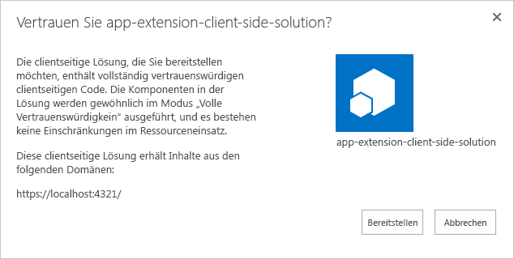
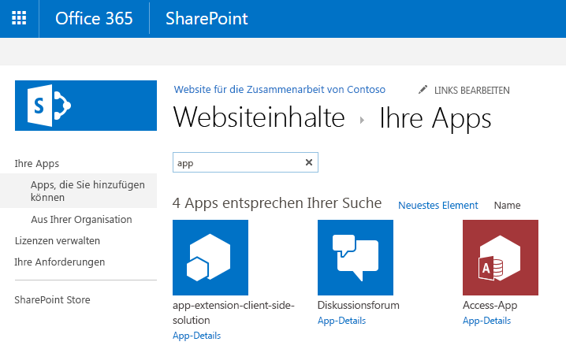

# <a name="deploy-your-extension-to-sharepoint-hello-world-part-3"></a>Bereitstellen Ihrer Erweiterung in SharePoint (Hello World, Teil 3)

In diesem Artikel wird die Bereitstellung des Application Customizers von SharePoint-Framework in SharePoint und seine Funktionsweise auf modernen SharePoint-Seiten erläutert. In diesem Artikel wird weiterhin die Hello World-Erweiterung aus dem vorherigen Artikel [Verwenden von Seitenplatzhaltern aus dem Application Customizer (Hello World, Teil 2)](./using-page-placeholder-with-extensions.md) verwendet.

Stellen Sie sicher, dass Sie die Verfahren in den folgenden Artikeln abgeschlossen haben, bevor Sie beginnen:

* [Erstellen Ihrer ersten SharePoint-Framework-Erweiterung (Hello World, Teil 1)](./build-a-hello-world-extension.md)
* [Verwenden von Seitenplatzhaltern aus dem Application Customizer (Hello World, Teil 2)](./using-page-placeholder-with-extensions.md)

Sie können die nachfolgend beschriebene Anleitung auch anhand dieses Videos in unserem [YouTube-Kanal „SharePoint Patterns & Practices“](https://www.youtube.com/watch?v=P_yWI0WVQIg&list=PLR9nK3mnD-OXtWO5AIIr7nCR3sWutACpV) nachvollziehen: 

<a href="https://www.youtube.com/watch?v=DzHdVxLA3Pc">

</a>

## <a name="package-the-hello-world-application-customizer"></a>Packen des Hello World Application Customizers
Wechseln Sie im Konsolenfenster zum Projektverzeichnis der Erweiterung, die Sie unter [Erstellen Ihrer ersten SharePoint-Framework-Erweiterung (Hello World, Teil 1)](./build-a-hello-world-extension.md) erstellt haben.

```
cd app-extension
```
Wenn gulp serve noch ausgeführt wird, beenden Sie die Ausführung, indem Sie STRG + C drücken.

Im Gegensatz zum **Debug**-Modus müssen Sie für die Verwendung einer Erweiterung auf modernen serverseitigen SharePoint-Seiten die Erweiterung bei SharePoint im Bereich `Site collection`, `Site` oder `List` bereitstellen und registrieren. Der Bereich definiert, wo und wie Application Customizer aktiv sein soll. In diesem Szenario wird der Application Customizer unter Verwendung des Bereichs `Site collection` registriert. 

Vor dem Packen der Lösung wird der Code hinzugefügt, mit dem die Erweiterungsaktivierung auf der Website automatisiert wird, sobald die Lösung auf der Website installiert ist. In diesem Fall verwenden wir Feature-Framework-Elemente für die direkte Ausführung dieser Aktionen in dem Lösungspaket, Sie können jedoch auch den Application Customizer einer SharePoint-Website zuordnen, indem Sie REST oder CSOM im Rahmen der Websitebereitstellung verwenden.

1. Installieren Sie das Lösungspaket auf der Website, auf der es installiert sein soll, damit das Erweiterungsmanifest für die Ausführung freigegeben wird.

2. Ordnen Sie den Application Customizer dem geplanten Bereich zu. Sie können dies programmgesteuert (CSOM/REST) oder mit dem Feature-Framework innerhalb des SharePoint-Framework-Lösungspakets tun. Sie müssen die folgenden Eigenschaften im `UserCustomAction`-Objekt auf der Websitesammlungs-, Website- oder Listenebene zuweisen.
    * **ClientSiteComponentId:** Dies ist der Bezeichner (GUID) für den Field Customizer, der im App-Katalog installiert wurde. 
    * **ClientSideComponentProperties:** Dies ist ein optionaler Parameter, der zum Bereitstellen von Eigenschaften für die Field Customizer-Instanz verwendet werden kann.
   
   Beachten Sie, dass Sie die Anforderung zum Hinzufügen einer Lösung mit Ihrer Erweiterung zu der Website mithilfe der `skipFeatureDeployment`-Einstellung in **package-solution.json** steuern können. Auch wenn Sie die Installation der Lösung auf der Website nicht voraussetzen, müssen Sie **ClientSideComponentId** bestimmten Objekten zuweisen, damit die Erweiterung angezeigt wird. 
   
In den folgenden Schritten wird die `CustomAction`-Definition geprüft, die automatisch für die Lösung als Teil der Gerüsterstellung erstellt wurde, damit die Lösung auf einer Website aktiviert wird, sobald sie installiert wurde. 
   
1. Wechseln Sie wieder zu Ihrem Lösungspaket in Visual Studio Code (oder Ihrem bevorzugten Editor).

2. Erweitern Sie im Stammverzeichnis der Lösung den Ordner **sharepoint** und den Unterordner **assets**, um die vorhandene Datei **elements.xml** anzuzeigen. 

   

<br/>

### <a name="review-the-existing-elementsxml-file-for-sharepoint-definitions"></a>Überprüfen der vorhandenen Datei „elements.xml“ auf SharePoint-Definitionen

Überprüfen Sie die vorhandene XML-Struktur in der Datei **elements.xml**. Beachten Sie, dass die Eigenschaft **ClientSideComponentId** anhand der eindeutigen ID des Application Customizer aus der Datei **HelloWorldFieldCustomizer.manifest.json** im Ordner **src\extensions\helloWorld** automatisch aktualisiert wurde.

**ClientSideComponentProperties** wurde auch mithilfe der standardmäßigen Struktur und JSON-Eigenschaften für diese Instanz der Erweiterung automatisch festgelegt. Beachten Sie auch die Escapezeichen im JSON mit, damit es ordnungsgemäß in einem XML-Attribut festgelegt werden kann. 

Die Konfiguration verwendet die Position von `ClientSideExtension.ApplicationCustomizer`, um zu definieren, dass es sich dabei um einen Application Customizer handelt. Da diese Datei standardmäßig **elements.xml** einem Feature mit dem Bereich *Web* zugeordnet wird, wird diese `CustomAction` automatisch der `Web.UserCustomAction`-Sammlung auf der Website hinzugefügt, auf der die Lösung installiert wurde.

Um sicherzustellen, dass die Konfiguration mit den Aktualisierungen im Application Customizer übereinstimmen, aktualisieren Sie **ClientSideComponentProperties** wie in der folgenden XML-Struktur dargestellt. Sie sollten nicht die gesamte Struktur kopieren, da es sonst zu einer Nichtübereinstimmung mit Ihrer **ClientSideComponentId** kommt.


```xml
<?xml version="1.0" encoding="utf-8"?>
<Elements xmlns="http://schemas.microsoft.com/sharepoint/">

    <CustomAction 
        Title="SPFxApplicationCustomizer"
        Location="ClientSideExtension.ApplicationCustomizer"
        ClientSideComponentId="46606aa6-5dd8-4792-b017-1555ec0a43a4"
        ClientSideComponentProperties="{&quot;Top&quot;:&quot;Top area of the page&quot;,&quot;Bottom&quot;:&quot;Bottom area in the page&quot;}">

    </CustomAction>

</Elements>
```

<br/>

### <a name="ensure-that-definitions-are-taken-into-account-within-the-build-pipeline"></a>Gewährleisten der Berücksichtigung von Definitionen in der Buildpipeline

Öffnen Sie die Datei **package-solution.json** im Ordner **config**. Die Datei **package-solution.json** enthält die Paketmetadaten, definiert wie folgt:

```json

{
  "$schema": "https://dev.office.com/json-schemas/spfx-build/package-solution.schema.json",
  "solution": {
    "name": "app-extension-client-side-solution",
    "id": "98a9fe4f-175c-48c1-adee-63fb927faa70",
    "version": "1.0.0.0",
    "features": [
      {
        "title": "Application Extension - Deployment of custom action.",
        "description": "Deploys a custom action with ClientSideComponentId association",
        "id": "4678966b-de68-445f-a74e-e553a7b937ab",
        "version": "1.0.0.0",
        "assets": {
          "elementManifests": [
            "elements.xml"
          ]
        }
      }
    ]
  },
  "paths": {
    "zippedPackage": "solution/app-extension.sppkg"
  }
}


```

<br/>

Um sicherzustellen, dass die Datei **element.xml** beim Packen der Lösung berücksichtigt wird, fügt das Standardgerüst die benötigte Konfiguration hinzu, um eine Framework-Featuredefinition für das Lösungspaket zu definieren.

## <a name="deploy-the-extension-to-sharepoint-online-and-host-javascript-from-local-host"></a>Bereitstellen der Erweiterung in SharePoint Online und Hosten des JavaScript-Codes über Localhost

Nun können Sie die Lösung auf einer SharePoint-Website bereitstellen und das Objekt `CustomAction` automatisch auf Website-Ebene verknüpfen.

1. Geben Sie im Konsolenfenster den folgenden Befehl ein, um die clientseitige Lösung, die die Erweiterung enthält, zu verpacken und so die Grundstruktur für die Paketerstellung zu erstellen:

   ```
   gulp bundle
   ```

2. Führen Sie den folgenden Befehl aus, um das Lösungspaket zu erstellen:

   ```
   gulp package-solution
   ```

   Der Befehl erstellt das Paket im Ordner **sharepoint/solution**:

   ```
   app-extension.sppkg
   ```

3. Als Nächstes müssen Sie das Paket, das generiert wurde, im App-Katalog bereitstellen. Wechseln Sie dazu zum **App-Katalog** Ihres Mandanten, und öffnen Sie die Bibliothek **Apps für SharePoint**.

4. Laden Sie das Paket `app-extension.sppkg`, das sich im Ordner **sharepoint/solution** befindet, in den App-Katalog hoch, oder platzieren Sie es dort per Drag & Drop. In SharePoint wird ein Dialogfeld angezeigt, und Sie werden aufgefordert, der clientseitigen Lösung zu vertrauen.

   Da wir die Host-URLs der Lösung für diese Bereitstellung nicht aktualisiert haben, verweist die URL immer noch auf `https://localhost:4321`. 
   
5. Klicken Sie auf die Schaltfläche **Bereitstellen**.

   

6. Wechseln Sie wieder zur Konsole, und vergewissern Sie sich, dass die Lösung ausgeführt wird. Sollte Sie nicht ausgeführt werden, führen Sie den folgenden Befehl im Lösungsordner aus:
   
   ```
   gulp serve --nobrowser
   ```
   
7. Wechseln Sie zu der Website, auf der Sie die Bereitstellung der SharePoint-Ressource testen möchten. Dies könnte eine Websitesammlung im Mandanten sein, auf dem Sie dieses Lösungspaket bereitgestellt haben.

8. Klicken Sie auf der oberen Navigationsleiste rechts auf das Zahnradsymbol und anschließend auf **App hinzufügen**, um Ihre Seite „Apps“ aufzurufen.

9. Geben Sie in das **Suchfeld** die Zeichenfolge **app** ein, und drücken Sie die EINGABETASTE, um Ihre Apps zu filtern.

   

10. Wählen Sie die App **app-extension-client-side-solution**, um die Lösung auf der Website zu installieren. Wenn die Installation abgeschlossen ist, aktualisieren Sie die Seite, indem Sie **F5** drücken.

Wenn die Anwendung erfolgreich installiert wurde, werden die Kopf- und Fußzeile genau so gerendert wie mit den Debugging-Abfrageparametern.


## <a name="next-steps"></a>Nächste Schritte

Glückwunsch! Sie haben eine Erweiterung für eine moderne SharePoint-Seite aus dem App-Katalog bereitgestellt. Sie können mit der Entwicklung der Hello World-Erweiterung im nächsten Thema [Hostingerweiterung aus Office 365 CDN (Hello World, Teil 4)](./hosting-extension-from-office365-cdn.md) fortfahren, in dem Sie erfahren, wie Sie die Erweiterungsobjekte aus einem CDN anstelle von Localhost bereitstellen und laden.

> [!NOTE]
> Wenn Sie einen Fehler in der Dokumentation oder im SharePoint-Framework finden, melden Sie ihn an das SharePoint Engineering unter Verwendung der [Fehlerliste im sp-dev-docs-Repository](https://github.com/SharePoint/sp-dev-docs/issues). Vielen Dank im Voraus für Ihr Feedback.