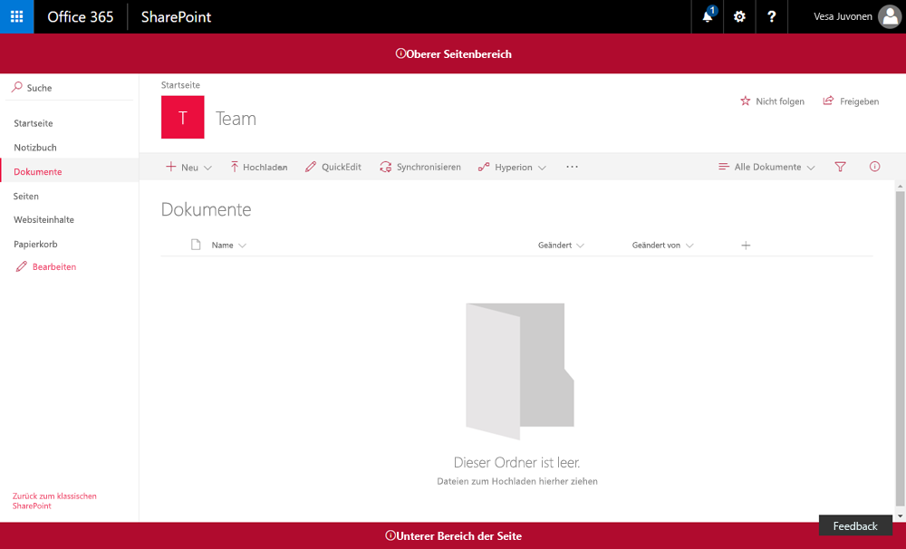

# <a name="use-page-placeholders-from-application-customizer-hello-world-part-2"></a><span data-ttu-id="ebcbb-103">Verwenden von Seitenplatzhaltern aus dem Anwendungsanpasser (Hello World, Teil 2)</span><span class="sxs-lookup"><span data-stu-id="ebcbb-103">Use page placeholders from Application Customizer (Hello World part 2)</span></span>

<span data-ttu-id="ebcbb-104">Anwendungsanpasser bieten Zugriff auf bekannte Speicherorte auf SharePoint-Seiten, die Sie basierend auf Ihren geschäftlichen und funktionalen Anforderungen anpassen können.</span><span class="sxs-lookup"><span data-stu-id="ebcbb-104">Application Customizers provide access to well-known locations on SharePoint pages that you can modify based on your business and functional requirements.</span></span> <span data-ttu-id="ebcbb-105">Sie können beispielsweise dynamische Kopfzeilen und Fußzeilen erstellen, die auf allen Seiten in SharePoint Online gerendert werden.</span><span class="sxs-lookup"><span data-stu-id="ebcbb-105">For example, you can create dynamic header and footer experiences that render across all the pages in SharePoint Online.</span></span> 

<span data-ttu-id="ebcbb-106">Dieses Modell ist vergleichbar mit der Verwendung einer **UserCustomAction**-Auflistung in einem **Website** oder **Web**-Objekt zum Ändern der Seitenoberfläche über benutzerdefiniertes JavaScript.</span><span class="sxs-lookup"><span data-stu-id="ebcbb-106">This model is similar to using a **UserCustomAction** collection in a **Site** or **Web** object to modify the page experience via custom JavaScript.</span></span> <span data-ttu-id="ebcbb-107">Der Hauptunterschied bzw. Vorteil bei SharePoint Framework (SPFx) Extensions besteht darin, dass Ihre Seitenelemente nicht geändert werden, wenn Änderungen an der HTML-/DOM-Struktur in SharePoint Online vorgenommen werden.</span><span class="sxs-lookup"><span data-stu-id="ebcbb-107">The key difference or advantage with SharePoint Framework (SPFx) Extensions is that your page elements won't change if changes are made to the HTML/DOM structure in SharePoint Online.</span></span>

<span data-ttu-id="ebcbb-108">In diesem Artikel wird beschrieben, wie Sie Ihre [Hello World-Erweiterung](./build-a-hello-world-extension.md) erweitern, um die Seitenplatzhalter zu nutzen.</span><span class="sxs-lookup"><span data-stu-id="ebcbb-108">This article describes how to extend your [Hello World extension](./build-a-hello-world-extension.md) to take advantage of page placeholders.</span></span> 

<span data-ttu-id="ebcbb-109">Sie können die nachfolgend beschriebene Anleitung auch anhand dieses Videos in unserem [YouTube-Kanal „SharePoint Patterns & Practices“](https://www.youtube.com/watch?v=ipRw6o6bOTw&list=PLR9nK3mnD-OXtWO5AIIr7nCR3sWutACpV) nachvollziehen:</span><span class="sxs-lookup"><span data-stu-id="ebcbb-109">You can also follow these steps by watching the video on the [SharePoint PnP YouTube Channel](https://www.youtube.com/watch?v=ipRw6o6bOTw&list=PLR9nK3mnD-OXtWO5AIIr7nCR3sWutACpV).</span></span>

<a href="https://www.youtube.com/watch?v=3LXuYBaJ1Lc">

</a>

## <a name="get-access-to-page-placeholders"></a><span data-ttu-id="ebcbb-110">Zugreifen auf Seitenplatzhalter</span><span class="sxs-lookup"><span data-stu-id="ebcbb-110">Get access to page placeholders</span></span>

<span data-ttu-id="ebcbb-111">Anwendungsanpasser-Erweiterungen werden bei `Site`-, `Web`- und `List`-Bereichen unterstützt.</span><span class="sxs-lookup"><span data-stu-id="ebcbb-111">Application Customizer extensions are supported with `Site`, `Web`, and `List` scopes.</span></span> <span data-ttu-id="ebcbb-112">Sie können den Bereich steuern, indem Sie entscheiden, wo und wie der Anwendungsanpasser in Ihrem SharePoint-Mandanten registriert wird.</span><span class="sxs-lookup"><span data-stu-id="ebcbb-112">You can control the scope by deciding where or how the Application Customizer will be registered in your SharePoint tenant.</span></span> <span data-ttu-id="ebcbb-113">Wenn der Anwendungsanpasser in dem Bereich vorhanden ist und gerendert wird, können Sie die folgende Methode verwenden, um Zugriff auf den Platzhalter zu erhalten.</span><span class="sxs-lookup"><span data-stu-id="ebcbb-113">When the Application Customizer exists in the scope and is being rendered, you can use the following method to get access to the placeholder.</span></span> 

```ts
    // Handling the Bottom placeholder
    if (!this._bottomPlaceholder) {
      this._bottomPlaceholder =
        this.context.placeholderProvider.tryCreateContent(
          PlaceholderName.Bottom,
          { onDispose: this._onDispose });
    ...
    }
```

<span data-ttu-id="ebcbb-114">Nachdem Sie das Platzhalterobjekt abgerufen haben, haben Sie die volle Kontrolle darüber, was dem Endbenutzer angezeigt wird.</span><span class="sxs-lookup"><span data-stu-id="ebcbb-114">After you get the placeholder object, you have full control over what will be presented to the end user.</span></span>

<span data-ttu-id="ebcbb-115">Beachten Sie, dass Sie einen bekannten Platzhalter mithilfe des entsprechenden bekannten Bezeichners anfordern.</span><span class="sxs-lookup"><span data-stu-id="ebcbb-115">Notice that you're requesting a well-known placeholder by using the corresponding well-known identifier.</span></span> <span data-ttu-id="ebcbb-116">In diesem Fall greift der Code auf den Fußzeilenbereich der Seite mithilfe des `Bottom`-Bezeichners zu.</span><span class="sxs-lookup"><span data-stu-id="ebcbb-116">In this case, the code is accessing the footer section of the page using the `Bottom` identifier.</span></span> 

### <a name="modify-the-application-customizer-to-access-and-modify-placeholders-by-adding-custom-html-elements"></a><span data-ttu-id="ebcbb-117">Ändern des Anwendungsanpassers zum Zugriff auf und Ändern von Platzhaltern durch Hinzufügen von benutzerdefinierten HTML-Elementen</span><span class="sxs-lookup"><span data-stu-id="ebcbb-117">In the following steps, you'll modify the Hello World Application Customizer to access and modify placeholders by adding custom HTML elements.</span></span>

1. <span data-ttu-id="ebcbb-118">Öffnen Sie in Visual Studio Code (oder Ihrer bevorzugten IDE) **src\extensions\helloWorld\HelloWorldApplicationCustomizer.ts.**</span><span class="sxs-lookup"><span data-stu-id="ebcbb-118">In Visual Studio Code (or your preferred IDE), open **src\extensions\helloWorld\HelloWorldApplicationCustomizer.ts.**</span></span>

2. <span data-ttu-id="ebcbb-119">Fügen Sie `PlaceholderContent` und `PlaceholderName` zum Import aus `@microsoft/sp-application-base` hinzu, indem Sie die Importanweisung wie folgt aktualisieren:</span><span class="sxs-lookup"><span data-stu-id="ebcbb-119">Add the `PlaceholderContent` and `PlaceholderName` to the import from `@microsoft/sp-application-base` by updating the import statement as follows:</span></span>

    ```ts
        import {
            BaseApplicationCustomizer, 
            PlaceholderContent,
            PlaceholderName
        } from '@microsoft/sp-application-base';
    ```
    
    <span data-ttu-id="ebcbb-120">Fügen Sie außerdem die folgenden Importanweisungen nach dem `strings`-Import oben in der Datei hinzu:</span><span class="sxs-lookup"><span data-stu-id="ebcbb-120">Also add the following import statements after the `strings` import at the top of the file:</span></span>

    ```ts
        import styles from './AppCustomizer.module.scss';
        import { escape } from '@microsoft/sp-lodash-subset'; 
    ```

    <span data-ttu-id="ebcbb-121">`escape` wird verwendet, um die Eigenschaften des Anwendungsanpassers auzukommentieren.</span><span class="sxs-lookup"><span data-stu-id="ebcbb-121">You use `escape` to escape Application Customizer properties.</span></span> <span data-ttu-id="ebcbb-122">In den folgenden Schritten erstellen Sie Formatvorlagendefinitionen für die Ausgabe.</span><span class="sxs-lookup"><span data-stu-id="ebcbb-122">You'll create style definitions for the output in the following steps.</span></span>  

3. <span data-ttu-id="ebcbb-123">Erstellen Sie eine neue Datei mit dem Namen **AppCustomizer.module.scss** im Ordner **src\extensions\helloWorld**.</span><span class="sxs-lookup"><span data-stu-id="ebcbb-123">Create a new file named **AppCustomizer.module.scss** under the **src\extensions\helloWorld** folder.</span></span> 

4. <span data-ttu-id="ebcbb-124">Aktualisieren Sie **AppCustomizer.module.scss** wie folgt:</span><span class="sxs-lookup"><span data-stu-id="ebcbb-124">Update **AppCustomizer.module.scss** as follows:</span></span>

    > [!NOTE] 
    > <span data-ttu-id="ebcbb-125">Hierbei handelt es sich um die Formatvorlagen, die in der HTML-Ausgabe für die Kopf- und Fußzeilenplatzhalter verwendet werden.</span><span class="sxs-lookup"><span data-stu-id="ebcbb-125">These are the styles that will be used in the HTML output for the header and footer placeholders.</span></span>

    ```css
            .app {
                .top {
                    height:60px;
                    text-align:center;
                    line-height:2.5;
                    font-weight:bold;
                    display: flex;
                    align-items: center;
                    justify-content: center;
                }

                .bottom {
                    height:40px;
                    text-align:center;
                    line-height:2.5;
                    font-weight:bold;
                    display: flex;
                    align-items: center;
                    justify-content: center;
                }
            }
    ```

5. <span data-ttu-id="ebcbb-126">Aktualisieren Sie in der Datei **HelloWorldApplicationCustomizer.ts** die **IHelloWorldApplicationCustomizerProperties**-Schnittstelle wie folgt, um bestimmte Eigenschaften für Kopf- und Fußzeile hinzuzufügen.</span><span class="sxs-lookup"><span data-stu-id="ebcbb-126">In the **HelloWorldApplicationCustomizer.ts** file, update the **IHelloWorldApplicationCustomizerProperties** interface to add specific properties for Header and Footer, as follows.</span></span>

    > [!NOTE] 
    > <span data-ttu-id="ebcbb-127">Wenn Ihr Befehlssatz die JSON-Eingabe „ClientSideComponentProperties“ verwendet, wird sie in das Objekt `BaseExtension.properties` deserialisiert.</span><span class="sxs-lookup"><span data-stu-id="ebcbb-127">Note: If your command set uses the ClientSideComponentProperties JSON input, it will be deserialized into the `BaseExtension.properties` object.</span></span> <span data-ttu-id="ebcbb-128">Sie können eine Benutzeroberfläche definieren, um sie zu beschreiben.</span><span class="sxs-lookup"><span data-stu-id="ebcbb-128">You can define an interface to describe it.</span></span>

    ```ts
        export interface IHelloWorldApplicationCustomizerProperties {
            Top: string;
            Bottom: string;
        }
    ```

6. <span data-ttu-id="ebcbb-129">Fügen Sie die folgenden privaten Variablen innerhalb der **HelloWorldApplicationCustomizer**-Klasse hinzu.</span><span class="sxs-lookup"><span data-stu-id="ebcbb-129">Add the following private variables inside the **HelloWorldApplicationCustomizer** class.</span></span> <span data-ttu-id="ebcbb-130">In diesem Szenario können dies nur lokale Variablen in einer `onRender`-Methode sein, wenn Sie sie jedoch für andere Objekte freigeben möchten, definieren Sie sie als private Variablen.</span><span class="sxs-lookup"><span data-stu-id="ebcbb-130">In this scenario, these can just be local variables in an `onRender` method, but if you want to share them with other objects,  define them as private variables.</span></span> 

    ```ts
        export default class HelloWorldApplicationCustomizer
            extends BaseApplicationCustomizer<IHelloWorldApplicationCustomizerProperties> {

            // These have been added
            private _topPlaceholder: PlaceholderContent | undefined;
            private _bottomPlaceholder: PlaceholderContent | undefined;

  ```

7. <span data-ttu-id="ebcbb-131">Aktualisieren Sie den Code der `onInit`-Methode wie folgt:</span><span class="sxs-lookup"><span data-stu-id="ebcbb-131">Update the `onInit` method code as follows:</span></span>

    ```ts
            @override
            public onInit(): Promise<void> {
                Log.info(LOG_SOURCE, `Initialized ${strings.Title}`);

                // Added to handle possible changes on the existence of placeholders.
                    this.context.placeholderProvider.changedEvent.add(this, this._renderPlaceHolders);

                // Call render method for generating the HTML elements.
                    this._renderPlaceHolders();
                    return Promise.resolve<void>();
            }
    ```

8. <span data-ttu-id="ebcbb-132">Erstellen Sie eine neue private `_renderPlaceHolders`-Methode mit dem folgenden Code:</span><span class="sxs-lookup"><span data-stu-id="ebcbb-132">Create a new `_renderPlaceHolders` private method with the following code:</span></span>

    ```ts
        private _renderPlaceHolders(): void {

          console.log('HelloWorldApplicationCustomizer._renderPlaceHolders()');
          console.log('Available placeholders: ',
        this.context.placeholderProvider.placeholderNames.map(name => PlaceholderName[name]).join(', '));

          // Handling the top placeholder
          if (!this._topPlaceholder) {
        this._topPlaceholder =
          this.context.placeholderProvider.tryCreateContent(
            PlaceholderName.Top,
            { onDispose: this._onDispose });

        // The extension should not assume that the expected placeholder is available.
        if (!this._topPlaceholder) {
          console.error('The expected placeholder (Top) was not found.');
          return;
        }

        if (this.properties) {
          let topString: string = this.properties.Top;
          if (!topString) {
            topString = '(Top property was not defined.)';
          }

          if (this._topPlaceholder.domElement) {
            this._topPlaceholder.domElement.innerHTML = `
              <div class="${styles.app}">
                <div class="ms-bgColor-themeDark ms-fontColor-white ${styles.top}">
                  <i class="ms-Icon ms-Icon--Info" aria-hidden="true"></i> ${escape(topString)}
                </div>
              </div>`;
          }
        }
          }

          // Handling the bottom placeholder
          if (!this._bottomPlaceholder) {
        this._bottomPlaceholder =
          this.context.placeholderProvider.tryCreateContent(
            PlaceholderName.Bottom,
            { onDispose: this._onDispose });

        // The extension should not assume that the expected placeholder is available.
        if (!this._bottomPlaceholder) {
          console.error('The expected placeholder (Bottom) was not found.');
          return;
        }

        if (this.properties) {
          let bottomString: string = this.properties.Bottom;
          if (!bottomString) {
            bottomString = '(Bottom property was not defined.)';
          }

          if (this._bottomPlaceholder.domElement) {
            this._bottomPlaceholder.domElement.innerHTML = `
              <div class="${styles.app}">
                <div class="ms-bgColor-themeDark ms-fontColor-white ${styles.bottom}">
                  <i class="ms-Icon ms-Icon--Info" aria-hidden="true"></i> ${escape(bottomString)}
                </div>
              </div>`;
          }
        }
          }
        }
    ```

    <br/>

    <span data-ttu-id="ebcbb-133">Beachten Sie Folgendes zu diesem Code:</span><span class="sxs-lookup"><span data-stu-id="ebcbb-133">Note the following about this code:</span></span>
    * <span data-ttu-id="ebcbb-134">Verwenden Sie `this.context.placeholderProvider.tryCreateContent`, um auf den Platzhalter zuzugreifen.</span><span class="sxs-lookup"><span data-stu-id="ebcbb-134">Use `this.context.placeholderProvider.tryCreateContent` to get access to the placeholder.</span></span>
    * <span data-ttu-id="ebcbb-135">Erweiterungscode sollte nicht davon ausgehen, dass der erwartete Platzhalter verfügbar ist.</span><span class="sxs-lookup"><span data-stu-id="ebcbb-135">Extension code should not assume that the expected placeholder is available.</span></span>
    * <span data-ttu-id="ebcbb-136">Der Code erwartet benutzerdefinierte Eigenschaften mit dem Namen `Top` und `Bottom`.</span><span class="sxs-lookup"><span data-stu-id="ebcbb-136">The code expects custom properties called `Top` and `Bottom`.</span></span> <span data-ttu-id="ebcbb-137">Wenn die Eigenschaften vorhanden sind, werden diese in den Platzhaltern gerendert.</span><span class="sxs-lookup"><span data-stu-id="ebcbb-137">If the properties exist, they will render inside the placeholders.</span></span>
    * <span data-ttu-id="ebcbb-138">Beachten Sie, dass der Codepfad für die Platzhalter oben und unten nahezu identisch ist.</span><span class="sxs-lookup"><span data-stu-id="ebcbb-138">Notice that the code path for both the top and the bottom placeholders is almost identical.</span></span> <span data-ttu-id="ebcbb-139">Die einzigen Unterschiede sind die in den Formatvorlagen verwendeten Variablen.</span><span class="sxs-lookup"><span data-stu-id="ebcbb-139">The only differences are the variables used and the style definitions.</span></span>

9. <span data-ttu-id="ebcbb-140">Fügen Sie nach der `_renderPlaceHolders`-Methode die folgende Methode hinzu.</span><span class="sxs-lookup"><span data-stu-id="ebcbb-140">Add the following method after the `_renderPlaceHolders` method.</span></span> <span data-ttu-id="ebcbb-141">In diesem Fall geben Sie eine einfache Konsolenmeldung aus, wenn die Erweiterung von der Seite entfernt wird.</span><span class="sxs-lookup"><span data-stu-id="ebcbb-141">In this case, you simply output a console message when the extension is removed from the page.</span></span> 

    ```ts
        private _onDispose(): void {
          console.log('[HelloWorldApplicationCustomizer._onDispose] Disposed custom top and bottom placeholders.');
        }
    ```

<span data-ttu-id="ebcbb-142">Sie können nun den Code in SharePoint Online testen.</span><span class="sxs-lookup"><span data-stu-id="ebcbb-142">You're now ready to test your code in SharePoint Online.</span></span>

## <a name="test-your-code"></a><span data-ttu-id="ebcbb-143">Testen des Codes</span><span class="sxs-lookup"><span data-stu-id="ebcbb-143">Test your code</span></span>

1. <span data-ttu-id="ebcbb-144">Wechseln Sie in das Konsolenfenster, in dem `gulp serve` ausgeführt wird, und schauen Sie nach, ob Fehler gemeldet wurden.</span><span class="sxs-lookup"><span data-stu-id="ebcbb-144">Switch to the console window that is running `gulp serve` and check for errors.</span></span> <span data-ttu-id="ebcbb-145">Gulp meldet alle Fehler in der Konsole; Sie müssen die Fehler beheben, bevor Sie den Vorgang fortsetzen.</span><span class="sxs-lookup"><span data-stu-id="ebcbb-145">Gulp reports any errors in the console; you'll need to fix them before you proceed.</span></span>

    <span data-ttu-id="ebcbb-146">Wenn die Lösung nicht ausgeführt wird, verwenden Sie den folgenden Befehl, um nach Fehlern zu suchen.</span><span class="sxs-lookup"><span data-stu-id="ebcbb-146">If you don't have the solution running, use the following command to check for errors.</span></span>

    ```
    gulp serve --nobrowser
    ```

2. <span data-ttu-id="ebcbb-147">Wechseln Sie zu einer modernen Liste in SharePoint Online.</span><span class="sxs-lookup"><span data-stu-id="ebcbb-147">Go to a modern list in SharePoint Online.</span></span> <span data-ttu-id="ebcbb-148">Dies kann eine Liste oder eine Bibliothek sein.</span><span class="sxs-lookup"><span data-stu-id="ebcbb-148">This can be a list or a library.</span></span> <span data-ttu-id="ebcbb-149">Um die Erweiterung zu testen, hängen Sie die folgenden Abfragezeichenfolgenparameter an die URL an:</span><span class="sxs-lookup"><span data-stu-id="ebcbb-149">To test your extension, append the following query string parameters to the URL:</span></span>

    ```json
        ?loadSPFX=true&debugManifestsFile=https://localhost:4321/temp/manifests.js&customActions={"e5625e23-5c5a-4007-a335-e6c2c3afa485":{"location":"ClientSideExtension.ApplicationCustomizer","properties":{"Top":"Top area of the page","Bottom":"Bottom area in the page"}}}
    ```

    * <span data-ttu-id="ebcbb-150">Beachten Sie, dass die in diesem Abfrageparameter verwendete GUID mit dem ID-Attribut Ihres Anwendungsanpassers übereinstimmen muss.</span><span class="sxs-lookup"><span data-stu-id="ebcbb-150">Notice that the GUID used in this query parameter has to match on the ID attribute of your Application Customizer.</span></span> <span data-ttu-id="ebcbb-151">Dieser ist in der Datei **HelloWorldApplicationCustomizer.manifest.json** verfügbar.</span><span class="sxs-lookup"><span data-stu-id="ebcbb-151">This is available in the **HelloWorldApplicationCustomizer.manifest.json** file.</span></span>
    * <span data-ttu-id="ebcbb-152">Sie verwenden JSON-Eigenschaften von Kopf- und Fußzeilen, um Parameter oder Konfigurationen für den Anwendungsanpasser bereitzustellen.</span><span class="sxs-lookup"><span data-stu-id="ebcbb-152">You use Header and Footer JSON properties to provide parameters or configurations to the Application Customizer.</span></span> <span data-ttu-id="ebcbb-153">In diesem Fall geben Sie diese Werte einfach aus.</span><span class="sxs-lookup"><span data-stu-id="ebcbb-153">In this case, you simply output these values.</span></span> <span data-ttu-id="ebcbb-154">Sie können auch das Verhalten auf Grundlage der in der Produktion verwendeten Eigenschaften anpassen.</span><span class="sxs-lookup"><span data-stu-id="ebcbb-154">You can also adjust the behavior based on the properties used in production.</span></span> 

    <span data-ttu-id="ebcbb-155">Die vollständige URL sollte ähnlich wie im folgenden Beispiel aussehen:</span><span class="sxs-lookup"><span data-stu-id="ebcbb-155">The full URL should look similar to the following:</span></span>

    ```json
        contoso.sharepoint.com/Lists/Contoso/AllItems.aspx?loadSPFX=true&debugManifestsFile=https://localhost:4321/temp/manifests.js&customActions={"e5625e23-5c5a-4007-a335-e6c2c3afa485":{"location":"ClientSideExtension.ApplicationCustomizer","properties":{"Top":"Top area of the page","Bottom":"Bottom area in the page"}}}
    ```

3. <span data-ttu-id="ebcbb-156">Wählen Sie **Load debug scripts** aus, um weiter Skripts von Ihrem lokalen Host zu laden.</span><span class="sxs-lookup"><span data-stu-id="ebcbb-156">Choose **Load debug scripts** to continue loading scripts from your local host.</span></span>

    

    <span data-ttu-id="ebcbb-158">Sie sollten jetzt den benutzerdefinierten Kopf- und Fußzeileninhalt auf der Seite sehen.</span><span class="sxs-lookup"><span data-stu-id="ebcbb-158">You should now see the custom header and footer content in your page.</span></span> 

    

## <a name="next-steps"></a><span data-ttu-id="ebcbb-160">Nächste Schritte</span><span class="sxs-lookup"><span data-stu-id="ebcbb-160">Next steps</span></span>

<span data-ttu-id="ebcbb-161">Herzlichen Glückwunsch, Sie haben Ihre eigene benutzerdefinierte Kopf- und Fußzeile mithilfe des Anwendungsanpassers erstellt!</span><span class="sxs-lookup"><span data-stu-id="ebcbb-161">Congratulations, you've built your own custom header and footer using the Application Customizer!</span></span> 

<span data-ttu-id="ebcbb-162">Informationen zum Fortsetzen der Erstellung Ihrer Erweiterung finden Sie unter [Bereitstellen Ihrer Erweiterung in SharePoint (Hello World, Teil 3)](./serving-your-extension-from-sharepoint.md).</span><span class="sxs-lookup"><span data-stu-id="ebcbb-162">To continue building out your extension, see [Deploy your extension to SharePoint (Hello World part 3)](./serving-your-extension-from-sharepoint.md).</span></span> <span data-ttu-id="ebcbb-163">Sie erfahren, wie die Hello World-Erweiterung in einer SharePoint-Websitesammlung bereitgestellt und in der Vorschau angezeigt wird, ohne die **Debug**-Abfrageparameter zu verwenden.</span><span class="sxs-lookup"><span data-stu-id="ebcbb-163">You will learn how to deploy and preview the Hello World extension in a SharePoint site collection without using **Debug** query parameters.</span></span> 

> [!NOTE]
> <span data-ttu-id="ebcbb-164">Wenn Sie einen Fehler in der Dokumentation oder im SharePoint-Framework finden, melden Sie ihn an das SharePoint Engineering unter Verwendung der [Fehlerliste im sp-dev-docs-Repository](https://github.com/SharePoint/sp-dev-docs/issues).</span><span class="sxs-lookup"><span data-stu-id="ebcbb-164">If you find an issue in the documentation or in the SharePoint Framework, please report that to SharePoint engineering using the [issue list at sp-dev-docs repository](https://github.com/SharePoint/sp-dev-docs/issues).</span></span> <span data-ttu-id="ebcbb-165">Vielen Dank im Voraus für Ihr Feedback.</span><span class="sxs-lookup"><span data-stu-id="ebcbb-165">Thanks for your input advance.</span></span>
