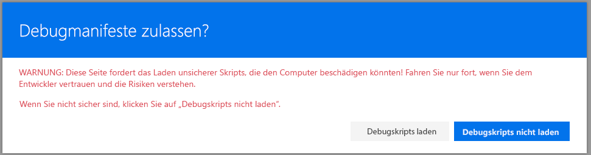

# <a name="using-page-placeholders-from-application-customizer-hello-world-part-2"></a><span data-ttu-id="1535f-101">Verwenden von Seitenplatzhaltern aus dem Anwendungsanpasser (Hello World, Teil 2)</span><span class="sxs-lookup"><span data-stu-id="1535f-101">Using page placeholders from Application Customizer (Hello World part 2)</span></span>

><span data-ttu-id="1535f-p101">**Hinweis:** Die SharePoint Framework-Erweiterungen befinden sich derzeit in der Preview-Phase. Änderungen sind vorbehalten. Die Verwendung von SharePoint Framework-Erweiterungen in Produktionsumgebungen wird aktuell nicht unterstützt.</span><span class="sxs-lookup"><span data-stu-id="1535f-p101">**Note:** The SharePoint Framework Extensions are currently in preview and are subject to change. SharePoint Framework Extensions are not currently supported for use in production environments.</span></span>

<span data-ttu-id="1535f-p102">Anwendungsanpasser ermöglichen auch den Zugriff auf bekannte Positionen auf der Seite, die Sie basierend auf Ihren geschäftlichen und funktionalen Anforderungen ändern können. Typische Szenarien sind dynamische Kopf- und Fußzeilen, die auf allen Seiten in SharePoint Online sichtbar sind.</span><span class="sxs-lookup"><span data-stu-id="1535f-p102">Application Customizers also provide access to well known locations in the page, which you can modify based on your business and functional requirements. Typical scenarios would be dynamic header and footer experiences, which would be visible across all the pages in SharePoint Online.</span></span> 

<span data-ttu-id="1535f-p103">Dieses Modell ist vergleichbar mit der Verwendung einer UserCustomAction-Sammlung auf einer Website oder in einem Webobjekt zum Zuordnen von benutzerdefiniertem JavaScript-Code, der zum Ändern der Benutzererfahrung auf der Seite dient. Der Hauptunterschied bzw. der Vorteil bei der Verwendung von SPFx-Erweiterung liegt darin, dass bestimmte Elemente immer auf der Seite vorhanden sind, unabhängig von Änderungen an der HTML-/DOM-Struktur bei künftigen Änderungen in SharePoint Online.</span><span class="sxs-lookup"><span data-stu-id="1535f-p103">This model is similar to using a UserCustomAction collection in a Site or Web object to associate custom JavaScript to modify the page experience. The key difference or advantage with SPFx extensions is that you have guaranteed elements on the page regardless of any HTML/DOM structure modifications in future changes to SharePoint Online.</span></span>

<span data-ttu-id="1535f-108">In diesem Artikel erweitern wir die Hello World-Erweiterung, die wir im vorherigen Artikel [Erstellen Ihrer ersten SharePoint Framework Erweiterung (Hallo Welt Teil 1)](./build-a-hello-world-extension.md) erstellt haben, um die Verwendung von Seitenplatzhaltern.</span><span class="sxs-lookup"><span data-stu-id="1535f-108">In this article, we'll continue extending the hello world extension built in the previous article [Build your first SharePoint Framework Extension (Hello World part 1)](./build-a-hello-world-extension.md) to take advantage of the page placeholders.</span></span>

<span data-ttu-id="1535f-109">Sie können die nachfolgend beschriebene Anleitung auch anhand dieses Videos in unserem [YouTube-Kanal „SharePoint Patterns & Practices“](https://www.youtube.com/watch?v=ipRw6o6bOTw&list=PLR9nK3mnD-OXtWO5AIIr7nCR3sWutACpV) nachvollziehen:</span><span class="sxs-lookup"><span data-stu-id="1535f-109">You can also follow these steps by watching the video on the [SharePoint PnP YouTube Channel](https://www.youtube.com/watch?v=ipRw6o6bOTw&list=PLR9nK3mnD-OXtWO5AIIr7nCR3sWutACpV).</span></span>

<a href="https://www.youtube.com/watch?v=ipRw6o6bOTw&list=PLR9nK3mnD-OXtWO5AIIr7nCR3sWutACpV">

</a>

## <a name="getting-access-to-page-placeholders"></a><span data-ttu-id="1535f-110">Zugreifen auf Seitenplatzhalter</span><span class="sxs-lookup"><span data-stu-id="1535f-110">Getting access to page placeholders</span></span>

<span data-ttu-id="1535f-p104">Die Erweiterungen des Anwendungsanpassers werden in den Bereichen `Site`, `Web` und `List` unterstützt. Sie können den Bereich steuern, indem Sie entscheiden, wo und wie der Anwendungsanpasser im SharePoint-Mandanten registriert werden soll. Wenn Anwendungsanpasse im Bereich vorhanden ist und gerendert wird, können Sie die folgende Methode verwenden, um auf den Platzhalter zuzugreifen. Nachdem Sie das Platzhalterobjekt erhalten haben, haben Sie die vollständige Kontrolle darüber, was dem Endbenutzer angezeigt wird.</span><span class="sxs-lookup"><span data-stu-id="1535f-p104">Application Customizer extensions are supported with `Site`, `Web` and `List` scopes. You can control the scope by deciding where or how the Application Customizer will be registered in your SharePoint tenant. When the Application Customizer exists in the scope and is being rendered, you can use the following method to get access to the placeholder. Once you have received the placeholder object, you have full control over what will be presented to the end user.</span></span>

<span data-ttu-id="1535f-p105">Beachten Sie, dass wir einen bekannten Platzhalter anfordern, indem wir den entsprechenden bekannten Bezeichner verwenden. In diesem Fall greift der Code auf den Fußzeilenbereich der Seite mit dem Bezeichner `Bottom` zu.</span><span class="sxs-lookup"><span data-stu-id="1535f-p105">Notice that we are requesting a well-known placeholder by using the corresponding well-known identifier. In this case, the code is accessing the header section of the page using the `Bottom` identifier.</span></span> 

```ts
    // Handling the Bottom placeholder
    if (!this._bottomPlaceholder) {
      this._bottomPlaceholder =
        this.context.placeholderProvider.tryCreateContent(
          PlaceholderName.Bottom,
          { onDispose: this._onDispose });
    ...
    }
```

<span data-ttu-id="1535f-117">In den folgenden Schritten ändern wir den zuvor erstellten Hello World-Anwendungsanpasser, um auf Platzhalter zuzugreifen und ihren Inhalt zu ändern, indem wir ihnen benutzerdefinierte HTML-Elemente hinzufügen.</span><span class="sxs-lookup"><span data-stu-id="1535f-117">In the following steps, we'll modify the previously created hello word Application Customizer to access placeholders and modify their content by adding custom html elements to them.</span></span>

<span data-ttu-id="1535f-118">Wechseln Sie in Visual Studio Code (oder Ihre bevorzugte IDE), und öffnen Sie **src\extensions\helloWorld\HelloWorldApplicationCustomizer.ts.**</span><span class="sxs-lookup"><span data-stu-id="1535f-118">Switch to Visual Studio Code (or your preferred IDE) and open **src\extensions\helloWorld\HelloWorldApplicationCustomizer.ts.**</span></span>

<span data-ttu-id="1535f-119">Fügen Sie `PlaceholderContent` und and `PlaceholderName` zum Import aus `@microsoft/sp-application-base` hinzu, indem Sie die Importanweisung wie folgt aktualisieren:</span><span class="sxs-lookup"><span data-stu-id="1535f-119">Add the `PlaceholderContent` to the import from `@microsoft/sp-application-base` by updating the import statement as follows:</span></span>

```ts
import {
  BaseApplicationCustomizer, 
  PlaceholderContent,
  PlaceholderName
} from '@microsoft/sp-application-base';
```

<span data-ttu-id="1535f-120">Fügen Sie außerdem die folgenden Importanweisungen nach dem `strings`-Import oben in der Datei hinzu:</span><span class="sxs-lookup"><span data-stu-id="1535f-120">Also add the following import statements after the `strings` import at the top of the file:</span></span>

* <span data-ttu-id="1535f-121">In den folgenden Schritten erstellen wir Formatvorlagendefinitionen für die Ausgabe.</span><span class="sxs-lookup"><span data-stu-id="1535f-121">We will create style definitions for the output in the following steps</span></span>
* <span data-ttu-id="1535f-122">`escape` wird verwendet, um die Eigenschaften des Anwendungsanpassers auzukommentieren.</span><span class="sxs-lookup"><span data-stu-id="1535f-122">`escape` is used to escape Application Customizer properties</span></span>  

```ts
import styles from './AppCustomizer.module.scss';
import { escape } from '@microsoft/sp-lodash-subset'; 
```

<span data-ttu-id="1535f-123">Erstellen Sie eine neue Datei mit dem Namen **AppCustomizer.module.scss** im Ordner **src\extensions\helloWorld**.</span><span class="sxs-lookup"><span data-stu-id="1535f-123">Create a new file named **AppCustomizer.module.scss** under the **src\extensions\helloWorld** folder.</span></span> 

<span data-ttu-id="1535f-124">Aktualisieren Sie **AppCustomizer.module.scss** wie folgt:</span><span class="sxs-lookup"><span data-stu-id="1535f-124">Update **AppCustomizer.module.scss** as follows:</span></span>

* <span data-ttu-id="1535f-125">Hierbei handelt es sich um die Formatvorlagen, die im Ausgabe-HTML-Code für die Kopf- und Fußzeilenplatzhalter verwendet werden.</span><span class="sxs-lookup"><span data-stu-id="1535f-125">These are the styles that will be used within the outputed html for the header and footer placeholders.</span></span>

```css
.app {
  .top {
    height:60px;
    text-align:center;
    line-height:2.5;
    font-weight:bold;
    display: flex;
    align-items: center;
    justify-content: center;
  }

  .bottom {
    height:40px;
    text-align:center;
    line-height:2.5;
    font-weight:bold;
    display: flex;
    align-items: center;
    justify-content: center;
  }
}
```

<span data-ttu-id="1535f-126">Wechseln Sie zurück zu **HelloWorldApplicationCustomizer.ts**, und aktualisieren Sie die **IHelloWorldApplicationCustomizerProperties**-Oberfläche wie folgt, damit sie bestimmte Eigenschaften für Kopf- und Fußzeile hat.</span><span class="sxs-lookup"><span data-stu-id="1535f-126">Move back to **HelloWorldApplicationCustomizer.ts** and update the **IHelloWorldApplicationCustomizerProperties** interface to have specific properties for Header and Footer as follows.</span></span>

* <span data-ttu-id="1535f-p106">Wenn Ihr Befehlssatz die ClientSideComponentProperties JSON-Eingabe verwendet, wird sie in das Objekt `BaseExtension.properties` deserialisert. Sie können eine Benutzeroberfläche definieren, um sie zu beschreiben.</span><span class="sxs-lookup"><span data-stu-id="1535f-p106">If your command set uses the ClientSideComponentProperties JSON input, it will be deserialized into the `BaseExtension.properties` object. You can define an interface to describe it.</span></span>

```ts
export interface IHelloWorldApplicationCustomizerProperties {
  Top: string;
  Bottom: string;
}
```

<span data-ttu-id="1535f-p107">Fügen Sie die folgenden privaten Variablen in der **HelloWorldApplicationCustomizer**-Klasse hinzu. In diesem Szenario können dies lokale Variablen in einer `onRender`-Methode sein. Wenn sie jedoch gemeinsam mit anderen Objekten verwendet werden sollen, definieren Sie sie als private Variablen.</span><span class="sxs-lookup"><span data-stu-id="1535f-p107">Add the following private variables inside of the **HelloWorldApplicationCustomizer** class. In this scenario, these could just be local variables in an `onRender` method, but if you want to share them with other objects you define them as private variables.</span></span> 

```ts
export default class HelloWorldApplicationCustomizer
  extends BaseApplicationCustomizer<IHelloWorldApplicationCustomizerProperties> {
  
  // These have been added
  private _topPlaceholder: PlaceholderContent | undefined;
  private _bottomPlaceholder: PlaceholderContent | undefined;
```

<span data-ttu-id="1535f-131">Aktualisieren Sie den Code der `onInit`-Methode wie folgt:</span><span class="sxs-lookup"><span data-stu-id="1535f-131">Update the `onInit` method as follows</span></span>

```ts
  @override
  public onInit(): Promise<void> {
    Log.info(LOG_SOURCE, `Initialized ${strings.Title}`);

    // Added to handle possible changes on the existence of placeholders
    this.context.placeholderProvider.changedEvent.add(this, this._renderPlaceHolders);

    // Call render method for generating the needed html elements
    this._renderPlaceHolders();
    return Promise.resolve<void>();
  }
```


<span data-ttu-id="1535f-132">Erstellen Sie eine neue private `_renderPlaceHolders`-Methode mit dem folgenden Code:</span><span class="sxs-lookup"><span data-stu-id="1535f-132">Create new `_renderPlaceHolders` private method with the following code:</span></span>

* <span data-ttu-id="1535f-133">Wir verwenden `this.context.placeholderProvider.tryCreateContent`, um auf den Platzhalter zuzugreifen.</span><span class="sxs-lookup"><span data-stu-id="1535f-133">We use `this.context.placeholderProvider.tryCreateContent` to get access on the placeholder</span></span>
* <span data-ttu-id="1535f-134">Erweiterungscode sollte nicht davon ausgehen, dass der erwartete Platzhalter verfügbar ist.</span><span class="sxs-lookup"><span data-stu-id="1535f-134">Extension code should not assume that the expected placeholder is available</span></span>
* <span data-ttu-id="1535f-p108">Der Code erwartet benutzerdefinierte Eigenschaften mit dem Namen `Top` und `Bottom`. Wenn die Eigenschaften vorhanden sind, werden sie innerhalb des Platzhalters gerendert.</span><span class="sxs-lookup"><span data-stu-id="1535f-p108">The code expects custom properties called `Top`and `Bottom`. If the properties exist, they will be rendered inside of the placeholders.</span></span>
* <span data-ttu-id="1535f-p109">Beachten Sie, dass der Codepfad für die oberen und unteren Platzhalter in der folgenden Methode beinahe identisch ist. Er unterscheidet sich nur durch die verwendeten Variablen und Formatvorlagendefinitionen.</span><span class="sxs-lookup"><span data-stu-id="1535f-p109">Notice that the code path for both the header and the footer is almost identical in the below method. The only differences are the variables used and the style definitions.</span></span>

```ts
   private _renderPlaceHolders(): void {

    console.log('HelloWorldApplicationCustomizer._renderPlaceHolders()');
    console.log('Available placeholders: ',
      this.context.placeholderProvider.placeholderNames.map(name => PlaceholderName[name]).join(', '));

    // Handling the top placeholder
    if (!this._topPlaceholder) {
      this._topPlaceholder =
        this.context.placeholderProvider.tryCreateContent(
          PlaceholderName.Top,
          { onDispose: this._onDispose });

      // The extension should not assume that the expected placeholder is available.
      if (!this._topPlaceholder) {
        console.error('The expected placeholder (Top) was not found.');
        return;
      }

      if (this.properties) {
        let topString: string = this.properties.Top;
        if (!topString) {
          topString = '(Top property was not defined.)';
        }

        if (this._topPlaceholder.domElement) {
          this._topPlaceholder.domElement.innerHTML = `
                <div class="${styles.app}">
                  <div class="ms-bgColor-themeDark ms-fontColor-white ${styles.top}">
                    <i class="ms-Icon ms-Icon--Info" aria-hidden="true"></i> ${escape(topString)}
                  </div>
                </div>`;
        }
      }
    }

    // Handling the bottom placeholder
    if (!this._bottomPlaceholder) {
      this._bottomPlaceholder =
        this.context.placeholderProvider.tryCreateContent(
          PlaceholderName.Bottom,
          { onDispose: this._onDispose });

      // The extension should not assume that the expected placeholder is available.
      if (!this._bottomPlaceholder) {
        console.error('The expected placeholder (Bottom) was not found.');
        return;
      }

      if (this.properties) {
        let bottomString: string = this.properties.Bottom;
        if (!bottomString) {
          bottomString = '(Bottom property was not defined.)';
        }

        if (this._bottomPlaceholder.domElement) {
          this._bottomPlaceholder.domElement.innerHTML = `
                <div class="${styles.app}">
                  <div class="ms-bgColor-themeDark ms-fontColor-white ${styles.bottom}">
                    <i class="ms-Icon ms-Icon--Info" aria-hidden="true"></i> ${escape(bottomString)}
                  </div>
                </div>`;
        }
      }
    }
  }

```

<span data-ttu-id="1535f-p110">Fügen Sie die folgende Methode nach der `_renderPlaceHolders`-Methode hinzu. In diesem Fall geben wir eine einfache Konsolenmeldung aus, wenn die Erweiterung von der Seite entfernt wird.</span><span class="sxs-lookup"><span data-stu-id="1535f-p110">Add the following method after the `_renderPlaceHolders` method. In this case, we simply output a console message, when the extension is removed from the page.</span></span> 

```ts
  private _onDispose(): void {
    console.log('[HelloWorldApplicationCustomizer._onDispose] Disposed custom top and bottom placeholders.');
  }
```

<span data-ttu-id="1535f-141">Der Code kann nun in SharePoint Online getestet werden.</span><span class="sxs-lookup"><span data-stu-id="1535f-141">The code is now ready to be tested in SharePoint Online.</span></span>

<span data-ttu-id="1535f-p111">Wechseln Sie in das Konsolenfenster, in dem `gulp serve` ausgeführt wird, und schauen Sie nach, ob Fehler gemeldet wurden. gulp meldet alle Fehler in der Konsole. Sie müssen sie dann zuerst beheben, bevor Sie fortfahren können.</span><span class="sxs-lookup"><span data-stu-id="1535f-p111">Switch to the console window that is running `gulp serve` and check if there are any errors. If there are errors, gulp reports them in the console and you will need to fix them before proceeding.</span></span>

<span data-ttu-id="1535f-144">Wenn Sie die Lösung derzeit noch nicht ausgeführt wird, führen Sie den folgenden Befehl aus, und stellen Sie sicher, dass keine Fehler auftreten.</span><span class="sxs-lookup"><span data-stu-id="1535f-144">If you don't have the solution running currently, execute the following command and ensure you don't have any errors.</span></span>

```
gulp serve --nobrowser
```

<span data-ttu-id="1535f-p112">Navigieren Sie zu einer sofort einsatzfähigen modernen Liste in SharePoint Online. Dies kann eine Liste oder Bibliothek für die anfänglichen Tests sein.</span><span class="sxs-lookup"><span data-stu-id="1535f-p112">Navigate to an out of the box modern list in SharePoint Online. This can be a list or a library for the initial testing.</span></span> 

<span data-ttu-id="1535f-147">Um die Erweiterung zu testen, hängen Sie die folgende Abfragezeichenfolgenparameter an die URL an:</span><span class="sxs-lookup"><span data-stu-id="1535f-147">To test your extension, append the following query string parameters to the URL:</span></span>

* <span data-ttu-id="1535f-148">Beachten Sie, dass die in diesem Abfrageparameter verwendete GUID mit dem ID-Attribut Ihres Anwendungsanpassers übereinstimmen muss, die Sie in **HelloWorldApplicationCustomizer.manifest.json** finden.</span><span class="sxs-lookup"><span data-stu-id="1535f-148">Notice that the GUID used in this query parameter has to match on the ID attribute of your Application Customizer available from **HelloWorldApplicationCustomizer.manifest.json**.</span></span>
* <span data-ttu-id="1535f-p113">Wir verwenden darüber hinaus Kopf- und Fußzeilen-JSON-Eigenschaften, um dem Anwendungsanpasser Parameter oder Konfigurationen bereitzustellen. In diesem Fall geben wir diese Werte einfach aus, wobei Sie das Verhalten jedoch basierend auf den Eigenschaften in der eigentlichen Produktionsumgebung anpassen können.</span><span class="sxs-lookup"><span data-stu-id="1535f-p113">We also use Header and Footer JSON properties to provide parameters or configurations to the Application Customizer. In this case, we simply output these values, but you could adjust the behavior based on the properties in actual production usage.</span></span> 

```
?loadSPFX=true&debugManifestsFile=https://localhost:4321/temp/manifests.js&customActions={"e5625e23-5c5a-4007-a335-e6c2c3afa485":{"location":"ClientSideExtension.ApplicationCustomizer","properties":{"Top":"Top area of the page","Bottom":"Bottom area in the page"}}}
```
<span data-ttu-id="1535f-151">Die vollständige anzufordernde URL sähe in etwa wie folgt aus:</span><span class="sxs-lookup"><span data-stu-id="1535f-151">The full URL to request would be something like the following:</span></span>

```
contoso.sharepoint.com/Lists/Contoso/AllItems.aspx?loadSPFX=true&debugManifestsFile=https://localhost:4321/temp/manifests.js&customActions={"e5625e23-5c5a-4007-a335-e6c2c3afa485":{"location":"ClientSideExtension.ApplicationCustomizer","properties":{"Top":"Top area of the page","Bottom":"Bottom area in the page"}}}
```



<span data-ttu-id="1535f-153">Klicken Sie auf die Schaltfläche zum **Laden von Debugging-Skripts**, um weiter Skripts von Ihrem lokalen Host zu laden.</span><span class="sxs-lookup"><span data-stu-id="1535f-153">Click the "**Load debug scripts**" button to continue loading scripts from your local host.</span></span>

<span data-ttu-id="1535f-154">Sie sollten jetzt den benutzerdefinierten Kopf- und Fußzeileninhalt auf der Seite sehen.</span><span class="sxs-lookup"><span data-stu-id="1535f-154">You should now see the custom header and footer content in your page.</span></span> 


## <a name="next-steps"></a><span data-ttu-id="1535f-156">Nächste Schritte</span><span class="sxs-lookup"><span data-stu-id="1535f-156">Next steps</span></span>
<span data-ttu-id="1535f-p114">Herzlichen Glückwunsch, Sie haben Ihre erste benutzerdefinierte Kopf- und Fußzeile mithilfe des Anwendungsanpassers erstellt! Sie können Ihre Hello World-Erweiterung im nächsten Thema [Bereitstellen Ihrer Erweiterung für die Websitesammlung (Hello World, Teil 3)](./serving-your-extension-from-sharepoint.md) noch weiter entwickeln. Sie erfahren, wie Sie die Hello World-Erweiterung in einer SharePoint-Websitesammlung mit **Debug**-Abfrageparametern bereitstellen und in der Vorschau anzeigen.</span><span class="sxs-lookup"><span data-stu-id="1535f-p114">Congratulations on building your own custom header and footer using the Application Customizer! You can continue building out your Hello World Extension in the next topic [Deploy your extension to site collection (Hello world part 3)](./serving-your-extension-from-sharepoint.md). You will learn how to deploy and preview the Hello World extension in a SharePoint site collection without using **Debug** query parameters.</span></span> 
