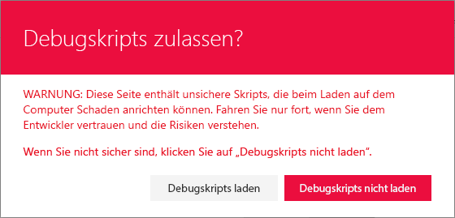

# <a name="use-page-placeholders-from-application-customizer-hello-world-part-2"></a>Verwenden von Seitenplatzhaltern aus dem Anwendungsanpasser (Hello World, Teil 2)

Anwendungsanpasser bieten Zugriff auf bekannte Speicherorte auf SharePoint-Seiten, die Sie basierend auf Ihren geschäftlichen und funktionalen Anforderungen anpassen können. Sie können beispielsweise dynamische Kopfzeilen und Fußzeilen erstellen, die auf allen Seiten in SharePoint Online gerendert werden. 

Dieses Modell ist vergleichbar mit der Verwendung einer **UserCustomAction**-Auflistung in einem **Website** oder **Web**-Objekt zum Ändern der Seitenoberfläche über benutzerdefiniertes JavaScript. Der Hauptunterschied bzw. Vorteil bei SharePoint Framework (SPFx) Extensions besteht darin, dass Ihre Seitenelemente nicht geändert werden, wenn Änderungen an der HTML-/DOM-Struktur in SharePoint Online vorgenommen werden.

In diesem Artikel wird beschrieben, wie Sie Ihre [Hello World-Erweiterung](./build-a-hello-world-extension.md) erweitern, um die Seitenplatzhalter zu nutzen. Sie können die nachfolgend beschriebene Anleitung auch anhand dieses Videos in unserem [YouTube-Kanal „SharePoint Patterns & Practices“](https://www.youtube.com/watch?v=ipRw6o6bOTw&list=PLR9nK3mnD-OXtWO5AIIr7nCR3sWutACpV) nachvollziehen:

<a href="https://www.youtube.com/watch?v=3LXuYBaJ1Lc">

</a>

## <a name="get-access-to-page-placeholders"></a>Zugreifen auf Seitenplatzhalter

Anwendungsanpasser-Erweiterungen werden bei `Site`-, `Web`- und `List`-Bereichen unterstützt. Sie können den Bereich steuern, indem Sie entscheiden, wo und wie der Anwendungsanpasser in Ihrem SharePoint-Mandanten registriert wird. Wenn der Anwendungsanpasser in dem Bereich vorhanden ist und gerendert wird, können Sie die folgende Methode verwenden, um Zugriff auf den Platzhalter zu erhalten. 

```ts
    // Handling the Bottom placeholder
    if (!this._bottomPlaceholder) {
      this._bottomPlaceholder =
        this.context.placeholderProvider.tryCreateContent(
          PlaceholderName.Bottom,
          { onDispose: this._onDispose });
    ...
    }
```

Nachdem Sie das Platzhalterobjekt abgerufen haben, haben Sie die volle Kontrolle darüber, was dem Endbenutzer angezeigt wird.

Beachten Sie, dass Sie einen bekannten Platzhalter mithilfe des entsprechenden bekannten Bezeichners anfordern. In diesem Fall greift der Code auf den Fußzeilenbereich der Seite mithilfe des `Bottom` -Bezeichners zu. 

In den folgenden Schritten ändern wir den Hello World-Anwendungsanpasser, um auf Platzhalter zuzugreifen und ihren Inhalt zu ändern, indem wir benutzerdefinierte HTML-Elemente hinzufügen.

1. Öffnen Sie in Visual Studio Code (oder Ihrer bevorzugte IDE) **src\extensions\helloWorld\HelloWorldApplicationCustomizer.ts.**

2. Fügen Sie `PlaceholderContent` und `PlaceholderName` zum Import aus `@microsoft/sp-application-base` hinzu, indem Sie die Importanweisung wie folgt aktualisieren:

    ```ts
    import {
      BaseApplicationCustomizer, 
      PlaceholderContent,
      PlaceholderName
    } from '@microsoft/sp-application-base';
    ```
    
      Fügen Sie außerdem die folgenden Importanweisungen nach dem `strings`-Import oben in der Datei hinzu:

    ```ts
    import styles from './AppCustomizer.module.scss';
    import { escape } from '@microsoft/sp-lodash-subset'; 
    ```

    `escape` wird verwendet, um die Eigenschaften des Anwendungsanpassers auzukommentieren. In den folgenden Schritten erstellen Sie Formatvorlagendefinitionen für die Ausgabe.  

3. Erstellen Sie eine neue Datei mit dem Namen **AppCustomizer.module.scss** im Ordner **src\extensions\helloWorld**. 

4. Aktualisieren Sie **AppCustomizer.module.scss** wie folgt:

    >**Hinweis:** Hierbei handelt es sich um die Formatvorlagen, die in der HTML-Ausgabe für die Kopf- und Fußzeilenplatzhalter verwendet werden.

      ```css
      .app {
        .top {
          height:60px;
          text-align:center;
          line-height:2.5;
          font-weight:bold;
          display: flex;
          align-items: center;
          justify-content: center;
        }

        .bottom {
          height:40px;
          text-align:center;
          line-height:2.5;
          font-weight:bold;
          display: flex;
          align-items: center;
          justify-content: center;
        }
      }
      ```

5. Aktualisieren Sie in der Datei **HelloWorldApplicationCustomizer.ts** die **IHelloWorldApplicationCustomizerProperties**-Oberfläche wie folgt, um bestimmte Eigenschaften für Kopf- und Fußzeile hinzuzufügen.

      **Hinweis:**Wenn Ihr Befehlssatz die JSON-Eingabe „ClientSideComponentProperties“ verwendet, wird sie in das Objekt `BaseExtension.properties` deserialisiert. Sie können eine Benutzeroberfläche definieren, um sie zu beschreiben.

    ```ts
    export interface IHelloWorldApplicationCustomizerProperties {
      Top: string;
      Bottom: string;
    }
    ```

6. Fügen Sie die folgenden privaten Variablen innerhalb der **HelloWorldApplicationCustomizer**-Klasse hinzu. In diesem Szenario können dies nur lokale Variablen in einer `onRender`-Methode sein, wenn Sie sie jedoch für andere Objekte freigeben möchten, definieren Sie sie als private Variablen. 

      ```ts
      export default class HelloWorldApplicationCustomizer
        extends BaseApplicationCustomizer<IHelloWorldApplicationCustomizerProperties> {

        // These have been added
        private _topPlaceholder: PlaceholderContent | undefined;
        private _bottomPlaceholder: PlaceholderContent | undefined;
    ```

7. Aktualisieren Sie den Code der `onInit`-Methode wie folgt:

      ```ts
        @override
        public onInit(): Promise<void> {
          Log.info(LOG_SOURCE, `Initialized ${strings.Title}`);

          // Added to handle possible changes on the existence of placeholders.
          this.context.placeholderProvider.changedEvent.add(this, this._renderPlaceHolders);

          // Call render method for generating the HTML elements.
          this._renderPlaceHolders();
          return Promise.resolve<void>();
        }
      ```


8. Erstellen Sie eine neue private `_renderPlaceHolders`-Methode mit dem folgenden Code:

      ```ts
        private _renderPlaceHolders(): void {

          console.log('HelloWorldApplicationCustomizer._renderPlaceHolders()');
          console.log('Available placeholders: ',
        this.context.placeholderProvider.placeholderNames.map(name => PlaceholderName[name]).join(', '));

          // Handling the top placeholder
          if (!this._topPlaceholder) {
        this._topPlaceholder =
          this.context.placeholderProvider.tryCreateContent(
            PlaceholderName.Top,
            { onDispose: this._onDispose });

        // The extension should not assume that the expected placeholder is available.
        if (!this._topPlaceholder) {
          console.error('The expected placeholder (Top) was not found.');
          return;
        }

        if (this.properties) {
          let topString: string = this.properties.Top;
          if (!topString) {
            topString = '(Top property was not defined.)';
          }

          if (this._topPlaceholder.domElement) {
            this._topPlaceholder.domElement.innerHTML = `
              <div class="${styles.app}">
                <div class="ms-bgColor-themeDark ms-fontColor-white ${styles.top}">
                  <i class="ms-Icon ms-Icon--Info" aria-hidden="true"></i> ${escape(topString)}
                </div>
              </div>`;
          }
        }
          }

          // Handling the bottom placeholder
          if (!this._bottomPlaceholder) {
        this._bottomPlaceholder =
          this.context.placeholderProvider.tryCreateContent(
            PlaceholderName.Bottom,
            { onDispose: this._onDispose });

        // The extension should not assume that the expected placeholder is available.
        if (!this._bottomPlaceholder) {
          console.error('The expected placeholder (Bottom) was not found.');
          return;
        }

        if (this.properties) {
          let bottomString: string = this.properties.Bottom;
          if (!bottomString) {
            bottomString = '(Bottom property was not defined.)';
          }

          if (this._bottomPlaceholder.domElement) {
            this._bottomPlaceholder.domElement.innerHTML = `
              <div class="${styles.app}">
                <div class="ms-bgColor-themeDark ms-fontColor-white ${styles.bottom}">
                  <i class="ms-Icon ms-Icon--Info" aria-hidden="true"></i> ${escape(bottomString)}
                </div>
              </div>`;
          }
        }
          }
        }
      ```

      * Verwenden Sie `this.context.placeholderProvider.tryCreateContent`, um auf den Platzhalter zuzugreifen.
      * Erweiterungscode sollte nicht davon ausgehen, dass der erwartete Platzhalter verfügbar ist.
      * Der Code erwartet benutzerdefinierte Eigenschaften mit dem Namen `Top` und `Bottom`. Wenn die Eigenschaften vorhanden sind, werden diese in den Platzhaltern gerendert.
      * Beachten Sie, dass der Codepfad sowohl für die Platzhalter oben als auch für die Platzhalter unten nahezu identisch ist. Die einzigen Unterschiede sind die in den Formatvorlagen verwendeten Variablen.

9. Fügen Sie nach der `_renderPlaceHolders`-Methode die folgende Methode hinzu. In diesem Fall geben Sie eine einfache Konsolenmeldung aus, wenn die Erweiterung von der Seite entfernt wird. 

      ```ts
        private _onDispose(): void {
          console.log('[HelloWorldApplicationCustomizer._onDispose] Disposed custom top and bottom placeholders.');
        }
      ```

Sie können nun den Code in SharePoint Online testen.

## <a name="test-your-code"></a>Testen des Codes

Wechseln Sie in das Konsolenfenster, in dem `gulp serve` ausgeführt wird, und schauen Sie nach, ob Fehler gemeldet wurden. Gulp meldet alle Fehler in der Konsole; Sie müssen die Fehler beheben, bevor Sie den Vorgang fortsetzen.

Wenn die Lösung nicht ausgeführt wird, verwenden Sie den folgenden Befehl, um nach Fehlern zu suchen.

```
gulp serve --nobrowser
```

Wechseln Sie zu einer modernen Liste in SharePoint Online. Dies kann eine Liste oder eine Bibliothek sein. 

Um die Erweiterung zu testen, hängen Sie die folgenden Abfragezeichenfolgenparameter an die URL an:


```
?loadSPFX=true&debugManifestsFile=https://localhost:4321/temp/manifests.js&customActions={"e5625e23-5c5a-4007-a335-e6c2c3afa485":{"location":"ClientSideExtension.ApplicationCustomizer","properties":{"Top":"Top area of the page","Bottom":"Bottom area in the page"}}}
```

* Beachten Sie, dass die in diesem Abfrageparameter verwendete GUID mit dem ID-Attribut Ihres Anwendungsanpassers übereinstimmen muss. Dieses ist in der Datei **HelloWorldApplicationCustomizer.manifest.json** verfügbar.
* Sie verwenden JSON-Eigenschaften von Kopf- und Fußzeilen, um Parameter oder Konfigurationen für den Anwendungsanpasser bereitzustellen. In diesem Fall geben Sie diese Werte einfach aus. Sie können auch das Verhalten auf Grundlage der in der Produktion verwendeten Eigenschaften anpassen. 

Die vollständige URL sollte ähnlich wie im folgenden Beispiel aussehen:

```
contoso.sharepoint.com/Lists/Contoso/AllItems.aspx?loadSPFX=true&debugManifestsFile=https://localhost:4321/temp/manifests.js&customActions={"e5625e23-5c5a-4007-a335-e6c2c3afa485":{"location":"ClientSideExtension.ApplicationCustomizer","properties":{"Top":"Top area of the page","Bottom":"Bottom area in the page"}}}
```

Wählen Sie **Load debug scripts**, um weiter Skripts von Ihrem lokalen Host zu laden.



Sie sollten jetzt den benutzerdefinierten Kopf- und Fußzeileninhalt auf der Seite sehen. 


## <a name="next-steps"></a>Nächste Schritte
Herzlichen Glückwunsch, Sie haben Ihre eigenen benutzerdefinierte Kopf- und Fußzeile mithilfe des Anwendungsanpassers erstellt! Informationen zum Fortsetzen der Erstellung Ihrer Erweiterung finden Sie unter [Bereitstellen Ihrer Erweiterung in SharePoint (Hello World, Teil 3)](./serving-your-extension-from-sharepoint.md). Sie erfahren, wie die Hello World-Erweiterung in einer SharePoint-Websitesammlung bereitgestellt und in der Vorschau angezeigt wird, ohne die **Debug**-Abfrageparameter zu verwenden. 
