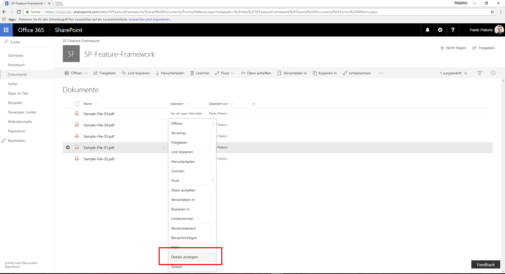
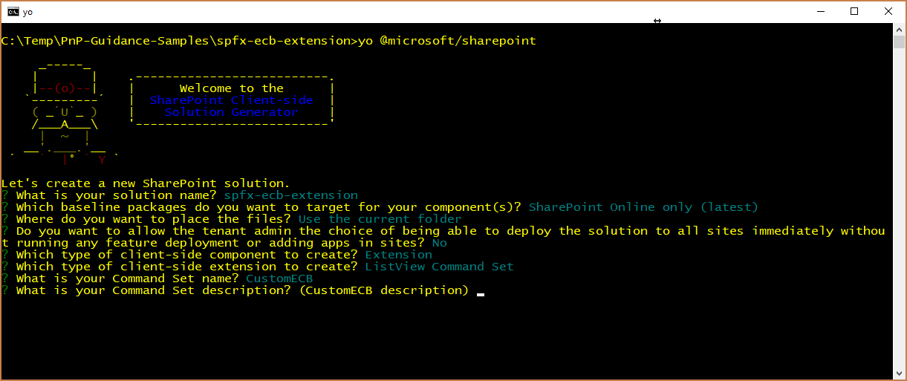
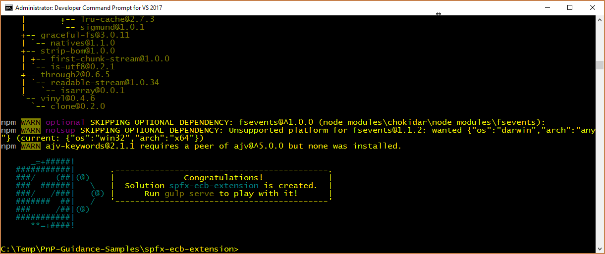
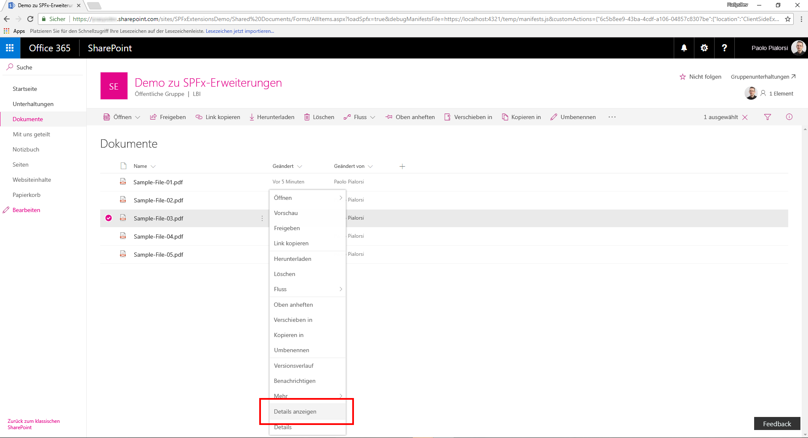
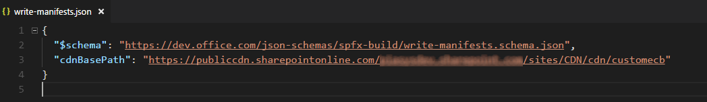
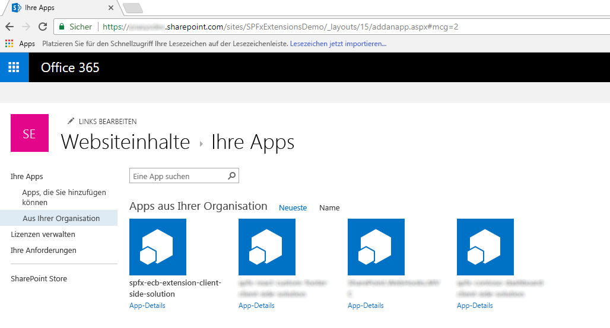

# <a name="migrating-from-edit-control-block-ecb-menu-item-to-sharepoint-framework-extensions"></a>Migrieren vom Edit Control Block-Menüelement (ECB) zu SharePoint-Framework-Erweiterungen

In den letzten Jahren profitierten die meisten auf Office 365 und SharePoint Online aufbauenden Enterprise-Lösungen von den _CustomAction_-Funktionen von SharePoint-Feature-Framework zur Erweiterung der Benutzeroberfläche von Seiten. Innerhalb der modernen Benutzeroberfläche von SharePoint Online stehen die meisten dieser Anpassungen jedoch nicht mehr zur Verfügung. Mit den neuen SharePoint-Framework-Erweiterungen können Sie jedoch fast die gleichen Funktionen auch in der modernen Benutzeroberfläche bereitstellen. 

In diesem Lernprogramm erfahren Sie, wie Sie die alten, klassischen Anpassungen zu dem neuen Modell basierend auf SharePoint-Framework-Erweiterungen migrieren können.

> [!NOTE]
> Weitere Informationen zum Erstellen von SharePoint-Framework-Erweiterungen  finden Sie unter [Übersicht über SharePoint-Framework-Erweiterungen](../overview-extensions.md).

Bei der Entwicklung von SharePoint-Framework-Erweiterungen sind folgende Optionen verfügbar:

* **Application Customizer**. Erweiterung der nativen modernen Benutzeroberfläche von SharePoint Online, indem benutzerdefinierte Elemente und clientseitiger Code den vordefinierten Platzhaltern der modernen Seiten hinzugefügt werden. Zu der Zeit, zu der dieser Artikel verfasst wurde, waren die verfügbaren Platzhalter die Kopf- und Fußzeile jeder modernen Seite.
* **Command Set**. Hinzufügen benutzerdefinierter ECB-Menüelemente oder benutzerdefinierter Schaltflächen zur Befehlsleiste einer Listenansicht für eine Liste oder Bibliothek. Sie können diesen Befehlen eine JavaScript (TypeScript)-Aktion zuordnen.
* **Field Customizer**. Anpassung der Darstellung eines Felds in einer Listenansicht mit benutzerdefinierten HTML-Elementen und clientseitigem Code.

Die nützlichste Option in diesem Kontext ist die Erweiterung „Command Set“.

Angenommen Sie verfügen über eine _CustomAction_ in SharePoint Online, damit für Dokumente in einer Bibliothek ein benutzerdefiniertes ECB-Menü verfügbar ist. Die Funktion des ECB-Menüelements besteht darin, eine benutzerdefinierte Seite zu öffnen, auf der die Listen-ID und die Listenelement-ID des aktuell ausgewählten Elements in der Abfragezeichenfolge der Zielseite bereitgestellt wird.

Im folgenden Codeausschnitt ist der XML-Code enthalten, der _CustomAction_ mithilfe des SharePoint-Feature-Frameworks definiert.

```XML
<?xml version="1.0" encoding="utf-8"?>
<Elements xmlns="http://schemas.microsoft.com/sharepoint/">
  <CustomAction Id="OpenDetailsPageWithItemReference"
                Title="Show Details"
                Description="Opens a new page with further details about the currently selected item"
                Sequence="1001"
                RegistrationType="List"
                RegistrationId="101"                
                Location="EditControlBlock">
    <UrlAction Url="ShowDetails.aspx?ID={ItemId}&amp;List={ListId}" />
  </CustomAction>
</Elements>
```

Wie Sie sehen können, definiert die Funktionselementdatei ein Element des Typs _CustomAction_, um ein neues Element am Ort von _EditControlBlock_ (also ECB) für ein beliebiges Dokument in einer beliebigen Bibliothek hinzuzufügen (_ RegistrationType_ ist _List_ und _RegistrationId_ ist _101_).

In der folgenden Abbildung sehen Sie die Ausgabe der vorherigen benutzerdefinierten Aktion in der Listenansicht einer Bibliothek.



Beachten Sie, dass das benutzerdefinierte ECB-Element des SharePoint-Feature-Framework in einer „modernen“ Liste funktioniert. Tatsächlich funktioniert eine benutzerdefinierte Listenaktion auch in „modernen“ Listen, solange Sie keinen JavaScript-Code verwenden.

Zum Migrieren der vorherigen Lösung zum SharePoint-Framework führen Sie die folgenden Schritte aus.

> [!NOTE]
> Bevor Sie die Schritte in diesem Artikel durchführen, müssen Sie [Ihre Entwicklungsumgebung einrichten](../../set-up-your-development-environment.md).

<a name="CreateCommandSet"> </a>

## <a name="create-a-new-sharepoint-framework-solution"></a>Erstellen einer neuen SharePoint-Framework-Lösung

1. Öffnen Sie das Befehlszeilentool Ihrer Wahl (z. B. PowerShell, CMD.EXE, Cmder). Erstellen Sie einen neuen Ordner für die Lösung namens **spfx-ecb-extension**, und erstellen Sie eine neue SharePoint-Framework-Lösung, indem Sie den Yeoman-Generator mit dem folgenden Befehl ausführen:

2. Geben Sie bei Aufforderung durch das Tool Folgendes an:

  * Bestätigen Sie den Standardnamen **spfx-ecb-extension** für Ihre Lösung, und drücken Sie die EINGABETASTE.
  * Wählen Sie **SharePoint Online only (latest)**, und drücken Sie die EINGABETASTE.
  * Wählen Sie **Use the current folder** aus, und drücken Sie die EINGABETASTE.
  * Wählen Sie **N**, damit die Erweiterung auf jeder Website explizit installiert werden muss, wenn sie verwendet wird.
  * Wählen Sie **Extension** als den zu erstellenden Typ von clientseitiger Komponente aus.
  * Wählen Sie **ListView Command Set** als den zu erstellenden Typ von Erweiterung aus.
  * Geben Sie **CustomECB** als Namen für Ihr Command Set an.

  

  An diesem Punkt installiert Yeoman die erforderlichen Abhängigkeiten und erstellt ein Gerüst für die Lösungsdateien und Ordner sowie die **CustomFooter**-Erweiterung. Das kann einige Minuten dauern.

  Nach Abschluss der Gerüsterstellung sollte folgende Erfolgsmeldung angezeigt werden:

  

3. Führen Sie den folgenden Befehl aus, um die Version der Projektabhängigkeiten zu sperren:

  ```
  npm shrinkwrap
  ```

4. Starten Sie Visual Studio Code (oder den Code-Editor Ihrer Wahl), und beginnen Sie, die Lösung zu entwickeln. Zum Starten von Visual Studio Code können Sie die folgende Anweisung ausführen.

  ```
  code .
  ```

<a name="DefineCommandSetECB"> </a>

## <a name="define-the-new-ecb-item"></a>Definieren des neuen ECB-Elements

Um das gleiche Verhalten des ECB-Menüelements zu reproduzieren, das mit dem SharePoint-Feature-Framework erstellt wurde, müssen Sie die gleiche Logik mithilfe von clientseitigem Code innerhalb der neuen SharePoint-Framework-Lösung implementieren. Gehen Sie hierzu wie folgt vor:

1. Öffnen Sie die Datei **CustomEcbCommandSet.manifest.json** im Ordner **src/extensions/customEcb**. Kopieren Sie den Wert der Eigenschaft `id`, und bewahren Sie ihn an einem sicheren Ort auf, da Sie ihn später benötigen.

2. Bearbeiten Sie in derselben Datei das Array von **items** im unteren Bereich der Datei, um einen einzelnen Befehl für das Command Set zu definieren. Rufen Sie den Befehl **ShowDetails** auf, und geben Sie dann einen Titel sowie einen Befehlstyp ein. Im folgenden Screenshot sehen Sie, wie die Manifestdatei aussehen soll.

  

3. Öffnen Sie die Datei **CustomEcbCommandSet.ts** im Ordner **src/extensions/customEcb**, und bearbeiten Sie den Inhalt entsprechend dem folgenden Codeausschnitt:

  ``` TypeScript
  import { Guid } from '@microsoft/sp-core-library';
  import { override } from '@microsoft/decorators';
  import {
    BaseListViewCommandSet,
    Command,
    IListViewCommandSetListViewUpdatedParameters,
    IListViewCommandSetExecuteEventParameters
  } from '@microsoft/sp-listview-extensibility';
  import { Dialog } from '@microsoft/sp-dialog';

  import * as strings from 'CustomEcbCommandSetStrings';

  export interface ICustomEcbCommandSetProperties {
    targetUrl: string;
  }

  export default class CustomEcbCommandSet extends BaseListViewCommandSet<ICustomEcbCommandSetProperties> {

    @override
    public onInit(): Promise<void> {
      return Promise.resolve();
    }

    @override
    public onListViewUpdated(event: IListViewCommandSetListViewUpdatedParameters): void {
      const compareOneCommand: Command = this.tryGetCommand('ShowDetails');
      if (compareOneCommand) {
        // This command should be hidden unless exactly one row is selected.
        compareOneCommand.visible = event.selectedRows.length === 1;
      }
    }

    @override
    public onExecute(event: IListViewCommandSetExecuteEventParameters): void {
      switch (event.itemId) {
        case 'ShowDetails':

          const itemId: number = event.selectedRows[0].getValueByName("ID");
          const listId: Guid = this.context.pageContext.list.id;

          window.location.replace(`${this.properties.targetUrl}?ID=${itemId}&List=${listId}`);

          break;
        default:
          throw new Error('Unknown command');
      }
    }
  }
  ```

  Beachten Sie die `import`-Anweisung am Anfang der Datei, die auf den Typ `Guid` verweist, der die ID der aktuellen Liste enthalten soll. 
  
  Darüber hinaus deklariert die Schnittstelle `ICustomEcbCommandSetProperties` eine einzelne Eigenschaft mit der Bezeichnung `targetUrl`, die verwendet werden kann, um die URL der Zielseite anzugeben, die beim Auswählen des ECB-Menüelements geöffnet werden soll.

  Darüber hinaus behandelt die Überschreibung der `onExecute`-Methode die Ausführung der benutzerdefinierten Aktion. Beachten Sie den Codeauszug, der die ID des aktuell ausgewählten Elements aus dem `event`-Argument sowie die ID der Quellliste aus dem `pageContext`-Objekt abruft.

  Beachten Sie schließlich auch die Überschreibung der `onListViewUpdated`-Methode, die standardmäßig den Befehl `'ShowDetails'` nur dann aktivierte, wenn ein einzelnes Element ausgewählt wird.

  Die Umleitung an die Ziel-URL erfolgt durch die Verwendung von klassischem JavaScript-Code und der Funktion `window.location.replace`. Sie können natürlich jede Art von TypeScript-Code in die `onExecute`-Methode schreiben. Um hier nur ein Beispiel zu nennen, können Sie das Dialog-Framework des SharePoint-Frameworks verwenden, um ein neues Dialogfeld zu öffnen und mit Benutzern zu interagieren.

  > [!NOTE]
  > Weitere Informationen zum Dialog-Framework des SharePoint-Frameworks finden Sie unter [Verwenden von benutzerdefinierten Dialogfeldern mit SharePoint-Framework-Erweiterungen](./using-custom-dialogs-with-spfx.md).

  <br/>

  In der folgenden Abbildung ist die resultierende Ausgabe enthalten.

  

<a name="DebugCommandSet"> </a>

## <a name="test-the-solution-in-debug-mode"></a>Testen der Lösung im Debugmodus

1. Kehren Sie zum Konsolenfenster zurück, und führen Sie den folgenden Befehl aus, um die Lösung zu erstellen und den lokalen Node.js-Server zum Hosten der Lösung auszuführen.

  ```
  gulp serve --nobrowser
  ```

2. Öffnen Sie Ihren bevorzugten Browser, und wechseln Sie zu einer „modernen“ Bibliothek einer beliebigen „modernen“ Teamwebsite. Hängen Sie die folgenden Abfragezeichenfolgeparameter an die **AllItems.aspx**-Seiten-URL an.

  ```
  ?loadSpfx=true&debugManifestsFile=https://localhost:4321/temp/manifests.js&customActions={"6c5b8ee9-43ba-4cdf-a106-04857c8307be":{"location":"ClientSideExtension.ListViewCommandSet.ContextMenu","properties":{"targetUrl":"ShowDetail.aspx"}}}
  ```

  Ersetzen Sie in der vorherigen Abfragezeichenfolge die GUID durch den `id`-Wert aus der Datei **CustomEcbCommandSet.manifest.json** ersetzen, den Sie gespeichert und aufbewahrt haben. 
  
  Es ist außerdem eine `location`-Eigenschaft vorhanden, die den Wert von **ClientSideExtension.ListViewCommandSet.ContextMenu** annimmt. Dieser weist SPFx an, das Command Set als ein ECB-Menüelement zu rendern. Nachfolgend finden Sie alle Optionen für die `location`-Eigenschaft:
  
  * **ClientSideExtension.ListViewCommandSet.ContextMenu**.  Im Kontextmenü für die Elemente.
  * **ClientSideExtension.ListViewCommandSet.CommandBar**. Das obere Befehlssatzmenü in einer Liste oder Bibliothek.
  * **ClientSideExtension.ListViewCommandSet**. Sowohl im Kontextmenü als auch auf der Befehlsleiste (entspricht `SPUserCustomAction.Location="CommandUI.Ribbon"`).

  Schließlich befindet sich in der Abfragezeichenfolge noch die Eigenschaft `properties`, die die JSON-Serialisierung eines Objekts vom Typ `ICustomEcbCommandSetProperties` darstellt. Dies ist der Typ der benutzerdefinierten Eigenschaften, die das benutzerdefinierte Command Set zum Rendern anfordert.

  Beachten Sie, dass beim Ausführen der Seitenanforderung ein Warnmeldungsfeld „Debugskripts zulassen?“ angezeigt wird, in dem Sie aus Sicherheitsgründen nach der Zustimmung für die Ausführung des Codes von Localhost gefragt werden. Wenn Sie die Lösung lokal debuggen und testen möchten, müssen Sie das Laden von Debugskripts zulassen.

<a name="PackageAndHostCommandSet"> </a>

## <a name="package-and-host-the-solution"></a>Packen und Hosten der Lösung

Wenn Sie mit dem Ergebnis zufrieden sind, können Sie die Lösung nun packen und in der eigentlichen Hostinginfrastruktur hosten.
Bevor Sie das Bundle und das Paket erstellen, müssen Sie eine XML-Feature-Framework-Datei deklarieren, um die Erweiterung bereitzustellen.

### <a name="review-feature-framework-elements"></a>Überprüfen von Feature-Framework-Elementen

1. Öffnen Sie im Code-Editor den Unterordner **/sharepoint/assets** der Lösung, und bearbeiten Sie die Datei **elements.xml**. Der folgende Codeauszug gibt an, wie die Datei aussehen sollte.

  ```XML
  <?xml version="1.0" encoding="utf-8"?>
  <Elements xmlns="http://schemas.microsoft.com/sharepoint/">
      <CustomAction
          Title="CustomEcb"
          RegistrationId="101"
          RegistrationType="List"
          Location="ClientSideExtension.ListViewCommandSet.ContextMenu"
          ClientSideComponentId="6c5b8ee9-43ba-4cdf-a106-04857c8307be"
          ClientSideComponentProperties="{&quot;targetUrl&quot;:&quot;ShowDetails.aspx&quot;}">
      </CustomAction>
  </Elements>
  ```

  Wie Sie sehen, ähnelt sie der SharePoint-Feature-Framework-Datei des „klassischen“ Modells. Sie verwendet jedoch das Attribut `ClientSideComponentId`, um die `id` der benutzerdefinierten Erweiterung zu referenzieren, sowie das Attribut `ClientSideComponentProperties`, um die benutzerdefinierten Konfigurationseigenschaften zu konfigurieren, die für die Erweiterung erforderlich sind.

2. Öffnen Sie die Datei **package-solution.json** im Lösungsordner **/config**. In der Datei können Sie sehen, dass ein Verweis auf die Datei **elements.xml** im Abschnitt `assets` vorhanden ist.

  ```JSON
  {
    "$schema": "https://dev.office.com/json-schemas/spfx-build/package-solution.schema.json",
    "solution": {
      "name": "spfx-ecb-extension-client-side-solution",
      "id": "b8ff6fdf-16e9-4434-9fdb-eac6c5f948ee",
      "version": "1.0.2.0",
      "features": [
        {
          "title": "Custom ECB Menu Item.",
          "description": "Deploys a custom ECB menu item sample extension",
          "id": "f30a744c-6f30-4ccc-a428-125a290b5233",
          "version": "1.0.0.0",
          "assets": {
            "elementManifests": [
              "elements.xml"
            ]
          }
        }
      ]
    },
    "paths": {
      "zippedPackage": "solution/spfx-ecb-extension.sppkg"
    }
  }
  ```

### <a name="enable-the-cdn-in-your-office-365-tenant"></a>Aktivieren des CDN im Office 365-Mandanten

Sie müssen die Erweiterung nun in einer Hostingumgebung hosten. Office 365 CDN ist die einfachste Möglichkeit, SharePoint-Framework-Lösungen direkt von Ihrem Mandanten aus zu hosten und dabei weiterhin die Vorteile des CDN (Content Delivery Network) zum schnelleren Laden der Objekte zu nutzen.

1. Laden Sie die [SharePoint Online-Verwaltungsshell](https://www.microsoft.com/en-us/download/details.aspx?id=35588) herunter, um sicherzustellen, dass Sie die neueste Version verwenden.

2. Verbinden Sie sich über PowerShell mit Ihrem SharePoint Online-Mandanten:
    
    ```powershell
    Connect-SPOService -Url https://[tenant]-admin.sharepoint.com
    ```
    
3. Führen Sie nacheinander die folgenden Befehle aus, um den aktuellen Status der auf Mandantenebene festgelegten Einstellungen für öffentliche CDNs abzurufen: 
    
    ```powershell
    Get-SPOTenantCdnEnabled -CdnType Public
    Get-SPOTenantCdnOrigins -CdnType Public
    Get-SPOTenantCdnPolicies -CdnType Public
    ```
    
4. Aktivieren Sie öffentliche CDNs im Mandanten:
    
    ```powershell
    Set-SPOTenantCdnEnabled -CdnType Public
    ```
    
    Jetzt sind öffentliche CDNs im Mandanten aktiviert, mit der Standardkonfiguration für zulässige Dateitypen. Dies bedeutet, dass die folgenden Dateitypen unterstützt werden: CSS, EOT, GIF, ICO, JPEG, JPG, JS, MAP, PNG, SVG, TTF und WOFF.

5. Öffnen Sie einen Browser, und navigieren Sie zu der Websitesammlung, in der Sie Ihre CDN-Bibliothek hosten möchten. Das kann jede beliebige Websitesammlung in Ihrem Mandanten sein. In diesem Tutorial erstellen Sie eine spezifische Bibliothek, die als Ihre CDN-Bibliothek fungiert. Sie können aber auch einen spezifischen Ordner in einer beliebigen bereits vorhandenen Dokumentbibliothek als CDN-Endpunkt nutzen.

6. Erstellen Sie in Ihrer Websitesammlung eine neue Dokumentbibliothek namens **CDN**, und fügen Sie ihr einen Ordner namens **customecb** hinzu.
    
7. Fügen Sie in der PowerShell-Konsole einen neuen CDN-Ursprung hinzu. In diesem Fall legen Sie als Ursprung `*/cdn` fest; auf diese Weise fungieren alle relativen Ordner mit dem Namen **cdn** als ein CDN-Ursprung.
    
    ```powershell
    Add-SPOTenantCdnOrigin -CdnType Public -OriginUrl */cdn
    ```
    
8. Führen Sie den folgenden Befehl aus, um eine Liste aller CDN-Ursprünge von Ihrem Mandanten abzurufen:
    
    ```powershell
    Get-SPOTenantCdnOrigins -CdnType Public
    ```
    
  Sie sehen, dass der neu hinzugefügte Ursprung als gültiger CDN-Ursprung aufgeführt ist. Die endgültige Konfiguration des Ursprungs dauert ca. 15 Minuten. Während Sie warten, können Sie mit dem Bereitstellen der Erweiterung fortfahren, die anschließend im Ursprung gehostet wird. 

  

  Sobald der Ursprung nicht mehr mit `(configuration pending)` gekennzeichnet ist, kann er in Ihrem Mandanten verwendet werden. Dieser Text weist auf laufende Konfigurationsaktivitäten zwischen SharePoint Online und dem CDN-System hin. 

### <a name="update-the-solution-settings-and-publish-it-on-the-cdn"></a>Aktualisieren der Lösungseinstellungen und Veröffentlichen im CDN

Als Nächstes müssen Sie die Lösung aktualisieren, um das gerade erstellte CDN als Hostingumgebung zu verwenden. Sie müssen das Lösungsbundle im CDN veröffentlichen. Um diese Aufgabe auszuführen, gehen Sie folgendermaßen vor.

1. Kehren Sie zu der zuvor erstellten Lösung zurück, um die erforderlichen URL-Updates auszuführen.
    
2. Aktualisieren Sie die Datei **write-manifests.json** (im Ordner **config**) wie unten dargestellt, damit sie auf Ihren CDN-Endpunkt verweist. Verwenden Sie `publiccdn.sharepointonline.com` als Präfix, und erweitern Sie dann die URL um den tatsächlichen Pfad Ihres Mandanten. Die CDN-URL hat folgendes Format:
    
    ```
    https://publiccdn.sharepointonline.com/[tenant host name]/sites/[site]/[library]/[folder]
    ```
    
    

3. Speichern Sie Ihre Änderungen.

4. Führen Sie die folgende Aufgabe aus, um Ihre Lösung in einem Bundle zu verpacken. Es wird ein Releasebuild Ihres Projekts ausgeführt, unter Verwendung der in der Datei **write-manifests.json** angegebenen CDN-URL. Die Ausgabe dieses Befehls finden Sie im Ordner **./temp/deploy**. Dies sind die Dateien, die Sie in den SharePoint-Ordner hochladen müssen, der als CDN-Endpunkt fungiert. 
    
    ```
    gulp bundle --ship
    ```
    
5. Führen Sie die folgende Aufgaben aus, um Ihre Lösung zu packen. Dieser Befehl erstellt ein Paket namens **spfx-ecb-extension.sppkg** im Ordner **sharepoint/solution** und bereitet die Ressourcen im Ordner **temp/deploy** für die Bereitstellung im CDN vor.
    
    ```
    gulp package-solution --ship
    ```
    
6. Laden Sie das neu erstellte Paket mit ihrer clientseitigen Lösung in den App-Katalog in Ihrem Mandanten hoch. Alternativ können Sie es auch per Drag-and-Drop verschieben. Klicken Sie auf die Schaltfläche **Bereitstellen**.

    

7. Laden Sie die Dateien im Ordner **temp/deploy** in den Ordner **CDN/customfooter** hoch, den Sie zuvor erstellt haben. Sie können die Dateien auch mit Drag-and-Drop verschieben.

<a name="InstallCommandSet"> </a>

## <a name="install-and-run-the-solution"></a>Installieren und Ausführen der Lösung

1. Öffnen Sie den Browser, und navigieren Sie zu der gewünschten modernen Zielwebsite.

2. Navigieren Sie zur Seite **Websiteinhalte**, und wählen Sie **App**, um eine neue App hinzuzufügen.

3. Wählen Sie zum Installieren einer neuen App **Von Ihrer Organisation** aus, um die im App-Katalog verfügbaren Lösungen zu durchsuchen.

4. Wählen Sie die Lösung mit dem Namen **spfx-ecb-extension-client-side-solution** aus, und installieren Sie sie auf der Zielwebsite.

    

5. Nachdem die Installation der Anwendung abgeschlossen ist, öffnen Sie die **Documents**-Bibliothek der Website, und sehen Sie sich das funktionsfähige ECB-Menüelement an, indem Sie ein einzelnes Dokument auswählen.

Sie können nun Ihr neues benutzerdefiniertes ECB-Menüelement nutzen, das Sie mit den SharePoint-Framework-Erweiterungen erstellt haben.

## <a name="see-also"></a>Siehe auch

- [Übersicht über SharePoint-Framework-Erweiterungen](../overview-extensions.md)
