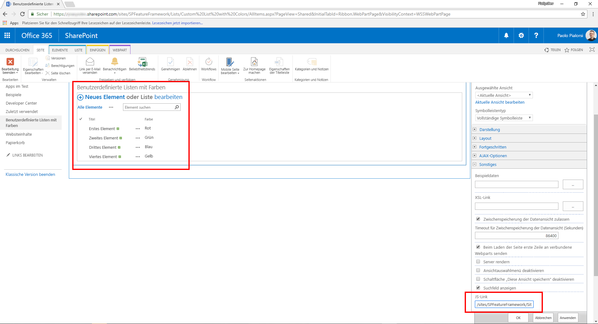
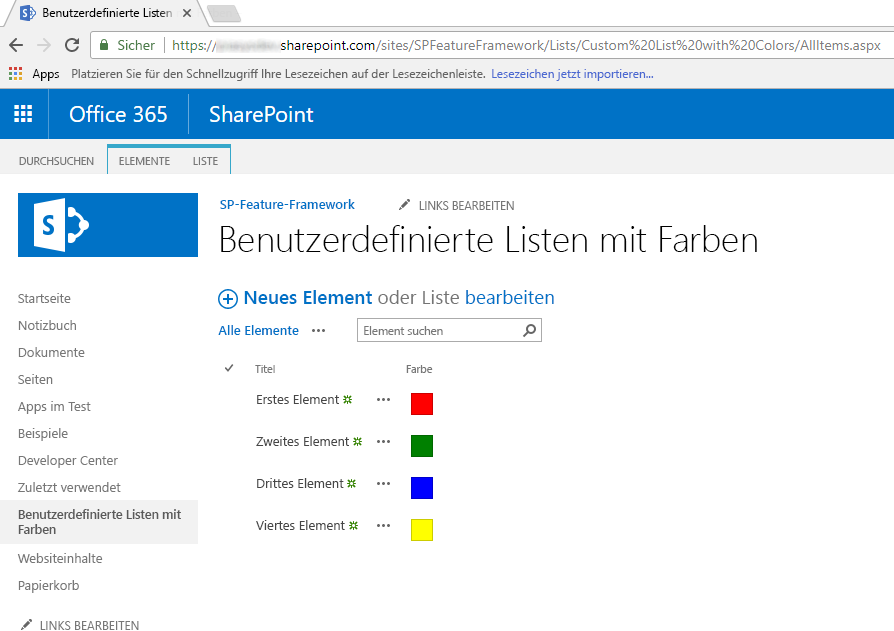
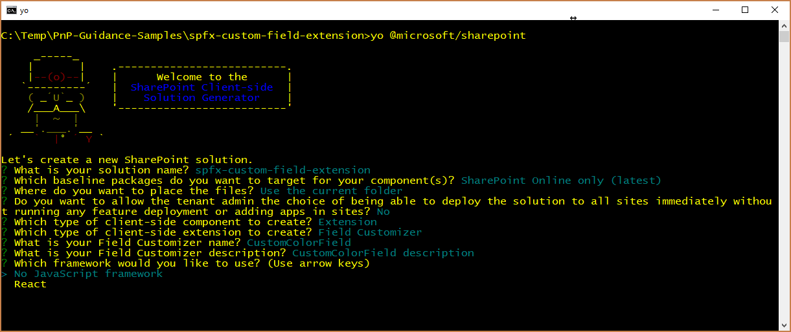
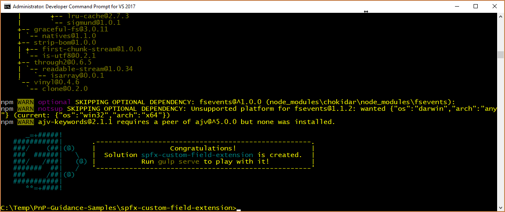
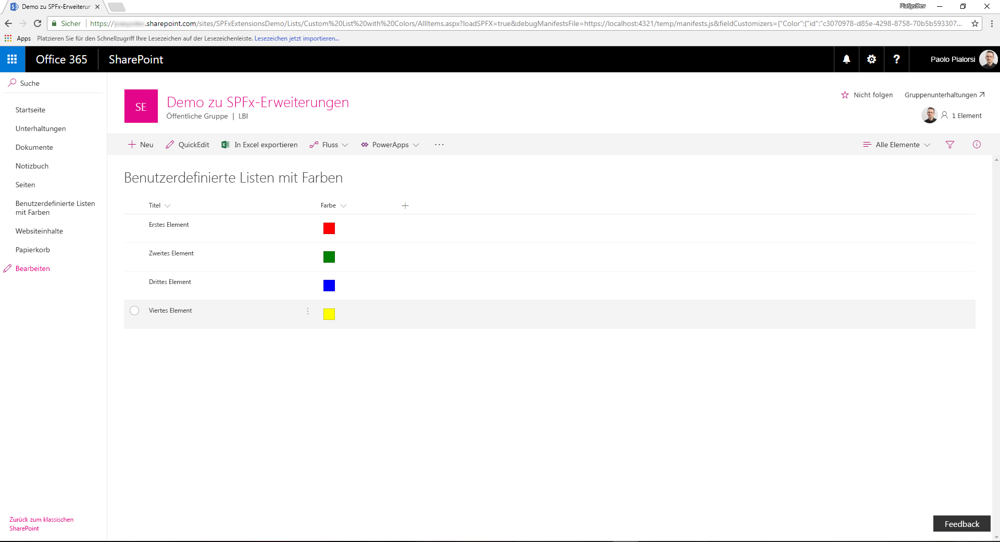
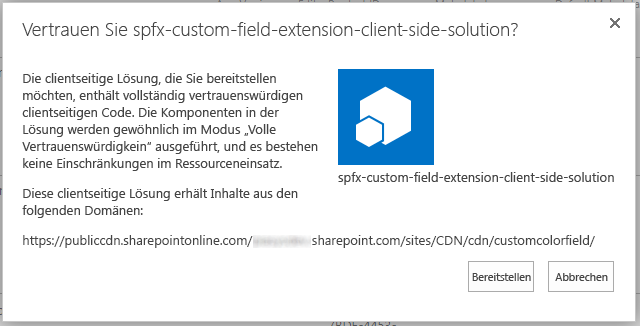
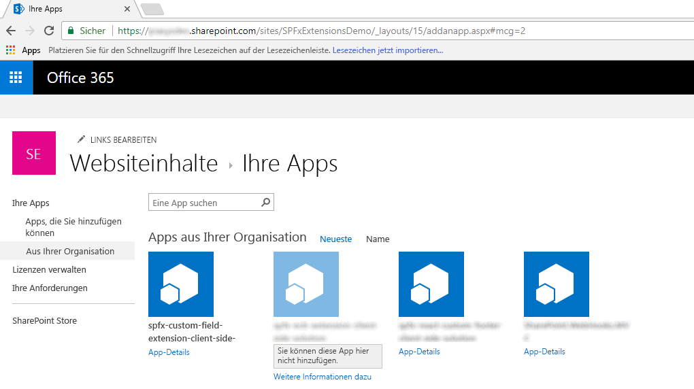
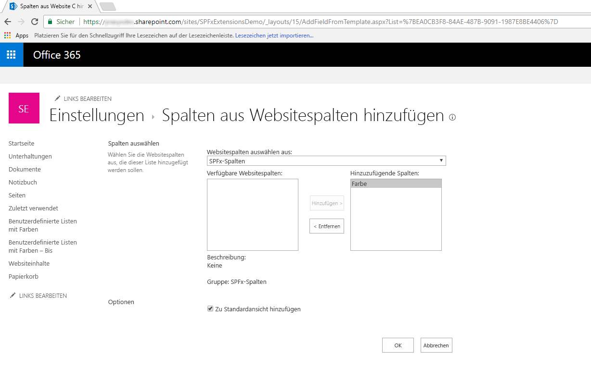
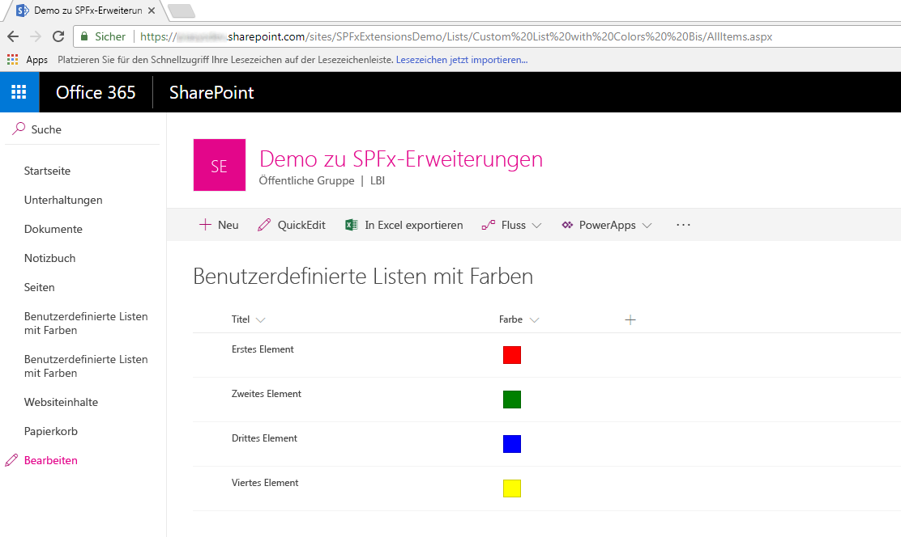

# <a name="migrating-from-jslink-to-sharepoint-framework-extensions"></a>Migrieren von JSLink zu SharePoint-Framework-Erweiterungen

Seit Microsoft SharePoint 2013 nutzen die meisten Unternehmenslösungen, die auf Office 365 und SharePoint Online aufbauen, die `JSLink`-Eigenschaft von Feldern und Listenansichten, um das Rendern von Feldern anzupassen. Innerhalb der modernen Benutzeroberfläche von SharePoint Online stehen die meisten dieser Anpassungen jedoch nicht mehr zur Verfügung. Mit den neuen SharePoint-Framework-Erweiterungen können Sie fast die gleichen Funktionen auf der modernen Benutzeroberfläche bereitstellen. 

In diesem Lernprogramm erfahren Sie, wie Sie die alten, klassischen Anpassungen zu dem neuen Modell basierend auf SharePoint-Framework-Erweiterungen migrieren können.

> [!NOTE]
> Weitere Informationen zum Erstellen von SharePoint-Framework-Erweiterungen  finden Sie unter [Übersicht über SharePoint-Framework-Erweiterungen](../overview-extensions.md).

Bei der Entwicklung von SharePoint-Framework-Erweiterungen sind folgende Optionen verfügbar:

* **Application Customizer**. Erweiterung der nativen modernen Benutzeroberfläche von SharePoint Online, indem benutzerdefinierte Elemente und clientseitiger Code den vordefinierten Platzhaltern der modernen Seiten hinzugefügt werden. Zu der Zeit, zu der dieser Artikel verfasst wurde, waren die verfügbaren Platzhalter die Kopf- und Fußzeile jeder modernen Seite.
* **Command Set**. Hinzufügen benutzerdefinierter ECB-Menüelemente oder benutzerdefinierter Schaltflächen zur Befehlsleiste einer Listenansicht für eine Liste oder Bibliothek. Sie können diesen Befehlen eine JavaScript (TypeScript)-Aktion zuordnen.
* **Field Customizer**. Anpassung der Darstellung eines Felds in einer Listenansicht mit benutzerdefinierten HTML-Elementen und clientseitigem Code.

Die nützlichste Option in diesem Kontext ist die Erweiterung „Field Customizer“.

Nehmen Sie an, dass Sie sich in SharePoint Online befinden und Sie über eine benutzerdefinierte Liste mit einem angepassten Feld mit der Bezeichnung „Color“ verfügen, das den Typ **Choice** hat und die folgenden Werte übernehmen kann: _Red_, _Green_, _Blue_, _Yellow_. Nehmen Sie an, dass Sie einen benutzerdefinierten Wert für die `JSLink`-Eigenschaft des Webparts haben, das die Listenansicht der benutzerdefinierten Liste rendert. 

Im folgenden Codeausschnitt sehen Sie den JavaScript-Code, der von der `JSLink`-Eigenschaft (**customColorRendering.js**) referenziert wird.

```JavaScript
// Define a namespace for the custom rendering code
var customJSLinkRendering = customJSLinkRendering || {}; 

// Define a function that declare the custom rendering rules for the target list view
customJSLinkRendering.CustomizeFieldRendering = function () {  

    // Define a custom object to configure the rendering template overrides
    var customRenderingOverride = {};
    customRenderingOverride.Templates = {};
    customRenderingOverride.Templates.Fields = 
    { 
        // Declare the custom rendering function for the 'View' of field 'Color'
        'Color': 
        { 
            'View': customJSLinkRendering.RenderColorField 
        } 
    }; 

    // Register the custom rendering template
    SPClientTemplates.TemplateManager.RegisterTemplateOverrides(customRenderingOverride); 
}; 

// Declare the custom rendering function for the 'View' of field 'Color'
customJSLinkRendering.RenderColorField = function (context)  
{ 
    var colorField = context.CurrentItem.Color; 

    // Declare a local variable to hold the output color
    var color = '';

    // Evaluate the values of the 'Color' field and render it accordingly
    switch (colorField)
    {
        case 'Red':
            color = 'red';
            break;
        case 'Green':
            color = 'green';
            break;
        case 'Blue':
            color = 'blue';
            break;
        case 'Yellow':
            color = 'yellow';
            break;
        default:
            color = 'white';
            break;
    }

    // Render the output for the 'Color' field
    return "<div style='float: left; width: 20px; height: 20px; margin: 5px; border: 1px solid rgba(0,0,0,.2);background:" + color + "' />"; 
}; 

// Invoke the custom rendering function
customJSLinkRendering.CustomizeFieldRendering();
```

<br/>

Im folgenden Screenshot sehen Sie darüber hinaus, wie die `JSLink`-Eigenschaft im Listenansicht-Webpart konfiguriert ist.



<br/>

Wenn Sie die JavaScript-Datei in die Bibliothek **Site Assets** hochgeladen haben, kann der Wert für die `JSLink`-Eigenschaft `"~site/SiteAssets/customColorRendering.js"` lauten.

Aus Gründen der Vollständigkeit sehen Sie, wie das benutzerdefinierte Rendern der Liste funktioniert.



Wie Sie sehen können, rendern die Felder „Color“ auf der Elementebene ein farbiges Feld mit der ausgewählten Farbe.

> [!NOTE]
> Um diese Art von Lösung für eine „klassische“ Website bereitstellen zu können, können Sie letztendlich eine PnP-Bereitstellungsvorlage verwenden, die sowohl die Liste mit dem benutzerdefinierten Feld als auch gleichzeitig die `JSLink`-Eigenschaft bereitstellen kann.

Zum Migrieren der vorherigen Lösung zum SharePoint-Framework führen Sie die folgenden Schritte aus.

> [!NOTE]
> Bevor Sie die Schritte in diesem Artikel durchführen, müssen Sie [Ihre Entwicklungsumgebung einrichten](../../set-up-your-development-environment.md).

## <a name="create-a-new-sharepoint-framework-solution"></a>Erstellen einer neuen SharePoint-Framework-Lösung

1. Öffnen Sie das Befehlszeilentool Ihrer Wahl (z. B. PowerShell, CMD.EXE, Cmder). Erstellen Sie einen neuen Ordner für die Lösung namens **spfx-custom-field-extension**, und erstellen Sie eine neue SharePoint-Framework-Lösung, indem Sie den Yeoman-Generator mit dem folgenden Befehl ausführen:

    ```
    yo @microsoft/sharepoint
    ```

2. Geben Sie bei Aufforderung durch das Tool Folgendes an:
    
    * Bestätigen Sie den Standardnamen **spfx-custom-field-extension** für Ihre Lösung, und drücken Sie die EINGABETASTE.
    * Wählen Sie **SharePoint Online only (latest)**, und drücken Sie die EINGABETASTE.
    * Wählen Sie **Use the current folder** aus, und drücken Sie die EINGABETASTE.
    * Wählen Sie **N**, damit die Erweiterung auf jeder Website explizit installiert werden muss, wenn sie verwendet wird.
    * Wählen Sie **Extension** als den zu erstellenden Typ von clientseitiger Komponente aus.
    * Wählen Sie **Field Customizer** als den zu erstellenden Erweiterungstyp aus.
    * Geben Sie **CustomColorField** als Namen für den Field Customizer an.
    * Wählen Sie aus, dass kein bestimmtes JavaScript-Framework verwendet werden soll, indem Sie die Option **Kein JavaScript-Framework** aktivieren.

    

    An diesem Punkt installiert Yeoman die erforderlichen Abhängigkeiten und erstellt ein Gerüst für die Lösungsdateien und Ordner sowie die **CustomColorField**-Erweiterung. Das kann einige Minuten dauern.

    Nach Abschluss der Gerüsterstellung sollte folgende Erfolgsmeldung angezeigt werden:

    

3. Führen Sie den folgenden Befehl aus, um die Version der Projektabhängigkeiten zu sperren:

    ```
    npm shrinkwrap
    ```

4. Starten Sie Visual Studio Code (oder den Code-Editor Ihrer Wahl), und beginnen Sie, die Lösung zu entwickeln. Zum Starten von Visual Studio Code können Sie die folgende Anweisung ausführen.

    ```
    code .
    ```

## <a name="define-the-new-field-customizer-with-javascript"></a>Definieren des neuen Field Customizer mit JavaScript

Um das gleiche Verhalten beim Rendern des benutzerdefinierten `JSLink`-Felds zu reproduzieren, müssen Sie die gleiche Logik mit clientseitigem Code innerhalb der neuen SharePoint-Framework-Lösung implementieren. Gehen Sie hierzu wie folgt vor:

1. Öffnen Sie die Datei **CustomColorFieldFieldCustomizer.manifest.json** im Ordner **src/extensions/customColorField**. Kopieren Sie den Wert der Eigenschaft `id`, und bewahren Sie ihn an einem sicheren Ort auf, da Sie ihn später benötigen.

2. Öffnen Sie die Datei **CustomColorFieldFieldCustomizer.ts** im Ordner **src/extensions/customColorField**, und bearbeiten Sie den Inhalt entsprechend dem folgenden Codeausschnitt:

    ``` TypeScript
    import { Log } from '@microsoft/sp-core-library';
    import { override } from '@microsoft/decorators';
    import {
    BaseFieldCustomizer,
    IFieldCustomizerCellEventParameters
    } from '@microsoft/sp-listview-extensibility';

    import * as strings from 'CustomColorFieldFieldCustomizerStrings';
    import styles from './CustomColorFieldFieldCustomizer.module.scss';

    /**
    * If your field customizer uses the ClientSideComponentProperties JSON input,
    * it will be deserialized into the BaseExtension.properties object.
    * You can define an interface to describe it.
    */
    export interface ICustomColorFieldFieldCustomizerProperties {
    // This is an example; replace with your own property
    sampleText?: string;
    }

    const LOG_SOURCE: string = 'CustomColorFieldFieldCustomizer';

    export default class CustomColorFieldFieldCustomizer
    extends BaseFieldCustomizer<ICustomColorFieldFieldCustomizerProperties> {

    @override
    public onInit(): Promise<void> {
        // Add your custom initialization to this method.  The framework will wait
        // for the returned promise to resolve before firing any BaseFieldCustomizer events.
        Log.info(LOG_SOURCE, 'Activated CustomColorFieldFieldCustomizer with properties:');
        Log.info(LOG_SOURCE, JSON.stringify(this.properties, undefined, 2));
        Log.info(LOG_SOURCE, `The following string should be equal: "CustomColorFieldFieldCustomizer" and "${strings.Title}"`);
        return Promise.resolve();
    }

    @override
    public onRenderCell(event: IFieldCustomizerCellEventParameters): void {

        var colorField = event.fieldValue; 
        
        // Declare a local variable to hold the output color
        var color = '';

        // Evaluate the values of the 'Color' field and render it accordingly
        switch (colorField)
        {
            case 'Red':
                color = 'red';
                break;
            case 'Green':
                color = 'green';
                break;
            case 'Blue':
                color = 'blue';
                break;
            case 'Yellow':
                color = 'yellow';
                break;
            default:
                color = 'white';
                break;
        }
        
        // Render the output for the 'Color' field
        event.domElement.innerHTML = "<div style='float: left; width: 20px; height: 20px; margin: 5px; border: 1px solid rgba(0,0,0,.2);background:" + color + "' />"; 
    }

    @override
    public onDisposeCell(event: IFieldCustomizerCellEventParameters): void {
        // This method should be used to free any resources that were allocated during rendering.
        // For example, if your onRenderCell() called ReactDOM.render(), then you should
        // call ReactDOM.unmountComponentAtNode() here.
        super.onDisposeCell(event);
    }
    }
    ```

    Wie Sie sehen können, ist der Inhalt der Methode `onRenderCell` fast identisch mit der vorherigen `RenderColorField`-Methode in der `JSLink`-Implementierung. Die einzigen Unterschiede sind:

    - Um den aktuellen Feldwert abzurufen, müssen Sie die `event.fieldValue`-Eigenschaft des Eingabearguments der `onRenderCell`-Methode lesen.
    - Um den benutzerdefinierten HTML-Code zum Rendern des Felds zurückzugeben, müssen Sie der `innerHTML`-Eigenschaft des `event.domElement`-Objekts einen Wert zuweisen, der den Ausgabe-HTML-Container des Feldrenderings darstellt.

    Abgesehen von diesen geringfügigen Änderungen können Sie fast den gesamten JavaScript-Code wie zuvor verwenden.

    In der folgenden Abbildung ist die resultierende Ausgabe enthalten.

    

## <a name="test-the-solution-in-debug-mode"></a>Testen der Lösung im Debugmodus

1. Kehren Sie zum Konsolenfenster zurück, und führen Sie den folgenden Befehl aus, um die Lösung zu erstellen und den lokalen Node.js-Server zum Hosten der Lösung auszuführen.

    ```
    gulp serve --nobrowser
    ```

2. Öffnen Sie Ihren bevorzugten Browser, und wechseln Sie zu einer „modernen“ Liste, die über ein benutzerdefiniertes Feld mit dem Namen **Color** verfügt, und geben Sie **Choice** mit den gleichen Werten wie zuvor ein (Red, Green, Blue, Yellow). Sie können letztendlich die Liste verwenden, die Sie in der „klassischen“ Website erstellt haben, und sie einfach in der „modernen“ Benutzerumgebung anzeigen. Hängen Sie nun die folgenden Abfragezeichenfolgeparameter an die **AllItems.aspx**-Seiten-URL an.

    ```
    ?loadSPFX=true&debugManifestsFile=https://localhost:4321/temp/manifests.js&fieldCustomizers={"Color":{"id":"c3070978-d85e-4298-8758-70b5b5933076"}}
    ```

    In dieser Abfragezeichenfolge müssen Sie die GUID durch den `id`-Wert aus der Datei **CustomColorFieldFieldCustomizer.manifest.json** ersetzen, den Sie zuvor gespeichert oder notiert haben. Der **Color**-Objektname bezieht sich auf das anzupassende Feld. Wenn Sie möchten, können Sie auch ein benutzerdefiniertes Konfigurationsobjekt, das im JSON-Format serialisiert ist, als einen zusätzlichen Parameter für die Field Customizer-Konstruktion bereitstellen.

    Beachten Sie, dass beim Ausführen der Seitenanforderung ein Warnmeldungsfeld „Debugskripts zulassen?“ angezeigt wird, in dem Sie aus Sicherheitsgründen nach der Zustimmung für die Ausführung des Codes von Localhost gefragt werden. Wenn Sie die Lösung lokal debuggen und testen möchten, müssen Sie das Laden von Debugskripts zulassen.

## <a name="define-the-new-field-customizer-with-typescript"></a>Definieren des neuen Field Customizer mit TypeScript

Sie können nun den JavaScript-Code durch TypeScript ersetzen, um den vollständig typisierten Ansatz von TypeScript nutzen zu können.

1. Öffnen Sie die Datei **CustomColorFieldFieldCustomizer.module.scss** im Ordner **src/extensions/customColorField**. Diese Datei, eine Sass CSS, stellt die Formatvorlage der Benutzeroberfläche für den Field Customizer dar. Ersetzen Sie den Inhalt der SCSS-Datei durch den folgenden.

    ``` SCSS
    .CustomColorField {
    .cell {
        float: left;
        width: 20px; 
        height: 20px; 
        margin: 5px; 
        border: 1px solid rgba(0,0,0,.2);
    }

    .cellRed {
        background: red;
    }

    .cellGreen {
        background: green;
    }

    .cellBlue {
        background: blue;
    }

    .cellYellow {
        background: yellow;
    }

    .cellWhite {
        background: white;
    }
    }
    ```

2. Ersetzen Sie die Implementierung der `onRenderCell`-Methode durch den folgenden Codeauszug.

    ``` TypeScript
    @override
    public onRenderCell(event: IFieldCustomizerCellEventParameters): void {

    // Read the current field value
    let colorField: String = event.fieldValue; 

    // Add the main style to the field container element
    event.domElement.classList.add(styles.CustomColorField);

    // Get a reference to the output HTML
    let fieldHtml: HTMLDivElement = event.domElement.firstChild as HTMLDivElement;

    // Add the standard style
    fieldHtml.classList.add(styles.cell);

    // Add the colored style
    switch(colorField)
    {
        case "Red":
        fieldHtml.classList.add(styles.cellRed);
        break;
        case "Green":
        fieldHtml.classList.add(styles.cellGreen);
        break;
        case "Blue":
        fieldHtml.classList.add(styles.cellBlue);
        break;
        case "Yellow":
        fieldHtml.classList.add(styles.cellYellow);
        break;
        default:
        fieldHtml.classList.add(styles.cellWhite);
        break;
    }
    }
    ```

    Beachten Sie, dass die neue Methodenimplementierung einen vollständig typisierten Ansatz verwendet und die CSS-Klasse `cell` dem untergeordneten `DIV`-Element des aktuellen Feldelements zusammen mit einer anderen CSS-Klasse zuweist, um die Zielfarbe von `DIV` basierend auf dem derzeit ausgewählten Feldwert zu definieren.

3. Führen Sie den Field Customizer noch einmal im Debugmodus aus, und sehen Sie sich die Ergebnisse an.

## <a name="package-and-host-the-solution"></a>Packen und Hosten der Lösung

Wenn Sie mit dem Ergebnis zufrieden sind, können Sie die Lösung nun packen und in der eigentlichen Hostinginfrastruktur hosten.
Bevor Sie das Bundle und das Paket erstellen, müssen Sie eine XML-Feature-Framework-Datei deklarieren, um die Erweiterung bereitzustellen.

### <a name="review-feature-framework-elements"></a>Überprüfen von Feature-Framework-Elementen

1. Öffnen Sie im Code-Editor den Unterordner **/sharepoint/assets** der Lösung, und bearbeiten Sie die Datei **elements.xml**. Der folgende Codeauszug gibt an, wie die Datei aussehen sollte.

    ```XML
    <?xml version="1.0" encoding="utf-8"?>
    <Elements xmlns="http://schemas.microsoft.com/sharepoint/">
        <Field ID="{40475661-efaf-447a-a220-c992b20ec1c3}"
                Name="SPFxColor"
                DisplayName="Color"
                Title="Color"
                Type="Choice"
                Required="FALSE"
                Group="SPFx Columns"
                ClientSideComponentId="c3070978-d85e-4298-8758-70b5b5933076">
        </Field>
    </Elements>
    ```

    Wie Sie sehen, ähnelt sie der SharePoint-Feature-Framework-Datei. Sie definiert jedoch ein benutzerdefiniertes `Field`-Element mit dem Feldtyp `Choice`, der das `ClientSideComponentId`-Attribut zum Verweisen auf die `id` des Field Customizer verwendet. Es könnte auch ein `ClientSideComponentProperties`-Attribut vorhanden sein, um die für die Erweiterung erforderlichen benutzerdefinierten Konfigurationseigenschaften zu konfigurieren.

2. Öffnen Sie die Datei **package-solution.json** im Lösungsordner **/config**. In der Datei können Sie sehen, dass ein Verweis auf die Datei **elements.xml** im Abschnitt `assets` vorhanden ist.

    ```JSON
    {
    "$schema": "https://dev.office.com/json-schemas/spfx-build/package-solution.schema.json",
    "solution": {
        "name": "spfx-custom-field-extension-client-side-solution",
        "id": "ab0fbbf8-01ba-4633-8498-46cfd5652619",
        "version": "1.0.0.0",
        "features": [
        {
            "title": "Application Extension - Deployment of custom action.",
            "description": "Deploys a custom action with ClientSideComponentId association",
            "id": "090dc976-878d-44fe-8f8e-ac603d094aa1",
            "version": "1.0.0.0",
            "assets": {
            "elementManifests": [
                "elements.xml"
            ]
            }
        }
        ]
    },
    "paths": {
        "zippedPackage": "solution/spfx-custom-field-extension.sppkg"
    }
    }
    ```

### <a name="enable-the-cdn-in-your-office-365-tenant"></a>Aktivieren des CDN im Office 365-Mandanten

Sie müssen die Erweiterung nun in einer Hostingumgebung hosten. Office 365 CDN ist die einfachste Möglichkeit, SharePoint-Framework-Lösungen direkt von Ihrem Mandanten aus zu hosten und dabei weiterhin die Vorteile des CDN (Content Delivery Network) zum schnelleren Laden der Objekte zu nutzen.

1. Laden Sie die [SharePoint Online-Verwaltungsshell](https://www.microsoft.com/en-us/download/details.aspx?id=35588) herunter, um sicherzustellen, dass Sie die neueste Version verwenden.

2. Verbinden Sie sich über PowerShell mit Ihrem SharePoint Online-Mandanten:
    
    ```powershell
    Connect-SPOService -Url https://[tenant]-admin.sharepoint.com
    ```
    
3. Führen Sie nacheinander die folgenden Befehle aus, um den aktuellen Status der auf Mandantenebene festgelegten Einstellungen für öffentliche CDNs abzurufen: 
    
    ```powershell
    Get-SPOTenantCdnEnabled -CdnType Public
    Get-SPOTenantCdnOrigins -CdnType Public
    Get-SPOTenantCdnPolicies -CdnType Public
    ```
    
4. Aktivieren Sie öffentliche CDNs im Mandanten:
    
    ```powershell
    Set-SPOTenantCdnEnabled -CdnType Public
    ```
    
    Jetzt sind öffentliche CDNs im Mandanten aktiviert, mit der Standardkonfiguration für zulässige Dateitypen. Dies bedeutet, dass die folgenden Dateitypen unterstützt werden: CSS, EOT, GIF, ICO, JPEG, JPG, JS, MAP, PNG, SVG, TTF und WOFF.

5. Öffnen Sie einen Browser, und navigieren Sie zu der Websitesammlung, in der Sie Ihre CDN-Bibliothek hosten möchten. Das kann jede beliebige Websitesammlung in Ihrem Mandanten sein. In diesem Tutorial erstellen Sie eine spezifische Bibliothek, die als Ihre CDN-Bibliothek fungiert. Sie können aber auch einen spezifischen Ordner in einer beliebigen bereits vorhandenen Dokumentbibliothek als CDN-Endpunkt nutzen.

6. Erstellen Sie in Ihrer Websitesammlung eine neue Dokumentbibliothek namens **CDN**, und fügen Sie ihr einen Ordner namens **customcolorfield** hinzu.
    
7. Fügen Sie in der PowerShell-Konsole einen neuen CDN-Ursprung hinzu. In diesem Fall legen Sie als Ursprung `*/cdn` fest; auf diese Weise fungieren alle relativen Ordner mit dem Namen **cdn** als ein CDN-Ursprung.
    
    ```powershell
    Add-SPOTenantCdnOrigin -CdnType Public -OriginUrl */cdn
    ```
    
8. Führen Sie den folgenden Befehl aus, um eine Liste aller CDN-Ursprünge von Ihrem Mandanten abzurufen:
    
    ```powershell
    Get-SPOTenantCdnOrigins -CdnType Public
    ```
    
    Sie sehen, dass der neu hinzugefügte Ursprung als gültiger CDN-Ursprung aufgeführt ist. Die endgültige Konfiguration des Ursprungs dauert ca. 15 Minuten. Während Sie warten, können Sie mit dem Bereitstellen der Erweiterung fortfahren, die anschließend im Ursprung gehostet wird. 

    

    Sobald der Ursprung nicht mehr mit `(configuration pending)` gekennzeichnet ist, kann er in Ihrem Mandanten verwendet werden. Dieser Text weist auf laufende Konfigurationsaktivitäten zwischen SharePoint Online und dem CDN-System hin. 

### <a name="update-the-solution-settings-and-publish-it-on-the-cdn"></a>Aktualisieren der Lösungseinstellungen und Veröffentlichen im CDN

Als Nächstes müssen Sie die Lösung aktualisieren, um das gerade erstellte CDN als Hostingumgebung zu verwenden. Sie müssen das Lösungsbundle im CDN veröffentlichen. Um diese Aufgabe auszuführen, gehen Sie folgendermaßen vor.

1. Kehren Sie zu der zuvor erstellten Lösung zurück, um die erforderlichen URL-Updates auszuführen.
    
2. Aktualisieren Sie die Datei **write-manifests.json** (im Ordner **config**) wie unten dargestellt, damit sie auf Ihren CDN-Endpunkt verweist. Verwenden Sie `publiccdn.sharepointonline.com` als Präfix, und erweitern Sie dann die URL um den tatsächlichen Pfad Ihres Mandanten. Die CDN-URL hat folgendes Format:
    
    ```
    https://publiccdn.sharepointonline.com/[tenant host name]/sites/[site]/[library]/[folder]
    ```
    
    

3. Speichern Sie Ihre Änderungen.

4. Führen Sie die folgende Aufgabe aus, um Ihre Lösung in einem Bundle zu verpacken. Es wird ein Releasebuild Ihres Projekts ausgeführt, unter Verwendung der in der Datei **write-manifests.json** angegebenen CDN-URL. Die Ausgabe dieses Befehls finden Sie im Ordner **./temp/deploy**. Dies sind die Dateien, die Sie in den SharePoint-Ordner hochladen müssen, der als CDN-Endpunkt fungiert. 
    
    ```
    gulp bundle --ship
    ```
    
5. Führen Sie die folgende Aufgaben aus, um Ihre Lösung zu packen. Dieser Befehl erstellt ein Paket namens **spfx-custom-field-extension.sppkg** im Ordner **sharepoint/solution** und bereitet außerdem die Ressourcen im Ordner **temp/deploy** für die Bereitstellung im CDN vor.
    
    ```
    gulp package-solution --ship
    ```
    
6. Laden Sie das neu erstellte Paket mit ihrer clientseitigen Lösung in den App-Katalog in Ihrem Mandanten hoch. Alternativ können Sie es auch per Drag-and-Drop verschieben. Klicken Sie auf die Schaltfläche **Bereitstellen**.

    

7. Laden Sie die Dateien im Ordner **temp/deploy** in den Ordner **CDN/customcolorfield** hoch, den Sie zuvor erstellt haben. Sie können die Dateien auch mit Drag-and-Drop verschieben.

## <a name="install-and-run-the-solution"></a>Installieren und Ausführen der Lösung

1. Öffnen Sie den Browser, und navigieren Sie zu der gewünschten modernen Zielwebsite.

2. Navigieren Sie zur Seite **Websiteinhalte**, und wählen Sie **App**, um eine neue App hinzuzufügen.

3. Wählen Sie zum Installieren einer neuen App **Von Ihrer Organisation** aus, um die im App-Katalog verfügbaren Lösungen zu durchsuchen.

4. Wählen Sie die Lösung mit dem Namen **spfx-custom-field-extension-client-side-solution**, und installieren Sie sie auf der Zielwebsite.

    

5. Nachdem die Anwendung installiert wurde, erstellen Sie eine neue benutzerdefinierte Liste, bearbeiten Sie die Listeneinstellungen, und fügen Sie eine neue Spalte aus den bereits vorhandenen Websitespalten hinzu. Wählen Sie die Spaltengruppe **SPFx Columns**, und fügen Sie das Feld **Color** hinzu.

    

6. Bearbeiten Sie das gerade hinzugefügte Feld, und konfigurieren Sie einige Farbwerte (z. B. Red, Green, Blue, Yellow). Speichern Sie die Feldeinstellungen anschließend.

7. Fügen Sie der Liste einige Elemente hinzu, und sehen Sie sich die Ausgabe in der Listenansicht an. Sie sollte in etwa wie im folgenden Screenshot aussehen.

    

Sie können nun den Field Customizer nutzen, den Sie mit den SharePoint-Framework-Erweiterungen erstellt haben.

## <a name="see-also"></a>Siehe auch

- [Übersicht über SharePoint-Framework-Erweiterungen](../overview-extensions.md)
