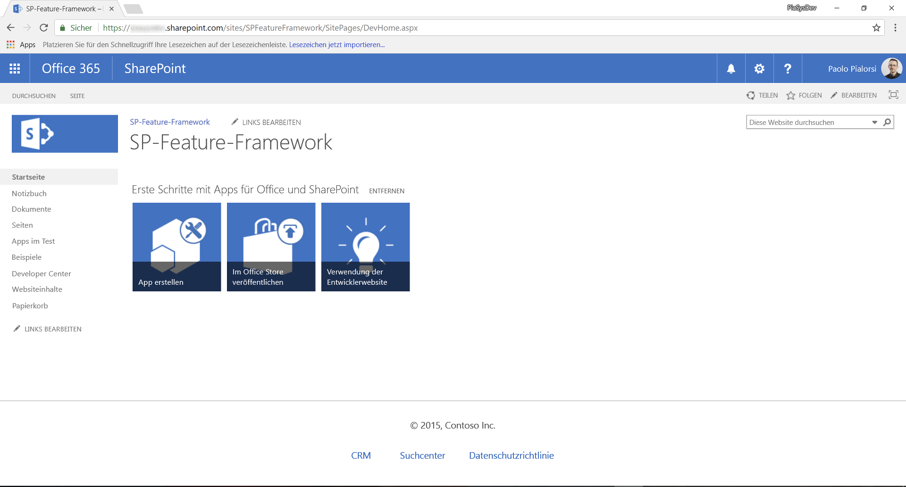
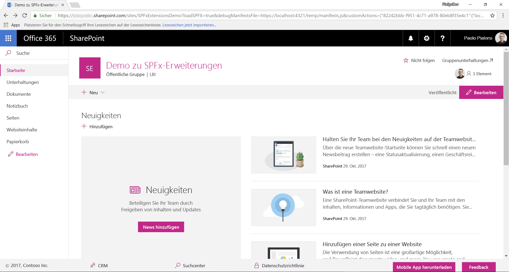
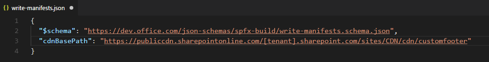
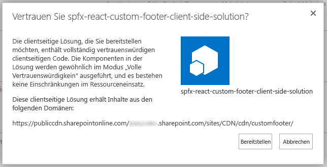
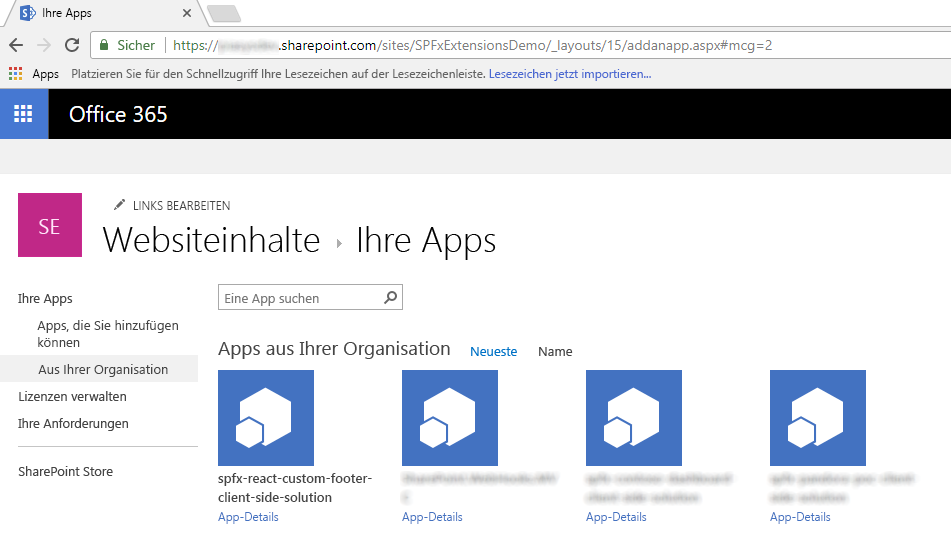

# <a name="migrating-from-usercustomaction-to-sharepoint-framework-extensions"></a>Migrieren von UserCustomAction zu SharePoint-Framework-Erweiterungen

In den letzten Jahren profitierten die meisten auf Office 365 und SharePoint Online aufbauenden Enterprise-Lösungen von den _CustomAction_-Funktionen von SharePoint-Feature-Framework zur Erweiterung der Benutzeroberfläche von Seiten. Heutzutage stehen innerhalb der modernen Benutzeroberfläche von SharePoint Online die meisten dieser Anpassungen jedoch nicht mehr zur Verfügung. Mit den neuen SharePoint-Framework-Erweiterungen können Sie fast die gleichen Funktionen auf der modernen Benutzeroberfläche bereitstellen. In diesem Lernprogramm erfahren Sie, wie Sie die alten, klassischen Anpassungen zu dem neuen Modell basierend auf SharePoint-Framework-Erweiterungen migrieren können.

> [!IMPORTANT]
> Das bedeutet nicht das Ende der Unterstützung für die klassische Benutzeroberfläche, es stehen weiterhin sowohl die klassische als auch die moderne Oberfläche zur Verfügung.

_**Gilt für: **SharePoint Online_

## <a name="understanding-sharepoint-framework-extensions"></a>Grundlegendes zu SharePoint-Framework-Erweiterungen
<a name="spfxExtensions"> </a> Bei der Entwicklung von SharePoint-Framework-Erweiterungen sind folgende Optionen verfügbar:

* **Application Customizer**: Erweiterung der nativen modernen Benutzeroberfläche von SharePoint Online, indem benutzerdefinierte Elemente und clientseitiger Code den vordefinierten Platzhaltern der modernen Seiten hinzugefügt werden. Zu der Zeit, zu der dieser Artikel verfasst wurde, waren die verfügbaren Platzhalter die Kopf- und Fußzeile jeder modernen Seite.
* **Command Set**: Benutzerdefinierte ECB-Menüelemente oder benutzerdefinierte Schaltflächen können der Befehlsleiste einer Listenansicht für eine Liste oder Bibliothek hinzugefügt werden. Sie können diesen Befehlen eine JavaScript (TypeScript)-Aktion zuordnen.
* **Field Customizer**: Anpassung der Darstellung eines Felds in einer Listenansicht mit benutzerdefinierten HTML-Elementen und clientseitigem Code.

Wie bereits aus der obigen Beschreibung hervorgeht, ist die „Application Customizer“-Erweiterung die nützlichste in diesem Kontext.

> [!NOTE]
> Weitere Informationen zum Erstellen von SharePoint-Framework-Erweiterungen finden Sie im Artikel [Übersicht über SharePoint-Framework-Erweiterungen](https://docs.microsoft.com/de-DE/sharepoint/dev/spfx/extensions/overview-extensions).

## <a name="migrating-a-usercustomaction-to-an-spfx-application-customizer"></a>Migrieren einer UserCustomAction zu einem SPFx Application Customizer
<a name="FromUserCustomActionToApplicationCustomizer"> </a> Angenommen Sie verfügen über eine _CustomAction_ in SharePoint Online, damit alle Websiteseiten eine benutzerdefinierte Fußzeile enthalten.
Im folgenden Codeausschnitt ist der XML-Code enthalten, der _CustomAction_ mit dem SharePoint-Feature-Framework definiert.

```XML
<?xml version="1.0" encoding="utf-8"?>
<Elements xmlns="http://schemas.microsoft.com/sharepoint/">
  <CustomAction Id="jQueryCDN"
                Title="jQueryCDN"
                Description="Loads jQuery from the public CDN"
                ScriptSrc="https://code.jquery.com/jquery-3.2.1.slim.min.js"
                Location="ScriptLink"
                Sequence="100" />
  <CustomAction Id="spoCustomBar"
                Title="spoCustomBar"
                Description="Loads a script to rendere a custom footer"
                Location="ScriptLink"
                ScriptSrc="SiteAssets/SPOCustomUI.js"
                Sequence="200" />
</Elements>
```

Wie Sie sehen können, definiert die Datei mit den Feature-Elementen einige Elemente vom Typ _CustomAction_, die in den Seiten der Zielwebsite enthalten sind. Diese umfassen die über das öffentliche CDN geladene jQuery und eine benutzerdefinierte JavaScript-Datei, die die benutzerdefinierte Fußzeile rendert.

Darüber hinaus finden Sie der Vollständigkeit halber im Folgenden den JavaScript-Code, der eine benutzerdefinierte Fußzeile rendert, deren Menüelemente der Einfachheit halber im Code vordefiniert sind.

```JavaScript
var SPOCustomUI = SPOCustomUI || {};

SPOCustomUI.setUpCustomFooter = function () {
    if ($("#SPOCustomFooter").length)
        return;

    var footerContainer = $("<div>");
    footerContainer.attr("id", "SPOCustomFooter");

    footerContainer.append("<ul>");

    $("#s4-workspace").append(footerContainer);
}

SPOCustomUI.addCustomFooterText = function (id, text) {
    if ($("#" + id).length)
        return;

    var customElement = $("<div>");
    customElement.attr("id", id);
    customElement.html(text);

    $("#SPOCustomFooter > ul").before(customElement);

    return customElement;
}

SPOCustomUI.addCustomFooterLink = function (id, text, url) {
    if ($("#" + id).length)
        return;

    var customElement = $("<a>");
    customElement.attr("id", id);
    customElement.attr("href", url);
    customElement.html(text);

    $("#SPOCustomFooter > ul").append($("<li>").append(customElement));

    return customElement;
}

SPOCustomUI.loadCSS = function (url) {
    var head = document.getElementsByTagName('head')[0];
    var style = document.createElement('link');
    style.type = 'text/css';
    style.rel = 'stylesheet';
    style.href = url;
    head.appendChild(style);
}

SPOCustomUI.init = function (whenReadyDoFunc) {
    // avoid executing inside iframes (used by Sharepoint for dialogs)
    if (self !== top) return;

    if (!window.jQuery) {
        // jQuery is needed for Custom Bar to run
        setTimeout(function () { SPOCustomUI.init(whenReadyDoFunc); }, 50);
    } else {
        $(function () {
            SPOCustomUI.setUpCustomFooter();
            whenReadyDoFunc();
        });
    }
}

// The following initializes the custom footer with some fake links
SPOCustomUI.init(function () {

    var currentScriptUrl;

    var currentScript = document.querySelectorAll("script[src*='SPOCustomUI']");
    if (currentScript.length > 0) {
        currentScriptUrl = currentScript[0].src;
    }
    if (currentScriptUrl != undefined) {
        var currentScriptBaseUrl = currentScriptUrl.substring(0, currentScriptUrl.lastIndexOf('/') + 1);
        SPOCustomUI.loadCSS(currentScriptBaseUrl + 'SPOCustomUI.css');
    }

    SPOCustomUI.addCustomFooterText('SPOFooterCopyright', '&copy; 2017, Contoso Inc.');
    SPOCustomUI.addCustomFooterLink('SPOFooterCRMLink', 'CRM', 'CRM.aspx');
    SPOCustomUI.addCustomFooterLink('SPOFooterSearchLink', 'Search Center', 'SearchCenter.aspx');
    SPOCustomUI.addCustomFooterLink('SPOFooterPrivacyLink', 'Privacy Policy', 'Privacy.aspx');
});
```

In der folgenden Abbildung ist die Ausgabe der vorherigen benutzerdefinierten Aktion auf der Startseite einer klassischen Website enthalten.



Um die obige Lösung zu der modernen Benutzeroberfläche zu migrieren, müssen Sie die folgenden Schritte ausführen.

### <a name="create-a-new-sharepoint-framework-solution"></a>Erstellen einer neuen SharePoint-Framework-Lösung
<a name="CreateApplicationCustomizer"> </a> Nachdem Sie die Entwicklungsumgebung für SharePoint-Framework-Lösungen entsprechend den Anweisungen im Dokument [Einrichten Ihrer SharePoint-Entwicklungsumgebung für clientseitige Webparts](https://docs.microsoft.com/de-DE/sharepoint/dev/spfx/set-up-your-development-environment) eingerichtet haben, können Sie mit dem Erstellen einer SharePoint-Framework-Erweiterung beginnen.

1. Öffnen Sie ein beliebiges Befehlszeilentool (PowerShell, CMD.EXE, Cmder usw.), erstellen Sie einen neuen Ordner für die Lösung (mit dem Namen _spfx-react-custom-footer_), und erstellen Sie eine neue SharePoint-Framework-Lösung, indem Sie den Yeoman-Generator mit dem folgenden Befehl ausführen:

```
yo @microsoft/sharepoint
```

Geben Sie bei Aufforderung durch das Tool Folgendes an:
* Bestätigen Sie den Standardnamen (_spfx-react-custom-footer_) für Ihre Lösung, und drücken Sie die EINGABETASTE.
* Wählen Sie „SharePoint Online only (latest)“, und drücken Sie die EINGABETASTE.
* Wählen Sie „Use the current folder“ aus, und drücken Sie die EINGABETASTE.
* Wählen Sie „N“, damit die Erweiterung auf jeder Website explizit installiert werden muss, wenn sie verwendet wird.
* Wählen Sie „Extension“ als den zu erstellenden Typ von clientseitiger Komponente aus.
* Wählen Sie „Application Customizer“ als den zu erstellenden Erweiterungstyp aus.
* Geben Sie „CustomFooter“ als Namen für den Application Customizer an.


An diesem Punkt installiert Yeoman die erforderlichen Abhängigkeiten und erstellt ein Gerüst für die Lösungsdateien und Ordner sowie die _CustomFooter_-Erweiterung. Das kann einige Minuten dauern.

Nach Abschluss der Gerüsterstellung sollte folgende Erfolgsmeldung angezeigt werden:


2. Führen Sie den folgenden Befehl aus, um die Version der Projektabhängigkeiten zu sperren:

```
npm shrinkwrap
```

3. Starten Sie jetzt Visual Studio Code (oder einen anderen Code-Editor), und beginnen Sie mit der Entwicklung der Lösung. Zum Starten von Visual Studio Code können Sie die folgende Anweisung ausführen.

```
code .
```

### <a name="define-the-new-ui-elements"></a>Definieren der neuen Benutzeroberflächenelemente
<a name="DefineApplicationCustomizerUI"> </a> Die Benutzeroberflächenelemente der benutzerdefinierte Fußzeile werden mit React und einer benutzerdefinierten React-Komponente gerendert. Sie können die Benutzeroberflächenelemente der Beispielfußzeile mit einer beliebigen Technologie erstellen. In diesem Lernprogramm verwenden wir React, um die Office UI Fabric-Komponenten für React zu verwenden.

> [!NOTE]
> Weitere Informationen zur Entwicklung von Lösungen mit React finden Sie im folgenden Lernprogramm: [Lernprogramm: Einführung in React](https://reactjs.org/tutorial/tutorial.html).

1. Öffnen Sie zunächst die Datei _CustomFooterApplicationCustomizer.manifest.json_ im Ordner _src/extensions/customFooter_. Kopieren Sie den Wert der _id_-Eigenschaft, und bewahren Sie ihn an einem sicheren Ort auf, da Sie ihn später benötigen.

2. Öffnen Sie die Datei _CustomFooterApplicationCustomizer.ts_ im selben Ordner, und importieren Sie die Typen _PlaceholderContent_ und _PlaceholderName_ aus dem Paket _„@microsoft/sp-application-base“_.
Fügen Sie darüber hinaus am Anfang der Datei die Importanweisungen für React hinzu.

Im folgenden Codeauszug ist der Abschnitt für die Importe der Datei _CustomFooterApplicationCustomizer.ts_ enthalten.

``` TypeScript
import * as React from 'react';
import * as ReactDom from 'react-dom';

import { override } from '@microsoft/decorators';
import { Log } from '@microsoft/sp-core-library';
import {
  BaseApplicationCustomizer,
  PlaceholderContent,
  PlaceholderName
} from '@microsoft/sp-application-base';
import { Dialog } from '@microsoft/sp-dialog';

import * as strings from 'CustomFooterApplicationCustomizerStrings';
import CustomFooter from './components/CustomFooter';
```

3. Suchen Sie nach der Definition der _CustomFooterApplicationCustomizer_-Klasse, und deklarieren Sie einen neuen privaten Member namens __bottomPlaceholder_ des Typs _PlaceholderContent | undefined_.
Rufen Sie nun innerhalb der Außerkraftsetzung der _onInit_-Methode eine benutzerdefinierte Funktion namens __renderPlaceHolders_ auf, und definieren Sie diese Funktion.

Der folgende Codeauszug enthält die Implementierung der benutzerdefinierten Fußzeilenklasse des Application Customizers.

``` TypeScript
/** A Custom Action which can be run during execution of a Client Side Application */
export default class CustomFooterApplicationCustomizer
  extends BaseApplicationCustomizer<ICustomFooterApplicationCustomizerProperties> {

  // This private member holds a reference to the page's footer
  private _bottomPlaceholder: PlaceholderContent | undefined;

  @override
  public onInit(): Promise<void> {
    Log.info(LOG_SOURCE, `Initialized ${strings.Title}`);

    let message: string = this.properties.testMessage;
    if (!message) {
      message = '(No properties were provided.)';
    }

    // Call render method for rendering the needed html elements
    this._renderPlaceHolders();

    return Promise.resolve();
  }

  private _renderPlaceHolders(): void {

    // Handling the bottom placeholder
    if (!this._bottomPlaceholder) {
      this._bottomPlaceholder =
        this.context.placeholderProvider.tryCreateContent(
          PlaceholderName.Bottom);

      // The extension should not assume that the expected placeholder is available.
      if (!this._bottomPlaceholder) {
        console.error('The expected placeholder (Bottom) was not found.');
        return;
      }

      const element: React.ReactElement<{}> = React.createElement(CustomFooter);
    
      ReactDom.render(element, this._bottomPlaceholder.domElement);
    }
  }
}
```

Die __renderPlaceHolders_-Methode sucht zunächst nach dem Platzhalter des Typs _Bottom_ und zeigt, falls vorhanden, den Inhalt an.
Am Ende der __renderPlaceHolders_-Methode erstellt der Code eine neue Instanz der React-Komponente _CustomFooter_ und rendert sie im Platzhalter für den unteren Bereich der Seiten (d. h. wo die Fußzeile gerendert werden sollte).

> [!NOTE]
> Die React-Komponente ersetzt in der modernen Benutzeroberfläche die JavaScript-Datei des klassischen Modells. Sie können auch weiterhin die gesamte Fußzeile mithilfe von reinem JavaScript-Code rendern und den größten Teil des bereits vorhandenen Codes wiederverwenden. Es wird jedoch empfohlen, die Implementierung nicht nur im Hinblick auf Technologie, sondern auch im Hinblick auf den Code zu aktualisieren.

4. Fügen Sie einen neuen Ordner namens „components“ im Ordner _src/extensions/customFooter_ hinzu. Erstellen Sie eine neue Datei in einem neuen Ordner, und nennen Sie sie _CustomFooter.tsx_.
Im folgenden Codeauszug ist die Komponentenquelldatei enthalten.

```TypeScript
import * as React from 'react';

import { CommandButton } from 'office-ui-fabric-react/lib/Button';

export default class CustomFooter extends React.Component<{}, {}> {

  public render(): React.ReactElement<{}> {

    return (
      <div className={`ms-bgColor-neutralLighter ms-fontColor-white`}>
        <div className={`ms-bgColor-neutralLighter ms-fontColor-white`}>
            <div className={`ms-Grid`}>
                <div className="ms-Grid-row">
                    <div className="ms-Grid-col ms-sm2 ms-md2 ms-lg2">
                        <CommandButton 
                            data-automation="CopyRight"
                            href={`CRM.aspx`}>&copy; 2017, Contoso Inc.</CommandButton>
                    </div>
                    <div className="ms-Grid-col ms-sm2 ms-md2 ms-lg2">
                    <CommandButton 
                            data-automation="CRM"
                            iconProps={ { iconName: 'People' } }
                            href={`CRM.aspx`}>CRM</CommandButton>
                    </div>
                    <div className="ms-Grid-col ms-sm2 ms-md2 ms-lg2">
                    <CommandButton 
                            data-automation="SearchCenter"
                            iconProps={ { iconName: 'Search' } }
                            href={`SearchCenter.aspx`}>Search Center</CommandButton>
                    </div>
                    <div className="ms-Grid-col ms-sm2 ms-md2 ms-lg2">
                        <CommandButton 
                            data-automation="Privacy"
                            iconProps={ { iconName: 'Lock' } }
                            href={`Privacy.aspx`}>Privacy Policy</CommandButton>
                    </div>
                    <div className="ms-Grid-col ms-sm4 ms-md4 ms-lg4">
                    </div>
                </div>
            </div>
        </div>
      </div>
    );
  }
}
```

Informationen zum Schreiben einer React-Komponente sind in diesem Dokument nicht enthalten. Beachten Sie dennoch die _import_-Anweisungen am Anfang, mit denen die Komponente React importiert, sowie die React-Komponente _CommandButton_ aus der Office UI Fabric-Komponentenbibliothek.
Ferner wird in der _render_-Methode der Komponente die Ausgabe von _CustomFooter_ mit einigen Instanzen der _CommandButton_-Komponente für die Links in der Fußzeile definiert.
Die HTML-Ausgabe ist in ein Rasterlayout von Office UI Fabric eingeschlossen.
> [!NOTE]
> Weitere Informationen über das Rasterlayout von Office UI Fabric finden Sie im Dokument [Dynamisches Layout](https://developer.microsoft.com/de-DE/fabric#/styles/layout).

In der folgenden Abbildung ist die resultierende Ausgabe enthalten.



### <a name="test-the-solution-in-debug-mode"></a>Testen der Lösung im Debugmodus
<a name="DebugApplicationCustomizer"> </a> Sie können jetzt die Lösung im Debugmodus testen. 

1. Kehren Sie zum Konsolenfenster zurück, und führen Sie den folgenden Befehl aus:

```
gulp serve --nobrowser
```

Der oben angegebene Befehl erstellt die Lösung und führt den lokalen Node.js-Server aus, um sie zu hosten.

2. Öffnen Sie jetzt Ihren bevorzugten Browser, und wechseln Sie zu einer „modernen“ Seite einer beliebigen „modernen“ Teamwebsite. Hängen Sie jetzt die folgenden Abfragezeichenfolgeparameter an die Seiten-URL an.

```
?loadSPFX=true&debugManifestsFile=https://localhost:4321/temp/manifests.js&customActions={"82242bbb-f951-4c71-a978-80eb8f35e4c1":{"location":"ClientSideExtension.ApplicationCustomizer"}}
```

In der oben aufgeführten Abfragezeichenfolge müssen Sie die GUID durch den _id_-Wert aus der Datei _CustomFooterApplicationCustomizer.manifest.json_ ersetzen, den Sie gespeichert und aufbewahrt haben. Beachten Sie, dass beim Ausführen der Seitenanforderung ein Warnmeldungsfeld „Debugskripts zulassen?“ angezeigt wird, in dem Sie aus Sicherheitsgründen nach der Zustimmung für die Ausführung des Codes von Localhost gefragt werden. Wenn Sie lokal debuggen und testen möchten, müssen Sie das Laden von Debugskripts zulassen.

### <a name="package-and-host-the-solution"></a>Packen und Hosten der Lösung
<a name="PackageAndHostApplicationCustomizer"> </a> Wenn Sie mit dem Ergebnis zufrieden sind, können Sie die Lösung nun packen und in der eigentlichen Hostinginfrastruktur hosten.
Bevor Sie das Bundle und das Paket erstellen, müssen Sie eine XML-Feature Frameworkdatei deklarieren, um die Erweiterung bereitzustellen.

#### <a name="review-feature-framework-elements"></a>Überprüfen von Feature-Framework-Elementen
Öffnen Sie im Code-Editor den Unterordner _/sharepoint/assets_ der Lösung, und bearbeiten Sie die Datei _elements.xml_.
Der folgende Codeauszug gibt an, wie die Datei aussehen sollte.

```XML
<?xml version="1.0" encoding="utf-8"?>
<Elements xmlns="http://schemas.microsoft.com/sharepoint/">
    <CustomAction
        Title="CustomFooter"
        Location="ClientSideExtension.ApplicationCustomizer"
        ClientSideComponentId="82242bbb-f951-4c71-a978-80eb8f35e4c1">
    </CustomAction>
</Elements>
```

Wie Sie sehen können, ähnelt sie der SharePoint-Feature-Framework-Datei des klassischen Modells, sie verwendet jedoch das _ClientSideComponentId_-Attribut für den Verweis auf die _id_ der benutzerdefinierten Erweiterung. Sie können auch ein _ClientSideComponentProperties_-Attribut hinzufügen, wenn Sie benutzerdefinierte Einstellungen für die Erweiterung bereitstellen möchten, was in diesem Lernprogramm nicht der Fall ist.

Öffnen Sie jetzt die Datei _package-solution.json_ im Lösungsordner _/config_. In der Datei können Sie sehen, dass ein Verweis auf die _elements.xml_ im Abschnitt _assets_ vorhanden ist.

```JSON
{
  "$schema": "https://dev.office.com/json-schemas/spfx-build/package-solution.schema.json",
  "solution": {
    "name": "spfx-react-custom-footer-client-side-solution",
    "id": "911728a5-7bde-4453-97b2-2eba59277ed3",
    "version": "1.0.0.0",
    "features": [
      {
        "title": "Application Extension - Deployment of custom action.",
        "description": "Deploys a custom action with ClientSideComponentId association",
        "id": "f16a2612-3163-46ad-9664-3d3daac68cff",
        "version": "1.0.0.0",
        "assets": {
          "elementManifests": [
            "elements.xml"
          ]
        }
      }
    ]
  },
  "paths": {
    "zippedPackage": "solution/spfx-react-custom-footer.sppkg"
  }
}
```

#### <a name="enable-the-cdn-in-your-office-365-tenant"></a>Aktivieren von CDN in Ihrem Office 365-Mandanten
Sie müssen jetzt die Erweiterung in einer Hostingumgebung hosten. Office 365 CDN ist die einfachste Möglichkeit, SharePoint-Framework-Lösungen direkt von Ihrem Mandanten aus zu hosten und dabei weiterhin die Vorteile des CDN (Content Delivery Network) zum schnelleren Laden der Objekte zu nutzen.

1. Laden Sie die [SharePoint Online-Verwaltungsshell](https://www.microsoft.com/en-us/download/details.aspx?id=35588) herunter, um sicherzustellen, dass Sie die neueste Version verwenden.

2. Verbinden Sie sich über PowerShell mit Ihrem SharePoint Online-Mandanten:
    
    ```
    Connect-SPOService -Url https://[tenant]-admin.sharepoint.com
    ```
    
3. Führen Sie nacheinander die folgenden Befehle aus, um den aktuellen Status der auf Mandantenebene festgelegten Einstellungen für öffentliche CDNs abzurufen: 
    
    ```
    Get-SPOTenantCdnEnabled -CdnType Public
    Get-SPOTenantCdnOrigins -CdnType Public
    Get-SPOTenantCdnPolicies -CdnType Public
    ```
    
4. Aktivieren Sie öffentliche CDNs im Mandanten:
    
    ```
    Set-SPOTenantCdnEnabled -CdnType Public
    ```
    
    Jetzt sind öffentliche CDNs im Mandanten aktiviert, mit der Standardkonfiguration für zulässige Dateitypen. Dies bedeutet, dass die folgenden Dateitypen unterstützt werden: CSS, EOT, GIF, ICO, JPEG, JPG, JS, MAP, PNG, SVG, TTF und WOFF.

5. Öffnen Sie einen Browser, und navigieren Sie zu der Websitesammlung, in der Sie Ihre CDN-Bibliothek hosten möchten. Das kann jede beliebige Websitesammlung in Ihrem Mandanten sein. In diesem Tutorial erstellen Sie eine spezifische Bibliothek, die als Ihre CDN-Bibliothek fungiert. Sie können aber auch einen spezifischen Ordner in einer beliebigen bereits vorhandenen Dokumentbibliothek als CDN-Endpunkt nutzen.

6. Erstellen Sie in Ihrer Websitesammlung eine neue Dokumentbibliothek namens _CDN_, und fügen Sie ihr einen Ordner namens _customfooter_ hinzu.
    
7. Fügen Sie in der PowerShell-Konsole einen neuen CDN-Ursprung hinzu. In diesem Fall legen Sie als Ursprung `*/cdn` fest; auf diese Weise fungieren alle relativen Ordner mit dem Namen _cdn_ als ein CDN-Ursprung.
    
    ```
    Add-SPOTenantCdnOrigin -CdnType Public -OriginUrl */cdn
    ```
    
8. Führen Sie den folgenden Befehl aus, um eine Liste aller CDN-Ursprünge von Ihrem Mandanten abzurufen:
    
    ```
    Get-SPOTenantCdnOrigins -CdnType Public
    ```
    
Sie sehen, dass der neu hinzugefügte Ursprung als gültiger CDN-Ursprung aufgeführt ist. Die endgültige Konfiguration des Ursprungs dauert ca. 15 Minuten. Während Sie warten, können Sie mit der Bereitstellung der Erweiterung fortfahren, die nach Abschluss der Bereitstellung im Ursprung gehostet wird. 


Sobald der Ursprung nicht mehr mit `(configuration pending)` gekennzeichnet ist, kann er in Ihrem Mandanten verwendet werden. Dieser Text weist auf laufende Konfigurationsaktivitäten zwischen SharePoint Online und dem CDN-System hin. 

#### <a name="update-the-solution-settings-and-publish-it-on-the-cdn"></a>Aktualisieren von Einstellungen für die Lösung und Veröffentlichen im CDN
Sie müssen nun die Lösung aktualisieren, um das soeben erstellte CDN als Hostingumgebung zu verwenden, sowie das Lösungsbundle im CDN veröffentlichen. Gehen Sie hierzu wie folgt vor:

1. Kehren Sie zu der zuvor erstellten Lösung zurück, um die erforderliche URL-Updates auszuführen.
    
2. Aktualisieren Sie die Datei _write-manifests.json_ (im Ordner _config_) wie unten dargestellt, damit sie auf Ihren CDN-Endpunkt verweist. Verwenden Sie `publiccdn.sharepointonline.com` als Präfix, und erweitern Sie dann die URL um den tatsächlichen Pfad Ihres Mandanten. Die CDN-URL hat folgendes Format:
    
    ```
    https://publiccdn.sharepointonline.com/[tenant host name]/sites/[site]/[library]/[folder]
    ```
    
    

3. Speichern Sie Ihre Änderungen.

4. Führen Sie die folgende Aufgabe aus, um Ihre Lösung in einem Bundle zu verpacken. Es wird ein Releasebuild Ihres Projekts ausgeführt, unter Verwendung der in der Datei _write-manifests.json_ angegebenen CDN-URL. Die Ausgabe dieses Befehls finden Sie im Ordner _./temp/deploy_. Dies sind die Dateien, die Sie in den SharePoint-Ordner hochladen müssen, der als CDN-Endpunkt fungiert. 
    
    ```
    gulp bundle --ship
    ```
    
5. Führen Sie die folgende Aufgaben aus, um Ihre Lösung zu packen. Dieser Befehl erstellt ein Paket namens _spfx-react-custom-footer.sppkg_ im Ordner _sharepoint/solution_ und bereitet außerdem die Ressourcen im Ordner _temp/deploy_ für die Bereitstellung im CDN vor.
    
    ```
    gulp package-solution --ship
    ```
    
6. Laden Sie das neu erstellte Paket mit ihrer clientseitigen Lösung in den App-Katalog in Ihrem Mandanten hoch. Alternativ können Sie es auch per Drag-and-Drop verschieben. Klicken Sie auf die Schaltfläche _Bereitstellen_.

    

7. Laden Sie die Dateien im Ordner _temp/deploy_ in den Ordner _CDN/customfooter_ hoch, den Sie zuvor erstellt haben. Sie können die Dateien auch mit Drag-and-Drop verschieben.

### <a name="install-and-run-the-solution"></a>Installieren und Ausführen der Lösung
<a name="InstallApplicationCustomizer"> </a> Sie können jetzt die Lösung auf jeder modernen Zielwebsite installieren.

1. Öffnen Sie den Browser, und navigieren Sie zu der gewünschten modernen Zielwebsite.

2. Navigieren Sie zur Seite _Websiteinhalte_, und wählen Sie _App_, um eine neue App hinzuzufügen.

3. Wählen Sie zum Installieren einer neuen App _Von Ihrer Organisation_ aus, um die im _AppCatalog_ verfügbaren Lösungen zu durchsuchen.

4. Wählen Sie die Lösung mit dem Namen _spfx-react-custom-footer-client-side-solution_, und installieren Sie sie auf der Zielwebsite.

    

5. Aktualisieren Sie nach Abschluss der Installation der Anwendung die Seite, oder wechseln Sie zur Startseite der Website. Sie können nun die benutzerdefinierte Fußzeile in Aktion erleben.

Sie können nun Ihre neue benutzerdefinierte Fußzeile nutzen, die Sie mit den SharePoint-Framework-Erweiterungen erstellt haben.
