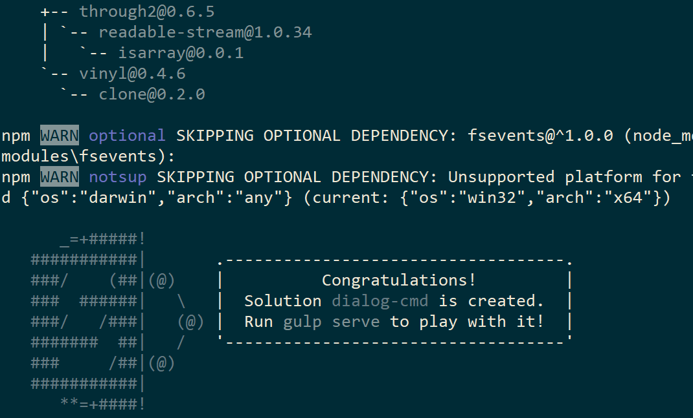
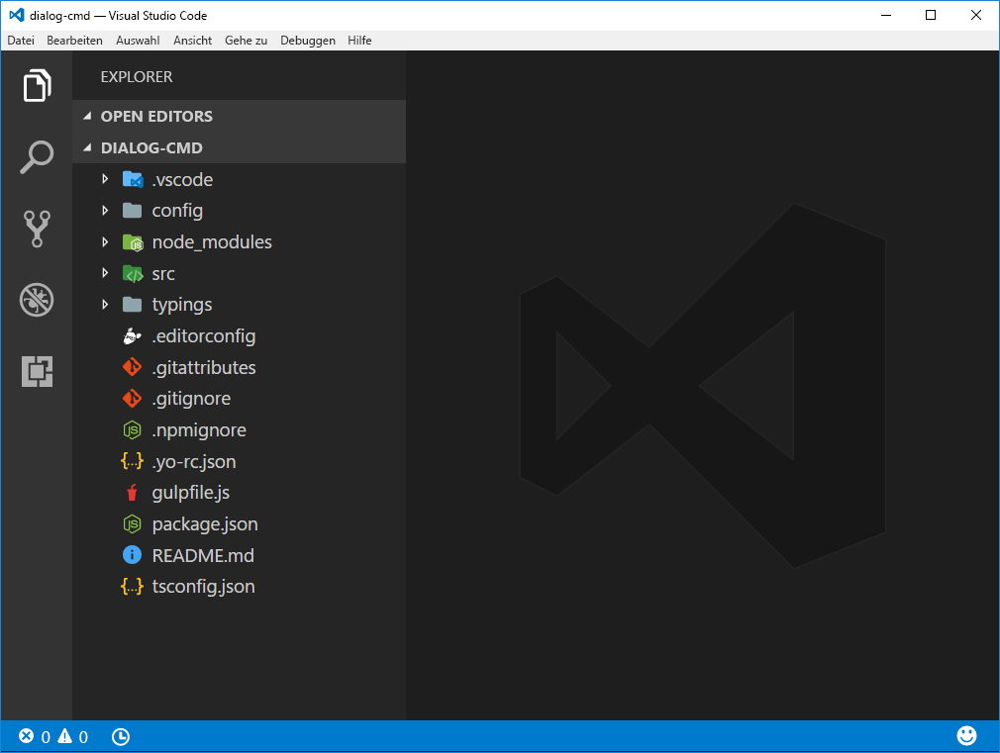
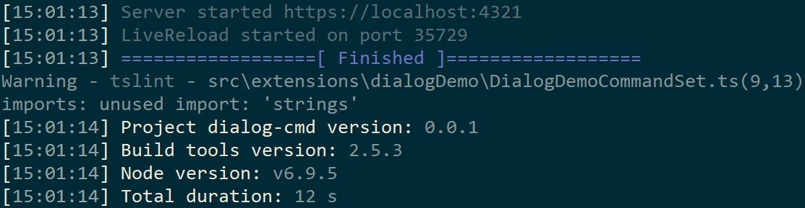
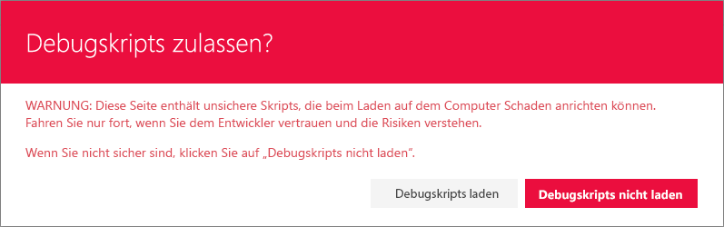
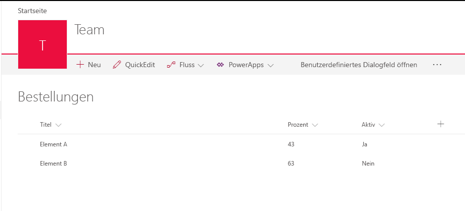
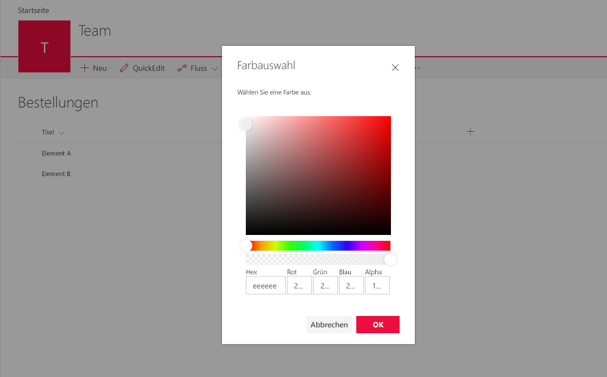
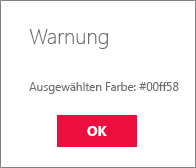

# <a name="using-custom-dialogs-with-sharepoint-framework-extensions"></a>Verwenden von benutzerdefinierten Dialogfeldern mit SharePoint Framework Extensions

Im Paket `@microsoft/sp-dialog` stehen benutzerdefinierte Dialogfelder zur Verfügung, die im Kontext von SharePoint Framework Extensions oder clientseitigen Webparts verwendet werden können. 

Dieses Lernprogramm demonstriert die Erstellung eines benutzerdefinierten Dialogfelds und dessen Verwendung im Kontext der ListView-Befehlssatzerweiterung.

> Beachten Sie, dass sich das SharePoint Framework-Dialogfeld derzeit in der Vorschauphase befindet und wir Feedback sammeln, bevor es offiziell veröffentlicht wird. Übermitteln Sie uns Ihr Feedback anhand der [sp-dev-docs-Repository-Problemliste](https://github.com/SharePoint/sp-dev-docs/issues).

> Beachten Sie, dass das Debuggen von benutzerdefinierten ListView-Sätzen in SharePoint Online derzeit nur in der modernen Listenoberfläche auf klassischen Teamwebsites verfügbar ist, die auf einem Entwicklungsmandanten gehostet werden. 

> Das Endergebnis dieses Lernprogramms ist ebenfalls als Quellcode unter https://github.com/SharePoint/sp-dev-fx-extensions/tree/master/samples/react-command-dialog verfügbar.  

## <a name="setup-your-environment"></a>Einrichten der Umgebung

Bevor Sie diesen Leitfaden durcharbeiten können, müssen Sie sicherstellen, dass Sie [Ihre Umgebung](https://dev.office.com/sharepoint/docs/spfx/set-up-your-development-environment) für die Entwicklung mithilfe von SharePoint-Framework eingerichtet haben und dass Sie die aktuellen Yeoman-Vorlagen für das SharePoint-Framework verwenden. 

> Sie können Ihre SharePoint-Framework-Yeoman-Vorlagen aktualisieren, indem Sie den folgenden Befehl ausführen: `npm install -g @microsoft/generator-sharepoint`. 

## <a name="create-a-new-project"></a>Erstellen eines neuen Projekts

Erstellen Sie zunächst einen neuen Ordners für das Projekt über eine Konsole Ihrer Wahl:

```sh
md dialog-cmd
```

Geben Sie diesen Ordner ein

```sh
cd dialog-cmd
```

Führen Sie dann den Yeoman-Generator für das SharePoint-Framework aus.

```sh
yo @microsoft/sharepoint
```

Es werden verschiedene Eingabeaufforderungen angezeigt. Gehen Sie wie folgt vor:

* Übernehmen Sie den Standardwert **dialog-cmd** als Namen der Lösung, und drücken Sie die **EINGABETASTE**.
* Wählen Sie **Extension (Preview)** als den zu erstellenden Typ von clientseitiger Komponente aus. 
* Wählen Sie **ListView Command Set (Preview)** als den zu erstellenden Typ von Erweiterung aus.

Über die nächsten Eingabeaufforderungen werden spezifische Informationen zu der Erweiterung abgefragt:

* Übernehmen Sie den Standardwert **DialogDemo** als Namen für Ihre Erweiterung, und drücken Sie die **EINGABETASTE**.
* Übernehmen Sie den Standardwert **DialogDemo description** als Beschreibung Ihrer Erweiterung, und drücken Sie die **EINGABETASTE**.


An diesem Punkt installiert Yeoman die erforderlichen Abhängigkeiten und erstellt ein Gerüst für die Lösungsdateien sowie die *HelloWorld*-Erweiterung. Das kann einige Minuten dauern. 

Nach Abschluss der Gerüsterstellung sollte folgende Erfolgsmeldung angezeigt werden:



Details zur Behebung etwaiger Fehler finden Sie unter [Known issues](../basics/known-issues).

Öffnen Sie den Projektordner in Ihrem Code-Editor, sobald die Gerüsterstellung abgeschlossen ist. In diesem Artikel wird Visual Studio Code in den Schritten und Screenshots verwendet, Sie können jedoch einen beliebigen Editor verwenden.

```
code .
```



## <a name="modify-extension-manifest-based-on-requirements"></a>Ändern des Erweiterungsmanifests basierend auf Anforderungen 

Konfigurieren Sie im Erweiterungsmanifest die Erweiterung so, dass sie nur eine Schaltfläche hat. Öffnen Sie im Code-Editor die Datei **./src/extensions/dialogDemo/DialogDemoCommandSet.manifest.json**. Ersetzen Sie den Befehlsabschnitt mit dem folgenden JSON-Code:

```json
{
  //...
  "commands": {
    "COMMAND_1": {
      "title": "Open Custom Dialog",
      "iconImageUrl": "icons/request.png"
    }
  }
}

```

## <a name="adding-sp-dialog-package-to-solution"></a>Hinzufügen des sp-dialog-Pakets zur Lösung
Wechseln Sie wieder zur Konsole, und führen Sie den folgenden Befehl aus, um die Dialogfeld-API in die Lösung einzuschließen: 

```
npm install @microsoft/sp-dialog --save
```

Da wir die Option `--save` verwenden, wird diese Abhängigkeit zur Datei *package.json* hinzugefügt und automatisch installiert, wenn der Befehl `npm install` ausgeführt wird.

Wechseln Sie wieder zu Visual Studio Code (oder Ihrem bevorzugten Editor).

## <a name="creating-your-custom-dialog"></a>Erstellen des benutzerdefinierten Dialogfelds
Erstellen Sie eine neue Datei mit dem Namen **ColorPickerDialog.tsx** im Ordner **./src/extensions/dialogDemo/**.

Fügen Sie die folgenden Importanweisungen am Anfang der neu erstellten Datei hinzu. Wir erstellen unser benutzerdefiniertes Dialogfeld mit Office UI Fabric React-Komponenten, sodass die Implementierung in React erfolgt. 

> Beachten Sie, dass die DialogContent-Komponente derzeit aus `@microsoft/sp-dialog` stammt. Sie wird jedoch in Kürze in die Office UI Fabric React Komponenten aufgenommen, wie bereits in den Codekommentaren erwähnt. 

```ts
import * as React from 'react';
import * as ReactDOM from 'react-dom';
import { BaseDialog, IDialogConfiguration } from '@microsoft/sp-dialog';
import {
  autobind,
  ColorPicker,
  PrimaryButton,
  Button,
  DialogFooter
  // DialogContent <- This should be imported here for third parties
} from 'office-ui-fabric-react';
// Note: DialogContent is available in v2.32.0 of office-ui-fabric-react
// As a workaround we're importing it from sp-dialog until the next version bump
import { DialogContent } from '@microsoft/sp-dialog';
```

Fügen Sie die folgende Schnittstellendefinition direkt unterhalb der Importanweisungen ein. Dies wird verwendet, um benötigte Informationen und Funktionen zwischen der ListView-Befehlssatzerweiterung und dem benutzerdefinierten Dialogfeld zu umgehen.

```ts
interface IColorPickerDialogContentProps {
  message: string;
  close: () => void;
  submit: (color: string) => void;
  defaultColor?: string;
}
```

Fügen Sie die folgende Klasse direkt unter der Schnittstellendefinition ein. Diese React-Klasse ist für das Rendern der Benutzeroberfläche im benutzerdefinierten Dialogfeld zuständig. Beachten Sie, dass wir die Office UI Fabric React-Komponenten für das eigentliche Rendern verwenden und die erforderlichen Eigenschaften umgehen.  

```ts
class ColorPickerDialogContent extends React.Component<IColorPickerDialogContentProps, {}> {
  private _pickedColor: string;

  constructor(props) {
    super(props);
    // Default Color
    this._pickedColor = props.defaultColor || '#FFFFFF';
  }

  public render(): JSX.Element {
    return <DialogContent
      title='Color Picker'
      subText={this.props.message}
      onDismiss={this.props.close}
      showCloseButton={true}
    >
      <ColorPicker color={this._pickedColor} onColorChanged={this._onColorChange} />
      <DialogFooter>
        <Button text='Cancel' title='Cancel' onClick={this.props.close} />
        <PrimaryButton text='OK' title='OK' onClick={() => { this.props.submit(this._pickedColor); }} />
      </DialogFooter>
    </DialogContent>;
  }

  @autobind
  private _onColorChange(color: string): void {
    this._pickedColor = color;
  }
}
```
Fügen Sie die folgende Klassendefinition für das benutzerdefinierte Dialogfeld direkt unter dem soeben hinzugefügten Klassencode hinzu. Dies ist das eigentliche benutzerdefinierte Dialogfeld, das durch Klicken auf die Schaltfläche aufgerufen wird und das von **BaseDialog** geerbt wird.

```ts
export default class ColorPickerDialog extends BaseDialog {
  public message: string;
  public colorCode: string;

  public render(): void {
    ReactDOM.render(<ColorPickerDialogContent
      close={ this.close }
      message={ this.message }
      defaultColor={ this.colorCode }
      submit={ this._submit }
    />, this.domElement);
  }

  public getConfig(): IDialogConfiguration {
    return {
      isBlocking: false
    };
  }

  @autobind
  private _submit(color: string): void {
    this.colorCode = color;
    this.close();
  }
}
```

## <a name="associating-custom-dialog-to-button-click"></a>Zuordnen des benutzerdefinierten Dialogfelds zur Schaltflächen-Klickaktion
Um das benutzerdefinierte Dialogfeld dem benutzerdefinierten ListView-Befehlssatz zuzuordnen, muss der Code zum Initiieren des Dialogfelds für die Schaltflächen-Klickaktion hinzugefügt werden.

Öffnen Sie im Code-Editor die Datei **DialogDemoCommandSet.ts** aus dem Ordner **./src/extensions/dialogDemo/**.

Fügen Sie die folgenden Importanweisungen unter dem vorhandenen **strings**-Import hinzu. Diese dienen zur Verwendung des gerade erstellten benutzerdefinierten Dialogfelds im Kontext des ListView-Befehlssatzes. 

```ts
import { Dialog } from '@microsoft/sp-dialog';
import ColorPickerDialog from './ColorPickerDialog';
```

Fügen Sei die folgende **_colorCode**-Variablendefinition oberhalb der **onInit**-Funktion in der **DialogDemoCommandSet**-Klasse hinzu. Dies wird zum Speichern des Ergebnisses für das Farbauswahl-Dialogfeld verwendet.

```ts
  private _colorCode: string;
```

Aktualisieren Sie die **OnExecute**-Funktion wie folgt. In diesem Code führen wir die folgenden Schritte durch.

* Initiieren des benutzerdefinierten Dialogfelds
* Umgehen der Meldung für das Dialogfeld, die als Titel verwendet wird
* Umgehen des Farbcodes für das Dialogfeld mit dem Standardwert, wenn noch nicht festgelegt
* Anzeigen des benutzerdefinierten Dialogfelds
* Empfangen und Speichern des vom Dialogfeld zurückgegebenen Werts
* Anzeigen des erhaltenen Werts im vordefinierten Dialogfeld mit der `Dialog.alert()`-Funktion

```ts
  @override
  public onExecute(event: IListViewCommandSetExecuteEventParameters): void {
    switch (event.commandId) {
      case 'COMMAND_1':
        const dialog: ColorPickerDialog = new ColorPickerDialog();
        dialog.message = 'Pick a color:';
        // Use 'EEEEEE' as the default color for first usage
        dialog.colorCode = this._colorCode || '#EEEEEE';
        dialog.show().then(() => {
          this._colorCode = dialog.colorCode;
          Dialog.alert(`Picked color: ${dialog.colorCode}`);
        });
        break;
      default:
        throw new Error('Unknown command');
    }
  }
```

## <a name="testing-custom-dialog-in-your-tenant"></a>Testen des benutzerdefinierten Dialogfelds im Mandanten
Gehen Sie zur Datei **DialogDemoCommandSet.manifest.json** im Ordner **./src/extensions/dialogDemo/**, und kopieren Sie den **id**-Wert, der im Debugging-Abfrageparameter verwendet wird.

Wechseln Sie zur Konsole, und führen Sie den folgenden Befehl aus. Wir verwenden die Option `--nobrowser`, da die lokale Workbench derzeit nicht für das Debuggen verwendet werden kann. Daher ist es nicht notwendig, sie zu starten. 

```sh
gulp serve --nobrowser
```

Hierdurch wird die Bündelung gestartet, und es dient als das sich aus der `localhost`-Adresse ergebende Manifest.



Um die Erweiterung zu testen, navigieren Sie zu einer Website in Ihrem SharePoint Online-Mandanten.

Gehen Sie zu einer vorhandenen benutzerdefinierten Liste auf der Website, die einige Elemente enthält, oder erstellen Sie eine neue Liste, und fügen Sie ihr einige Elemente zu Testzwecken hinzu. 

Fügen Sie die folgende Abfragezeichenfolgenparameter an die URL an. Beachten Sie, dass Sie die **ID** aktualisieren müssen, damit diese Ihrer Erweiterungs-ID entspricht, die in der Datei **DialogDemoCommandSet.manifest.json** verfügbar ist:

```
?loadSpfx=true&debugManifestsFile=https://localhost:4321/temp/manifests.js&customActions={"8701f44c-8c81-4e54-999d-62763e8f34d2":{"location":"ClientSideExtension.ListViewCommandSet.CommandBar"}}
```

Klicken Sie bei Aufforderung auf **Load debug scripts**, um das Laden der Debugmanifeste zu akzeptieren:



Beachten Sie, dass die neue Schaltfläche in der Symbolleiste der Liste mit dem *Open Custom Dialog* zu Testzwecken angezeigt wird.



Klicken Sie auf die Schaltfläche *Open Custom Dialog*, um das in der Listenansicht gerenderte benutzerdefinierte Dialogfeld anzuzeigen. 



Wählen Sie in der *Farbauswahl* eine Farbe, und klicken Sie auf **OK**, um zu testen, wie der Code den ausgewählten Wert an den Aufrufer zurückgibt, der dann im vordefinierten Warnungsdialogfeld angezeigt wird.


