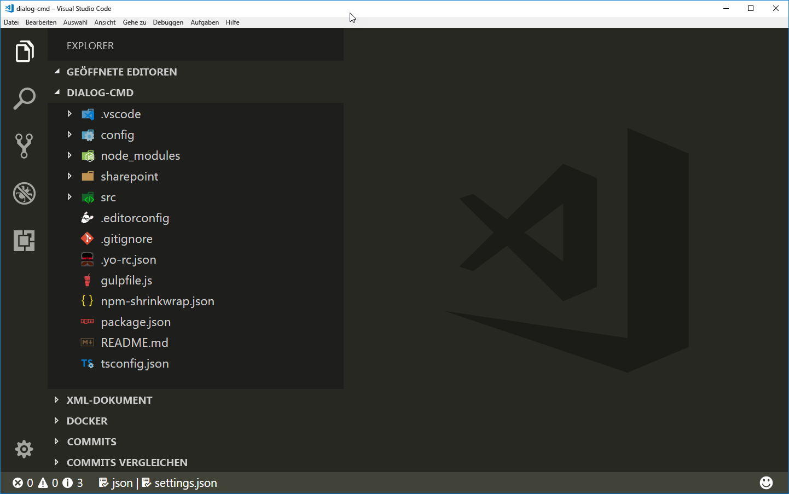
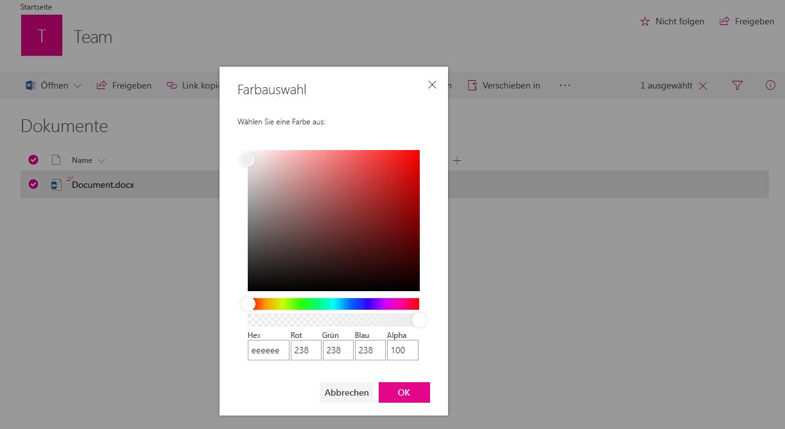
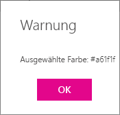

# <a name="use-custom-dialog-boxes-with-sharepoint-framework-extensions"></a><span data-ttu-id="10dc3-102">Verwenden von benutzerdefinierten Dialogfeldern mit SharePoint-Framework-Erweiterungen</span><span class="sxs-lookup"><span data-stu-id="10dc3-102">Use custom dialog boxes with SharePoint Framework Extensions</span></span>

<span data-ttu-id="10dc3-103">Benutzerdefinierte Dialogfelder können im Kontext von SharePoint Framework-Erweiterungen oder im Kontext von clientseitigen Webparts verwendet werden. Sie sind über das Paket **@microsoft/sp-dialog** verfügbar.</span><span class="sxs-lookup"><span data-stu-id="10dc3-103">You can use custom dialog boxes, available from the **@microsoft/sp-dialog** package, within the context of SharePoint Framework Extensions or client-side web parts.</span></span> 

<span data-ttu-id="10dc3-104">In diesem Artikel wird beschrieben, wie Sie ein benutzerdefiniertes Dialogfeld erstellen und im Kontext einer Erweiterung des Typs „ListView Command Set“ verwenden können.</span><span class="sxs-lookup"><span data-stu-id="10dc3-104">This article describes how to create a custom dialog box and use it within the context of a ListView Command Set extension.</span></span>

<span data-ttu-id="10dc3-105">Den Beispielcode, auf den in diesem Artikel Bezug genommen wird, finden Sie in unserem [sp-dev-fx-extensions](https://github.com/SharePoint/sp-dev-fx-extensions/tree/master/samples/react-command-dialog)-Repository.</span><span class="sxs-lookup"><span data-stu-id="10dc3-105">You can access the sample code that this article is based on in the [sp-dev-fx-extensions](https://github.com/SharePoint/sp-dev-fx-extensions/tree/master/samples/react-command-dialog) repo.</span></span>

## <a name="set-up-your-development-environment"></a><span data-ttu-id="10dc3-106">Einrichten der Entwicklungsumgebung</span><span class="sxs-lookup"><span data-stu-id="10dc3-106">Set up your development environment</span></span>

<span data-ttu-id="10dc3-p101">Zur Erstellung eines benutzerdefinierten Dialogfelds müssen Sie zunächst die Schritt-für-Schritt-Anleitung im Artikel zum Thema [Einrichten Ihrer Entwicklungsumgebung](https://dev.office.com/sharepoint/docs/spfx/set-up-your-development-environment) befolgen. Stellen Sie sicher, dass Sie die neuesten SharePoint Framework-Yeoman-Vorlagen verwenden.</span><span class="sxs-lookup"><span data-stu-id="10dc3-p101">To create a custom dialog box, you'll need to follow the steps in the [Set up your development environment](https://dev.office.com/sharepoint/docs/spfx/set-up-your-development-environment). Make sure that you're using the latest SharePoint Framework Yeoman templates.</span></span>

## <a name="create-a-new-project"></a><span data-ttu-id="10dc3-109">Erstellen eines neuen Projekts</span><span class="sxs-lookup"><span data-stu-id="10dc3-109">Create a new project</span></span>

<span data-ttu-id="10dc3-110">Erstellen Sie über eine Konsole Ihrer Wahl einen neuen Ordner für das Projekt:</span><span class="sxs-lookup"><span data-stu-id="10dc3-110">Create a new folder for the project using your console of choice:</span></span>

```sh
md dialog-cmd
```

<span data-ttu-id="10dc3-111">Wechseln Sie nun in diesen Ordner:</span><span class="sxs-lookup"><span data-stu-id="10dc3-111">Then enter that folder:</span></span>

```sh
cd dialog-cmd
```

<span data-ttu-id="10dc3-112">Führen Sie den Yeoman-Generator für SharePoint Framework aus:</span><span class="sxs-lookup"><span data-stu-id="10dc3-112">Run the Yeoman generator for the SharePoint Framework:</span></span>

```sh
yo @microsoft/sharepoint
```

<span data-ttu-id="10dc3-113">Es werden verschiedene Eingabeaufforderungen angezeigt. Gehen Sie wie folgt vor:</span><span class="sxs-lookup"><span data-stu-id="10dc3-113">When prompted:</span></span>

* <span data-ttu-id="10dc3-114">Übernehmen Sie den Standardwert **dialog-cmd** als Namen der Lösung, und drücken Sie die EINGABETASTE.</span><span class="sxs-lookup"><span data-stu-id="10dc3-114">Accept the default value of dialog-cmd as your solution name and press Enter.</span></span>
* <span data-ttu-id="10dc3-115">Wählen Sie **SharePoint Online only (latest)**, und drücken Sie die EINGABETASTE.</span><span class="sxs-lookup"><span data-stu-id="10dc3-115">Choose SharePoint Online only (latest), and press Enter.</span></span>
* <span data-ttu-id="10dc3-116">Wählen Sie **Use the current folder** aus, und drücken Sie die EINGABETASTE.</span><span class="sxs-lookup"><span data-stu-id="10dc3-116">Choose Use the current folder and press Enter.</span></span>
* <span data-ttu-id="10dc3-117">Wählen Sie **N**, damit die Erweiterung auf jeder Website explizit installiert werden muss, wenn diese verwendet wird.</span><span class="sxs-lookup"><span data-stu-id="10dc3-117">Choose **N** to require extension to be installed on each site explicitly when it's being used.</span></span>
* <span data-ttu-id="10dc3-118">Wählen Sie **Extension** als den zu erstellenden Typ von clientseitiger Komponente aus.</span><span class="sxs-lookup"><span data-stu-id="10dc3-118">Choose **Extension** as the client-side component type to be created.</span></span> 
* <span data-ttu-id="10dc3-119">Wählen Sie **ListView Command Set** als den zu erstellenden Typ von Erweiterung aus.</span><span class="sxs-lookup"><span data-stu-id="10dc3-119">Choose **ListView Command Set** as the extension type to be created.</span></span>

<span data-ttu-id="10dc3-120">Über die nächsten Eingabeaufforderungen werden spezifische Informationen zu der Erweiterung abgefragt:</span><span class="sxs-lookup"><span data-stu-id="10dc3-120">The next set of prompts will ask for specific information about your extension:</span></span>

* <span data-ttu-id="10dc3-121">Übernehmen Sie den Wert **DialogDemo** als Namen für Ihre Erweiterung, und drücken Sie die EINGABETASTE.</span><span class="sxs-lookup"><span data-stu-id="10dc3-121">Use the value of DialogDemo as your extension name and press Enter.</span></span>
* <span data-ttu-id="10dc3-122">Übernehmen Sie den Standardwert **DialogDemo description** als Beschreibung Ihrer Erweiterung, und drücken Sie die EINGABETASTE.</span><span class="sxs-lookup"><span data-stu-id="10dc3-122">Accept the default value of DialogDemo description as your extension description and press Enter.</span></span>


<span data-ttu-id="10dc3-p102">An diesem Punkt installiert Yeoman die erforderlichen Abhängigkeiten und erstellt ein Gerüst für die Lösungsdateien sowie die *DialogDemo*-Erweiterung. Das kann einige Minuten dauern.</span><span class="sxs-lookup"><span data-stu-id="10dc3-p102">At this point, Yeoman will install the required dependencies and scaffold the solution files along with the *DialogDemo* extension. This might take a few minutes.</span></span>

<span data-ttu-id="10dc3-126">Nach Abschluss der Gerüsterstellung sollte folgende Erfolgsmeldung angezeigt werden:</span><span class="sxs-lookup"><span data-stu-id="10dc3-126">When the scaffold is complete, you should see the following message indicating a successful scaffold:</span></span>


<span data-ttu-id="10dc3-128">Sobald das Gerüst abgeschlossen ist, sperren Sie die Version der Projektabhängigkeiten, indem Sie den folgenden Befehl ausführen:</span><span class="sxs-lookup"><span data-stu-id="10dc3-128">Once the scaffolding completes, lock down the version of the project dependencies by running the following command:</span></span>

```sh
npm shrinkwrap
```

<span data-ttu-id="10dc3-129">Öffnen Sie dann den Projektordner im Code-Editor.</span><span class="sxs-lookup"><span data-stu-id="10dc3-129">Next, open your project folder in your code editor.</span></span> <span data-ttu-id="10dc3-130">In diesem Artikel wird Visual Studio Code in den Schritten und Screenshots verwendet, Sie können jedoch einen beliebigen Editor verwenden.</span><span class="sxs-lookup"><span data-stu-id="10dc3-130">This article uses Visual Studio Code in the steps and screenshots, but you can use any editor you prefer.</span></span> <span data-ttu-id="10dc3-131">Um den Ordner in Visual Studio Code zu öffnen, verwenden Sie den folgenden Befehl in der Konsole:</span><span class="sxs-lookup"><span data-stu-id="10dc3-131">To open the folder in Visual Studio Code, use the following command in the console:</span></span>

```sh
code .
```



## <a name="modify-the-extension-manifest"></a><span data-ttu-id="10dc3-133">Ändern des Erweiterungsmanifests</span><span class="sxs-lookup"><span data-stu-id="10dc3-133">Modify the extension manifest</span></span>

<span data-ttu-id="10dc3-p104">Konfigurieren Sie die Erweiterung im Erweiterungsmanifest so, dass sie nur eine Schaltfläche hat. Öffnen Sie dazu im Code-Editor die Datei **./src/extensions/dialogDemo/DialogDemoCommandSet.manifest.json**, und ersetzen Sie den Befehlsabschnitt durch den folgenden JSON-Code:</span><span class="sxs-lookup"><span data-stu-id="10dc3-p104">In the extension manifest, configure the extension to have only one button. In the code editor, open the **./src/extensions/dialogDemo/DialogDemoCommandSet.manifest.json** file. Replace the commands section with the following JSON:</span></span>

```json
{
  //...
  "items": {
    "COMMAND_1": {
      "title": { "default": "Open Custom Dialog" },
      "iconImageUrl": "icons/request.png",
      "type": "command"
    }
  }
}
```

## <a name="create-a-custom-dialog-box"></a><span data-ttu-id="10dc3-137">Erstellen eines benutzerdefinierten Dialogfelds</span><span class="sxs-lookup"><span data-stu-id="10dc3-137">Create a custom dialog box</span></span>

<span data-ttu-id="10dc3-138">Erstellen Sie eine neue Datei mit dem Namen **ColorPickerDialog.tsx** im Ordner **./src/extensions/dialogDemo/**.</span><span class="sxs-lookup"><span data-stu-id="10dc3-138">Create a new file called **ColorPickerDialog.tsx** in the **./src/extensions/dialogDemo/** folder.</span></span>

<span data-ttu-id="10dc3-p105">Fügen Sie die folgenden Importanweisungen am Anfang der neu erstellten Datei ein. Da Sie das benutzerdefinierte Dialogfeld mithilfe von [Office UI Fabric React-Komponenten](https://dev.office.com/fabric#/components) erstellen, nutzen Sie React zur Implementierung.</span><span class="sxs-lookup"><span data-stu-id="10dc3-p105">Add the following import statements at the top of the newly created file. You're creating your custom dialog box using the [Office UI Fabric React components](https://dev.office.com/fabric#/components), so the implementation will be in React.</span></span> 


```ts
import * as React from 'react';
import * as ReactDOM from 'react-dom';
import { BaseDialog, IDialogConfiguration } from '@microsoft/sp-dialog';
import {
  autobind,
  ColorPicker,
  PrimaryButton,
  Button,
  DialogFooter,
  DialogContent
} from 'office-ui-fabric-react';

```

<span data-ttu-id="10dc3-p106">Fügen Sie die nachfolgende Schnittstellendefinition direkt unterhalb der Importanweisungen ein. Sie regelt die Übergabe von Informationen und Funktionen zwischen Ihrer Erweiterung des Typs „ListView Command Set“ und Ihrem benutzerdefinierten Dialogfeld.</span><span class="sxs-lookup"><span data-stu-id="10dc3-p106">Add the following interface definition just below the import statements. This will be used to pass information and functions between your ListView Command Set extension and your custom dialog box.</span></span>

```ts
interface IColorPickerDialogContentProps {
  message: string;
  close: () => void;
  submit: (color: string) => void;
  defaultColor?: string;
}
```

<span data-ttu-id="10dc3-p107">Fügen Sie die nachfolgende Klasse direkt unterhalb der Schnittstellendefinition ein. Diese React-Klasse ist für das Rendern der Benutzeroberfläche im benutzerdefinierten Dialogfeld zuständig. Wie Sie sehen, werden zum eigentlichen Rendern die Office UI Fabric React-Komponenten verwendet. Die erforderlichen Eigenschaften werden lediglich übergeben.</span><span class="sxs-lookup"><span data-stu-id="10dc3-p107">Add the following class just below the interface definition. This React class is responsible for rendering the UI experiences inside the custom dialog box. Notice that you use the Office UI Fabric React components for actual rendering and just pass the needed properties.</span></span>  

```ts
class ColorPickerDialogContent extends React.Component<IColorPickerDialogContentProps, {}> {
  private _pickedColor: string;

  constructor(props) {
    super(props);
    // Default Color
    this._pickedColor = props.defaultColor || '#FFFFFF';
  }

  public render(): JSX.Element {
    return <DialogContent
      title='Color Picker'
      subText={this.props.message}
      onDismiss={this.props.close}
      showCloseButton={true}
    >
      <ColorPicker color={this._pickedColor} onColorChanged={this._onColorChange} />
      <DialogFooter>
        <Button text='Cancel' title='Cancel' onClick={this.props.close} />
        <PrimaryButton text='OK' title='OK' onClick={() => { this.props.submit(this._pickedColor); }} />
      </DialogFooter>
    </DialogContent>;
  }

  @autobind
  private _onColorChange(color: string): void {
    this._pickedColor = color;
  }
}
```
<span data-ttu-id="10dc3-p108">Fügen Sie die nachfolgende Klassendefinition für das benutzerdefinierte Dialogfeld direkt unterhalb der Klasse `ColorPickerDialogContent` ein, die Sie soeben hinzugefügt haben. Hierbei handelt es sich um das eigentliche benutzerdefinierte Dialogfeld, das über einen Klick auf die durch die Erweiterung des Typs „ListView Command Set“ implementierte Schaltfläche aufgerufen wird und von `BaseDialog` vererbt wird.</span><span class="sxs-lookup"><span data-stu-id="10dc3-p108">Add the following class definition for your custom dialog box under the `ColorPickerDialogContent` class that you just added. This is the actual custom dialog box that will be called from the ListView Command Set button click and is inherited from the `BaseDialog`.</span></span>

```ts
export default class ColorPickerDialog extends BaseDialog {
  public message: string;
  public colorCode: string;

  public render(): void {
    ReactDOM.render(<ColorPickerDialogContent
      close={ this.close }
      message={ this.message }
      defaultColor={ this.colorCode }
      submit={ this._submit }
    />, this.domElement);
  }

  public getConfig(): IDialogConfiguration {
    return {
      isBlocking: false
    };
  }

  @autobind
  private _submit(color: string): void {
    this.colorCode = color;
    this.close();
  }
}
```

## <a name="associate-the-custom-dialog-box-with-the-listview-command-set-button-click"></a><span data-ttu-id="10dc3-148">Verknüpfen des benutzerdefinierten Dialogfelds mit dem Klickereignis für die per „ListView Command Set“ implementierte Schaltfläche</span><span class="sxs-lookup"><span data-stu-id="10dc3-148">Associate the custom dialog box with the ListView Command Set button click</span></span>
<span data-ttu-id="10dc3-149">Zur Verknüpfung des benutzerdefinierten Dialogfelds mit Ihrer benutzerdefinierten Erweiterung des Typs „ListView Command Set“ fügen Sie nun den zur Initiierung des Dialogfelds erforderlichen Code in die Klickoperation der Schaltfläche ein.</span><span class="sxs-lookup"><span data-stu-id="10dc3-149">To associate the custom dialog box with your custom ListView Command Set, add the code to initiate the dialog box within the button click operation.</span></span>

<span data-ttu-id="10dc3-150">Öffnen Sie im Code-Editor die Datei **DialogDemoCommandSet.ts** im Ordner **./src/extensions/dialogDemo/**.</span><span class="sxs-lookup"><span data-stu-id="10dc3-150">In the code editor, open the **DialogDemoCommandSet.ts** file from the **./src/extensions/dialogDemo/** folder.</span></span>

<span data-ttu-id="10dc3-p109">Fügen Sie die nachfolgenden Importanweisungen unter der bereits vorhandenen **strings**-Importanweisung hinzu. Über die neuen Importanweisungen kann das benutzerdefinierte Dialogfeld im Kontext der Erweiterung des Typs „ListView Command Set“ verwendet werden.</span><span class="sxs-lookup"><span data-stu-id="10dc3-p109">Add the following import statements under the existing **strings** import. These are for using the custom dialog box in the context of your ListView Command Set.</span></span> 

```ts
import ColorPickerDialog from './ColorPickerDialog';
```

<span data-ttu-id="10dc3-p110">Fügen Sie die nachfolgende Variablendefinition `_colorCode` oberhalb der Funktion `onInit` in die Klasse `DialogDemoCommandSet` ein. Sie speichert den Rückgabewert aus dem Farbauswahl-Dialogfeld.</span><span class="sxs-lookup"><span data-stu-id="10dc3-p110">Add the following `_colorCode` variable definition above the `onInit` function in the `DialogDemoCommandSet` class. This is used to store the color picker dialog box result.</span></span>

```ts
  private _colorCode: string;
```

<span data-ttu-id="10dc3-p111">Aktualisieren Sie die Funktion `onExecute` wie unten dargestellt. Dieser Code führt folgende Aktionen durch:</span><span class="sxs-lookup"><span data-stu-id="10dc3-p111">Update the `onExecute` function as follows. This code does the following:</span></span>

* <span data-ttu-id="10dc3-157">Er initiiert das benutzerdefinierte Dialogfeld.</span><span class="sxs-lookup"><span data-stu-id="10dc3-157">Initiates the custom dialog box.</span></span>
* <span data-ttu-id="10dc3-158">Er übergibt eine Nachricht an das Dialogfeld, die als Titel verwendet wird.</span><span class="sxs-lookup"><span data-stu-id="10dc3-158">Passes a message for the dialog box, which is used for the title.</span></span>
* <span data-ttu-id="10dc3-159">Er übergibt einen Farbcode an das Dialogfeld (den Standardwert, falls nicht anders festgelegt).</span><span class="sxs-lookup"><span data-stu-id="10dc3-159">Passed a color code for the dialog box with a default value, if not yet set.</span></span>
* <span data-ttu-id="10dc3-160">Er rendert das benutzerdefinierte Dialogfeld.</span><span class="sxs-lookup"><span data-stu-id="10dc3-160">Shows the custom dialog box.</span></span>
* <span data-ttu-id="10dc3-161">Er empfängt und speichert den Rückgabewert des Dialogfelds.</span><span class="sxs-lookup"><span data-stu-id="10dc3-161">Receives and stores the return value from the dialog box.</span></span>
* <span data-ttu-id="10dc3-162">Er zeigt den empfangenen Wert mithilfe der Funktion `Dialog.alert()` in einem Standarddialogfeld an.</span><span class="sxs-lookup"><span data-stu-id="10dc3-162">Shows the received value in a default dialog box using the `Dialog.alert()` function.</span></span>

```ts
  @override
  public onExecute(event: IListViewCommandSetExecuteEventParameters): void {
    switch (event.itemId) {
      case 'COMMAND_1':
        const dialog: ColorPickerDialog = new ColorPickerDialog();
        dialog.message = 'Pick a color:';
        // Use 'EEEEEE' as the default color for first usage
        dialog.colorCode = this._colorCode || '#EEEEEE';
        dialog.show().then(() => {
          this._colorCode = dialog.colorCode;
          Dialog.alert(`Picked color: ${dialog.colorCode}`);
        });
        break;
      default:
        throw new Error('Unknown command');
    }
  }
```

## <a name="test-the-custom-dialog-box-in-your-tenant"></a><span data-ttu-id="10dc3-163">Testen des benutzerdefinierten Dialogfelds im Mandanten</span><span class="sxs-lookup"><span data-stu-id="10dc3-163">Test the custom dialog box in your tenant</span></span>

<span data-ttu-id="10dc3-164">Öffnen Sie die Datei **serve.json** in dem Ordner **./config/**, und überprüfen Sie die aktuellen Einstellungen in der Datei.</span><span class="sxs-lookup"><span data-stu-id="10dc3-164">Open the **serve.json** file in the **./config/** folder and update review the current settings in the the file.</span></span> <span data-ttu-id="10dc3-165">Diese Datei ermöglicht ein einfacheres Debuggen von SharePoint-Framework-Erweiterungen.</span><span class="sxs-lookup"><span data-stu-id="10dc3-165">This file is used to make debugging on SharePoint Framework Extensions easier.</span></span> <span data-ttu-id="10dc3-166">Sie können den Dateiinhalt an die entsprechenden Mandanten- und Websitedetails anpassen, die zum Testen der Erweiterung verwendet werden sollen.</span><span class="sxs-lookup"><span data-stu-id="10dc3-166">You can update the file content to match your own tenant and site details where you want to test your extension.</span></span> <span data-ttu-id="10dc3-167">Ein wichtiger Wert, der in der JSON-Definition an den entsprechenden Mandanten angepasst werden muss, ist die `pageUrl`-Eigenschaft.</span><span class="sxs-lookup"><span data-stu-id="10dc3-167">Key value to update is the `pageUrl` property in the json definition to match your own tenant.</span></span>

<span data-ttu-id="10dc3-168">`pageUrl` muss auf eine Listen-URL verweisen, wo die Dialogfeldfunktionalität getestet werden soll.</span><span class="sxs-lookup"><span data-stu-id="10dc3-168">Update `pageUrl` to point to a list URL where you want to test the dialog functionality.</span></span>

```sh
  "serveConfigurations": {
    "default": {
      "pageUrl": "https://sppnp.sharepoint.com/sites/team/Shared%20Documents/Forms/AllItems.aspx",
      "customActions": {
        "9b98b919-fe5e-4758-ac91-6d62e582c4fe": {
          "location": "ClientSideExtension.ListViewCommandSet.CommandBar",
          "properties": {
            "sampleTextOne": "One item is selected in the list",
            "sampleTextTwo": "This command is always visible."
          }
        }
      }
    },
```

> [!NOTE]
> <span data-ttu-id="10dc3-169">Der eindeutige Bezeichner der Erweiterung wird während der anfänglichen Gerüsterstellung automatisch auf diese Datei aktualisiert.</span><span class="sxs-lookup"><span data-stu-id="10dc3-169">Unique identifier of your extension is automatically updated to this file during initial scaffolding.</span></span> <span data-ttu-id="10dc3-170">Wenn Sie die Eigenschaften ändern, die Ihre Erweiterung verwenden soll, sollten Sie die Datei **serve.json** vor dem Debuggen entsprechend aktualisieren.</span><span class="sxs-lookup"><span data-stu-id="10dc3-170">If you update the properties which your extension will use, you should be updating **serve.json** before you start debuggin.</span></span>

<span data-ttu-id="10dc3-171">Wechseln Sie zurück zur Konsole, und führen Sie den folgenden Befehl aus:</span><span class="sxs-lookup"><span data-stu-id="10dc3-171">Return to the console and run the following command:</span></span>

```sh
gulp serve
```

<span data-ttu-id="10dc3-172">Nun wird die Bündelung der Lösung angestoßen, und das resultierende Manifest wird von der `localhost`-Adresse ausgeliefert.</span><span class="sxs-lookup"><span data-stu-id="10dc3-172">This will start the bundling of your solution and will serve the resulting manifest from the `localhost` address.</span></span> <span data-ttu-id="10dc3-173">Aufgrund der Konfiguration in der Datei **serve.json** wird auch ein Browser in der angegebenen URL geöffnet, bei dem die Abfrageparameter automatisch auf Grundlage der Lösungskonfiguration festgelegt sind.</span><span class="sxs-lookup"><span data-stu-id="10dc3-173">Due the configuration in the **serve.json** file, it also opens up a browser in the specific URL with automatically setting the query parameters based on the solution configuration.</span></span>

<span data-ttu-id="10dc3-174">Klicken Sie bei Aufforderung auf **Load debug scripts**, um das Laden der Debugmanifeste zu akzeptieren.</span><span class="sxs-lookup"><span data-stu-id="10dc3-174">Accept the loading of Debug Manifests by choosing **Load debug scripts** when prompted.</span></span>


<span data-ttu-id="10dc3-176">Beachten Sie, dass die neue Schaltfläche nicht standardmäßig in der Symbolleiste angezeigt wird, da Sie für die Standardlösung ein Element aus der Liste auswählen müssen.</span><span class="sxs-lookup"><span data-stu-id="10dc3-176">Notice that the new button is NOT visible in the toolbar by default, since default solution require that you'll need to select one item from the list.</span></span> <span data-ttu-id="10dc3-177">Wenn keine Elemente in der Liste oder Bibliothek angezeigt werden, erstellen Sie ein Element, oder laden Sie ein Dokument hoch.</span><span class="sxs-lookup"><span data-stu-id="10dc3-177">If you do not have any items in the list or library, create an item or upload a document.</span></span> 

<span data-ttu-id="10dc3-178">Wählen Sie ein Element aus der Liste oder der Bibliothek aus. Die Schaltfläche wird nun in der Symbolleiste mit dem Text*Open Custom Dialog* angezeigt.</span><span class="sxs-lookup"><span data-stu-id="10dc3-178">Select item from the list or library and notice how button will be visible in the toolbar with the text *Open Custom Dialog box*.</span></span>


<span data-ttu-id="10dc3-180">Klicken Sie auf die Schaltfläche *Open Custom Dialog*. Ihr benutzerdefiniertes Dialogfeld wird nun in der Listenansicht gerendert.</span><span class="sxs-lookup"><span data-stu-id="10dc3-180">Click the *Open Custom Dialog box* button to see your custom dialog box rendered within the list view.</span></span> 



<span data-ttu-id="10dc3-p116">Wählen Sie in der *Farbauswahl* eine Farbe aus, und klicken Sie auf **OK**, um zu testen, wie der Code den ausgewählten Wert an den Aufrufer zurückgibt. Die Auswahl wird anschließend in einem Standarddialogfeld „Alert“ angezeigt.</span><span class="sxs-lookup"><span data-stu-id="10dc3-p116">Choose a color in the *Color Picker* and choose **OK** to test how the code is returning the selected value back to the caller. The selection is then shown using the default alert dialog box.</span></span>



> [!NOTE]
> <span data-ttu-id="10dc3-185">Wenn Sie einen Fehler in der Dokumentation oder im SharePoint-Framework finden, melden Sie ihn an das SharePoint Engineering unter Verwendung der [Fehlerliste im sp-dev-docs-Repository](https://github.com/SharePoint/sp-dev-docs/issues).</span><span class="sxs-lookup"><span data-stu-id="10dc3-185">If you find an issue in the documentation or in the SharePoint Framework, please report that to SharePoint engineering using the [issue list at sp-dev-docs repository](https://github.com/SharePoint/sp-dev-docs/issues).</span></span> <span data-ttu-id="10dc3-186">Vielen Dank im Voraus für Ihr Feedback.</span><span class="sxs-lookup"><span data-stu-id="10dc3-186">Thanks for your input advance.</span></span>

## <a name="see-also"></a><span data-ttu-id="10dc3-187">Siehe auch</span><span class="sxs-lookup"><span data-stu-id="10dc3-187">See also</span></span>

- [<span data-ttu-id="10dc3-188">Übersicht über SharePoint-Framework-Erweiterungen</span><span class="sxs-lookup"><span data-stu-id="10dc3-188">Overview of SharePoint Framework Extensions</span></span>](../overview-extensions.md)