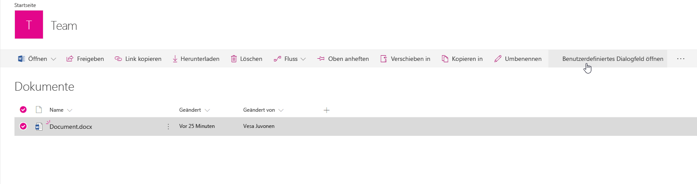

# <a name="use-custom-dialog-boxes-with-sharepoint-framework-extensions"></a>Verwenden von benutzerdefinierten Dialogfeldern mit SharePoint Framework-Erweiterungen

Benutzerdefinierte Dialogfelder können im Kontext von SharePoint Framework-Erweiterungen oder im Kontext von clientseitigen Webparts verwendet werden. Sie sind über das Paket **@microsoft/sp-dialog** verfügbar. 

In diesem Artikel wird beschrieben, wie Sie ein benutzerdefiniertes Dialogfeld erstellen und im Kontext einer Erweiterung des Typs „ListView Command Set“ verwenden können.

Den Beispielcode, auf den in diesem Artikel Bezug genommen wird, finden Sie in unserem [sp-dev-fx-extensions](https://github.com/SharePoint/sp-dev-fx-extensions/tree/master/samples/react-command-dialog)-Repository.

## <a name="set-up-your-development-environment"></a>Einrichten der Entwicklungsumgebung

Zur Erstellung eines benutzerdefinierten Dialogfelds müssen Sie zunächst die Schritt-für-Schritt-Anleitung im Artikel zum Thema [Einrichten Ihrer Entwicklungsumgebung](https://dev.office.com/sharepoint/docs/spfx/set-up-your-development-environment) befolgen. Stellen Sie sicher, dass Sie die neuesten SharePoint Framework-Yeoman-Vorlagen verwenden.

## <a name="create-a-new-project"></a>Erstellen eines neuen Projekts

Erstellen Sie über eine Konsole Ihrer Wahl einen neuen Ordner für das Projekt:

```sh
md dialog-cmd
```

Wechseln Sie nun in diesen Ordner:

```sh
cd dialog-cmd
```

Führen Sie den Yeoman-Generator für SharePoint Framework aus:

```sh
yo @microsoft/sharepoint
```

Es werden verschiedene Eingabeaufforderungen angezeigt. Gehen Sie wie folgt vor:

* Übernehmen Sie den Standardwert **dialog-cmd** als Namen der Lösung, und drücken Sie die **EINGABETASTE**.
* Wählen Sie **SharePoint Online only (latest)**, und drücken Sie die **EINGABETASTE**.
* Wählen Sie **Use the current folder (Aktuellen Ordner verwenden)** aus, und drücken Sie die **EINGABETASTE**.
* Wählen Sie **N**, damit die Erweiterung auf jeder Website explizit installiert werden muss, wenn diese verwendet wird.
* Wählen Sie **Extension** als den zu erstellenden Typ von clientseitiger Komponente aus. 
* Wählen Sie **ListView Command Set** als den zu erstellenden Typ von Erweiterung aus.

Über die nächsten Eingabeaufforderungen werden spezifische Informationen zu der Erweiterung abgefragt:

* Übernehmen Sie den Wert **DialogDemo** als Namen für Ihre Erweiterung, und drücken Sie die **EINGABETASTE**.
* Übernehmen Sie den Standardwert **DialogDemo description** als Beschreibung Ihrer Erweiterung, und drücken Sie die **EINGABETASTE**.


An diesem Punkt installiert Yeoman die erforderlichen Abhängigkeiten und erstellt ein Gerüst für die Lösungsdateien sowie die *DialogDemo*-Erweiterung. Das kann einige Minuten dauern.

Nach Abschluss der Gerüsterstellung sollte folgende Erfolgsmeldung angezeigt werden:


Sobald das Gerüst abgeschlossen ist, sperren Sie die Version der Projektabhängigkeiten, indem Sie den folgenden Befehl ausführen:

```sh
npm shrinkwrap
```

Öffnen Sie dann den Projektordner im Code-Editor. In diesem Artikel wird Visual Studio Code in den Schritten und Screenshots verwendet, Sie können jedoch einen beliebigen Editor verwenden. Um den Ordner in Visual Studio Code zu öffnen, verwenden Sie den folgenden Befehl in der Konsole:

```sh
code .
```


## <a name="modify-the-extension-manifest"></a>Ändern des Erweiterungsmanifests

Konfigurieren Sie die Erweiterung im Erweiterungsmanifest so, dass sie nur eine Schaltfläche hat. Öffnen Sie dazu im Code-Editor die Datei **./src/extensions/dialogDemo/DialogDemoCommandSet.manifest.json**, und ersetzen Sie den Befehlsabschnitt durch den folgenden JSON-Code:

```json
{
  //...
  "items": {
    "COMMAND_1": {
      "title": { "default": "Open Custom Dialog" },
      "iconImageUrl": "icons/request.png",
      "type": "command"
    }
  }
}
```

## <a name="create-a-custom-dialog-box"></a>Erstellen eines benutzerdefinierten Dialogfelds

Erstellen Sie eine neue Datei mit dem Namen **ColorPickerDialog.tsx** im Ordner **./src/extensions/dialogDemo/**.

Fügen Sie die folgenden Importanweisungen am Anfang der neu erstellten Datei ein. Da Sie das benutzerdefinierte Dialogfeld mithilfe von [Office UI Fabric React-Komponenten](https://dev.office.com/fabric#/components) erstellen, nutzen Sie React zur Implementierung. 


```ts
import * as React from 'react';
import * as ReactDOM from 'react-dom';
import { BaseDialog, IDialogConfiguration } from '@microsoft/sp-dialog';
import {
  autobind,
  ColorPicker,
  PrimaryButton,
  Button,
  DialogFooter,
  DialogContent
} from 'office-ui-fabric-react';

```

Fügen Sie die nachfolgende Schnittstellendefinition direkt unterhalb der Importanweisungen ein. Sie regelt die Übergabe von Informationen und Funktionen zwischen Ihrer Erweiterung des Typs „ListView Command Set“ und Ihrem benutzerdefinierten Dialogfeld.

```ts
interface IColorPickerDialogContentProps {
  message: string;
  close: () => void;
  submit: (color: string) => void;
  defaultColor?: string;
}
```

Fügen Sie die nachfolgende Klasse direkt unterhalb der Schnittstellendefinition ein. Diese React-Klasse ist für das Rendern der Benutzeroberfläche im benutzerdefinierten Dialogfeld zuständig. Wie Sie sehen, werden zum eigentlichen Rendern die Office UI Fabric React-Komponenten verwendet. Die erforderlichen Eigenschaften werden lediglich übergeben.  

```ts
class ColorPickerDialogContent extends React.Component<IColorPickerDialogContentProps, {}> {
  private _pickedColor: string;

  constructor(props) {
    super(props);
    // Default Color
    this._pickedColor = props.defaultColor || '#FFFFFF';
  }

  public render(): JSX.Element {
    return <DialogContent
      title='Color Picker'
      subText={this.props.message}
      onDismiss={this.props.close}
      showCloseButton={true}
    >
      <ColorPicker color={this._pickedColor} onColorChanged={this._onColorChange} />
      <DialogFooter>
        <Button text='Cancel' title='Cancel' onClick={this.props.close} />
        <PrimaryButton text='OK' title='OK' onClick={() => { this.props.submit(this._pickedColor); }} />
      </DialogFooter>
    </DialogContent>;
  }

  @autobind
  private _onColorChange(color: string): void {
    this._pickedColor = color;
  }
}
```
Fügen Sie die nachfolgende Klassendefinition für das benutzerdefinierte Dialogfeld direkt unterhalb der Klasse `ColorPickerDialogContent` ein, die Sie soeben hinzugefügt haben. Hierbei handelt es sich um das eigentliche benutzerdefinierte Dialogfeld, das über einen Klick auf die durch die Erweiterung des Typs „ListView Command Set“ implementierte Schaltfläche aufgerufen wird und von `BaseDialog` vererbt wird.

```ts
export default class ColorPickerDialog extends BaseDialog {
  public message: string;
  public colorCode: string;

  public render(): void {
    ReactDOM.render(<ColorPickerDialogContent
      close={ this.close }
      message={ this.message }
      defaultColor={ this.colorCode }
      submit={ this._submit }
    />, this.domElement);
  }

  public getConfig(): IDialogConfiguration {
    return {
      isBlocking: false
    };
  }

  @autobind
  private _submit(color: string): void {
    this.colorCode = color;
    this.close();
  }
}
```

## <a name="associate-the-custom-dialog-box-with-the-listview-command-set-button-click"></a>Verknüpfen des benutzerdefinierten Dialogfelds mit dem Klickereignis für die per „ListView Command Set“ implementierte Schaltfläche
Zur Verknüpfung des benutzerdefinierten Dialogfelds mit Ihrer benutzerdefinierten Erweiterung des Typs „ListView Command Set“ fügen Sie nun den zur Initiierung des Dialogfelds erforderlichen Code in die Klickoperation der Schaltfläche ein.

Öffnen Sie im Code-Editor die Datei **DialogDemoCommandSet.ts** im Ordner **./src/extensions/dialogDemo/**.

Fügen Sie die nachfolgenden Importanweisungen unter der bereits vorhandenen **strings**-Importanweisung hinzu. Über die neuen Importanweisungen kann das benutzerdefinierte Dialogfeld im Kontext der Erweiterung des Typs „ListView Command Set“ verwendet werden. 

```ts
import ColorPickerDialog from './ColorPickerDialog';
```

Fügen Sie die nachfolgende Variablendefinition `_colorCode` oberhalb der Funktion `onInit` in die Klasse `DialogDemoCommandSet` ein. Sie speichert den Rückgabewert aus dem Farbauswahl-Dialogfeld.

```ts
  private _colorCode: string;
```

Aktualisieren Sie die Funktion `onExecute` wie unten dargestellt. Dieser Code führt folgende Aktionen durch:

* Er initiiert das benutzerdefinierte Dialogfeld.
* Er übergibt eine Nachricht an das Dialogfeld, die als Titel verwendet wird.
* Er übergibt einen Farbcode an das Dialogfeld (den Standardwert, falls nicht anders festgelegt).
* Er rendert das benutzerdefinierte Dialogfeld.
* Er empfängt und speichert den Rückgabewert des Dialogfelds.
* Er zeigt den empfangenen Wert mithilfe der Funktion `Dialog.alert()` in einem Standarddialogfeld an.

```ts
  @override
  public onExecute(event: IListViewCommandSetExecuteEventParameters): void {
    switch (event.itemId) {
      case 'COMMAND_1':
        const dialog: ColorPickerDialog = new ColorPickerDialog();
        dialog.message = 'Pick a color:';
        // Use 'EEEEEE' as the default color for first usage
        dialog.colorCode = this._colorCode || '#EEEEEE';
        dialog.show().then(() => {
          this._colorCode = dialog.colorCode;
          Dialog.alert(`Picked color: ${dialog.colorCode}`);
        });
        break;
      default:
        throw new Error('Unknown command');
    }
  }
```

## <a name="test-the-custom-dialog-box-in-your-tenant"></a>Testen des benutzerdefinierten Dialogfelds im Mandanten

Öffnen Sie die Datei **serve.json** in dem Ordner **./config/**, und überprüfen Sie die aktuellen Einstellungen in der Datei. Diese Datei ermöglicht ein einfacheres Debuggen von SharePoint-Framework-Erweiterungen. Sie können den Dateiinhalt an die entsprechenden Mandanten- und Websitedetails anpassen, die zum Testen der Erweiterung verwendet werden sollen. Ein wichtiger Wert, der in der JSON-Definition an den entsprechenden Mandanten angepasst werden muss, ist die `pageUrl`-Eigenschaft.

`pageUrl` muss auf eine Listen-URL verweisen, wo die Dialogfeldfunktionalität getestet werden soll.

```sh
  "serveConfigurations": {
    "default": {
      "pageUrl": "https://sppnp.sharepoint.com/sites/team/Shared%20Documents/Forms/AllItems.aspx",
      "customActions": {
        "9b98b919-fe5e-4758-ac91-6d62e582c4fe": {
          "location": "ClientSideExtension.ListViewCommandSet.CommandBar",
          "properties": {
            "sampleTextOne": "One item is selected in the list",
            "sampleTextTwo": "This command is always visible."
          }
        }
      }
    },
```

> [!NOTE]
> Der eindeutige Bezeichner der Erweiterung wird während der anfänglichen Gerüsterstellung automatisch auf diese Datei aktualisiert. Wenn Sie die Eigenschaften ändern, die Ihre Erweiterung verwenden soll, sollten Sie die Datei **serve.json** vor dem Debuggen entsprechend aktualisieren.

Wechseln Sie zurück zur Konsole, und führen Sie den folgenden Befehl aus:

```sh
gulp serve
```

Nun wird die Bündelung der Lösung angestoßen, und das resultierende Manifest wird von der `localhost`-Adresse ausgeliefert. Aufgrund der Konfiguration in der Datei **serve.json** wird auch ein Browser in der angegebenen URL geöffnet, bei dem die Abfrageparameter automatisch auf Grundlage der Lösungskonfiguration festgelegt sind.

Klicken Sie bei Aufforderung auf **Load debug scripts**, um das Laden der Debugmanifeste zu akzeptieren.


Beachten Sie, dass die neue Schaltfläche nicht standardmäßig in der Symbolleiste angezeigt wird, da Sie für die Standardlösung ein Element aus der Liste auswählen müssen. Wenn keine Elemente in der Liste oder Bibliothek angezeigt werden, erstellen Sie ein Element, oder laden Sie ein Dokument hoch. 

Wählen Sie ein Element aus der Liste oder der Bibliothek aus. Die Schaltfläche wird nun in der Symbolleiste mit dem Text*Open Custom Dialog* angezeigt.



Klicken Sie auf die Schaltfläche *Open Custom Dialog*. Ihr benutzerdefiniertes Dialogfeld wird nun in der Listenansicht gerendert. 


Wählen Sie in der *Farbauswahl* eine Farbe aus, und klicken Sie auf **OK**, um zu testen, wie der Code den ausgewählten Wert an den Aufrufer zurückgibt. Die Auswahl wird anschließend in einem Standarddialogfeld „Alert“ angezeigt.


> [!NOTE]
> Wenn Sie einen Fehler in der Dokumentation oder im SharePoint-Framework finden, melden Sie ihn an das SharePoint Engineering unter Verwendung der [Fehlerliste im sp-dev-docs-Repository](https://github.com/SharePoint/sp-dev-docs/issues). Vielen Dank im Voraus für Ihr Feedback.