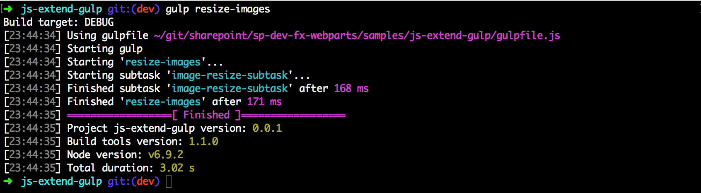
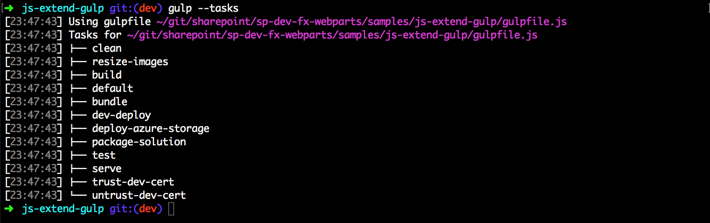

<span data-ttu-id="f19c3-p108">Da wir den Stream definieren, geben wir den Stream in der Funktion `build.subTask` an die Buildpipeline zurück. Die Buildpipeline führt diesen gulp-Stream anschließend asynchron aus.</span><span class="sxs-lookup"><span data-stu-id="f19c3-p108">Since we are defining the stream, we return the stream in the `build.subTask` function to the build pipeline. The build pipeline will then asynchronously execute this gulp stream.</span></span>

```js
var imageResize = require('gulp-image-resize');

let imageResizeSubTask = build.subTask('image-resize-subtask', function(gulp, buildOptions, done){
    return gulp.src('images/*.jpg')
               .pipe(imageResize({
                   width: 100,
                   height: 100,
                   crop: false                   
               }))
               .pipe(gulp.dest(path.join(buildOptions.libFolder, 'images')))
});

let imageResizeTask = build.task('resize-images', imageResizeSubTask);
```

Da wir den Stream definieren, geben wir den Stream in der Funktion `build.subTask` an die Buildpipeline zurück. Die Buildpipeline führt diesen gulp-Stream anschließend asynchron aus. 

<span data-ttu-id="f19c3-148">Nun können Sie das Task wie folgt über die gulp-Befehlszeile ausführen:</span><span class="sxs-lookup"><span data-stu-id="f19c3-148">Now, you can execute this task from the gulp command line as follows:</span></span>

```js
gulp resize-images
```



<span data-ttu-id="f19c3-150">Außerdem wird das Task `resize-images` in den für Ihr Projekt verfügbaren Tasks aufgeführt, wenn Sie `gulp --tasks` ausführen:</span><span class="sxs-lookup"><span data-stu-id="f19c3-150">You will also see this `resize-images` task in the available tasks for your project when you execute `gulp --tasks`:</span></span>




