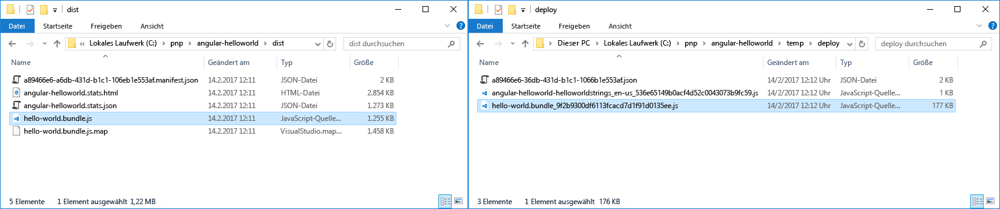
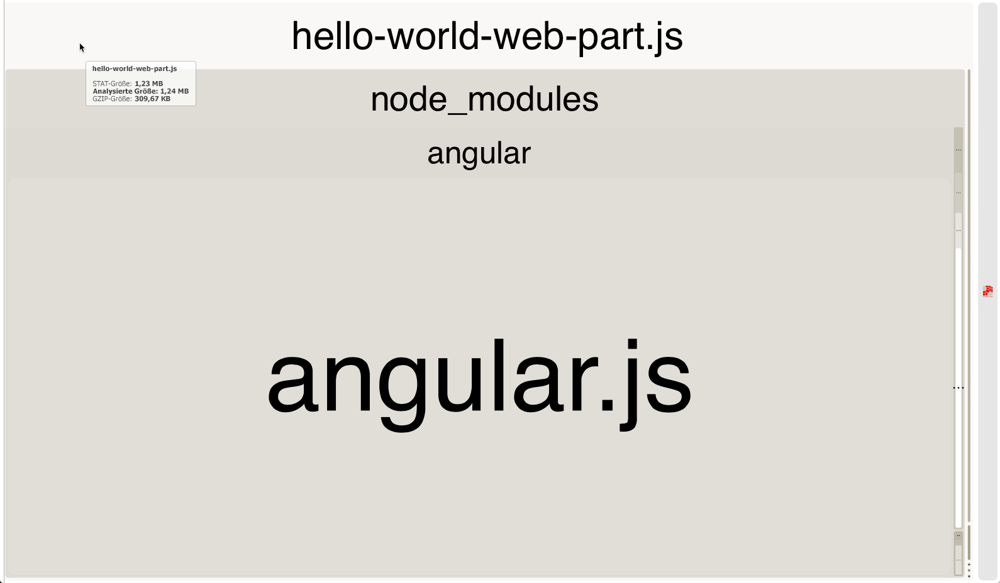
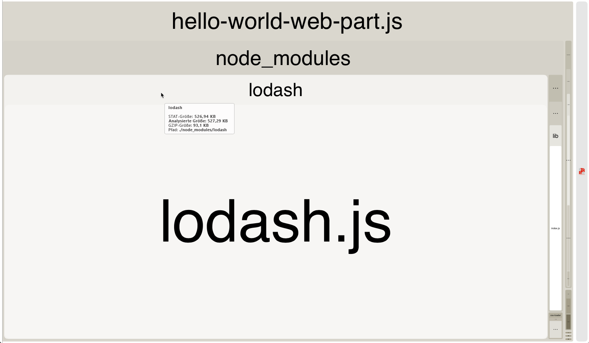

# <a name="optimize-builds-for-production"></a>Optimieren von Builds für die Produktion

Beim Bereitstellen von SharePoint Framework-Lösungen für die Produktion sollten Sie immer einen Releasebuild Ihres Projekts verwenden, der für Leistung optimiert ist. Dieser Artikel beschreibt die wichtigsten Unterschiede zwischen Debug- und Releasebuilds und zeigt, wie Sie Ihr Bundle für die Verwendung in Produktionsumgebungen optimieren können.

## <a name="use-release-builds-in-production"></a>Verwenden von Releasebuilds in der Produktion

Beim Erstellen eines SharePoint Framework-Projekts können Sie auswählen, ob es im Debug- oder Releasemodus erstellt werden soll. Standardmäßig werden SharePoint Framework-Projekte im Debugmodus erstellt, in dem Code leichter gedebuggt werden kann. Wenn der Code jedoch abgeschlossen ist und wie erwartet funktioniert, sollten Sie ihn im Releasemodus erstellen, um ihn für die Ausführung in der Produktionsumgebung zu optimieren.

> Weitere Informationen zum Erstellen des Projekts im Releasemodus finden Sie im Artikel [SharePoint-Framework-Toolkette](./sharepoint-framework-toolchain.md).

Der Hauptunterschied zwischen der Ausgabe eines Debug- und eines Releasebuilds besteht darin, dass die Releaseversion des generierten Bundles minimiert und wesentlich kleiner ist als ihre Debugentsprechung. Um den Unterschied zu verdeutlichen, vergleichen Sie die Größe der Debug- und der Releaseversion eines SharePoint Framework-Projekts mit einem Webpart unter Verwendung von Angular.



Die Größe der Debugversion des Bundles beträgt 1255 KB, während die Releaseversion nur 177 KB groß ist. Der Größenunterschied zwischen der Debug- und der Releaseversion des generierten Bundles variiert in Abhängigkeit von den in Ihrem Projekt verwendeten Bibliotheken. Der Releasebuild ist doch immer wesentlich kleiner als der Debugbuild, deshalb sollten Sie immer die Ausgabe von Releasebuilds für die Produktion bereitstellen.

## <a name="dont-include-third-party-libraries-in-the-bundle"></a>Schließen Sie keine Drittanbieterbibliotheken in das Bundle ein

Beim Erstellen von SharePoint Framework-Lösungen können Sie von vielen vorhandenen JavaScript-Bibliotheken zur Lösung häufig auftretender Probleme profitieren. Dank der Verwendung vorhandener Bibliotheken können Sie produktiver arbeiten und sich auf den Mehrwert für Ihre Organisation konzentrierten anstatt allgemeine Funktionen zu entwickeln, die für Ihre Lösung erforderlich sind.

Beim Verweisen auf Drittanbieterbibliotheken schließt SharePoint Framework diese standardmäßig in das generierte Bundle ein. Benutzer, die mit Ihrer Lösung arbeiten, würden daher letztendlich dieselbe Bibliothek mehrmals herunterladen - einmal pro Komponente. Die Gesamtgröße der Seite würde stark steigen, sodass der Ladevorgang länger dauert, was zu einer schlechteren Erfahrung für den Benutzer, insbesondere in langsameren Netzwerken, führt.


Beim Arbeiten mit Drittanbieterbibliotheken sollten Sie immer in Betracht ziehen, diese von einem externen Speicherort zu laden: entweder aus einem öffentlichen CDN oder von einem Hostingspeicherort im Besitz Ihrer Organisation. Erst einmal können Sie auf diese Weise die Bibliothek aus dem Bundle ausschließen, wodurch die Größe wesentlich reduziert wird. Wenn der Hostingspeicherort, von dem Sie die Bibliothek laden, für statische Ressourcen optimiert ist, müssen Benutzer, die mit Ihrer Lösung arbeiten, die Bibliothek außerdem nur einmal laden.  Bei nachfolgenden Anforderungen oder auch, wenn die Lösung in der Zukunft verwendet wird, verwendet der Webbrowser die zuvor zwischengespeicherte Kopie der Bibliothek wieder und lädt diese nicht erneut herunter. Dementsprechend wird die Seite mit der Lösung wesentlich schneller geladen.

## <a name="verify-the-contents-of-your-bundle"></a>Überprüfen des Bundleinhalts

Zum besseren Verständnis der Größe der generierten Bundles können Sie die Webpack-Konfiguration in Ihrem Projekt so erweitern, dass SharePoint-Framework Bundlestatistiken generiert.

Installieren Sie zunächst das Paket **webpack-bundle-analyzer** in Ihrem Projekt, indem Sie den folgenden Befehl in der Befehlszeile ausführen:

```sh
npm install webpack-bundle-analyzer --save-dev
```

Ändern Sie anschließend den Inhalt der Datei **gulpfile.js** in Ihrem Projekt zu:

```js
'use strict';

const gulp = require('gulp');
const path = require('path');
const build = require('@microsoft/sp-build-web');
const bundleAnalyzer = require('webpack-bundle-analyzer');

build.configureWebpack.mergeConfig({
  additionalConfiguration: (generatedConfiguration) => {
    const lastDirName = path.basename(__dirname);
    const dropPath = path.join(__dirname, 'temp', 'stats');
    generatedConfiguration.plugins.push(new bundleAnalyzer.BundleAnalyzerPlugin({
      openAnalyzer: false,
      analyzerMode: 'static',
      reportFilename: path.join(dropPath, `${lastDirName}.stats.html`),
      generateStatsFile: true,
      statsFilename: path.join(dropPath, `${lastDirName}.stats.json`),
      logLevel: 'error'
    }));

    return generatedConfiguration;
  }
});

build.initialize(gulp);
```

Beim nächsten Bündeln des Projekts mithilfe der `gulp bundle`-Aufgabe werden die generierten Bundlestatistikdateien im Ordner **temp/stats** in Ihrem Projekt angezeigt. Bei einer der generierten Statistikdateien handelt es sich um ein Treemap-Diagramm mit den anderen Skripts, die im generierten Bundle enthalten sind. Sie finden diese Darstellung in der Datei **./temp/stats/[solution-name].stats.html**.



Mit dem Treempa-Diagramm „Webpack Bundle Analyzer“ können Sie ganz einfach überprüfen, ob das generierte Bundle unnötige Skripts enthält und wie sich die enthaltenen Skripts auf die Gesamtgröße des Bundles auswirken. Bedenken Sie, dass die angezeigte Größe den Debugbuild widerspiegelt und bei einem Releasebuild wesentlich kleiner wäre.

Ausführlichere Informationen, die zum Generieren des Diagramms verwendet werden, sind in der Datei **./dist/[solution-name].stats.json** enthalten. Mithilfe dieser Datei können Sie herausfinden, warum ein bestimmtes Skript in das Bundle einschlossen wurde oder ob ein bestimmtes Skript in mehreren Bundles verwendet wird. Mithilfe dieser Informationen können Sie Ihre Pakete optimieren, um die Ladezeit für Ihre Lösung zu verbessern.

## <a name="choose-your-primary-client-side-library"></a>Auswählen der primären clientseitigen Bibliothek

Wenn es mehrere Komponenten auf derselben Seite oder auch auf unterschiedlichen Seiten über das Portal hinweg gibt und alle dieselbe Bibliothek verwenden, die von der gleichen URL geladen wurde, verwendet der Webbrowser die zuvor zwischengespeicherte Kopie wieder, was dazu führt, dass das Portal schneller geladen wird. Das ist genau der Grund, warum es für Organisationen so wichtig ist zu erkenne, welche Bibliotheken und welche Version sie verwenden und woher diese geladen werden, und zwar nicht nur für ein bestimmtes Projekt, sondern für die gesamte Organisation. Mit einer derartigen Richtlinie können Benutzer, die mit den unterschiedlichen Anwendungen arbeiten, produktiver arbeiten, da die Anwendungen schneller geladen werden. Indem die zuvor heruntergeladenen Ressourcen wiederverwendet werden, wird auch die Last im Netzwerk beschränkt, sodass Bandbreite für andere Zwecke freigegeben wird.

> Weitere Informationen zum Arbeiten mit externen Bibliotheken finden Sie im Artikel [Verwenden vorhandener JavaScript-Bibliotheken in clientseitigen SharePoint-Framework-Webparts](../web-parts/guidance/use-existing-javascript-libraries.md).

## <a name="reference-only-the-necessary-components"></a>Nur auf die notwendigen Komponenten verweisen

Wenn Sie mit externen Bibliotheken arbeiten, benötigen Sie manchmal vielleicht die gesamte Bibliothek, sondern nur einen kleinen Teil davon. Das Einschließen der gesamten Bibliothek würde die Größe des Bundles unnötig erhöhen, sodass sich auch die Ladezeit verlängert. Stattdessen sollten Sie immer in Betracht ziehen, nur die Teile der jeweiligen Bibliothek zu laden, die Sie tatsächlich benötigen.

Um dies zu verdeutlichen, nehmen wir die Bibliothek [Lodash](https://lodash.com) als Beispiel. Lodash ist eine Sammlung von Dienstprogrammen, die Ihnen beim Ausführen bestimmter Vorgänge in Ihrem Code behilflich sind. Die Wahrscheinlichkeit ist hoch, dass Sie beim Arbeiten mit Lodash nur ein paar spezifische Methoden und nicht die vollständige Bibliothek benötigen. Wenn Sie jedoch mithilfe des folgenden Codes auf die gesamte Bibliothek verwiesen haben:

```ts
import * as _ from 'lodash';
```

Dies würde Ihrem nicht optimierten Bundle 527 KB hinzufügen.



Wenn Sie stattdessen mit dem folgenden Code nur auf die spezifische Lodash-Methode verwiesen haben:

```ts
const at: any = require('lodash/at');
```

Dies würde Ihrem nicht optimierten Bundle 45 KB hinzufügen.


Das Verweisen auf spezifische Methoden im Gegensatz zur gesamten Bibliothek hat, insbesondere im Hinblick auf Lodash, aber auch bei anderen Bibliotheken, seinen Preis. In Lodash wird das Laden spezifischer Methoden innerhalb von SharePoint Framework-Projekten mithilfe der **import**-Notation derzeit nicht unterstützt. Stattdessen müssen Sie eine **require**-Anweisung verwenden, die nicht die typesafety-Funktionen wie die Verwendung der **import**-Anweisung bietet. Letztendlich müssen Sie entscheiden, ob das Laden von wesentlich mehr Code in Ihren Bundles das Aufrechterhalten der typesafety-Funktionen wert ist.

> Einige der Lodash-Methoden werden im SharePoint-Framework in der Bibliothek **@microsoft/sp-lodash-subset** bereitgestellt. Überprüfen Sie vor der Verwendung von Lodash, ob die Methode, die Sie verwenden möchten, nicht bereits in der **@microsoft/sp-lodash-subset**-Bibliothek verfügbar ist, die bereits als Teil des SharePoint-Framework verfügbar ist und nicht in Ihr Bundle eingeschlossen werden muss.
