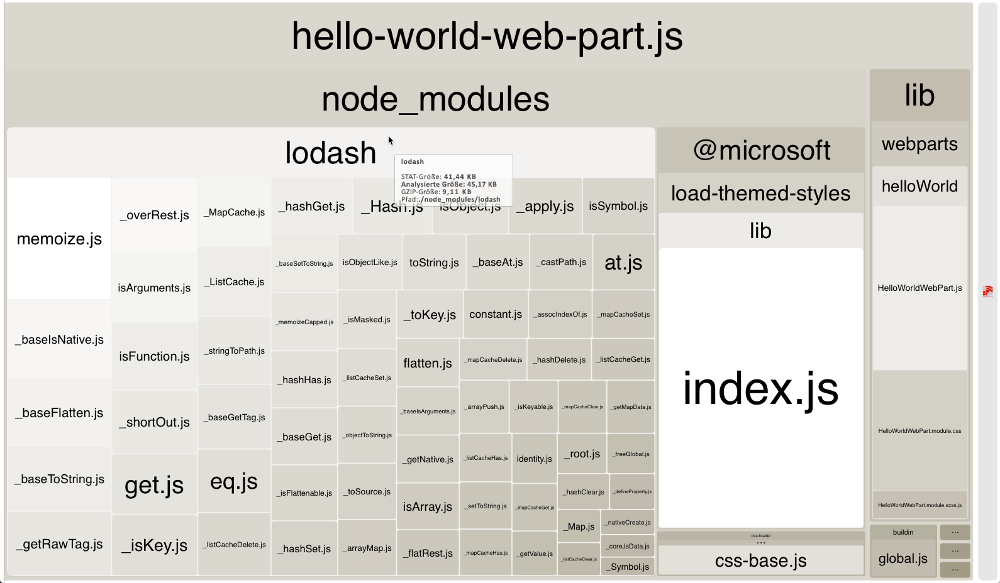

# <a name="optimize-builds-for-production"></a><span data-ttu-id="8a638-102">Optimieren von Builds für die Produktion</span><span class="sxs-lookup"><span data-stu-id="8a638-102">Optimize builds for production</span></span>

<span data-ttu-id="8a638-p101">Beim Bereitstellen von SharePoint Framework-Lösungen für die Produktion sollten Sie immer einen Releasebuild Ihres Projekts verwenden, der für Leistung optimiert ist. Dieser Artikel beschreibt die wichtigsten Unterschiede zwischen Debug- und Releasebuilds und zeigt, wie Sie Ihr Bundle für die Verwendung in Produktionsumgebungen optimieren können.</span><span class="sxs-lookup"><span data-stu-id="8a638-p101">When deploying SharePoint Framework solutions to production you should always use a release build of your project which is optimized for performance. This article illustrates the main differences between debug and release builds and shows how you can optimize your bundle for use in production environments.</span></span>

## <a name="use-release-builds-in-production"></a><span data-ttu-id="8a638-105">Verwenden von Releasebuilds in der Produktion</span><span class="sxs-lookup"><span data-stu-id="8a638-105">Use release builds in production</span></span>

<span data-ttu-id="8a638-p102">Beim Erstellen eines SharePoint Framework-Projekts können Sie auswählen, ob es im Debug- oder Releasemodus erstellt werden soll. Standardmäßig werden SharePoint Framework-Projekte im Debugmodus erstellt, in dem Code leichter gedebuggt werden kann. Wenn der Code jedoch abgeschlossen ist und wie erwartet funktioniert, sollten Sie ihn im Releasemodus erstellen, um ihn für die Ausführung in der Produktionsumgebung zu optimieren.</span><span class="sxs-lookup"><span data-stu-id="8a638-p102">When building a SharePoint Framework project, you can choose whether you want to build it in a debug or release mode. By default, SharePoint Framework projects are built in debug mode, which makes it easier for you to debug code. But when your code is finished and is working as expected, you should build it in release mode to optimize it for running in the production environment.</span></span>

> <span data-ttu-id="8a638-109">Weitere Informationen zum Erstellen des Projekts im Releasemodus finden Sie im Artikel [SharePoint-Framework-Toolkette](./sharepoint-framework-toolchain.md).</span><span class="sxs-lookup"><span data-stu-id="8a638-109">For more information about building your project in release mode, see the [SharePoint Framework Toolchain](./sharepoint-framework-toolchain.md) article.</span></span>

<span data-ttu-id="8a638-p103">Der Hauptunterschied zwischen der Ausgabe eines Debug- und eines Releasebuilds besteht darin, dass die Releaseversion des generierten Bundles minimiert und wesentlich kleiner ist als ihre Debugentsprechung. Um den Unterschied zu verdeutlichen, vergleichen Sie die Größe der Debug- und der Releaseversion eines SharePoint Framework-Projekts mit einem Webpart unter Verwendung von Angular.</span><span class="sxs-lookup"><span data-stu-id="8a638-p103">The main difference between the output of a debug and release build is, that the release version of the generated bundle is minified and significantly smaller in size than its debug equivalent. To illustrate the difference, compare the size of the debug and release version of a SharePoint Framework project with a web part using Angular.</span></span>


<span data-ttu-id="8a638-p104">Die Größe der Debugversion des Bundles beträgt 1255 KB, während die Releaseversion nur 177 KB groß ist. Der Größenunterschied zwischen der Debug- und der Releaseversion des generierten Bundles variiert in Abhängigkeit von den in Ihrem Projekt verwendeten Bibliotheken. Der Releasebuild ist doch immer wesentlich kleiner als der Debugbuild, deshalb sollten Sie immer die Ausgabe von Releasebuilds für die Produktion bereitstellen.</span><span class="sxs-lookup"><span data-stu-id="8a638-p104">The debug version of the bundle is 1255 KB while its release equivalent is only 177 KB. The difference in size between the debug and release version of the generated bundle will differ depending on the libraries used in your project. Still, the release build will always be significantly smaller than a debug build, which is why you should always deploy the output of release builds to production.</span></span>

## <a name="dont-include-third-party-libraries-in-the-bundle"></a><span data-ttu-id="8a638-116">Schließen Sie keine Drittanbieterbibliotheken in das Bundle ein</span><span class="sxs-lookup"><span data-stu-id="8a638-116">Don't include third party libraries in the bundle</span></span>

<span data-ttu-id="8a638-p105">Beim Erstellen von SharePoint Framework-Lösungen können Sie von vielen vorhandenen JavaScript-Bibliotheken zur Lösung häufig auftretender Probleme profitieren. Dank der Verwendung vorhandener Bibliotheken können Sie produktiver arbeiten und sich auf den Mehrwert für Ihre Organisation konzentrierten anstatt allgemeine Funktionen zu entwickeln, die für Ihre Lösung erforderlich sind.</span><span class="sxs-lookup"><span data-stu-id="8a638-p105">When building SharePoint Framework solutions, you can benefit of many existing JavaScript libraries to solve common problems. Using existing libraries allows you to be more productive and lets you focus on the added value for your organization, instead of on developing generic functionality, required by your solution.</span></span>

<span data-ttu-id="8a638-p106">Beim Verweisen auf Drittanbieterbibliotheken schließt SharePoint Framework diese standardmäßig in das generierte Bundle ein. Benutzer, die mit Ihrer Lösung arbeiten, würden daher letztendlich dieselbe Bibliothek mehrmals herunterladen - einmal pro Komponente. Die Gesamtgröße der Seite würde stark steigen, sodass der Ladevorgang länger dauert, was zu einer schlechteren Erfahrung für den Benutzer, insbesondere in langsameren Netzwerken, führt.</span><span class="sxs-lookup"><span data-stu-id="8a638-p106">By default, when referencing third party libraries in your project, SharePoint Framework will include them in the generated bundle. As a result, users working with your solution, would end up downloading the same library multiple times - once with each component. The total page size would grow significantly taking longer to load and leading to a poor user experience, particularly on slower networks.</span></span>


<span data-ttu-id="8a638-p107">Beim Arbeiten mit Drittanbieterbibliotheken sollten Sie immer in Betracht ziehen, diese von einem externen Speicherort zu laden: entweder aus einem öffentlichen CDN oder von einem Hostingspeicherort im Besitz Ihrer Organisation. Erst einmal können Sie auf diese Weise die Bibliothek aus dem Bundle ausschließen, wodurch die Größe wesentlich reduziert wird. Wenn der Hostingspeicherort, von dem Sie die Bibliothek laden, für statische Ressourcen optimiert ist, müssen Benutzer, die mit Ihrer Lösung arbeiten, die Bibliothek außerdem nur einmal laden.  Bei nachfolgenden Anforderungen oder auch, wenn die Lösung in der Zukunft verwendet wird, verwendet der Webbrowser die zuvor zwischengespeicherte Kopie der Bibliothek wieder und lädt diese nicht erneut herunter. Dementsprechend wird die Seite mit der Lösung wesentlich schneller geladen.</span><span class="sxs-lookup"><span data-stu-id="8a638-p107">When working with third party libraries, you should always consider loading them from an external location: either a public CDN or a hosting location owned by your organization. First of all, this allows you to exclude the library from your bundle, significantly decreasing its size. Additionally, if the hosting location from which you are loading the library is optimized for serving static assets, users working with your solution will need to load the library only once. On subsequent requests, or even when using your solution in the future, the web browser will reuse the previously cached copy of the library rather than downloading it again. As a result, the page with your solution will load significantly faster.</span></span>

## <a name="verify-the-contents-of-your-bundle"></a><span data-ttu-id="8a638-128">Überprüfen des Bundleinhalts</span><span class="sxs-lookup"><span data-stu-id="8a638-128">Verify the contents of your bundle</span></span>

<span data-ttu-id="8a638-129">Zum besseren Verständnis der Größe der generierten Bundles können Sie die Webpack-Konfiguration in Ihrem Projekt so erweitern, dass SharePoint-Framework Bundlestatistiken generiert.</span><span class="sxs-lookup"><span data-stu-id="8a638-129">To better understand the size of the generated bundles, you can extend the webpack configuration in your project and have the SharePoint Framework generate bundle statistics.</span></span>

<span data-ttu-id="8a638-130">Installieren Sie zunächst das Paket **webpack-bundle-analyzer** in Ihrem Projekt, indem Sie den folgenden Befehl in der Befehlszeile ausführen:</span><span class="sxs-lookup"><span data-stu-id="8a638-130">First, install the **webpack-bundle-analyzer** package in your project, by executing in the command line:</span></span>

```sh
npm install webpack-bundle-analyzer --save-dev
```

<span data-ttu-id="8a638-131">Ändern Sie anschließend den Inhalt der Datei **gulpfile.js** in Ihrem Projekt zu:</span><span class="sxs-lookup"><span data-stu-id="8a638-131">Next, change the contents of the **gulpfile.js** file in your project to:</span></span>

```js
'use strict';

const gulp = require('gulp');
const path = require('path');
const build = require('@microsoft/sp-build-web');
const bundleAnalyzer = require('webpack-bundle-analyzer');

build.configureWebpack.mergeConfig({
  additionalConfiguration: (generatedConfiguration) => {
    const lastDirName = path.basename(__dirname);
    const dropPath = path.join(__dirname, 'temp', 'stats');
    generatedConfiguration.plugins.push(new bundleAnalyzer.BundleAnalyzerPlugin({
      openAnalyzer: false,
      analyzerMode: 'static',
      reportFilename: path.join(dropPath, `${lastDirName}.stats.html`),
      generateStatsFile: true,
      statsFilename: path.join(dropPath, `${lastDirName}.stats.json`),
      logLevel: 'error'
    }));

    return generatedConfiguration;
  }
});

build.initialize(gulp);
```

<span data-ttu-id="8a638-132">Beim nächsten Bündeln des Projekts mithilfe der `gulp bundle`-Aufgabe werden die generierten Bundlestatistikdateien im Ordner **temp/stats** in Ihrem Projekt angezeigt.</span><span class="sxs-lookup"><span data-stu-id="8a638-132">Next time you bundle your project using the `gulp bundle` task, you will see the bundle stats files generated in the **temp/stats** folder in your project.</span></span> <span data-ttu-id="8a638-133">Bei einer der generierten Statistikdateien handelt es sich um ein Treemap-Diagramm mit den anderen Skripts, die im generierten Bundle enthalten sind.</span><span class="sxs-lookup"><span data-stu-id="8a638-133">One of the generated stats file, is a treemap showing the different scripts included in the generated bundle.</span></span> <span data-ttu-id="8a638-134">Sie finden diese Darstellung in der Datei **./temp/stats/[solution-name].stats.html**.</span><span class="sxs-lookup"><span data-stu-id="8a638-134">You can find this visualization in the **./temp/stats/[solution-name].stats.html** file.</span></span>


<span data-ttu-id="8a638-136">Mit dem Treempa-Diagramm „Webpack Bundle Analyzer“ können Sie ganz einfach überprüfen, ob das generierte Bundle unnötige Skripts enthält und wie sich die enthaltenen Skripts auf die Gesamtgröße des Bundles auswirken.</span><span class="sxs-lookup"><span data-stu-id="8a638-136">Using the Webpack Visualizer chart is a convenient way for you to verify, that the generated bundle doesn't contain any unnecessary scripts and how the included scripts affect the total bundle size. Keep in mind, that the displayed size reflects the debug build and would be significantly smaller for a release build.</span></span> <span data-ttu-id="8a638-137">Bedenken Sie, dass die angezeigte Größe den Debugbuild widerspiegelt und bei einem Releasebuild wesentlich kleiner wäre.</span><span class="sxs-lookup"><span data-stu-id="8a638-137">Keep in mind, that the displayed size reflects the debug build and would be significantly smaller for a release build.</span></span>

<span data-ttu-id="8a638-138">Ausführlichere Informationen, die zum Generieren des Diagramms verwendet werden, sind in der Datei **./dist/[solution-name].stats.json** enthalten.</span><span class="sxs-lookup"><span data-stu-id="8a638-138">More detailed information, used to generate the visualization, is included in the **./dist/[solution-name].stats.json** file.</span></span> <span data-ttu-id="8a638-139">Mithilfe dieser Datei können Sie herausfinden, warum ein bestimmtes Skript in das Bundle einschlossen wurde oder ob ein bestimmtes Skript in mehreren Bundles verwendet wird.</span><span class="sxs-lookup"><span data-stu-id="8a638-139">More detailed information, used to generate the chart, is included in the ./dist/[solution-name].stats.json file. Using this file you can find out why a specific script has been included in the bundle or if a particular script is used in multiple bundles. With this information you can optimize your bundles improving the loading time of your solution.</span></span> <span data-ttu-id="8a638-140">Mithilfe dieser Informationen können Sie Ihre Pakete optimieren, um die Ladezeit für Ihre Lösung zu verbessern.</span><span class="sxs-lookup"><span data-stu-id="8a638-140">With this information you can optimize your bundles improving the loading time of your solution.</span></span>

## <a name="choose-your-primary-client-side-library"></a><span data-ttu-id="8a638-141">Auswählen der primären clientseitigen Bibliothek</span><span class="sxs-lookup"><span data-stu-id="8a638-141">Choose your primary client-side library</span></span>

<span data-ttu-id="8a638-p111">Wenn es mehrere Komponenten auf derselben Seite oder auch auf unterschiedlichen Seiten über das Portal hinweg gibt und alle dieselbe Bibliothek verwenden, die von der gleichen URL geladen wurde, verwendet der Webbrowser die zuvor zwischengespeicherte Kopie wieder, was dazu führt, dass das Portal schneller geladen wird. Das ist genau der Grund, warum es für Organisationen so wichtig ist zu erkenne, welche Bibliotheken und welche Version sie verwenden und woher diese geladen werden, und zwar nicht nur für ein bestimmtes Projekt, sondern für die gesamte Organisation. Mit einer derartigen Richtlinie können Benutzer, die mit den unterschiedlichen Anwendungen arbeiten, produktiver arbeiten, da die Anwendungen schneller geladen werden. Indem die zuvor heruntergeladenen Ressourcen wiederverwendet werden, wird auch die Last im Netzwerk beschränkt, sodass Bandbreite für andere Zwecke freigegeben wird.</span><span class="sxs-lookup"><span data-stu-id="8a638-p111">If there are multiple components on the same page, or even on different pages across the portal, and they all use the same library loaded from the same URL, the web browser will also reuse the copy it cached previously, which will lead to the portal loading faster. This is exactly why it is essential for organizations to rationalize which libraries and in which versions they use and where they load them from, not only for a specific project but for the whole organization. Such policy will let users working with the different applications be more productive by loading the applications faster. By reusing the previously downloaded assets, it will also limit the load on the network freeing its bandwidth for other purposes.</span></span>

> <span data-ttu-id="8a638-146">Weitere Informationen zum Arbeiten mit externen Bibliotheken finden Sie im Artikel [Verwenden vorhandener JavaScript-Bibliotheken in clientseitigen SharePoint-Framework-Webparts](../web-parts/guidance/use-existing-javascript-libraries.md).</span><span class="sxs-lookup"><span data-stu-id="8a638-146">For more information about working with external libraries see the [Use existing JavaScript libraries in SharePoint Framework client-side web parts](../web-parts/guidance/use-existing-javascript-libraries.md) article.</span></span>

## <a name="reference-only-the-necessary-components"></a><span data-ttu-id="8a638-147">Nur auf die notwendigen Komponenten verweisen</span><span class="sxs-lookup"><span data-stu-id="8a638-147">Reference only the necessary components</span></span>

<span data-ttu-id="8a638-p112">Wenn Sie mit externen Bibliotheken arbeiten, benötigen Sie manchmal vielleicht die gesamte Bibliothek, sondern nur einen kleinen Teil davon. Das Einschließen der gesamten Bibliothek würde die Größe des Bundles unnötig erhöhen, sodass sich auch die Ladezeit verlängert. Stattdessen sollten Sie immer in Betracht ziehen, nur die Teile der jeweiligen Bibliothek zu laden, die Sie tatsächlich benötigen.</span><span class="sxs-lookup"><span data-stu-id="8a638-p112">Sometimes, when working with external libraries, you might actually not need the whole library but only a small portion of it. Including the whole library will unnecessary add to the size of your bundle increasing its load time. Instead, you should always consider loading only the specific parts of the particular library that you actually need.</span></span>

<span data-ttu-id="8a638-151">Um dies zu verdeutlichen, nehmen wir die Bibliothek [Lodash](https://lodash.com) als Beispiel.</span><span class="sxs-lookup"><span data-stu-id="8a638-151">To illustrate this, take the [Lodash](https://lodash.com) library as an example.</span></span> <span data-ttu-id="8a638-152">Lodash ist eine Sammlung von Dienstprogrammen, die Ihnen beim Ausführen bestimmter Vorgänge in Ihrem Code behilflich sind.</span><span class="sxs-lookup"><span data-stu-id="8a638-152">Lodash is a collection of utilities helping you to perform certain operations in your code.</span></span> <span data-ttu-id="8a638-153">Die Wahrscheinlichkeit ist hoch, dass Sie beim Arbeiten mit Lodash nur ein paar spezifische Methoden und nicht die vollständige Bibliothek benötigen.</span><span class="sxs-lookup"><span data-stu-id="8a638-153">The odds are high, that when working with Lodash, you will only need a few specific methods rather than the complete library.</span></span> <span data-ttu-id="8a638-154">Wenn Sie jedoch mithilfe des folgenden Codes auf die gesamte Bibliothek verwiesen haben:</span><span class="sxs-lookup"><span data-stu-id="8a638-154">If you however referenced the whole library using the following code:</span></span>

```ts
import * as _ from 'lodash';
```

<span data-ttu-id="8a638-155">Dies würde Ihrem nicht optimierten Bundle 527 KB hinzufügen.</span><span class="sxs-lookup"><span data-stu-id="8a638-155">It would add 42 KB to your unoptimized bundle.</span></span>


<span data-ttu-id="8a638-157">Wenn Sie stattdessen mit dem folgenden Code nur auf die spezifische Lodash-Methode verwiesen haben:</span><span class="sxs-lookup"><span data-stu-id="8a638-157">Instead, if you referenced only the specific Lodash method using the following code:</span></span>

```ts
const at: any = require('lodash/at');
```

<span data-ttu-id="8a638-158">Dies würde Ihrem nicht optimierten Bundle 45 KB hinzufügen.</span><span class="sxs-lookup"><span data-stu-id="8a638-158">It would add 42 KB to your unoptimized bundle.</span></span>



<span data-ttu-id="8a638-160">Das Verweisen auf spezifische Methoden im Gegensatz zur gesamten Bibliothek hat, insbesondere im Hinblick auf Lodash, aber auch bei anderen Bibliotheken, seinen Preis.</span><span class="sxs-lookup"><span data-stu-id="8a638-160">Specifically with regards to Lodash, but which could also be the case with other libraries, referencing specific methods instead of the whole library comes with a price.</span></span> <span data-ttu-id="8a638-161">In Lodash wird das Laden spezifischer Methoden innerhalb von SharePoint Framework-Projekten mithilfe der **import**-Notation derzeit nicht unterstützt.</span><span class="sxs-lookup"><span data-stu-id="8a638-161">Currently, Lodash doesn't support loading specific methods inside of SharePoint Framework projects using the **import** notation.</span></span> <span data-ttu-id="8a638-162">Stattdessen müssen Sie eine **require**-Anweisung verwenden, die nicht die typesafety-Funktionen wie die Verwendung der **import**-Anweisung bietet.</span><span class="sxs-lookup"><span data-stu-id="8a638-162">Instead, you have to use a **require** statement which doesn't offer you the typesafety capabilities that using the **import** statement does.</span></span> <span data-ttu-id="8a638-163">Letztendlich müssen Sie entscheiden, ob das Laden von wesentlich mehr Code in Ihren Bundles das Aufrechterhalten der typesafety-Funktionen wert ist.</span><span class="sxs-lookup"><span data-stu-id="8a638-163">Eventually it is up to you to decide if loading significantly more code into your bundles is worth preserving the typesafety capabilities.</span></span>

> <span data-ttu-id="8a638-164">Einige der Lodash-Methoden werden im SharePoint-Framework in der Bibliothek **@microsoft/sp-lodash-subset** bereitgestellt.</span><span class="sxs-lookup"><span data-stu-id="8a638-164">Some of the Lodash methods are provided with the SharePoint Framework in the **@microsoft/sp-lodash-subset** library.</span></span> <span data-ttu-id="8a638-165">Überprüfen Sie vor der Verwendung von Lodash, ob die Methode, die Sie verwenden möchten, nicht bereits in der **@microsoft/sp-lodash-subset**-Bibliothek verfügbar ist, die bereits als Teil des SharePoint-Framework verfügbar ist und nicht in Ihr Bundle eingeschlossen werden muss.</span><span class="sxs-lookup"><span data-stu-id="8a638-165">Some of the Lodash methods are provided with the SharePoint Framework in the @microsoft/sp-lodash-subset library. Before using Lodash, verify if the method that you want to use isn't already available in the **@microsoft/sp-lodash-subset** library, which is already available as a part of the SharePoint Framework and does not need to be included in your bundle.</span></span>
