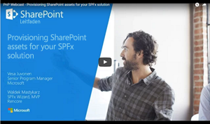

# <a name="provision-sharepoint-assets-with-your-solution-package"></a>Bereitstellen von SharePoint-Objekten mit dem Lösungspaket

Manchmal müssen Sie vielleicht eine SharePoint-Liste oder einer Dokumentbibliothek zusammen mit Ihrem clientseitigen Lösungspaket bereitstellen, damit diese Liste oder Bibliothek für Ihre clientseitigen Komponenten, z. B. Webparts, verfügbar ist. Mit der SharePoint Framework-Toolkette können Sie SharePoint-Elemente mit ihrem clientseitigen Lösungspaket verpacken und bereitstellen. Diese Elemente werden dann bereitgestellt werden, wenn die clientseitige Lösung auf einer Website installiert wird. 

Details zu den Bereitstellungsoptionen finden Sie auch in einem der SharePoint PnP-Webcasts im [YouTube-Kanal von SharePoint PnP](https://www.youtube.com/watch?v=r-UdJhhHlEQ&list=PLR9nK3mnD-OUnJytlXlO84fQnYt50iTmS). 

<a href="https://www.youtube.com/watch?v=r-UdJhhHlEQ&list=PLR9nK3mnD-OUnJytlXlO84fQnYt50iTmS">

</a>


## <a name="provisioning-items-using-javascript-code"></a>Bereitstellen von Elementen mithilfe von JavaScript-Code

Es ist zwar möglich, SharePoint-Elemente mithilfe von JavaScript-Code in Ihrer Komponente, z. B. Webparts, zu erstellen, dies ist jedoch auf den Kontext des aktuellen Benutzers beschränkt, der diese Komponente verwendet. Wenn der Benutzer nicht über ausreichende Berechtigungen zum Erstellen oder Ändern von SharePoint-Elementen verfügt, stellt der JavaScript-Code diese Elemente nicht bereit. Wenn Sie SharePoint-Elemente in einem Kontext mit erhöhten Rechten bereitstellen möchten, müssen Sie in solchen Fällen die Elemente zusammen mit Ihrem Lösungspaket verpacken und bereitstellen.

## <a name="create-and-provision-sharepoint-items-in-your-solution"></a>Erstellen und Bereitstellen von SharePoint-Elementen in Ihrer Lösung

### <a name="sharepoint-items"></a>SharePoint-Elemente

Die folgenden SharePoint-Ressourcen können zusammen mit Ihrem clientseitigen Lösungspaket bereitgestellt werden:

* Felder
* Inhaltstypen
* Listeninstanzen
* Listeninstanzen mit benutzerdefinierten Schema

#### <a name="fields"></a>Felder

Ein Feld oder eine Websitespalte stellt ein Attribut oder Metadaten dar, die der Benutzer für die Elemente in der Liste oder im Inhaltstyp verwalten möchte, zu der bzw. dem sie die Spalte hinzugefügt haben. Es handelt sich um eine wieder verwendbare Spaltendefinition oder Vorlage, die Sie mehreren Listen über mehrere SharePoint-Websites hinweg zuweisen können. Websitespalten reduzieren den Überarbeitungsaufwand und helfen Ihnen, die Konsistenz von Metadaten über Websites und Listen hinweg sicherzustellen. 

Nehmen wir beispielsweise an, dass Sie eine Websitespalte mit dem Namen „Kunde“ definieren. Benutzer können diese Spalte zu ihren Listen hinzufügen und in ihren Inhaltstypen darauf verweisen. Dadurch wird sichergestellt, dass die Spalte – zumindest zu Beginn – dieselben Attribute aufweist, unabhängig davon, wo sie angezeigt wird.

Sie können in der Dokumentation [Feldelement](https://msdn.microsoft.com/en-us/library/aa979575(v=office.15).aspx) die Informationen über das Schema und die Attribute nachlesen, um ein neues Feld in Ihrer Lösung zu definieren. 

Nachfolgend sehen Sie ein Beispiel für ein neues DateTime-Feld:

```xml
<Field ID="{1511BF28-A787-4061-B2E1-71F64CC93FD5}"
            Name="DateOpened"
            DisplayName="Date Opened"
            Type="DateTime"
            Format="DateOnly"
            Required="FALSE"
            Group="Financial Columns">
        <Default>[today]</Default>
    </Field>
```
#### <a name="content-types"></a>Inhaltstypen

Ein Inhaltstyp ist eine wieder verwendbare Sammlung von Metadaten (Spalten), Verhaltensweisen und anderen Einstellungen für eine Kategorie von Elementen oder Dokumenten in einer SharePoint-Liste oder Dokumentbibliothek. Mit Inhaltstypen können Sie Einstellungen für eine Kategorie von Informationen auf zentrale und wiederverwendbare Weise verwalten.

Stellen Sie sich beispielsweise ein Geschäftsszenario vor, in dem Sie mit drei verschiedenen Dokumenttypen arbeiten: Spesenabrechnungen, Bestellungen und Rechnungen. Alle drei Dokumenttypen weisen bestimmte gemeinsame Merkmale auf. Bei allen handelt es sich beispielsweise um Finanzdokumente, und alle enthalten Daten mit Währungswerten. Dennoch gelten für jeden Dokumenttyp spezifische Datenanforderungen, eine eigene Dokumentvorlage und ein eigener Workflow. Eine Lösung für dieses Problem könnte darin bestehen, vier Inhaltstypen zu erstellen. Der erste Inhaltstyp, Finanzdokument, könnte die Datenanforderungen enthalten, die in allen Finanzdokumenten in der Organisation gemeinsam vorkommen. Die verbleibenden drei Inhaltstypen, Spesenabrechnung, Bestellung und Rechnung, können die gemeinsamen Elemente von Finanzdokument erben. Darüber hinaus könnten sie Merkmale definieren, die für die einzelnen Typen spezifisch sind, z. B. eine spezielle Menge von Metadaten, eine Dokumentvorlage, die beim Erstellen eines neuen Elements verwendet werden soll, und ein spezieller Workflow für die Verarbeitung eines Elements.

Sie können in der Dokumentation [Inhaltstypelement](https://msdn.microsoft.com/de-DE/library/aa544268.aspx) die Informationen über das Schema und die Attribute nachlesen, um einen neuen Inhaltstyp in Ihrer Lösung zu definieren. 

Nachfolgend sehen Sie ein Beispiel für einen Inhaltstyp:

```xml
<ContentType ID="0x010042D0C1C200A14B6887742B6344675C8B" 
    Name="Cost Center" 
    Group="Financial Content Types" 
    Description="Financial Content Type">
    <FieldRefs>
        <FieldRef ID="{1511BF28-A787-4061-B2E1-71F64CC93FD5}" />
        <FieldRef ID="{060E50AC-E9C1-4D3C-B1F9-DE0BCAC300F6}" /> 
    </FieldRefs>
</ContentType> 
```

#### <a name="lists-instances"></a>Listeninstanzen

Listen sind ein wichtiges, zugrunde liegendes Feature einer SharePoint-Website. Team können damit Informationen sammeln, nachverfolgen und freigeben. Viele Clientanwendungen basieren auf Listen, die in der Website zur Datenspeicherung erstellt wurden, um ihre Verhaltensweisen zu implementieren. Eine Listeninstanz ist eine vordefinierte SharePoint-Liste, die einen bekannten Bezeichner aufweist. Sie können Elemente anpassen und zu diesen Listen hinzufügen, zusätzliche Listen aus den bereits verfügbaren Listenvorlagen erstellen und benutzerdefinierte Listen mit den ausgewählten Einstellungen und Spalten erstellen.

SharePoint bietet mehrere Listenvorlagen, z. B. Kontaktlisten, Kalender, Aufgabenlisten usw. Sie können diese Vorlagen verwenden, um neue Listeninstanzen für Ihre Webparts oder andere Komponenten zu erstellen. Sie können z. B. die Listeninstanz „Finanzdokumente“ basierend auf der Vorlage für die Dokumentbibliothek definieren, um zugehörige Dokumente mit dem Webpart zu speichern. 

Sie können in der Dokumentation [Listeninstanzelement](https://msdn.microsoft.com/de-DE/library/office/ms476062.aspx) die Informationen über das Schema und die Attribute nachlesen, um einen neuen Listeninstanz in Ihrer Lösung zu definieren.

Es folgt ein Beispiel für eine Listeninstanzdefinition:

```xml
<ListInstance 
    FeatureId="00bfea71-e717-4e80-aa17-d0c71b360101"
    Title="Finance Records" 
    Description="Finance documents"
    TemplateType="101"
    Url="Lists/FinanceRecords">
</ListInstance>
```

#### <a name="lists-instances-with-custom-schema"></a>Listeninstanzen mit benutzerdefiniertem Schema

Sie können eine benutzerdefinierte Listenschemadefinition verwenden, um Ihre Felder, Inhaltstypen und Ansichten zu definieren, die in Ihrer Listeninstanz verwendet werden. Das `customschema`-Attribut im [Listeninstanzelement](https://msdn.microsoft.com/de-DE/library/office/ms476062.aspx#sectionSection0) wird verwendet, um auf ein benutzerdefiniertes Schema für die Listeninstanz zu verweisen. 

Sie können beispielsweise die Listeninstanz „Finanzdokumente“ mit dem Inhaltstyp „Finanzdokument“ definieren, der die Datenanforderungen kapseln könnte, die alle Finanzdokumente in der Organisation gemeinsam haben. 

Nachfolgend sehen Sie ein Beispiel einer Listeninstanzdefinition, die ein benutzerdefiniertes Schema verwendet:

```xml
<ListInstance 
    CustomSchema="schema.xml"
    FeatureId="00bfea71-de22-43b2-a848-c05709900100"
    Title="Cost Centers" 
    Description="Cost Centers"
    TemplateType="100"
    Url="Lists/CostCenters">
</ListInstance>
```
Und die benutzerdefinierte Schemadefinition, die einen Inhaltstyp für die oben definierte Listeninstanz definiert:

```xml
<List xmlns:ows="Microsoft SharePoint" Title="Basic List" EnableContentTypes="TRUE" FolderCreation="FALSE" Direction="$Resources:Direction;" Url="Lists/Basic List" BaseType="0" xmlns="http://schemas.microsoft.com/sharepoint/">
  <MetaData>
    <ContentTypes>
      <ContentTypeRef ID="0x010042D0C1C200A14B6887742B6344675C8B" />
    </ContentTypes>
    <Fields></Fields>
    <Views>
      <View BaseViewID="1" Type="HTML" WebPartZoneID="Main" DisplayName="$Resources:core,objectiv_schema_mwsidcamlidC24;" DefaultView="TRUE" MobileView="TRUE" MobileDefaultView="TRUE" SetupPath="pages\viewpage.aspx" ImageUrl="/_layouts/images/generic.png" Url="AllItems.aspx">
        <XslLink Default="TRUE">main.xsl</XslLink>
        <JSLink>clienttemplates.js</JSLink>
        <RowLimit Paged="TRUE">30</RowLimit>
        <Toolbar Type="Standard" />
        <ViewFields>
          <FieldRef Name="LinkTitle"></FieldRef>
          <FieldRef Name="SPFxAmount"></FieldRef>
          <FieldRef Name="SPFxCostCenter"></FieldRef>
        </ViewFields>
        <Query>
          <OrderBy>
            <FieldRef Name="ID" />
          </OrderBy>
        </Query>
      </View>
    </Views>
    <Forms>
      <Form Type="DisplayForm" Url="DispForm.aspx" SetupPath="pages\form.aspx" WebPartZoneID="Main" />
      <Form Type="EditForm" Url="EditForm.aspx" SetupPath="pages\form.aspx" WebPartZoneID="Main" />
      <Form Type="NewForm" Url="NewForm.aspx" SetupPath="pages\form.aspx" WebPartZoneID="Main" />
    </Forms>
  </MetaData>
</List>
```
### <a name="create-sharepoint-items-in-your-solution"></a>Erstellen von SharePoint-Elementen in Ihrer Lösung

Das Lösungspaket verwendet [SharePoint-Features](https://msdn.microsoft.com/en-us/library/ee537350(office.14).aspx) zum Verpacken und Bereitstellen der SharePoint-Elemente. Ein Feature ist ein Container, der ein oder mehrere SharePoint-Elemente für die Bereitstellung enthält. Eine Feauture enthält eine Feature.xml-Datei und eine oder mehrere Elementmanifestdateien. Diese XML-Dateien werden auch als Featuredefinitionen bezeichnet. 

Ein clientseitiges Lösungspaket enthält in der Regel ein Feature. Dieses Feature wird aktiviert, wenn die Lösung auf einer Website installiert wird. Es ist wichtig zu beachten, dass die Websiteadministratoren Ihr Lösungspaket und nicht das Feature installieren. 

Ein Feature wird in erster Linie mithilfe der folgenden XML-Dateien erstellt:

**Elementmanifestdatei**

Die Elementmanifestdatei enthält die SharePoint-Elementdefinitionen und wird ausgeführt, wenn das Feature aktiviert wird. Beispiel: Die XML-Definitionen zum Erstellen eines neuen Felds, Inhaltstyps oder einer Listeninstanz befinden sich im Elementmanifest. 

Nachfolgend finden Sie in Beispiel einer Elementmanifestdatei, die ein neues DateTime-Feld definiert.

```xml
<?xml version="1.0" encoding="utf-8"?>
<Elements xmlns="http://schemas.microsoft.com/sharepoint/">
    <Field ID="{1511BF28-A787-4061-B2E1-71F64CC93FD5}"
            Name="DateOpened"
            DisplayName="Date Opened"
            Type="DateTime"
            Format="DateOnly"
            Required="FALSE"
            Group="Financial Columns">
        <Default>[today]</Default>
    </Field>
  </Elements>
```

**Elementdatei**

Alle unterstützten Dateien, die das Elementmanifest begleiten, sind Elementdateien. Die Listenschemainstanz ist beispielsweise ein Elementmanifest, das einer Listeninstanz zugeordnet ist, die in einem Elementmanifest definiert ist. 

Nachfolgend sehen Sie ein Beispiel für ein benutzerdefiniertes Listeninstanzschema:

```xml
<List xmlns:ows="Microsoft SharePoint" Title="Basic List" EnableContentTypes="TRUE" FolderCreation="FALSE"
      Direction="$Resources:Direction;" Url="Lists/Basic List" BaseType="0" xmlns="http://schemas.microsoft.com/sharepoint/">
  <MetaData>
    <ContentTypes>
      <ContentTypeRef ID="0x010042D0C1C200A14B6887742B6344675C8B" />
    </ContentTypes>    
  </MetaData>
</List>
```

**Upgradeaktionendatei**

Wie der Name schon sagt, ist das die Datei, die alle Upgradeaktionen umfasst, wenn die Lösung in der Website aktualisiert wird. Als Teil der Upgradeaktionen könnte die Aktion angeben, dass auch ein oder mehrere Elementmanifeste eingeschlossen werden. Beispiel: Wenn für das Upgrade ein neues Feld hinzugefügt werden muss, ist die Felddefinition als Elementmanifest verfügbar und wird der Datei mit Upgradeaktionen zugeordnet. 

Nachfolgend sehen Sie ein Beispiel für eine Datei mit Upgradeaktionen, die eine Elementmanifestdatei während des Upgrades anwendet:

```xml
<ApplyElementManifests>
      <ElementManifest Location="9c0be970-a4d7-41bb-be21-4a683586db18\elements-v2.xml" />
</ApplyElementManifests>
```

#### <a name="configure-the-sharepoint-feature"></a>Konfigurieren des SharePoint-Features 

Damit die XML-Dateien eingeschlossen werden, müssen Sie zunächst die Featurekonfiguration in der Konfigurationsdatei *package-solution.json* unterhalb des Ordners *config* in Ihrem Projekt definieren. Die Datei *package-solution.json* enthält die wichtigsten Metadateninformationen zu Ihrem clientseitigen Lösungspaket, und es wird auf die Datei verwiesen, wenn Sie den gulp-Task in `package-solution` ausführen, durch den Ihre Lösung in einer `.sppkg`-Datei verpackt wird. 

```json
{
  "solution": {
    "name": "hello-world-client-side-solution",
    "id": "26364618-3056-4b45-98c1-39450adc5723",
    "version": "1.1.0.0",
    "features": [{
      "title": "hello-world-client-side-solution",
      "description": "hello-world-client-side-solution",
      "id": "d46cd9d6-87fc-473b-a4c0-db9ad9162b64",
      "version": "1.1.0.0",
      "assets": {        
        "elementManifests": [
          "elements.xml"
        ],
        "elementFiles":[
          "schema.xml"
        ],
        "upgradeActions":[
            "upgrade-actions-v1.xml"
        ]
      }
    }]
  },  
  "paths": {
    "zippedPackage": "solution/hello-world.sppkg"
  }
}
``` 
Das `features`-JSON-Objekt enthält die Metadaten über das Feature:

Eigenschaft | Beschreibung 
-----|------
id|Eindeutiger Bezeichner (GUID) des Features
title|Der Titel des Features
description| Beschreibung des Features
assets|Ein Array von XML-Dateien, die in dem Feature verwendet werden
elementManifests|Ein Array von Elementmanifestdateien, definiert in der `assets`-Eigenschaft
elementFiles|Ein Array von Elementdateien, definiert in der `assets`-Eigenschaft
upgradeActions|Ein Array von Upgradeaktionsdateien, definiert in der `assets`-Eigenschaft

#### <a name="create-the-feature-xml-files"></a>Erstellen der Feature-XML-Dateien

Die Toolkette sucht in Ihrem clientseitigen Lösungsprojekt nach den XML-Dateien, wie in der Konfiguration unterhalb eines bestimmten Ordners definiert – *sharepoint\assets*. 


Durch die in der `package-solution.json` definierten Konfigurationen werden die XML-Dateien hier ihrer entsprechenden Feature-XML-Datei zugeordnet, wenn der gulp-Task in `package-solution` ausgeführt wird.

#### <a name="package-sharepoint-items"></a>Verpacken von SharePoint-Elementen 

Nachdem Sie Ihr Feature in der `package-solution.json` definiert und die entsprechenden Feature-XML-Dateien erstellt haben, können Sie den folgenden gulp-Task verwenden, um die SharePoint-Elemente zusammen mit Ihrem `.sppkg`-Paket zu verpacken.

```js
gulp package-solution
```

Der oben aufgeführte Befehl verpackt eine oder mehrere clientseitige Komponentenmanifeste, z. B. WebParts, zusammen mit den Feature-XML-Dateien, auf die in der `package-solution.json`-Konfigurationsdatei verwiesen wird.

> [!NOTE] 
> Sie können das `--ship`-Flag verwenden, um minimierte Versionen Ihrer Komponenten zu verpacken. 

#### <a name="upgrade-sharepoint-items"></a>Aktualisieren von SharePoint-Elementen

Sie können neue SharePoint-Elemente einschließen oder vorhandene SharePoint-Elemente aktualisieren, wenn Sie Ihre clientseitige Lösung aktualisieren. Da beim Bereitstellen von SharePoint-Elementen Features verwendet werden, Sie verwenden Sie die XML-Datei [Featureupgradeaktionen](https://msdn.microsoft.com/en-us/library/office/ee537575(v=office.14).aspx), um eine Liste von Upgradeaktionen zu definieren.

Das `upgradeActions`-JSON-Objektarray in der `package-solution.json` verweist auf die Feature-XML-Dateien, die den Upgradeaktionen für Ihr Feature zugeordnet sind. Eine Upgradeaktionsdatei definiert auf jeden Fall die Elementmanifest-XML-Datei, die ausgeführt wird, wenn das Feature aktualisiert wird. 

Wenn Sie eine SharePoint Framework-Lösung aktualisieren, müssen Sie auch die Versionsattribute für Lösung und Feature aktualisieren, dort, wo Sie die Upgradeaktionen eingefügt haben. Eine Heraufsetzung der Lösungsversion zeigt SharePoint und Endbenutzern, dass eine neue Version des Pakets verfügbar ist. Eine Heraufsetzung der Featureelementversion stellt sicher, dass die in den Upgradeaktionen definierten Tasks während des Lösungsupgrades abgearbeitet werden. 

Nachfolgend sehen Sie ein Beispiel für eine Datei mit Upgradeaktionen, die eine Elementmanifestdatei während des Upgrades anwendet:

```xml
<ApplyElementManifests>
      <ElementManifest Location="9c0be970-a4d7-41bb-be21-4a683586db18\elements-v2.xml" />
</ApplyElementManifests>
```

Und die entsprechende `element-v2.xml`, die ein neues Währungsfeld definiert, das während des Upgrades definiert wird.

```xml
<?xml version="1.0" encoding="utf-8"?>
<Elements xmlns="http://schemas.microsoft.com/sharepoint/">
    <Field ID="{060E50AC-E9C1-4D3C-B1F9-DE0BCAC300F6}"
            Name="Amount"
            DisplayName="Amount"
            Type="Currency"
            Decimals="2"
            Min="0"
            Required="FALSE"
            Group="Financial Columns" />
</Elements>
```

Upgradeaktionen in clientseitigen Lösungen unterstützen die folgenden Unterelemente:


**AddContentTypeField**

Fügt ein neues Feld zu einem vorhandenen bereitgestellten Inhaltstyp hinzu. Gibt die Änderung des Websiteinhaltstyps an alle untergeordneten Listen und Inhaltstypen innerhalb der Website weiter. Beispiel:

```xml
<AddContentTypeField 
     ContentTypeId="0x010100A6F9CE1AFE2A48f0A3E6CB5BB770B0F7" 
     FieldId="{B250DCFD-9310-4e2d-85F2-BE2DA37A57D2}" 
     PushDown="TRUE" />
```

**ApplyElementManifests**

Fügt ein vorhandenes Element zu einem vorhandenen Feature hinzu. Wenn eine Funktion aktualisiert wird, werden alle nicht deklarativen Elemente, auf die in den angegebenen Elementmanifesten verwiesen wird, bereitgestellt.

**VersionRange**

Gibt einen Versionsbereich an, auf den die angegebenen Upgradeaktionen angewendet werden.

## <a name="see-also"></a>Siehe auch
<a name="bk_addresources"> </a>

-  [SharePoint PnP-Webcast: Provisioning SharePoint assets for your SPFx solution](https://www.youtube.com/watch?v=r-UdJhhHlEQ&list=PLR9nK3mnD-OUnJytlXlO84fQnYt50iTmS)
    
-  [Tutorial: Provisioning SharePoint assets from your SharePoint client-side web part](https://dev.office.com/sharepoint/docs/spfx/web-parts/get-started/provision-sp-assets-from-package)

-  
  [SharePoint-Baustein: Features](https://msdn.microsoft.com/de-DE/library/ee537350.aspx)

-  [Featureframework: Verwendung des UpgradeActions-Elements](https://msdn.microsoft.com/de-DE/library/office/ee537575.aspx)

-  [Featureframework: Field-Element](https://msdn.microsoft.com/de-DE/library/aa979575.aspx)

-  [Featureframework: ContentType-Element](https://msdn.microsoft.com/de-DE/library/aa544268.aspx)

-  [Featureframework: ListInstance-Element](https://msdn.microsoft.com/de-DE/library/office/ms476062.aspx)
