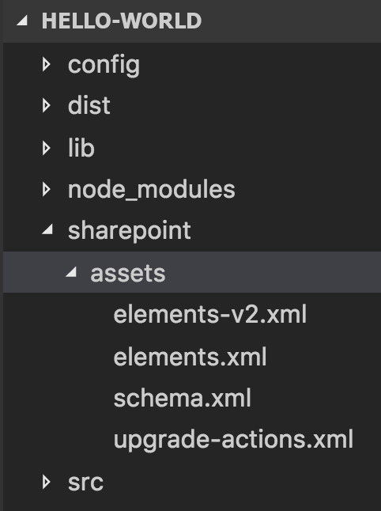

# <a name="provision-sharepoint-assets-with-your-solution-package"></a><span data-ttu-id="4241d-102">Bereitstellen von SharePoint-Objekten mit dem Lösungspaket</span><span class="sxs-lookup"><span data-stu-id="4241d-102">Provision SharePoint assets with your solution package</span></span>

<span data-ttu-id="4241d-p101">Manchmal müssen Sie vielleicht eine SharePoint-Liste oder einer Dokumentbibliothek zusammen mit Ihrem clientseitigen Lösungspaket bereitstellen, damit diese Liste oder Bibliothek für Ihre clientseitigen Komponenten, z. B. Webparts, verfügbar ist. Mit der SharePoint Framework-Toolkette können Sie SharePoint-Elemente mit ihrem clientseitigen Lösungspaket verpacken und bereitstellen. Diese Elemente werden dann bereitgestellt werden, wenn die clientseitige Lösung auf einer Website installiert wird.</span><span class="sxs-lookup"><span data-stu-id="4241d-p101">At times, you may need to provision a SharePoint list or a document library along with your client-side solution package so that that list or library is available for your client-side components, such as web parts. SharePoint Framework toolchain allows you to package and deploy SharePoint items with your client-side solution package. These items are then provisioned when the client-side solution is installed on a site.</span></span> 

<span data-ttu-id="4241d-106">Details zu den Bereitstellungsoptionen finden Sie auch in einem der SharePoint PnP-Webcasts im [YouTube-Kanal von SharePoint PnP](https://www.youtube.com/watch?v=r-UdJhhHlEQ&list=PLR9nK3mnD-OUnJytlXlO84fQnYt50iTmS).</span><span class="sxs-lookup"><span data-stu-id="4241d-106">You can also find details on the provisioning options from a SharePoint PnP webcast available from [SharePoint PnP YouTube Channel](https://www.youtube.com/watch?v=r-UdJhhHlEQ&list=PLR9nK3mnD-OUnJytlXlO84fQnYt50iTmS).</span></span> 

<a href="https://www.youtube.com/watch?v=r-UdJhhHlEQ&list=PLR9nK3mnD-OUnJytlXlO84fQnYt50iTmS">

</a>


## <a name="provisioning-items-using-javascript-code"></a><span data-ttu-id="4241d-107">Bereitstellen von Elementen mithilfe von JavaScript-Code</span><span class="sxs-lookup"><span data-stu-id="4241d-107">Provisioning items using JavaScript code</span></span>

<span data-ttu-id="4241d-p102">Es ist zwar möglich, SharePoint-Elemente mithilfe von JavaScript-Code in Ihrer Komponente, z. B. Webparts, zu erstellen, dies ist jedoch auf den Kontext des aktuellen Benutzers beschränkt, der diese Komponente verwendet. Wenn der Benutzer nicht über ausreichende Berechtigungen zum Erstellen oder Ändern von SharePoint-Elementen verfügt, stellt der JavaScript-Code diese Elemente nicht bereit. Wenn Sie SharePoint-Elemente in einem Kontext mit erhöhten Rechten bereitstellen möchten, müssen Sie in solchen Fällen die Elemente zusammen mit Ihrem Lösungspaket verpacken und bereitstellen.</span><span class="sxs-lookup"><span data-stu-id="4241d-p102">While it is possible to create SharePoint items using JavaScript code in your component, such as web parts, it is limited to context of the current user using that component. If the user doesn't have sufficient permissions to create or modify SharePoint items, the JavaScript code will not provision those items. In such cases, when you want to provision SharePoint items in an elevated context, you will need to package and deploy the items along with your solution package.</span></span>

## <a name="create-and-provision-sharepoint-items-in-your-solution"></a><span data-ttu-id="4241d-111">Erstellen und Bereitstellen von SharePoint-Elementen in Ihrer Lösung</span><span class="sxs-lookup"><span data-stu-id="4241d-111">Create and provision SharePoint items in your solution</span></span>

### <a name="sharepoint-items"></a><span data-ttu-id="4241d-112">SharePoint-Elemente</span><span class="sxs-lookup"><span data-stu-id="4241d-112">SharePoint items</span></span>

<span data-ttu-id="4241d-113">Die folgenden SharePoint-Ressourcen können zusammen mit Ihrem clientseitigen Lösungspaket bereitgestellt werden:</span><span class="sxs-lookup"><span data-stu-id="4241d-113">The following SharePoint assets can be provisioned along with your client-side solution package:</span></span>

* <span data-ttu-id="4241d-114">Felder</span><span class="sxs-lookup"><span data-stu-id="4241d-114">Fields</span></span>
* <span data-ttu-id="4241d-115">Inhaltstypen</span><span class="sxs-lookup"><span data-stu-id="4241d-115">Content Types</span></span>
* <span data-ttu-id="4241d-116">Listeninstanzen</span><span class="sxs-lookup"><span data-stu-id="4241d-116">List Instances</span></span>
* <span data-ttu-id="4241d-117">Listeninstanzen mit benutzerdefinierten Schema</span><span class="sxs-lookup"><span data-stu-id="4241d-117">List Instances with custom schema</span></span>

#### <a name="fields"></a><span data-ttu-id="4241d-118">Felder</span><span class="sxs-lookup"><span data-stu-id="4241d-118">Fields</span></span>

<span data-ttu-id="4241d-p103">Ein Feld oder eine Websitespalte stellt ein Attribut oder Metadaten dar, die der Benutzer für die Elemente in der Liste oder im Inhaltstyp verwalten möchte, zu der bzw. dem sie die Spalte hinzugefügt haben. Es handelt sich um eine wieder verwendbare Spaltendefinition oder Vorlage, die Sie mehreren Listen über mehrere SharePoint-Websites hinweg zuweisen können. Websitespalten reduzieren den Überarbeitungsaufwand und helfen Ihnen, die Konsistenz von Metadaten über Websites und Listen hinweg sicherzustellen.</span><span class="sxs-lookup"><span data-stu-id="4241d-p103">A field or a site column represents an attribute, or piece of metadata, that the user wants to manage for the items in the list or content type to which they added the column. It is a reusable column definition, or template, that you can assign to multiple lists across multiple SharePoint sites. Site columns decrease rework and help you ensure consistency of metadata across sites and lists.</span></span> 

<span data-ttu-id="4241d-p104">Nehmen wir beispielsweise an, dass Sie eine Websitespalte mit dem Namen „Kunde“ definieren. Benutzer können diese Spalte zu ihren Listen hinzufügen und in ihren Inhaltstypen darauf verweisen. Dadurch wird sichergestellt, dass die Spalte – zumindest zu Beginn – dieselben Attribute aufweist, unabhängig davon, wo sie angezeigt wird.</span><span class="sxs-lookup"><span data-stu-id="4241d-p104">For example, suppose you define a site column named Customer. Users can add that column to their lists, and reference it in their content types. This ensures that the column has the same attributes—at least to start with—wherever it appears.</span></span>

<span data-ttu-id="4241d-125">Sie können in der Dokumentation [Feldelement](https://msdn.microsoft.com/en-us/library/aa979575(v=office.15).aspx) die Informationen über das Schema und die Attribute nachlesen, um ein neues Feld in Ihrer Lösung zu definieren.</span><span class="sxs-lookup"><span data-stu-id="4241d-125">You can refer to the schema and attributes in the [Field Element](https://msdn.microsoft.com/en-us/library/aa979575(v=office.15).aspx) documentation to define a new field in your solution.</span></span> 

<span data-ttu-id="4241d-126">Nachfolgend sehen Sie ein Beispiel für ein neues DateTime-Feld:</span><span class="sxs-lookup"><span data-stu-id="4241d-126">Below is an example of a new DateTime field:</span></span>

```xml
<Field ID="{1511BF28-A787-4061-B2E1-71F64CC93FD5}"
            Name="DateOpened"
            DisplayName="Date Opened"
            Type="DateTime"
            Format="DateOnly"
            Required="FALSE"
            Group="Financial Columns">
        <Default>[today]</Default>
    </Field>
```
#### <a name="content-types"></a><span data-ttu-id="4241d-127">Inhaltstypen</span><span class="sxs-lookup"><span data-stu-id="4241d-127">Content Types</span></span>

<span data-ttu-id="4241d-p105">Ein Inhaltstyp ist eine wieder verwendbare Sammlung von Metadaten (Spalten), Verhaltensweisen und anderen Einstellungen für eine Kategorie von Elementen oder Dokumenten in einer SharePoint-Liste oder Dokumentbibliothek. Mit Inhaltstypen können Sie Einstellungen für eine Kategorie von Informationen auf zentrale und wiederverwendbare Weise verwalten.</span><span class="sxs-lookup"><span data-stu-id="4241d-p105">A content type is a reusable collection of metadata (columns), behavior, and other settings for a category of items or documents in a SharePoint list or document library. Content types enable you to manage the settings for a category of information in a centralized, reusable way.</span></span>

<span data-ttu-id="4241d-p106">Stellen Sie sich beispielsweise ein Geschäftsszenario vor, in dem Sie mit drei verschiedenen Dokumenttypen arbeiten: Spesenabrechnungen, Bestellungen und Rechnungen. Alle drei Dokumenttypen weisen bestimmte gemeinsame Merkmale auf. Bei allen handelt es sich beispielsweise um Finanzdokumente, und alle enthalten Daten mit Währungswerten. Dennoch gelten für jeden Dokumenttyp spezifische Datenanforderungen, eine eigene Dokumentvorlage und ein eigener Workflow. Eine Lösung für dieses Problem könnte darin bestehen, vier Inhaltstypen zu erstellen. Der erste Inhaltstyp, Finanzdokument, könnte die Datenanforderungen enthalten, die in allen Finanzdokumenten in der Organisation gemeinsam vorkommen. Die verbleibenden drei Inhaltstypen, Spesenabrechnung, Bestellung und Rechnung, können die gemeinsamen Elemente von Finanzdokument erben. Darüber hinaus könnten sie Merkmale definieren, die für die einzelnen Typen spezifisch sind, z. B. eine spezielle Menge von Metadaten, eine Dokumentvorlage, die beim Erstellen eines neuen Elements verwendet werden soll, und ein spezieller Workflow für die Verarbeitung eines Elements.</span><span class="sxs-lookup"><span data-stu-id="4241d-p106">For example, imagine a business situation in which you have three different types of documents: expense reports, purchase orders, and invoices. All three types of documents have some characteristics in common; for one thing, they are all financial documents and contain data with values in currency. Yet each type of document has its own data requirements, its own document template, and its own workflow. One solution to this business problem is to create four content types. The first content type, Financial Document, could encapsulate data requirements that are common to all financial documents in the organization. The remaining three, Expense Report, Purchase Order, and Invoice, could inherit common elements from Financial Document. In addition, they could define characteristics that are unique to each type, such as a particular set of metadata, a document template to be used in creating a new item, and a specific workflow for processing an item.</span></span>

<span data-ttu-id="4241d-137">Sie können in der Dokumentation [Inhaltstypelement](https://msdn.microsoft.com/de-DE/library/aa544268.aspx) die Informationen über das Schema und die Attribute nachlesen, um einen neuen Inhaltstyp in Ihrer Lösung zu definieren.</span><span class="sxs-lookup"><span data-stu-id="4241d-137">You can refer to the schema and attributes in the [Content Type Element](https://msdn.microsoft.com/de-DE/library/aa544268.aspx) documentation to define a new content type in your solution.</span></span> 

<span data-ttu-id="4241d-138">Nachfolgend sehen Sie ein Beispiel für einen Inhaltstyp:</span><span class="sxs-lookup"><span data-stu-id="4241d-138">Below is an example of a content type:</span></span>

```xml
<ContentType ID="0x010042D0C1C200A14B6887742B6344675C8B" 
    Name="Cost Center" 
    Group="Financial Content Types" 
    Description="Financial Content Type">
    <FieldRefs>
        <FieldRef ID="{1511BF28-A787-4061-B2E1-71F64CC93FD5}" />
        <FieldRef ID="{060E50AC-E9C1-4D3C-B1F9-DE0BCAC300F6}" /> 
    </FieldRefs>
</ContentType> 
```

#### <a name="lists-instances"></a><span data-ttu-id="4241d-139">Listeninstanzen</span><span class="sxs-lookup"><span data-stu-id="4241d-139">Lists Instances</span></span>

<span data-ttu-id="4241d-p107">Listen sind ein wichtiges, zugrunde liegendes Feature einer SharePoint-Website. Team können damit Informationen sammeln, nachverfolgen und freigeben. Viele Clientanwendungen basieren auf Listen, die in der Website zur Datenspeicherung erstellt wurden, um ihre Verhaltensweisen zu implementieren. Eine Listeninstanz ist eine vordefinierte SharePoint-Liste, die einen bekannten Bezeichner aufweist. Sie können Elemente anpassen und zu diesen Listen hinzufügen, zusätzliche Listen aus den bereits verfügbaren Listenvorlagen erstellen und benutzerdefinierte Listen mit den ausgewählten Einstellungen und Spalten erstellen.</span><span class="sxs-lookup"><span data-stu-id="4241d-p107">Lists are a key, underlying feature of a SharePoint site. They enable teams to gather, track, and share information. Many applications rely on lists created at the site for data storage to implement their behaviors. A list instance is a predefined SharePoint list that has a well-known identifier. You can customize and add items to these lists, create additional lists from the list templates that are already available, and create custom lists with just the settings and columns that you choose.</span></span>

<span data-ttu-id="4241d-p108">SharePoint bietet mehrere Listenvorlagen, z. B. Kontaktlisten, Kalender, Aufgabenlisten usw. Sie können diese Vorlagen verwenden, um neue Listeninstanzen für Ihre Webparts oder andere Komponenten zu erstellen. Sie können z. B. die Listeninstanz „Finanzdokumente“ basierend auf der Vorlage für die Dokumentbibliothek definieren, um zugehörige Dokumente mit dem Webpart zu speichern.</span><span class="sxs-lookup"><span data-stu-id="4241d-p108">SharePoint provides several list templates such as contact list, calendar, task list and more. You can use these templates to create new list instances for your web parts or other components. For example, you can define a list instance Finance Documents based on the Document Library template to store associated documents with your web part.</span></span> 

<span data-ttu-id="4241d-148">Sie können in der Dokumentation [Listeninstanzelement](https://msdn.microsoft.com/de-DE/library/office/ms476062.aspx) die Informationen über das Schema und die Attribute nachlesen, um einen neuen Listeninstanz in Ihrer Lösung zu definieren.</span><span class="sxs-lookup"><span data-stu-id="4241d-148">You can refer to the schema and attributes in the [List Instance Element](https://msdn.microsoft.com/de-DE/library/office/ms476062.aspx) documentation to define a list instance in your solution.</span></span>

<span data-ttu-id="4241d-149">Es folgt ein Beispiel für eine Listeninstanzdefinition:</span><span class="sxs-lookup"><span data-stu-id="4241d-149">Below is an example of a list instance definition:</span></span>

```xml
<ListInstance 
    FeatureId="00bfea71-e717-4e80-aa17-d0c71b360101"
    Title="Finance Records" 
    Description="Finance documents"
    TemplateType="101"
    Url="Lists/FinanceRecords">
</ListInstance>
```

#### <a name="lists-instances-with-custom-schema"></a><span data-ttu-id="4241d-150">Listeninstanzen mit benutzerdefiniertem Schema</span><span class="sxs-lookup"><span data-stu-id="4241d-150">Lists Instances with custom schema</span></span>

<span data-ttu-id="4241d-151">Sie können eine benutzerdefinierte Listenschemadefinition verwenden, um Ihre Felder, Inhaltstypen und Ansichten zu definieren, die in Ihrer Listeninstanz verwendet werden.</span><span class="sxs-lookup"><span data-stu-id="4241d-151">You can use a custom list schema definition to define your fields, content types and views used in your list instance. You will use the  attribute in the list instance element to reference a custom schema for the list instance.</span></span> <span data-ttu-id="4241d-152">Das `customschema`-Attribut im [Listeninstanzelement](https://msdn.microsoft.com/de-DE/library/office/ms476062.aspx#sectionSection0) wird verwendet, um auf ein benutzerdefiniertes Schema für die Listeninstanz zu verweisen.</span><span class="sxs-lookup"><span data-stu-id="4241d-152">You can use a custom list schema definition to define your fields, content types and views used in your list instance. You will use the `customschema` attribute in the [list instance element](https://msdn.microsoft.com/de-DE/library/office/ms476062.aspx#sectionSection0) to reference a custom schema for the list instance.</span></span> 

<span data-ttu-id="4241d-153">Sie können beispielsweise die Listeninstanz „Finanzdokumente“ mit dem Inhaltstyp „Finanzdokument“ definieren, der die Datenanforderungen kapseln könnte, die alle Finanzdokumente in der Organisation gemeinsam haben.</span><span class="sxs-lookup"><span data-stu-id="4241d-153">For example, you can define a list instance Finance Documents with a content type Financial Document that could encapsulate data requirements that are common to all financial documents in the organization.</span></span> 

<span data-ttu-id="4241d-154">Nachfolgend sehen Sie ein Beispiel einer Listeninstanzdefinition, die ein benutzerdefiniertes Schema verwendet:</span><span class="sxs-lookup"><span data-stu-id="4241d-154">Below is an example of a list instance definition that uses a custom schema:</span></span>

```xml
<ListInstance 
    CustomSchema="schema.xml"
    FeatureId="00bfea71-de22-43b2-a848-c05709900100"
    Title="Cost Centers" 
    Description="Cost Centers"
    TemplateType="100"
    Url="Lists/CostCenters">
</ListInstance>
```
<span data-ttu-id="4241d-155">Und die benutzerdefinierte Schemadefinition, die einen Inhaltstyp für die oben definierte Listeninstanz definiert:</span><span class="sxs-lookup"><span data-stu-id="4241d-155">And the custom schema definition that defines a content type for the list instance defined above:</span></span>

```xml
<List xmlns:ows="Microsoft SharePoint" Title="Basic List" EnableContentTypes="TRUE" FolderCreation="FALSE" Direction="$Resources:Direction;" Url="Lists/Basic List" BaseType="0" xmlns="http://schemas.microsoft.com/sharepoint/">
  <MetaData>
    <ContentTypes>
      <ContentTypeRef ID="0x010042D0C1C200A14B6887742B6344675C8B" />
    </ContentTypes>
    <Fields></Fields>
    <Views>
      <View BaseViewID="1" Type="HTML" WebPartZoneID="Main" DisplayName="$Resources:core,objectiv_schema_mwsidcamlidC24;" DefaultView="TRUE" MobileView="TRUE" MobileDefaultView="TRUE" SetupPath="pages\viewpage.aspx" ImageUrl="/_layouts/images/generic.png" Url="AllItems.aspx">
        <XslLink Default="TRUE">main.xsl</XslLink>
        <JSLink>clienttemplates.js</JSLink>
        <RowLimit Paged="TRUE">30</RowLimit>
        <Toolbar Type="Standard" />
        <ViewFields>
          <FieldRef Name="LinkTitle"></FieldRef>
          <FieldRef Name="SPFxAmount"></FieldRef>
          <FieldRef Name="SPFxCostCenter"></FieldRef>
        </ViewFields>
        <Query>
          <OrderBy>
            <FieldRef Name="ID" />
          </OrderBy>
        </Query>
      </View>
    </Views>
    <Forms>
      <Form Type="DisplayForm" Url="DispForm.aspx" SetupPath="pages\form.aspx" WebPartZoneID="Main" />
      <Form Type="EditForm" Url="EditForm.aspx" SetupPath="pages\form.aspx" WebPartZoneID="Main" />
      <Form Type="NewForm" Url="NewForm.aspx" SetupPath="pages\form.aspx" WebPartZoneID="Main" />
    </Forms>
  </MetaData>
</List>
```
### <a name="create-sharepoint-items-in-your-solution"></a><span data-ttu-id="4241d-156">Erstellen von SharePoint-Elementen in Ihrer Lösung</span><span class="sxs-lookup"><span data-stu-id="4241d-156">Create SharePoint items in your solution</span></span>

<span data-ttu-id="4241d-157">Das Lösungspaket verwendet [SharePoint-Features](https://msdn.microsoft.com/en-us/library/ee537350(office.14).aspx) zum Verpacken und Bereitstellen der SharePoint-Elemente.</span><span class="sxs-lookup"><span data-stu-id="4241d-157">The solution package uses [SharePoint Features](https://msdn.microsoft.com/en-us/library/ee537350(office.14).aspx) to package and provision the SharePoint items.</span></span> <span data-ttu-id="4241d-158">Ein Feature ist ein Container, der ein oder mehrere SharePoint-Elemente für die Bereitstellung enthält.</span><span class="sxs-lookup"><span data-stu-id="4241d-158">A Feature is a container that includes one or more SharePoint items to provision.</span></span> <span data-ttu-id="4241d-159">Eine Feauture enthält eine Feature.xml-Datei und eine oder mehrere Elementmanifestdateien.</span><span class="sxs-lookup"><span data-stu-id="4241d-159">A Feature contains a Feature.xml file and one or more element manifest files.</span></span> <span data-ttu-id="4241d-160">Diese XML-Dateien werden auch als Featuredefinitionen bezeichnet.</span><span class="sxs-lookup"><span data-stu-id="4241d-160">These XML files are also known as Feature definitions.</span></span> 

<span data-ttu-id="4241d-p111">Ein clientseitiges Lösungspaket enthält in der Regel ein Feature. Dieses Feature wird aktiviert, wenn die Lösung auf einer Website installiert wird. Es ist wichtig zu beachten, dass die Websiteadministratoren Ihr Lösungspaket und nicht das Feature installieren.</span><span class="sxs-lookup"><span data-stu-id="4241d-p111">Typically, a client-side solution package contains one feature. This feature is activated when the solution is installed in a site. It is important to note that the site administrators install your solution package and not the feature.</span></span> 

<span data-ttu-id="4241d-164">Ein Feature wird in erster Linie mithilfe der folgenden XML-Dateien erstellt:</span><span class="sxs-lookup"><span data-stu-id="4241d-164">A feature is primarily constructed by using the following XML files:</span></span>

<span data-ttu-id="4241d-165">**Elementmanifestdatei**</span><span class="sxs-lookup"><span data-stu-id="4241d-165">**Element Manifest File**</span></span>

<span data-ttu-id="4241d-p112">Die Elementmanifestdatei enthält die SharePoint-Elementdefinitionen und wird ausgeführt, wenn das Feature aktiviert wird. Beispiel: Die XML-Definitionen zum Erstellen eines neuen Felds, Inhaltstyps oder einer Listeninstanz befinden sich im Elementmanifest.</span><span class="sxs-lookup"><span data-stu-id="4241d-p112">The element manifest file contains the SharePoint item definitions and will be executed when the feature is activated. For example: The XML definitions to create a new field or content type or list instance(s) will be in the element manifest.</span></span> 

<span data-ttu-id="4241d-168">Nachfolgend finden Sie in Beispiel einer Elementmanifestdatei, die ein neues DateTime-Feld definiert.</span><span class="sxs-lookup"><span data-stu-id="4241d-168">Below is an example of an element manifest file that defines a new DateTime field.</span></span>

```xml
<?xml version="1.0" encoding="utf-8"?>
<Elements xmlns="http://schemas.microsoft.com/sharepoint/">
    <Field ID="{1511BF28-A787-4061-B2E1-71F64CC93FD5}"
            Name="DateOpened"
            DisplayName="Date Opened"
            Type="DateTime"
            Format="DateOnly"
            Required="FALSE"
            Group="Financial Columns">
        <Default>[today]</Default>
    </Field>
  </Elements>
```

<span data-ttu-id="4241d-169">**Elementdatei**</span><span class="sxs-lookup"><span data-stu-id="4241d-169">**Element File**</span></span>

<span data-ttu-id="4241d-p113">Alle unterstützten Dateien, die das Elementmanifest begleiten, sind Elementdateien. Die Listenschemainstanz ist beispielsweise ein Elementmanifest, das einer Listeninstanz zugeordnet ist, die in einem Elementmanifest definiert ist.</span><span class="sxs-lookup"><span data-stu-id="4241d-p113">Any supported files that accompany the element manifest will be an element file. For example, the list instance schema is an element manifest that is associated with a list instance that is defined in an element manifest.</span></span> 

<span data-ttu-id="4241d-172">Nachfolgend sehen Sie ein Beispiel für ein benutzerdefiniertes Listeninstanzschema:</span><span class="sxs-lookup"><span data-stu-id="4241d-172">Below is an example of a custom list instance schema:</span></span>

```xml
<List xmlns:ows="Microsoft SharePoint" Title="Basic List" EnableContentTypes="TRUE" FolderCreation="FALSE"
      Direction="$Resources:Direction;" Url="Lists/Basic List" BaseType="0" xmlns="http://schemas.microsoft.com/sharepoint/">
  <MetaData>
    <ContentTypes>
      <ContentTypeRef ID="0x010042D0C1C200A14B6887742B6344675C8B" />
    </ContentTypes>    
  </MetaData>
</List>
```

<span data-ttu-id="4241d-173">**Upgradeaktionendatei**</span><span class="sxs-lookup"><span data-stu-id="4241d-173">**Upgrade Actions File**</span></span>

<span data-ttu-id="4241d-p114">Wie der Name schon sagt, ist das die Datei, die alle Upgradeaktionen umfasst, wenn die Lösung in der Website aktualisiert wird. Als Teil der Upgradeaktionen könnte die Aktion angeben, dass auch ein oder mehrere Elementmanifeste eingeschlossen werden. Beispiel: Wenn für das Upgrade ein neues Feld hinzugefügt werden muss, ist die Felddefinition als Elementmanifest verfügbar und wird der Datei mit Upgradeaktionen zugeordnet.</span><span class="sxs-lookup"><span data-stu-id="4241d-p114">As it name suggests, this is the file that will include any upgrade actions when the solution is updated in the site. As part of the upgrade actions, the action could specify to include one or more element manifests as well. For example: If the upgrade requires a new field to be added, then the field definition will be available as an element manifest and associated in the upgrade actions file.</span></span> 

<span data-ttu-id="4241d-177">Nachfolgend sehen Sie ein Beispiel für eine Datei mit Upgradeaktionen, die eine Elementmanifestdatei während des Upgrades anwendet:</span><span class="sxs-lookup"><span data-stu-id="4241d-177">Below is an example of an upgrade action file that applies an element manifest file during the upgrade:</span></span>

```xml
<ApplyElementManifests>
      <ElementManifest Location="9c0be970-a4d7-41bb-be21-4a683586db18\elements-v2.xml" />
</ApplyElementManifests>
```

#### <a name="configure-the-sharepoint-feature"></a><span data-ttu-id="4241d-178">Konfigurieren des SharePoint-Features</span><span class="sxs-lookup"><span data-stu-id="4241d-178">Configure the SharePoint feature</span></span> 

<span data-ttu-id="4241d-179">Damit die XML-Dateien eingeschlossen werden, müssen Sie zunächst die Featurekonfiguration in der Konfigurationsdatei *package-solution.json* unterhalb des Ordners *config* in Ihrem Projekt definieren.</span><span class="sxs-lookup"><span data-stu-id="4241d-179">In order to include the XML files, you will need to first define the feature configuration in the *package-solution.json* configuration file underneath the *config* folder in your project. The package-solution.json contains the key metadata information about your client-side solution package and is referenced when you run the  gulp task which packages your solution into a  file.</span></span> <span data-ttu-id="4241d-180">Die Datei *package-solution.json* enthält die wichtigsten Metadateninformationen zu Ihrem clientseitigen Lösungspaket, und es wird auf die Datei verwiesen, wenn Sie den gulp-Task in `package-solution` ausführen, durch den Ihre Lösung in einer `.sppkg`-Datei verpackt wird.</span><span class="sxs-lookup"><span data-stu-id="4241d-180">In order to include the XML files, you will need to first define the feature configuration in the package-solution.json configuration file underneath the config folder in your project. The *package-solution.json* contains the key metadata information about your client-side solution package and is referenced when you run the `package-solution` gulp task which packages your solution into a `.sppkg` file.</span></span> 

```json
{
  "solution": {
    "name": "hello-world-client-side-solution",
    "id": "26364618-3056-4b45-98c1-39450adc5723",
    "version": "1.1.0.0",
    "features": [{
      "title": "hello-world-client-side-solution",
      "description": "hello-world-client-side-solution",
      "id": "d46cd9d6-87fc-473b-a4c0-db9ad9162b64",
      "version": "1.1.0.0",
      "assets": {        
        "elementManifests": [
          "elements.xml"
        ],
        "elementFiles":[
          "schema.xml"
        ],
        "upgradeActions":[
            "upgrade-actions-v1.xml"
        ]
      }
    }]
  },  
  "paths": {
    "zippedPackage": "solution/hello-world.sppkg"
  }
}
``` 
<span data-ttu-id="4241d-181">Das `features`-JSON-Objekt enthält die Metadaten über das Feature:</span><span class="sxs-lookup"><span data-stu-id="4241d-181">The `features` JSON object contains the metadata about the feature:</span></span>

<span data-ttu-id="4241d-182">Eigenschaft</span><span class="sxs-lookup"><span data-stu-id="4241d-182">Property</span></span> | <span data-ttu-id="4241d-183">Beschreibung</span><span class="sxs-lookup"><span data-stu-id="4241d-183">Description</span></span> 
-----|------
<span data-ttu-id="4241d-184">id</span><span class="sxs-lookup"><span data-stu-id="4241d-184">id</span></span>|<span data-ttu-id="4241d-185">Eindeutiger Bezeichner (GUID) des Features</span><span class="sxs-lookup"><span data-stu-id="4241d-185">Unique identifier (GUID) of the feature</span></span>
<span data-ttu-id="4241d-186">title</span><span class="sxs-lookup"><span data-stu-id="4241d-186">title</span></span>|<span data-ttu-id="4241d-187">Der Titel des Features</span><span class="sxs-lookup"><span data-stu-id="4241d-187">Title of the feature</span></span>
<span data-ttu-id="4241d-188">description</span><span class="sxs-lookup"><span data-stu-id="4241d-188">description</span></span>| <span data-ttu-id="4241d-189">Beschreibung des Features</span><span class="sxs-lookup"><span data-stu-id="4241d-189">Description of the feature</span></span>
<span data-ttu-id="4241d-190">assets</span><span class="sxs-lookup"><span data-stu-id="4241d-190">assets</span></span>|<span data-ttu-id="4241d-191">Ein Array von XML-Dateien, die in dem Feature verwendet werden</span><span class="sxs-lookup"><span data-stu-id="4241d-191">An array of XML files used in the feature</span></span>
<span data-ttu-id="4241d-192">elementManifests</span><span class="sxs-lookup"><span data-stu-id="4241d-192">elementManifests</span></span>|<span data-ttu-id="4241d-193">Ein Array von Elementmanifestdateien, definiert in der `assets`-Eigenschaft</span><span class="sxs-lookup"><span data-stu-id="4241d-193">Defined within the `assets` property, an array of element manifest files</span></span>
<span data-ttu-id="4241d-194">elementFiles</span><span class="sxs-lookup"><span data-stu-id="4241d-194">elementFiles</span></span>|<span data-ttu-id="4241d-195">Ein Array von Elementdateien, definiert in der `assets`-Eigenschaft</span><span class="sxs-lookup"><span data-stu-id="4241d-195">Defined within the `assets` property, an array of element files</span></span>
<span data-ttu-id="4241d-196">upgradeActions</span><span class="sxs-lookup"><span data-stu-id="4241d-196">upgradeActions</span></span>|<span data-ttu-id="4241d-197">Ein Array von Upgradeaktionsdateien, definiert in der `assets`-Eigenschaft</span><span class="sxs-lookup"><span data-stu-id="4241d-197">Defined within the `assets` property, an array of upgrade action files</span></span>

#### <a name="create-the-feature-xml-files"></a><span data-ttu-id="4241d-198">Erstellen der Feature-XML-Dateien</span><span class="sxs-lookup"><span data-stu-id="4241d-198">Create the feature XML files</span></span>

<span data-ttu-id="4241d-199">Die Toolkette sucht in Ihrem clientseitigen Lösungsprojekt nach den XML-Dateien, wie in der Konfiguration unterhalb eines bestimmten Ordners definiert – *sharepoint\assets*.</span><span class="sxs-lookup"><span data-stu-id="4241d-199">The toolchain looks for the XML files as defined in the configuration underneath a special folder - *sharepoint\assets* - in your client-side solution project.</span></span> 



<span data-ttu-id="4241d-201">Durch die in der `package-solution.json` definierten Konfigurationen werden die XML-Dateien hier ihrer entsprechenden Feature-XML-Datei zugeordnet, wenn der gulp-Task in `package-solution` ausgeführt wird.</span><span class="sxs-lookup"><span data-stu-id="4241d-201">The configurations defined in the `package-solution.json` is what maps the XML files here to its appropriate feature XML file when the `package-solution` gulp task is executed.</span></span>

#### <a name="package-sharepoint-items"></a><span data-ttu-id="4241d-202">Verpacken von SharePoint-Elementen</span><span class="sxs-lookup"><span data-stu-id="4241d-202">Package SharePoint items</span></span> 

<span data-ttu-id="4241d-203">Nachdem Sie Ihr Feature in der `package-solution.json` definiert und die entsprechenden Feature-XML-Dateien erstellt haben, können Sie den folgenden gulp-Task verwenden, um die SharePoint-Elemente zusammen mit Ihrem `.sppkg`-Paket zu verpacken.</span><span class="sxs-lookup"><span data-stu-id="4241d-203">Once you have defined your feature in the `package-solution.json` and created the respective feature XML files, you can use the following gulp task to package the SharePoint items along with your `.sppkg` package.</span></span>

```js
gulp package-solution
```

<span data-ttu-id="4241d-204">Der oben aufgeführte Befehl verpackt eine oder mehrere clientseitige Komponentenmanifeste, z. B. WebParts, zusammen mit den Feature-XML-Dateien, auf die in der `package-solution.json`-Konfigurationsdatei verwiesen wird.</span><span class="sxs-lookup"><span data-stu-id="4241d-204">The command above will package one or more client-side component manifests, such as web parts, along with the feature XML files referenced in the `package-solution.json` configuration file.</span></span>

><span data-ttu-id="4241d-205">**HINWEIS:** Sie können das `--ship`-Flag verwenden, um minimierte Versionen Ihrer Komponenten zu verpacken.</span><span class="sxs-lookup"><span data-stu-id="4241d-205">**NOTE:** You can use the `--ship` flag to package minified versions of your components.</span></span> 

#### <a name="upgrade-sharepoint-items"></a><span data-ttu-id="4241d-206">Aktualisieren von SharePoint-Elementen</span><span class="sxs-lookup"><span data-stu-id="4241d-206">Upgrade SharePoint items</span></span>

<span data-ttu-id="4241d-207">Sie können neue SharePoint-Elemente einschließen oder vorhandene SharePoint-Elemente aktualisieren, wenn Sie Ihre clientseitige Lösung aktualisieren.</span><span class="sxs-lookup"><span data-stu-id="4241d-207">You may include new SharePoint items or update existing SharePoint items when you upgrade your client-side solution. Since provisioning SharePoint items uses features, you will be using the feature upgrade actions XML file to define a list of upgrade actions.</span></span> <span data-ttu-id="4241d-208">Da beim Bereitstellen von SharePoint-Elementen Features verwendet werden, Sie verwenden Sie die XML-Datei [Featureupgradeaktionen](https://msdn.microsoft.com/en-us/library/office/ee537575(v=office.14).aspx), um eine Liste von Upgradeaktionen zu definieren.</span><span class="sxs-lookup"><span data-stu-id="4241d-208">You may include new SharePoint items or update existing SharePoint items when you upgrade your client-side solution. Since provisioning SharePoint items uses features, you will be using the [feature upgrade actions](https://msdn.microsoft.com/en-us/library/office/ee537575(v=office.14).aspx) XML file to define a list of upgrade actions.</span></span>

<span data-ttu-id="4241d-209">Das `upgradeActions`-JSON-Objektarray in der `package-solution.json` verweist auf die Feature-XML-Dateien, die den Upgradeaktionen für Ihr Feature zugeordnet sind.</span><span class="sxs-lookup"><span data-stu-id="4241d-209">The `upgradeActions` JSON object array in the `package-solution.json` references the feature XML file(s) associated with the upgrade actions for your feature. At the least, an upgrade action file will define the element manifest XML file that will be executed when upgrading the feature.</span></span> <span data-ttu-id="4241d-210">Eine Upgradeaktionsdatei definiert auf jeden Fall die Elementmanifest-XML-Datei, die ausgeführt wird, wenn das Feature aktualisiert wird.</span><span class="sxs-lookup"><span data-stu-id="4241d-210">The  JSON object array in the  references the feature XML file(s) associated with the upgrade actions for your feature. At the least, an upgrade action file will define the element manifest XML file that will be executed when upgrading the feature.</span></span> 

<span data-ttu-id="4241d-p118">Wenn Sie eine SharePoint Framework-Lösung aktualisieren, müssen Sie auch die Versionsattribute für Lösung und Feature aktualisieren, dort, wo Sie die Upgradeaktionen eingefügt haben. Eine Heraufsetzung der Lösungsversion zeigt SharePoint und Endbenutzern, dass eine neue Version des Pakets verfügbar ist. Eine Heraufsetzung der Featureelementversion stellt sicher, dass die in den Upgradeaktionen definierten Tasks während des Lösungsupgrades abgearbeitet werden.</span><span class="sxs-lookup"><span data-stu-id="4241d-p118">When you are upgrading a SharePoint Framework solution, you will need to update also version attributes for both solution and feature, where the upgrade actions have been included. Solution version increase will indicate SharePoint and end users that there is a new version of the package available. Feature element version increase will ensure that the tasks defined in the upgrade actions are being processed as part of the solution upgrade.</span></span> 

<span data-ttu-id="4241d-214">Nachfolgend sehen Sie ein Beispiel für eine Datei mit Upgradeaktionen, die eine Elementmanifestdatei während des Upgrades anwendet:</span><span class="sxs-lookup"><span data-stu-id="4241d-214">Below is an example of an upgrade action file that applies an element manifest file during the upgrade:</span></span>

```xml
<ApplyElementManifests>
      <ElementManifest Location="9c0be970-a4d7-41bb-be21-4a683586db18\elements-v2.xml" />
</ApplyElementManifests>
```

<span data-ttu-id="4241d-215">Und die entsprechende `element-v2.xml`, die ein neues Währungsfeld definiert, das während des Upgrades definiert wird.</span><span class="sxs-lookup"><span data-stu-id="4241d-215">And the corresponding `element-v2.xml` which defines a new Currency Field to be provisioned during the upgrade:</span></span>

```xml
<?xml version="1.0" encoding="utf-8"?>
<Elements xmlns="http://schemas.microsoft.com/sharepoint/">
    <Field ID="{060E50AC-E9C1-4D3C-B1F9-DE0BCAC300F6}"
            Name="Amount"
            DisplayName="Amount"
            Type="Currency"
            Decimals="2"
            Min="0"
            Required="FALSE"
            Group="Financial Columns" />
</Elements>
```

<span data-ttu-id="4241d-216">Upgradeaktionen in clientseitigen Lösungen unterstützen die folgenden Unterelemente:</span><span class="sxs-lookup"><span data-stu-id="4241d-216">Upgrade actions in client-side solutions support the following sub elements:</span></span>


<span data-ttu-id="4241d-217">**AddContentTypeField**</span><span class="sxs-lookup"><span data-stu-id="4241d-217">**AddContentTypeField**</span></span>

<span data-ttu-id="4241d-p119">Fügt ein neues Feld zu einem vorhandenen bereitgestellten Inhaltstyp hinzu. Gibt die Änderung des Websiteinhaltstyps an alle untergeordneten Listen und Inhaltstypen innerhalb der Website weiter. Beispiel:</span><span class="sxs-lookup"><span data-stu-id="4241d-p119">Adds a new field to an existing provisioned content type. Propagates the change from the site content type to all child lists and content types within the site. For example:</span></span>

```xml
<AddContentTypeField 
     ContentTypeId="0x010100A6F9CE1AFE2A48f0A3E6CB5BB770B0F7" 
     FieldId="{B250DCFD-9310-4e2d-85F2-BE2DA37A57D2}" 
     PushDown="TRUE" />
```

<span data-ttu-id="4241d-221">**ApplyElementManifests**</span><span class="sxs-lookup"><span data-stu-id="4241d-221">**ApplyElementManifests**</span></span>

<span data-ttu-id="4241d-p120">Fügt ein vorhandenes Element zu einem vorhandenen Feature hinzu. Wenn eine Funktion aktualisiert wird, werden alle nicht deklarativen Elemente, auf die in den angegebenen Elementmanifesten verwiesen wird, bereitgestellt.</span><span class="sxs-lookup"><span data-stu-id="4241d-p120">Adds a new element to an existing Feature. When a Feature is upgraded, provisions all non-declarative elements that are referenced in the specified element manifests.</span></span>

<span data-ttu-id="4241d-224">**VersionRange**</span><span class="sxs-lookup"><span data-stu-id="4241d-224">**VersionRange**</span></span>

<span data-ttu-id="4241d-225">Gibt einen Versionsbereich an, auf den die angegebenen Upgradeaktionen angewendet werden.</span><span class="sxs-lookup"><span data-stu-id="4241d-225">Specifies a version range to which specified upgrade actions apply.</span></span>

## <a name="additional-resources"></a><span data-ttu-id="4241d-226">Zusätzliche Ressourcen</span><span class="sxs-lookup"><span data-stu-id="4241d-226">Additional resources</span></span>
<span data-ttu-id="4241d-227"><a name="bk_addresources"> </a></span><span class="sxs-lookup"><span data-stu-id="4241d-227"></span></span>

-  [<span data-ttu-id="4241d-228">SharePoint PnP-Webcast: Provisioning SharePoint assets for your SPFx solution</span><span class="sxs-lookup"><span data-stu-id="4241d-228">SharePoint PnP Webcast - Provisioning SharePoint assets for your SPFx solution</span></span>](https://www.youtube.com/watch?v=r-UdJhhHlEQ&list=PLR9nK3mnD-OUnJytlXlO84fQnYt50iTmS)
    
-  [<span data-ttu-id="4241d-229">Tutorial: Provisioning SharePoint assets from your SharePoint client-side web part</span><span class="sxs-lookup"><span data-stu-id="4241d-229">Tutorial - Provisioning SharePoint assets from your SharePoint client-side web part</span></span>](https://dev.office.com/sharepoint/docs/spfx/web-parts/get-started/provision-sp-assets-from-package)

-  <span data-ttu-id="4241d-230">
  [SharePoint-Baustein: Features](https://msdn.microsoft.com/de-DE/library/ee537350.aspx)</span><span class="sxs-lookup"><span data-stu-id="4241d-230">[SharePoint Building Block: Features](https://msdn.microsoft.com/de-DE/library/ee537350.aspx)</span></span>

-  [<span data-ttu-id="4241d-231">Featureframework: Verwendung des UpgradeActions-Elements</span><span class="sxs-lookup"><span data-stu-id="4241d-231">Feature Framework - UpgradeAcctions element usage</span></span>](https://msdn.microsoft.com/de-DE/library/office/ee537575.aspx)

-  [<span data-ttu-id="4241d-232">Featureframework: Field-Element</span><span class="sxs-lookup"><span data-stu-id="4241d-232">Feature Framework - Field Element</span></span>](https://msdn.microsoft.com/de-DE/library/aa979575.aspx)

-  <span data-ttu-id="4241d-233">[Featureframework: ContentType-Element](https://msdn.microsoft.com/de-DE/library/aa544268.aspx)</span><span class="sxs-lookup"><span data-stu-id="4241d-233">[Feature Framework - ContentType Element](https://msdn.microsoft.com/de-DE/library/aa544268.aspx).aspx)</span></span>

-  [<span data-ttu-id="4241d-234">Featureframework: ListInstance-Element</span><span class="sxs-lookup"><span data-stu-id="4241d-234">Feature Framework - ListInstance Element</span></span>](https://msdn.microsoft.com/de-DE/library/office/ms476062.aspx)
