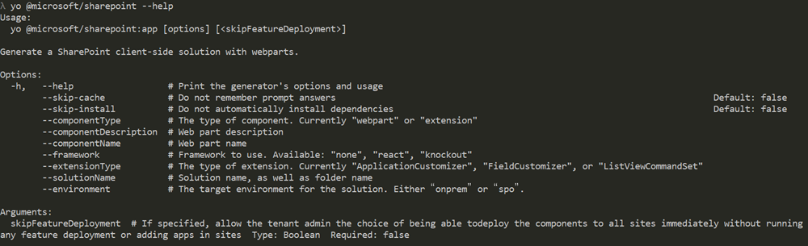

# <a name="scaffold-projects-using-yeoman-sharepoint-generator"></a>Erstellen von Gerüsten für Projekte unter Verwendung des Yeoman-Generators von SharePoint

[Yeoman](http://yeoman.io/) hilft Ihnen bei den ersten Schritten mit neuen Projekten und stellt bewährte Methoden und Tools bereit, mit denen Sie produktiv arbeiten können. Unter Verwendung des Yeoman-Generators von SharePoint können Entwickler Gerüste für neue clientseitige Lösungsprojekte zum Erstellen, Verpacken und Bereitstellen von SharePoint-Lösungen bereitstellen. Der Generator bietet allgemeine Buildtools, Codebausteine und eine allgemeine Textwebsite zum testweisen Hosten von Webparts.

## <a name="installing-the-yeoman-sharepoint-generator"></a>Installieren des Yeoman SharePoint-Generators

Der Yeoman SharePoint-Generator steht als Teil des Framework als ein [npm-Paket](https://www.npmjs.com/package/@microsoft/generator-sharepoint) zur Verfügung. Sie können den Generator installieren, indem Sie den folgenden Befehl in einer Konsole ausführen:

```
npm install @microsoft/generator-sharepoint -g
```

>**Hinweis:** Der Yeoman-Generator für SharePoint ist für die globale Bereitstellung mit der Erstversion General Availability (GA) vorgesehen. Bei lokaler Installation im Projekt treten bekannte Probleme auf, die nach der GA-Version behoben werden.

Es wird empfohlen, dass Sie [die Einrichtung Ihrer Entwicklungsumgebung](../set-up-your-development-environment.md) befolgen, um Ihren Computer mit dem vollständigen Satz der Entwicklertools, einschließlich Yeoman SharePoint-Generator, zu konfigurieren. 

## <a name="using-the-yeoman-sharepoint-generator"></a>Verwenden des Yeoman SharePoint-Generators

Nach der Installation des Generators können Sie den Generator aufrufen, indem Sie einfach den folgenden Befehl in einer Konsole eingeben:

```
yo
```

Der Befehl führt alle der auf Ihrem Computer verfügbaren Generatoren auf. Wählen Sie `@microsoft/sharepoint` aus, um den SharePoint-Generator aufzurufen, und fahren Sie mit den Aufforderungen fort, um die clientseitige Lösung erfolgreich zu erstellen:


## <a name="available-command-line-options-for-the-generator"></a>Verfügbare Befehlszeilenoptionen für den Generator

Sie können die im Yeoman SharePoint-Generator verfügbaren Befehlszeilenoptionen verwenden, um Gerüste für Projekte in einem Befehl anstelle der Aufforderungen zu erstellen. Führen Sie den folgenden Befehl aus, um die Liste der für den SharePoint-Generator verfügbaren Befehlszeilenoptionen anzuzeigen:

```
yo @microsoft/generator-sharepoint --help
```



Option | Beschreibung 
-----|------
--help|Ausgabe der Generator-Optionen und -Nutzung.
--skip-cache|Antworten der Eingabeaufforderungen werden nicht gespeichert. Standard: *False*.
--skip-install|Abhängigkeiten werden nicht automatisch installiert. Standard: *False*.
--componentType|Der Typ der Komponente. Aktuell werden „Webpart“ oder „Erweiterung“ unterstützt.
--componentDescription|Beschreibung der Komponente.
--componentName|Name der Komponente.
--framework|Für die Lösung zu verwendendes Framework. Wählen Sie eine Option aus „Keines“, „React“, „Knockout“ aus.
--extensionType|Der Typ der Erweiterung: Derzeit „ApplicationCustomizer“, „FieldCustomizer“, „ListViewCommandSet“
--solutionName|Clientseitiger Lösungsname und Ordnername.
--environment|Die Zielumgebung für die Lösung. Entweder „onprem“ oder „spo“.

Die folgende Tabelle enthält die verfügbaren Argumente.

Argument | Beschreibung | Typ | Erforderlich |
-- | -- | -- | -- |
skipFeatureDeployment | Wenn angegeben, können Mandantenadministratoren festlegen, ob die Komponenten unmittelbar für alle Websites bereitgestellt werden, ohne die Bereitstellung von Features oder das Hinzufügen von Apps zu Websites. | Boolescher Wert | false | 

Nachfolgend sehen Sie ein Beispiel eines Befehls, der eine Lösung mit dem Namen „hello-world“ mit dem Webpart „HelloWorld“ mit dem Framework „React“ nur für SharePoint Online mit optional aktivierter mandantenweiten Bereitstellung erstellt:

```
yo @microsoft/sharepoint --solutionName "hello-world" --framework "react" --componentType "webpart" --componentName "HelloWorld" --componentDescription "HelloWorld web part" --skip-install --environment "spo" skipFeatureDeployment true
```

> Beachten Sie, dass bei einigen Optionen Abhängigkeiten untereinander bestehen. Sie können zum Beispiel die Erweiterung nicht mit der lokalen Option erstellen.

### <a name="notes-on---skip-install"></a>Hinweise zu --skip-install 

Mithilfe des `--skip-install`-Befehls wird ein Gerüst für das Projekt erstellt, und die Installation von Abhängigkeiten wird übersprungen. Dies bedeutet, dass Sie für ein erfolgreiches Erstellen des Projekts die Abhängigkeiten später installieren müssen, nachdem ein Gerüst für das Projekt erstellt wurde. 

Wenn Sie versuchen, das Projekt zu erstellen, ohne die Abhängigkeiten zu installieren, wird der folgende Fehler zurückgegeben. Dies deutet darauf hin, dass Sie die Abhängigkeiten installieren müssen, bevor Sie das Projekt erstellen:

```
Local gulp not found in ~/<project-name>
Try running: npm install gulp
```

Zum Installieren der Abhängigkeiten können Sie den folgenden Befehl ausführen:

```
npm install
```
